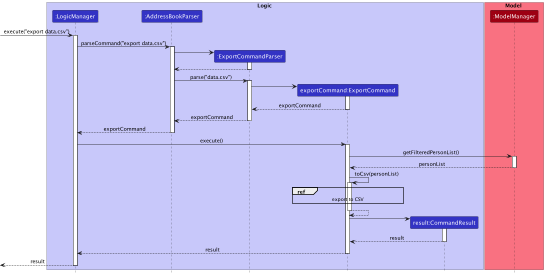

# Table of Contents
1. [Acknowledgements](#1-acknowledgements)
2. [Setting up, getting started](#2-setting-up-getting-started)
3. [Design](#3-design)
   1. [Architecture](#31-architecture)
   2. [UI component](#32-ui-component)
   3. [Logic component](#33-logic-component)
   4. [Model component](#34-model-component)
   5. [Storage component](#35-storage-component)
   6. [Common classes](#36-common-classes)
4. [Implementation Highlights](#4-implementation-highlights)
   1. [Checkout Feature](#41-checkout-feature)
   2. [View Feature](#42-view-feature)
   3. [Import Feature](#43-import-feature)
   4. [Export Feature](#44-export-feature)
   5. [Find Feature Improvements](#45-find-feature-improvements)
5. [Documentation, logging, testing, configuration, dev-ops](#5-documentation-logging-testing-configuration-dev-ops)
6. [Appendix A: Requirements](#6-appendix-a-requirements)
   1. [Product scope](#61-product-scope)
   2. [User stories](#62-user-stories)
   3. [Use cases](#63-use-cases)
   4. [Non-Functional Requirements](#64-non-functional-requirements)
   5. [Glossary](#65-glossary)
7. [Appendix B: Instructions for Manual Testing](#7-appendix-b-instructions-for-manual-testing)
   1. [Launch and shutdown](#71-launch-and-shutdown)
   2. [Adding a person](#72-adding-an-applicant)
   3. [Viewing the detail of an applicant](#73-viewing-the-detail-of-an-applicant)
   4. [Editing an applicant](#74-editing-an-applicant)
   5. [Deleting an applicant](#75-deleting-an-applicant)
   6. [Locating applicants by field](#76-locating-applicants-by-field)
   7. [Importing applicants from an external text file](#77-importing-applicants-from-an-external-json-file)
   8. [Exporting displayed list](#78-exporting-displayed-list)
   9. [Checkout a new or existing list](#79-checkout-a-new-or-existing-list)
   10. [Saving data](#710-saving-data)

--------------------------------------------------------------------------------------------------------------------

## 1. Acknowledgements

* Code base: [addressbook-level3](https://github.com/se-edu/addressbook-level3)

--------------------------------------------------------------------------------------------------------------------

## 2. Setting up, getting started

Refer to the guide [_Setting up and getting started_](SettingUp.md).

--------------------------------------------------------------------------------------------------------------------

## 3. Design

:bulb: **Tip:** The `.puml` files used to create diagrams in this document can be found in the [diagrams](https://github.com/se-edu/addressbook-level3/tree/master/docs/diagrams/) folder. Refer to the [_PlantUML Tutorial_ at se-edu/guides](https://se-education.org/guides/tutorials/plantUml.html) to learn how to create and edit diagrams.

### 3.1 Architecture

The ***Architecture Diagram*** given above explains the high-level design of the App.

Given below is a quick overview of main components and how they interact with each other.

**Main components of the architecture**

**`Main`** has two classes called [`Main`](https://github.com/se-edu/addressbook-level3/tree/master/src/main/java/seedu/address/Main.java) and [`MainApp`](https://github.com/se-edu/addressbook-level3/tree/master/src/main/java/seedu/address/MainApp.java). It is responsible for,
* At app launch: Initializes the components in the correct sequence, and connects them up with each other.
* At shut down: Shuts down the components and invokes cleanup methods where necessary.

[**`Commons`**](#36-common-classes) represents a collection of classes used by multiple other components.

The rest of the App consists of four components.

* [**`UI`**](#32-ui-component): The UI of the App.
* [**`Logic`**](#33-logic-component): The command executor.
* [**`Model`**](#34-model-component): Holds the data of the App in memory.
* [**`Storage`**](#35-storage-component): Reads data from, and writes data to, the hard disk.

**How the architecture components interact with each other**

The *Sequence Diagram* below shows how the components interact with each other for the scenario where the user issues the command `delete 1`.

Each of the four main components (also shown in the diagram above),

* defines its *API* in an `interface` with the same name as the Component.
* implements its functionality using a concrete `{Component Name}Manager` class (which follows the corresponding API `interface` mentioned in the previous point.)

For example, the `Logic` component defines its API in the `Logic.java` interface and implements its functionality using the `LogicManager.java` class which follows the `Logic` interface. Other components interact with a given component through its interface rather than the concrete class (reason: to prevent outside component's being coupled to the implementation of a component), as illustrated in the (partial) class diagram below.

The sections below give more details of each component.

### 3.2 UI component

**API** : [`Ui.java`](https://github.com/se-edu/addressbook-level3/tree/master/src/main/java/seedu/address/ui/Ui.java)

The UI consists of a `MainWindow` that is made up of parts e.g.`CommandBox`, `ResultDisplay`, `PersonListPanel`, `StatusBarFooter` etc. All these, including the `MainWindow`, inherit from the abstract `UiPart` class which captures the commonalities between classes that represent parts of the visible GUI.

The `UI` component uses the JavaFx UI framework. The layout of these UI parts are defined in matching `.fxml` files that are in the `src/main/resources/view` folder. For example, the layout of the [`MainWindow`](https://github.com/se-edu/addressbook-level3/tree/master/src/main/java/seedu/address/ui/MainWindow.java) is specified in [`MainWindow.fxml`](https://github.com/se-edu/addressbook-level3/tree/master/src/main/resources/view/MainWindow.fxml)

The `UI` component,

* executes user commands using the `Logic` component.
* listens for changes to `Model` data so that the UI can be updated with the modified data.
* keeps a reference to the `Logic` component, because the `UI` relies on the `Logic` to execute commands.
* depends on some classes in the `Model` component, as it displays `Person` object residing in the `Model`.

### 3.3 Logic component

**API** : [`Logic.java`](https://github.com/se-edu/addressbook-level3/tree/master/src/main/java/seedu/address/logic/Logic.java)

Here's a (partial) class diagram of the `Logic` component:

How the `Logic` component works:
1. When `Logic` is called upon to execute a command, it uses the `AddressBookParser` class to parse the user command.
2. This results in a `Command` object (more precisely, an object of one of its subclasses e.g., `AddCommand`) which is executed by the `LogicManager`.
3. The command can communicate with the `Model` when it is executed (e.g. to add a person).
4. The result of the command execution is encapsulated as a `CommandResult` object which is returned from `Logic`.

The Sequence Diagram below illustrates the interactions within the `Logic` component for the `execute("delete 1")` API call.

:information_source: **Note:** The lifeline for `DeleteCommandParser` should end at the destroy marker (X) but due to a limitation of PlantUML, the lifeline reaches the end of diagram.

Here are the other classes in `Logic` (omitted from the class diagram above) that are used for parsing a user command:

How the parsing works:
* When called upon to parse a user command, the `AddressBookParser` class creates an `XYZCommandParser` (`XYZ` is a placeholder for the specific command name e.g., `AddCommandParser`) which uses the other classes shown above to parse the user command and create a `XYZCommand` object (e.g., `AddCommand`) which the `AddressBookParser` returns back as a `Command` object.
* All `XYZCommandParser` classes (e.g., `AddCommandParser`, `DeleteCommandParser`, ...) inherit from the `Parser` interface so that they can be treated similarly where possible e.g, during testing.

### 3.4 Model component
**API** : [`Model.java`](https://github.com/se-edu/addressbook-level3/tree/master/src/main/java/seedu/address/model/Model.java)

The `Model` component,

* stores the address book data i.e., all `Person` objects (which are contained in a `UniquePersonList` object).
* stores the currently 'selected' `Person` objects (e.g., results of a search query) as a separate _filtered_ list which is exposed to outsiders as an unmodifiable `ObservableList<Person>` that can be 'observed' e.g. the UI can be bound to this list so that the UI automatically updates when the data in the list change.
* stores a `UserPref` object that represents the user’s preferences. This is exposed to the outside as a `ReadOnlyUserPref` objects.
* does not depend on any of the other three components (as the `Model` represents data entities of the domain, they should make sense on their own without depending on other components)

:information_source: **Note:** An alternative (arguably, a more OOP) model is given below. It has a `Tag` list in the `AddressBook`, which `Person` references. This allows `AddressBook` to only require one `Tag` object per unique tag, instead of each `Person` needing their own `Tag` objects. 

### 3.5 Storage component

**API** : [`Storage.java`](https://github.com/se-edu/addressbook-level3/tree/master/src/main/java/seedu/address/storage/Storage.java)

The `Storage` component,
* can save both address book data and user preference data in json format, and read them back into corresponding objects.
* inherits from both `AddressBookStorage` and `UserPrefStorage`, which means it can be treated as either one (if only the functionality of only one is needed).
* depends on some classes in the `Model` component (because the `Storage` component's job is to save/retrieve objects that belong to the `Model`)

### 3.6 Common classes

Classes used by multiple components are in the `seedu.addressbook.commons` package.

--------------------------------------------------------------------------------------------------------------------

## 4. Implementation Highlights

This section describes some noteworthy details on how certain features are implemented.

### 4.1 Checkout Feature

#### Implementation

The checkout mechanism is facilitated by `CheckoutCommand` that extends `Command`. It is supported by `CheckoutCommandParser` and `AddressBookFile`.

It implements the following operations:

* `CheckoutCommand#execute()` — Executes the command to switch to a particular list stored in the `data` folder parsed from the `userInput` using `CheckoutCommandParser#parse()`.
* `CheckoutCommand#equals()` — Checks whether an instance of a `CheckoutCommand` is equal to another, by checking:
    - Whether they are the same instance
    - Whether the specified list is the same in two different instances

Given below is an example usage scenario and how the checkout mechanism behaves at each step.

Step 1. The user launches the application for the first time. The `Model` and `Storage` will be initialized with the
default list.

Step 2. The user executes `checkout june-2022` command to load the JSON `june-2022.json` to the storage.
The `checkout` command calls `CheckoutCommandParser#parse()`, which checks if the user input is valid, which in turn 
calls `CheckoutCommand#execute()` if it is valid. If the list does not exist in the `data` folder, the list be created 
and populated with sample data. `Model` and `Storage` are then loaded with the specified list and the call returns a 
`CommandResult` to `Logic`.

Step 3. The user executes `checkout addressbook` command to load the default JSON `addressbook.json` to the storage.
The `checkout` command calls `CheckoutCommandParser#parse()`, which checks if the user input is valid, which in turn
calls `CheckoutCommand#execute()` if it is valid. If the list does not exist in the `data` folder, the list be created
and populated with sample data. `Model` and `Storage` are then loaded with the specified list and the call returns a
`CommandResult` to `Logic`.

The following sequence diagram shows how the branch operation works:

The following activity diagram summarizes what happens when a user executes a checkout command:

#### Design considerations

**Aspect: How checkout executes:**

* **Alternative 1 (current choice):** Tell the instance of Storage and Model to load the specified AddressBook.
    * Pros: Will use less memory (e.g. for each AddressBook, just reuse the current instance of Storage and Model).
    * Cons: We must ensure that there are no unintended side effects to the modification of both instances. 
      (e.g. Coupling and Dependencies)

* **Alternative 2 (previous choice):** Create a new instance of Storage and Model that loads the specified AddressBook
  and set it to be used by the application.
    * Pros: Faster to switch between AddressBook since they are already loaded into memory.
    * Cons: May have performance issues in terms of memory usage because a new instance is created for every
      new AddressBook.

### 4.2 View Feature

#### Implementation

To facilitate users to view the details of an applicant, a new class `ViewCommand` is added that extends `Command`.

It implements the following operations:

- `ViewCommand#execute()` — Executes the command to view a particular person in the address book based on the `index` that was parsed from the user input using the `parse` method of `ViewCommandParser`.
- `ViewCommand#equals()` — Checks whether an instance of a `ViewCommand` is equal to another, by checking:
    - Whether they are the same instance
    - Whether the viewed person is the same in two different instances

#### Design considerations

**Aspect: How the UI window is split to show a panel of list of all persons and another panel to view details of a person:**

- **Alternative 1 (current choice):** Window is split into half below the ResultDisplay box.
    - Pros: Symmetrical and looks more regular.
    - Cons: Pane to view details of a person is smaller.
- **Alternative 2:** Window is split from the top, so both CommandTextField and ResultDisplay boxes are halved.
    - Pros: Can have a larger pane to view details of a person.
    - Cons: Need to scroll more to see typed command and result displayed.

### 4.3 Import Feature

The `import` feature allows the user to append their list with another list imported from an external JSON file, instead of asking them to write the applicants one by one into the command line.

#### Implementation

The import feature is done through a `ImportCommand` that extends `Command`. It is supported by `ImportCommandParser` 
and `JsonAddressBookStorage`.

Given below is an example success scenario and how the `import` mechanism behaves at each step.

1. The user executes `import fileName.json`.
2. `LogicManager` calls `AddressBookParser#parseCommand(userInput)`.
3. `LogicManager` calls `ImportCommand#execute(model, storage)`.
4. `ImportCommand` creates a`JsonAddressBookStorage` object using the specified file, and calls 
   `JsonAddressBookStorage#readAddressBook()` to create the `AddressBook` that is going to be appended.
5. `ImportCommand` then calls `Model#appendAddressBook(toAppend)` to append it to the original list. 
6. A `CommandResult` object indicating that the `import` command is successful will be created.

The following sequence diagram shows how the `import` command works:

#### Design Considerations

**Aspect: What format should the imported file be**
* **Alternative 1 (current implementation)**: We use the current `addressbook.json` format.
    * Pros:
        * Same format as the data file, meaning 1 less format to remember.
        * Can be read with current methods.
        * Consistent file formatting across the app's files.
    * Cons:
        * It may take some time for user to get used to the format.
* **Alternative 2**: We use a txt file with a new format
    * Pros:
        * The format may be easier to remember, as it does not have JSON file restrictions.
    * Cons:
        * We need to implement new methods to read the txt file.
        * The format is not consistent with the rest of the app's files.

### 4.4 Export Feature

The `export` feature allows the user to export the displayed list in InternConnect to a JSON file.

#### Implementation

`exportCommand` class is used in the execution of `export` command.
`Storage#exportDisplayedList(displayedList, filePath)` is called to save the JSON file in `data/export/` folder.

Given below is an example success scenario and how the `export` mechanism behaves at each step.

1. The user executes `export`.
2. `LogicManager` calls `AddressBookParser#parseCommand(userInput)`.
3. `LogicManager` calls `ExportCommand#execute(model, storage)`.
4. `ExportCommand` gets current DateTime and use it for the output JSON file path.
5. `ExportCommand` retrieves the `displayedList` from `model` by calling `Model#getFilteredPersonList()`.
6. `ExportCommand` calls `Storage#exportDisplayedList()`
7. The displayedList is stored as a JSON file in `data/export/<currentDateTime>.json`.
8. A `CommandResult` object indicating that the `export` command is successful will be created.

The following sequence diagram shows how the `export` command works:

#### Design Considerations

**Aspect: Where to save the exported JSON file**
* **Alternative 1 (current implementation)**: We save the files in the `data/export/` folder and
  use `<currentDateTime>.json` as the file name.
    * Pros:
        * Location for all exported JSON files is in a single folder.
        * Naming format for all exported JSON files is fixed.
    * Cons:
        * Users will not be able to save the files where they like.
        * Users will be able to name the JSON file as they wish.
* **Alternative 2**: User specifies where to save the JSON file and what to name the file.
    * Pros:
        * Users will be able to save the JSON file where they like.
        * Users will be able to name the JSON file as they wish.
    * Cons:
        * Harder to implement since there will be a lot of cases to cover, e.g. if the specified path is not
          in JSON format or not a valid file path or file already exists etc.
        * Quite messy since the users can specify a completely different file path/directory everytime they
          execute `export` command.
* **Alternative 3**: We save the files in the `data/export/` folder and user specifies only the file name.
    * Pros:
        * Location for all exported JSON files is in a single folder.
        * Users will be able to name the JSON file as they wish.
    * Cons:
        * Harder to implement since there will be a lot of cases to cover, e.g. if the specified file name is not
          in JSON format or file already exists etc.
        * Users will not be able to save the files where they like.

### 4.5 Find Feature Improvements

The `find` feature currently allows the user to search by name among all Persons in store by InternConnect. We want to improve onto this feature to allow Users to search by any possible field of choice

#### Implementation

`findCommand` class is used in the execution of `find` command. The command is then parsed accordingly, with a `NameContainsKeywordsPredicate` as an argument to the command. We now want to extend this with 2 changes:

1. Add a predicate for each appropriate attribute
2. Modify the Parser to appropriately choose the predicates based on a set syntax for its arguments
3. Allow user to choose if they want to do a _substring_ search, or _search all_

Given below is an example success scenario and how the `find` mechanism behaves at each step.

1. The user executes `find`.
2. `LogicManager` calls `AddressBookParser#parseCommand()`.
3. `AddressBookParser#parseCommand()` calls `FindCommand#execute()`.
4. `FindCommand` iterates through list, checking for entries where the filtered predicate is true.
5. `FindCommand` updates the `displayedList` from `model` by calling `Model#updateFilteredPersonList()`.

The following sequence diagram shows how the `find` command works:

#### Design Considerations

**Aspect: Usage of flags**
* **Alternative 1 (current implementation)**: we create a new command for each type of search
    * Pros:
        * All commands current follow this design, allows for consistency in code structure, and follows current OOP design conventions.
        * Naming format for all commands are fixed.
    * Cons:
        * Users will expect the `find` command to be under the same category/usage scenario as a `findAll` command and a `findSubstring` command
* **Alternative 2**: flag is used within the find command to allow usage to select the type of search they want to perform
    * Pros:
        * Users who are already familiar with the `find` command can extend further its power and functionality with flags without "relearning" a new syntax for a different command.
        * Users will find it intuitive that a `find` command is the main overlying command, and within its syntax they can change the way its used, similar to how current CLI commands are implemented
        * Future commands which want to use flags can build onto the newly restructured code
    * Cons:
        * Harder to implement since a flag is a brand-new functionality which other commands do not have. Coupled classes have to be modified accordingly, such as the relevant parser classes and argumentTokenizer/Multimap
        * Flags introduce the possibility for more input types to consider, and these affects the inputs that users can use in all commands
        * Requires restructuring old code, which will increase testing time and possibility of introducing bugs into existing code
*  **Alternative 3**: Choose a search type for each field type
    * Pros:
        * Allow for multiple field searches where the search within each field is curated to best search the available field values
        * Intuitive and easy for Users to use
        * Less syntax and user input required in comparison to _alternative 2_
    * Cons:
        * Limits User's freedom in how they want to search
        * Search type for the field may not be how the User wants to search

--------------------------------------------------------------------------------------------------------------------

## 5. Documentation, logging, testing, configuration, dev-ops

* [Documentation guide](Documentation.md)
* [Testing guide](Testing.md)
* [Logging guide](Logging.md)
* [Configuration guide](Configuration.md)
* [DevOps guide](DevOps.md)

--------------------------------------------------------------------------------------------------------------------

## 6. Appendix A: Requirements

### 6.1 Product scope

**Target user profile**:

* is an internship campus recruiter
* has a need to manage a significant number of applicants
* prefer desktop apps over other types
* can type fast
* prefers typing to mouse interactions
* is reasonably comfortable using CLI apps

**Value proposition**: 
a one-stop, convenient, and efficient platform to manage and empower 
how internship campus recruiters work with their applicants’ data. 
Say goodbye to opening multiple windows to retrieve the information you need and 
focus on what matters more: matching the right people for the right job.

### 6.2 User stories

Priorities: High (must have) - `* * *`, Medium (nice to have) - `* *`, Low (unlikely to have) - `*`

| Priority | As a ...                          | I want to ...                                                                            | So that I can ...                                                                                                                |
|----------|-----------------------------------|------------------------------------------------------------------------------------------|----------------------------------------------------------------------------------------------------------------------------------|
| `* * *`  | potential user exploring the app  | see the sample data                                                                      | easily play around and understand how the app works                                                                              |
| `* * *`  | new user                          | see the list of available things I can do with the app                                   | learn how to use the app fully                                                                                                   |
| `* * *`  | new user                          | read the user guide                                                                      | I understand all the commands and features available in the app before using it                                                  |
| `* * *`  | user                              | delete fields and data                                                                   |                                                                                                                                  | 
| `* * *`  | user                              | add applicants                                                                           |                                                                                                                                  |
| `* * *`  | user                              | mass add applicants' data                                                                | conveniently import my data quickly and without hassle                                                                           |
| `* * *`  | user                              | view all details of my selected Applicant                                                | avoid opening and working with multiple files                                                                                    |
| `* * *`  | user                              | see the summary statistics of my data                                                    | have a higher-level view of the data                                                                                             |
| `* * *`  | user ready to start using the app | clear all current data                                                                   | get rid of sample/experimental data I used for exploring the app                                                                 |
| `* * *`  | user                              | close the app by inputting "exit" command                                                |                                                                                                                                  |
| `* * *`  | user                              | add an additional value to the field I am inserting                                      | if my value is currently not in the list (e.g. list of Universities, list of Majors) so that I can enter my data more accurately |
| `* * *`  | user                              | delete the existing values in a field                                                    | so that I easily modify and customise my value for a field (e.g. Major, University)                                              |
| `* *`    | user                              | add an open Role                                                                         | keep track of who applied to the role                                                                                            |
| `* * *`  | user                              | search for applicants by name                                                            | quickly find what I need                                                                                                         |
| `* *`    | user                              | filter applicants based on certain fields/criteria/categories                            | obtain filtered data based on the criteria that I want                                                                           |
| `* *`    | user                              | archive old data                                                                         | see the last few months/years data only                                                                                          |
| `* * `   | user                              | auto-archive applicants data and store the updated one when they applied to another role | see only the updated data of the applicant and all the roles the applied to                                                      |
| `* * `   | user                              | see the archived data                                                                    | see how the applicants progress over the time                                                                                    |
| `* *`    | user                              | see the summary statistics of a particular applicant's details                           | see how they progress over the time                                                                                              |
| `*`      | user                              | give KIV tag to applicants                                                               |                                                                                                                                  |
| `*`      | user                              | customize my UI/UX settings e.g., Colour settings, font size                             | cater the application to my needs                                                                                                |
| `*`      | user                              | add references to external documents to my records                                       | keep things related to each other easily accessible                                                                              |
| `* *`    | user                              | have different key views which contain important related data                            | package and de-clutter unneeded data and focus on what's at hand                                                                 |
| `* * *`  | user                              | modify current fields                                                                    | keep my data up to date                                                                                                          |
| `*`      | user                              | make and customize my own views                                                          | get to decide what groups of data matter to my, and empower myself on what I care about                                          |
| `* * *`  | user                              | edit my data manually just by inputting a command to the query                           | so that I can modify it in a shorter time in case of a typo.                                                                     |
| `* *  `  | user                              | edit key information that I care about conveniently from my high-level view              | so that I can keep my focus to do what matters                                                                                   |
| `* * *`  | user                              | update my data for existing applicants                                                   | so that I can view their latest details in case of reapplication                                                                 |
| `*    `  | user                              | delete applicants that I note as unqualified                                             | so that I do not waste too much space                                                                                            |
| `* *  `  | user                              | create new applicant attributes                                                          | so that I can easily describe applicants based on my preference                                                                  |
| `*    `  | user                              | view a data visualization/dashboard                                                      | so that I can easily and visually get the key information I need and care about                                                  |
| `* *  `  | user                              | customize my UI/UX settings e.g., Color settings, font size                              | so that the application can cater to my needs                                                                                    |
| `*    `  | user                              | make my own pseudo commands/macros                                                       | so that I can improve my efficiency with the app                                                                                 |
| `* * *`  | user                              | import data from others                                                                  | so that I can receive resources from other users                                                                                 |
| `* * *`  | user                              | export my data                                                                           | so that I can share resources with others                                                                                        |
| `* *  `  | user                              | add a custom field to my data                                                            | so that I can have more flexible records                                                                                         |
| `*    `  | user                              | add profile pictures to my records                                                       | so that I can see who I’m looking at                                                                                             |

### 6.3 Use cases

(For all use cases below, the **System** is the `InternConnect` and the **Actor** is the `user`, unless specified otherwise)

**Use case: Add an applicant**

**MSS**

1.  User requests to add an applicant with its specifiers
2.  InternConnect adds an applicant
3.  InternConnect shows the updated list of applicants

    Use case ends.

**Extensions**

* 3a. The given format is invalid.

    * 3a1. InternConnect shows an error message.

      Use case ends.

**Use case: Modify an applicant**

**MSS**

1.  User requests to modify an applicant with its specifiers
2.  InternConnect modifies the applicant
3.  InternConnect shows the updated applicant

    Use case ends.

**Extensions**

* 1a. InternConnect detects that the specifiers given is invalid.

    * 1a1. InternConnect shows an error message.

      Use case ends.

* 1b. InternConnect detects that the INDEX given is invalid.

    * 1b1. InternConnect shows an error message.

      Use case ends.

**Use case: Delete an applicant**

**MSS**

1.  User requests to list applicants
2.  InternConnect shows a list of applicants
3.  User requests to delete a specific applicant in the list
4.  InternConnect deletes the applicant
5.  InternConnect shows the updated list of applicants

    Use case ends.

**Extensions**

* 2a. The list is empty.

  Use case ends.

* 3a. The given index is invalid.

    * 3a1. InternConnect shows an error message.

      Use case resumes at step 2.

**Use case: View an applicant**

**MSS**

1.  User requests to view an applicant of a particular index number
2.  InternConnect shows the detailed data of the applicant

    Use case ends.

**Extensions**

* 1a. The given index number is invalid.

    * 1a1. InternConnect shows an error message.

      Use case ends.

**Use case: Import applicants from an external json file**

**MSS**

1.  User requests to import applicants from a json file
2.  InternConnect adds all applicants
3.  InternConnect shows the updated list of applicants

    Use case ends.

**Extensions**

* 1a. The given file path is invalid or is not a json file.

    * 1a1. InternConnect shows an error message.

      Use case ends.

* 1b. The given file has invalid value, incorrect format, and/or duplicate persons.

    * 1b1. InternConnect shows an error message.

      Use case ends.

**Use case: Exit**

**MSS**

1.  User requests to exit from InternConnect
2.  InternConnect is closed

    Use case ends.

**Use case: Help**

**MSS**

1. User requests for help
2. InternConnect shows a pop-up window with the link to the User Guide
    
    Use case ends.

**Use case: Find an applicant**

**MSS**

1. User requests to find all applicants with matching keywords in its specified fields
2. InternConnect lists all applicants who match the request

    Use case ends.

**Extensions**

* 1a. The list is empty.

  Use case ends.

* 1b. The given specifier(s) are invalid.

    * 1b1. InternConnect shows an error message.

      Use case ends.

### 6.4 Non-Functional Requirements

1.  Should work on any _mainstream OS_ as long as it has Java `11` or above installed.
2.  Should be able to hold up to 1000 applicants without a noticeable sluggishness in performance for typical usage.
3.  A user with above average typing speed for regular English text (i.e. not code, not system admin commands) 
    should be able to accomplish most of the tasks faster using commands than using the mouse.
4.  GUI should be color-blind friendly
5.  Data should be stored locally and not use any database management system.
6.  The application should work with a single JAR file, and should work without requiring an installer.
7.  The application size should not exceed 100MB.
8.  Application should not use more than 4GB of RAM.
9.  The product should be for a single user i.e. (not a multi-user product).
10. The data should be stored locally and should be in a human editable text file.
11. The GUI should work well (i.e., should not cause any resolution-related inconveniences to the user) for, 
    standard screen resolutions 1920x1080 and higher, and, for screen scales 100% and 125%. 
    
    In addition, the GUI should be usable (i.e., all functions can be used even if the user experience is not optimal) for, 
    resolutions 1280x720 and higher, and, for screen scales 150%.

*{More to be added}*

### 6.5 Glossary

* **Applicant**: An applicant refers to a person who has applied for a role. 
  Applicant and Person can be used interchangeably as they refer to the same thing.
* **Role**: Role and Job are used interchangeably. They refer to a job opening that an applicant applied for.
* **Command Line Interface (CLI)**: Text-based user interface
* **Graphical User Interface (GUI)**: Graphic-based user interface
* **Mainstream OS**: Windows, Linux, Unix, OS-X

--------------------------------------------------------------------------------------------------------------------

## 7. Appendix B: Instructions for manual testing

Given below are instructions to test the app manually.

:information_source: **Note:** These instructions only provide a starting point for testers to work on;
testers are expected to do more *exploratory* testing.

### 7.1 Launch and shutdown

1. Initial launch

   1. Download the jar file and copy into an empty folder

   2. Double-click the jar file Expected: Shows the GUI with a set of sample contacts.

2. Saving window preferences

   1. Resize the window to an optimum size. Move the window to a different location. Close the window.

   2. Re-launch the app by double-clicking the jar file. 
       Expected: The most recent window size and location is retained.

### 7.2 Adding an applicant

1. Adding an applicant to InternConnect

   1. Prerequisites: No applicant with the email `johnd@example.com`

   2. Test case: `add add n/John Doe p/98765432 e/johnd@example.com a/311, Clementi Ave 2, #02-25 c/3.50/4.00 g/male 
      u/Nanyang Polytechnic gd/05-2024 m/Computer Science ji/J12300 jt/Software Engineer Intern t/rejected t/KIV` 
      Expected: An applicant named John Doe is added. Details of the added applicant shown in the right panel. Success 
      message shown in the status message.

2. Adding a duplicate applicant to InternConnect

   1. Prerequisites: There exists an applicant with email `johndoe@example.com` and jobID `J12300`
   
   2. Test case: `add add n/John Doe p/98765432 e/johndoe@example.com a/311, Clementi Ave 2, #02-25 c/3.50/4.00 g/male
      u/Nanyang Polytechnic gd/05-2024 m/Computer Science ji/J12300 jt/Software Engineer Intern t/rejected t/KIV` 
      Expected: No applicant is added. Error details shown in the status message.

3. Other incorrect `add` commands to try: `add`, `add n/John`, `add 1` 
   Expected: No applicant is added. Error details shown in the status message.

### 7.3 Viewing the detail of an applicant

1. tc description

   1. Prerequisites: 

   2. Test case: 

2. more tc

### 7.4 Editing an applicant

1. tc description

   1. Prerequisites:

   2. Test case:

2. more tc

### 7.5 Deleting an applicant

1. Deleting an applicant while all applicants are being shown

   1. Prerequisites: List all applicants using the `list` command. Multiple applicants in the list.

   2. Test case: `delete 1` 
      Expected: First applicant is deleted from the list. Details of the deleted applicant shown in the status message.
      Success message shown in the status message.

2. Deleting a non-positive index
   
   1. Prerequisites: List all applicants using the `list` command. Multiple applicants in the list.
      
   2. Test case: `delete 0` 
      Expected: No applicant is deleted. Error details shown in the status message.

3. Other incorrect delete commands to try: `delete`, `delete john`, `delete x`(where `x` is larger than the list size) 
   Expected: No applicant is deleted. Error details shown in the status message.

### 7.6 Locating applicants by field

1. tc description

   1. Prerequisites:

   2. Test case:

2. more tc

### 7.7 Importing applicants from an external JSON file

1. Importing several applicants from an external JSON file

   1. Prerequisites: There exists a valid file named `test.json` with the correct formatting, no duplicate applicants, 
      and valid data values.

   2. Test case: `import test.json` 
      Expected: All applicants inside `test.json` will be appended to the list. Success message shown in the status message.

2. Importing an external JSON file with invalid format, duplicate applicant, or invalid data values

   1. Prerequisites: There exists a file named `format.json` with incorrect formatting, `duplicate.json` with 
      duplicate applicants, and `invalid.json` with invalid data values.

   2. Test case: `import format.json` 
      Expected: No applicant is added. Template file created in `data/template/template.json`. Error details shown in 
      the status message.
   
   3. Test case: `import duplicate.json` 
      Expected: No applicant is added. Template file created in `data/template/template.json`. Error details shown in
      the status message.
   
   4. Test case: `import invalid.json` 
      Expected: No applicant is added. Template file created in `data/template/template.json`. Error details shown in
      the status message.

3. Other incorrect import commands to try: `import`, `import folderName`(where `folderName` is a folder) 
   Expected: No applicant is added. Error details shown in the status message.

### 7.8 Exporting displayed list

1. tc description

   1. Prerequisites:

   2. Test case:

2. more tc

### 7.9 Checkout a new or existing list

1. tc description

   1. Prerequisites:

   2. Test case:

2. more tc

### 7.10 Saving data

1. Dealing with missing/corrupted data files

   1. If the data is missing/corrupted, InternConnect will start with an empty data file, replacing the corrupted data
      with an empty one.
