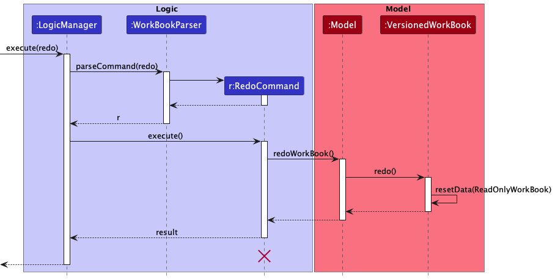
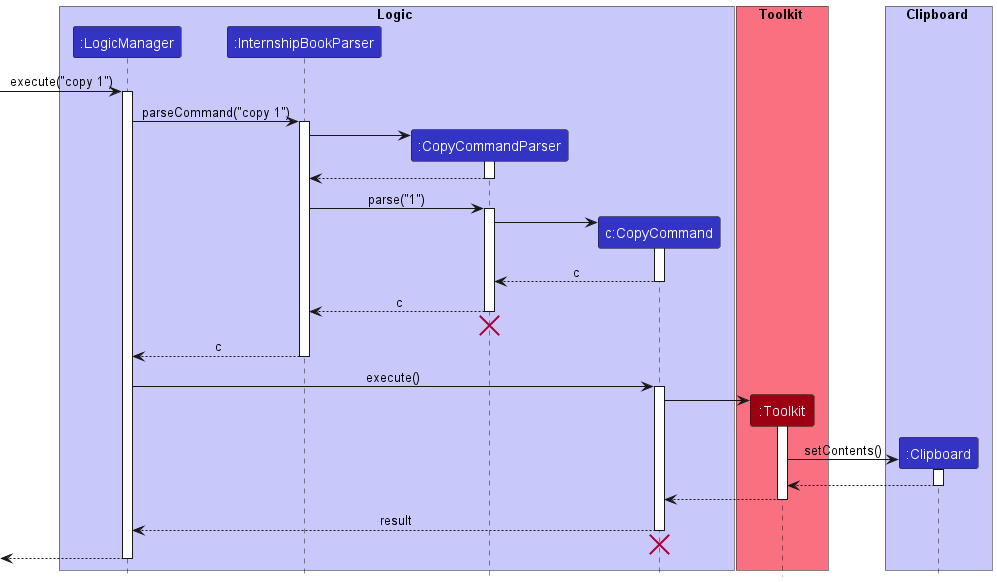
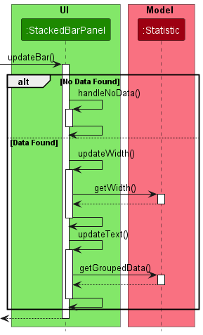

PleaseHireUs (PHU) is an internship tracking application specially customised for CS students who are struggling to 
keep track of their applications. PHU has been optimized for use via a Command Line Interface (CLI) while still 
having the benefits of a Graphical User Interface (GUI). Fast typist would be able to work more efficiently.

{:style="display:block; margin-left:auto; margin-right:auto"}

* Table of Contents
{:toc}

--------------------------------------------------------------------------------------------------------------------

## **Acknowledgements**

* This project is adapted from **[AddressBook 3(AB3)](https://github.com/se-edu/addressbook-level3)**
* Undo and Redo commands are adapted and modified from  **[AddressBook 4(AB4)](https://github.com/se-edu/addressbook-level4)**
* Libraries used: [JavaFX](https://openjfx.io/), [Jackson](https://github.com/FasterXML/jackson), [JUnit5](https://github.com/junit-team/junit5), [TestFx](https://github.com/TestFX/TestFX)
* The PleaseHireUs icon is obtained from [flaticon](https://www.flaticon.com/free-icon/please_599536)

--------------------------------------------------------------------------------------------------------------------
## **About this Developer Guide**

This guides aims to:  

1. Provide developers with a brief overview of the design architecture of our product.
2. Explain some design considerations in the development of the application.
3. Provide interested developers with documentations to continue development of our product.

--------------------------------------------------------------------------------------------------------------------
## **Navigating the Developer Guide**
**Information Box**

**:information_source: Info:** Provides extra information that is useful

**Tip Box**

**:bulb: Tip:** Provides pointers to enhance your experience 

**Warning Box**

**:exclamation: Warning: Important messages**

**Highlights**  
`commands` or `PARAMETERS` or `Class` or `Component`

**Keyboard Inputs** 

<button>enter</button>   <button>&uarr;</button>   <button>&darr;</button>

--------------------------------------------------------------------------------------------------------------------
## **Setting up, getting started**

Refer to the guide [_Setting up and getting started_](SettingUp.md).

--------------------------------------------------------------------------------------------------------------------

## **Design**

:bulb: **Tip:** The `.puml` files used to create diagrams in this document can be found in the [diagrams](https://github.com/AY2223S1-CS2103T-W17-4/tp/tree/master/docs/diagrams/) folder. Refer to the [_PlantUML Tutorial_ at se-edu/guides](https://se-education.org/guides/tutorials/plantUml.html) to learn how to create and edit diagrams.

### Architecture

The ***Architecture Diagram*** given above explains the high-level design of the App.

Given below is a quick overview of main components and how they interact with each other.

**Main components of the architecture**

**`Main`** has two classes called [`Main`](https://github.com/AY2223S1-CS2103T-W17-4/tp/tree/master/src/main/java/seedu/phu/Main.java) and [`MainApp`](https://github.com/AY2223S1-CS2103T-W17-4/tp/tree/master/src/main/java/seedu/phu/MainApp.java). It is responsible for,
* At app launch: Initializes the components in the correct sequence, and connects them up with each other.
* At shut down: Shuts down the components and invokes cleanup methods where necessary.

[**`Commons`**](#common-classes) represents a collection of classes used by multiple other components.

The rest of the App consists of four components.

* [**`UI`**](#ui-component): The UI of the App.
* [**`Logic`**](#logic-component): The command executor.
* [**`Model`**](#model-component): Holds the data of the App in memory.
* [**`Storage`**](#storage-component): Reads data from, and writes data to, the hard disk.

**How the architecture components interact with each other**

The *Sequence Diagram* below shows how the components interact with each other for the scenario where the user issues the command `delete 1`.

Each of the four main components (also shown in the diagram above),

* defines its *API* in an `interface` with the same name as the Component.
* implements its functionality using a concrete `{Component Name}Manager` class (which follows the corresponding API `interface` mentioned in the previous point.

For example, the `Logic` component defines its API in the `Logic.java` interface and implements its functionality using the `LogicManager.java` class which follows the `Logic` interface. Other components interact with a given component through its interface rather than the concrete class (reason: to prevent outside component's being coupled to the implementation of a component), as illustrated in the (partial) class diagram below.

The sections below give more details of each component.

### UI component

The **API** of this component is specified in [`Ui.java`](https://github.com/AY2223S1-CS2103T-W17-4/tp/tree/master/src/main/java/seedu/phu/ui/Ui.java)

The UI consists of a `MainWindow` that is made up of parts e.g.`CommandBox`, `ResultDisplay`, `InternshipListPanel`, `ReminderBarFooter`, `ViewCommandPanel`, `StackedBarPanel` etc. All these, including the `MainWindow`, inherit from the abstract `UiPart` class which captures the commonalities between classes that represent parts of the visible GUI.

The `UI` component uses the JavaFx UI framework. The layout of these UI parts are defined in matching `.fxml` files that are in the `src/main/resources/view` folder. For example, the layout of the [`MainWindow`](https://github.com/AY2223S1-CS2103T-W17-4/tp/tree/master/src/main/java/seedu/phu/ui/MainWindow.java) is specified in [`MainWindow.fxml`](https://github.com/AY2223S1-CS2103T-W17-4/tp/tree/master/src/main/resources/view/MainWindow.fxml)

The `UI` component,

* executes user commands using the `Logic` component.
* listens for changes to `Model` data so that the UI can be updated with the modified data.
* keeps a reference to the `Logic` component, because the `UI` relies on the `Logic` to execute commands.
* depends on some classes in the `Model` component, as it displays `Internship` object residing in the `Model`.

### Logic component

**API** : [`Logic.java`](https://github.com/AY2223S1-CS2103T-W17-4/tp/tree/master/src/main/java/seedu/phu/logic/Logic.java)

Here's a (partial) class diagram of the `Logic` component:

How the `Logic` component works:
1. When `Logic` is called upon to execute a command, it uses the `InternshipBookParser` class to parse the user command.
1. This results in a `Command` object (more precisely, an object of one of its subclasses e.g., `AddCommand`) which is executed by the `LogicManager`.
1. The command can communicate with the `Model` when it is executed (e.g. to add an internship).
1. The result of the command execution is encapsulated as a `CommandResult` object which is returned back from `Logic`.

The Sequence Diagram below illustrates the interactions within the `Logic` component for the `execute("delete 1")` API call.

:information_source: **Note:** The lifeline for `DeleteCommandParser` and `DeleteCommand` should end at the destroy marker (X) but due to a limitation of PlantUML, the lifeline reaches the end of diagram.

Here are the other classes in `Logic` (omitted from the class diagram above) that are used for parsing a user command:

How the parsing works:
* When called upon to parse a user command, the `InternshipBookParser` class creates an `XYZCommandParser` (`XYZ` is a placeholder for the specific command name e.g., `AddCommandParser`) which uses the other classes shown above to parse the user command and create a `XYZCommand` object (e.g., `AddCommand`) which the `InternshipBookParser` returns back as a `Command` object.
* All `XYZCommandParser` classes (e.g., `AddCommandParser`, `DeleteCommandParser`, …​) inherit from the `Parser` interface so that they can be treated similarly where possible e.g, during testing.

### Model component
**API** : [`Model.java`](https://github.com/AY2223S1-CS2103T-W17-4/tp/tree/master/src/main/java/seedu/phu/model/Model.java)

The `Model` component,

* stores the internship book data i.e., all `Internship` objects (which are contained in a `UniqueInternshipList` object).
* stores the currently 'selected' `Internship` objects (e.g., results of a search query) as a separate _filtered_ list which is exposed to outsiders as an unmodifiable `ObservableList<Internship>` that can be 'observed' e.g. the UI can be bound to this list so that the UI automatically updates when the data in the list change.
* stores a `UserPref` object that represents the user’s preferences. This is exposed to the outside as a `ReadOnlyUserPref` objects.
* does not depend on any of the other three components (as the `Model` represents data entities of the domain, they should make sense on their own without depending on other components)

:information_source: **Note:** An alternative (arguably, a more OOP) model is given below. It has a `Tag` list in the `InternshipBook`, which `Internship` references. This allows `InternshipBook` to only require one `Tag` object per unique tag, instead of each `Internship` needing their own `Tag` objects. 

### Storage component

**API** : [`Storage.java`](https://github.com/AY2223S1-CS2103T-W17-4/tp/tree/master/src/main/java/seedu/phu/storage/Storage.java)

The `Storage` component,
* can save both internship book data and user preference data in json format, and read them back into corresponding objects.
* inherits from both `InternshipBookStorage` and `UserPrefStorage`, which means it can be treated as either one (if only the functionality of only one is needed).
* depends on some classes in the `Model` component (because the `Storage` component's job is to save/retrieve objects that belong to the `Model`)

### Common classes

Classes used by multiple components are in the `seedu.phu.commons` package.

--------------------------------------------------------------------------------------------------------------------

## **Implementation**

This section describes some noteworthy details on how certain features are implemented.

:information_source: **Note:** The lifeline for some components should end at the destroy marker (X) but due to a limitation of PlantUML, the lifeline reaches the end of diagram.

### Add feature

#### Proposed Implementation
The implementation of the add command involves creating a new `Internship` objects and storing them in the 
InternshipBook.json using the `JsonAdaptedInternship` class.

The add command has the following fields:
- `n/` prefix followed by the name of the company
- `p/` prefix followed by the name of the position
- `pr/` prefix followed by the application status (Optional)
- `d/` prefix followed by important dates to be taken note of (Optional)
- `ph/` prefix followed by the phone number of the HR (Optional)
- `e/` prefix followed by the email of the HR (Optional)
- `web/` prefix followed by the website link for more internship details (Optional)
- `r/` prefix followed by any additional remarks (Optional)
- `t/` prefix followed by relevant tags (Optional)

The system will validate the parameters supplied by the user. When input validation fails, error message specifying the
first identified error will be shown to the user.

The following sequence diagram shows how the add command works.

#### Design Considerations
**Whether an internship application can be added without all attributes**:
* **Alternative 1 (current choice)**: Allow for optional parameters with default values
    * Pros: Enhances users' convenience
    * Cons: Modifications of `equals` method for optional parameters required
  
* **Alternative 2** All parameters must be filled up
    * Pros: Easier to implement
    * Cons: Lengthy command

### Delete feature

#### Proposed Implementation
PHU allows user to delete multiple internships in one command. The proposed delete mechanism involves keeping track of the positions of `Internship` to be deleted, which is implemented by using `Indexes` class, and deleting all the corresponding internships.

The following sequence diagram shows how the delete command works.

#### Design considerations
**How to keep track of the positions of `Internship` to be deleted**:
* **Alternative 1 (current choice)**: Use a new class called `Indexes`
  * Pros: Improve maintainability
  * Cons: Harder to implement

* **Alternative 2** Use `java.util.Set`
  * Pros: Easier to implement
  * Cons: Harder to maintain in the future

### Edit feature

#### Proposed Implementation
The proposed edit mechanism involves creating a new `Internship` object and replacing the previous `Internship` object to be edited. It's mainly implemented using the help of `EditInternshipDescriptor` class, which can create a new Internship given the edited fields.

Similar to add command, the edit command has the following fields:
- `INDEX` which represents the position of the internship to be edited
- `n/` prefix followed by the edited name of the company (Optional)
- `p/` prefix followed by the edited name of the position (Optional)
- `pr/` prefix followed by the edited application status (Optional)
- `d/` prefix followed by the edited important dates to be taken note of (Optional)
- `ph/` prefix followed by the edited phone number of the HR (Optional)
- `e/` prefix followed by the edited email of the HR (Optional)
- `web/` prefix followed by the edited website link for more internship details (Optional)
- `r/` prefix followed by the edited additional remarks (Optional)
- `t/` prefix followed by edited tags (Optional)

Although the nine prefixes shown above are all optional, the system still require user to edit at least one prefix. Similar to the add command, the system will also validate the parameters supplied by the user.

The following sequence diagram shows how the edit command works

#### Design Considerations
**Whether editing an internship will create a new internship**:
* **Alternative 1(Current choice)**: Edit command will create a new internship
    * Pros: Help maintains the immutability of `Internship` class
    * Cons: Not the most efficient way
* **Alternative 2**: Edit command will not create a new internship. It will directly edit the selected internship
    * Pros: More efficient, both time and space wise, than the previous alternative
    * Cons: `Internship` class won't be immutable, which reduces the defensiveness of the program
  
### List feature

#### Proposed Implementation
The proposed list mechanism is implemented mainly using the help of `ListCommandParser` and `ComparableCategoryParser` 
classes. The `ListCommand` class extends the `Command` class and implements `ListCommand#execute`. The `list` command 
can be used to show all existing internships stored in the system and have the option to sort the internships by the 
specified category.

The following sequence diagram shows how the find command works.

#### Design Considerations
**Parameters for list command**:
* **Alternative 1 (current choice)**: `CATEGORY` and `DESCENDING` parameter is optional 
    * Pros: Improved flexibility
    * Cons: Need to have conditional checks in Parser class

* **Alternative 2** Users have to input all parameters
    * Pros: Easier to implement
    * Cons: Command is longer and more cumbersome to type
    
    

    

### Find feature

#### Proposed Implementation
The proposed find mechanism is implemented mainly using the help of `ContainsKeywordPredicate`
It implements `Predicate<Internship>` where the test method checks if the data in a certain category
of the Internship matches any of the specified keywords.

The predicate is used in the Model interface on the `updateFilteredInternshipList` method

The following sequence diagram shows how the find command works.

#### Design Considerations
**How to filter the Internships**:
* Use a class for the predicate and `javafx.collections.transformation.FilteredList` (current))
  * Pros: Simple, Better cohesion, more maintainability
  * Cons: More code to write

**How to keep track of the list of `Keyword`**:
* **Alternative 1 (current choice)**: Use a new class called `KeywordList`
  * Pros: Improved flexibility and maintability
  * Cons: More methods to implement

* **Alternative 2** Use `java.util.Set`:
  * Pros: Easier to implement
  * Cons: Lower maintainability

**Parameters for find command**:
* **Alternative 1 (current choice)**: `CATEGORY` parameter is optional
    * Pros: Improved quality of life for the user
    * Cons: Need to have conditional checks in Parser class

* **Alternative 2** Users have to input all parameters
    * Pros: Easier to implement
    * Cons: Command is longer and more cumbersome to type

### Undo/redo feature

#### Proposed Implementation

The proposed undo/redo mechanism is facilitated by `VersionedInternshipBook`. It extends `InternshipBook` with an undo/redo history, stored internally as an `internshipBookStateList` and `currentStatePointer`. Additionally, it implements the following operations:

* `VersionedInternshipBook#commitChange()` — Saves the current internship book state in its history.
* `VersionedInternshipBook#undo()` — Restores the previous internship book state from its history, if exists.
* `VersionedInternshipBook#redo()` — Restores a previously undone internship book state from its history, if exists.

These operations are exposed in the `Model` interface as `Model#commitInternshipBook()`, `Model#undoInternshipBook()` and `Model#redoInternshipBook()` respectively.

Besides `VersionedInternshipBook`, undo/redo mechanism is also helped by `CommandHistory`. It exists inside `LogicManager` and implements the following operation,

* `CommandHistory#getPreviousModifyCommand()` — Get the command to be undone, if exists.
* `CommandHistory#getNextModifyCommand()`Get the command to be redone, if exists.

In essence, `CommandHistory` will enable the undo and redo command to show which command was undone/redone, which gives a better user experience.

Given below is an example usage scenario and how the undo/redo mechanism behaves at each step.

Step 1. The user launches the application for the first time. The `VersionedInternshipBook` will be initialized with the initial internship book state, and the `currentStatePointer` pointing to that single internship book state.

Step 2. The user executes `delete 1` command to delete the 1st internship in the internship book. The `delete` command calls `Model#commitInternshipBook()`, causing the modified state of the internship book after the `delete 1` command executes to be saved in the `internshipBookStateList`, and the `currentStatePointer` is shifted to the newly inserted internship book state.

Step 3. The user executes `add n/Optiver p/Quant` to add a new internship. The `add` command also calls `Model#commitInternshipBook()`, causing another modified internship book state to be saved into the `internshipBookStateList`.

:information_source: **Note:** If a command fails its execution, it will not call `Model#commitInternshipBook()`, so the internship book state will not be saved into the `internshipBookStateList`.

Step 4. The user now decides that adding the internship was a mistake, and decides to undo that action by executing the `undo` command. The `undo` command will call `Model#undoInternshipBook()`, which will shift the `currentStatePointer` once to the left, pointing it to the previous internship book state, and restores the internship book to that state.

:information_source: **Note:** If the `currentStatePointer` is at index 0, pointing to the initial InternshipBook state, then there are no previous InternshipBook states to restore. The `undo` command uses `Model#canUndoInternshipBook()` to check if this is the case. If so, it will return an error to the user rather
than attempting to perform the undo.

The following sequence diagram shows how the undo operation works:

The `redo` command does the opposite — it calls `Model#redoInternshipBook()`, which shifts the `currentStatePointer` once to the right, pointing to the previously undone state, and restores the internship book to that state.

The following sequence diagram shows how the redo command works:

:information_source: **Note:** If the `currentStatePointer` is at index `internshipBookStateList.size() - 1`, pointing to the latest internship book state, then there are no undone InternshipBook states to restore. The `redo` command uses `Model#canRedoInternshipBook()` to check if this is the case. If so, it will return an error to the user rather than attempting to perform the redo.

Step 5. The user then decides to execute the command `list`. Commands that do not modify the internship book, such as `list`, will usually not call `Model#commitInternshipBook()`, `Model#undoInternshipBook()` or `Model#redoInternshipBook()`. Thus, the `internshipBookStateList` remains unchanged.

Step 6. The user executes `clear`, which calls `Model#commitInternshipBook()`. Since the `currentStatePointer` is not pointing at the end of the `internshipBookStateList`, all internship book states after the `currentStatePointer` will be purged. Reason: It no longer makes sense to redo the `add n/Optiver p/Quant` command. This is the behavior that most modern desktop applications follow.

The following activity diagram summarizes what happens when a user executes a new command:

#### Design considerations:

**Aspect: How undo & redo executes:**

* **Alternative 1 (current choice):** Saves the entire internship book.
  * Pros: Easy to implement.
  * Cons: May have performance issues in terms of memory usage.

* **Alternative 2:** Individual command knows how to undo/redo by
  itself.
  * Pros: Will use less memory (e.g. for `delete`, just save the internship being deleted).
  * Cons: Quite hard to implement as we must ensure that the implementation of each individual command are correct

### View feature

#### Proposed Implementation
The proposed view mechanism is implemented mainly using the help of `ExactMatchPredicate`.
It implements `Predicate<Internship>` where the test method looks for the exact match of the internship requested.

The predicate is used in the Model interface on the `updateViewItem` method

The following sequence diagram shows how the view command works.

#### Design Considerations
**How to view the Internship**:
* Use a class for the predicate and `javafx.collections.transformation.FilteredList` (current)
    * Pros: Simple, Better cohesion, more maintainability
    * Cons: More code to write

**How to display the internship in view panel**:
* **Alternative 1 (current choice)**: Fully display with prefix denoting category
    * Pros: More descriptive and easier to understand
    * Cons: Makes UI seem wordy

* **Alternative 2** Only display details with no category
    * Pros: Looks cleaner
    * Cons: Difficult to understand for new users

**Parameters for view command**:
* **Alternative 1 (current choice)**: `INDEX` parameter only takes in one index
    * Pros: Easier to implement
    * Cons: User will have to use the `view` command multiple times to view multiple internships

* **Alternative 2** `INDEX` parameter can have multiple indexes
    * Pros: User can view multiple details at once
    * Cons: Makes `view` UI panel large, difficult to implement

### Copy feature

#### Proposed Implementation
The proposed copy mechanism is implemented mainly using the help of `CopyCommandParser`
It implements `Predicate<Internship>` where the test method looks for the exact match of the internship requested.

The following sequence diagram shows how the copy command works.

#### Design Considerations
**How to copy the Internship**:
* Use `java.awt` library `Toolkit` and `StringSelection` classes (current)
    * Pros: Simple, cleaner code
    * Cons: Limited extensibility

**How to copy the internship details**:
* **Alternative 1 (current choice)**: Copy to clipboard
    * Pros: Easy to use
    * Cons: Unable to choose the exact selection to copy

* **Alternative 2** Make text highlightable to manually copy
    * Pros: Can choose the exact selection to copy
    * Cons: Slow to use

**Parameters for copy command**:
* `INDEX` parameter only takes in one index
    * Pros: Easier to implement, makes more sense

### Bar Chart

#### Implementation
The Bar Chart is implemented to using a mix of the MVC Pattern.
It is mainly facilitated by the `StackedBarPanel` class which acts as the controller
on the MCV design pattern and the `Statistic` class which provides the calculation
logic on the width of each section of the Bar Chart.

The following sequence diagram shows how the Bar Chart works when a change is triggered.

#### Design Considerations
**Data to be processed**:
* **Alternative 1 (current choice)**: Only process the displayed data
  * Pros: More flexible, easier to implement
  * Cons: Might confuse users initially

* **Alternative 2**: Process all the data including the one not currently displayed
  * Pros: More intuitive for users
  * Cons: Less flexible, harder to implement 

**How to update the data**:
* Use the Observer Design Pattern
  * Pros: Inbuilt support for the Observer pattern, prevent coupling 

### \[Proposed\] Data archiving

_{To be updated in v2.0}_

--------------------------------------------------------------------------------------------------------------------

## **Documentation, logging, testing, configuration, dev-ops**

* [Documentation guide](Documentation.md)
* [Testing guide](Testing.md)
* [Logging guide](Logging.md)
* [Configuration guide](Configuration.md)
* [DevOps guide](DevOps.md)

--------------------------------------------------------------------------------------------------------------------

## **Appendix A: Requirements**

### Product scope

**Target user profile**: Our target user is a computer science student who:

* has a need to keep track a large number of internship applications and their status
* prefer desktop apps over other types
* can type fast
* prefers typing to mouse interactions
* is reasonably comfortable using CLI apps

**Value proposition**:

* Consolidate all critical information related to an internship application in one app.
* Organize internship applications easily (e.g. sort applications by date, find applications at interview stage).
* See upcoming deadlines and overall application status at a glance.
* Manage internship applications faster than a typical mouse/GUI driven app.

### User stories

Priorities: High (must have) - `* * *`, Medium (nice to have) - `* *`, Low (unlikely to have) - `*`

| Priority | As a …​         | I want to …​                                                              | So that I can…​                                  |
|----------|-----------------|---------------------------------------------------------------------------|--------------------------------------------------|
| `* * *`  | Basic user      | Add an internship                                                         |                                                  |
| `* * *`  | Basic user      | Delete an internship                                                      |                                                  |
| `* * *`  | Basic user      | View an internship details                                                |                                                  |
| `* * *`  | Basic user      | Update the internship details                                             |                                                  |
| `* * *`  | Basic user      | Keep track of the list of internships I applied to                        |                                                  |
| `* * *`  | Basic user      | Add tag to internship                                                     | Find the relevant information easily             |
| `* * *`  | Basic user      | Filter the internship based on current application process, tagging, etc. | Track my progress                                |
| `* * *`  | Basic user      | View my interview dates                                                   | Track my interview timings                       |
| `* * *`  | Basic user      | Know the contact of the HR                                                | Discuss the next step needed to be done          |
| `* * *`  | Basic user      | Sort my internship list by date                                           | View the upcoming internship matters to prepare  |
| `* *  `  | First-time user | Have a link to the demo video                                             | Learn how to use the app                         |
| `* *  `  | First-time user | See a help message explaining which features I should try first           | Learn the basic features of the application      |
| `* * *`  | First-time user | See some sample internships when I open the app                           | Understand how the app works                     |
| `*  `    | Forgetful user  | Get reminder                                                              |                                                  |
| `*   `   | Advanced user   | Use a shortcut to do commands                                             | Work more efficiently                            |
| `*   `   | Advanced user   | Copy internship details easily                                            | Quickly share information to other apps          |
| `*   `   | Advanced user   | Visit internship website fast                                             |                                                  |
| `* * *`  | Advanced user   | Delete many internships                                                   |                                                  |
| `* *  `  | Visual user     | View my internship application process tag with color                     | I can easily identify which stage I have reached |
| `*   `   | Visual user     | View the count of internships application at each stages                  | See the success rate of my applications          |

*{More to be added}*

### Use cases

(For all use cases below, the **System** is `PleaseHireUs` and the **Actor** is the `user`, unless specified otherwise)

**Use case: Add internship**

**MSS**

1.  User request to add an internship application to track.
2.  System adds the internship application.
3.  System displays the success message.

    Use case ends.

**Extensions**

* 1a. The given parameters by the user is invalid.

    * 1a1. System shows an error message.

    Use case resumes at step 1.

* 1b. The user did not specify the company name and/or position.

    * 1b1. System shows an error message.

    Use case resumes at step 1.
 
 

**Use case: List internship(s)**

**MSS**

1. User requests to list internships
2. System shows a list of internships

   Use case ends.

**Extensions**
* 1a. No category is given

    * 1a1. System shows the full list of internships

  Use case ends.

* 1b. The given parameters is invalid.

    * 1b1. System shows an error message.

  Use case ends.
 
 

**Use case: Delete internship(s)**

**MSS**

1. User requests to delete specific internship(s) in the list
2. PleaseHireUs deletes the internship(s)

   Use case ends.

**Extensions**
* 1a. At least one of the given indexes is invalid.

    * 1a1. PleaseHireUs shows an error message.

  Use case ends.
 
 

**Use case: View internship(s)**

**MSS**

1. User wants to view more details of an internship application.
2. System displays more details of the internship application in a separate UI box from the main window.
3. Use case ends.

**Extensions**
* 1a. The given index is invalid.

    * 1a1. PleaseHireUs shows an error message.
 
 

**Use case: Filter internship(s)**

**MSS**

1. User requests to filter internships by category and keywords(s)
2. PleaseHireUs shows a list of internships filtered by corresponding categories and keywords

    Use case ends.

**Extensions**
* 1a. No keywords are given
    * 1a1. PleaseHireUs shows an error message.
    
  Use case ends.

* 1c. No category is given
  * 1c1. The category is set to default category
  * 1c2. Continue from 2

* 1d. category is date with one of the keywords being an invalid date
  * 1d1. PleaseHireUse shows an error message. 

* 2a. The list is empty. 

    Use case ends.
 
 

**Use case: Update internship**

**MSS**
1. User requests to edit the internship at specified index and parameters 
2. System updates the selected internship application details.
3. System displays the success message

   Use case ends

**Extensions**
* 1a. No index is given
    * 1a1. PleaseHireUs shows an error message. 

  Use case ends.

* 1b. The given index is invalid
  * 1b1. PleaseHireUs shows an error message.
  
  Use case ends.

* 1c. No parameter is given.
  * 1c1. PleaseHireUs shows an error message.
  
  Use case ends.

* 1d. The given parameters are invalid.
  * 1d1. PleaseHireUs shows an error message.
  
  Use case ends.
 
 

**Use case: View help message**

**MSS**

1.  User request to view help message.
2.  System displays command summary and link to user guide.

    Use case ends.
 
 

**Use case: Undo command**

**MSS**
1. User requests to undo
2. System updates the internship book to the previous state
3. System displays the success message

   Use case ends

**Extensions**
* 1a. No command to be undone 
    * 1a1. PleaseHireUs shows an error message.

  Use case ends.
 
 

**Use case: Redo command**

**MSS**
1. User requests to redo
2. System updates the internship book to the next state
3. System displays the success message

   Use case ends

**Extensions**
* 1a. No command to be redone
    * 1a1. PleaseHireUs shows an error message.

  Use case ends.
 
 

*{More to be added}*

### Non-Functional Requirements

1.  Should work on any _mainstream OS_ as long as it has Java `11` or above installed.
2.  Should be able to hold up to 500 internships without a noticeable sluggishness in performance for typical usage.
3.  A user with above average typing speed for regular English text (i.e. not code, not system admin commands) should be able to accomplish most of the tasks faster using commands than using the mouse.

*{More to be added}*

### Glossary

| Term                           | Description                                                                                                                                        |
|--------------------------------|----------------------------------------------------------------------------------------------------------------------------------------------------|
| Graphical User Interface (GUI) | GUI allows user to interact with an application through graphics such as icons, menu, etc.                                                         |
| Command Line Interface (CLI)   | CLI allows user to use text as commands to be executed by an application.                                                                          |
| Command                        | Instruction typed by the user for PHU to execute.                                                                                                  |
| Parameter                      | A component of a command for the user to input information. For PHU context, this refers to the internship application details.                    |
| Prefix                         | An abbreviation for the name of the parameter. Prefix should be entered before the actual parameter in a command and always ends with a slash (/). |
| Alphanumeric                   | Characters that are either a number or a letter.                                                                                                   |
| PHU                            | PleaseHireUs                                                                                                                                       | 
| Mainstream                     | Windows, Linux, Unix, OS-X                                                                                                                         | 
| MSS                            | Main Success Scenario                                                                                                                              | 
| MCV                            | Model Controller View. A commonly used software architectural pattern for developing user interfaces                                               | 

--------------------------------------------------------------------------------------------------------------------

## **Appendix B: Instructions for manual testing**

Given below are instructions to test the app manually.

:information_source: **Note:** These instructions only provide a starting point for testers to work on;
testers are expected to do more *exploratory* testing.

### Launch and shutdown

1. Initial launch

   1. Download the jar file and copy into an empty folder

   2. Double-click the jar file. 
       Expected: Shows the GUI with a set of sample contacts. The window size may not be optimum.
 
1. Saving window preferences

   1. Resize the window to an optimum size. Move the window to a different location. Close the window.

   1. Re-launch the app by double-clicking the jar file. 
       Expected: The most recent window size and location is retained.

1. _{ more test cases …​ }_

### Adding an internship

1. Adding an internship

   1. Test case: `add n/Google p/Backend Intern pr/APPLIED d/11-12-2022 ph/98765432 e/johnd@example.com web/https://careers.google.com/jobs r/offer for Y2 summer break t/high t/java`  
      Expected: An internship application is added to PHU internship list, with company name `Google`, position `Backend Intern`,
      date being `11 Dec 2022`, application process `OFFER`, phone `98765432`, email `johnd@example.com`, 
      website `https://careers.google.com/jobs`, remark `offer for Y2 summer break`, and 2 tags: `high` and `java`. 
      A success message is shown with the details of the added internship. The entire application list is displayed.
   
   2. Test case: `add n/Google p/Backend Intern` 
      Expected: An internship application is added to PHU internship list, with company name `Google`, position `Backend Intern`,
      date being today's date (by default), application process `APPLIED` (by default), phone `NA` (by default),
      email `NA` (by default), website `NA` (by default), and empty remark. A success message is shown with the details
      of the added internship. The entire application list is displayed.

   3. Test case: `add n/Google` 
      Expected: An error message is shown as the compulsory field `Position` is not specified.
   
   4. Test case: `add n/Backend Intern` 
      Expected: An error message is shown as the compulsory field `Name` is not specified.

   5. Test case: `add n/Google p/Backend Intern d/11-12-22` 
      Expected: An error message is shown as `Date` is not in dd-mm-yyyy format.

   6. Test case: `add n/Google p/Backend Intern ph/321aaaaa` 
      Expected: An error message is shown as `Phone` should only contain numbers, and it should be at least 3 digits long.

   7. Test case: `add n/Google p/Backend Intern e/johnd@` 
      Expected: An error message is shown as `Email` is not in the specified format.

   8. Test case: `add n/Google p/Backend Intern web/careers.google.com/jobs`  
      Expected: An error message is shown as `Website` is not in the specified format.

   9. Test case: `add n/Google p/Backend Intern t/C+`  
      Expected: An error message is shown as `Tag` should be alphanumeric.

### List internship(s)

1. Listing of internship(s)

    1. Prerequisites: There are existing internship(s) stored in the application.
   
    2. Test case: `list` 
       Expected: Shows the full list of internships.
   
    3. Test case: `list c/n` 
       Expected: Shows the full list of internships sorted by the company name in lexicographically order.
   
    4. Test case: `list c/d true` 
      Expected: Shows the full list of internships sorted by the date. Internships are sorted from the latest to earliest date.

### Deleting internship(s)

1. Deleting internship(s) while all internships are being shown.

   1. Prerequisites: List all internships using the `list` command. The list is non-empty.

   1. Test case: `delete 1` 
      Expected: First internship is deleted from the list. Details of the deleted internship shown in the status message.

   1. Test case: `delete 0 2` 
      Expected: No internship is deleted. Error details shown in the status message.

1. Deleting internship(s) while only the selected internships are being shown.

   1. Prerequisites: List specific internships using the `find` command. The list is non-empty.

   1. Test case: `delete 1 2` 
      Expected: If there is less than 2 internships in the list, no internship is deleted and error details will be shown in the status message. Else if there are at least two internships on the list, the first and second internship will be deleted from the list. Details of the deleted internships are shown in the status message.

   1. Test case: `delete 0` 
      Expected: No internship is deleted. Error details shown in the status message.

### Finding internship(s)
1. Finding internship(s)
    1. Prerequisites: Add internships using the add command. The list can be empty.
    
    2. Test case: `find Shop` 
        Expected: List all internships with company name containing `Shop`.
   
    3. Test case: `find`  
        Expected: The application shows an error message.
   
    4. Test case: `find c/unknown_category keyword`
        Expected: The application shows an error message.
   
    5. Test case: `find c/p engineer`
        Expected: List all internships with position containing the word `engineer`.
   
    6. Test case: `find c/t skip`
        Expected: List all internships with at least one tag containing the word `skip`.   

    7. Test case: `find c/d 02-02-2022`
        Expected: List all internships with date on `02-02-2022`.
   
    8. Test case: `find c/d 2022-02-02`
        Expected: The application throws an error message since an invalid date format is given.
   
    9. Test case: `find c/pr APPLIED`
        Expected: The application lists all application process in stage `APPLIED`.
   
    10. Test case: `find c/pr Unknown_Process`
        Expected: The applications throws an error message.

### Update internship

1. Updating internship while all internships are being shown.
    1. Prerequisites: List all internships using the `list` command. The list is non-empty.

    2. Test case: `edit 1 pr/OFFER` 
        Expected: The application process of the first internship in the list is updated to `OFFER`. Details of the newly edited internship is shown in the status message.
   
    3. Test case: `edit 1`  
       Expected: No internship is edited. Error details shown in the status message.
    
    4. Test case: `edit 1 cuk/high salary` 
       Expected: No internship is edited. Error details shown in the status message.
   
2. Updating internship while only the selected internships are being shown.
    1. Prerequisites: List specific internships using the `find` command. The list is non-empty.
   
    2. Test case: `edit 2 p/Quant researcher r/get free lunch` 
       Expected: If there is less than 2 internships in the list, no internship is edited and error details will be shown in the status message. Else if there are at least two internships on the list, the position and remark of the second internship will be updated to Quant researcher and "get free lunch" respectively. Details of the newly updated internship is shown in the status message.

    3. Test case: `edit 0 n/Citadel Securities` 
        Expected: No internship is edited. Error details shown in the status message.

### View internship

1. Viewing internship(s) while all internships are being shown.

    1. Prerequisites: List all internships using the `list` command. The list is non-empty.

    2. Test case: `view 1` 
       Expected: More details for the first internship is viewed from the list. Details of the viewed internship shown in the view window.

    3. Test case: `view 0` 
       Expected: No internship is viewed. Error details shown in the status message.

2. Viewing internship(s) while only the selected internships are being shown.

    1. Prerequisites: List specific internships using the `find` command. The list is non-empty.

    2. Test case: `view 2` 
       Expected: If there is less than 2 internships in the list, no internship details is shown and error details will be shown in the status message. Else if there are at least two internships on the list, details of the second internship will be shown in the view window.

    3. Test case: `view 0` 
       Expected: No internship is viewed. Error details shown in the status message.
       
### View help message

1. Viewing help message

   1. Test case: `help` 
      Expected: The help window pop-up, showing the command summary and a link to the User Guide.

### Undo command

1. Undo a command when there is a command that modified the internship book previously.

    1. Prerequisites: Executes any command that modified the internship book. In this instruction, `delete 1` is used.

    2. Test case: `undo` 
       Expected: Restore the internship that was previously deleted. Details of the command that is undone, in this case `delete 1`, is shown in the status message.

2. Undo a command when there is no command that modified the internship book previously.

    1. Prerequisites: Ensure that one didn't execute any command that modified the internship book (e.g., `add`, `clear`, `delete`, `edit`) previously.
   
    2. Test case: `undo` 
       Expected: No command is undone. Error details shown in the status message.

### Redo command

1. Redo a command when there is a command to redo.

    1. Prerequisites: Executes any command that modified the internship book, in this instruction is `delete 1`, followed by `undo` command.
   
    2. Test case: `redo` 
       Expected: Delete the first internship again. Details of the command that is redone, in this case `delete 1`, is shown in the status message.

2. Redo a command when there is no command to redo.

    1. Prerequisites: Ensure that one didn't execute any `undo` command previously.

    2. Test case: `redo` 
       Expected: No command is redone. Error details shown in the status message.

### Saving data [To be updated]

1. Dealing with missing/corrupted data files

   1. _{explain how to simulate a missing/corrupted file, and the expected behavior}_

1. _{ more test cases …​ }_
