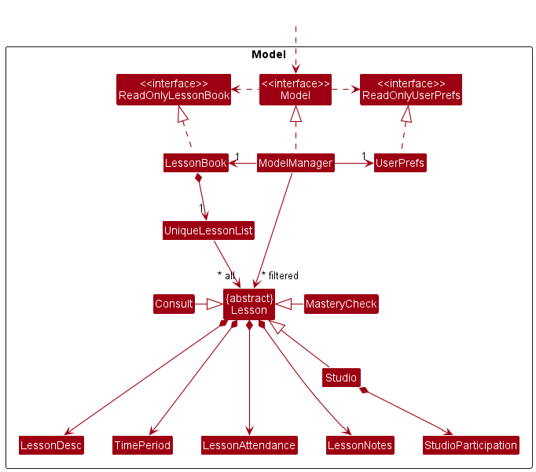

* Table of Contents
{:toc}

--------------------------------------------------------------------------------------------------------------------

## **Acknowledgements**

* This project is based on the AddressBook-Level3 project created by the [SE-EDU initiative](https://se-education.org).

--------------------------------------------------------------------------------------------------------------------

## **Setting up, getting started**

Refer to the guide [_Setting up and getting started_](SettingUp.md).

--------------------------------------------------------------------------------------------------------------------

## **Design**

:bulb: **Tip:** The `.puml` files used to create diagrams in this document can be found in the [diagrams](https://github.com/AY2223S1-CS2103T-T11-3/tp/tree/master/docs/diagrams/) folder. Refer to the [_PlantUML Tutorial_ at se-edu/guides](https://se-education.org/guides/tutorials/plantUml.html) to learn how to create and edit diagrams.

### Architecture

The ***Architecture Diagram*** given above explains the high-level design of the App.

Given below is a quick overview of main components and how they interact with each other.

**Main components of the architecture**

**`Main`** has two classes called [`Main`](https://github.com/AY2223S1-CS2103T-T11-3/tp/tree/master/src/main/java/jarvis/Main.java) and [`MainApp`](https://github.com/AY2223S1-CS2103T-T11-3/tp/tree/master/src/main/java/jarvis/MainApp.java). It is responsible for,
* At app launch: Initializes the components in the correct sequence, and connects them up with each other.
* At shut down: Shuts down the components and invokes cleanup methods where necessary.

[**`Commons`**](#common-classes) represents a collection of classes used by multiple other components.

The rest of the App consists of four components.

* [**`UI`**](#ui-component): The UI of the App.
* [**`Logic`**](#logic-component): The command executor.
* [**`Model`**](#model-component): Holds the data of the App in memory.
* [**`Storage`**](#storage-component): Reads data from, and writes data to, the hard disk.

**How the architecture components interact with each other**

The *Sequence Diagram* below shows how the components interact with each other for the scenario where the user issues the command `deletestudent 1`.

Each of the four main components (also shown in the diagram above),

* defines its *API* in an `interface` with the same name as the Component.
* implements its functionality using a concrete `{Component Name}Manager` class (which follows the corresponding API `interface` mentioned in the previous point.

For example, the `Logic` component defines its API in the `Logic.java` interface and implements its functionality using the `LogicManager.java` class which follows the `Logic` interface. Other components interact with a given component through its interface rather than the concrete class (reason: to prevent outside component's being coupled to the implementation of a component), as illustrated in the (partial) class diagram below.

The sections below give more details of each component.

### UI component

The **API** of this component is specified in [`Ui.java`](https://github.com/AY2223S1-CS2103T-T11-3/tp/tree/master/src/main/java/jarvis/ui/Ui.java)

The UI consists of a `MainWindow` that is made up of parts e.g.`CommandBox`, `ResultDisplay`, `TaskListPanel`, `StatusBarFooter` etc. All these, including the `MainWindow`, inherit from the abstract `UiPart` class which captures the commonalities between classes that represent parts of the visible GUI.

At any time, the `MainWindow` displays 1 of the following 4 lists: default list, expanded student list, expanded task list or expanded lesson list. Each of these lists are made up of different parts. For example, the `ExpandedStudentCard` builds the expanded student list while the `StudentCard` builds the default list.

In the class diagram above, the parts used to build the expanded lists i.e. `ExpandedStudentList`, `ExpandedTaskList` and `ExpandedLessonList` have been abstracted out into the `ExpandedLists` package due to space constraints. Instead, it displays the parts used to build the default list only.

 

In the class diagram above, the parts used to build the expanded lists that were abstracted out previously are shown.

The `UI` component uses the JavaFx UI framework. The layout of these UI parts are defined in matching `.fxml` files that are in the `src/main/resources/view` folder. For example, the layout of the [`MainWindow`](https://github.com/AY2223S1-CS2103T-T11-3/tp/tree/master/src/main/java/jarvis/ui/MainWindow.java) is specified in [`MainWindow.fxml`](https://github.com/AY2223S1-CS2103T-T11-3/tp/tree/master/src/main/resources/view/MainWindow.fxml)

The `UI` component,

* executes user commands using the `Logic` component.
* listens for changes to `Model` data so that the UI can be updated with the modified data.
* keeps a reference to the `Logic` component, because the `UI` relies on the `Logic` to execute commands.
* depends on some classes in the `Model` component, as it displays `Student`, `Task` and `Lesson` objects residing in the `Model`.

### Logic component

**API** : [`Logic.java`](https://github.com/AY2223S1-CS2103T-T11-3/tp/tree/master/src/main/java/jarvis/logic/Logic.java)

Here's a (partial) class diagram of the `Logic` component:

How the `Logic` component works:
1. When `Logic` is called upon to execute a command, it uses the `JarvisParser` class to parse the user command.
1. This results in a `Command` object (more precisely, an object of one of its subclasses e.g., `AddTaskCommand`) which is executed by the `LogicManager`.
1. The command can communicate with the `Model` when it is executed (e.g. to add a task).
1. The result of the command execution is encapsulated as a `CommandResult` object which is returned back from `Logic`.

The Sequence Diagram below illustrates the interactions within the `Logic` component for the `execute("deletestudent 1")` API call.

:information_source: **Note:** The lifeline for `DeleteStudentCommandParser` should end at the destroy marker (X) but due to a limitation of PlantUML, the lifeline reaches the end of diagram.

Here are the other classes in `Logic` (omitted from the class diagram above) that are used for parsing a user command:

How the parsing works:
* When called upon to parse a user command, the `JarvisParser` class creates an `XYZCommandParser` (`XYZ` is a placeholder for the specific command name e.g., `AddTaskCommandParser`) which uses the other classes shown above to parse the user command and create a `XYZCommand` object (e.g., `AddTaskCommand`) which the `JarvisParser` returns back as a `Command` object.
* All `XYZCommandParser` classes (e.g., `AddTaskCommandParser`, `DeleteStudentCommandParser`, ...) inherit from the `Parser` interface so that they can be treated similarly where possible e.g, during testing.

### Model component
**API** : [`Model.java`](https://github.com/AY2223S1-CS2103T-T11-3/tp/tree/master/src/main/java/jarvis/model/Model.java)

The `Model` component,

* stores the student data i.e., all `Student` objects (which are contained in a `UniqueStudentList` object).
* stores the currently 'selected' `Student` objects (e.g., results of a search query) as a separate _filtered_ list which is exposed to outsiders as an unmodifiable `ObservableList<Student>` that can be 'observed' e.g. the UI can be bound to this list so that the UI automatically updates when the data in the list change.
* stores a `UserPref` object that represents the user’s preferences. This is exposed to the outside as a `ReadOnlyUserPref` objects.
* does not depend on any of the other three components (as the `Model` represents data entities of the domain, they should make sense on their own without depending on other components)

Similar analogues exist for task and lesson data. The class diagram is similar apart from:
1. the different naming (`TaskBook` and `LessonBook` instead of `StudentBook`, `UniqueTaskList` and `UniqueLessonList` instead of `UniqueStudentList`)
2. the components of the `Task` and `Lesson` classes. For example, instead of `StudentName` and `MatricNumber`, `Task` is composed out of `TaskDesc`, `TaskDeadline` etc. 

In particular, the following class diagram shows how a lesson is represented in the `Model` component.

Note that the 3 Lesson subtypes (`Studio`, `MasteryCheck` and `Consult`) inherit from the abstract `Lesson` class. Each lesson consists of smaller components such as `LessonAttendance`, `TimePeriod` etc.

### Storage component

**API** : [`Storage.java`](https://github.com/AY2223S1-CS2103T-T11-3/tp/tree/master/src/main/java/jarvis/storage/Storage.java)

The above diagram only shows the UserPrefs and StudentBook Storage in full. TaskBook Storage is done similarly to StudentBook Storage. The only difference is the name of the classes (`JsonTaskBookStorage` instead of `JsonStudentBookStorage`, `JsonAdaptedTask` instead of `JsonAdaptedStudent` etc.)

The LessonBook Storage is slightly different from the StudentBook and TaskBook Storages.

The `Storage` component,
* can save student, task and lesson data as well as user preference data in json format, and read them back into corresponding objects.
* inherits from `StudentBookStorage`, `TaskBookStorage`, `LessonBookStorage` and `UserPrefStorage`, which means it can be treated as any one of them (if only the functionality of only one is needed).
* depends on some classes in the `Model` component (because the `Storage` component's job is to save/retrieve objects that belong to the `Model`)

### Common classes

Classes used by multiple components are in the `jarvis.commons` package.

--------------------------------------------------------------------------------------------------------------------

## **Implementation**

This section describes some noteworthy details on how certain features are implemented.

### List Students / Tasks / Lessons

For the implementation of the `liststudent`, `listtask` and `listlesson` commands, it is important to explain the layout of the `MainWindow` component of the UI.

The `MainWindow` contains a `StackPane` which stacks 1 `SplitPane` component and 3 `VBox` components. The `SplitPane` component is a container for the default view of JARVIS, where all 3 lists (i.e. student/task/lesson list) are displayed side by side. Each `VBox` component is a container for the expanded version of one of the 3 lists (i.e. expanded student/task/lesson list). 

Upon initialising the app, all 3 `VBox` components are set to "not visible". The `SplitPane` component remains visible, which displays the default view of the app.

For the command, we'll use the example of `liststudent` though the same applies for `listtask` and `listlesson`. 

To see the expanded version of the student list, the user keys in the valid command (`liststudent`). The `MainWindow` passes the command text to `LogicManager`, which then sends it to the parser to generate a `ListStudentCommand`. The `ListStudentCommand` is then executed to produce a `CommandResult` object. This `CommandResult` is returned to `MainWindow` and supplied as an argument to the `handleList` method, which then sets all content of the `StackPane` to "not visible" except for the `VBox` container of the expanded student list.

The following sequence diagram shows what happens after `MainWindow` receives the command text by the user:

1. `MainWindow` receives the command text and supplies it as an argument to the `execute` method of `LogicManager` 
2. The command text is parsed and `LogicManager` executes the command, producing a `CommandResult`
3. The `CommandResult` is successively returned to `MainWindow`
4. `MainWindow` calls its own `handleList` method with the `CommandResult` as an argument

The implementation for `listtask` and `listlesson` is similar to this.

### Mark Task as done / not done
In order to mark a task as completed, the user keys in a valid command (e.g. `marktask 2`). Parsing of the user input is done (see the sequence diagram for deleting a student in the [Logic component](#logic-component) for a similar parsing sequence) and a `MarkTaskCommand` is then generated. The following sequence diagram shows what happens when the `MarkTaskCommand` is executed.

1. First, the list of tasks is obtained and the index is matched to the corresponding task.
2. This task is then marked as done.
3. The list of tasks in the model is then updated in order to display the updated task in the UI.

The implementation for marking a task as not done is similar.

### Adding a Lesson

In order to add a Lesson into JARVIS, the user keys in a valid command (e.g. `addmc l/mastery check 1 sd/2022-09-15T20:00 ed/2022-09-15T20:30 si/1 si/2`)
Parsing of the user input is done and a `AddMasteryCheckCommand` is then generated. (See the sequence diagram for deleting a student in the [Logic component](#logic-component))

The sequence diagram is similar apart from:
1. the command executed and parsed (`addmc l/mastery check 1 sd/2022-09-15 st/12:00 ed/2022-09-15 et/14:00 si/1 si/2` instead of `deletestudent 2`)
2. the different command class (`AddMasteryCheckCommandParser` and `AddMasteryCheckCommand` instead of `DeleteStudentCommandParser` and `DeleteStudentCommand`)
3. function called in main (`addLesson` instead of `deleteStudent`)

`MasteryCheckCommandParser` checks if:

1. all compulsory prefixes are present (`l/` and `ed/` are optional)
2. lesson description if provided is not empty
3. start date time is before end date time
4. student indexes are int

Otherwise, `ParseException` will be thrown.

The rationale behind this design is that it is up to the user to include description for the lesson. Even without a description, the user will know the type of lesson which is sufficient to prepare for the lesson.
The end date is optional as lessons are most likely to start and end on the same day, hence end date will be perceived to be the same as start date if not specified. 
It is also illogical for a lesson to start after the end date and time. At least one `Student` must be assigned to a `MasteryCheck` as the purpose of `MasteryCheck` is to assess a student's capability.

The following sequence diagram shows what happens when the `AddMasteryCheckCommand` is executed upon a successful command.

- `AddMasteryCheckCommand` will get the students involved in the `MasteryCheck` via indexing of the `lastShownList`. If no `Student` are found based on the index, `CommandException` will be thrown, stating invalid student index.
- After a `MasteryCheck` object is created, `Model` will check if there already exists a `MasteryCheck` in the current `LessonBook` with the same identity fields. If this is the case,`CommandException` will be thrown, stating duplicate Mastery Check.
- `Model` will also check with existing `Lessons` if there will be a clash in `TimePeriod`. This serves as a reminder to the user that there is already another lesson at that time slot. `CommandException` will be thrown, stating clash in timeslot.

The above explanation is also applicable to adding consultation and studio lessons.
They are similar apart from:
1. the different naming(`AddConsultCommandParser`, `AddStudioCommandParser` etc instead of `AddMasteryCheckParser`)
2. for `Studio`, all `Student` currently in the `StudentBook` instead of `FilteredStudentList` will be used to create `LessonAttendance` and `LessonNotes`
   1. Studio are tutorials and all students are expected to attend.
   2. As a result, adding a Studio command does not require user to input student indexes.

### Adding notes for a lesson

In adding notes for an existing `Lesson` in JARVIS, the user has the option to:
1. add overall notes for a `Lesson`
2. add `Student` specific notes for a `Lesson`

The rationale behind this design is that these are the two main types of notes that a tutor might make during a lesson. This design will help the tutor organise and view his/her notes more easily.

To add an overall note for an existing `Lesson` in JARVIS, the user keys in a valid add note command (e.g addnote n/get back to the class on streams li/1).

To add a `Student` specific note to an existing `Lesson` in JARVIS, the user similarly keys in a valid add note command, but additionally specifying the student index (e.g addnote n/get back to jeff on streams li/1 si/2).

Parsing of the user input is done and a `AddNoteCommand` is then generated.

The following sequence diagram shows what happens when the `AddNoteCommand` is executed upon a successful command for adding to overall notes.

1. `AddNoteCommand` gets the list of lessons in JARVIS and gets the `Lesson` specified by the lesson index.
2. `addOverallNotes` method of this lesson is called with the notes input by the user and the notes are added to the lesson.
3. The list of lessons in the model is then updated to display the notes added.

In the case where `AddNoteCommand` is executed for adding to student specific notes, the execution is similar except:
 - `AddNoteCommand` additionally gets the list of students in JARVIS and the specified `Student`
 - `addStudentNotes` is called instead of `addOverallNotes`.

--------------------------------------------------------------------------------------------------------------------

## **Documentation, logging, testing, configuration, dev-ops**

* [Documentation guide](Documentation.md)
* [Testing guide](Testing.md)
* [Logging guide](Logging.md)
* [Configuration guide](Configuration.md)
* [DevOps guide](DevOps.md)

--------------------------------------------------------------------------------------------------------------------

## **Appendix: Requirements**

### Product scope

**Target user profile**: CS1101S TA

* has to keep track of significant number of tasks
  * grade mission and quests
  * schedule mastery checks
  * studio attendance and participation
* prefer desktop apps over other types
* can type fast
* prefers typing to mouse interactions
* is reasonably comfortable using CLI apps

**Value proposition**: manage students and tasks in an organised manner easily and quickly

### User stories

Priorities: High (must have) - `* * *`, Medium (nice to have) - `* *`, Low (unlikely to have) - `*`

| Priority | As a …​                           | I want to …​                                                    | So that I …​                                                                    |
|----------|-----------------------------------|-----------------------------------------------------------------|---------------------------------------------------------------------------------|
| `* * *`  | potential user                    | find the installation/setup instructions                        | can install the app properly                                                    |
| `* * *`  | user ready to start using the app | see the basic commands                                          | can learn how to use the most basic features of the app                         |
| `* * *`  | user ready to start using the app | add the students in my tutorial class into the app              | can track the students' attendance and grades                                   |
| `* * *`  | user                              | add my tasks                                                    | can keep track of the tasks I have to do                                          |
 | `* * *`  | user                              | add my lessons                                                  | can keep track of lessons I have scheduled with which students                  |
| `* * *`  | user                              | mark tasks as done                                              | can focus on the remaining tasks                                                |
| `* * *`  | user                              | mark tasks as not done                                          | can go back and redo tasks that are incomplete                                  |
| `* * *`  | user                              | mark lessons as completed                                       | can focus on upcoming lessons                                                   |
| `* * *`  | clumsy user                       | delete tasks                                                    | can remove tasks I have wrongfully added                                        |
| `* * *`  | clumsy user                       | delete students                                                 | can remove students I have wrongfully added                                     |
| `* * *`  | clumsy user                       | delete lessons                                                  | can remove lessons I have wrongfully added                                      |
| `* * *`  | user                              | list the tasks that I need to do                                | can see all my tasks                                                            |
| `* * *`  | user                              | list all students in my class                                   | can see all my students with relevant details                                   |
| `* * *`  | user                              | list all lessons for my class                                   | can see all upcoming and completed lessons                                      |
| `* * *`  | user                              | see my students' mastery check completion status                | know which students I have not seen for mastery check                           |
| `* * *`  | user                              | update my students' mastery check completion status             | can keep track of which students I have already seen for mastery check          |
| `* * *`  | user                              | see the duration and students involved for my lessons           | can keep track of when and who I have to meet in order to make preparations       |
| `* *`    | first time user                   | see the app being populated with sample students, tasks and lessons      | can try out the functions of the app                                            |
| `* *`    | user ready to start using the app | clear all current data                                          | can get rid of the sample data used for exploring the app and input my own data |
| `* *`    | user                              | add attendance for a lesson                                      | can keep track of who attended the lesson                                       |
| `* *`    | user                              | keep track of my students' level of participation               | can prompt students who are less active in class                        |
| `* *`    | user                              | keep track of my students' grades                               | can help and pay more attention to the weaker students                             | 
| `* *`    | user                              | take down notes related to a lesson                             | can refer back and remember important things that happened during the lesson      |     
| `* *`    | user                              | detect if there are any lesson schedule conflicts                      | will not wrongly schedule lessons at the same time                               |
| `*`      | user                              | assign different priorities to my tasks                         | can focus on the more important tasks                                           |
| `*`      | user ready to start using the app | import my timetable for the semester	                           | can plan my TA duties in sync with tasks from other modules                     |
| `*`      | user                              | detect if there any schedule conflicts in my upcoming tasks     | resolve those conflicts and complete all my tasks                               |
| `*`      | user                              | get the task with the next earliest deadline	                   | can plan my schedule accordingly                                                |
| `*`      | user                              | receive reminders about upcoming deadlines                      | am able to meet all my deadlines on time                                        |
| `*`      | user                              | receive notifications when my students submit their assignments | know that I have assignments to grade                                           |
| `*`      | user                              | send notifications to my students                               | can remind them to submit their work                                            |
| `*`      | user                              | see performance statistics on each assignment                   | can spend more time on topics that my students are weak in                      |
| `*`      | user                              | hide irrelevant data                                            | can focus on the more relevant data                                             |

### Use cases

(For all use cases below, the **System** is `JARVIS` and the **Actor** is `AVENGER`, unless specified otherwise)

**Use case: UC1 - View students**

**MSS**

1. Avenger requests to view students.
2. JARVIS displays the students.

Use case ends.

**Extensions**

* 1a. JARVIS fails to understand request.
    * 1a1. JARVIS tells Avenger to make a request again.

      Use case resumes from step 1.

**Use case: UC2 - View tasks**

Refer to <ins>UC1 - View students</ins> with the only difference being task instead of student.

**Use case: UC3 - View lessons**

Refer to <ins>UC1 - View students</ins> with the only difference being lesson instead of student.

**Use case: UC4 - View students, tasks and lessons at the same time**

Refer to <ins>UC1 - View students</ins> with the only difference being request for all students, tasks and lessons instead of just students.

**Use case: UC5 - Add a student**

**MSS**

1. Avenger requests to add a student.
2. JARVIS successfully adds the student.

Use case ends.

**Extensions**

* 1a. JARVIS fails to understand request.
  * 1a1. JARVIS tells Avenger to make a request again.

    Use case resumes from step 1.

**Use case: UC6 - Add a task**

Refer to <ins>UC5 - Add a Student</ins> with the only difference being task instead of student.

**Use case: UC7 - Add a lesson**

Refer to <ins>UC5 - Add a Student</ins> with the only difference being lesson instead of student.

**Use case: UC8 - Edit student**

Preconditions: There are existing students in JARVIS.

**MSS**

1. Avenger requests to edit a student.
2. JARVIS successfully edits the student.

Use case ends.

**Extensions**
- 1a. JARVIS fails to understand request.
  - 1a1. JARVIS tells Avenger to make a request again.

    Use case resumes from step 1.

- 1b. Specified student not found in JARVIS.
  - 1b1. JARVIS informs Avenger that the student does not exist.
  - 1b2. JARVIS displays the list of students.
  - 1b3. JARVIS tells Avenger to make a request again.

    Use case resumes from step 1.

**Use case: UC9 - Find student**

Preconditions: There are existing students in JARVIS.

**MSS**

1. Avenger requests to find a student.
2. JARVIS successfully finds the student.

**Extensions**
- 1a. JARVIS fails to understand request.
    - 1a1. JARVIS tells Avenger to make a request again.

      Use case resumes from step 1.

- 1b. Specified student not found in JARVIS.
    - 1b1. JARVIS informs Avenger that the student does not exist.
    - 1b2. JARVIS displays the list of students.
    - 1b3. JARVIS tells Avenger to make a request again.

      Use case resumes from step 1.

**Use case: UC10 - Grade student**

Preconditions: There are existing students in JARVIS.

**MSS**

1. Avenger requests to input grade for a student.
2. JARVIS successfully adds the grade for the student.

**Extensions**
- 1a. JARVIS fails to understand request.
    - 1a1. JARVIS tells Avenger to make a request again.

      Use case resumes from step 1.

- 1b. Specified student not found in JARVIS.
    - 1b1. JARVIS informs Avenger that the student does not exist.
    - 1b2. JARVIS displays the list of students.
    - 1b3. JARVIS tells Avenger to make a request again.

      Use case resumes from step 1.

**Use case: UC11 - Set mastery check result**

Preconditions: There are existing students in JARVIS.

**MSS**

1. Avenger requests to input mastery check result for a student.
2. JARVIS successfully adds the mastery check result for the student.

**Extensions**
- 1a. JARVIS fails to understand request.
    - 1a1. JARVIS tells Avenger to make a request again.

      Use case resumes from step 1.

- 1b. Specified student not found in JARVIS.
    - 1b1. JARVIS informs Avenger that the student does not exist.
    - 1b2. JARVIS displays the list of students.
    - 1b3. JARVIS tells Avenger to make a request again.

      Use case resumes from step 1.

**Use case: UC12 - Mark task as done**

Preconditions: There are existing tasks in JARVIS

Guarantees: Specified task is marked as done

**MSS:**

1. Avenger requests to mark a task as done.
2. JARVIS marks the task as done.

Use case ends.

**Extensions:**

* 1a. JARVIS fails to understand request.
    * 1a1. JARVIS tells Avenger to make a request again.

      Use case resumes from step 1.

* 1b. Specified task not found in JARVIS.
  - 1b1. JARVIS informs Avenger that the task does not exist.
  - 1b2. JARVIS displays the list of tasks.
  - 1b3. JARVIS tells Avenger to make a request again.

    Use case resumes from step 1.

**Use case: UC13 - Mark task as not done**

Refer to <ins>UC12 - Mark task as done</ins> with the only difference being marking task as not done instead of done.

**Use case: UC14 - Mark lesson as completed**

Refer to <ins>UC12 - Mark task as done</ins> with the only difference being lesson instead of task.

**Use case: UC15 - Mark lesson as incomplete**

Refer to <ins>UC12 - Mark task as done</ins> with the difference being lesson instead of task and incomplete instead of done.

**Use case: UC16 - Mark a student as present for a lesson**

Preconditions: There are existing students and lessons in JARVIS.

**MSS**
1. Avenger performs <ins>view lessons(UC3)</ins>.
2. Avenger requests to mark a student present in a lesson.
3. JARVIS marks the student present in the lesson.

Use case ends.

**Extensions:**

- 2a. JARVIS fails to understand request.
  - 2a1. JARVIS tells Avenger to make a request again.

    Use case resumes from step 2.

- 2b. Specified lesson not found in JARVIS.
  - 2b1. JARVIS informs Avenger that the lesson does not exist.
  - 2b2. JARVIS tells Avenger to make a request again.

    Use case resumes from step 2.

- 2c. Specified student not found in JARVIS.
  - 2c1. JARVIS informs Avenger that the student does not exist in the lesson.
  - 2c2. JARVIS tells Avenger to make a request again.

    Use case resumes from step 2.

**Use case: UC17 - Mark a student as absent for a lesson**

Refer to <ins>UC16 - Mark a student as present for a lesson</ins> with the only difference being mark a student as absent instead of present.

**Use case: UC18 - Add note for a student in a lesson**

Preconditions: There are existing students and lessons in JARVIS.

**MSS**

1. Avenger performs <ins>view lessons(UC3)</ins>.
2. Avenger requests to add a note for a student in a lesson.
3. JARVIS adds the note for the student to the lesson.

Use case ends.

**Extensions:**
- 2a. JARVIS fails to understand request.
    - 2a1. JARVIS tells Avenger to make a request again.

      Use case resumes from step 2.

- 2b. Specified lesson not found in JARVIS.
    - 2b1. JARVIS informs Avenger that the lesson does not exist.
    - 2b2. JARVIS tells Avenger to make a request again.

      Use case resumes from step 2.

- 2c. Specified student not found in JARVIS.
    - 2c1. JARVIS informs Avenger that the student does not exist in the lesson.
    - 2c2. JARVIS tells Avenger to make a request again.

      Use case resumes from step 2.
    
**Use case: UC19 - Delete note from a student in a lesson**

Preconditions: There are existing students, lessons and notes for a student in JARVIS.

**MSS**

1. Avenger performs <ins>view lessons(UC3)</ins>.
2. Avenger requests to delete a note from a student in a lesson.
3. JARVIS deletes the note from the student to the lesson.

Use case ends.

**Extensions:**
- 2a. JARVIS fails to understand request.
    - 2a1. JARVIS tells Avenger to make a request again.

      Use case resumes from step 2.

- 2b. Specified lesson not found in JARVIS.
    - 2b1. JARVIS informs Avenger that the lesson does not exist.
    - 2b2. JARVIS tells Avenger to make a request again.

      Use case resumes from step 2.

- 2c. Specified student not found in JARVIS.
    - 2c1. JARVIS informs Avenger that the student does not exist in the lesson.
    - 2c2. JARVIS tells Avenger to make a request again.

      Use case resumes from step 2.
  
- 2d. Specified note not found in JARVIS.
  - 2d1. JARVIS informs Avenger that the note does not exist for the student in the lesson.
  - 2d2. JARVIS tells Avenger to make a request again.

    Use case resumes from step 2.

**Use case: UC20 - Set participation for a student in a lesson**

Refer to <ins>UC18 - Add note for a student in a lesson</ins> with the only difference being setting participation instead of adding note.  
    
**Use case: UC21 - Delete a student**

Preconditions: There are existing students in JARVIS.

**MSS**

1. Avenger performs <ins>view students(UC1)</ins>.
2. Avenger requests to delete a student.
3. JARVIS deletes the student.

Use case ends.

**Extensions**

- 2a. JARVIS fails to understand request.
  - 2a1. JARVIS tells Avenger to make a request again.

    Use case resumes from step 2.

- 2b. Specified student not found in JARVIS.
  - 2b1. JARVIS informs Avenger that the student does not exist.
  - 2b2. JARVIS tells Avenger to make a request again.

    Use case resumes from step 2.

**Use case: UC22 - Delete a task**

Refer to <ins>UC21 - Delete a student</ins> with the only difference being task instead of student.

**Use case: UC23 - Clear all students, tasks and lessons**

Preconditions: There are existing tasks, students and/or lessons in JARVIS.

Guarantees: All students and tasks will be deleted.

**MSS:**

1. Avenger requests to clear all data.
2. JARVIS clears all data.

Use case ends.

**Extensions:**

- 1a. JARVIS fails to understand request.
  - 1a1. JARVIS tells Avenger to make a request again.

    Use case resumes from step 1.

### Non-Functional Requirements

1.  Should work on Windows, Linux, and OS-X platforms that has version 11 of Java (i.e. no other Java versions) installed.
2.  Should work without requiring an installer and be packaged in a single jar file
3.  All data for the system should be stored locally in a human editable text file, and not be dependent on any remote server
4.  GUI should not cause any resolution-related inconveniences for standard screen resolutions (1920 x 1080 and higher) and screen scales 100% and 125%
5.  GUI should be usable (i.e. all functionality can be used, not necessarily optimally) for screen resolutions 1280 x 720 and higher, and for screen scales 150%
6.  A user with above average typing speed for regular English text (i.e. not code, not system admin commands) should be able to accomplish most of the tasks faster using commands over other means of input.
7.  The product is intended only for a single user (i.e. not a multi-user product)
8.  The system is not required to handle the actual grading of student's works

### Glossary
* **Mastery check**: An assessment where students in pairs must present what they have learnt in the module to their TA, and the TA will assess the students’ understanding of the concepts.
* **Avenger**: A teaching assistant (TA) who is responsible for teaching a studio class.
* **Studio**: A tutorial class with up to 8 students.
* **XP**: Points that will count towards a student’s grade.
* **Source Academy**: Online platform used for CS1101S.
* **Mission**: Assignment on Source Academy.
* **Quest**: Optional assignment on Source Academy.

--------------------------------------------------------------------------------------------------------------------

## **Appendix: Instructions for manual testing**

Given below are instructions to test the app manually.

:information_source: **Note:** These instructions only provide a starting point for testers to work on;
testers are expected to do more *exploratory* testing.

### Launch and shutdown

1. Initial launch

   1. Download the jar file and copy into an empty folder.

   2. Double-click the jar file
       Expected: Shows the GUI with a set of sample students, tasks and lists. The window size may not be optimum.

2. Saving window preferences

   1. Resize the window to an optimum size. Move the window to a different location. Close the window.

   2. Re-launch the app by double-clicking the jar file. 
       Expected: The most recent window size and location is retained.

3. Exiting the app

    1. While the app is still open, enter `exit` in the command box or click on the close window button.
       Expected: The application closes. 

### Adding a student

1. Adding a student while student list is being shown

   1. Prerequisites: List all students using the `liststudent` or `listall` command.

   2. Test case: `addstudent s/John Doe m/A0123459G`  
      Expected: Student with the name `John Doe` and matriculation number `A0123459G` has been added to the list of students. Details of added student shown in the status message.
   
   3. Test case : `addstudent s/J@hn Doe m/A0123459G`  
      Expected: No student is added. Error details are shown in the status message. 
   
   4. Test case : `addstudent s/John Doe m/A01234G`  
      Expected: Similar to previous.

### Deleting a student

1. Deleting a student while student list is being shown

   1. Prerequisites: List all students using the `liststudent` or `listall` command. There must be at least one student in the list.

   2. Test case: `deletestudent 1` 
      Expected: First student is deleted from the list. Details of the deleted student shown in the status message.

   3. Test case: `deletestudent 0` 
      Expected: No student is deleted. Error details shown in the status message.

   4. Other incorrect delete commands to try: `deletestudent`, `deletestudent x`, `...` (where x is larger than the list size) 
      Expected: Similar to previous.

### Adding a task

1. Adding a task while task list is being shown

    1. Prerequisites: List all tasks using the `listtask` or `listall` command.

    2. Test case: `addtask t/Prepare tutorial slides d/2022-10-09`  
       Expected: Task with the description `Prepare tutorial slides` with the deadline `Oct-09-2022` is added. Details of the task added shown in status message.
   
    3. Test case: `addtask d/2022-10-09`  
       Expected: No task is added. Error details are shown in the status message.
   
    4. Test case: `addtask t/ d/2022-10-09`  
       Expected: Similar to previous. 

### Deleting a task

1. Deleting a task while task list is being shown

   1. Prerequisites: List all tasks using the `listtask` or `listall` command. There are existing tasks in the task list.
   
   2. Test case: `deletetask 1`  
      Expected: The first task at the top of the list is deleted. Details of the deleted task are shown in the status message. 
   
   3. Test case: `deletetask 0`  
      Expected: No task is deleted. Error details shown in status message.
   
   4. Other incorrect delete commands to try: `deletetask`, `deletetask x`, `...` (where x is larger than the list size) 
      Expected: Similar to previous.
   
### Saving data

1. Dealing with missing data file(s).

   1. Prerequisites: If there exists studentbook.json, taskbook.json and/or lessonbook.json file(s) in the data folder at the root of the application directory, delete the file(s).
   2. Test case: Double-click on the jar file to run the application.
      Expected: Application runs and loads the sample data from `SampleStudentUtil#getSampleStudentBook`, `SampleTaskUtil#getSampleTaskBook` and/or `SampleLessonUtil#getSampleLessonBook`.

2. Dealing with corrupted data file(s).

   1. Prerequisites: Modify the studentbook.json, taskbook.json and/or lessonbook.json file(s) to be an illegal format, such as deleting the “name” field of a student, the "taskDesc" field of a task, and/or the "attendance" field of a lesson.
   2. Test case: Double-click on the jar file to run the application.
      Expected: Application runs and has no data on initial load. Running the next command overwrites the current corrupted json file(s).
