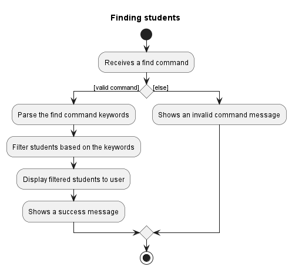
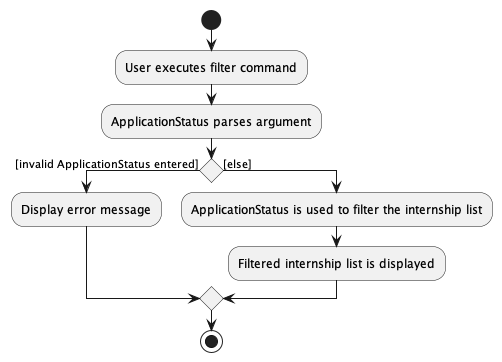

## **Table of Contents**

* Table of Contents
{:toc}

--------------------------------------------------------------------------------------------------------------------

## **Introduction**

#### What is TrackAScholar?

TrackAScholar (TAS) is a one of a kind desktop app. It is the **only** application that any university administrative staff needs.
TAS helps university administrative staff manage scholarship applications.
It can store all the applicant's details such as contact info and scholarship applied etc. in one place.

TAS has many features that university administrative staff can use to help speed up the application process immensely.
TAS presents the administrative staff with various options such as the ability to pin important applicants,
edit their details easily and find or filter for applicants with ease.

TAS is optimised for use via a ***Command Line Interface (CLI)*** while simultaneously having the benefits of a ***Graphical User Interface
(GUI)***. If you can type fast, TAS can handle your scholarship application process faster than conventional _GUI_ apps.

#### Who is this Developer Guide for?

This developer guide is designed for individuals who want to understand TrackAScholar's architecture and design concerns.

Italics are used to indicate specific technical terms. If you'd want to know what they mean, you may look them up in our [Glossary](#glossary).

For additional details on our target audience and how our app solves their problems, check out the [Requirements](#appendix-requirements).

For new users who are discovering the features of our app, please refer to our [User Guide](https://ay2223s1-cs2103t-w10-3.github.io/tp/UserGuide.html).

#### Current version

This developer guide is optimized for TrackAScholar's most recent version, v1.4.

[Return to top](#table-of-contents)

--------------------------------------------------------------------------------------------------------------------

## **Legend**

Here are certain indicators explained so that the user may better comprehend the documentation.

:information_source: **Notes:** Notes are placed in this guide to provide more information.

:bulb: **Tip:** Tips are placed in this guide to provide a suggestion.

[Return to top](#table-of-contents)

--------------------------------------------------------------------------------------------------------------------

## **Acknowledgements**

This project is based on the AddressBook-Level3 project created by the [SE-EDU initiative](https://se-education.org/).
Libraries used: [JavaFX](https://openjfx.io/), [JUnit5](https://github.com/junit-team/junit5), [Jackson](https://github.com/FasterXML/jackson).

[Return to top](#table-of-contents)

--------------------------------------------------------------------------------------------------------------------

## **Setting up, getting started**

Refer to the guide [_Setting up and getting started_](SettingUp.md).

[Return to top](#table-of-contents)

--------------------------------------------------------------------------------------------------------------------

## **Design**

<div markdown="span" class="alert alert-primary">

:bulb: **Tip:** The `.puml` files used to create diagrams in this document can be found in the [diagrams](https://github.com/AY2223S1-CS2103T-W10-3/tp/tree/master/docs/diagrams/) folder. Refer to the [_PlantUML Tutorial_ at se-edu/guides](https://se-education.org/guides/tutorials/plantUml.html) to learn how to create and edit diagrams.
</div>

[Return to top](#table-of-contents)

--------------------------------------------------------------------------------------------------------------------

### Architecture


The ***Architecture Diagram*** given above explains the high-level design of the App.

Given below is a quick overview of main components and how they interact with each other.

**Main components of the architecture**

**`Main`** has two classes called [`Main`](https://github.com/AY2223S1-CS2103T-W10-3/tp/blob/master/src/main/java/seedu/trackascholar/Main.java) and [`MainApp`](https://github.com/AY2223S1-CS2103T-W10-3/tp/blob/master/src/main/java/seedu/trackascholar/MainApp.java). It is responsible for,
* At app launch: Initializes the components in the correct sequence, and connects them up with each other.
* At shut down: Shuts down the components and invokes cleanup methods where necessary.

[**`Commons`**](#common-classes) represents a collection of classes used by multiple other components.

The rest of the App consists of four components.

* [**`UI`**](#ui-component): The UI of the App.
* [**`Logic`**](#logic-component): The command executor.
* [**`Model`**](#model-component): Holds the data of the App in memory.
* [**`Storage`**](#storage-component): Reads data from, and writes data to, the hard disk.


**How the architecture components interact with each other**

The *Sequence Diagram* below shows how the components interact with each other for the scenario where the user issues the command `delete 1`.


Each of the four main components (also shown in the diagram above),

* defines its _API_ in an `interface` with the same name as the Component.
* implements its functionality using a concrete `{Component Name}Manager` class (which follows the corresponding _API_ `interface` mentioned in the previous point.

For example, the `Logic` component defines its _API_ in the `Logic.java` interface and implements its functionality using the `LogicManager.java` class which follows the `Logic` interface. Other components interact with a given component through its interface rather than the concrete class (reason: to prevent outside component's being coupled to the implementation of a component), as illustrated in the (partial) class diagram below.


The sections below give more details of each component.

[Return to top](#table-of-contents)

--------------------------------------------------------------------------------------------------------------------

### UI component

The **_API_** of this component is specified in [`Ui.java`](https://github.com/AY2223S1-CS2103T-W10-3/tp/blob/master/src/main/java/seedu/trackascholar/ui/Ui.java)


The UI consists of a `MainWindow` that is made up of parts e.g.`CommandBox`, `ResultDisplay`, `ApplicantListPanel`, `PinList` and `StatusBarFooter` etc. All these, including the `MainWindow`, inherit from the abstract `UiPart` class which captures the commonalities between classes that represent parts of the visible GUI.

The `UI` component uses the JavaFx UI framework. The layout of these UI parts are defined in matching `.fxml` files that are in the `src/main/resources/view` folder. For example, the layout of the [`MainWindow`](https://github.com/AY2223S1-CS2103T-W10-3/tp/blob/master/src/main/java/seedu/trackascholar/ui/MainWindow.java) is specified in [`MainWindow.fxml`](https://github.com/AY2223S1-CS2103T-W10-3/tp/blob/master/src/main/resources/view/MainWindow.fxml)

The `UI` component,

* executes user commands using the `Logic` component.
* listens for changes to `Model` data so that the UI can be updated with the modified data.
* keeps a reference to the `Logic` component, because the `UI` relies on the `Logic` to execute commands.
* depends on some classes in the `Model` component, as it displays `Applicant` object residing in the `Model`.

[Return to top](#table-of-contents)

--------------------------------------------------------------------------------------------------------------------

### Logic component

**_API_** : [`Logic.java`](https://github.com/AY2223S1-CS2103T-W10-3/tp/blob/master/src/main/java/seedu/trackascholar/logic/Logic.java)

Here's a (partial) class diagram of the `Logic` component:


How the `Logic` component works:
1. When `Logic` is called upon to execute a command, it uses the `TrackAScholarParser` class to parse the user command.
2. This results in a `Command` object (more precisely, an object of one of its subclasses e.g., `AddCommand`) which is executed by the `LogicManager`.
3. The command can communicate with the `Model` when it is executed (e.g. to add an applicant).
4. The result of the command execution is encapsulated as a `CommandResult` object which is returned from `Logic`.

The Sequence Diagram below illustrates the interactions within the `Logic` component for the `execute("delete 1")` _API_ call.


<div markdown="span" class="alert alert-info">

:information_source: **Note:** The lifeline for `DeleteCommandParser` should end at the destroy marker (X) but due to a limitation of PlantUML, the lifeline reaches the end of diagram. This limitation applies to the remaining sequence diagrams in our guide.

</div>

Here are the other classes in `Logic` (omitted from the class diagram above) that are used for parsing a user command:


How the parsing works:
* When called upon to parse a user command, the `TrackAScholarParser` class creates an `XYZCommandParser` (`XYZ` is a placeholder for the specific command name e.g., `AddCommandParser`) which uses the other classes shown above to parse the user command and create a `XYZCommand` object (e.g., `AddCommand`) which the `TrackAScholarParser` returns back as a `Command` object.
* All `XYZCommandParser` classes (e.g., `AddCommandParser`, `DeleteCommandParser`, ...) inherit from the `Parser` interface so that they can be treated similarly where possible e.g, during testing.

[Return to top](#table-of-contents)

--------------------------------------------------------------------------------------------------------------------

### Model component
**_API_** : [`Model.java`](https://github.com/AY2223S1-CS2103T-W10-3/tp/blob/master/src/main/java/seedu/trackascholar/model/Model.java)


The `Model` component,

* stores TrackAScholar data i.e., all `Applicant` objects (which are contained in a `UniqueApplicantList` object).
* stores the currently 'selected' `Applicant` objects (e.g., results of a search query) as a separate _filtered_ list which is exposed to outsiders as an unmodifiable `ObservableList<Person>` that can be 'observed' e.g. the UI can be bound to this list so that the UI automatically updates when the data in the list change.
* stores a `UserPref` object that represents the user’s preferences. This is exposed to the outside as a `ReadOnlyUserPref` objects.
* does not depend on any of the other three components (as the `Model` represents data entities of the domain, they should make sense on their own without depending on other components)

<div markdown="span" class="alert alert-info">:information_source: **Note:** An alternative (arguably, a more OOP) model is given below. It has a `Major` list in the `TrackAScholar`, which `Applicant` references. This allows `TrackAScholar` to only require one `Major` object per unique Major, instead of each `Applicant` needing their own `Major` objects.<br>


</div>

[Return to top](#table-of-contents)

--------------------------------------------------------------------------------------------------------------------

### Storage component

**_API_** : [`Storage.java`](https://github.com/AY2223S1-CS2103T-W10-3/tp/blob/master/src/main/java/seedu/trackascholar/storage/Storage.java)


The `Storage` component,
* can save both TrackAScholar data and user preference data in _json_ format, and read them back into corresponding objects.
* inherits from both `TrackAScholarStorage` and `UserPrefStorage`, which means it can be treated as either one (if only the functionality of only one is needed).
* depends on some classes in the `Model` component (because the `Storage` component's job is to save/retrieve objects that belong to the `Model`)

### Common classes

Classes used by multiple components are in the `seedu.trackascholar.commons` package.

[Return to top](#table-of-contents)

--------------------------------------------------------------------------------------------------------------------

## **Implementation**

This section describes some noteworthy details on how certain features are implemented.

--------------------------------------------------------------------------------------------------------------------

### Add applicant feature

**Implementation**

The add operation is facilitated by `AddCommandParser`. `AddCommandParser` will map the creation of an
`Applicant` based on the user input to be added to the applicant list in the `Model`.

`AddCommand` extends `Command` and implements the `Command#execute` operation.

Given below is an example usage scenario and how the add operation is handled by TrackAScholar:

1. The user enters `add n/Sam p/98886767 e/sam@example.com s/NUS Merit Scholarship as/pending`, for example, to add a new applicant.
   This invokes `LogicManager#execute()`, which calls `TrackAScholarParser#parseCommand()` to separate the command word `add` and
   the arguments `n/Sam p/98886767 e/sam@example.com s/NUS Merit Scholarship as/pending`.

2. `TrackAScholarParser` identifies the `add` command and `AddCommandParser` will be instantiated which calls `AddCommandParser#parse()`
   to map the various arguments via their prefixes (e.g. `Sam` is mapped using prefix `n/`).

3. `AddCommandParser#parse()` will then call `AddCommandParser#arePrefixesPresent()` to ensure that all mandatory prefixes are present
   in the user input, after which the various arguments will be retrieved via the prefixes and parsed into their respective attributes.

4. `AddCommandParser#parse()` creates a new `Applicant` with the various attributes before finally initializing and returning an `AddCommand`
   with the new `Applicant` as an argument.

5. `LogicManager#execute()` now calls `AddCommand#execute()`, which invokes `Model#hasApplicant()` to check if the new `Applicant` is a
   duplicate of any applicant already stored in TrackAScholar. When the check has concluded and no duplicate was found, `Model#addApplicant()`
   is called to add the new `Applicant` into TrackAScholar.

6. `AddCommand#execute()` finishes with returning a `CommandResult` containing details about the applicant's successful addition to TrackAScholar.

The following sequence diagram shows how the add operation works:


The following activity diagram summarizes what happens when a user executes an add command:


[Return to top](#table-of-contents)

--------------------------------------------------------------------------------------------------------------------

### Edit applicant feature

**Implementation**

The edit operation is facilitated by `EditCommandParser`. `EditComamndParser` will map the creation of an
`EditApplicantDescriptor` based on the input prefixes. `EditApplicantDescriptor` stores the details to edit the 
applicant with, where user specified parameters to edit will replace the corresponding details of the current applicant.

`EditCommand` extends `Command` and implements the `Command#execute` operation.

Given below is an example usage scenario and how the edit operation is handled by TrackAScholar:

1. The user enters `edit 1 n/Sam p/91234567 e/samnew@example.com s/NUS Sports Scholarship as/accepted`, for example, to edit an existing applicant at index 1 in the list.
   This invokes `LogicManager#execute()`, which calls `TrackAScholarParser#parseCommand()` to separate the command word `edit` and
   the arguments `1 n/Sam p/91234567 e/samnew@example.com s/NUS Sports Scholarship as/accepted`.

2. `TrackAScholarParser` identifies the `edit` command and `EditCommandParser` will be instantiated which calls `EditCommandParser#parse()`
   to map the various arguments via their prefixes (e.g. `Sam` is mapped using prefix `n/`) and creates an `Index` by calling
   `ParserUtil#parseIndex()`.

3. `EditCommandParser#parse()` will then call `EditCommandParser#isPrefixPresent()` to check which prefixes are present
   in the user input, to identify which parameter need to be changed.

4. `EditCommandParser#parse()` creates an `EditApplicantDescriptor` object with the various attributes to be changed before
   initializing and returning an `EditCommand` with the `EditApplicantDescriptor` and `Index` as an argument.

5. `LogicManager#execute()` now calls `EditCommand#execute()`, which creates a new `Applicant` object with the updated applicant fields.
   `Model#hasApplicant()` is then called to check if the new `Applicant` is a duplicate of any other applicant already stored in TrackAScholar. 
   When the check has concluded and no duplicate was found, `Model#setApplicant()` is called to update the existing applicant with the new applicant.

6. `EditCommand#execute()` then invokes `Model#updateFilteredApplcantList()` to display the updated applicant in the applicant list.

7. `EditCommand#execute()` finishes with returning a `CommandResult` containing details about the edited applicant.

The following sequence diagram shows how the edit operation works:


The following activity diagram summarizes what happens when a user executes a edit command:


[Return to top](#table-of-contents)

--------------------------------------------------------------------------------------------------------------------

### Remove applicants feature

**Implementation**

The remove operation is facilitated by `RemoveCommandParser`. `RemoveCommandParser` parses the user input into an
`ApplicationStatus` to compare with and remove, hence assisting the deletion of applicants from the applicant list
in the `Model`.

`RemoveCommand` extends `Command` and implements the `Command#execute` operation.

Given below is an example usage scenario and how the remove operation is handled by TrackAScholar:

1. The user enters `remove accepted`, for example, to remove all applicants with accepted scholarship application status.
   This invokes `LogicManager#execute()`, which calls `TrackAScholarParser#parseCommand()` to separate the command word `remove` and
   the argument `accepted`.

2. `TrackAScholarParser` identifies the `remove` command and `RemoveCommandParser` will be instantiated which calls `RemoveCommandParser#parse()`.

3. `RemoveCommandParser#parse()` now parses the argument and creates a new `ApplicationStatus` before finally initializing and returning a `RemoveCommand`
   with the new `ApplicationStatus` as an argument.

4. `LogicManager#execute()` now calls `RemoveCommand#execute()`, which invokes `RemoveCommand#promptUserConfirmation()`. TrackAScholar now displays
   a window asking for the user's confirmation to remove the applicants. After the user confirms, `RemoveCommand#confirmRemove()` is called which
   in turn calls `Model#removeApplicant()` to remove all applicants from the list matching the targeted `ApplicationStatus`.

5. `RemoveCommand#execute()` finishes with returning a `CommandResult` containing information of the successful removal.

The following sequence diagram shows how the remove operation works:


<div markdown="span" class="alert alert-info">:information_source: **Note:** The _GUI_ interactions when `RemoveCommand#execute()` calls `RemoveCommand#promptUserConfirmation()`
is abstracted out as this sequence diagram aims only to demonstrate the interactions inside Logic Component for the `remove` command.

</div>

The following activity diagram summarizes what happens when a user executes a remove command:


[Return to top](#table-of-contents)

--------------------------------------------------------------------------------------------------------------------

### Find applicant feature

**Implementation**

The find operation is facilitated by `FindCommandParser`. `FindCommandParser` will map the creation of a
`Predicate<Applicant>` based on the input prefixes. The following implementations support the creation of
`Predicate<Applicant>`:

* `NameContainsKeywordsPredicate`: Returns true if an applicant's `Name` partially matches with the inputs provided.
* `ScholarshipContainsKeywordsPredicate`: Returns true if an applicant's `Scholarship` partially matches with the inputs provided.
* `MajorContainsKeywordsPredicate`: Returns true if any of the applicant's `Major` partially matches with the inputs provided.

These predicates are combined using the `FindCommandParser#combinePredicateList()` method which chains the predicates using the
`Predicate#and()` method. `Predicate<Applicant>` then assist the filtering of the applicant list in the `Model` for returning
the search result.

`FindCommand` extends `Command` and implements the `Command#execute` operation.

Given below is an example usage scenario and how the find operation is handled by TrackAScholar:

1. The user enters `find n/Sam s/Merit`, for example, to find an applicant.
   This invokes `LogicManager#execute()`, which calls `TrackAScholarParser#parseCommand()` to separate the command word `find` and
   the argument `n/Sam s/Merit`.

2. `TrackAScholarParser` identifies the `find` command and `FindCommandParser` will be instantiated which calls `FindCommandParser#parse()`
   to map the various arguments via their prefixes (e.g. `Sam` is mapped using prefix `n/`).

3. `FindCommandParser#parse()` will then call `FindCommandParser#parsePredicates()` which invokes `FindCommandParser#isPrefixPresent()`
   to check which prefixes are present in the user input, hence identify which predicates are to be created.

4. In this example, a `NameContainsKeywordsPredicate` and `ScholarshipContainsKeywordsPredicate` are created which are chained
   into a `Predicate<Applicant>`. `FindCommandParser#parse()` then initializes and returns a `FindCommand` with the new
   `Predicate<Applicant>` as an argument.

5. `LogicManager#execute()` now calls `FindCommand#execute()`, which invokes `Model#updateFilteredApplicantList()` to filter out the
   applicants who do not match the predicate. When the operation has concluded, `Model#getFilteredApplicantList()`
   is called to retrieve the filtered list, such that TrackAScholar can count the total number of applicants found.

6. `FindCommand#execute()` finishes with returning a `CommandResult` containing details of how many applicants were found.

The following sequence diagram shows how the find operation works:


The following activity diagram summarizes what happens when a user executes a find command:



[Return to top](#table-of-contents)

--------------------------------------------------------------------------------------------------------------------

### Filter applicants feature

**Implementation**

The filter operation is facilitated by `FilterCommandParser`. `FilterCommandParser` parses the user input into an
`ApplicationStatusPredicate` which assist the filtering of applicant list in the `Model`.

`FilterCommand` extends `Command` and implements the `Command#execute` operation.

Given below is an example usage scenario and how the filter operation is handled by TrackAScholar:

1. The user enters `filter pending`, for example, to filter out applicants with pending scholarship application status.
   This invokes `LogicManager#execute()`, which calls `TrackAScholarParser#parseCommand()` to separate the command word `filter` and
   the argument `pending`.

2. `TrackAScholarParser` identifies the `filter` command and `FilterCommandParser` will be instantiated which calls `FilterCommandParser#parse()`
   which checks that the argument is a valid application status by calling `ApplicationStatus#isValidApplicationStatus()`.

3. After passing the check, `FilterCommandParser#parse()` creates a new `ApplicationStatusPredicate` with the argument before finally initializing and returning a `FilterCommand`
   with the new `ApplicationStatusPredicate` as an argument.

4. `LogicManager#execute()` now calls `FilterCommand#execute()`, which invokes `Model#updateFilteredApplicantList()` to filter out the
   applicants with the non-matching application status. When the operation has concluded, `Model#getFilteredApplicantList()`
   is called to retrieve the filtered list, such that TrackAScholar can count the total number of applicants in that particular list.

5. `FilterCommand#execute()` finishes with returning a `CommandResult` containing details of how many applicants were found with a matching scholarship application status.

The following sequence diagram shows how the filter operation works:


The following activity diagram summarizes what happens when a user executes a filter command:



[Return to top](#table-of-contents)

--------------------------------------------------------------------------------------------------------------------

### Sort applicants feature.

**Implementation**

The sort operation is facilitated by `SortCommandParser`. `SortCommandParser` will map the creation of a
`Comparator<Applicant>` based on the user input which assist in the sorting of the applicant list in the `Model`.

`SortCommand` extends `Command` and implements the `Command#execute` operation.

Given below is an example usage scenario and how the sort operation is handled by TrackAScholar:

1. The user enters `sort name`, for example, to sort all applicants by name in ascending lexicographic order.
   This invokes `LogicManager#execute()`, which calls `TrackAScholarParser#parseCommand()` to separate the command word `sort` and
   the argument `name`.

2. `TrackAScholarParser` identifies the `sort` command and `SortCommandParser` will be instantiated which calls `SortCommandParser#parse()`
   which checks if the arguments have the valid parameter name and flag by calling `List#contains()` and `SortCommandParser#checkInputSizeAndReverseFlag()` respectively.

3. After passing the check, `SortCommandParser#parse()` creates a new `Comparator<Applicant>` with the argument before finally initializing and returning a `SortCommand`
   with the new `Comparator<Applicant>` as an argument.

4. `LogicManager#execute()` now calls `SortCommand#execute()`, which invokes `Model#sortApplicants()` to sort the list of
   applicants with the `Comparator<Applicant` provided. When the operation has concluded, `Model#updateFilteredApplcantList()`
   is then called to display the sorted list.

5. `SortCommand#execute()` finishes with returning a `CommandResult` containing information of the successful sorting.

The following sequence diagram shows how the sort operation works:


The following activity diagram summarizes what happens when a user executes a sort command:


<div markdown="span" class="alert alert-info">:information_source: **Note:** There should only be one arrowhead at the end of every line
in the Activity Diagram but due to limitation of PlantUML, the arrowhead converges on another.
</div>

[Return to top](#table-of-contents)

--------------------------------------------------------------------------------------------------------------------

### Import feature

**Implementation**

[Return to top](#table-of-contents)

--------------------------------------------------------------------------------------------------------------------

### Pin applicant feature

**Implementation**

The pin operation is facilitated by `PinCommandParser`. `PinCommandParser` parses the user input into an `Index` to
assist in identifying the applicant to pin from the applicant list in the `Model`.

`PinCommand` extends `Command` and implements the `Command#execute` operation.

Given below is an example usage scenario and how the pin operation is handled by TrackAScholar:

1. The user enters `pin 1`, for example, to pin an existing applicant at index 1 in the list. This invokes `LogicManager#execute()`,
   which calls `TrackAScholarParser#parseCommand()` to separate the command word `pin` and the argument `1`.

2. `TrackAScholarParser` identifies the `pin` command and `PinCommandParser` will be instantiated which calls `PinCommandParser#parse()`.

3. `PinCommandParser#parse()` now parses the argument and creates a new `Index` before initializing a `PinCommand`
    with the new `Index` as an argument.

4. `LogicManager#execute()` now calls `PinCommand#execute()`, which creates a new `Applicant` object with the updated `Pin` field.
   `Model#setApplicant()` is later invoked, which updates the existing applicant with the new applicant.

5. `PinCommand#execute()` finishes with returning a `CommandResult` containing information of the successful pinning of an applicant.

The following sequence diagram shows how the pin operation works:


The following activity diagram summarizes what happens when a user executes a pin command:


[Return to top](#table-of-contents)

--------------------------------------------------------------------------------------------------------------------

### UnPin applicant feature

**Implementation**

The unpin operation is facilitated by `UnPinCommandParser`. `UnPinCommandParser` parses the user input into an `Name` to
assist in identifying the applicant to unpin from the applicant list in the `Model`.

`UnPincommand` extends `Command` and implements the `Command#execute` operation.

Given below is an example usage scenario and how the unpin operation is handled by TrackAScholar:

1. The user enters `unpin Alex Yeoh`, for example, to unpin a pinned applicant with full name matching `Alex Yeoh`.
   This invokes `LogicManager#execute()`, which calls `TrackAScholarParser#parseCommand()` to separate the command word `unpin` and
   the argument `Alex Yeoh`.

2. `TrackAScholarParser` identifies the `unpin` command and `UnPinCommandParser` will be instantiated which calls `UnPinCommandParser#parse()`.

3. `UnPinCommandParser#parse()` now parses the argument and creates a new `Name` before initializing a `UnPinCommand`
   with the new `Name` as an argument.

4. `LogicManager#execute()` now calls `UnPinCommand#execute()`, which creates a new `Applicant` object with the updated `Pin` field.
   `Model#setApplicant()` is later invoked, which updates the existing applicant with the new applicant.

5. `UnPinCommand#execute()` finishes with returning a `CommandResult` containing information of the successful unpinning of an applicant.

The following sequence diagram shows how the unpin operation works:


The following activity diagram summarizes what happens when a user executes a unpin command:

 

[Return to top](#table-of-contents)

--------------------------------------------------------------------------------------------------------------------

## **Documentation, logging, testing, configuration, dev-ops**
* [Documentation guide](Documentation.md)
* [Testing guide](Testing.md)
* [Logging guide](Logging.md)
* [Configuration guide](Configuration.md)
* [DevOps guide](DevOps.md)

[Return to top](#table-of-contents)

--------------------------------------------------------------------------------------------------------------------

## **Appendix: Requirements**

### Product scope

**Target Users**: <br>
NUS administrative staff in the Office of Admissions.

**Value Proposition**: <br>
Streamline the scholarship application process by organizing the scholarship applications into their corresponding types and status, thus supporting faster and easier identification of a student’s scholarship application progress with a _GUI_.

[Return to top](#table-of-contents)

--------------------------------------------------------------------------------------------------------------------

### User stories

Priorities: High (must have) - `* * *`, Medium (nice to have) - `* *`, Low (unlikely to have) - `*`

| Priority | As a …​                                              | I want to …​                                                                | So that I can…​                                                                             |
|---------|------------------------------------------------------|-----------------------------------------------------------------------------|---------------------------------------------------------------------------------------------|
| `* * *` | administrator (new user)                             | see usage instructions easily                                               | discover functionalities provided by the application                                        |
| `* * *` | administrator (new user)                             | operate with clear and concise commands                                     | learn easily and grow proficiency with time                                                 |
| `* * *` | administrator                                        | retrieve previously stored application data                                 | access stored data easily                                                                   |
| `* * *` | administrator                                        | save fresh data easily                                                      | avoid losing all my data                                                                    |
| `* * *` | administrator                                        | add a new applicant to my app                                               | keep track of all the scholarship applications                                              |
| `* * *` | administrator                                        | delete an applicant from my app                                             | remove data of scholarship applications that is no longer needed                            |
| `* * *` | administrator                                        | edit the details of an applicant in my database                             | keep track of their most updated details                                                    |
| `* * *` | administrator managing many scholarship applications | view the list of all applicants in my database                              | have an overview of all scholarship applicants in one go                                    |
| `* * *` | administrator managing many scholarship applications | find applicants by their name                                               | retrieve details of an applicant without having to go through the entire list               |
| `* * *` | administrator managing many scholarship applications | find applicants by the scholarship they applied for                         | retrieve details of all applicants who applied for the same scholarship                     |
| `* * *` | administrator managing many scholarship applications | find applicants by their majors taken                                       | retrieve details of all applicants who has taken the specified majors                       |
| `* *`   | administrator managing many scholarship applications | pinpoint applicants by their name, scholarship applied for and majors taken | identify and retrieve details of an exact applicant easily                                  |
| `* *`   | administrator managing many scholarship applications | filter for applicants by status of their application                        | focus on the applicants whose application status is now of relevance to me                  |
| `* *`   | administrator managing many scholarship applications | sort the applicants by their name                                           | have an overview of all applicants with their names in alphabetical order                   |
| `* *`   | administrator managing many scholarship applications | sort the applicants by the scholarship they applied for                     | have an overview of all applicants with their scholarship applied for in alphabetical order |
| `* *`   | administrator managing many scholarship applications | sort the applicants by status of their application                          | have an overview of all applicants grouped by their application status                      |
| `* *`   | experienced administrator                            | remove all completed scholarship applications together                      | avoid clutter of data                                                                       |
| `* *`   | experienced administrator                            | pin important applicants that require further attention                     | refer to them easily when i need to                                                         |
| `* *`   | experienced administrator                            | unpin applicants that has been completed                                    | focus on the other important scholarship applications                                       |
| `*`     | experienced administrator                            | run the app on different operating systems                                  | access the same database/storage on different operating systems                             |
| `*`     | experienced administrator                            | import scholarship application data easily                                  | combine scholarship application data from external sources with my own easily               |

[Return to top](#table-of-contents)

--------------------------------------------------------------------------------------------------------------------

### Use cases

(For all use cases below, the **System** is `TrackAScholar` and the **Actor** is the `user`, unless specified otherwise)

--------------------------------------------------------------------------------------------------------------------

**Use case: UC01 - Add An Applicant**

**Guarantees:**
* A new applicant will only be added if there does not exist an applicant with the same name.

**MSS**

1. User requests to add an applicant.
2. TrackAScholar adds the applicant to the list. <br>
    Use case ends.

**Extensions**

* 1a. Input format is wrong.

  * 1a1. TrackAScholar displays an error message prompting correct input format. <br>
    Use case resumes at step 1.

* 1b. Input parameters is invalid.

  * 1a1. TrackAScholar displays an error message showing parameter requirements. <br>
    Use case resumes at step 1.

* 1c. An applicant with the same name already exist.

  * 1a1 TrackAScholar displays an error message that applicant already exist. <br>
    Use case resumes at step 1.

[Return to top](#table-of-contents)

--------------------------------------------------------------------------------------------------------------------

**Use case: UC02 - Delete an applicant**

**Guarantees:**
* Once an applicant is deleted,the applicant will be removed from the database and the user will no longer
be able to view the applicant from the list.

**MSS**

1. User request to delete an applicant in TrackAScholar.
2. TrackAScholar removes applicant with matching name.
   Use case ends.

**Extensions**

* 1a. Input format is wrong.

  * 1a1. TrackAScholar displays an error message prompting correct input format. <br>
      Use case resumes at step 1.

* 1b. Input parameters is invalid.

  * 1b1. TrackAScholar displays an error message showing parameter requirements. <br>
      Use case resumes at step 1.

* 1c. Verify deletion.

  * 1c1. TrackAScholar request confirmation to delete the applicant.
  * 1c2. User agrees by typing YES to confirm deletion. <br>
      Use case ends.

[Return to top](#table-of-contents)

--------------------------------------------------------------------------------------------------------------------

**Use case: UC03 - Edit personal details of an applicant**

**Guarantees:**
* The details of an applicant will only be updated if there exists such an applicant with the same name in the txt file.

**MSS**

1. User requests to change the details of an applicant (such as email or contact number etc.).
2. TrackAScholar updates the personal details of the applicant to the list. <br>
   Use case ends.

**Extensions**

* 1a. Input format is wrong.

  * 1a1. TrackAScholar displays an error message prompting correct input format. <br>
      Use case resumes at step 1.

* 1b. Input parameters is invalid.

  * 1a1. TrackAScholar displays an error message showing parameter requirements. <br>
      Use case resumes at step 1.

* 1c. An applicant with such name does not exist.

  * 1a1 TrackAScholar displays an error message that applicant does not exist and details cannot be updated. <br>
      Use case resumes at step 1.

[Return to top](#table-of-contents)

--------------------------------------------------------------------------------------------------------------------

**Use case: UC04 - List Applicants**

**MSS**

1. User requests to list all applicants.
2. TrackAScholar shows the list of all applicants. <br>
   Use case ends.

**Extensions**

* 1a. Input format is wrong.

    * 1a1. TrackAScholar displays an error message prompting correct input format. <br>
      Use case resumes at step 1.

* 1b. TrackAScholar has no applicants stored.

    * 1a1. TrackAScholar shows an empty applicant list.

[Return to top](#table-of-contents)

--------------------------------------------------------------------------------------------------------------------

**Use case: UC05 - Filter applicants by status**

**MSS**

1. User requests a filtered list based on a specific application status.
2. TrackAScholar shows the number of applicants by status.
3. TrackAScholar shows the percentage of applicants by status.
4. TrackAScholar shows the filtered list of applicants with the specified applicant status.

    Use case ends.

**Extensions**

* 1a. User specifies more than one applicant status during request.

    * Step 4 repeats as many times as there are requests.

* 1b. TrackAScholar detects an error in the entered applicant status/detects no applicant status input.

    * 1b1. TrackAScholar requests for the correct applicant status.
    * 1b2. User enters new applicant status.
    * Steps 1b1-1b2 are repeated until the applicant status entered matches a valid existing applicant status.
    * Use case resumes from step 2.

[Return to top](#table-of-contents)

*{More to be added}*

--------------------------------------------------------------------------------------------------------------------

### Non-Functional Requirements

1. Product should work on any _mainstream OS_ as long as it has Java `11` or above installed.
2. Product should be able to hold up to 1000 applicants without a noticeable sluggishness in performance for typical usage.
3. Product should respond within 2 seconds.
4. Product should not be required to handle the contacting of applicants.
5. Product should still have data stored up to the last command sent in the event of a system failure.
6. A user with above average typing speed for regular English text (i.e. not code, not system admin commands) should be able to accomplish most of the tasks faster using commands than using the mouse.
7. Learning features of the product should be intuitive and easily acquired by new users.
8. Storage stored should be easy to be shared and uploaded between different users.

[Return to top](#table-of-contents)

--------------------------------------------------------------------------------------------------------------------

### Glossary

* **Mainstream OS**: Windows, Linux, Unix, OS-X
* **GUI:** Graphical User Interface: Refers to the user interface through which users interact with via visual representations.
* **CLI:** Command Line Interface: Refers to a user interface that receive commands from a user in the form of lines of text.
* **API:** Application Programming Interface: Refers to a software intermediary that allows two applications to talk to each other
* **Json:** JavaScript Object Notation: A lightweight format for storing and transporting data.

[Return to top](#table-of-contents)

--------------------------------------------------------------------------------------------------------------------

## **Appendix: Instructions for manual testing**

Given below are instructions to test the app manually.

<div markdown="span" class="alert alert-info">:information_source: **Note:** These instructions only provide a starting point for testers to work on;
testers are expected to do more *exploratory* testing.

</div>

### Launch and shutdown

1. Initial launch

   1. Download the jar file and copy into an empty folder

   1. Double-click the jar file. Expected: Shows the _GUI_ with a set of sample contacts. The window size may not be optimum.

1. Saving window preferences

   1. Resize the window to an optimum size. Move the window to a different location. Close the window.

   1. Re-launch the app by double-clicking the jar file.<br>
       Expected: The most recent window size and location is retained.

1. _{ more test cases …​ }_

[Return to top](#table-of-contents)

--------------------------------------------------------------------------------------------------------------------

### Adding an applicant
1. Adding an applicant to TrackAScholar while all applicants are displayed in GUI.
   1. Prerequisites: List all applicants using the `list` command. Multiple applicants in the list. The list contains 
      an applicant named `Alex Yeoh` but does not contain an applicant named `Benjamin Low`.
   
   1. Test case: 
      ```
      add n/Benjamin Low 
      p/98765431 
      e/benLow@gmail.com 
      s/NUS Global Merit Scholarship 
      as/pending 
      m/Medicine 
      m/Mathematics
      ```
      Expected: An applicant named `Benjamin Low` with the above characteristics
                will be added to the applicant list and displayed on TrackAScholar GUI.
      
   1. Test case:
      ```
      add n/Alex Yeoh 
      p/88712345 
      e/alexYeoh@gmail.com 
      s/NUS Merit Scholarship 
      as/pending 
      m/Computer Science
      ```
      Expected: No changes displayed on TrackAScholar GUI and an error message will be prompted,
      indicating applicants with duplicate names are not allowed.

   1. Test case:
      ```
      add n/Charles Shum
      m/Computer Science
      ```
      Expected: No changes displayed on TrackAScholar GUI and an error message will be prompted,
      indicating an applicant must have specified phone number, email, scholarship name, application status,
      as represented by the prefixes `p/`, `e/`, `s/` and `as` respectively.

[Return to top](#table-of-contents)

--------------------------------------------------------------------------------------------------------------------

### Editing an applicant
1. Editing an applicant in TrackAScholar while all applicants are displayed in GUI.
    1. Prerequisites: List all applicants using the `list` command. Two applicants in the list. The list contains
       an applicant named `Alex Yeoh` with the following characteristics:
       ```
       Name: Alex Yeoh 
       Major(s): Medicine
       Application Status: pending
       Scholarship Name: NUS Global Merit Scholarship
       Email: alexyeoh@yahoo.com
       Phone Number: 87438807
       ``` 
       and another applicant named `Shamus Lee` with the following characteristics:
       ```
       Name: Shamus Lee 
       Major(s): Business
       Application Status: pending
       Scholarship Name: NUS Sports Scholarship
       Email: shamusLee@yahoo.com
       Phone Number: 87433287
       ``` 

    1. Test case: `edit 1 n/Samuel Low e/samuelLow@gmail.com` <br>
       Expected: The name and email of the first applicant in the list will be modified to `Samuel Low` and `samuelLow@gmail.com`
       respectively, while the rest of the characteristics remains the same.

   1. Test case: `edit 1 n/Shamus Lee` <br>
      Expected: No changes displayed on TrackAScholar GUI and an error message will be prompted,
      indicating the first applicant's name cannot be changed to `Shamus Lee` since an applicant with 
      name `Shamus Lee` exists in TrackAScholar.

    1. Test case: `edit 1 m/` <br>
       Expected: The major(s) of the first applicant in the list will be 
       removed completely, while the rest of the characteristics remains the same.

    1. Test case: `edit 1 m/Mathemetics m/Engineering` <br>
       Expected: The major(s) of the first applicant in the list will be
       replaced by `Mathematics` and `Engineering` completely , while the rest of the characteristics remains the same.
   
    1. Test case: `edit 0 n/Dexter` <br>
     Expected: No changes displayed on TrackAScholar GUI and an error message will be prompted,
     indicating that `0` is an invalid index

    1. Test case: `edit 50 n/Eric` <br>
      Expected: No changes displayed on TrackAScholar GUI and an error message will be prompted,
      indicating that `50` is out of bounds since the list contains only one applicant.

    1. Other incorrect edit commands to try: `edit p/88125671` and `edit` <br>
      Expected: Similar to previous.

[Return to top](#table-of-contents)

--------------------------------------------------------------------------------------------------------------------

### Deleting an applicant

1. Deleting an applicant while all applicants are being shown.

   1. Prerequisites: List all applicants using the `list` command. Multiple applicants in the list.

   1. Test case: `delete 1`<br>
      Expected: First applicant is deleted from the list. Details of the deleted applicant shown in the status message. Timestamp in the status bar is updated.

   1. Test case: `delete 0`<br>
      Expected: No applicant is deleted. Error details shown in the status message. Status bar remains the same.

   1. Other incorrect delete commands to try: `delete`, `delete x`, `...` (where x is larger than the list size)<br>
      Expected: Similar to previous.

[Return to top](#table-of-contents)

--------------------------------------------------------------------------------------------------------------------

### Removing applicants by application status

1. Removing existing applicants with the specified application status while all applicants are being shown

    1. Prerequisites: List all applicants using the `list` command. Multiple applicants in the list.

    1. Test case: `remove ACCEPTED` followed by pressing `yes` on the alert box. <br>
       Expected: All applicants with application status `ACCEPTED` will be removed, while the list of applicants only
       contains those applicants with application status `PENDING` or `REJECTED`.

    1. Test case: `remove ACCEPTED` followed by pressing `no` on the alert box. <br>
       Expected: No changes displayed on TrackAScholar GUI as the list of applicants remain unchanged.

    1. Test case: `remove ACCEPTED` followed by closing the alert box. <br>
       Expected: No changes displayed on TrackAScholar GUI as the list of applicants remain unchanged.

    1. Test case: `remove PENDING`. <br>
       Expected: No changes displayed on TrackAScholar GUI since only applicants with application status `ACCEPTED` and
       `REJECTED` can be removed. Error details shown in the status message

    1. Other incorrect remove commands to try: `remove` and `remove Alex Yeoh` <br>
       Expected: Similar to previous.

[Return to top](#table-of-contents)

--------------------------------------------------------------------------------------------------------------------

### Filtering applicants by application status

1. Filtering existing applicants based on the specified application status while all applicants are being shown

    1. Prerequisites: List all applicants using the `list` command. Multiple applicants in the list.

    1. Test case: `filter ACCEPTED`
       Expected: All applicants with application status `ACCEPTED` will be shown in TrackAScholar GUI.

    1. Test case: `filter Bob` <br>
       Expected: No changes displayed on TrackAScholar GUI since only applicants with application status `ACCEPTED`, `PENDING` and
       `REJECTED` can be filtered. Error details shown in the status message.

    1. Other incorrect filter commands to try: `filter` and `filter Alex Yeoh` <br>
       Expected: Similar to previous.

[Return to top](#table-of-contents)

--------------------------------------------------------------------------------------------------------------------

### Import trackAScholarImport File

1. Importing a trackAScholarImport file into the current model
   1. Setup and Prerequisites:
      1. Run TrackAScholar (make some changes to the file) and close it
      2. It will create a new ./data/ folder with the trackAScholar.json file in the same folder 
      3. Insert the trackAScholarImport.json file here (Note that the name needs to be exactly as stated)
   1. Test case: `import k`<br>
      Expected: trackAScholarImport has been imported and new applicants are displayed in the GUI. Applicants with the same name will not be imported. A successful import message is displayed.

   1. Test case: `import r`<br>
      Expected: trackAScholarImport has been imported and new applicants are displayed in the GUI. Applicants with the same name will be replaced by the applicant with updated fields from trackAScholarImport. A successful import message is displayed.

   1. Incorrect import commands to try: `import`, `import x`, `...` (where x is not r or k)<br>
      Expected: A failed import message is displayed. Error details shown in the status message.

[trackAScholarImport test files](https://github.com/AY2223S1-CS2103T-W10-3/tp/tree/master/src/test/data/JsonImportCommandTest)

[Return to top](#table-of-contents)

--------------------------------------------------------------------------------------------------------------------

### Pinning an applicant

1. Pinning an existing applicant while all applicants are being shown.

    1. Prerequisites: List all applicants using the `list` command. Multiple applicants in the list. 

    1. Test case: `pin 1`<br>
       Expected: First applicant in the list is pinned. Details of the pinned applicant shown in the status message. 
       Pinned Applicant will be shown on the right list panel. Timestamp in the status bar is updated.
    
    1. Test case: `pin 1` followed by `pin 1` <br>
       Expected: Same as previous for first command. However, on the second command, no changes displayed on TrackAScholar GUI and an error message will be prompted,
       indicating that the first applicant has already been pinned.

    1. Test case: `pin 0`<br>
       Expected: No applicant is pinned. Error details shown in the status message. Status bar remains the same.

    1. Other incorrect pin commands to try: `pin`, `pin x`, `...` (where x is larger than the list size)<br>
       Expected: Similar to previous.

[Return to top](#table-of-contents)

--------------------------------------------------------------------------------------------------------------------

### Unpinning an applicant

1. Unpinning an existing applicant while all applicants are being shown

    1. Prerequisites: List all applicants using the `list` command. One applicant in the list. The list contains
       a pinned applicant named `Alex Yeoh`.

    1. Test case: `unpin Alex Yeoh`<br>
       Expected: Existing applicant with name `Alex Yeoh` in the list is unpinned. Applicant will be removed from
       the right list panel. Details of the unpinned applicant shown in the status message. Timestamp in the status bar is updated.
   
   1. Test case: `unpin Alex Yeoh` followed by `unpin Alex Yeoh` <br>
      Expected: Same as previous for first command. However, on the second command, no changes displayed on TrackAScholar GUI and an error message will be prompted,
      indicating that the applicant named `Alex Yeoh` has already been unpinned.
   
    1. Test case: `unpin Benjamin Loy`<br>
       Expected: No changes displayed on TrackAScholar GUI as the list does not contain an applicant with name `Benjamin Loy`.
       Error details shown in the status message. Status bar remains the same.

    1. Other incorrect unpin commands to try: `unpin` and `unpin 123` <br>
       Expected: Similar to previous.

[Return to top](#table-of-contents)

--------------------------------------------------------------------------------------------------------------------

### Saving data

1. Dealing with missing files
   1. Prerequisites: Delete `TrackAScholar.json` file in `data` folder and launch TrackAScholar again. <br>
   Expected: TrackAScholar restarts with a default list of applicants and the missing data files are recovered.
       

2. Saving data in TrackAScholar
   1. Prerequisites: Some commands will modify the list of applicants permanently. <br>
   1. Test case: `pin 1` follow by `exit` command and restart TrackAScholar <br>
   Expected: Upon restarting, the first applicant will be shown on the right list panel.

[Return to top](#table-of-contents)

--------------------------------------------------------------------------------------------------------------------

## **Appendix: Effort**
Given that the effort for creating AddressBook3(AB3) is rated as a 10, our team believes that the effort required to 
build TrackAScholar is estimated around 12.

Over the span of 1 month, my group has spent tremendous amount of time and energy in refactoring and transforming
AB3's model, such that it fulfils the criterion and standards needed by TrackAScholar.

Moreover, this is supported by the fact that our code contributions are approximated around 9k lines of code(LoC), emphasizing 
our commitment to improving the features and testability of TrackAScholar and improving the overall experience for our users.


### Outstanding features
* Add
* Edit
* Remove
* Clear
* Find
* Filter
* Sort
* Import
* Pin / Unpin


### Notable design principles used
* Utilised Test Driven Development
  * Every time our team puts in either a new feature or a new field to TrackAScholar, 
  we strive to write JUnit test cases alongside the new functional code added,
  thus minimising the chances of obtaining bugs at a later stage, where it might be too
  late or difficult to fix such bugs.
  * Moreover, we also took turns testing each other's features at various milestones, 
  thus allowing us to identify and amend bugs much earlier.
  * After PED, my team start rectifying and filtering the respective bugs immediately,
  thus mitigating the number of bugs in TrackAScholar.

* Maintaining high code quality and standards
  * By following the large amount of abstraction possessed by AB3, we aim to minimise duplicability of code in TrackAScholar 
  and thus reducing the amount of code written. This is evident from `Command` and `Ui` interfaces etc.
  * Moreover, we adhered to the KISS principle and tried to keep our methods short and simple, thus
  maintaining readability of our code. This is evident from the lack of long methods and nesting within TrackAScholar 
  code base.

[Return to top](#table-of-contents)
