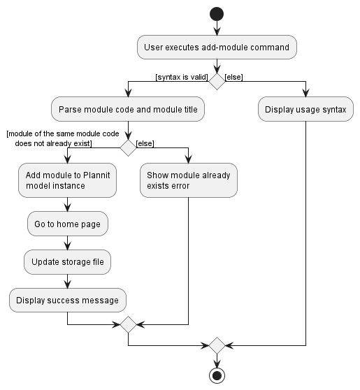
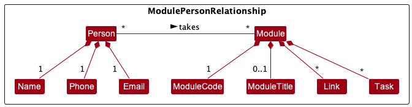

* Table of Contents
  {:toc}

--------------------------------------------------------------------------------------------------------------------

## **Acknowledgements**

* Libraries used: [JavaFX](https://openjfx.io), [Jackson](https://github.com/FasterXML/jackson), [JUnit5](https://github.com/junit-team/junit5). <br>
* This project is based on the AddressBook-Level3 project created by the [SE-EDU initiative](https://se-education.org).


--------------------------------------------------------------------------------------------------------------------

## **Setting up, getting started**

Refer to the guide [_Setting up and getting started_](SettingUp.md).

--------------------------------------------------------------------------------------------------------------------

## **Design**

<div markdown="span" class="alert alert-primary">

:bulb: **Tip:** The `.puml` files used to create diagrams in this document can be found in the [diagrams](https://github.com/se-edu/addressbook-level3/tree/master/docs/diagrams/) folder. Refer to the [_PlantUML Tutorial_ at se-edu/guides](https://se-education.org/guides/tutorials/plantUml.html) to learn how to create and edit diagrams.
</div>

### Architecture


The ***Architecture Diagram*** given above explains the high-level design of the App.

Given below is a quick overview of main components and how they interact with each other.

**Main components of the architecture**

**`Main`** has two classes called [`Main`](https://github.com/se-edu/addressbook-level3/tree/master/src/main/java/seedu/address/Main.java) and [`MainApp`](https://github.com/se-edu/addressbook-level3/tree/master/src/main/java/seedu/address/MainApp.java). It is responsible for,
* At app launch: Initializes the components in the correct sequence, and connects them up with each other.
* At shut down: Shuts down the components and invokes cleanup methods where necessary.

[**`Commons`**](#common-classes) represents a collection of classes used by multiple other components.

The rest of the App consists of four components.

* [**`UI`**](#ui-component): The UI of the App.
* [**`Logic`**](#logic-component): The command executor.
* [**`Model`**](#model-component): Holds the data of the App in memory.
* [**`Storage`**](#storage-component): Reads data from, and writes data to, the hard disk.


**How the architecture components interact with each other**

The *Sequence Diagram* below shows how the components interact with each other for the scenario where the user issues the command `delete 1`.


Each of the four main components (also shown in the diagram above),

* defines its *API* in an `interface` with the same name as the Component.
* implements its functionality using a concrete `{Component Name}Manager` class (which follows the corresponding API `interface` mentioned in the previous point.

For example, the `Logic` component defines its API in the `Logic.java` interface and implements its functionality using the `LogicManager.java` class which follows the `Logic` interface. Other components interact with a given component through its interface rather than the concrete class (reason: to prevent outside component's being coupled to the implementation of a component), as illustrated in the (partial) class diagram below.


The sections below give more details of each component.

### UI component

The **API** of this component is specified in [`Ui.java`](https://github.com/se-edu/addressbook-level3/tree/master/src/main/java/seedu/address/ui/Ui.java)


The UI consists of a `MainWindow` that is made up of parts e.g.`CommandBox`, `ResultDisplay`, `PersonListPanel`, `StatusBarFooter` etc. All these, including the `MainWindow`, inherit from the abstract `UiPart` class which captures the commonalities between classes that represent parts of the visible GUI.

The `UI` component uses the JavaFx UI framework. The layout of these UI parts are defined in matching `.fxml` files that are in the `src/main/resources/view` folder. For example, the layout of the [`MainWindow`](https://github.com/se-edu/addressbook-level3/tree/master/src/main/java/seedu/address/ui/MainWindow.java) is specified in [`MainWindow.fxml`](https://github.com/se-edu/addressbook-level3/tree/master/src/main/resources/view/MainWindow.fxml)

The `UI` component,

* executes user commands using the `Logic` component.
* listens for changes to `Model` data so that the UI can be updated with the modified data.
* keeps a reference to the `Logic` component, because the `UI` relies on the `Logic` to execute commands.
* depends on some classes in the `Model` component, as it displays `Person` object residing in the `Model`.

### Logic component

**API** : [`Logic.java`](https://github.com/se-edu/addressbook-level3/tree/master/src/main/java/seedu/address/logic/Logic.java)

Here's a (partial) class diagram of the `Logic` component:


How the `Logic` component works:
1. When `Logic` is called upon to execute a command, it uses the `AddressBookParser` class to parse the user command.
1. This results in a `Command` object (more precisely, an object of one of its subclasses e.g., `AddCommand`) which is executed by the `LogicManager`.
1. The command can communicate with the `Model` when it is executed (e.g. to add a person).
1. The result of the command execution is encapsulated as a `CommandResult` object which is returned back from `Logic`.

The Sequence Diagram below illustrates the interactions within the `Logic` component for the `execute("delete 1")` API call.


<div markdown="span" class="alert alert-info">:information_source: **Note:** The lifeline for `DeleteCommandParser` should end at the destroy marker (X) but due to a limitation of PlantUML, the lifeline reaches the end of diagram.
</div>

Here are the other classes in `Logic` (omitted from the class diagram above) that are used for parsing a user command:


How the parsing works:
* When called upon to parse a user command, the `AddressBookParser` class creates an `XYZCommandParser` (`XYZ` is a placeholder for the specific command name e.g., `AddCommandParser`) which uses the other classes shown above to parse the user command and create a `XYZCommand` object (e.g., `AddCommand`) which the `AddressBookParser` returns back as a `Command` object.
* All `XYZCommandParser` classes (e.g., `AddCommandParser`, `DeleteCommandParser`, ...) inherit from the `Parser` interface so that they can be treated similarly where possible e.g, during testing.

### Model component
**API** : [`Model.java`](https://github.com/se-edu/addressbook-level3/tree/master/src/main/java/seedu/address/model/Model.java)


The `Model` component,

* stores the address book data i.e., all `Person` objects (which are contained in a `UniquePersonList` object).
* stores the currently 'selected' `Person` objects (e.g., results of a search query) as a separate _filtered_ list which is exposed to outsiders as an unmodifiable `ObservableList<Person>` that can be 'observed' e.g. the UI can be bound to this list so that the UI automatically updates when the data in the list change.
* stores a `UserPref` object that represents the user’s preferences. This is exposed to the outside as a `ReadOnlyUserPref` objects.
* does not depend on any of the other three components (as the `Model` represents data entities of the domain, they should make sense on their own without depending on other components)

<div markdown="span" class="alert alert-info">:information_source: **Note:** An alternative (arguably, a more OOP) model is given below. It has a `Tag` list in the `AddressBook`, which `Person` references. This allows `AddressBook` to only require one `Tag` object per unique tag, instead of each `Person` needing their own `Tag` objects.<br>


</div>


### Storage component

**API** : [`Storage.java`](https://github.com/se-edu/addressbook-level3/tree/master/src/main/java/seedu/address/storage/Storage.java)


The `Storage` component,
* can save both address book data and user preference data in json format, and read them back into corresponding objects.
* inherits from both `AddressBookStorage` and `UserPrefStorage`, which means it can be treated as either one (if only the functionality of only one is needed).
* depends on some classes in the `Model` component (because the `Storage` component's job is to save/retrieve objects that belong to the `Model`)

### Common classes

Classes used by multiple components are in the `seedu.addressbook.commons` package.

--------------------------------------------------------------------------------------------------------------------

## **Implementation**

This section describes some noteworthy details on how certain features are implemented.

### Add/Delete Module

#### Implementation

A `Module` class is used to represent a module. A `Module` contains a `ModuleCode` and an 
optional `ModuleTitle`. Here are the ways in which different classes in the `Model` component interact
with `Module`:
- A `UniqueModuleList` represents the list of `Module` objects.
- The list of modules is stored in the `AddressBook` class.
- The `ModelManager` class stores the `AddressBook` containing the list of unfiltered `Module` 
  objects, and a separate instance variable storing the list of filtered `Module` objects.

The UML class diagram of the `Module`-related parts of `Model` component is shown below:


We have implemented the following `Command` classes:
- `AddModuleCommand` allows the user to add a module to Plannit.
- `DeleteModuleCommand` allows the user to delete a module from Plannit.

The Storage component has been updated for persistent storage of modules. `JsonAdaptedModule` 
has been added to represent a `Module` object in JSON format.

Below shows a description of an example scenario for adding a command. Deletion of a command is 
similar except that the corresponding deletion class is used instead. 

Step 1: User enters command `add-module m/CS2105` to add module CS2105 to Plannit.

Step 2: `addressBookParser`, the parser for Plannit, will parse the user command to return an 
`AddModuleCommand` object.

Step 3: The resulting `AddModuleCommand` object is then executed. The validity of the input 
module code provided is checked. This involves a check of whether the input is a duplicate module 
(case-insensitive, removing leading and trailing whitespaces). 

Step 4: After successful checks, the module `CS2105` will be added into Plannit. 

Step 5: The `saveAddressBook()` method of `StorageManager` is called to save the newly-updated list
of modules to a JSON file. 

Step 6: `JsonAddressBookStorage` is called, which serializes/converts the new list of modules 
into JSON format, so that it can be saved into a file. The file will be read whenever Plannit 
starts up so that it can load saved module and person data.

Step 7: Plannit Graphical User Interface (GUI) displays message that the addition of module has 
been successful. 

The following activity diagram summarizes what happens when the user requests to add module to 
Plannit via `add-module` command.



#### Alternatives Considered

Aspect: The class-level design of how to integrate the `Module` class to the `Model` component.

* **Alternative 1 (current choice):** Reuse the same `AddressBook` to also store the list of 
  unique `Module` objects.

    * Pros: A duplicate class `AddressBook` for `Model` methods is not necessary.

    * Cons: `AddressBook`, `ModelManager` and other classes would need to be updated to include 
`Module`. Hence, the interfaces `ReadOnlyAddressBook` and `Model` also need to be updated to support
the `Module`-related methods.

* **Alternative 2:** Create another `AddressBook`-like class to store the list of `Module` objects.

    * Pros: Functionality for `Person` and `Module` are now separate. This better adheres to the 
Single Responsibility Principle because `AddressBook` only does operations regarding `Person` 
rather than doing operations regarding both `Person` and `Module`.

    * Cons: More classes to implement. In particular, `AddressBook` and `ReadOnlyAddressBook` 
need to be duplicated into separate classes to support `Module`.

Rationale behind current choice: 
1. Duplicating `AddressBook` will result in duplicating dependent classes such as 
`ReadOnlyAddressBook`, `JsonAddressBookStorage` and `JsonSerializableAddressBook`, hence complicating
the implementation. For example, the storage component will now need to deal with two `AddressBook` 
instances, hence requiring either two separate storage files, or changing the implementation 
to combine the contents of the two different `AddressBook`-like classes into one file. Combining 
`Person` and `Module` into one `AddressBook` would avoid this issue.
2. While dealing with lists of `Person` and `Module` objects are two different functionalities, 
both functionalities deal with a list of user-provided objects. Therefore, the cohesion should not 
significantly decrease.

### \[Coming soon\] Add person to module

A person can take several modules. The relationship between `Person` and `Model` is displayed 
in the Object Oriented Domain Model diagram below:



### Goto module feature

#### Implementation

Goto module mechanism is facilitated by `GoToCommand`, `ModuleCodeMatchesKeywordPredicate` and `GoToCommandParser`.
It allows users to navigate to a specific module given their respective module code. <br>

It uses the following methods provided by `ModelManager` which implements the `Model` interface.
* `ModelManager::updateFilteredModuleList`: Update the current module list and filter it according to the given predicate `Predicate<Module> predicate`, reflecting the changes accordingly in the GUI
* `ModelManager::setHomeStatus`: Sets the home status of Plannit.

Given below is an example usage scenario and how the mechanism
behaves when a user navigates to a module in Plannit.

**Step 1**. The user requests to navigate to a module present in the Plannit
by inputting the `goto` command followed by the module code of the module.
E.g.:
```
goto CS1231
```

**Step 2**: The `LogicManager` calls the `LogicManager::execute` method on the
user input `String`.

**Step 3**: The `LogicManager::execute` method first parses the user input
`String` into a `Command` object using the `AddressBookParser::parseCommand`
method.

**Step 4**: The command word, `goto`, is extracted from the user input and
a new `GoToCommandParser` is instantiated to parse the arguments.

**Step 5**: The `GoToCommandParser::parse` method is then called to
parse the arguments. After validating the arguments provided by the user, a
new `ModuleCodeMatchesKeywordPredicate` is instantiated with the provided module code.

**Step 6**: The `ModuleCodeMatchesKeywordPredicate` object is then used to instantiate
a `GoToCommand` object that is returned to the `LogicManager`.

**Step 7**: The `GoToCommand::execute` method is then called by the
`LogicManager`.

**Step 8**: The current module list via `ModelManager::updateFilteredModuleList`,
filtering the module list according to the predicate object instantiated in **Step 5**.

**Step 9**: The home status is set to false via `ModelManager::SetHomeStatus`.

**Step 10**: A new `CommandResult` object is returned, indicating success.

The following sequence diagram summarizes what happens when a user executes the `goto` command:


<div markdown="span" class="alert alert-info">:information_source: **Note:** The lifeline for `GoToCommandParser`
should end at the destroy marker (X) but due to a limitation of PlantUML, the lifeline reaches the end of diagram.
</div>

<div style="page-break-after: always;"></div>

The following activity diagram summarizes what happens when a user executes a `GoToCommand`:


#### Design consideration:

##### Aspect: How goto executes

* **Alternative 1 (current choice):** Navigate to a single module by module code and update home status.
    * Pros:
        * Provides an intuitive and more versatile way for users to navigate between modules.
        * Provides an intuitive usage of commands by limiting the scope of possible commands usable
          when out of the home page.
    * Cons: Unable to search for multiple persons with different attributes.

* **Alternative 2:** Navigate to a single module by module code.
    * Pros: Provides an intuitive and more versatile way for users to navigate between modules.
    * Cons: Might result in confusion when some commands are usable out of the home page.

* **Alternative 3:** Navigate to module by index.
    * Pros: Allows for quicker input as compared to typing out the entire module code
    * Cons: Require user to navigate back to home page before going to another module which might be unintuitive for users.

##### Rationale behind current choice:
1. Alternative 1 was chosen as it provides a more intuitive way for prospective users.

2. The following commands `list-module` and `find-module` are disabled as they are not meant to be used in tandem with `goto` command
   as the filtering of modules is not needed when there exist only one module.

3. The following commands `list-module` and `find-module` are disabled as they are not meant to be used in tandem with `goto` command
   as essential person within a module (i.e. professors, tutor assistant and friends) are likely to be limited in numbers.

Hence, to prevent confusion we chose Alternative 1.

<div style="page-break-after: always;"></div>

--------------------------------------------------------------------------------------------------------------------

## **Documentation, logging, testing, configuration, dev-ops**

* [Documentation guide](Documentation.md)
* [Testing guide](Testing.md)
* [Logging guide](Logging.md)
* [Configuration guide](Configuration.md)
* [DevOps guide](DevOps.md)

--------------------------------------------------------------------------------------------------------------------

## **Appendix: Requirements**

### Product scope

**Target user profile**:

* Tech-Savvy NUS CS Student
* Reasonably fast typer
* Comfortable using CLI apps
* Forgets which friends has common modules with him
* Takes a lot of modules
* Takes modules where information are spread over multiple websites
* Tends to work at night

**Value proposition**:
* This app aims to be a unified platform that helps the user manage his academic details.
* This application will be the go-to place to access all module links, information and deadlines without needing to tediously navigate through multiple different websites.


### User stories

Priorities: `High` (must have), `Medium` (nice to have), `Low` (unlikely to have)

| Priority | As a … | I want to … | So that I can…|
| - | - | - | - |
| `High` | User | Add a contact | View them in future settings |
| `High` | User | Delete a contact | Trim my contact list to keep it updated |
| `High` | User | Add a module into Plannit | Add details of the module |
| `High` | User | Delete a module into Plannit | Remove unnecessary modules after the semester ends |
| `High` | User | Add tasks for each module into Plannit | Keep track of tasks for each module |
| `High` | User | Delete tasks from module on Plannit | Remove tasks that have been completed |
| `High` | User | Add links | Store the links on Plannit for easy reference
| `High` | User | Delete links | Remove the links when the semester ends |
| `High` | User | Easily navigate through different modules | Quickly view relevant modules details |
| `High` | Busy User | See the overview of tasks on the home page | Get a quick summary of upcoming tasks |
| `Medium` | User | Edit module details | Rectify mistakes and update module details when needed |
| `Medium` | User | Edit a contact | Rectify mistakes and update contact details when needed |
| `Medium` | User | Sort tasks by deadlines | I can prioritise which tasks to complete first |
| `Medium` | User | Set different priorities to prioritise my tasks	| I know is important and should be done first |
| `Medium` | Forgetful Student | Organise contacts by module | I can discuss difficult assignment questions with them and delete them once the semester is completed |
| `Medium` | Organised Person | Filter contacts by tags | Search for contacts relevant for my case |
| `Medium` | Expert User | Search a keyword	| Go to the module which has the relevant topic I have in mind |
| `Medium` | User | Detect (and delete) duplicate items | Avoid adding a same item twice |
| `Medium` | New potential user | See the app populated with sample data | Easily see how the app will look like when it is in use |
| `Medium` | Forgetful student | Group contacts by tags	| Find out which friends are taking what modules |
| `Medium` | Expert User | Purge existing module data | Save time deleting all the module data when the semester ends |
| `Medium` | User |	Batch delete by module | I can forget the pain of dropping modules |
| `Low` | Forgetful Student	| Set a reminder to update me on my submission dates | Prevent any minor slip-ups in my work |
| `Low` | Morning Lark | Configure the application to light mode | See the words clearly under the sun |
| `Low` | Expert User | Archive existing data | Restore the data in case I mess up |
| `Low` | User | Undo the latest commands | Recover the data which I accidentally deleted |
| `Low` | User who is easily bored | Set different themes for the application | Enjoy different visuals  |
| `Low` | User | Find free times | Add more dates/schedule more meetings |

### Use cases

(For all use cases below, the **System** is the Plannit application and the **Actor** is the user, unless specified otherwise)

#### Use case: UC01 - Add a module
**Main Success Scenario (MSS)**
1. User requests to add module.
2. Plannit adds the module.
3. Plannit displays to the user that the module addition is successful.

Use case ends

**Extensions**
* 1a. The module already exists.
    * 1a1. Plannit displays an error message.

  Use case ends

#### Use case: UC02 - Delete a module
**Main Success Scenario (MSS)**
1.  User requests to list modules.
2.  Plannit displays a list of modules.
3.  User requests to delete a specific module in the list.
4.  Plannit deletes the module.

Use case ends.

**Extensions**

* 1a. The list is empty.

  Use case ends.

* 3a. The given index is invalid.

    * 3a1. Plannit displays an error message.

  Use case resumes at step 2.

#### Use case: UC03 - Find module
**Main Success Scenario (MSS)**
1. User chooses to search up a module's information.
2. Plannit requests for module code.
3. User enters the module code.
4. Plannit searches for module and displays module details.

Use case ends.

Extensions:
* 3a. Plannit detects that the specified module does not exist.
    * 3a1. Plannit displays a text, informing that the specified module does not exist.

  Use case ends.

#### Use case: UC04 - Add a task
**Preconditions**:
* User has completed [UC01](#use-case-uc01---add-a-module).
* Module list is not empty.

**Main Success Scenario (MSS)**
1.  User requests to add a task to a specific module in the list.
2.  Plannit adds the task to the module.

    Use case ends.

**Extensions**
* 1a. The given module is invalid.

    * 1a1. Plannit displays an error message.

  Use case ends.

* 1b. The given task is in an invalid format.

    * 1b1. Plannit displays an error message.

  Use case ends.

#### Use case: UC05 - Delete a task
**Preconditions**:
* User has completed [UC01](#use-case-uc01---add-a-module).
* Module list is not empty.
* Task list of module is not empty.

**Main Success Scenario (MSS)**
1.  User requests to delete a specific task from a module in the list.
2.  Plannit deletes the task from the module.

Use case ends.

**Extensions**
* 1a. The given module is invalid.

    * 1a1. Plannit displays an error message.

  Use case ends.

* 1b. The given task index is invalid.

    * 1b1. Plannit displays an error message.

  Use case ends.

#### Use case: UC06 - Find task
**Precondition**
* User has applied [UC13](#use-case-uc13---navigate-to-module) to navigate to a module.

**Main Success Scenario (MSS)**
1. User requests to search for a task.
2. Plannit displays to the user the list of tasks matching the user's search
   request.

**Extensions**
* 1a. User inputs empty search keyword.
    * 1a1. Plannit displays an error message.

  Use case ends.

#### Use case: UC07 - Add a Module Link
**Preconditions**:
* User has completed [UC01](#use-case-uc01---add-a-module).
* Module list is not empty.

**Main Success Scenario (MSS)**
1. User requests for the addition of a module-specific link.
2. Plannit adds and associates the entered link to the specific module.

Use case ends.

Extension:
* 1a. Plannit detects the module does not exist.
    * 1a1. Plannit displays an error message.

  Use case ends.

* 1b. Plannit detects the link is already added.
    * 1b1. Plannit displays an error message.

  Use case ends.

#### Use case: UC08 - Delete a Module Link
**Main Success Scenario (MSS)**
1. User requests for the deletion of a module-specific link.
2. Plannit deletes the entered link from the specific module.

Use case ends.

Extension:
* 1a. Plannit detects the module does not exist.
    * 1a1 Plannit displays an error message.

  Use case ends.

* 1b. Plannit detects the link does not exist.
    * 1b1 Plannit displays an error message.

  Use case ends.


#### Use case: UC09 - Add a contact
**Main Success Scenario (MSS)**
1.  User chooses to add a contact.
2.  Plannit requests for the to-be-added contact detail.
3.  User enters the to-be-added contact details.
4.  Plannit adds the contact and notifies the user that the contact has been successfully added.

Use case ends.

**Extensions**
* 3a. The contact is duplicate, i.e. name already exists.
    * 3a1. Plannit displays an error message notifying the user that a
      duplicate contact exists.

  Use case ends.

* 3b. The email address is invalid.
    * 3b1. Plannit displays an error message notifying the user that the
      email address is invalid.

  Use case ends.

* 3c. The phone number is invalid.
    * 3c1. Plannit displays an error message notifying the user that the phone
      number is invalid.

  Use case ends.

#### Use case: UC10 - Delete a contact
**Main Success Scenario (MSS)**
1. User chooses to delete a contact.
2. Plannit requests for the name of the contact.
3. User enters the contact's name.
4. Plannit searches for the contact and notifies user that the contact has been
   deleted.

Use case ends.

Extensions:
* 3a. Plannit detects that the specified contact does not exist.
    * 3a1. Plannit displays a text, informing that the specified contact does not exist.

  Use case ends.

#### Use case: UC11 - Find contact
**Main Success Scenario (MSS)**
1. User chooses to search up his friend's email.
2. Plannit requests for name of friend.
3. User enters the friend's name.
4. Plannit searches for the name and displays the friend's details.

Use case ends.

Extensions:
* 3a. Plannit detects that the specified contact does not exist.
    * 3a1. Plannit displays a text, informing that the specified contact does not exist.

  Use case ends.

#### Use case: UC12 - Navigate to Home Page
**Main Success Scenario (MSS)**
1.  User requests to navigate to Home Page.
2.  Plannit displays the Home Page.

Use case ends.

**Extensions**

* 1a. Already at Home Page.

  Use case ends.

#### Use case: UC13 - Navigate to Module
**Main Success Scenario (MSS)**
1.  User requests to navigate to a specific module.
2.  Plannit displays the module details.

Use case ends.

**Extensions**

* 1a. Module does not exist.

    * 1a1. Plannit displays an error message.

  Use case ends.

#### Use case: UC14 - Navigate to Contact Page
**Main Success Scenario (MSS)**
1.  User requests to navigate to the Contact Page.
2.  Plannit displays the Contact Page.

Use case ends.

**Extensions**

* 1a. Plannit is already at the Contact Page.

  Use case ends.

#### Use case: UC15 - Exit program
**Main Success Scenario (MSS)**
1.  User requests to exit program.
2.  Plannit closes program.

Use case ends.


### Non-Functional Requirements

#### Constraints
1. Plannit cannot use NUS API to scrap data from LumiNUS/Canvas.
2. Plannit should run independently of remote servers.
3. Plannit cannot use a relational database management system.
4. Plannit executable size should be smaller than 100MB.

#### Technical Environment
1. Should work on any _mainstream OS_ as long as it has Java `11` or above installed.
2. Plannit should work on 64-bit environments.
3. The GUI should:
    * _work well_ for standard screen resolutions 1920x1080 and higher, and for screen scales 100% and 125%.
    * be _usable_ for screen resolutions 1280x720 and higher, and for screen scales 150%.
4. Plannit is packaged into one `JAR` file.
5. The software should work without an installer.
6. Plannit should work without an internet connection.

#### Performance
1. Plannit should be able to hold up to 1000 _entries_ without a noticeable sluggishness in performance for typical usage.
2. Plannit should be able to save and load up to 1000 _entries_ without a noticeable delay in performance.
3. Plannit should respond to any user requests within 2 seconds as long as there are less than 1000 entries.

#### Quality
1. Plannit should be usable by someone with better-than-average typing speed.
2. Plannit should be beginner-friendly and easily picked up by new users.
3. Font size should be of reasonable size.
4. The colours of the application should not induce eye strain.

#### Process
1. Development of Plannit should adhere to the following deadlines:
    * **v1.1**: 28 September 2022 (Week 7, Wednesday)
    * **v1.2**: 12 October 2022 (Week 9, Wednesday)
    * **v1.3**: 26 October 2022 (Week 11, Wednesday)
    * **v1.4**: 09 November 2022 (Week 13, Wednesday)
2. The team should meet every Saturday at 9pm until the end of the project.
3. Each team member should follow the forking workflow.
4. At least 2 members need to approve a pull request before it can be successfully merged into the master branch on `GitHub`.
5. Plannit's implementation should follow Object-Oriented Programming paradigm primarily.

#### Project Scope
1. Plannit does not automatically update module details/links.
2. Plannit does not rigorously check for the validity of the email provided by the user.
3. Plannit does not verify the security of links provided by the user
4. Plannit does not ensure the validity of links provided by the user.
5. Plannit does not rigorously check for the existence of phone number provided by the user.
6. Plannit does not remind the user of upcoming tasks with notifications.
7. Plannit does not check for invalid module codes.

#### Other noteworthy points
1. Plannit's code should be easily testable.

### Glossary
* **Entries**: Modules, Contacts, Links, Tasks
* **Mainstream OS**: Windows, Linux, Unix, macOS
* **Usable**: All functions can be used even if the user experience is not optimal
* **Work well**: Should not cause any resolution-related inconveniences to the user

--------------------------------------------------------------------------------------------------------------------

## **Appendix: Instructions for manual testing**

Given below are instructions to test the app manually.

<div markdown="span" class="alert alert-info">:information_source: **Note:** These instructions only provide a starting point for testers to work on;
testers are expected to do more *exploratory* testing.

</div>

### Launch and shutdown

1. Initial launch

    1. Download the `JAR` file and copy into an empty folder

    1. Double-click the `JAR` file Expected: Shows the GUI with a set of sample contacts. The window size may not be optimum.

1. Saving window preferences

    1. Resize the window to an optimum size. Move the window to a different location. Close the window.

    1. Re-launch the app by double-clicking the `JAR` file.<br>
       Expected: The most recent window size and location is retained.

1. _{ more test cases … }_

### Deleting a module

1. Deleting a module while all modules are being shown

    1. Prerequisites: List all modules using the `list` command. Multiple modules in the list.

    1. Test case: `delete 1`<br>
       Expected: First module is deleted from the list. Details of the deleted module shown in the status message. Timestamp in the status bar is updated.

    1. Test case: `delete 0`<br>
       Expected: No module is deleted. Error details shown in the status message. Status bar remains the same.

    1. Other incorrect delete commands to try: `delete`, `delete x`, `...` (where `x` is larger than the list size)<br>
       Expected: Similar to previous.

1. _{ more test cases … }_

### Deleting a contact

1. Deleting a contact while all contacts are being shown

    1. Prerequisites: List all modules using the `list` command. Multiple modules in the list.

    1. Test case: `delete 1`<br>
       Expected: First contact is deleted from the list. Details of the deleted contact shown in the status message. Timestamp in the status bar is updated.

    1. Test case: `delete 0`<br>
       Expected: No person is deleted. Error details shown in the status message. Status bar remains the same.

    1. Other incorrect delete commands to try: `delete`, `delete x`, `...` (where x is larger than the list size)<br>
       Expected: Similar to previous.

1. _{ more test cases … }_

### Saving data

1. Dealing with missing/corrupted data files

    1. _{explain how to simulate a missing/corrupted file, and the expected behavior}_

1. _{ more test cases … }_
