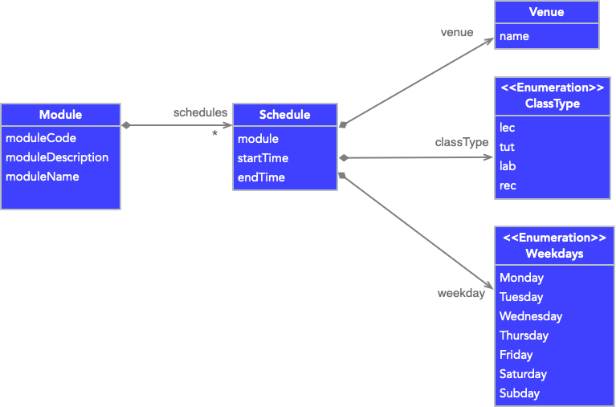

* Table of Contents
{:toc}

--------------------------------------------------------------------------------------------------------------------

## **Acknowledgements**

* {list here sources of all reused/adapted ideas, code, documentation, and third-party libraries -- include links to the original source as well}

--------------------------------------------------------------------------------------------------------------------

## **Setting up, getting started**

Refer to the guide [_Setting up and getting started_](SettingUp.md).

--------------------------------------------------------------------------------------------------------------------

## **Design**

:bulb: **Tip:** The `.puml` files used to create diagrams in this document can be found in the [diagrams](https://github.com/se-edu/addressbook-level3/tree/master/docs/diagrams/) folder. Refer to the [_PlantUML Tutorial_ at se-edu/guides](https://se-education.org/guides/tutorials/plantUml.html) to learn how to create and edit diagrams.

### Architecture

The ***Architecture Diagram*** given above explains the high-level design of the App.

Given below is a quick overview of main components and how they interact with each other.

**Main components of the architecture**

**`Main`** has two classes called [`Main`](https://github.com/se-edu/addressbook-level3/tree/master/src/main/java/seedu/address/Main.java) and [`MainApp`](https://github.com/se-edu/addressbook-level3/tree/master/src/main/java/seedu/address/MainApp.java). It is responsible for,
* At app launch: Initializes the components in the correct sequence, and connects them up with each other.
* At shut down: Shuts down the components and invokes cleanup methods where necessary.

[**`Commons`**](#common-classes) represents a collection of classes used by multiple other components.

The rest of the App consists of four components.

* [**`UI`**](#ui-component): The UI of the App.
* [**`Logic`**](#logic-component): The command executor.
* [**`Model`**](#model-component): Holds the data of the App in memory.
* [**`Storage`**](#storage-component): Reads data from, and writes data to, the hard disk.

**How the architecture components interact with each other**

The *Sequence Diagram* below shows how the components interact with each other for the scenario where the user issues the command `delete 1`.

Each of the four main components (also shown in the diagram above),

* defines its *API* in an `interface` with the same name as the Component.
* implements its functionality using a concrete `{Component Name}Manager` class (which follows the corresponding API `interface` mentioned in the previous point.

For example, the `Logic` component defines its API in the `Logic.java` interface and implements its functionality using the `LogicManager.java` class which follows the `Logic` interface. Other components interact with a given component through its interface rather than the concrete class (reason: to prevent outside component's being coupled to the implementation of a component), as illustrated in the (partial) class diagram below.

The sections below give more details of each component.

### UI component

The **API** of this component is specified in [`Ui.java`](https://github.com/se-edu/addressbook-level3/tree/master/src/main/java/seedu/address/ui/Ui.java)

The UI consists of a `MainWindow` that is made up of parts e.g.`CommandBox`, `ResultDisplay`, `PersonListPanel`, `StatusBarFooter` etc. All these, including the `MainWindow`, inherit from the abstract `UiPart` class which captures the commonalities between classes that represent parts of the visible GUI.

The `UI` component uses the JavaFx UI framework. The layout of these UI parts are defined in matching `.fxml` files that are in the `src/main/resources/view` folder. For example, the layout of the [`MainWindow`](https://github.com/se-edu/addressbook-level3/tree/master/src/main/java/seedu/address/ui/MainWindow.java) is specified in [`MainWindow.fxml`](https://github.com/se-edu/addressbook-level3/tree/master/src/main/resources/view/MainWindow.fxml)

The `UI` component,

* executes user commands using the `Logic` component.
* listens for changes to `Model` data so that the UI can be updated with the modified data.
* keeps a reference to the `Logic` component, because the `UI` relies on the `Logic` to execute commands.
* depends on some classes in the `Model` component, as it displays `Person` object residing in the `Model`.

### Logic component

**API** : [`Logic.java`](https://github.com/se-edu/addressbook-level3/tree/master/src/main/java/seedu/address/logic/Logic.java)

Here's a (partial) class diagram of the `Logic` component:

How the `Logic` component works:
1. When `Logic` is called upon to execute a command, it uses the `AddressBookParser` class to parse the user command.
1. This results in a `Command` object (more precisely, an object of one of its subclasses e.g., `AddCommand`) which is executed by the `LogicManager`.
1. The command can communicate with the `Model` when it is executed (e.g. to add a person).
1. The result of the command execution is encapsulated as a `CommandResult` object which is returned back from `Logic`.

The Sequence Diagram below illustrates the interactions within the `Logic` component for the `execute("delete 1")` API call.

:information_source: **Note:** The lifeline for `DeleteCommandParser` should end at the destroy marker (X) but due to a limitation of PlantUML, the lifeline reaches the end of diagram.

Here are the other classes in `Logic` (omitted from the class diagram above) that are used for parsing a user command:

How the parsing works:
* When called upon to parse a user command, the `AddressBookParser` class creates an `XYZCommandParser` (`XYZ` is a placeholder for the specific command name e.g., `AddCommandParser`) which uses the other classes shown above to parse the user command and create a `XYZCommand` object (e.g., `AddCommand`) which the `AddressBookParser` returns back as a `Command` object.
* All `XYZCommandParser` classes (e.g., `AddCommandParser`, `DeleteCommandParser`, ...) inherit from the `Parser` interface so that they can be treated similarly where possible e.g, during testing.

### Model component
**API** : [`Model.java`](https://github.com/se-edu/addressbook-level3/tree/master/src/main/java/seedu/address/model/Model.java)

The `Model` component,

* stores the address book data i.e., all `Person` objects (which are contained in a `UniquePersonList` object).
* stores the currently 'selected' `Person` objects (e.g., results of a search query) as a separate _filtered_ list which is exposed to outsiders as an unmodifiable `ObservableList<Person>` that can be 'observed' e.g. the UI can be bound to this list so that the UI automatically updates when the data in the list change.
* stores a `UserPref` object that represents the user’s preferences. This is exposed to the outside as a `ReadOnlyUserPref` objects.
* does not depend on any of the other three components (as the `Model` represents data entities of the domain, they should make sense on their own without depending on other components)

:information_source: **Note:** An alternative (arguably, a more OOP) model is given below. It has a `Tag` list in the `AddressBook`, which `Person` references. This allows `AddressBook` to only require one `Tag` object per unique tag, instead of each `Person` needing their own `Tag` objects. 

#### Schedule

**API** : [Schedule.java](https://github.com/AY2223S1-CS2103T-W11-2/tp/tree/master/src/main/java/seedu/address/model/module/schedule)

The `Schedule` component

- represents a schedule of its corresponding module

:information_source: **Note:** An alternative design is to let `Schedule` object have a reference of the module it belongs to. The diagram is as follows:  
  

  

### Storage component

**API** : [`Storage.java`](https://github.com/se-edu/addressbook-level3/tree/master/src/main/java/seedu/address/storage/Storage.java)

The `Storage` component,
* can save both address book data and user preference data in json format, and read them back into corresponding objects.
* inherits from both `AddressBookStorage` and `UserPrefStorage`, which means it can be treated as either one (if only the functionality of only one is needed).
* depends on some classes in the `Model` component (because the `Storage` component's job is to save/retrieve objects that belong to the `Model`)

### Common classes

Classes used by multiple components are in the `seedu.addressbook.commons` package.

--------------------------------------------------------------------------------------------------------------------

## **Implementation**

This section describes some noteworthy details on how certain features are implemented.

### Person Model, Student Class and Student ID

#### Implementation

The class diagram below shows out current implementation of the `Student` class 
which extends from the `Person` class.

Each `Student` in ProfNUS will contain the basic information in the `Person` class.
Additionally, it will also contain these fields:
- `StudentId`: A unique student id to identify each student.
- `TelegramHandle`: The student's telegram handle.
- `studentModuleInfo`: A set of ModuleCode's that the student is taking.
- `teachingAssistantInfo`: A set of ModuleCode's that the student is a teaching assistant for.

#### Design consideration:

##### Aspect 1: Inheritance vs Refactoring of Code

* **Alternative 1 (current choice):** Make `Student` inherit from `Person`
    * Pros:
      * More OOP since `Student` is a `Person`, thus allowing more flexibility through polymorphism.
      * Improves the extensibility of the project since we are not constrained to 
      having a single class to represent all the people in the project. Can include different types
      of persons in the future such as other professors.
    * Cons:
      * Harder to implement, have to write more code and test cases.
      * Have to consider Liskov Substitution Principle when writing code. 

* **Alternative 2:** Refactor `Person` into `Student` class
  * Pros:
    * Easier to implement since it just involves the refactoring of code.
  * Cons:
    * Limits the extensibility of the project to just a student managing application.

##### Aspect 2: How to ensure Student being added is unique

* **Alternative 1 (current choice):** Ensure that the `StudentId` of each student is unique
  * Pros:
    * Convenient and easy to implement since all students have a unique studentId when they
    matriculate into NUS
  * Cons:
    * The `StudentId` field is editable, and we cannot ensure that the `StudentId` that is added is 
    a valid Id of a student in NUS. 

* **Alternative 2:** Ensure that students do not have the same name/fields
  * Pros:
    * Already implemented in AB3, do not need to change much
  * Cons:
    * NUS has many students, and it is inevitable that some of them will share the exact same name

### The edit student feature

#### Implementation

The edit student mechanism is facilitated by `EditStuCommand`, `EditStuCommandParser` and `EditStudentDescriptor` 
classes. The `EditStuCommandParser` is in charge of parsing the user's input which then creates a 
`EditStudentDescriptor` and returns a `EditStuCommand`. When the `EditStuCommand` is executed, it modifies the student
at the index provided by the user.

The following sequence diagram shows how the `editstu` command works:

### Find module details by module code feature

#### Implementation

The find module details mechanism is facilitated by `ModuleViewCommand` and `ModuleViewCommandParser`. It allows users to search for modules based on module code.
It uses `ModelManager#updateFilteredModuleList(Predicate<Module> predicate)` which is exposed in the Model interface as `Model#updateFilteredModuleList(Predicate<Module> predicate)`.
The method updates the student and tutor list and filters it according to the given predicate which will then be reflected accordingly in the GUI.

The following sequence diagram shows how the find module by module code operation works:

The following activity diagram summarizes what happens when a user executes a `mview` command:

#### Design consideration:

##### Aspect: How mview executes

|                                             | Pros                                                     | Cons                                    |
| ------------------------------------------- | -------------------------------------------------------- | --------------------------------------- |
| **Option 1**   Searching by module code | Allows module with different codes to have the same name | User might not remember the module code |
| **Option 2**   Searching by module name | Easier for user to search for the module                 | Modules cannot have the same name       |

Reason for choosing option 1:
Modules like CS2103T, CS2103R and CS2103 have the same module name "Software Engineering". If we allow searching by module name, the program would not know which "Software Engineering" module to display.
This would mean that we would need to have unique module names. However, this is not possible if the professor is teaching modules that have the same name but different code.

### [Proposed] Edit a module feature
### Proposed Implementation

The proposed edit module functionality is facilitated by `EditModuleCommand`. It extends `Command` and overrides the method `Command#execute(Model model)`.

The following sequence diagram shows how editing a module works:

The following activity diagram summarizes what happens when a user executes a `medit` command.

#### Design consideration:

##### Aspect: How medit executes

|                                                           | Pros                                           | Cons                                               |
|-----------------------------------------------------------|------------------------------------------------|----------------------------------------------------|
| **Option 1**   Edit by module code                    | Allows convenience if module code is known     | User might not remember the module code            |
| **Option 2**   Edit by making use of indexing in list | Allows convenience if module code is forgotten | Have to use `mlist` command to obtain the indexing |

Reason for choosing option 1:
A professor is more highly likely to remember the module codes of the modules that he is teaching rather than the index in the list in our application. Hence,
an additional step would be required of the professor if option 2 were to be chosen. Therefore, option 1 is preferred.

### [Proposed] AddSchedule feature
#### Proposed Implementation

The proposed add schedule functionality is accomplished by `AddScheduleCommand` which extends the `Command` class. The `AddScheduleCommand` overrides the following method:

- `AddScheduleCommand#execute(Model model)` — Executes the command and add the new schedule to the ProfNUS

The following sequence diagram shows how add schedule operation works

After the ProfNUS receives the instruction to add a new `Scheudule`, it will find the corresponding `Module` and add the new schedule to its schedule list.

During the execution, the following validity checks will be conducted:

- Module existence check — The model will check if it can find the module indicated by the new schedule. If no module is found, then a `CommandException` will be thrown.
- Schedule conflict check — The model will check if the new schedule conflicts with any existing schedules that the user has. If conflict happens, then a `CommandException` will be thrown.

:information_source: **Note:** If the command isn't executed successfully and a `CommandException` is thrown, then the new schedule won't be added to the ProfNUS.

### [Proposed] EditSchedule feature

#### Proposed Implementation

The proposed edit schedule functionality is accomplished by `EditScheduleCommand` which extends the `Command` class. The `EditScheduleCommand` overrides the following method:

- `EditScheduleCommand#execute(Model model)` — Executes the command and edits the target schedule with new information

The following sequence diagram shows how add schedule operation works

After the ProfNUS receives the instruction to edit a target `Schedule` (indicated by the index in the shown schedule list), it will modify it based on new information given by the user.

During the execution, the following validity checks will be conducted:

- Index validity check — The model will check if the index is valid. More specifically, the index should be within the range of $1$ to $n$ where $n$ is the total number of schedules. If the index is invalid, then a `CommandException` will be thrown.
- Schedule conflict check — The model will check if the edited schedule conflicts with any existing schedules that the user has. If conflict happens, then a `CommandException` will be thrown.
- Optional parameters check — The parser will check if at least one of fields of the `Schedule` is edited. If no modification exists, then a `ParserException` will be thrown.

:information_source: **Note:** If the edit schedule command isn't executed successfully and a `CommandException` or `ParserException` is thrown, then no schedule will be edited.

### [Proposed] ViewSchedule feature

#### Proposed Implementation

The proposed view schedule functionality is accomplished by `ViewScheduleCommand` which extends the `Command` class. The `ViewScheduleCommand` overrides the following method:

- `ViewScheduleCommand#execute(Model model)` — Executes the command and displays the selected schedules / all schedules

The following sequence diagram shows how view schedule operation works :

--------------------------------------------------------------------------------------------------------------------

## **Documentation, logging, testing, configuration, dev-ops**

* [Documentation guide](Documentation.md)
* [Testing guide](Testing.md)
* [Logging guide](Logging.md)
* [Configuration guide](Configuration.md)
* [DevOps guide](DevOps.md)

--------------------------------------------------------------------------------------------------------------------

## **Appendix: Requirements**

### Product scope

**Target user profile**:

* NUS SOC Professors
* has a need to view and manage a significant number of students
* has modules to manage
* prefer desktop apps over other types
* can type fast
* prefers typing to mouse interactions
* is reasonably comfortable using CLI apps

**Value proposition**: The application helps NUS SOC Professors manage their students and TA in the various modules, by providing a quick and easy way to find and contact them.

### User stories

Priorities: High (must have) - `* * *`, Medium (nice to have) - `* *`, Low (unlikely to have) - `*`

| Priority | As a …​       | I want to …​                                | So that I can…​                             |
|----------|---------------|---------------------------------------------|---------------------------------------------|
| `* * *`  | SoC Professor | View the contact information of my students | I can contact them                          |
| `* * *`  | SoC Professor | View the list of modules                    | Better plan my module's timeslots           |
| `* * *`  | SoC Professor | Edit the information of my students         | Rectify inaccuracies in student information |
| `* * *`  | SoC Professor | Find a student                              |                                             |
| `* * *`  | SoC Professor | Add new student to a module                 |                                             |
| `* * *`  | SoC Professor | Add a module                                |                                             |
| `* * *`  | SoC Professor | Delete a module                             |                                             |
| `* *`    | SoC Professor | View my teaching timetable                  | Plan my activities in advance               |

*{More to be added}*

### Use cases

(For all use cases below, the **System** is the `ProfNUS` and the **Actor** is the `user`, unless specified otherwise)

**Use case: Add a module**

**MSS**

1. User requests to list modules
2. ProfNUS shows a list of modules
3. User requests to add a module to the list
4. ProfNUS adds the module

   Use case ends.

**Use case: Delete a module**

**MSS**

1. User requests to list modules
2. ProfNUS shows a list of modules
3. User requests to delete a module in the list
4. ProfNUS deletes the module

   Use case ends.

**Extensions**

* 2a. The list is empty.

  Use case ends.

* 3a. The given index is invalid.

    * 3a1. ProfNUS shows an error message.

      Use case resumes at step 2.

**Use case: Add a student**

**MSS**

1. User requests to list modules
2. ProfNUS shows a list of modules
3. User request to list students in a particular module
4. ProfNUS shows a list of students
5. User requests to add a specific student to the list
6. ProfNUS adds the student

   Use case ends.

**Extensions**

* 2a. The list is empty.

  Use case ends.

**Use case: Delete a student**

**MSS**

1. User requests to list modules
2. ProfNUS shows a list of modules
3. User request to list students in a particular module
4. ProfNUS shows a list of students
5. User requests to delete a specific student in the list
6. ProfNUS deletes the student

    Use case ends.

**Extensions**

* 2a. The list is empty.

  Use case ends.

* 4a. The list is empty.

  Use case ends.

* 5a. The given index is invalid.

    * 5a1. ProfNUS shows an error message.

      Use case resumes at step 2.

**Use case: Add an event**

**MSS**

1. User requests to list modules
2. ProfNUS shows a list of modules
3. User requests to add an event to the module
4. ProfNUS adds the event

   Use case ends.

**Extensions**

* 2a. The list is empty.

  Use case ends.

**Use case: Delete an event**

**MSS**

1. User requests to list modules
2. ProfNUS shows a list of modules
3. User requests to delete an event in the module
4. ProfNUS deletes the event

   Use case ends.

**Extensions**

* 2a. The list is empty.

  Use case ends.

* 3a. The given index is invalid.

    * 3a1. ProfNUS shows an error message.

      Use case resumes at step 2.

*{More to be added}*

### Non-Functional Requirements

1.  Should work on any _mainstream OS_ as long as it has Java `11` or above installed.
2.  A user with above average typing speed for regular English text (i.e. not code, not system admin commands) should be able to accomplish most of the tasks faster using commands than using the mouse.
3.  User data are stored in local files.
4.  Should be used only by users authorized as SoC professors.
5.  The probability of critical failure should be lower than 5%.
6.  Should be able to process 500 or more students information without a noticeable lag.

*{More to be added}*

### Glossary

1. **Mainstream OS**: Windows, Linux, Unix, OS-X
2. **Private contact detail**: A contact detail that is not meant to be shared with others
3. **SoC**: School of Computing, National University of Singapore
4. **Module**: Courses provided by professors from SoC
5. **CLI**: Command-Line Interface(CLI), which receives commands from a user in the form of lines of text

--------------------------------------------------------------------------------------------------------------------

## **Appendix: Instructions for manual testing**

Given below are instructions to test the app manually.

:information_source: **Note:** These instructions only provide a starting point for testers to work on;
testers are expected to do more *exploratory* testing.

### Launch and shutdown

1. Initial launch

   1. Download the jar file and copy into an empty folder

   1. Double-click the jar file Expected: Shows the GUI with a set of sample contacts. The window size may not be optimum.

1. Saving window preferences

   1. Resize the window to an optimum size. Move the window to a different location. Close the window.

   1. Re-launch the app by double-clicking the jar file. 
       Expected: The most recent window size and location is retained.

1. _{ more test cases …​ }_

### Deleting a person

1. Deleting a person while all persons are being shown

   1. Prerequisites: List all persons using the `list` command. Multiple persons in the list.

   1. Test case: `delete 1` 
      Expected: First contact is deleted from the list. Details of the deleted contact shown in the status message. Timestamp in the status bar is updated.

   1. Test case: `delete 0` 
      Expected: No person is deleted. Error details shown in the status message. Status bar remains the same.

   1. Other incorrect delete commands to try: `delete`, `delete x`, `...` (where x is larger than the list size) 
      Expected: Similar to previous.

1. _{ more test cases …​ }_

### Saving data

1. Dealing with missing/corrupted data files

   1. _{explain how to simulate a missing/corrupted file, and the expected behavior}_

1. _{ more test cases …​ }_
