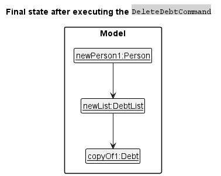

* Table of Contents
{:toc}

--------------------------------------------------------------------------------------------------------------------

## **Acknowledgements**

* {list here sources of all reused/adapted ideas, code, documentation, and third-party libraries -- include links to the original source as well}

--------------------------------------------------------------------------------------------------------------------

## **Setting up, getting started**

Refer to the guide [_Setting up and getting started_](SettingUp.md).

--------------------------------------------------------------------------------------------------------------------

## **Design**

:bulb: **Tip:** The `.puml` files used to create diagrams in this document can be found in the [diagrams](https://github.com/AY2223S1-CS2103T-W13-3/tp/tree/master/docs/diagrams/) folder. Refer to the [_PlantUML Tutorial_ at se-edu/guides](https://se-education.org/guides/tutorials/plantUml.html) to learn how to create and edit diagrams.

### Architecture

The ***Architecture Diagram*** given above explains the high-level design of the App.

Given below is a quick overview of main components and how they interact with each other.

**Main components of the architecture**

**`Main`** has two classes called [`Main`](https://github.com/AY2223S1-CS2103T-W13-3/tp/blob/master/src/main/java/paymelah/Main.java) and [`MainApp`](https://github.com/AY2223S1-CS2103T-W13-3/tp/blob/master/src/main/java/paymelah/MainApp.java). It is responsible for,
* At app launch: Initializes the components in the correct sequence, and connects them up with each other.
* At shut down: Shuts down the components and invokes cleanup methods where necessary.

[**`Commons`**](#common-classes) represents a collection of classes used by multiple other components.

The rest of the App consists of four components.

* [**`UI`**](#ui-component): The UI of the App.
* [**`Logic`**](#logic-component): The command executor.
* [**`Model`**](#model-component): Holds the data of the App in memory.
* [**`Storage`**](#storage-component): Reads data from, and writes data to, the hard disk.

**How the architecture components interact with each other**

The *Sequence Diagram* below shows how the components interact with each other for the scenario where the user issues the command `delete 1`.

Each of the four main components (also shown in the diagram above),

* defines its *API* in an `interface` with the same name as the Component.
* implements its functionality using a concrete `{Component Name}Manager` class (which follows the corresponding API `interface` mentioned in the previous point.

For example, the `Logic` component defines its API in the `Logic.java` interface and implements its functionality using the `LogicManager.java` class which follows the `Logic` interface. Other components interact with a given component through its interface rather than the concrete class (reason: to prevent outside component's being coupled to the implementation of a component), as illustrated in the (partial) class diagram below.

The sections below give more details of each component.

### UI component

The **API** of this component is specified in [`Ui.java`](https://github.com/AY2223S1-CS2103T-W13-3/tp/blob/master/src/main/java/paymelah/ui/Ui.java)

The UI consists of a `MainWindow` that is made up of parts e.g.`CommandBox`, `ResultDisplay`, `PersonListPanel`, `StatusBarFooter` etc. All these, including the `MainWindow`, inherit from the abstract `UiPart` class which captures the commonalities between classes that represent parts of the visible GUI.

The `UI` component uses the JavaFx UI framework. The layout of these UI parts are defined in matching `.fxml` files that are in the `src/main/resources/view` folder. For example, the layout of the [`MainWindow`](https://github.com/AY2223S1-CS2103T-W13-3/tp/blob/master/src/main/java/paymelah/ui/MainWindow.java) is specified in [`MainWindow.fxml`](https://github.com/AY2223S1-CS2103T-W13-3/tp/blob/master/src/main/resources/view/MainWindow.fxml)

The `UI` component,

* executes user commands using the `Logic` component.
* listens for changes to `Model` data so that the UI can be updated with the modified data.
* keeps a reference to the `Logic` component, because the `UI` relies on the `Logic` to execute commands.
* depends on some classes in the `Model` component, as it displays `Person` object residing in the `Model`.

### Logic component

**API** : [`Logic.java`](https://github.com/AY2223S1-CS2103T-W13-3/tp/blob/master/src/main/java/paymelah/logic/Logic.java)

Here's a (partial) class diagram of the `Logic` component:

How the `Logic` component works:
1. When `Logic` is called upon to execute a command, it uses the `AddressBookParser` class to parse the user command.
1. This results in a `Command` object (more precisely, an object of one of its subclasses e.g., `AddCommand`) which is executed by the `LogicManager`.
1. The command can communicate with the `Model` when it is executed (e.g. to add a person).
1. The result of the command execution is encapsulated as a `CommandResult` object which is returned back from `Logic`.

The Sequence Diagram below illustrates the interactions within the `Logic` component for the `execute("delete 1")` API call.

:information_source: **Note:** The lifeline for `DeleteCommandParser` should end at the destroy marker (X) but due to a limitation of PlantUML, the lifeline reaches the end of diagram.

Here are the other classes in `Logic` (omitted from the class diagram above) that are used for parsing a user command:

How the parsing works:
* When called upon to parse a user command, the `AddressBookParser` class creates an `XYZCommandParser` (`XYZ` is a placeholder for the specific command name e.g., `AddCommandParser`) which uses the other classes shown above to parse the user command and create a `XYZCommand` object (e.g., `AddCommand`) which the `AddressBookParser` returns back as a `Command` object.
* All `XYZCommandParser` classes (e.g., `AddCommandParser`, `DeleteCommandParser`, ...) inherit from the `Parser` interface so that they can be treated similarly where possible e.g, during testing.

### Model component
**API** : [`Model.java`](https://github.com/AY2223S1-CS2103T-W13-3/tp/blob/master/src/main/java/paymelah/model/Model.java)

The `Model` component,

* stores the address book data i.e., all `Person` objects (which are contained in a `UniquePersonList` object).
  * each `Person` object separately stores `Debt` objects (contained in a `DebtList` object).
* stores the currently 'selected' `Person` objects (e.g., results of a search query) as a separate _filtered_ list which is exposed to outsiders as an unmodifiable `ObservableList<Person>` that can be 'observed' e.g. the UI can be bound to this list so that the UI automatically updates when the data in the list change.
* stores a `UserPref` object that represents the user’s preferences. This is exposed to the outside as a `ReadOnlyUserPref` objects.
* does not depend on any of the other three components (as the `Model` represents data entities of the domain, they should make sense on their own without depending on other components)

:information_source: **Note:** An alternative (arguably, a more OOP) model is given below. It has a `Tag` list in the `AddressBook`, which `Person` references. This allows `AddressBook` to only require one `Tag` object per unique tag, instead of each `Person` needing their own `Tag` objects. 

### Storage component

**API** : [`Storage.java`](https://github.com/AY2223S1-CS2103T-W13-3/tp/blob/master/src/main/java/paymelah/storage/Storage.java)

The `Storage` component,
* can save both address book data and user preference data in json format, and read them back into corresponding objects.
* inherits from both `AddressBookStorage` and `UserPrefStorage`, which means it can be treated as either one (if only the functionality of only one is needed).
* depends on some classes in the `Model` component (because the `Storage` component's job is to save/retrieve objects that belong to the `Model`)

### Common classes

Classes used by multiple components are in the `seedu.addressbook.commons` package.

--------------------------------------------------------------------------------------------------------------------

## **Implementation**

This section describes some noteworthy details on how certain features are implemented.

### Add debt feature: `adddebt`

#### Implementation

This feature is facilitated by `AddDebtCommand` and `AddDebtCommandParser` in the `Logic` component, and work as per described above.

When given a valid user input, the `AddDebtCommandParser` will create a new `Debt` object to add to the `DebtList` of the specified `Person`.

To speed up adding similar `Debt` objects (for example, when each person is to pay $30 for lunch) to the `DebtList` of more than 1 `Person`, the `AddDebtCommand` can take in multiple indices such that a new `Debt` object will be added to the `DebtList` of each specified `Person`. To ensure that modifying (such as marking as paid, or other future possible extensions such as editing) the `Debt` for 1 `Person` does not also erroneously modify the `Debt` of another `Person`, each `Debt` object should only be added to one `DebtList`, and an `equal` instance of `Debt` should be created and added to each `DebtList`.

To enable the user to retroactively add a `Debt` that is backdated, the `AddDebtCommandParser` can take in optional `<date>` and `<time>` parameters. By making these parameters optional, a default behaviour can be implemented such that when neither parameter is specified, a `Debt` object with the current date and time is created. This will improve the efficiency at which users can input new `Debt` objects for the (expected) most common scenario where they add the `Debt` into PayMeLah on the actual day the debt occurred.

An example of the new objects in the internal state when a valid `adddebt` command provided by the user, `adddebt 1 2 d/food m/10`, has been parsed is given by the object diagram below. Note that new `DebtDate` and `DebtTime` objects are created even though the user did not specify the date and time parameters in their command.

The activity diagram below details the behaviour of PayMeLah when a user inputs an `adddebt` command of valid syntax to be executed.

### Clear debts feature - `cleardebts`

#### Implementation
This feature is facilitated by `ClearDebtsCommand` and `ClearDebtsCommandParser` in the `Logic` component, and work as per described above.

When given a valid user input, the `ClearDebtsCommandParser` will construct a `ClearDebtsCommand` object with the parsed `Index` representing the position of the `Person` in the `Model` component to have his/her debts cleared.

Receiving the `Index` of the specified `Person` from the `ClearDebtsCommandParser`, the `ClearDebtsCommand` object obtains the `Person` object specified from the `Model` component when executed.
The `ClearDebtsCommand` object will create a new `Person` object with identical fields from the `Person` object previously obtained except for a new empty `DebtList`.
This new `Person` object replaces the original `Person` object in the `Model` component.

### Delete debt feature - `deletedebt`

#### Implementation
This feature is facilitated by `DeleteDebtCommand` and `DeleteDebtCommandParser` in the `Logic` component, and work as per described above.

When given a valid user input, the `DeletDebtCommandParser` will create a set with the `Index` object that represents the position of the `Debt` object to be removed from the `DebtList` of the specified `Person`.

To speed up deleting multiple `Debt` objects (for example, when multiple debts of a person contain incorrect details) from the `DebtList` of the specified `Person`, the `DeleteDebtCommandParser` can take in multiple indices such that the set with the `Index` object contains multiple `Index` objects that each represent the position of the `Debt` object to be removed.

Receiving this set of `Index` objects, and the `Index` of the specified `Person` from the `DeleteDebtCommandParser`, the `DeleteDebtCommand` object obtains the `Person` object and the `Debt` objects specified by the set from the `Model` component when executed.
The `DeleteDebtCommand` object will create a new `Person` object with identical fields from the `Person` object previously obtained except for a new `DebtList` that does not contain the previously obtained `Debt` objects to be removed.
This new `Person` object replaces the original `Person` object in the `Model` component.

The sequence diagram below details such behaviour of PayMeLah when a user enters `deletedebt 1 debt/2 3` to be executed.

An example of the new objects in the internal state when a valid `deletedebt` command parsed from the user, `deletedebt 1 debt/2 3`, has been executed is given by the object diagram below.

### \[Proposed\] Improved find command: `find`

#### Proposed Implementation

The proposed improved find command shall use `ArgumentTokenizer` to get a list of fields to search by.

For each present prefix, the list of persons shall be filtered by the relevant field using a variety of additional `Predicate`s.

Finally, the user will be shown the filtered list of persons, like in the original find command.

### List debtors feature: `listdebtors`

#### Implementation

This feature is facilitated by `ListDebtorsCommandParser` and `ListDebtorsCommand` in the `Logic` component. It also utilises `DebtGreaterEqualAmountPredicate` which implements Java's in-built `Predicate` interface. The command parser and the command itself work similarly to the others, and will not be explained in detail here. Please refer to the Logic component above for more details.

The `DebtGreaterEqualAmountPredicate` constructor takes in a `Money` object, and returns a `Predicate<Person>` that tests whether a `Person`'s total amount owed is greater than or equal to the `Money` parameter. When a user requests to list debtors who owe over a certain amount of money, `ListDebtorsCommandParser` will create a `DebtGreaterEqualAmountPredicate` using the amount provided. The resulting `ListDebtorsCommand` will use this predicate to communicate to the Model which Persons to display: the ones that pass the predicate's test. Note that this command does not modify the internal list of Persons in the Model, only the displayed list.

As an example, suppose the user requests to list debtors who owe more than $10. The object diagram below shows the relationships between the noteworthy objects.

**(Insert object diagram here)**

To cater to a common use case where the user might want to simply list all debtors regardless of the amount they owe, `ListDebtorsCommandParser` can also handle requests without an amount specified. In such a case, it will create a predicate that simply checks whether a Person's DebtList is empty.

The activity diagram below details the behaviour of PayMeLah when a user requests to list debtors. Note the difference in behaviour depending on whether the user specifies an amount.

**(Insert activity diagram here)**

* **Alternative for listing all debtors:** use a `DebtGreaterEqualAmountPredicate` with $0.01 as the amount
    * Pros: More consistent behaviour: every `ListDebtorsCommand` will have an associated `DebtGreaterEqualAmountPredicate`.
    * Cons: May not work properly with possible future extensions (e.g. Money modified to use other precisions besides 2 decimal points)

### Mark debts as paid/unpaid feature: `mark`/`unmark`

#### Implementation

This feature is facilitated by `MarkCommand`/`UnmarkCommand`, and `MarkCommandParser`/`UnmarkCommandParser` in the `Logic` component. It also utilises `Debt` and `DebtList` in the `Model` component. The command parser and the command itself work similarly to the others, and will not be explained in detail here. Please refer to the Logic component above for more details.

When given a valid user index, the `MarkCommandParser`/`UnmarkCommandParser` will create a new `Debt` object marked as paid/unpaid in the `DebtList` of the specified `Person`.

An example of the internal state when a valid `mark` command is provided by the user is given by the object diagram below.

**(Insert object diagram here)**

The activity diagram below details all the possible behaviour of PayMeLah when a user inputs a valid `mark` command.

**(Insert activity diagram here)**

### Undo feature: `undo`

#### Implementation

This feature is achieved by saving `addressBookHistories` in the `ModelManager` as a `LinkedBlockingDeque`. Before PayMeLah executes a command that modifies its AddressBook, a copy of the AddressBook will be pushed into this double ended queue. This deque also enforces a capacity of 10; when the dequeue is full and another AddressBook is about to be pushed into it, the oldest AddressBook will be discarded.

When the user gives an `undo` command, the most recent AddressBook will be popped from the `addressBookHistories` and replace the current one.

#### Design considerations:

**Aspect: How undo executes:**

* **Alternative 1 (current choice):** Saves the entire address book.
  * Pros: Easy to implement.
  * Cons: May have performance issues in terms of memory usage (currently mediated by limiting the capacity of `addressBookHistories` to 10).

* **Alternative 2:** Individual command knows how to undo/redo by
  itself.
  * Pros: Will use less memory (e.g. for `delete`, just save the person being deleted).
  * Cons: We must ensure that the implementation of each individual command are correct.
--------------------------------------------------------------------------------------------------------------------

## **Documentation, logging, testing, configuration, dev-ops**

* [Documentation guide](Documentation.md)
* [Testing guide](Testing.md)
* [Logging guide](Logging.md)
* [Configuration guide](Configuration.md)
* [DevOps guide](DevOps.md)

--------------------------------------------------------------------------------------------------------------------

## **Appendix: Requirements**

### Product scope

**Target user profile**:

* is a university student who organizes many bulk purchases
* has a need to manage a significant number of contacts
* has a need to track who has paid him back
* prefer desktop apps over other types
* can type fast
* prefers typing to mouse interactions
* is reasonably comfortable using CLI apps

**Value proposition**:
1. track their debtors
1. view total money owed from all debtors
1. manage contacts faster than a typical mouse/GUI driven app

### User stories

Priorities: High (must have) - `* * *`, Medium (nice to have) - `* *`, Low (unlikely to have) - `*`

| Priority | As a …​ | I can …​                                                                                      | So that …​                                                          |
|----------|---------|-----------------------------------------------------------------------------------------------|---------------------------------------------------------------------|
| `* * *`  | user    | save persons and their contact details                                                        | I do not need to remember these details                             |
| `* * *`  | user    | keep track of debts                                                                           | I know who owes me money and for what                               |
| `* * *`  | user    | add debts of the same type to multiple people at once                                         | I do not have to spend a long time adding debts                     |
| `* * *`  | user    | remove debts                                                                                  | I do not mistakenly think I have not yet been paid                  |
| `* * *`  | user    | see how much I am owed in total                                                               | I know how much I expect to be paid                                 |
| `* * *`  | user    | split a debt fairly among several people                                                      | I do not need to manually divide the amount that each person owes   |
| `* * *`  | user    | mark debts as paid/unpaid                                                                     | I know whether the debts has been paid or not                       |
| `* * *`  | user    | close the application                                                                         |                                                                     |
| `* * *`  | user    | specify if an amount of money in the debt is inclusive or exclusive of GST and service charge | I do not have to manually calculate the final debt amount           |
| `* *`    | user    | see an overview of all the debts owed                                                         | I am in better control of my overall financial situation            |
| `* *`    | user    | search for a person’s contact                                                                 | I can easily access his contact details                             |
| `* *`    | user    | save my contacts and debts over multiple usage sessions of the app                            | I do not need to key in data again when I exit and re-enter the app |
| `* *`    | user    | sort the list of contacts by name, amount owed and how long they have owed the debt           | I can quickly decide who to prioritize chasing for debts.           |
| `* *`    | user    | easily undo any unintentional or wrong changes I made to my address book                      | I do not have to take a long time to revert my changes.             |

### Use cases

(For all use cases below, the **System** is `PayMeLah` and the **Actor** is the `user`, unless specified otherwise)

**UC01: Add a person**

**MSS**

1.  User requests to add a person
1.  PayMeLah adds the person

    Use case ends.

**Extensions:**

* 1a. The given input is invalid.

    * 1a1. PayMeLah shows an error message.

      Use case ends.

**UC02: Add a debt**

**MSS**

1.  User requests to list persons
1.  PayMeLah shows a list of persons
1.  User requests to add a debt to a specific person in the list
1.  PayMeLah adds the debt to the person

    Use case ends.

**Extensions**

* 1a. The given input is invalid.

    * 1a1. PayMeLah shows an error message.

      Use case ends.

* 3a. The given input is invalid.

    * 3a1. PayMeLah shows an error message.

      Use case resumes at step 2.

**UC03: Split a debt**

**MSS**

1.  User requests to list persons
1.  PayMeLah shows a list of persons
1.  User requests to split a debt among several persons in the list
1.  PayMeLah adds the split debt to the persons

    Use case ends.

**Extensions**

* 1a. The given input is invalid.

    * 1a1. PayMeLah shows an error message.

      Use case ends.

* 3a. The given input is invalid.

    * 3a1. PayMeLah shows an error message.

      Use case resumes at step 2.

**UC04: Mark debts as paid**

**MSS**

1.  User requests to list persons
1.  PayMeLah shows a list of persons
1.  User requests to mark specific debts from a specific person in the list as paid.
1.  PayMeLah marks the debts as paid.

    Use case ends.

**Extensions**

* 2a. The list is empty.

  Use case ends.

* 3a. The given indexes are invalid.

    * 3a1. PayMeLah shows an error message.

      Use case resumes at step 2.

**UC05: Delete a person**

**MSS**

1.  User requests to list persons
1.  PayMeLah shows a list of persons
1.  User requests to delete a specific person in the list
1.  PayMeLah deletes the person

    Use case ends.

**Extensions**

* 2a. The list is empty.

  Use case ends.

* 3a. The given index is invalid.

    * 3a1. PayMeLah shows an error message.

      Use case resumes at step 2.

**UC06: Delete debts**

**MSS**

1.  User requests to list persons
1.  PayMeLah shows a list of persons
1.  User requests to delete specific debts from a specific person in the list
1.  PayMeLah deletes these debts

    Use case ends.

**Extensions**

* 2a. The list is empty.

  Use case ends.

* 3a. The given indexes are invalid.

    * 3a1. PayMeLah shows an error message.

      Use case resumes at step 2.

**UC07: Clear debts**

**MSS**

1.  User requests to list debtors
1.  PayMeLah shows a list of debtors
1.  User requests to clear the debts of a specific debtor in the list
1.  PayMeLah clears the debts of that person
1.  PayMeLah displays that the person’s debts are cleared

**Extensions**

* 3a. The given index is invalid.

    * 3a1. PayMeLah shows an error message

      Use case resumes at step 3.

**UC08: List persons with debts**

**MSS**

1.  User requests to list persons with debts
1.  PayMeLah shows the list of persons

    Use case ends.

**Extensions**

* 2a. The list is empty (no persons with debts).

  Use case ends.

**UC09: Find a person by name**

**MSS**

1. User requests to find a person by name.
1. PayMeLah shows a list of people with that name.

    Use case ends.

**Extensions**

* 1a. There is no person with the given name.
  * 1a1. PayMeLah shows an error message.

    Use case ends.

**UC10: Find a person by debt description**

**MSS**

1. User requests to find a person by debt description.
1. PayMeLah shows a list of people with a debt matching the debt description.

   Use case ends.

**Extensions**

* 1a. There is no debt matching the given description.
    * 1a1. PayMeLah shows an error message.

      Use case ends.

**UC11: Get debt overview**

**MSS**

1. User requests to get overview of all debts
1. PayMeLah shows the total sum of debts the user is owed.

   Use case ends.

### Non-Functional Requirements

1. The software should work on any mainstream OS as long as it has Java 11 or above installed.
1. The software will not facilitate actual monetary transactions, nor any communications between persons.
1. The software should be able to hold up to 1000 persons and 10000 debts without a noticeable sluggishness in performance for typical usage.
1. The software should not result in noticeable lag for other applications.
1. The product should be for a single user only; multiple users cannot use the software on the same device simultaneously.
1. The data stored by the software should be stored locally and in a human editable text file, rather than stored using a DBMS.
1. The software should work without requiring an installer.
1. The software should not depend on a remote server.
1. The software should not require the user to create an account on a third-party service.
1. The software should follow the Object-oriented paradigm primarily.
1. The software should avoid implementing hard-to-test features or features that make the product hard-to-test.
1. The software should only make use of third-party frameworks/libraries/services if they are free, open-source, and have permissive license terms.
1. The software should be able to be packaged into a single JAR file.
1. The file sizes of the product and its documents should be reasonable, i.e. the JAR file itself should not exceed 100MB and the documents should not exceed 15MB per file.
1. The GUI should work well for standard screen resolutions 1920x1080 and higher, and, for screen scales 100% and 125%.
1. The GUI should be usable for resolutions 1280x720 and higher, and, for screen scales 150%.
1. The GUI should have a readable font, at least size 12.
1. The GUI should be able to respond to user inputs in 500 milliseconds.
1. The software and documentation should be accessible for users who have a basic command of the English language.
1. A user with above average typing speed for regular English text (i.e. not code, not system admin commands) should be able to accomplish most of the tasks faster using commands than using the mouse.

### Glossary

* **Mainstream OS**: Windows, Linux, Unix, OS-X
* **Debtor**: The person who owes money.
* **Creditor**: The person who is owed money.
* **Debt**: The transaction event (e.g. group dinner, Grab food order) where money is owed between a debtor and a creditor

--------------------------------------------------------------------------------------------------------------------

## **Appendix: Instructions for manual testing**

Given below are instructions to test the app manually.

:information_source: **Note:** These instructions only provide a starting point for testers to work on;
testers are expected to do more *exploratory* testing.

### Launch and shutdown

1. Initial launch

   1. Download the jar file and copy into an empty folder

   1. Double-click the jar file Expected: Shows the GUI with a set of sample contacts. The window size may not be optimum.

1. Saving window preferences

   1. Resize the window to an optimum size. Move the window to a different location. Close the window.

   1. Re-launch the app by double-clicking the jar file. 
       Expected: The most recent window size and location is retained.

1. _{ more test cases …​ }_

### Deleting a person

1. Deleting a person while all persons are being shown

   1. Prerequisites: List all persons using the `list` command. Multiple persons in the list.

   1. Test case: `delete 1` 
      Expected: First contact is deleted from the list. Details of the deleted contact shown in the status message. Timestamp in the status bar is updated.

   1. Test case: `delete 0` 
      Expected: No person is deleted. Error details shown in the status message. Status bar remains the same.

   1. Other incorrect delete commands to try: `delete`, `delete x`, `...` (where x is larger than the list size) 
      Expected: Similar to previous.

1. _{ more test cases …​ }_

### Saving data

1. Dealing with missing/corrupted data files

   1. _{explain how to simulate a missing/corrupted file, and the expected behavior}_

1. _{ more test cases …​ }_
