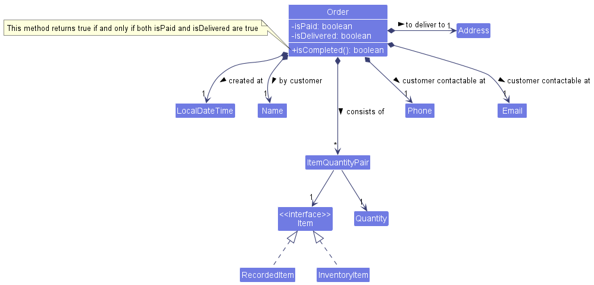

* Table of Contents
{:toc}

--------------------------------------------------------------------------------------------------------------------

## **Acknowledgements**

* {list here sources of all reused/adapted ideas, code, documentation, and third-party libraries -- include links to the original source as well}

--------------------------------------------------------------------------------------------------------------------

## **Setting up, getting started**

Refer to the guide [_Setting up and getting started_](SettingUp.md).

--------------------------------------------------------------------------------------------------------------------

## **Design**

:bulb: **Tip:** The `.puml` files used to create diagrams in this document can be found in the [diagrams](https://github.com/se-edu/addressbook-level3/tree/master/docs/diagrams/) folder. Refer to the [_PlantUML Tutorial_ at se-edu/guides](https://se-education.org/guides/tutorials/plantUml.html) to learn how to create and edit diagrams.

### Architecture

The ***Architecture Diagram*** given above explains the high-level design of the App.

Given below is a quick overview of main components and how they interact with each other.

**Main components of the architecture**

**`Main`** has two classes called [`Main`](https://github.com/AY2223S1-CS2103T-W15-3/tp/blob/master/src/main/java/tracko/Main.java) and [`MainApp`](https://github.com/AY2223S1-CS2103T-W15-3/tp/blob/master/src/main/java/tracko/MainApp.java). It is responsible for,
* At app launch: Initializes the components in the correct sequence, and connects them up with each other.
* At shut down: Shuts down the components and invokes cleanup methods where necessary.

[**`Commons`**](#common-classes) represents a collection of classes used by multiple other components.

The rest of the App consists of four components.

* [**`UI`**](#ui-component): The UI of the App.
* [**`Logic`**](#logic-component): The command executor.
* [**`Model`**](#model-component): Holds the data of the App in memory.
* [**`Storage`**](#storage-component): Reads data from, and writes data to, the hard disk.

**How the architecture components interact with each other**

The *Sequence Diagram* below shows how the components interact with each other for the scenario where the user issues the command `delete 1`.

Each of the four main components (also shown in the diagram above),

* defines its *API* in an `interface` with the same name as the Component.
* implements its functionality using a concrete `{Component Name}Manager` class (which follows the corresponding API `interface` mentioned in the previous point).

For example, the `Logic` component defines its API in the `Logic.java` interface and implements its functionality using the `LogicManager.java` class which follows the `Logic` interface. Other components interact with a given component through its interface rather than the concrete class (reason: to prevent outside component's being coupled to the implementation of a component), as illustrated in the (partial) class diagram below.

The sections below give more details of each component.

### UI component

The **API** of this component is specified in [`Ui.java`](https://github.com/AY2223S1-CS2103T-W15-3/tp/blob/master/src/main/java/tracko/ui/Ui.java)

The UI consists of a `MainWindow` that is made up of parts e.g.`CommandBox`, `ResultDisplay`, `PersonListPanel`, `StatusBarFooter` etc. All these, including the `MainWindow`, inherit from the abstract `UiPart` class which captures the commonalities between classes that represent parts of the visible GUI.

The `UI` component uses the JavaFx UI framework. The layout of these UI parts are defined in matching `.fxml` files that are in the `src/main/resources/view` folder. For example, the layout of the [`MainWindow`](https://github.com/AY2223S1-CS2103T-W15-3/tp/blob/master/src/main/java/tracko/ui/MainWindow.java) is specified in [`MainWindow.fxml`](https://github.com/se-edu/addressbook-level3/tree/master/src/main/resources/view/MainWindow.fxml)

The `UI` component,

* executes user commands using the `Logic` component.
* listens for changes to `Model` data so that the UI can be updated with the modified data.
* keeps a reference to the `Logic` component, because the `UI` relies on the `Logic` to execute commands.
* depends on some classes in the `Model` component, as it displays `Person` object residing in the `Model`.

### Logic component

**API** : [`Logic.java`](https://github.com/AY2223S1-CS2103T-W15-3/tp/blob/master/src/main/java/tracko/logic/Logic.java)

Here's a (partial) class diagram of the `Logic` component:

How the `Logic` component works:
1. When `Logic` is called upon to execute a command, it uses the `AddressBookParser` class to parse the user command.
1. This results in a `Command` object (more precisely, an object of one of its subclasses e.g., `AddCommand`) which is executed by the `LogicManager`.
1. The command can communicate with the `Model` when it is executed (e.g. to add a person).
1. The result of the command execution is encapsulated as a `CommandResult` object which is returned back from `Logic`.

The Sequence Diagram below illustrates the interactions within the `Logic` component for the `execute("delete 1")` API call.

:information_source: **Note:** The lifeline for `DeleteCommandParser` should end at the destroy marker (X) but due to a limitation of PlantUML, the lifeline reaches the end of diagram.

Here are the other classes in `Logic` (omitted from the class diagram above) that are used for parsing a user command:

How the parsing works:
* When called upon to parse a user command, the `AddressBookParser` class creates an `XYZCommandParser` (`XYZ` is a placeholder for the specific command name e.g., `AddCommandParser`) which uses the other classes shown above to parse the user command and create a `XYZCommand` object (e.g., `AddCommand`) which the `AddressBookParser` returns back as a `Command` object.
* All `XYZCommandParser` classes (e.g., `AddCommandParser`, `DeleteCommandParser`, ...) inherit from the `Parser` interface so that they can be treated similarly where possible e.g, during testing.

### Model component
**API** : [`Model.java`](https://github.com/AY2223S1-CS2103T-W15-3/tp/blob/master/src/main/java/tracko/model/Model.java)

The `Model` component,

* stores the address book data i.e., all `Person` objects (which are contained in a `UniquePersonList` object).
* stores the currently 'selected' `Person` objects (e.g., results of a search query) as a separate _filtered_ list which is exposed to outsiders as an unmodifiable `ObservableList<Person>` that can be 'observed' e.g. the UI can be bound to this list so that the UI automatically updates when the data in the list change.
* stores a `UserPref` object that represents the user’s preferences. This is exposed to the outside as a `ReadOnlyUserPref` objects.
* does not depend on any of the other three components (as the `Model` represents data entities of the domain, they should make sense on their own without depending on other components)

:information_source: **Note:** An alternative (arguably, a more OOP) model is given below. It has a `Tag` list in the `AddressBook`, which `Person` references. This allows `AddressBook` to only require one `Tag` object per unique tag, instead of each `Person` needing their own `Tag` objects. 

### Storage component

**API** : [`Storage.java`](https://github.com/AY2223S1-CS2103T-W15-3/tp/blob/master/src/main/java/tracko/storage/Storage.java)

The `Storage` component,
* can save both address book data and user preference data in json format, and read them back into corresponding objects.
* inherits from both `AddressBookStorage` and `UserPrefStorage`, which means it can be treated as either one (if only the functionality of only one is needed).
* depends on some classes in the `Model` component (because the `Storage` component's job is to save/retrieve objects that belong to the `Model`)

### Common classes

Classes used by multiple components are in the `tracko.commons` package.

--------------------------------------------------------------------------------------------------------------------

## **Implementation**

This section describes some noteworthy details on how certain features are implemented.

### Order Management

Order management is one of two core features of TrackO alongside inventory management. These two features work together
to form the backbone of the application, allowing for efficient and reliable tracking of order and inventory data.

#### Overview

As per the Model diagram given [above]()(**_Ensure diagram consistency here_**), the application keeps track of one `OrderList`
at any point in time. This `OrderList` instance represents the container that keeps track of all order data in the system.

Currently, the application features 5 main operations that interact directly with the `OrderList`. They are represented by
the following commands:
* [`AddOrderCommand`](#Add-Order-Feature) - creates a new order to be added to the `OrderList`
* `FindOrderCommand` - filters and display matching orders from the `OrderList` based on provided keywords
* `ListOrderCommand` - display all order data from the `OrderList`
* `EditOrderCommand` - edit the data of an order from the `OrderList`
* `DeleteOrderCommand` - deletes an existing order from the `OrderList`

The order management feature is supported by the `Order` class, represented by the class diagram below.

The `Order` class encapsulates order-related data packaged in the following classes/attributes:
* `Name`, `Phone`, `Email`, `Address` - customer data related to the `Order`
* `ItemQuantityPair` - represents an ordered `Item` in the `Order`, with an accompanying `Quantity` that represents the amount of units of said `Item` ordered by the customer
* `LocalDateTime` - the time at which the order entry was created in the system
* `isPaid`/`isDelivered` - represents the completion status of the order (an `Order` is considered complete if both fields are true)

#### Add Order Feature

The add order feature allows the user to add an `Order` to be tracked by the system. 

##### Implementation

This feature is facilitated by the `AddOrderCommand`, which extends from the `MultiLevelCommand` class. 
The user will enter multiple rounds of input before an `Order` is successfully added to the system. 

Given below is an example usage scenario and how the add order mechanism behaves at each step. We assume that the user
has already added some inventory items to be tracked by the system, such that our initial state before the add order command 
is initiated, is illustrated as such.

Step 1. The user enters the following input into the UI's command box: 
`addo n/John Doe p/98765432 e/johnd@example.com a/311, Clementi Ave 2, #02-25`. This instantiates an `AddOrderCommand`, that references
a new `Order` which encapsulates the input customer data. This then sets the system to await and prompt for further input from the user.

:information_source: **Note:** Upon any invalid inputs (invalid/missing prefixes or values), the UI will notify the user and provide a prompt for the correct input format) 

**_Object diagram to be added here_**

Step 2a. The user then enters `i/Pen q/3`, representing that the order requires 3 units (quantities) of 'Pens' to fulfill.
The system updates the instantiated command, by first having the `AddOrderCommand` stages the input item name and quantity for validation, 
using the `AddOrderCommand#stageForValidation()` method.

:information_source: **Note:** Upon any invalid inputs (invalid/missing prefixes or values), the UI will notify the user and provide a prompt for the correct input format) 

**_Object diagram to be added here_**

Step 2b. The system searches the inventory items for an item that has a matching name. In this scenario,
we assume that the user has already added an `Item` with its `ItemName` value to be `Pen`, to the system's list of tracked items.
Hence, upon execution, a valid item was found based on the user's input item name, and the system adds a new `ItemQuantityPair` that
references the found item to the list of items ordered in the instantiated `Order`. 

:information_source: **Note:** If the user has entered an item name that cannot be matched to the system's inventory, the state will remain unchanged and the UI will notify the user and provide a prompt to re-enter inputs) 

**_Object diagram to be added here_**

Step 3. The user repeats Step 2 multiple times to fill up the instantiated `Order`'s list of ordered items.

**_Object diagram to be added here_**

Step 4. The user then enters `done` after inputting all the required order details. The system finally executes the command, adding the
built up `Order` to the `OrderList`. The system also no longer waits for additional input as the previously 'in progress' `AddOrderCommand`
is now completed.

:information_source: **Note:** The user can also choose to abort the command at any point after instantiating the command (Step 2 to 4), by entering 'cancel'

**_Object diagram to be added here_**

The following sequence diagram shows how the add order operation works:

_**Sequence diagram to be added here**_

The following activity diagram below illustrates the general flow of the user's experience in adding an order.

##### Design considerations

Aspect: How add order command executes:
* **Alternative 1 (current choice)**: Multi-level command, with user inputting information multiples times between customer data and then subsequently multiple item and quantity inputs.
  * Pros: Better user experience. Users don't have to type out a very long command in one go to add an order.
  * Cons: Harder to implement.
* **Alternative 2**: Single level command, user inputs all required information in one long command.
  * Pros: Easier to implement.
  * Cons: Users have to type out a very long command, and multiple times if they were to mistype certain details and have to re-enter data.

**_More design considerations_**

### \[Proposed\] Undo/redo feature

#### Proposed Implementation

The proposed undo/redo mechanism is facilitated by `VersionedAddressBook`. It extends `AddressBook` with an undo/redo history, stored internally as an `addressBookStateList` and `currentStatePointer`. Additionally, it implements the following operations:

* `VersionedAddressBook#commit()` — Saves the current address book state in its history.
* `VersionedAddressBook#undo()` — Restores the previous address book state from its history.
* `VersionedAddressBook#redo()` — Restores a previously undone address book state from its history.

These operations are exposed in the `Model` interface as `Model#commitAddressBook()`, `Model#undoAddressBook()` and `Model#redoAddressBook()` respectively.

Given below is an example usage scenario and how the undo/redo mechanism behaves at each step.

Step 1. The user launches the application for the first time. The `VersionedAddressBook` will be initialized with the initial address book state, and the `currentStatePointer` pointing to that single address book state.

Step 2. The user executes `delete 5` command to delete the 5th person in the address book. The `delete` command calls `Model#commitAddressBook()`, causing the modified state of the address book after the `delete 5` command executes to be saved in the `addressBookStateList`, and the `currentStatePointer` is shifted to the newly inserted address book state.

Step 3. The user executes `add n/David …​` to add a new person. The `add` command also calls `Model#commitAddressBook()`, causing another modified address book state to be saved into the `addressBookStateList`.

:information_source: **Note:** If a command fails its execution, it will not call `Model#commitAddressBook()`, so the address book state will not be saved into the `addressBookStateList`.

Step 4. The user now decides that adding the person was a mistake, and decides to undo that action by executing the `undo` command. The `undo` command will call `Model#undoAddressBook()`, which will shift the `currentStatePointer` once to the left, pointing it to the previous address book state, and restores the address book to that state.

:information_source: **Note:** If the `currentStatePointer` is at index 0, pointing to the initial AddressBook state, then there are no previous AddressBook states to restore. The `undo` command uses `Model#canUndoAddressBook()` to check if this is the case. If so, it will return an error to the user rather
than attempting to perform the undo.

The following sequence diagram shows how the undo operation works:

:information_source: **Note:** The lifeline for `UndoCommand` should end at the destroy marker (X) but due to a limitation of PlantUML, the lifeline reaches the end of diagram.

The `redo` command does the opposite — it calls `Model#redoAddressBook()`, which shifts the `currentStatePointer` once to the right, pointing to the previously undone state, and restores the address book to that state.

:information_source: **Note:** If the `currentStatePointer` is at index `addressBookStateList.size() - 1`, pointing to the latest address book state, then there are no undone AddressBook states to restore. The `redo` command uses `Model#canRedoAddressBook()` to check if this is the case. If so, it will return an error to the user rather than attempting to perform the redo.

Step 5. The user then decides to execute the command `list`. Commands that do not modify the address book, such as `list`, will usually not call `Model#commitAddressBook()`, `Model#undoAddressBook()` or `Model#redoAddressBook()`. Thus, the `addressBookStateList` remains unchanged.

Step 6. The user executes `clear`, which calls `Model#commitAddressBook()`. Since the `currentStatePointer` is not pointing at the end of the `addressBookStateList`, all address book states after the `currentStatePointer` will be purged. Reason: It no longer makes sense to redo the `add n/David …​` command. This is the behavior that most modern desktop applications follow.

The following activity diagram summarizes what happens when a user executes a new command:

#### Design considerations:

**Aspect: How undo & redo executes:**

* **Alternative 1 (current choice):** Saves the entire address book.
  * Pros: Easy to implement.
  * Cons: May have performance issues in terms of memory usage.

* **Alternative 2:** Individual command knows how to undo/redo by
  itself.
  * Pros: Will use less memory (e.g. for `delete`, just save the person being deleted).
  * Cons: We must ensure that the implementation of each individual command are correct.

_{more aspects and alternatives to be added}_

### \[Proposed\] Data archiving

_{Explain here how the data archiving feature will be implemented}_

--------------------------------------------------------------------------------------------------------------------

## **Documentation, logging, testing, configuration, dev-ops**

* [Documentation guide](Documentation.md)
* [Testing guide](Testing.md)
* [Logging guide](Logging.md)
* [Configuration guide](Configuration.md)
* [DevOps guide](DevOps.md)

--------------------------------------------------------------------------------------------------------------------

## **Appendix: Requirements**

### Product scope

**Target user profile**:

* home-based small business owners who want to manage orders and inventory information efficiently
* prefer desktop apps over other types
* can type fast
* prefers typing to mouse interactions
* is reasonably comfortable using CLI apps

**Value proposition**: offers a CLI-based application for home-based small
business owners who prefer to type more/are more efficient at typing to
allow them to save time on managing orders and logistics instead of
traditional GUI applications such as Excel, or even pen and paper.

### User stories

Priorities: High (must have) - `* * *`, Medium (nice to have) - `* *`, Low (unlikely to have) - `*`

| Priority | As a …​                                      | I want to …​                                                            | So that I can…​                                                                   |
|----------|----------------------------------------------|-------------------------------------------------------------------------|-----------------------------------------------------------------------------------|
| `* * *`  | business owner                               | add orders easily                                                       | keep track of ongoing orders                                                      |
| `* * *`  | business owner                               | delete entire orders                                                    |                                                                                   |
| `* * *`  | busy business owner                          | list all orders                                                         | see all my ongoing orders in one place and keep track of them                     |
| `* * *`  | business owner                               | add items to my inventory                                               | keep track of additions to my inventory                                           |
| `* * *`  | business owner                               | delete items from my inventory                                          | have an updated list of inventory items                                           |
| `* * *`  | business owner                               | list all items in my inventory                                          | see all items in my inventory in one place                                        |
| `* * *`  | business owner                               | tag inventory items                                                     | keep an organised inventory of items                                              |
| `* *  `  | busy business owner                          | find orders                                                             | locate an order without manually searching through the entire list                |
| `* *  `  | business owner                               | find items in my inventory                                              | locate an item in my inventory without manually searching through the entire list |
| `* * `   | business owner                               | edit order details                                                      | update changes to orders                                                          |
| `* *  `  | business owner                               | edit inventory item details                                             | update changes to inventory                                                       |
| `* *  `  | business owner                               | see which orders have been paid for                                     | press customers for payment                                                       |
| `* *  `  | business owner                               | mark orders as completed                                                | not get mixed up with ones that have not been completed yet                       |
| `* *  `  | business owner                               | sort orders by expected delivery time                                   | know which orders are due first                                                   |
| `* *  `  | business owner                               | sort orders by delivery address                                         | optimise delivery routes                                                          |
| `* *  `  | business owner                               | sort orders by urgency (e.g. by deadline, or days outstanding)          | know which orders I have to prepare first                                         |
| `* *  `  | business owner                               | look at my total earnings                                               | better optimise my earnings                                                       |
| `*    `  | business owner                               | export all business data                                                | save the data elsewhere if needed                                                 |
| `*    `  | business owner who is new to the application | import my current database of order and inventory information to TrackO | seamlessly transfer from other applications to TrackO                             |
| `*   `   | business owner who is a new user             | use more verbose commands to complete my tasks                          | get more used to the syntax of the commands in the application                    |
| `*   `   | tired business owner working at night        | view the application's GUI in dark mode                                 | my eyes don't get strained                                                        |

*{More to be added}*

### Use cases

(For all use cases below, the **System** is the `TrackO` and the **Actor** is the `user`, unless specified otherwise)

**Use case: UC01 - Add an order**

**MSS**

1. User requests to add an order.
2. System adds the order.

   Use case ends.

**Extensions**

- 1a. User inputs incomplete order data.  
  - 1a1. System informs user of the incomplete data.

    Use case resumes at 1.

**Use case: UC02 - Delete an order**

**MSS**

1. User requests to delete an order.
2. System deletes the order.

    Use case ends.

**Extensions**

- 1a. The order the user wishes to delete does not exist.

  - 1a1. System informs the user of the non-existent order.

     Use case ends.

- 2a. The list has no orders.

  - 2a1. System informs the user of the empty order list.

    Use case ends.

**Use case: UC03 - List orders**

**MSS**

1. User requests to list all orders.
2. System lists all orders.

    Use case ends.

**Extensions**

- 2a. The list of orders is empty.
    - 2a1. System informs the user that the list is empty.

      Use case ends.

**Use case: UC04 - Find orders**

**MSS**

1. User requests to find an order.
2. System finds the order and informs the user of its details.

    Use case ends.

**Extensions**

- 1a. The order the user is trying to find does not exist.
  - 1a1. System informs the user that the order does not exist.

    Use case ends.

**Use case: UC05 - Add an inventory item**

**MSS**

1. User requests to add an inventory item.
2. System adds the inventory item.

    Use case ends.

**Extensions**

- 1a. User inputs incomplete details of the item.
  - 1a1. System informs user of the incomplete details.

    Use case resumes at 1.

**Use case: UC06 - Delete an inventory item**

**MSS**

1. User requests to delete an inventory item.
2. System deletes the inventory item.

    Use case ends.

**Extensions**

- 1a. The item that the user requests to delete does not exist.
  - 1a1. System informs user of the non-existent item.

    Use case ends.

- 2a. The list of inventory items is empty.
    - 2a1. System informs user that the list of items is empty.

      Use case ends.

**Use case: UC07 - List all inventory items**

**MSS**

1. User requests to list all inventory items.
2. System lists all inventory items.

    Use case ends.

**Extensions**

- 2a. The list of inventory items is empty.
  - 2a1. System informs user of the empty list.

    Use case ends.

**Use case: UC08 - Find an inventory item**

**MSS**

1. User requests to find an inventory item.
2. System finds the item and informs the user of its details.

    Use case ends.

**Extensions**

- 1a. The inventory item that the user requests to find does not exist.
  - 1a1. System informs the user of the non-existent item.

    Use case ends.

**Use case: UC09 - Tag an inventory item**

**MSS**

1. User requests to tag an inventory item.
2. System tags the inventory item.

    Use case ends.

**Use case: UC10 - Edit an inventory item**

1. User requests to edit an inventory item.
2. System edits the inventory item.

    Use case ends.

**Extensions**

- 1a. User inputs incomplete order data.
    - 1a1. System informs user of the incomplete data.

      Use case resumes at 1.
    
### Non-Functional Requirements

1. Should work on any _mainstream OS_ as long as it has Java `11` or above installed.
2. The software should be portable. Moving from one device to another should not create any problems as long as it is on a _mainstream OS_ with Java `11` or above installed.
3. Each command should be executed within 1 second.
4. Should be able to hold up to 10000 orders without a noticeable sluggishness in performance for typical usage.
5. Should be able to hold up to 100 items without a noticeable sluggishness in performance for typical usage.
6. A user with above average typing speed for regular English text (i.e. not code, not system admin commands) should be able to accomplish most of the tasks faster using commands than using the mouse.

### Glossary

* **Mainstream OS (Operating System)**: Windows, Linux, Unix, OS-X
* **CLI**: Command Line Interface, receives commands from user in the form of lines of text
* **GUI**: Graphical User Interface, a system of interactive user components for computer software
* **Inventory**: Any item that the business needs to operate
* **Order**: Any sales promise that needs to be fulfilled

--------------------------------------------------------------------------------------------------------------------

## **Appendix: Instructions for manual testing**

Given below are instructions to test the app manually.

:information_source: **Note:** These instructions only provide a starting point for testers to work on;
testers are expected to do more *exploratory* testing.

### Launch and shutdown

1. Initial launch

   1. Download the jar file and copy into an empty folder

   1. Double-click the jar file Expected: Shows the GUI with a set of sample contacts. The window size may not be optimum.

1. Saving window preferences

   1. Resize the window to an optimum size. Move the window to a different location. Close the window.

   1. Re-launch the app by double-clicking the jar file. 
       Expected: The most recent window size and location is retained.

1. _{ more test cases …​ }_

### Deleting a person

1. Deleting a person while all persons are being shown

   1. Prerequisites: List all persons using the `list` command. Multiple persons in the list.

   1. Test case: `delete 1` 
      Expected: First contact is deleted from the list. Details of the deleted contact shown in the status message. Timestamp in the status bar is updated.

   1. Test case: `delete 0` 
      Expected: No person is deleted. Error details shown in the status message. Status bar remains the same.

   1. Other incorrect delete commands to try: `delete`, `delete x`, `...` (where x is larger than the list size) 
      Expected: Similar to previous.

1. _{ more test cases …​ }_

### Saving data

1. Dealing with missing/corrupted data files

   1. _{explain how to simulate a missing/corrupted file, and the expected behavior}_

1. _{ more test cases …​ }_
