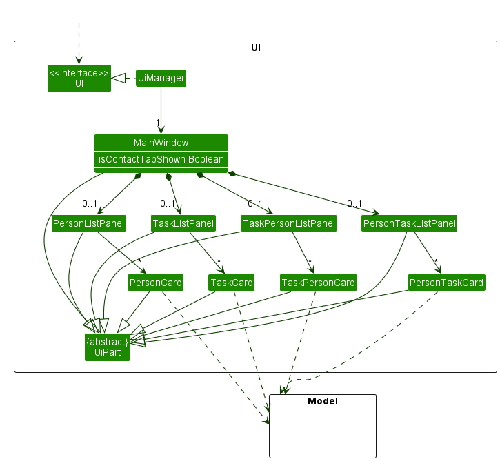
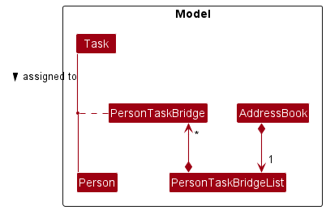

## **Table of Contents**
{:.no_toc}

1. Table of Contents
{:toc}

---

## **Setting up and getting started**

Refer to the guide [Setting up and getting started](SettingUp.md).

---

## **Design**

:bulb: **Tip**  
The `.puml` files used to create diagrams in this document can be found in the [diagrams](https://github.com/AY2223S1-CS2103T-T12-2/tp/tree/master/docs/diagrams) folder. Refer to the [_PlantUML Tutorial_ at se-edu/guides](https://se-education.org/guides/tutorials/plantUml.html) to learn how to create and edit diagrams.

### Architecture

The architecture diagram given above explains the high-level design of the App.

Given below is a quick overview of main components and how they interact with each other.

#### Main Components of the Architecture

**`Main`** has two classes called [`Main`](https://github.com/AY2223S1-CS2103T-T12-2/tp/blob/master/src/main/java/swift/Main.java) and [`MainApp`](https://github.com/AY2223S1-CS2103T-T12-2/tp/blob/master/src/main/java/swift/MainApp.java). It is responsible for,

- initializing the components in the correct sequence and connecting them up with each other during the app's launch.
- shutting down the components and invoking cleanup methods where necessary when closing the app.

The rest of the app consists of four components.

- [**`UI`**](#ui-component): Displays the user interface of the app.
- [**`Logic`**](#logic-component): Parses and executes the commands.
- [**`Model`**](#model-component): Holds the data of the app in memory.
- [**`Storage`**](#storage-component): Reads data from, and writes data to, the hard disk.
 
[**`Commons`**](#common-classes) represents a collection of classes used by multiple components.

#### How the architecture components interact with each other

The sequence diagram below shows how the components interact with each other for the scenario where the user issues the command `delete_contact 1`.

Each of the four main components (also shown in the diagram above),

- defines its API in an `interface` with the same name as the component.
- implements its functionality using a concrete `{Component Name}Manager` class.

For example, the `Logic` component defines its API in the `Logic.java` interface and implements its functionality using the `LogicManager.java` class. Other components interact with a given component through its interface, rather than the concrete class. The reasoning is to prevent outside component's from being coupled to the implementation of a component, which is illustrated by the diagram below.

The sections below give more details of each component.

### UI Component

The API of this component is specified in [`Ui.java`](https://github.com/AY2223S1-CS2103T-T12-2/tp/blob/master/src/main/java/swift/ui/Ui.java). 

Here's a partial class diagram of the `UI` component without any of the task/contact management panels.

The UI consists of a `MainWindow` that is made up of parts, e.g.`CommandBox`, `ResultDisplay`, `PersonListPanel`, `StatusBarFooter`, and etc. All these parts, including the `MainWindow`, inherit from the abstract `UiPart` class which captures the commonalities between classes that represent parts of the visible GUI.

Here's another partial class diagram of the `UI` component with the task and contact management panels.

The UI keeps track of which tab the user is currently viewing with the `isContactTabShown` boolean. If the contacts tab is currently in view, `MainWindow` contains `PersonListPanel` and `PersonTaskListPanel`, and it contains `TaskListPanel` and `TaskPersonListPanel` if otherwise. 

The `UI` component uses the [JavaFx](https://openjfx.io/) UI framework. The layout of these UI parts are defined in matching `.fxml` files that are in the `src/main/resources/view` folder. For example, the layout of the [`MainWindow`](https://github.com/AY2223S1-CS2103T-T12-2/tp/blob/master/src/main/java/swift/ui/MainWindow.java) is specified in [`MainWindow.fxml`](https://github.com/AY2223S1-CS2103T-T12-2/tp/blob/master/src/main/resources/view/MainWindow.fxml)

The `UI` component,

- executes user commands using the `Logic` component.
- prompts users with command suggestions and allows them to auto-complete them using the `Logic` component.
- listens for changes to `Model` data so that the UI can be updated with the modified data.
- keeps a reference to the `Logic` component, because the `UI` relies on the `Logic` to execute commands.
- depends on some classes in the `Model` component, as it displays `Person` and `Task` objects located in the `Model`.

### Logic Component

The API of this component is specified in [`Logic.java`](https://github.com/AY2223S1-CS2103T-T12-2/tp/blob/master/src/main/java/swift/logic/Logic.java).

Here's a partial class diagram of the `Logic` component:

How the `Logic` component works:

1. When `Logic` is called upon to execute a command, it uses the `AddressBookParser` class to parse the user command.
2. This results in a `Command` object (more precisely, an object of one of its subclasses e.g., `AddContactCommand`) which is executed by the `LogicManager`.
3. The command can communicate with the `Model` when it is executed (e.g. to add a person).
4. The result of the command execution is encapsulated as a `CommandResult` object which is returned from `Logic`.

The sequence diagram below illustrates the interactions within the `Logic` component for the `execute("delete_contact 1")` API call.

:information_source: **Note**  
The lifeline for `DeleteContactCommandParser` should end at the destroy marker (X) but due to a limitation of PlantUML, the lifeline reaches the end of diagram.

Here are the other classes in `Logic` (omitted from the class diagram above) that are used for parsing a user command:

How the parsing works:

- When called upon to parse a user command, the `AddressBookParser` class creates an `XYZCommandParser` (`XYZ` is a placeholder for the specific command name e.g., `AddContactCommandParser`) 
- The `XYZCommandParser` class then uses the other classes shown above to parse the user command and create a `XYZCommand` object (e.g., `AddContactCommand`), which the `AddressBookParser` returns back as a `Command` object.
- All `XYZCommandParser` classes (e.g., `AddContactCommandParser`, `DeleteTaskCommandParser`, ...) inherit from the `Parser` interface, so that they can be treated similarly where possible, e.g. during testing.

### Model Component

The API of this component is specified in [`Model.java`](https://github.com/AY2223S1-CS2103T-T12-2/tp/blob/master/src/main/java/swift/model/Model.java).

Here's a partial class diagram of the `Model` component:

:information_source: **Note**  
The `Task` and `PersonTaskBridge` classes are left out of the above diagram for simplicity. Compared to the `Person` class, they follow a similar structure of attribute composition.

The `Model` component,

- stores the address book data, i.e. all `Person` objects (which are contained in a `UniquePersonList` object).
- stores the currently 'selected' `Person` objects (e.g., results of a search query) as a separate _filtered_ list which is exposed to outsiders as an unmodifiable `ObservableList<Person>` that can be 'observed' e.g. the UI can be bound to this list so that the UI automatically updates when the data in the list change.
- stores a `UserPref` object that represents the user’s preferences. This is exposed to the outside as a `ReadOnlyUserPref` object.
- does not depend on any of the other three components, because the `Model` represents data entities of the domain, and they should make sense on their own without depending on other components.

:information_source: **Note**  
An alternative (arguably, a more OOP) model is given below. It has a `Tag` list in the `AddressBook`, which `Person` references. This allows `AddressBook` to only require one `Tag` object per unique tag, instead of each `Person` needing their own `Tag` objects. 

### Storage Component

The API of this component is specified in [`Storage.java`](https://github.com/AY2223S1-CS2103T-T12-2/tp/blob/master/src/main/java/swift/storage/Storage.java).

Here's a partial class diagram of the `Storage` component:

The `Storage` component,

- can save both address book data and user preference data in `.json` format, and read them back into corresponding objects.
- inherits from both `AddressBookStorage` and `UserPrefStorage`, which means it can be treated as either one (if only the functionality of only one is needed).
- depends on some classes in the `Model` component, because the `Storage` component's job is to save/retrieve objects that belong to the `Model`.

### Common classes

Classes used by multiple components are in the `swift.commons` package.

---

## **Implementation**

This section describes some noteworthy details on how certain features are implemented.

### Many-to-many relationship between `Person` and `Task`

The implementation of the contact-task relation is facilitated by `PersonTaskBridge` and `PersonTaskBridgeList`.

`PersonTaskBridge` is a class containing a `Person` UUID and a `Task` UUID, representing a relation between a `Person` and a `Task`.

`PersonTaskBridgeList` is a class containing a list of `PersonTaskBridge` objects, representing all the relations between `Person` and `Task` objects in the `AddressBook`. Additionally, it implements the following operations:

- `PersonTaskBridgeList#add(PersonTaskBridge)` - Saves a new relation between a `Person` and a `Task` in the list.
- `PersonTaskBridgeList#remove(PersonTaskBridge)` - Removes an existing relation between a `Person` and a `Task` from the list.
- `PersonTaskBridgeList#removePerson(Person)` and `PersonTaskBridgeList#removeTask(Task)` - Removes all existing relations between a `Person` and `Task` objects from the list.

These operations will be exposed in the `Model` interface.

The following class diagram summarizes the relationship between `PersonTaskBridge` and other classes:

#### Design Considerations

**Aspect: How `Person` and `Task` are associated with `PersonTaskBridge`:**

- **Alternative 1 (current choice):** Stores `Person` and `Task` UUID in `PersonTaskBridge`.

    - Pros: No need to handle the case of changing index when `Person` or `Task` are filtered. Easier to maintain data integrity.
    - Cons: Requires changes in `Person` and `Task` schema and storage.

- **Alternative 2:** Stores `Person` and `Task` index in `PersonTaskBridge`.
    - Pros: No change is needed for `Person` and `Task` schema.
    - Cons: Requires changes to `PersonTaskBridge` objects every time a command changes `Person` or `Task` object index.

### View tasks details

The implementation of the task tab UI is facilitated by `TaskCard` and `TaskListPanel`.

`TaskCard` and `TaskListPanel` extends the superclass `UiPart<Region>` and fills the UI container with a panel that displays the list of tasks, along with their assigned contacts and deadlines.

`TaskListPanel` in is responsible for displaying the graphics of a task using a `TaskCard`.

### Command Suggestions and Command Auto-Completion

The implementation of Command Suggestions and Command Auto-Completion is facilitated by `CommandSuggestor` in the `Logic` Component. The `CommandBox` UI component listens for changes in the command box textField and calls methods from `CommandSuggestor` to reflect command suggestions and allow autocompletion.

`CommandSuggestor` mainly implements the following operations:
- `CommandSuggestor#suggestCommand` - Suggests a command with the corresponding syntax based on the user's current input
- `CommandSuggestor#autocompleteCommand` - Completes the current user input according to the shown command suggestion

#### Design considerations:

**Aspect: How to provide command suggestions to users:**

- **Alternative 1 (current choice):** Provide command suggestion over the command box.

  - Pros: Uses less screen real estate
  - Cons: Only able to view one possible command

- **Alternative 2:** Provide command suggestions in a separate display box
  itself.
  - Pros: Able to display all possible commands.
  - Cons: Uses more screen real estate

**Aspect: How to autocomplete commands for users**

- **Alternative 1:** Autocomplete up to next prefix according displayed command suggestion.

  - Pros: Users can easily autocomplete the command shown with just one tab
  - Cons: Users might have to backspace and complete the command again for commands with common prefixes. Eg. `add_contact`, `add_task`

- **Alternative 2 (current choice):** Autocomplete up to the longest matching prefix of all possible commands.
  itself.
  - Pros: Easy to autocomplete commands with common prefixes
  - Cons: Users might have to type a few characters more

---

## **Documentation, Logging, Dev-ops, Testing, and Configuration**

To understand how to set up and maintain this project website, head over to the [Documentation Guide](Documentation.md).

You can learn how to run tests on Swift+ by going to the [Testing Guide](Testing.md) page.

To learn how to run and release Swift+ using Gradle, please visit the [DevOps Guide](DevOps.md) page.

Please visit the [Logging Guide](Logging.md) to learn how we implement logging.

We also have files to configure properties of the app, which are detailed in the [Configuration Guide](Configuration.md).

---

## **Appendix: Requirements**

This section covers the user requirements we attempt to meet in Swift+.

### Target User Profile

Swift+ is designed for **software engineering project leads** who,
- need to keep track of many tasks with clients and colleagues.
- can type fast.
- prefer typing to mouse interactions.
- prefer desktop apps over other types.

### Value proposition

Swift+ allows users to manage tasks with clients and colleagues **faster** than a typical GUI-driven app.

### User stories

Priority levels:
- High (must have) - `* * *`
- Medium (nice to have) - `* *`
- Low (unlikely to have) - `*`

| Priority | As a …​        | I want to …​             | So that I can…​                                                            |
|----------|----------------|--------------------------|----------------------------------------------------------------------------|
| `* * *`  | new user       | see usage instructions   | refer to instructions when I forget how to use the app                     |
| `* * *`  | user           | add a new contact        | add a new contact to keep track of                                         |
| `* * *`  | user           | view all contacts        | get an overview of all contacts in my app                                  |
| `* * *`  | user           | update a contact         | update the particulars of a contact                                        |
| `* * *`  | user           | delete a contact         | remove contacts that I no longer need                                      |
| `* * *`  | user           | find contacts by name    | locate details of contacts without having to go through the entire list    |
| `* * *`  | user           | add task for contact     | add a task to a contact to keep track of                                   |
| `* * *`  | user           | view tasks by contact    | view tasks belonging to a contact                                          |
| `* *`    | user           | update a task            | update the particulars of a task                                           |
| `* * *`  | user           | delete a task            | remove tasks that I no longer need                                         |
| `* *`    | user           | list all tasks           | to locate details of all the tasks immediately                             |
| `* *`    | user           | find tasks by name       | locate details of tasks without having to go through the entire list       |
| `* *`    | forgetful user | autocomplete my commands | conveniently type commands without referring to the user guide excessively |

### Use cases

(For all use cases below, the **System** is the `AddressBook` and the **Actor** is the `user`, unless specified otherwise)

**Use case: Update a person**

**MSS**

1.  User requests to list people
2.  AddressBook shows a list of people
3.  User requests to edit a specific person in the list
4.  AddressBook edits the person

    Use case ends.

**Extensions**

- 2a. The list is empty.

  Use case ends.

- 3a. The given index is invalid.

  - 3a1. AddressBook shows an error message.

    Use case resumes at step 2.

- 3b. The command arguments are invalid.

  - 3b1. AddressBook shows an error message.

    Use case resumes at step 2.

**Use case: Delete a person**

**MSS**

1.  User requests to list people
2.  AddressBook shows a list of people
3.  User requests to delete a specific person in the list
4.  AddressBook deletes the person

    Use case ends.

**Extensions**

- 2a. The list is empty.

  Use case ends.

- 3a. The given index is invalid.

  - 3a1. AddressBook shows an error message.

    Use case resumes at step 2.

**Use case: Update a task**

**MSS**

1.  User requests to list tasks
2.  AddressBook shows a list of tasks
3.  User requests to edit a specific task in the list
4.  AddressBook edits the task

    Use case ends.

**Extensions**

- 2a. The list is empty.

  Use case ends.

- 3a. The given index is invalid.

  - 3a1. AddressBook shows an error message.

    Use case resumes at step 2.

- 3b. The command argument is invalid.

  - 3b1. AddressBook shows an error message.

    Use case resumes at step 2.

**Use case: Delete a task**

**MSS**

1.  User requests to list tasks
2.  AddressBook shows a list of tasks
3.  User requests to delete a specific task in the list
4.  AddressBook deletes the task

    Use case ends.

**Extensions**

- 2a. The list is empty.

  Use case ends.

- 3a. The given index is invalid.

  - 3a1. AddressBook shows an error message.

    Use case resumes at step 2.

### Non-Functional Requirements

1.  Should work on any _mainstream OS_ as long as it has Java `11` or above installed.
2.  Should be able to hold up to 1000 tasks and contacts without a noticeable sluggishness in performance for typical usage.
3.  A user with above average typing speed for regular English text (i.e. not code, not system admin commands) should be able to accomplish most of the tasks faster using commands than using the mouse.
4.  Data should be persistent and stored in the local machine's storage.
5.  Product is designed for single user and is not required to handle collaboration between multiple users.

### Glossary

- **API**: Stands for application programming interface, which is a set of definitions and protocols for building and integrating application software.
- **Bridge**: Maps a relationship between a contact and a task.
- **GUI**: Stands for graphical user interface, which is a system interface that uses visual icons, menus, and a mouse to manage interactions with the system.
- **Mainstream OS**: Stands for mainstream operating systems, which includes Windows, Linux, Unix, and OS-X.
- **UUID**: Stands for universally unique identifier, which is used for identifying information that needs to be unique within a system.

---

## **Appendix: Instructions for manual testing**

Given below are instructions to test the app manually.

:information_source: **Note**  
These instructions only provide a starting point for testers to work on;
testers are expected to do more *exploratory* testing.

### Launch and shutdown

1. Initial launch

   1. Download the jar file and copy into an empty folder

   2. Double-click the jar file Expected: Shows the GUI with a set of sample contacts. The window size may not be optimum.

2. Saving window preferences

   1. Resize the window to an optimum size. Move the window to a different location. Close the window.
   2. Re-launch the app by double-clicking the jar file. 
      Expected: The most recent window size and location is retained.

3. _{ more test cases …​ }_

### Deleting a person / task

1. Deleting a person / task while all persons / task are being shown

   1. Prerequisites: List all persons / task using the `list_contact` or `list_task` command.

   2. Test case: `delete_contact 1` / `delete_task 1` 
      Expected: First contact / task is deleted from the list. Details of the deleted contact / task shown in the status message. Timestamp in the status bar is updated.

   3. Test case: `delete_contact 0` / `delete_task 0` 
      Expected: No person / task is deleted. Error details shown in the status message. Status bar remains the same.

   4. Other incorrect delete commands to try: `delete_contact` / `delete_task`, `delete_contact x` / `delete_task x`, `...` (where x is larger than the list size) 
      Expected: Similar to previous.

2. _{ more test cases …​ }_

### Saving data

1. Dealing with missing/corrupted data files

   1. _{explain how to simulate a missing/corrupted file, and the expected behavior}_

2. _{ more test cases …​ }_

---

## **Acknowledgements**

- This project is based on the AddressBook-Level3 project created by the [SE-EDU initiative](https://se-education.org).
- Libraries used: [JavaFX](https://openjfx.io/), [Jackson](https://github.com/FasterXML/jackson), [JUnit5](https://github.com/junit-team/junit5)
- UI color scheme inspired by [TailwindUI](https://tailwindui.com/)
