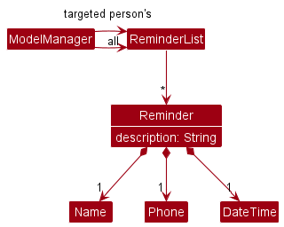

<div align="center">

<h1>Rapportbook Developer Guide</h1>

Welcome to the Rapportbook Developer guide!

</div>

Rapportbook is a CLI-focused desktop app for managing client information, developed in Java 11. If you wish to contribute to Rapportbook, please go through this guide to familiarize yourself with Rapportbook.

#### Using this guide

If it is your first time contributing, make sure you follow the guidelines we have noted in [Setting up, getting started](#setting-up-getting-started). Please refer to the following list of sections to get you familiarized with Rapportbook.

* [Design overview](#design) -- High level overview of the design and architecture Rapportbook.
* [Implementation](#implementation) -- Implementation details for the features currently implemented.
* [Testing](#appendix-instructions-for-manual-testing) -- Testing instructions and expected outcomes of the features in Rapportbook.

The following is the table of contents for Rapportbook.

Table of Contents
{:toc}

--------------------------------------------------------------------------------------------------------------------

## **Acknowledgements**

* This project is based on the AddressBook-Level3 project created by the [SE-EDU initiative](https://se-education.org/).
* Third-party libraries used:
  * [JavaFX](https://openjfx.io/) -- UI framework
  * [Jackson](https://github.com/FasterXML/jackson) -- JSON parser
  * [JUnit5](https://junit.org/junit5/) -- Testing framework

--------------------------------------------------------------------------------------------------------------------

## **Setting up, getting started**

Refer to the guide [_Setting up and getting started_](SettingUp.md).

--------------------------------------------------------------------------------------------------------------------

## **Design**

<div markdown="span" class="alert alert-primary">

:bulb: **Tip:** The `.puml` files used to create diagrams in this document can be found in the [diagrams](https://github.com/se-edu/addressbook-level3/tree/master/docs/diagrams/) folder. Refer to the [_PlantUML Tutorial_ at se-edu/guides](https://se-education.org/guides/tutorials/plantUml.html) to learn how to create and edit diagrams.

</div>

### Architecture


The ***Architecture Diagram*** given above explains the high-level design of the App.

Given below is a quick overview of main components and how they interact with each other.

**Main components of the architecture**

**`Main`** has two classes called [`Main`](https://github.com/se-edu/addressbook-level3/tree/master/src/main/java/seedu/address/Main.java) and [`MainApp`](https://github.com/se-edu/addressbook-level3/tree/master/src/main/java/seedu/address/MainApp.java). It is responsible for,

* At app launch: Initializes the components in the correct sequence, and connects them up with each other.
* At shut down: Shuts down the components and invokes cleanup methods where necessary.

[**`Commons`**](#common-classes) represents a collection of classes used by multiple other components.

The rest of the App consists of four components.

* [**`UI`**](#ui-component): The UI of the App.
* [**`Logic`**](#logic-component): The command executor.
* [**`Model`**](#model-component): Holds the data of the App in memory.
* [**`Storage`**](#storage-component): Reads data from, and writes data to, the hard disk.

**How the architecture components interact with each other**

The *Sequence Diagram* below shows how the components interact with each other for the scenario where the user issues the command `delete 1`.


Each of the four main components (also shown in the diagram above),

* defines its *API* in an `interface` with the same name as the Component.
* implements its functionality using a concrete `{Component Name}Manager` class (which follows the corresponding API `interface` mentioned in the previous point.

For example, the `Logic` component defines its API in the `Logic.java` interface and implements its functionality using the `LogicManager.java` class which follows the `Logic` interface. Other components interact with a given component through its interface rather than the concrete class (reason: to prevent outside component's being coupled to the implementation of a component), as illustrated in the (partial) class diagram below.


The sections below give more details of each component.

### UI component

The **API** of this component is specified in [`Ui.java`](https://github.com/AY2223S1-CS2103T-T13-2/tp/blob/master/src/main/java/seedu/address/ui/Ui.java)


The UI consists of a `MainWindow` that is made up of parts e.g.`CommandBox`, `ResultDisplay`, `PersonListPanel`, `StatusBarFooter` etc. All these, including the `MainWindow`, inherit from the abstract `UiPart` class which captures the commonalities between classes that represent parts of the visible GUI.

The `UI` component uses the JavaFx UI framework. The layout of these UI parts are defined in matching `.fxml` files that are in the `src/main/resources/view` folder. For example, the layout of the [`MainWindow`](https://github.com/AY2223S1-CS2103T-T13-2/tp/blob/master/src/main/java/seedu/address/ui/MainWindow.java) is specified in [`MainWindow.fxml`](https://github.com/AY2223S1-CS2103T-T13-2/tp/blob/master/src/main/resources/view/MainWindow.fxml)

The `UI` component,

* take user commands from `CommandBox` and executes user commands via the `Logic` component.
  * The `UI` component therefore keeps a reference to the `Logic` component, because the `UI` relies on the `Logic` to execute commands.
* listens for changes to the data within the `Model` component and updates the UI with any modified data.
  * This means that the `UI` component depends on some classes in the `Model` component (for example, `PersonCard` and `ReminderCard` displays information that is set in the `Model` component).

### Logic component

**API** : [`Logic.java`](https://github.com/se-edu/addressbook-level3/tree/master/src/main/java/seedu/address/logic/Logic.java)

Here's a (partial) class diagram of the `Logic` component:


How the `Logic` component works:

1. When `Logic` is called upon to execute a command, it uses the `AddressBookParser` class to parse the user command.
2. This results in a `Command` object (more precisely, an object of one of its subclasses e.g., `AddCommand`) which is executed by the `LogicManager`.
3. The command can communicate with the `Model` when it is executed (e.g. to add a person).
4. The result of the command execution is encapsulated as a `CommandResult` object which is returned back from `Logic`.

The Sequence Diagram below illustrates the interactions within the `Logic` component for the `execute("delete 1")` API call.


<div markdown="span" class="alert alert-info">:information_source: **Note:** The lifeline for `DeleteCommandParser` should end at the destroy marker (X) but due to a limitation of PlantUML, the lifeline reaches the end of diagram.
</div>

Here are the other classes in `Logic` (omitted from the class diagram above) that are used for parsing a user command:


How the parsing works:

* When called upon to parse a user command, the `AddressBookParser` class creates an `XYZCommandParser` (`XYZ` is a placeholder for the specific command name e.g., `AddCommandParser`) which uses the other classes shown above to parse the user command and create a `XYZCommand` object (e.g., `AddCommand`) which the `AddressBookParser` returns back as a `Command` object.
* All `XYZCommandParser` classes (e.g., `AddCommandParser`, `DeleteCommandParser`, ...) inherit from the `Parser` interface so that they can be treated similarly where possible e.g, during testing.

### Model component

**API** : [`Model.java`](https://github.com/se-edu/addressbook-level3/tree/master/src/main/java/seedu/address/model/Model.java)


The `Model` component,

* stores the address book data, which includes:
  * all `Person` objects (which are contained in a `UniquePersonList` object).
  * all `Tag` objects in a set (which are contained in a `TagSet` object).
  * all `Message` objects in a List that represents the message templates (which are contained in a `MessageList` object).
* stores the currently _filtered_ `Person` objects (i.e. results of a `filter` command) as a separate _filtered_ list which is exposed to outsiders as an unmodifiable `ObservableList<Person>`.
  * The `UI` component updates the `PersonListPanel` JavaFx component to match the components in the `ObservableList` whenever the data in the filtered list change.
* stores the currently _selected_ `Person` object (i.e. result of a `show` command) as a `TargetPerson` which is exposed as an unmodifiable `ObservableList<Person>`.
  * Similarly, the `UI` component updates the `TargetPersonPanel` JavaFx component ot match the data that is in the `ObservableList` whenever the `TargetPerson` is changed.
* stores a `UserPref` object that represents the user’s preferences. This is exposed to the outside as a `ReadOnlyUserPref` objects.
* does not depend on any of the other three components (as the `Model` component acts as a "database" which represents data entities, and the data entities should work on their own without depending on other components)

Given below is the class diagram for the `Person` model.


### Storage component

**API** : [`Storage.java`](https://github.com/se-edu/addressbook-level3/tree/master/src/main/java/seedu/address/storage/Storage.java)


The `Storage` component,

* can save both address book data, user preference data and reminder data in json format, and read them back into corresponding objects.
* inherits from `AddressBookStorage`, `UserPrefStorage` and `ReminderListStorage`, which means it can be treated as any of them (if only the functionality of only one is needed).
* depends on some classes in the `Model` component (because the `Storage` component's job is to save/retrieve objects that belong to the `Model`)

### Common classes

Classes used by multiple components are in the `seedu.addressbook.commons` package.

--------------------------------------------------------------------------------------------------------------------

## **Implementation**

This section describes some noteworthy details on how certain features are implemented.

### UI Design

#### Proposed Implementation

The proposed design for the UI is to follow the [Material Design system](https://m2.material.io/design/) as much as possible.
However, due to limitations of JavaFx, we will only be mainly focusing on adhering the color system
and typography, with the other foundations serving more of a guide for future component designs.

The main stylesheet can be found under `resources/view/LightTheme.css`. The primary color chosen is `#9837d9`, with the full color palette shown below.


#### Design considerations:

- **Aspect: The application only supports a light theme**
* **Alternative 1 (current choice):** Only implement a light theme.

  * Pros:
    * Most applications are light themed by default, thus only support light theme for consistency.
    * Only need to maintain one stylesheet.
  * Cons:
    * User may have enabled system-wide dark mode, so the light theme of Rapportbook may not blend in with other
      applications nicely.

* **Alternative 2:** Implement both light theme and dark theme and follow user's system light/dark mode setting.

  * Pros:
    * Current theme will blend in with other applications on the system nicely.
  * Cons:
    * Extra manpower is required to maintain two different stylesheets.
    * [There is still no official way to detect system-wide light/dark mode setting in Java yet without the use of a third-party library.](https://stackoverflow.com/a/60323132)

### Remark field for entries

#### Proposed Implementation

The proposed implementation for Remark is similar to that of other details of Person.
Firstly we include a Remark class under `seedu/address/model/person`.
This class will contain all details about a remark, namely its Regex requirements and
the string which is the remark itself.

Note that a Remark field is optional when adding a Person entry into the AddressBook.
Hence, the default value for a Remark is an empty String.

There are only 2 commands which can modify the Remark for a Person. These are the
`add` command and the `edit` command.

1. `add` Command (upon instantiating)
   1. If the remark field is specified when instantiating a Person, for example:
      `add n=JohnDoe p=98765432 e=JohnDoe@gmail.com a=Clementi r=REMARK`, their remark
      will be REMARK.
   2. If not specified, it will be an empty String.
2. `edit` Command (after instantiating)
   1. If the remark field is specified when editing a Person, for example:
      `edit 1 r=Change Remark`, their remark will be changed to ChangeRemark.
   2. If not specified, it will remain unchanged.

#### Design considerations:

**Aspect: How remark can be modified:**

* **Alternative 1 (current choice):** Only at `add` and `edit` command.

  * Pros:
    * Reduces cluttering of commands.
    * More intuitive design as it agrees with the definition of `add` and `edit`.
  * Cons:
    * Extra typing (`r=New Remark`) to modify the Remark field.

* **Alternative 2:** Create a `remark` command just to modify remarks.

  * Pros:
    * Slightly less typing when editing Remark.
  * Cons:
    * Remark is just like any other field, just like name and address.
      Hence, it is by no mean special and does not deserve its own command.
    * `edit` command no longer agrees with its definition to edit entries.

### Message command

#### Implementation

The `message` command provides an easy way for users to generate messages to send to clients, using pre-written message templates which contain the {name} keyword. Message templates are stored as an array of strings in the address book JSON file.

The following commands are provided:

* `create`  — Create a message template

* `delete`  — Delete the specified message template

* `generate`  — Using the specified message template and client, generate a message for client.

Creation and deletion are exposed in the `Model` interface as `Model#createMessage`, `Model#deleteMessage`, while message generation is exposed in `Message` as `Message#generate`.

The following class diagram shows how messages are implemented:


**Given below is an example usage scenario of message generation**

Step 1. The user creates a message template. A new `Message` object is created in `CreateMessageParser`. Then, `CreateMessageCommand#execute()` calls `ModelManager#createMessage()`, which calls `AddressBook#createMessage()`, which adds the message into `AddressBook#messages`

```
message create Hello {name}, long time no see! Are you free tomorrow? I'd like to share something exciting with you!
```

Step 2: The user generates a message template for Bob (id=4 in the list), an early-stage client. In `GenerateMessageCommand#execute()`, {name} is replaced with the target person's `fullName`.

```
message generate 4 1
```

*Hello Bob, long time no see! Are you free tomorrow? I'd like to share something exciting with you!*

Step 3: The user realizes his first attempt at a pitch isn't working well, so they delete the message from the address book. `DeleteMessageCommand#execute()` calls `ModelManager#deleteMessage()`, which calls `AddressBook#deleteMessage()`, which deletes the message from `AddressBook#messages`

```
message delete 1
```

#### Design considerations:

- **Aspect: Allow editing:**

  - Alternative 1 (current choice): Don't allow editing

    - Pros: Simpler command set, easier to implement, messages templates are not frequently edited

    - Cons: Less convenient when user actually wants to edit message templates

  - Alternative 2: Allow editing

    - Pros: (Slightly) more convenient

    - Cons: More complicated command set

### Tag command

#### Proposed Implementation

The proposed implementation for Tags is similar to that of other details of Person.
However, it is important to note that a tag needs to be created before it can be used.
Firstly we include a `tag` package under `seedu/address/model`.
This package will contain a tag class with all details about a tag, namely its Regex requirements and
the string which is the remark itself. The package also contains a TagSet class which stores all
tags created under a set.

Note that a Tag field is optional when adding a Person entry into the AddressBook.
Hence, the default value for a Tag is an empty String.

We can create tags using the `tag create` command. For example, `tag create friends`.

Now that we have created a tag, we can tag a client using the `tag` command. For example, `tag 1 friends`.

We can also remove tags from a user using the `tag remove` command. For example, `tag remove 1 friends`.

#### Design considerations:

**Aspect: How tags can be implemented:**

* **Alternative 1 (current choice):** Using a separate set of commands labelled `tag`.

  * Pros:
    * A cleaner design as tags, unlike remarks are elements of a set, rather than a String.
  * Cons:
    * Forces the creation of a few unique commands. Not user-friendly as the user is expected
      to memorize all commands.

* **Alternative 2:** Building on top of the `add` and `edit` commands.

  * Pros:
    * It allows a more concise set of operations.
  * Cons:
    * `add` and `edit` commands will be slightly messier and may contain ambiguities.
    * Not user-friendly. The user will be forced to re-type all the current tags the client possesses if they
      wish to add or edit one of the many tags the client possesses.

### Filter Command

#### Implementation

The `filter`command provides a way for users to search for clients in Rapportbook. It extends from the `Command` class and results in an update of the `FilteredList<Person>` filtered list of the model.

The following commands are provided:

* `filter list` — Lists all applied filters

* `filter [n=NAME,...] [t=TAG,...]`  — Filter for clients with the specified names and tags

* `filter clear [n=NAME,...] [t=TAG,...]`  — Removes filters that were previously applied with the specified names or tags

The command utilizes the  `FilterCommandPredicate` class to aggregate the filters specified and handle the filtering. `FilterCommandPredicate` is created during parsing when `filter` commands are executed. The following is the sequence diagram for parsing of the `filter` command.


Adding and removing filters are exposed in the `Model` through the `Model#addNewFilterToFilteredPersonList` and `Model#removeFilterFromFilteredPersonList` methods. Additionally, there is also the `Model#clearFiltersInFilteredPersonList` method to clear all filters.


Predicates of each type of filter (name and tags) are stored in separate sets in the `ModelManager` class. Adding a filter will add predicates to the sets and removing filters will remove them from the sets. To update the `FilteredList` with the updated filters, each set of predicate will be reduced with an `OR` operation, and the resulting predicate from each set will be reduced with an `AND` operation.

The following is a sequence diagram of a `filter` command. This diagram applies to both `filter clear` and `filter list` except that in `filter clear`,  `Model#clearFiltersInFilteredPersonList` is called and `filter list` does not change the the `FilteredList` of the model.


**Given below is an example usage scenario of filtering**

Step 1: The user wants to filter the for he tagged as `rich` and `fun`.

```
filter t=rich,fun
```

Step 2: In the list returned, the user notices the names, `Bob`, `Alan`, which he has interests in. He can filter for them, so that they appear beside each other.

```
filter n=bob,alan
```

Step 3: After looking through their details, the user wants to look at other `rich` and `fun` clients in his contact. To do this, he can clear the name filters.

```
filter clear n=bob,alan
```

#### Design considerations:

**Aspect: How filters are reduced:**

* **Alternative 1 (current choice):** filters of the same type are reduced with `OR` and filters of different types are reduced with `AND`.

  * Pros:
    * Simple to implement
    * Follows the same filtering pattern used by most websites
  * Cons:
    * It might be unintuitive for the user to see the list expanding after a new filter is applied.

* **Alternative 2:** filters in the same command are reduced with `OR` and filters in separate commands are reduced with `AND`.

  * Pros:
    * Provides a lot of flexibility for the user
  * Cons:
    * Difficult to test as there are many different cases
    * Difficult to implement clearing of filters in a sensible and intuitive manner

### Show command

#### Implementation

The `show` command allows the user to target a single client so that details about that client can be changed easily.

To facilitate the `show` command, a `TargetPerson` class is created to store the target `Person`. Methods to store and retrieve the `TargetPerson` are exposed in the `Model`interface. Storing the `Person` object of interest in a separate class allows it to be retrieved easily for later use.

The following class diagram shows how the `TargetPerson` is implemented:


Commands that integrates with the `show` command includes:

- `edit`
- `tag`
- `reminder`

**Given below is an example usage scenario of show command**

Step 1: The user types "show 1" to target the client at index 1 of the current list.

```
show 1
```

Step 2: The user edits the current target details, without the need to specify an index.

```
edit n=Alexis Yeoh
```

Step 3: The user tags the current target with the tag `friends`, without the need to specify an index.

```
tag friends
```

#### Design considerations:

- **Aspect: How to access the `TargetPerson`:**
  - Alternative 1 (current choice): Allow the index to not be specified
    - Pros:
      - The user does not have to provide an index (less to type).
    - Cons:
      - Implementation will have to account for no index provided for the various commands.
  - Alternative 2: Index 0 to denote `TargetPerson`
    - Pros:
      - (Slightly) Easier to implement.
    - Cons:
      - User has to provide an index (more to type).

### Reminders

#### Implementation

The `reminder`command provides a way for users to add reminders for clients in Rapportbook.

The following commands are provided:

* `reminder [INDEX] d=DESCRIPTION dt=YY-M-D H:m` — Adds a reminder for the specified client if INDEX is provided, otherwise adds a reminder for the target client shown using the `show` command.

* `reminder delete INDEX`  — Deletes a reminder from the displayed reminder list using the reminder index.

* `reminder clear`  — Clears all reminders from the displayed reminder list.

Given below is the class diagram for reminders. `ReminderList` will sort `Reminder` objects by the earliest date and time of a reminder.



<div markdown="span" class="alert alert-info">:information_source: **Note:** As of now, each `Reminder` object contains the `Name` and `Phone` objects which are used as foreign keys to identify which `Person` object the `Reminder` belongs to. This is a workaround and we may implement unique primary keys for `Person` in the future.<br>

</div>

**Given below is an example usage scenario of reminder**

Step 1: Clear all reminders in the currently displayed reminder list.

```
reminder clear
```

Step 2: Create a reminder for the client at index 1 of the currently displayed reminder list with description `Zoom meeting`, date `30 November 2022` and time `11:00 AM`.

```
reminder 1 d=Zoom meeting dt=22-11-30 11:00
```

#### Design considerations:
- **Aspect: Storage for reminders:**
    - Alternative 1 (current choice): Store reminders in a separate JSON file.
        - Pros:
            - Reduced data coupling between contacts and reminders — Corrupted data in reminders will not cause the application to fail to load the address book data.
        - Cons:
            - More tedious to implement.
            - An extra file the user needs to keep track of when transferring data.
    - Alternative 2: Store all reminders in the address book JSON file
        - Pros:
            - Easier to implement.
        - Cons:
            - Data coupling — A pre-existing database may fail to load due to changes in how address book or reminders data are stored, and data coupling will increase the amount of data that fails to load.

### Motivational quotes

#### Implementation

As an encouragement, Rapportbook will show a motivational quote on the starting page of Rapportbook. The quote is randomly selected from a list of 300 quotes, and will not change until Rapportbook is restarted.

The quotes are stored as a static list, in the `QuoteList` class. As this class has only static variables and methods, it should not be instantiated and hence does not have a constructor. The following is the class diagram for this feature.


To access a quote, the class provides the `QuoteList#getRandomQuote()` method which will return a random quote from the quote list. Once the `getRandomQuote()` method has been called, the quote returned will be stored as a static variable, which will be used as the return value for subsequent calls.

#### Design considerations:

- **Aspect: How the quotes are stored.**
  - Alternative 1 (current choice): Stored as a static variable in a class
    - Pros:
      - Easy to implement.
    - Cons:
      - Every quote will be loaded into memory even though only 1 quote is used.
  - Alternative 2: Stored in a JSON file
    - Pros:
      - Reduces memory use.
      - Allows users to add their own quotes.
    - Cons:
      - High effort for a small feature.

--------------------------------------------------------------------------------------------------------------------

## **Documentation, logging, testing, configuration, dev-ops**

* [Documentation guide](Documentation.md)
* [Testing guide](Testing.md)
* [Logging guide](Logging.md)
* [Configuration guide](Configuration.md)
* [DevOps guide](DevOps.md)

--------------------------------------------------------------------------------------------------------------------

## **Appendix: Requirements**

### Product scope

**Target user profile**:

* new financial advisor
* has a need to manage a significant number of contacts
* prefer desktop apps over other types
* can type fast
* prefers typing to mouse interactions
* is reasonably comfortable using CLI apps
* does not like repetitive work
* prefers to have minimal traveling expenses
* likes motivational quotes

**Value proposition**:

* manage contacts faster than a typical mouse/GUI driven app
* keep track of the user's contacts and meeting schedule easily, but communication with contacts is not covered.
* stay motivated to engage with his clients

### User stories

Priorities: High (must have) - `* * *`, Medium (nice to have) - `* *`, Low (unlikely to have) - `*`

| Priority | As a …​           | I want to …​                                            | So that I can…​                                                        |
| -------- | ----------------- | ------------------------------------------------------- | ---------------------------------------------------------------------- |
| `* * *`  | new user          | see usage instructions                                  | refer to instructions when I forget how to use the App                 |
| `* * *`  | financial advisor | add client information                                  |                                                                        |
| `* * *`  | financial advisor | delete client information                               | remove entries that I no longer need                                   |
| `* * *`  | financial advisor | modify a client entry easily                            | ensure that client information is up to date                           |
| `* * *`  | financial advisor | filter my clients by name                               | locate details of clients without having to go through the entire list |
| `* * *`  | financial advisor | be reminded of client meetings                          | be punctual and save time on planning.                                 |
| `* *`    | financial advisor | easily generate commonly used messages                  | save time communicating with my clients.                               |
| `* *`    | financial advisor | classify my clients with different tags                 | know who to prioritize                                                 |
| `* *`    | financial advisor | filter my clients based on tags assigned to them        | access relevant client data easily                                     |
| `* *`    | financial advisor | view clients from a certain demographic                 | get a better overview of what my client base is like                   |
| `* *`    | financial advisor | get things done fast with minimal typing                | save time                                                              |
| `* *`    | financial advisor | remember details that clients tell me about their lives | use them to form an emotional connection with clients                  |
| `* *`    | financial advisor | keep track of my client's phone number and address      | contact them easily                                                    |
| `* *`    | financial advisor | leave remarks of my clients                             | remember important details unique to each client                       |
| `*`      | financial advisor | sort clients by name and tag                            | locate a client easily                                                 |
| `*`      | financial advisor | get motivated                                           | power through the day's tasks                                          |

### Use cases

(For all use cases below, the **System** is the `Rapportbook` and the **Actor** is the `user`, unless specified otherwise)

#### Use case: List contacts

1. User requests to list contacts.
2. Rapportbook shows a list of contacts.
   Use case ends.

#### Use case: Add a contact

**MSS**

1. User requests to add a contact and provides details of contacts.
2. Rapportbook indicates that contact has been added.
   Use case ends.

**Extensions**

* 1a. User does not input the required details for the contact.
  * Use case resumes at step 1.

#### Use case: Delete a contact

**MSS**

1. User [lists contacts](#use-case-list-contacts).
2. User requests to delete a specific contact in the list.
3. Rapportbook deletes the contact.
   Use case ends.

**Extensions**

* 1a. The list is empty.
  Use case ends.

* 2a. The given index is invalid.

  * 2a1. Rapportbook shows an error message.
  * Use case resumes at step 2.

#### Use case: Edit a contact

**MSS**

1. User [lists contacts](#use-case-list-contacts).
2. User requests to edit a specific contact in the list by specifying fields and their updated values.
3. Rapportbook edits the contact based on what the user specified.
   Use case ends.

**Extensions**

* 1a. The list is empty.
  Use case ends.

* 2a. The given index is invalid.

  * 2a1. Rapportbook shows an error message.
  * Use case resumes at step 2.

* 2b. No fields were specified

  * 2b1. Rapportbook shows an error message.
  * Use case resumes at step 2.

* 2c. Updated values is not in the right format.

  * 2c1. Rapportbook shows an error message.
  * Use case resumes at step 2.

* 2d. No index was specified but there is a [contact shown](#use-case-show-contact).

  * Use case resumes at step 3.

* 2e. No index was specified and there is no [contact shown](#use-case-show-contact).

  * Rapportbook shows an error message.
  * Use case resumes at step 2.

#### Use case: List filters applied

**MSS**

1. User requests to show a list of filters already applied.

2. Rapportbook displays a list of filters applied.

    Use case ends
   **Extensions**
* 1a. No filters are applied.

* 2a1. Rapportbook shows a message to indicate there are no filters applied.

  #### Use case: Filter clients

**MSS**

1. User requests to filter clients of a certain tag and/or name.

2. Rapportbook shows a list of clients that contains the tag **and** name specified in the filter query.

   Use case ends.

#### Use case: Clear filters

**MSS**

1. User requests to show a [list of filters already applied](#use-case-list-filters-applied).

2. Rapportbook displays a list of filters applied.

3. User requests to clear filters that were originally applied.

4. Rapportbook shows a list of contacts without the filters applied.

   Use case ends.

**Extensions**

* 3a. Some filters specified were not previously applied.
* 3a1. Rapportbook only clears the filters that were applied.

#### Use case: Show contact

**MSS**

1. User [lists contacts](#use-case-list-contacts).
2. User requests to show a specific contact in the list.
3. Rapportbook displays the contact in a separate panel for the user.
   Use case ends.

**Extensions**

* 1a. The list is empty.
  Use case ends.

* 2a. The given index is invalid.

  * 2a1. Rapportbook shows an error message.
  * Use case resumes at step 2.

#### Use case: Create tag(s)

**MSS**

1. User requests to create a certain tag or multiple tags.
2. Rapportbook creates the corresponding tag(s).
3. Rapportbook shows success message.
   Use case ends.

**Extensions**

* 2a. At least one of the specified tag(s) already exist.
  * 2a1. Rapportbook shows a message indicating that the tag(s) already exists.
  * 2a2. Rapportbook creates any tags that does not exist.
  * Use case resumes at step 3.

#### Use case: Add tag(s) to contact

**MSS**

1. User [lists contacts](#use-case-list-contacts).
2. User requests to tag a specific contact in the list with certain tag(s).
3. Rapportbook shows success message.
   Use case ends.

**Extensions**

* 1a. The list is empty.
  Use case ends.

* 2a. The given index is invalid.

  * 2a1. Rapportbook shows an error message.
  * Use case resumes at step 2.

* 2b. At least one of the specified tag(s) do not exist.

  * 2b1. Rapportbook shows an error message.
  * Use case resumes at step 2.

* 2c. Contact already tagged with certain tag(s) specified but not all the tag(s) specified.

  * 2c1. Rapportbook tags the contact with the missing tag(s).
  * 2c2. Rapportbook shows a message indicating which tag(s) the contact already has and which tag(s) were added.
    Use case ends.

* 2d. Contact already tagged with all tag(s) specified.

  * 2d1. Rapportbook shows a message indicating that no tags were added.
    Use case ends.

#### Use case: Remove tag(s) from contact

**MSS**

1. User [lists contacts](#use-case-list-contacts).
2. User requests to remove certain tag(s) from a specific contact in the list.
3. Rapportbook shows success message.
   Use case ends.

**Extensions**

* 1a. The list is empty.
  Use case ends.

* 2a. The given index is invalid.

  * 2a1. Rapportbook shows an error message.
  * Use case resumes at step 2.

* 2b. At least one of the specified tag(s) do not exist.

  * 2b1. Rapportbook shows an error message.
  * Use case resumes at step 2.

* 2c. Contact already has at least one of the tag(s) specified.

  * 2c1. Rapportbook shows a message indicating which specified tag(s) the contact already has.
  * Use case resumes at step 2.

#### Use case: View motivational quote

1. User accesses the home page of Rapportbook.
2. Rapportbook shows a motivational quote on the home page.
   Use case ends.

#### Use case: Request help manual

1. User requests help for application usage.
2. Rapportbook opens another window that contains a link to the help manual.
   Use case ends.

#### Use case: Exit application

1. User requests to exit the application.
2. Rapportbook closes all windows and exits gracefully.
   Use case ends.

### Non-Functional Requirements

**Constraints**

1. Rapportbook must be able to be packaged into a single executable JAR file that is less than 100MB.

**Data requirements**

1. Data should be stored locally and in a human editable text file.
2. No database managed system should be used.

**Technical requirements**

1. Rapportbook should work on any _mainstream OS_ as long as it has Java `11` or above installed.
2. Rapportbook should work on 64-bit environments.
3. Rapportbook should work in an offline environment.
4. Rapportbook should work without requiring an installer.

**Performance requirements**

1. Rapportbook should be able to hold up to 1000 contacts without a noticeable delay in performance for typical usage.
2. Rapportbook should be able to load and store up to 1000 contacts without a noticeable delay in performance.
3. Rapportbook should be able to respond to user requests in less than 1 second when there are less than 1000 contacts.

**Process requirements**

1. Rapportbook development schedule:
   * **v1.1** by 29 September 2022, Thursday, Week 7
   * **v1.2** by 13 October 2022, Thursday, Week 9
   * **v1.3** by 27 October 2022, Thursday, Week 11
   * **v1.4** by 3 November 2022, Thursday, Week 12
2. Pull requests should be approved by at least one other team member before merging into the master branch on GitHub.
3. Rapportbook code should follow the Object-oriented paradigm primarily.

**Quality requirements**

1. A user with above average typing speed should be able to accomplish most tasks faster using commands than using the
   mouse.
2. Rapportbook GUI should work well for standard screen resolutions 1920x1080 and higher, and for screen scales 100% and
   125%.
3. Rapportbook GUI should be usable for screen resolutions 1280x720 and higher, and, for screen scales 150%.

**Project scope**

1. Rapportbook is a single user product.
2. Rapportbook does not handle communication with clients.
3. Rapportbook does not send notifications to the user.

**Noteworthy points**

1. Rapportbook features should be easy to test.
2. Rapportbook should not rely on external APIs to work.

### Glossary

* **Mainstream OS**: Windows, Linux, Unix, OS-X.
* **Client**: A person that is using the services of our target user.
* **Contact**: A client profile containing their name, phone number, and other relevant information.
* **Field**: A piece of information in a contact (e.g. name, phone number).
* **Entry**: A contact.
* **Private contact detail**: A contact detail that is not meant to be shared with others.
* **Remark**: Text that describes a client.
* **Message**: A text template to generate frequently used messages to communicate with clients.

--------------------------------------------------------------------------------------------------------------------

## **Appendix: Instructions for manual testing**

Given below are instructions to test the app manually.

<div markdown="span" class="alert alert-info">:information_source: **Note:** These instructions only provide a starting point for testers to work on;
testers are expected to do more *exploratory* testing.

</div>

### Launch and shutdown

1. Initial launch

   1. Download the jar file and copy into an empty folder

   2. Double-click the jar file Expected: Shows the GUI with a set of sample contacts. The window size may not be optimum.

2. Saving window preferences

   1. Resize the window to an optimum size. Move the window to a different location. Close the window.

   2. Re-launch the app by double-clicking the jar file.<br>
       Expected: The most recent window size and location is retained.

### Adding a client

1. Adding a client

   1. Prerequisite: The tag `friend` exists in Rapportbook.

   2. Test case: `add n=Laufey p=98980184 e=laufey@u.nus.edu a=123,Clementi r=janitor t=friend` <br>

      Expected: A client named Laufey is successfully added. Details of the added client will be displayed in the status message.

   3. Test case: `add p=98980184 e=laufey@u.nus.edu a=123,Clementi r=janitor t=friend`  or `a p=98980184 e=laufey@u.nus.edu a=123,Clementi r=janitor t=friend`

      Expected: No client is added. Error details shown in the status message. Command box remains the same.

### Editing a client

1. Editing a client by specifying their index.

   1. Prerequisites:

      1. The tags specified (eg. `t=friend`)in the command must exist in Rapportbook.
      2. There are clients in the Rapportbook.

   2. Test case: `edit 1 n=Laufey p=0162626003 r=Bluebirds in the spring t=friend` or `e 1 n=Laufey p=0162626003 r=Bluebirds in the spring t=friend` <br>

      Expected: First client is edited with the information specified. Fields not specified will not be changed.

   3. Test case: `edit 1` <br>

      Expected: No client is edited. Error details shown in the status message. Command box remains the same.

2. Editing a client with the `show` command.

   1. Prerequisites:

      1. The tags specified (eg. `t=friend`)in the command must exist in Rapportbook.

      2. A client is being shown eg. `show 1`.

   2. Test case: `edit n=Laufey p=0162626003 r=Bluebirds in the spring t=friend` or `e n=Laufey p=0162626003 r=Bluebirds in the spring t=friend` <br>

      Expected: Client shown is edited with the information specified. Fields not specified will not be changed.

### Deleting a client

1. Deleting a client by specifying their index.

   1. Prerequisites: There are clients in Rapportbook.

   2. Test case: `delete 1` or `d 1`<br>
      Expected: First client is deleted from the list. Details of the deleted contact shown in the status message.

   3. Test case: `delete 0`<br>
      Expected: No client is deleted. Error details shown in the status message. Command box remains the same.

   4. Other incorrect delete commands to try: `delete`, `delete x`, `...` (where x is larger than the list size)<br>

      Expected: Similar to previous.

### Tagging

1. Creating tags

   1. Test case: `tag create friend` or `t c friend`<br>

      Expected: The tag `friend` will be created in Rapportbook. A message will be shown indicating the tag created.

   2. Test case: `tag create 123`<br>

      Expected: No tags will be created. Error details shown in the status message. Command box remains teh same

2. Deleting tags

   1. Prerequisite: The tag `friend` exists in Rapportbook.

   2. Test case: `tag delete friend` or `t d friend`<br>

      Expected: The tag `friend` will be deleted from Rapportbook, and all clients that are tagged with `friend` will lose the tag. A message will be shown indicating successful deletion.

   3. Test case: `tag delete abc`<br>

      Expected: No tags will be deleted. A message will be shown indicating the tag does not exist.

3. Listing tags

   1. Test case: `tag list` or `t l` <br>

      Expected: All tags in Rapportbook will be listed in the message box.

4. Adding tags to clients

   1. Prerequisites:

      1. There are clients in Rapportbook.

      2. The tag `friend` exists in Rapportbook.

   2. Test case: `tag 1 friend` or `t 1 friend` <br>

      Expected: First client will be tagged with `friend`. A message will be shown indicating success.

5. Removing tags from clients

   1. Prerequisites:

      1. There are clients in Rapportbook.

      2. The first client is tagged `friend`.

   2. Test case: `tag remove 1 friend` or `t r 1 friend`  <br>

      Expected: First client will no longer be tagged with `friend`. A message will be shown indicating success.

### Filtering

1. Filtering

   1. Test case: `filter n=Laufey t=friend` or `f n=Laufey t=friend`

      Expected: The list will only show clients named Laufey **and** tagged friend. A message will be shown indicating successful filtering.

2. Listing filters

   1. Test case: `filter list` or `f l`  <br>

      Expected: A list of filters currently applied will be shown in the message box.

   2. Test case: `tag delete abc`

      Expected: No tags will be deleted. A message will be shown indicating the tag does not exist.

3. Clearing filters

   1. Prerequisite: `filter n=Laufey t=friend` has been applied.

   2. Test case: `filter clear` or `f c` <br>

      Expected: All clients will be shown. Message box will display the number of clients in the list.

   2. Test case: `filter clear t=friend`<br>

      Expected: All clients containing the name `laufey` will be shown. Message box will display the number of clients in the list.

### Messages

1. Creating messages

   1. Test case: `message create Hello, {name}` or `m c Hello, {name}` <br>

      Expected: The message box will indicate successful creation of the message.

2. Listing messages:

   1. Test case: `message list` or `m l` <br>

      Expected: The right panel will show the list of messages created.

3. Generating messages

   1. Prerequisites:

      1. Messages have been created.

      2. There are clients in Rapportbook.

   2. Test case: `message generate 1 2` or `m g 1 2`<br>

      Expected: The message box will display that the second message has been generated for the first client. The message generated will be copied to your clipboard.

4. Deleting messages

   1. Prerequisites:

      1. Messages have been created.

      2. There are clients in Rapportbook.

   2. Test case: `message delete 1` or `m d 1` <br>

      Expected: The message will be deleted from Rapportbook. The message box will indicate successful deletion.

### Reminders

1. Creating reminders

    1. Prerequisites:

        1. There are clients in Rapportbook.

    2. Test case: `reminder 1 d=Zoom meeting dt=22-11-30 11:00` or `r 1 d=Zoom meeting dt=22-11-30 11:00` <br>

       Expected: A reminder will be created for the first client. A message will be shown indicating success.

2. Deleting reminders

    1. Prerequisites:

        1. Reminders have been created.

        2. There are clients in Rapportbook.

    2. Test case: `reminder delete 1` or `r d 1` <br>

       Expected: The reminder will be deleted from Rapportbook. The message box will indicate successful deletion.

3. Clearing reminders

    1. Prerequisites:

        1. Reminders have been created.

        2. There are clients in Rapportbook.

    2. Test case: `reminder clear` or `r c`<br>

       Expected: The message box will display that reminders have been cleared.

