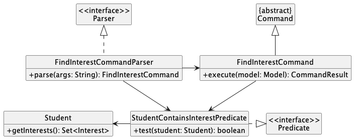
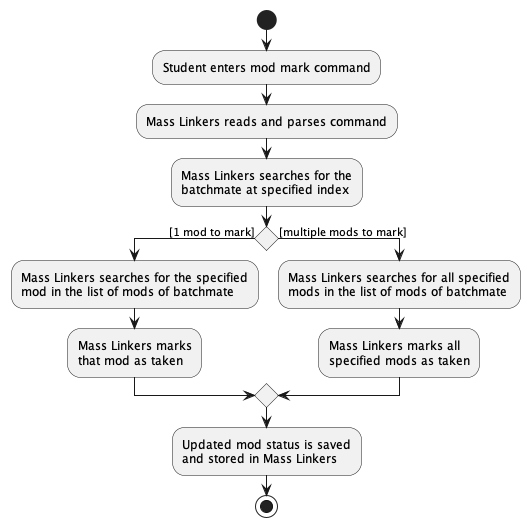
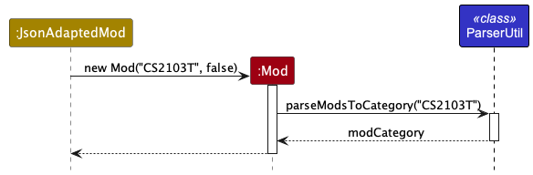
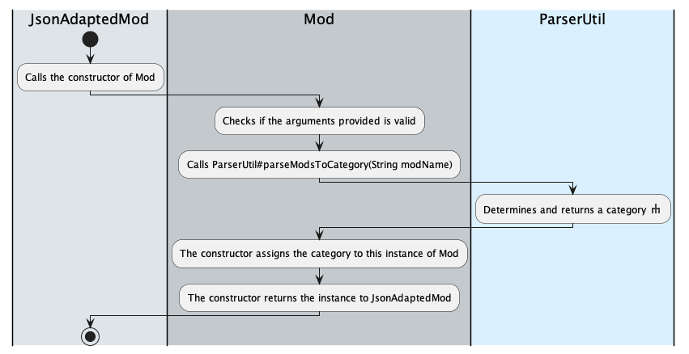
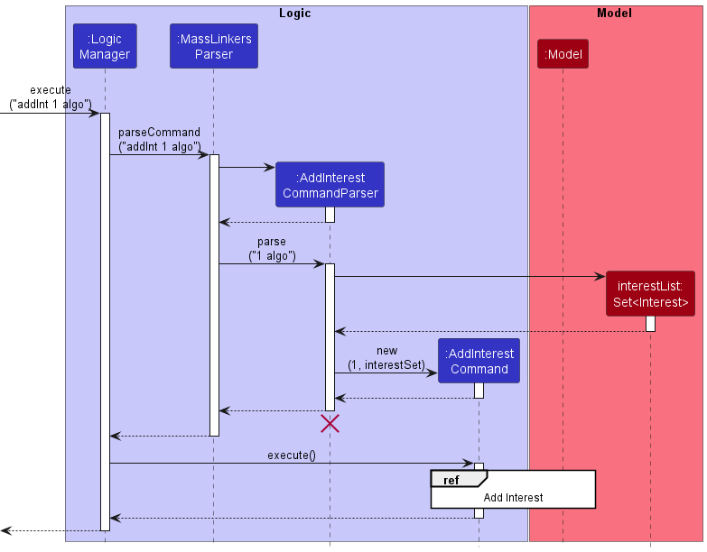
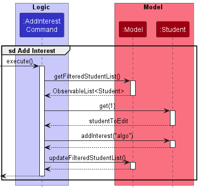

## **Overview**

Mass Linkers is a powerful Desktop application tool that helps **Computer Science (CS) students** find study support from batchmates.

It provides a **centralised** platform for CS students to 
  * save their batchmates’ contact and module details 
  * search for batchmates with common interests or who are taking similar modules **conveniently**


It is optimised for use via a **Command Line Interface (CLI)** while still having the benefits of a Graphical User Interface (GUI).


This *Developer Guide* provides general information for developers who are interested in understanding the design implementation of Mass Linkers for further developments.


--------------------------------------------------------------------------------------------------------------------

* Table of Contents
{:toc}

--------------------------------------------------------------------------------------------------------------------

## **Acknowledgements**

* This project is based on [AddressBook-Level3](https://se-education.org/addressbook-level3/) by [SE-EDU initiative](https://se-education.org/).
* Libraries used: [JavaFX](https://openjfx.io/), [Jackson](https://github.com/FasterXML/jackson), [JUnit5](https://github.com/junit-team/junit5), [PlantUML](https://plantuml.com/).
* Font packages used: [Ancient Olive Sans Serif Font](https://www.downloadfonts.io/ancient-olive-sans-serif-font/).
* Logos used: [Flaticon](https://www.flaticon.com/free-icons/official).

--------------------------------------------------------------------------------------------------------------------

## **Setting up, getting started**

Refer to the guide [_Setting up and getting started_](SettingUp.md).

--------------------------------------------------------------------------------------------------------------------

## **Design**

<div markdown="span" class="alert alert-primary">

:bulb: **Tip:** The `.puml` files used to create diagrams in this document can be found in the [diagrams](https://github.com/AY2223S1-CS2103T-T11-4/tp/tree/master/docs/diagrams) folder. Refer to the [_PlantUML Tutorial_ at se-edu/guides](https://se-education.org/guides/tutorials/plantUml.html) to learn how to create and edit diagrams.
</div>

### Architecture


The ***Architecture Diagram*** given above explains the high-level design of the App.

Given below is a quick overview of main components and how they interact with each other.

**Main components of the architecture**

**`Main`** has two classes called [`Main`](https://github.com/AY2223S1-CS2103T-T11-4/tp/blob/master/src/main/java/seedu/masslinkers/Main.java) and [`MainApp`](https://github.com/AY2223S1-CS2103T-T11-4/tp/blob/master/src/main/java/seedu/masslinkers/MainApp.java). It is responsible for,
* At app launch: Initializes the components in the correct sequence, and connects them up with each other.
* At shut down: Shuts down the components and invokes cleanup methods where necessary.

[**`Commons`**](#common-classes) represents a collection of classes used by multiple other components.

The rest of the App consists of four components.

* [**`UI`**](#ui-component): The UI of the App.
* [**`Logic`**](#logic-component): The command executor.
* [**`Model`**](#model-component): Holds the data of the App in memory.
* [**`Storage`**](#storage-component): Reads data from, and writes data to, the hard disk.


**How the architecture components interact with each other**

The *Sequence Diagram* below shows how the components interact with each other for the scenario where the user issues the command `delete 1`.


Each of the four main components (also shown in the diagram above),

* defines its *API* in an `interface` with the same name as the Component.
* implements its functionality using a concrete `{Component Name}Manager` class (which follows the corresponding API `interface` mentioned in the previous point).

For example, the `Logic` component defines its API in the `Logic.java` interface and implements its functionality using the `LogicManager.java` class which follows the `Logic` interface. Other components interact with a given component through its interface rather than the concrete class (reason: to prevent outside component's being coupled to the implementation of a component), as illustrated in the (partial) class diagram below.


The sections below give more details of each component.

### UI component

The **API** of this component is specified in [`Ui.java`](https://github.com/AY2223S1-CS2103T-T11-4/tp/blob/master/src/main/java/seedu/masslinkers/ui/Ui.java).


The UI consists of a `MainWindow` that is made up of parts e.g.`CommandBox`, `ResultDisplay`, `StudentListPanel`, `ModListPanel`, `StatusBarFooter` etc. All these, including the `MainWindow`, inherit from the abstract `UiPart` class which captures the commonalities between classes that represent parts of the visible GUI.

The `UI` component uses the JavaFx UI framework. The layout of these UI parts are defined in matching `.fxml` files that are in the `src/main/resources/view` folder. For example, the layout of the [`MainWindow`](https://github.com/AY2223S1-CS2103T-T11-4/tp/blob/master/src/main/java/seedu/masslinkers/ui/MainWindow.java) is specified in [`MainWindow.fxml`](https://github.com/AY2223S1-CS2103T-T11-4/tp/blob/master/src/main/resources/view/MainWindow.fxml).

The `UI` component,

* executes user commands using the `Logic` component.
* listens for changes to `Model` data so that the UI can be updated with the modified data.
* keeps a reference to the `Logic` component, because the `UI` relies on the `Logic` to execute commands.
* depends on some classes in the `Model` component, as it displays `Student` object residing in the `Model`.

### Logic component

**API** : [`Logic.java`](https://github.com/AY2223S1-CS2103T-T11-4/tp/blob/master/src/main/java/seedu/masslinkers/logic/Logic.java)

Here's a (partial) class diagram of the `Logic` component:


How the `Logic` component works:
1. When `Logic` is called upon to execute a command, it uses the `MassLinkersParser` class to parse the user command.
1. This results in a `Command` object (more precisely, an object of one of its subclasses e.g., `AddCommand`) which is executed by the `LogicManager`.
1. The command can communicate with the `Model` when it is executed (e.g. to add a student).
1. The result of the command execution is encapsulated as a `CommandResult` object which is returned back from `Logic`.

The Sequence Diagram below illustrates the interactions within the `Logic` component for the `execute("delete 1")` API call.


<div markdown="span" class="alert alert-info">:information_source: **Note:** The lifeline for `DeleteCommandParser` should end at the destroy marker (X) but due to a limitation of PlantUML, the lifeline reaches the end of diagram.
</div>

Here are the other classes in `Logic` (omitted from the class diagram above) that are used for parsing a user command:


How the parsing works:
* When called upon to parse a user command, the `MassLinkersParser` class creates an `XYZCommandParser` (`XYZ` is a placeholder for the specific command name e.g., `AddCommandParser`) which uses the other classes shown above to parse the user command and create a `XYZCommand` object (e.g., `AddCommand`) which the `MassLinkersParser` returns back as a `Command` object.
* All `XYZCommandParser` classes (e.g., `AddCommandParser`, `DeleteCommandParser`, ...) inherit from the `Parser` interface so that they can be treated similarly where possible e.g, during testing.

### Model component
**API** : [`Model.java`](https://github.com/AY2223S1-CS2103T-T11-4/tp/blob/master/src/main/java/seedu/masslinkers/model/Model.java)


The `Model` component,

* stores the mass linkers data i.e., all `Student` objects (which are contained in a `UniqueStudentList` object).
* stores the currently 'selected' `Student` objects (e.g., results of a search query) as a separate _filtered_ list which is exposed to outsiders as an unmodifiable `ObservableList<Student>` that can be 'observed' e.g. the UI can be bound to this list so that the UI automatically updates when the data in the list change.
* stores a `UserPref` object that represents the user’s preferences. This is exposed to the outside as a `ReadOnlyUserPref` objects.
* does not depend on any of the other three components (as the `Model` represents data entities of the domain, they should make sense on their own without depending on other components).

<div markdown="span" class="alert alert-info">:information_source: **Note:** An alternative (arguably, a more OOP) model is given below. It has a `Interest` list in the `MassLinkers`, which `Student` references. This allows `MassLinkers` to only require one `Interest` object per unique tag, instead of each `Student` needing their own `Interest` objects.<br>


</div>


### Storage component

**API** : [`Storage.java`](https://github.com/AY2223S1-CS2103T-T11-4/tp/blob/master/src/main/java/seedu/masslinkers/storage/Storage.java)


The `Storage` component,
* can save both Mass Linkers data and user preference data in json format, and read them back into corresponding objects.
* inherits from both `MassLinkersStorage` and `UserPrefStorage`, which means it can be treated as either one (if only the functionality of only one is needed).
* depends on some classes in the `Model` component (because the `Storage` component's job is to save/retrieve objects that belong to the `Model`).

### Common classes

Classes used by multiple components are in the `seedu.masslinkers.commons` package.

--------------------------------------------------------------------------------------------------------------------

## **Implementation**

This section describes some noteworthy details on how certain features are implemented.

### 1. Find Interest Feature

#### Implementation

The `FindInterestCommandParser` reads the specified interests entered by the student in `FindInterestCommandParser#parse`.
The specified interests are then passed as a `StudentContainsInterestPredicate` predicate for execution in `FindInterestCommand#execute`.

During execution, the interests of every batchmate will be tested against the aforementioned predicate.
If all interests specified are found in a batchmate's interests, that batchmate will be filtered out and displayed.
The result would be a list of all batchmates that are filtered out.

The following (partial) class diagram shows how the different classes involved in the find interest operation interact with one another:



The following activity diagram summarises what happens when a student enters a `findInt` command, assuming the command is valid and no error occurs:


#### Design considerations

**Aspect: How `findInt` executes:**

* **Alternative 1 (current choice):** Finds all batchmates whose interests match all interests specified (i.e. a superset of those specified).
    * Pros: A specific search to find batchmates who have the same interests as the student. (Specifying `ai` and `swe` will result in a batchmate whose interests are `ai`, `swe` and `algo` to be displayed).
    * Cons: Search might be too narrow since it excludes batchmates that have some but not all the interests specified. (Specifying `ai` and `swe` will not result in a batchmate whose only interest is `ai` to be displayed).

* **Alternative 2:** Finds all batchmates whose interests match at least one of the interests specified.
    * Pros: A more general search might be useful for finding a greater number of batchmates who share some of the interests as the student.
    * Cons: It diminishes the usefulness of being able to search for multiple interests at once if a general search is implemented. The purpose of specifying multiple interests is so that the search results would be specific.

### 2. Mod mark feature

#### Implementation

The `ModCommandParser` implements the operation `ModCommandParser#parseMarkCommand(String args)` to read inputs entered by the student for execution in `ModMarkCommand`. `ModMarkCommand` extends `ModCommand` to execute the `mod mark` command.

During execution, all modules specified by the student are marked in the `Student` class with the operation `Student#markMods(ObservableList<Mod> mods)`. This is because the list of modules is stored and associated with a `Student`, hence any updates on the module status in the current list of modules will be handled in `Student`. Each individual module is then marked in the `Mod` class with the operation `Mod#markMod()`.

The following (partial) class diagram shows how the different classes involved in the mod mark operation interacts with one another:


The following activity diagram summarises what happens when a student enters a `mod mark` command, assuming the command is valid and no error occurs:



#### Design considerations

**Aspect: How `mod mark` executes:**

* **Alternative 1 (current choice):** Marks mods of a batchmate whose index is specified.
    * Pros: Easier to implement. Shorter command to enter.
    * Cons: May be hard to find and locate the index of the batchmate especially when the list of batchmates is long.

* **Alternative 2:** Marks mods of a batchmate whose name is specified.
    * Pros: Easier to find the batchmate by directly entering the name.
    * Cons: Full name of the batchmate has to be specified. It may take more time to enter the name especially for long and complicated names.

### 3. Mod find feature

#### Implementation

The `ModCommandParser` implements the operation `ModCommandParser#parseFindCommand(String args)` to read inputs entered by the student for execution in `ModFindCommand`. `ModFindCommand` extends `ModCommand` to execute the `mod find` command.

During execution, the user inputs of module codes are passed into a `List` to `ModContainsKeywordsPredicate`.

For simplicity, we will call this `List` of module codes `keywords`. `ModContainsKeywordsPredicate#test(Student student)` returns `true` for a particular `Student` only if every element in `keywords` is in `Mod` of this `Student` (stored as `ObservableList<Mod>`).

Checking of whether the elements in the `keywords` and `Mod` match each other is done by the `StringUtil#containsWordIgnoreCase(String sentence, String word)`.

The result of `ModContainsKeywordsPredicate#test(Student student)` is then used by `Model#updateFilteredStudentList` to filter those `Student` with the specified module(s) when `ModFindCommand#execute(Model model)` is called.

The following sequence diagram shows how the different classes involved in the `mod find` operation interacts with one another:


The following activity diagram summarises what happens when a student enters a `mod find` command, assuming the command is valid and no error occurs:


#### Design considerations

**Aspect: How `mod find` executes:**

* **Alternative 1 (current choice):** Modules will be identified only if user inputs fully match the module code. For instance, `mod find cs1231` does not return batchmates with the module `CS1231S` (lacking an "S").
    * Pros: Reduces confusion. Requiring exact module code will display batchmates that are tailored to the specifications, reducing the need to manually filter through the list of `Student`. Imagine that if the system allows partial matching of module codes, typing `mod find cs` yields all Computer Science batchmates with modules having the code "CS" to be displayed.
    * Cons: If the desired module code is so unique that partial matching can suffice to pinpoint the module, requiring a fully matching input would cause some inconvenience to the user.

* **Alternative 2:** Modules can be identified by partially matching inputs of module codes. For instance, `mod find 123` will return `Student` with the module `CS1231S`.
    * Pros: Shorter commands to enter and grants greater convenience to users.
    * Cons: If many module codes share the same partial module code that user inputs, many batchmates will be returned, rendering the `mod find` function ineffective as users still need to manually search for batchmates with the desired module.

### 4. Module Categorisation

#### Implementation

Module categorisation is handled by `ParserUtil#parseModsToCategory(String modName)`.
A category is assigned to every mod upon creating it through its constructor.
This categorisation is not saved in Storage.
The module categories can be viewed [here](UserGuide.md#module-categorisation).

Upon calling the constructor of `Mod` to create a new instance, the constructor
will then call `ParserUtil#parseModsToCategory(String modName)` which returns a `ModCategory`
corresponding to the `modName`.
A new `Mod` instance with its `modName` and `modCategory` is created.
This `modCategory` will later be used to colour code mods in the UI.

The (partial) sequence diagram below shows the categorisation of a new mod when
its constructor is called in `JsonAdaptedMod`.



The (partial) activity diagram below summarises what happens when a new mod is created in `JsonAdaptedMod`
assuming no errors occur.



Activity: Determines and returns a category.


#### Design considerations

**Aspect: How categorisation is handled:**

* **Alternative 1 (current choice):** All categorisation is handled upon creation of a `Mod` instance.
    * Pros: Easier to implement. Less bug-prone. No need to save mod categorisation.
    * Cons: User is unable to edit the mod categories. Lowers performance.

* **Alternative 2:** Categories of mods are saved into Storage.
    * Pros: Users can edit mod categories with fewer changes to the code base. Increased performance.
    * Cons: Increased complexity.
    
### 5. Add Interest Feature

#### Implementation
The ```addInt``` command allows students to add one or more interests to a batchmate by indicating the index held by the batchmate and the list of interests to be added.

The command takes in two arguments:
- ```Index``` targetIndex
- ```Set<Interest>``` interests

Each ```Student``` has a ```Set``` of ```Interest```. Adding an ```Interest``` to a batchmate would add to the set of ```Interest``` of the ```Student``` with the ```targetIndex```. The Add Interest mechanism is facilitated by ```AddInterestCommand```, which extends from ```Command``` and ```AddInterestCommandParser```, which extends from
```Parser```. ```AddInterestCommandParser``` serves to parse the command arguments and create a new ```AddInterestCommand``` object. ```AddInterestCommand```handles adding the ```Interest``` to the set of ```Interest``` of the ```Student```.

Below are the steps:
1. When the student enters the ```addInt``` command, the ```LogicManager``` is executed and it calls the ```MassLinkersParser``` to parse the command.
2. A new ```AddInterestCommandParser``` object is constructed.
3. ```AddInterestCommandParser#parse``` parses the command arguments and returns a set of Interests. A new ```AddInterestCommand``` is constructed.
4. ```AddInterestCommand``` is returned to the ```LogicManager```, which invokes ```AddInterestCommand#execute```.
5. The ```Index``` is verified to be valid and if so, the list of interests is added to the ```Student``` marked by ```Index```.
6. ```Student``` is updated with the added interests. ```ModelManager``` will also be updated with the changes.

The sequence diagram for the command ```addInt 1 algo``` is as follows.



<div markdown="span" class="alert alert-info">:information_source: **Note:** The lifeline for `AddInterestCommandParser` should end at the destroy marker (X) but due to a limitation of PlantUML, the lifeline reaches the end of diagram.
</div>

In addition, the sequence diagram below illustrates how the ```AddInterestCommand``` interacts with ```Model``` to update the added interests in Mass Linkers. 



#### Design considerations

**Aspect: Usefulness of ```AddInterestCommand```:**

* The current ```EditCommand``` allows users to update interests. However, this involves overwriting all the current interests. Hence, ```addInt``` is useful to provide a quick way to add new interests to a ```Student```.

**Aspect: Managing the List of Interests:**

* **Alternative 1 (current choice):** Store the set of```Interest``` as a field in the ```Student``` class.
    * Pros: Easier to implement. The use of a ```HashSet``` can handle duplicates.
    * Cons: There is less abstraction as the logic of getting the list and adding to the list is handled by ```Student```.

* **Alternative 2:** Have a ```UniqueInterestList``` to handle the list of Interests (similar to that of ```UniqueStudentList```).
    * Pros: The low-level details of adding, removing and checking the interests are abstracted. There is greater adherence to the Single Responsibility Principle as the list of interests are handled by the ```UniqueInterestList``` class.
    * Cons: The number of ```Interest``` is usually not that large so Alternative 2 could result in unnecessary implementation overhead.

--------------------------------------------------------------------------------------------------------------------

## **Documentation, logging, testing, configuration, dev-ops**

* [Documentation guide](Documentation.md)
* [Testing guide](Testing.md)
* [Logging guide](Logging.md)
* [Configuration guide](Configuration.md)
* [DevOps guide](DevOps.md)

--------------------------------------------------------------------------------------------------------------------

## **Appendix: Requirements**

### Product scope

**Target user profile**:

* Computer Science students at NUS <br>
  * Provides a centralised platform for Computer Science (CS) students to find study support from batchmates with common modules. It allows students to save their CS batchmates’ contact details in one place, find common modules and form study groups.


**Value proposition**: Easily find batchmates to form study groups or asking for module-related advice.
* Provides a centralised platform for students to share their contact info for easier communication.
* Provides convenience for students to find batchmates who are taking the same modules or have the same interests as them.
* Provides convenience for students to find batchmates who have taken their mods before to ask them for module-related advice.


### User stories

Priorities: High (must have) - `* * *`, Medium (nice to have) - `* *`, Low (unlikely to have) - `*`

| Priority | As a …​            | I want to …​                                                                          | So that I can…​                                                        |
|----------|--------------------|---------------------------------------------------------------------------------------|------------------------------------------------------------------------|
| `* * *`  | student            | add my batchmates to Mass Linkers                                                     | keep track of information about the people I have met                  |
| `* * *`  | student            | add my batchmate’s name                                                               | identify their details                                                 |
| `* * *`  | student            | add my batchmate’s phone number                                                       | message or call them, especially in urgent situations.                 |
| `* * *`  | student            | add my batchmate’s telegram handle                                                    | contact and chat with them conveniently                                |
| `* * *`  | student            | add my batchmate’s email address                                                      | share documents and files with them                                    |
| `* * *`  | student            | add my batchmate’s GitHub usernames                                                   | find their profiles                                                    |
| `* * *`  | student            | edit the list of batchmates in Mass Linkers                                           | keep them up to date                                                   |
| `* * *`  | student            | choose the batchmate I want to edit                                                   | write to the correct person                                            |
| `* * *`  | student            | edit my batchmate’s name                                                              | change the alias or amend if I keyed in wrongly                        |
| `* * *`  | student            | edit my batchmate’s phone number                                                      | change it accordingly when they change                                 |
| `* * *`  | student            | edit my batchmate’s telegram handle                                                   | change it accordingly when they change                                 |
| `* * *`  | student            | edit my batchmate’s GitHub usernames                                                  | change it accordingly when they change                                 |
| `* * *`  | student            | search and access the list of batchmates I have in Mass Linkers                       |                                                                        |
| `* * *`  | student            | easily search for a specific person by their name / GitHub username / Telegram handle | quickly get their details                                              |
| `* * *`  | student            | find a list of batchmates that share the same interests as me                         | find batchmates to whom I can better relate to                         |
| `* * *`  | student            | search the list of batchmates by the mods they have or are taking                     | ask them about the mod when I have a module-specific doubt             |
| `* * *`  | student            | add, edit and see what mods my batchmates have taken or are taking                    | ask them module-related questions when I have any doubts               |
| `* * *`  | student            | add a mod to the list of mods for the selected batchmate                              |                                                                        |
| `* * *`  | student            | delete a mod from the list of mods for the selected batchmate                         |                                                                        |
| `* * *`  | student            | easily see the mods a selected batchmate is currently taking or has taken             |                                                                        |
| `* * *`  | student            | mark a mod as completed or is currently taking for a particular person                | know whether he or she is taking the module or has taken the module    |
| `* *`    | student            | view mods colour-coded by their mod type                                              | easily identify the mods                                               |
| `* *`    | user               | fully utilise Mass Linkers with an easy-to-use interface                              |                                                                        | 
| `* *`    | user               | view all the available commands                                                       | know what to type for the various functions                            |
| `* *`    | user               | have a clean and polished interface that is aesthetically pleasing                    |                                                                        |
| `* *`    | busy user          | have an interface that is self-explanatory                                            | reduce time spent on learning how to use the program                   |
| `* *`    | user               | close the application with a command instead of using the mouse to close the window   |                                                                        |
| `* *`    | student            | save and export the data                                                              | the address book has greater scalability and can be shared with others | 
| `* *`    | student            | save my data to a file and use it on another computer                                 | access the data on different devices                                   |
| `* *`    | student            | export the data                                                                       | share it with my friends                                               |
| `* *`    | user               | have a comprehensive and comprehensible documentation                                 | easily access all the information about Mass Linkers                   | 
| `* *`    | user               | have a help page with Frequently Asked Questions (FAQ)                                | self-diagnose any issues I may encounter                               |
| `* *`    | technical user     | have a short installation guide with concrete steps on how to run the program         | set it up on my own with some technical knowledge                      |
| `* *`    | advanced user      | have a short guide to all the commands/functions I can do in the application          | save time                                                              |
| `*`      | non-technical user | have an installation video guide                                                      | follow and run the program without much technical knowledge            | 

### Use cases
(For all use cases below, the **System** is Mass Linkers and the **Actor** is the student, unless specified otherwise)

**Use case 1: Add a batchmate’s information**

**MSS**
1. Student chooses to add a batchmate's contact.
2. Student enters batchmate's particulars.
3. Mass Linkers adds batchmate to current list of batchmates. \
   Use case ends.

**Extensions**
* *a. At any time, Student chooses to close Mass Linkers.
    * a1. Mass Linkers updates the storage file. \
      Use case ends.

**Use case 2: Remove a batchmate**

**MSS**
1. Student requests for the list of batchmates.
2. Mass Linkers shows the current list of batchmates.
3. Student requests to delete a specific batchmate in the list.
4. Mass Linkers deletes the specified batchmate.
   \
   Use case ends.

**Extensions**
* 2a. The list is empty.
  \
  Use case ends.
* 3a. Mass Linkers detects an incorrect phone number in the entered command.
    * 3a1. Mass Linkers warns the user that the phone number is incorrect.
      \
      Use case resumes from step 4.
* 3b. The specified batchmate is not found.
    * 3b1. Mass Linkers detects an error in specified batchmate (invalid index).
    * 3b2. Mass Linkers requests for a valid batchmate.
    * Steps 3b1-3b2 are repeated until a valid index is given.
      \
      Use case resumes from step 4.

* *a. At any time, Student chooses to close Mass Linkers.
    * a1. Mass Linkers updates the storage file.
      \
      Use case ends.

**Use case 3: Add an interest to a batchmate**

**MSS**

1. Student chooses to add an interest to a batchmate.
2. Mass Linkers searches through the list of batchmates for the selected batchmate.
3. Mass Linkers adds the interests to the batchmate.
   \
   Use case ends.

**Extensions**
* 2a. The list of batchmates is empty.
    * 2a1. Mass Linkers warns adding an interest is invalid.
      \
      Use case ends.
* 2b. Mass Linkers detects an error in specified batchmate (non valid index).
    * 2b1. Mass Linkers requests for new batchmate details.
    * Step 2b1 is repeated until a batchmate is found.
      \
      Use case resumes from step 3.

* *a. At any time, Student chooses to close Mass Linkers.
    * a1. Mass Linkers updates the storage file.
      \
      Use case ends.

**Use case 4: Search batchmates via interests**

**MSS**

1. Student requests the list of batchmates with the specified interests.
2. Mass Linkers returns the list of batchmates associated with the particular interests.
   \
   Use case ends.

**Extensions**
* 1a. Mass Linkers detects an invalid input. (No interests specified by the student).
    * 1a1. Mass Linkers requests for at least one interest to be specified.
    * 1a2. Student inputs new interests.
    * Steps 1a1-1a2 are repeated until input is valid.
    \
    Use case resumes from step 2.
* *a. At any time, Student chooses to close Mass Linkers.
      \
      Use case ends.

**Use case 5: Mark a module completed**

**MSS**

1. Student requests the list of modules for a batchmate.
2. Student requests to mark a module complete.
3. Mass Linkers marks the module completed.
   \
   Use case ends.

**Extensions**
* 2a. The list of modules is empty.
    * 2a1. Mass Linkers warns marking a module is invalid.
      \
      Use case ends.
* 2b. Mass Linkers detects the specified module is invalid (out of range).
    * 2b1. Mass Linkers requests for new module.
    * Step 2b1 is repeated until a module is found.
      \
      Use case resumes from step 3.

* *a. At any time, Student chooses to close Mass Linkers.
    * a1. Mass Linkers updates the storage file.
      \
      Use case ends.
    
**Use case 6: Edit Batchmate**

**MSS**

1. Student requests the list of batchmates.
2. Mass Linkers displays list of batchmates.
3. Student requests to edit a specific batchmate in the list with the new details.
4. Mass Linkers updates the details of said batchmate.
   \
   Use case ends.

**Extensions**
* 2a. The list of batchmates is empty.
  \
  Use case ends.
* 3a. Mass Linkers detects an error in the entered command.
    * 3a1. Mass Linkers requests for the correct command.
    * 3a2. Student enters new command.
      Steps 3a1-3a2 are repeated until the command entered is correct.
      \
      Use case resumes from step 4.
* 3b. Mass Linkers detects an incorrect phone number in the edited batchmate.
    * 3b1. Mass Linkers warns the user that the phone number is incorrect.
      \
      Use case resumes from step 4.
* 3c. Mass Linkers could not find the batchmate specified.
    * 3c1. Mass Linkers requests the user to input a valid batchmate.
    * 3c2. Student enters new command.
      Steps 3c1-3c2 are repeated until the command entered are correct.
      \
      Use case resumes from step 4.

* *a. At any time, Student chooses to close Mass Linkers.
    * a1. Mass Linkers updates the storage file.
      \
      Use case ends.

**Use case 7: Add module**

**MSS**

1. Student requests to add modules to a specific batchmate.
2. Mass Linkers add modules to said batchmate.
   \
   Use case ends.

**Extensions**
* 1a. The list of batchmates is empty.
  \
  Use case ends.
* 2a. Mass Linkers detects an error in the entered command.
    * 2a1. Mass Linkers requests for the correct command.
    * 2a2. Student enters new command.
      Steps 2a1-2a2 are repeated until the command entered are correct.
      \
      Use case ends.
* 2b. Mass Linkers could not find the batchmate specified.
    * 2b1. Mass Linkers requests the user to input a valid batchmate.
    * 2b2. Student enters new command.
      Steps 2b1-2b2 are repeated until the command entered are correct.
      \
      Use case ends.

* *a. At any time, Student chooses to close Mass Linkers.
    * a1. Mass Linkers updates the storage file.
      \
      Use case ends.

### Non-Functional Requirements

1. Should work on any _mainstream OS_ as long as it has Java `11` or above installed.
2. Should be able to hold up to 1000 batchmates without a noticeable sluggishness in performance for typical usage.
3. A user with above average typing speed for regular English text (i.e. not code, not system admin commands) should be able to accomplish most of the tasks faster using commands than using the mouse.
4. The GUI should work well with standard screen resolutions 1920x1080 and higher. i.e. GUI does not appear to be cut or distorted.
5. For every action by the user, the result should be visible within 5 seconds.
6. The project should not depend on any remote servers.
7. The software and documentation should be accessible to users with a basic command of English.
8. The packaged JAR file should not exceed 100MB.
9. The software should work without the need for an installer.
10. The product should not be able to verify the legitimacy of information provided by the student.

### Glossary

* **Batchmate**: The people whom the users need to link to and interact with.
* **Command Line Interface (CLI)**: A text of lines input by the users to send instructions to the system.
* **Graphical User Interface (GUI)**: A means, supported by visuals, for the users to send instructions to the system.
* **Mainstream OS**: Windows, Linux, Unix, OS-X.
* **Private contact detail**: A contact detail that is not meant to be shared with others.
* **Student**: The main user.

--------------------------------------------------------------------------------------------------------------------
## **Appendix: Future Developments**
Due to time and manpower constraints, several good-to-have features were considered for future developments.

### 1. Undo Command
Several of the commands can create drastic changes to the data in Mass Linkers, such as `mod mark all` which would mark every module for all students as taken and `clear` which would delete all the data existing in Mass Linkers. 

Having an `undo` feature would be valuable to help users overcome the problem of executing these commands unintentionally and needing to revert the changes made. 

### 2. Selecting a batchmate using CLI
Mass Linkers is targeted at users who can type fast and prefer typing as the primary form of input. 

Currently, the selection of a batchmate in the _Students panel_ to view their modules can only be done via the GUI interface to click on the particular batchmate.

Having a `mod view INDEX` command would give users an option to select a batchmate with index ```INDEX``` using the CLI, helping Mass Linkers align more to its typing-preferred characteristic.

### 3. Auto-scroll when a batchmate is added
Currently, the _Students panel_ does not scroll to the bottom when a batchmate is added and the row exceeds the currently displayed list of batchmates in the _Students panel_. 

Implementing the _Students panel_ to display the most-recently added batchmate would help in enhancing the user experience and users do not need to manually scroll to the bottom each time.

--------------------------------------------------------------------------------------------------------------------
## **Appendix: Instructions for manual testing**

Given below are instructions to test the app manually.

<div markdown="span" class="alert alert-info">:information_source: **Note:** These instructions only provide a starting point for testers to work on;
testers are expected to do more *exploratory* testing.

</div>

### Launch and shutdown

1. Initial launch.

    1. Download the jar file and copy it into an empty folder.

    2. Double-click the jar file. <br>
       Expected: Shows the GUI with a set of sample batchmates. The window size may not be optimum.

2. Saving window preferences.

    1. Resize the window to an optimum size. Move the window to a different location. Close the window.

    2. Re-launch the app by double-clicking the jar file.<br>
       Expected: The most recent window size and location is retained.

### Adding a batchmate

1. Adding a batchmate to the data.

    1. Test case: `add n/John t/johnnn`.<br>
       Expected: A new batchmate with the name `John` and telegram handle `johnnn` is added at the bottom of the _Students panel_ in Mass Linkers.
       The status message indicates that a batchmate named `John` has been successfully added.

       1. Prerequisite: A batchmate with the name `Tom` and the telegram `tommmm` is already in Mass Linkers. <br>
          Test case: `add n/Tom t/tommmm`.<br>
          Expected: No batchmate is added. The status message indicates that the batchmate already exists in Mass Linkers. 
       Uniqueness is verified using two of the mandatory fields - the ```Student```'s name and telegram handle.

    2. Test case: `add n/John t/john i/ai g/john`.<br>
       Expected: A new batchmate with the name `John`, telegram handle `john`, interests `ai` and GitHub `john` is added at the bottom of the _Students panel_ in Mass Linkers.
       The status message indicates that a batchname named `John` has been successfully added.

    3. Test case: `add n/John`.<br>
       Expected: No batchmate is added. The status message indicates that the command is of an invalid format.

    4. Other incorrect `add` commands to try: `add`, `add n/John t/johnnn x/invalid`, `...` (where x is any invalid prefix).<br>
       Expected: Similar to previous.


### Deleting a batchmate

1. Deleting a batchmate while all batchmates are being shown.

    1. Prerequisites: List all batchmates using the `list` command. There are multiple batchmates in the list.

    2. Test case: `delete 1`.<br>
       Expected: First batchmate is deleted from the list. Details of the deleted batchmate is shown in the status message.

    3. Test case: `delete 0`.<br>
       Expected: No batchmate is deleted. Error details are shown in the status message.

    4. Other incorrect `delete` commands to try: `delete`, `delete x`, `...` (where x is larger than the list size).<br>
       Expected: Similar to previous.

### Find batchmates

1. Find batchmates using keyword(s).

    1. Prerequisites: List all batchmates using the `list` command. There are multiple batchmates in the list.

    2. Prerequisite: There exists a batchmate with telegram handle `charlie`.<br>
       Test case: `find char`.<br>
       Expected: The batchmate with telegram handle `charlie` appears in the _Students panel_ after executing the command.
   
    3. Prerequisite: There exists a batchmate with telegram handle `charlie` and a batchmate with name `Tom`.<br>
       Test case: `find char Tom`.<br>
       Expected: The batchmate with telegram handle `charlie` and batchmate named `Tom`
       appear in the _Students panel_ after executing the command.

    4. Other incorrect `find` commands to try: `find` (no keywords provided).<br>
       Expected: The status message will indicate that the command is invalid.

### Add mods to a batchmate

1. Add mods to a batchmate.

    1. Prerequisites: List all batchmates using the `list` command. There are multiple batchmates in the list.

    2. Test case: `mod add 1 cs2103t cs2101`.<br>
       Expected: The mods `CS2103T` and `CS2101` will be present in the mods pane when the batchmate located at index 1 is selected.

    3. Other incorrect `mod add` commands to try: `mod add cs2103t`, `mod add 1 xxx` (where xxx is any invalid mod name).<br>
       Expected: No mods are added, and the status message will indicate that the command is invalid.

### Mark mod(s) for a batchmate

1. Mark mod(s) for a batchmate.

    1. Prerequisites: List all batchmates using the `list` command. There are multiple batchmates in the list.

    2. Prerequisites: The batchmate at index 1 must have the mods CS2103T and CS2101.<br>
       Test case: `mod mark 1 cs2103t cs2101`.<br>
       Expected: The mods `CS2103T` and `CS2101` will be marked as taken in the mods pane when the batchmate located at index 1 is selected.

    3. Other incorrect `mod mark` commands to try: `mod mark cs2103t`, `mod mark 1 xxx`
       (where xxx is any mod name that is not in the list of mods for that batchmate).<br>
       Expected: No mods are added, and the status message will indicate that the command is invalid.

### Saving data

1. Dealing with missing/corrupted data files.

    1. Go to the data file located at `data/massLinkers.json`. If the directory is not present,
       run Mass Linkers, modify the data, and exit. The data file should be present in the directory.
    2. Attempt to corrupt the data by deleting a closing brace `}` at the end of the file.
    3. Reopen Mass Linkers. <br>
       Expected: Mass Linkers will run and start with an empty data file. No batchmates will be shown on the _Students panel_.

2. All data saved.

    1. Add or edit batchmate(s) in Mass Linkers.
    2. Close Mass Linkers.
    3. Reopen Mass Linkers. <br>
       Expected: The data is saved, and the changes you made to the data are still present.

