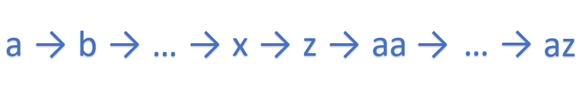
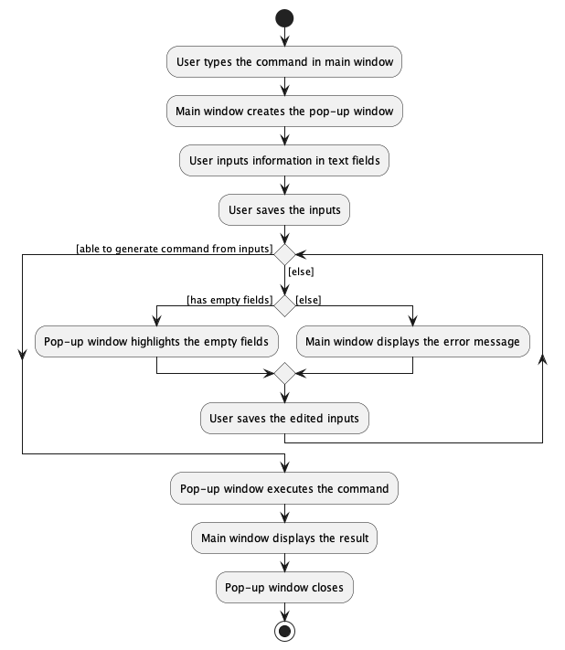

##Table of Contents

- **[Acknowledgements](#acknowledgements)**
- **[Setting up, getting started](#setting-up-getting-started)**
- **[Architecture](#architecture)**
  * [UI Component](#ui-component)
  * [Logic Component](#logic-component)
  * [Model Component](#model-component)
  * [Storage Component](#storage-component)
- **[Implementation](#implementation)**
  * [Unique ID Mechanism](#unique-id-mechanism)
    * [Motivation](#motivation-for-unique-id)
    * [Implementation](#implementation-of-unique-id)
  * [Display of person list](#display-of-person-list)
    * [Motivation](#motivation-for-display-of-person-list)
    * [Implementation](#implementation-of-display-of-person-list)
    * [Alternatives Considered](#alternatives-considered-for-display-of-person-list)
  * [Pop-up window for add command](#pop-up-window-for-add-command)
    * [Motivation](#motivation-for-pop-up-window)
    * [Implementation](#implementation-of-pop-up-window-for-add-command)
    * [Alternatives Considered](#alternatives-considered-for-pop-up-window)
  * [Match feature](#match-feature)
    * [Motivation](#motivation-for-match-feature)
    * [Implementation of scoring system](#implementation-of-the-score-system)
    * [Sample calculation of the score](#sample-calculation-of-the-score)
    * [Finding the best fit pet](#finding-the-best-fit-pet)
    * [Areas for improvement](#areas-for-improvement-for-match-feature)
  * [[Proposed] Undo/Redo feature](#proposed-undoredo-feature)
- **[Documentation, logging, testing, configuration, dev-ops](#documentation-logging-testing-configuration-dev-ops)**
- **[Appendix: Requirements](#appendix-requirements)**
  * [Product Scope](#product-scope)
  * [User Stories](#user-stories)
  * [Use Cases](#use-cases)
  * [Non-functional Requirements](#non-functional-requirements)
  * [Glossary](#glossary)
- **[Appendix: Instructions for manual testing](#appendix-instructions-for-manual-testing)**
  * [Launch and shutdown](#launch-and-shutdown)
  * [Delete a buyer](#deleting-a-buyer)
  * [Saving data](#saving-data)
- **[Appendix: Effort](#appendix-effort)**

--------------------------------------------------------------------------------------------------------------------

## **Acknowledgements**

* The features Add, Edit, Delete were reused with minimal changes from the past project
  [Address Book Level 3](https://github.com/nus-cs2103-AY2223S1/tp) ([UG](https://github.com/nus-cs2103-AY2223S1/tp/blob/master/docs/UserGuide.md), [DG](https://github.com/nus-cs2103-AY2223S1/tp/blob/master/docs/DeveloperGuide.md)).

--------------------------------------------------------------------------------------------------------------------

## **Setting up, getting started**

Refer to the guide [_Setting up and getting started_](SettingUp.md).

--------------------------------------------------------------------------------------------------------------------

## **Design**

:bulb: **Tip:** The `.puml` files used to create diagrams in this document can be found in
the [diagrams](https://github.com/AY2223S1-CS2103T-T09-2/tp/tree/master/docs/diagrams) folder. Refer to the [_PlantUML
Tutorial_ at se-edu/guides](https://se-education.org/guides/tutorials/plantUml.html) to learn how to create and edit
diagrams.

### Architecture

The ***Architecture Diagram*** given above explains the high-level design of the App.

Given below is a quick overview of main components and how they interact with each other.

**Main components of the architecture**

**`Main`** has two classes
called [`Main`](https://github.com/AY2223S1-CS2103T-T09-2/tp/blob/master/src/main/java/seedu/address/Main.java)
and [`MainApp`](https://github.com/AY2223S1-CS2103T-T09-2/tp/blob/master/src/main/java/seedu/address/MainApp.java). It
is responsible for,

* At app launch: Initializes the components in the correct sequence, and connects them up with each other.
* At shut down: Shuts down the components and invokes cleanup methods where necessary.

[**`Commons`**](#common-classes) represents a collection of classes used by multiple other components.

The rest of the App consists of four components.

* [**`UI`**](#ui-component): The UI of the App.
* [**`Logic`**](#logic-component): The command executor.
* [**`Model`**](#model-component): Holds the data of the App in memory.
* [**`Storage`**](#storage-component): Reads data from, and writes data to, the hard disk.

**How the architecture components interact with each other**

The *Sequence Diagram* below shows how the components interact with each other for the scenario where the user issues
the command `delete-b 1`.

Each of the four main components (also shown in the diagram above),

* defines its *API* in an `interface` with the same name as the Component.
* implements its functionality using a concrete `{Component Name}Manager` class (which follows the corresponding
  API `interface` mentioned in the previous point).

For example, the `Logic` component defines its API in the `Logic.java` interface and implements its functionality using
the `LogicManager.java` class which follows the `Logic` interface. Other components interact with a given component
through its interface rather than the concrete class (reason: to prevent outside component's being coupled to the
implementation of a component), as illustrated in the (partial) class diagram below.

The sections below give more details of each component.

### UI component

The **API** of this component is specified
in [`Ui.java`](https://github.com/AY2223S1-CS2103T-T09-2/tp/blob/master/src/main/java/seedu/address/ui/Ui.java)

Given below is a partial class diagram of the `Ui` component.

The UI consists of a `MainWindow` that is made up of parts including `CommandBox`, `ResultDisplay`, `StatusBarFooter`.
The `mainWindow` also has `HelpWindow` and `AddCommandPopupWindow` that will be shown to the user when required.
Detailed implementation of the `AddCommandPopupWindow` is written [here](#pop-up-window-for-add-command).
All these UI components, including the `MainWindow`, inherit from the abstract `UiPart` class which captures the commonalities between
classes that represent parts of the visible GUI.

Furthermore, the `MainWindow` can be filled by **one** list panel, such as `BuyerListPanel` and `PetListPanel`, for display.
The list panel displayed depends on the input `Command`.
Each list panel can have any number of the corresponding card. For example, `BuyerListPanel` can have any number
of `BuyerCard`.
All the list panels and cards inherit from the abstract `UiPart`, but **not shown** in the diagram below to reduce graph
complexity.
Detailed implementation of the list panel can be found [here](#display-of-person-list).

The `UI` component uses the JavaFx UI framework. The layout of these UI parts are defined in matching `.fxml` files that
are in the `src/main/resources/view` folder. For example, the layout of
the [`MainWindow`](https://github.com/AY2223S1-CS2103T-T09-2/tp/blob/master/src/main/java/seedu/address/ui/MainWindow.java)
is specified
in [`MainWindow.fxml`](https://github.com/AY2223S1-CS2103T-T09-2/tp/blob/master/src/main/resources/view/MainWindow.fxml)

The `UI` component,

* executes user commands using the `Logic` component.
* listens for changes to `Model` data so that the UI can be updated with the modified data.
* keeps a reference to the `Logic` component, because the `UI` relies on the `Logic` to execute commands.
* depends on some classes in the `Model` component, as it displays `Person` objects residing in the `Model`.

### Logic component

**API** : [`Logic.java`](https://github.com/AY2223S1-CS2103T-T09-2/tp/blob/master/src/main/java/seedu/address/logic/Logic.java)

Here's a (partial) class diagram of the `Logic` component:

How the `Logic` component works:

1. When `Logic` is called upon to execute a command, it uses the `AddressBookParser` class to parse the user command.
1. This results in a `Command` object (more precisely, an object of one of its subclasses e.g., `AddBuyerCommand`) which is
   executed by the `LogicManager`.
1. The command can communicate with the `Model` when it is executed (e.g. to add a buyer).
1. The result of the command execution is encapsulated as a `CommandResult` object which is returned from `Logic`.

The Sequence Diagram below illustrates the interactions within the `Logic` component for the `execute("delete-b 1")` API
call.

:information_source: **Note:** The lifeline for `DeleteBuyerCommandParser` should end at the destroy marker (X) but due to a limitation of PlantUML, the lifeline reaches the end of diagram.

Given below is a diagram showing some other classes in `Logic` (omitted from the class diagram above) that can be used for parsing a user command:

:information_source: **Note:** Some classes shown such as `ArgumentMultiMap`, `ArgumentTokenizer` and `CliSyntax` may not be used for some `XYZCommandParser` objects. Read the information section below for further explanation.

:information_source: **Different commands have different ways of implementing their respective parsers.**  

**Some parsers can return different `Command` objects.** 
The `SortCommandParser` returns one of `SortCommand`'s subclasses -- `SortBuyerCommand`,
`SortDelivererCommand`, `SortSupplierCommand`, `SortOrderCommand`, and `SortPetCommand`. 
The implementation of `SortCommandParser` was done such that the `SortCommand` is able to accept multiple inputs for the
`LIST_TYPE` and `ATTRIBUTES` parameters. Hence, the `SortCommandParser` makes use of `SortCommandParserUtil`
and `CommandUtil` classes which help to parse the multiple valid parameters and return the correct `SortCommand`
subclass. 
Given below is the Parser classes diagram for the `SortCommand`. 
   

**Some `Command` objects are similar but have their own parsers and behave distinctly.** 
The `AddressBookParser` creates `DeleteBuyerCommandParser`, `DeleteSupplierCommandParser`,
`DeleteDelivererCommandParser`, `DeleteOrderCommandParser`, or a `DeletePetCommandParser` depending on the user's input.
Each `DeleteCommand` parser then returns the respective `DeleteCommand` to `AddressBookParser` for execution,
i.e `DeleteBuyerCommandParser` parse method returns a `DeleteBuyerCommand` object. 
This way of implementation is done for commands that are very similar but have different `COMMAND_WORD`s, such as the
AddCommand, DeleteCommand, EditCommand, FilterCommand, and FindCommand. 
Given below is the Parser classes diagram for the `DeleteCommand`.
**`ParserUtil` and `Index` classes are omitted from the diagram to reduce graph complexity.** 

**How the parsing works:**

* When called upon to parse a user command, the `AddressBookParser` class creates an `XYZCommandParser` (`XYZ` is a
  placeholder for the specific command name e.g., `AddBuyerCommandParser`) which uses the other classes shown above to parse
  the user command and create a `XYZCommand` object (e.g., `AddBuyerCommand`) which the `AddressBookParser` returns back as
  a `Command` object.
* All `XYZCommandParser` classes (e.g., `AddBuyerCommandParser`, `DeleteBuyerCommandParser`, ...) inherit from the `Parser`
  interface so that they can be treated similarly where possible e.g, during testing.

### Model component

**API** : [`Model.java`](https://https://github.com/AY2223S1-CS2103T-T09-2/tp/blob/master/src/main/java/seedu/address/model/Model.java)

The `Model` component,

* stores the address book data i.e., all `Buyer`, `Supplier`, `Deliverer`, `Order`, and `Pet` objects (which are contained in
  a `UniqueBuyerList`, `UniqueDelivererList`, `UniqueSupplierList`, `UniqueOrderList`, and `UniquePetList` object).
* stores the currently 'selected' `Buyer`, `Supplier`, `Deliverer`, `Order`, and `Pet` objects (e.g., results of a
  search query) as a separate _filtered_ list which is exposed to outsiders as an unmodifiable `ObservableList<Buyer>`,
  `ObservableList<Supplier>`, `ObservableList<Deliverer>`, `ObservableList<Order>`, `ObservableList<Pet>` that can be
  'observed' e.g. the UI can be bound to this list so that the UI automatically updates when the data in the list change.
* stores a `UserPref` object that represents the user’s preferences. This is exposed to the outside as
  a `ReadOnlyUserPref` objects.
* does not depend on any of the other three components (as the `Model` represents data entities of the domain, they
  should make sense on their own without depending on other components)

:information_source: **How Different Address Book Objects are Stored:**   
The diagrams given below contains more details on how each `Buyer`, `Supplier`,
`Deliverer`, `Order` and `Pet` objects are stored in the Model component.  

For more information on what each object represents, refer to the [Glossary](#glossary) section.   

**`Buyer` and `Deliverer` Class** 

Both the `Buyer` and `Deliverer` classes inherit from the `Person` class and have an orders attribute.
Each order has an `UniqueId` for easier identification. Hence, the orders are stored as a collection of `UniqueId`
objects to easily access unique orders. Given below is the class diagram for the **`Buyer`** Class:  

   

**`Supplier` Class** 

Similar to the `Buyer` and `Deliverer` class, the `Supplier` class inherits from the `Person` class. However, instead of
an orders attribute, the `Supplier` class has a pets attribute to represent the pets sold by the `Supplier`.
Similar to an order, each pet has an `UniqueId` for easier identification. Hence, the pets are stored as a collection of
`UniqueId` objects to easily access unique pets. Given below is the class diagram for the **`Supplier`** Class:  

   

**`Order` Class** 

The `Order` class consists of several attributes. The most important attribute to take note of is the Buyer as
every order should be made by a Buyer. Given below is the class diagram for the **`Order`** Class:  

   

**`Pet` Class** 

The `Pet` class consists of several attributes. The most important attribute to take note of is the Supplier as
every pet should be sold by a Supplier. Given below is the class diagram for the **`Pet`** Class:  

### Storage component

**API** : [`Storage.java`](https://github.com/AY2223S1-CS2103T-T09-2/tp/blob/master/src/main/java/seedu/address/storage/Storage.java)

The `Storage` component,

* can save both address book data and user preference data in json format, and read them back into corresponding
  objects.
* inherits from both `AddressBookStorage` and `UserPrefStorage`, which means it can be treated as either one (if only
  the functionality of only one is needed).
* depends on some classes in the `Model` component (because the `Storage` component's job is to save/retrieve objects
  that belong to the `Model`)

### Common classes

Classes used by multiple components are in the `seedu.addressbook.commons` package.

--------------------------------------------------------------------------------------------------------------------

## **Implementation**

This section describes some noteworthy details on how certain features and functionalities are implemented.

### Unique ID Mechanism

#### Motivation for unique ID
The `Buyer` object has a reference to `Order` object(s) and an `Order` object also has reference to a `Buyer` object.
Similarly, the `Supplier` object has a reference to `Pet` object(s) and vice versa.
This bidirectional association makes it difficult to implement some JSON-related classes and methods,
since the JSON-adapted models will recursively write these references into the `.json` file for infinite number of times.

#### Implementation of unique ID
Our solution to this problem is to give each `Order` and `Pet` a unique ID that does not change throughout the life
cycle of `Order` or `Pet` object.

We considered using a unique `int` or `long` data type to represent the id, but either `int` or `long` is possible to
have overflow (though very unlikely), resulting in duplicate IDs. Therefore, we thought of another approach, which is
strings.

We regard a string as a base 26 number (`'a'` - `'z'`). Every time the least significant digit shifts from `'z'`
to `'a'`, we do a carry to the more significant digit. Repeat this step until there is no more carry or the most
significant digit has a carry. In the latter case, we append another `'a'` as the most significant digit. As shown below.

For efficiency, the ID generator is implemented by a `List` of `char`, which avoids frequent string copying and
concatenating. `List` facilitates fast in-place edit of a single `char` at a single index as well.

### Display of person list

#### Motivation for display of person list

Given below is a partial class diagram of the **old UI**.

Initially, there is only one `PersonListPanel` that displays the person list using `PersonCard`.
However, our product classifies `Person` into three different categories -- `Buyer`, `Supplier`, and `Deliverer`.
Therefore, it is necessary to have a **separate list panel** for each of these three types of `Person`.

In addition, buyers, suppliers and deliverers have comprehensive information on the orders or pets that they possess (not implemented for deliverers yet),
besides their contact information.
A `PersonCard` with only `Label` of JavaFX will display information in a very unorganised and lengthy way, which is
difficult for users to obtain information quickly.
Therefore, the UI needs to be **optimised for the situation where there is plentiful information** that the user wants
to know about a single `Person`.

#### Implementation of display of person list

In the implementation as seen in the diagram below, the `MainWindow` can be filled by any one of the following
depending on the `Command` executed:

* `BuyerListPanel`: displays information about each `Buyer` using a `BuyerCard` in a `ListView`.
* `SupplierListPanel`: displays information about each `Supplier` using a `SupplierCard` in a `ListView`.
* `DelivererListPanel`: displays information about each `Deliverer` using a `DelivererCard` in a `ListView`.
* `MainListPanel`: displays a master list which includes all `Buyer`, `Supplier`, and `Deliverer` In a `ListView`.
* `OrderListPanel`: displays information about each `Order` using an `OrderCard` in a `ListView`.
* `PetListPanel`: displays information about each `Pet` using a `PetCard` in a `ListView`.

*Note that each person card (`BuyerCard`, `DelivererCard`, `SupplierCard`) can have any number of the corresponding item
cards (`OrderCard`, `PetCard`).*

By having separate list panels, it will be easier to customise the display of different `Person` types as well
as `Order` and `Pet` if required by future features and ui improvements.

In each `BuyerCard` as seen in the image below, the buyer's `Name` will be shown together with an index and a label
indicating that (s)he is a `Buyer`.
* The left side of the `BuyerCard` displays the contact information of the `Buyer`, including `Phone`, `Email`, `Location`, and `Address`.
* The right side of the `BuyerCard` is visually enhanced by adding a `ListView` of `OrderCard`, which displays the information of
each `Order` that the `Buyer` has made. Each `Order` is also given an index in the list.

In each `SupplierCard`, the structure is similar to that of the `BuyerCard` except the right side of the card.
Instead of a `ListView` of `OrderCard`, it has a `ListView` of `PetCard` which displays the information of each
`Pet` that the `Supplier` sells. Each `Pet` is also given an index in the list.

By modifying the `PersonCard` to the three types of cards stated above, divided into a left section which shows contact
details, and a right section which is a `ListView`, we can keep the information displayed organised and maintain the
height of each card within a reasonable range
(e.g. if the orders are displayed as plain text below the buyer's contact information, the card will be stretched
vertically, potentially to an extent that the whole window can only show information of one single buyer).

#### Alternatives considered for display of person list

* **Alternative 1 (current choice):** Has only one display window and displays items (`Order` or `Pet`) together with
  the person.
    * Pros: Easy to implement and can view all the information immediately after a command is executed.
    * Cons: Too cramped, which may lead to information overload.
* **Alternative 2:** Has one display window for person and a separate display window for items, as shown below.
    * Pros: More organised and visually pleasant.
    * Cons: Hard to implement and need one more command such as `display INDEX` to display the information of the person or item.

### Pop-up window for add command

#### Motivation for pop-up window

If the user wants to add a `Buyer` with multiple `Order`, or add a `Supplier` with multiple `Pet`,
the user has to repetitively enter a lot of prefixes.
The user also needs to memorise the prefixes for each attribute of the person or item, and they may get lost when entering such a long command.

Therefore, we recognise the need for a pop-up window for adding a `Person` (`Buyer` or `Supplier` for the current version),
which has text fields that **prompt** the user to enter the required information **without prefixes**.

#### Implementation of pop-up window for add command

Given below is the partial class diagram of `Ui` component related to `AddCommandPopupWindow`.

The `AddCommandPopupWindow` is made up of either `PopupPanelForBuyer` or `PopupPanelForSupplier`, depending on the type of `Person` that the user wants to add.
`PopupPanelForBuyer` can have any number of `PopupPanelForOrder`, while `PopupPanelForSupplier` can have any number of `PopupPanelForPet`.
All the pop-up panels inherit from an abstract class `PopupPanel`, which captures the commonalities between classes that represent parts of the content in pop-up window.

Each subclass of `PopupPanel` can generate a `Command` based on the attributes specified in some classes of the `Model` component. Therefore, it has a dependency on the `Model` component.
The `Command` is then passed to `AddCommandPopupWindow`, which keeps a reference to `Logic` for the execution of the given `Command`, and a reference to `ResultDisplay` for the display of `CommandResult` in the `MainWindow`.

Given below is the sequence diagram showing how the command line `add supplier` creates the pop-up window step by step.

**How the pop-window for adding a `Supplier` is created:**

1. Based on the graph above, after the user enters the command line "add supplier", `MainWindow` calls `LogicManager#execute(String)`.
2. The user input is then parsed by `AddressBookParser` and an `AddCommandWithPopup` instance is created.
3. `LogicManager` then executes the `AddCommandWithPopup` and returns the `CommandResult` back to the `MainWindow`
4. The `MainWindow` recognises from the result that a pop-up window is required for adding a `Supplier`, and invokes the `handleAddByPopup` method in itself.
5. The `handleAddByPopup` method then creates a `AddCommandPopupWindow`, which has a `StackPane`. The `StackPane` is in turn filled by a `PopupPanelForSupplier`.
6. The filled `AddCommandPopupWindow` is displayed to the user.

After the pop-up window is created, the user enters information about the `Supplier` in the provided text fields and saves the inputs. The sequence diagram below illustrates how the pop-up window deals with user inputs on saving step by step.

**How the user's input for a `Supplier` in the pop-window is saved:**
1. The UI detects there is a saving action (either by pressing the save button or using `CTRL + S`).
2. The `AddCommandPopupWindow` calls `PopupPanelForSupplier#checkAllPartsFilled`. If there is at least one compulsory text field without any user input, the pop-up window will do nothing.
3. If all required text fields have user inputs, the `AddCommandPopupWindow` tries to generate a `Command`, during which the `PopupPanelForSupplier` generates a `supplier` using the `generateSupplier()` method in itself.
4. The generation of a `Supplier` invokes the corresponding static methods in the `ParserUtil` class for each of the supplier's attribute, until all inputs are parsed.
5. **(NOT SHOWN IN DIAGRAM)** When there are subcomponents in the `PopupPanelForSupplier` (`PopupPanelForPet` in this context), it also parses the inputs in these subcomponents by calling `PopupPanelForPet#generatePet()` after the `generateSupplier` call.
6. The generated `Supplier` (with / without `Pet`) is used to create an `AddSupplierCommand` instance, which is then returned to the `AddCommandPopupWindow`.
7. The `AddCommandPopupWindow` executes the `AddSupplierCommand` instance, and gets back the `CommandResult`.

The following activity diagram summarises how the UI responds to an add command with the pop-up window.

To cater to people who can **type fast**, **keyboard shortcuts** are included in the pop-up window.  
For example, pressing `ESC` closes the pop-up window without saving, and pressing `CTRL + S` saves the user input and closes the pop-up window.
This is achieved using `EventHandler`, `EventFilter` and `KeyCodeCombination` of JavaFX.

#### Alternatives considered for pop-up window
* **Alternative 1 (current choice):** Has a separate pop-up window when a `Command` in the form similar to `add supplier` is entered by the user, with multiple text fields that contain prompt text for the user to input.
  * Pros: Recognition rather than recall, reducing the user's need to memorise the prefixes required.
  * Cons: Hard to implement, less CLI in nature.
* **Alternative 2 (also implemented):** Has a `Command` that can add a `Person` with multiple `Order`/`Pet` by prefixes in the `CommandBox` (single text field, no prompt text) of the `MainWndow`.
  * Pros: Easy to implement, more CLI in nature.
  * Cons: Tedious when entering the `Command`, a lot of memorisation work to remember the prefixes.

### Match feature

#### Motivation for Match feature

Our target user, pet sales coordinators, needs to find out which pet for sale is the best fit for an order placed by
a buyer. In an `Order`, the buyer can specify attributes such as the age of the pet (s)he wants, the acceptable price interval, and more. We
have intentionally set up the same attributes for a `Pet` object.

Since there are many attributes the user has to take note of when finding the best fit pet for an order, we have
implemented the `Match` feature which makes comparisons between the attributes of the `Order` object and `Pet` objects to
find the best fit pet.

#### Implementation of the score system

We use a score to determine how close a pet matches an order. As shown below, the total score `S` is the sum of `n`
sub-scores.
Every sub-score is the product of an indicator variable `s_i` and a weight `w_i`. Every indicator-weight pair
corresponds to an attribute that both `Pet` and `Order` have.

The indicator variable depends on the attribute it corresponds to. There are two types of indicators:

1. **Must-have indicators**: They are 1 if the attribute in `Pet` is exactly the same as that in `Order`, otherwise 0.
2. **Deviation indicators**: They are 1 if the attribute in `Pet` is within the expected range of value for the same
   attribute in `Order`. How close these indicators are to 1 indicates the deviation the attribute in `Pet` has from the
   expected value of the attribute in `Order`, i.e The larger the deviation from 1, the larger the deviation is from the
   `Order` expected value.

We use **must-have indicators** and **high weights** for **must-have attributes**. For example, if the species of the pet is exactly
what the buyer wants, then the must-have indicator is 1 and the weight given is high. This results in a high sub-score
given to the attribute, "pet species".
The **rationale** behind this is that a buyer certainly prioritises the species of the pet (s)he wants, even if other
factors are slightly different from what is expected.

We use **deviation indicators** and **low weights** for **lower-priority attributes**. For example, if the price of a pet
just falls in the expected price range of an order, then the deviation indicator is 1. Otherwise, the value of the indicator
depends on how far the pet's price is away from the range.

#### Sample calculation of the score

| Field         | Pet         | Order       | Indicator        | Weight | Sub-score      |
|---------------|-------------|-------------|------------------|--------|----------------|
| Age           | 4           | 5           | 1 - abs(4 - 5)   | 30     | 0 * 30 = 0     |
| Color         | White       | Black       | 0                | 100    | 0 * 100 = 0    |
| Color pattern | Dotted      | None        | 0                | 100    | 0 * 100 = 0    |
| Species       | Persian cat | Persian cat | 1                | 500    | 1 * 500 = 500  |
| Price (range) | 50          | 90, 100     | 1 - abs(90 - 50) | 5      | -39 * 5 = -195 |

In the implementation of our Match feature, the attributes `Color`, `ColorPattern` and `Species` are **must-have
attributes** and thus the indicators for these attributes are **must-have indicators**. The attributes `Age` and `Price`
are **lower-priority attributes** and thus the indicators for these attributes are **deviation indicators**.

Based on the table above, the total score for this pet is 0 + 0 + 0 + 500 - 195 = **305**.

#### Finding the best fit pet

With the scoring system, we calculate the score of all pets against an order and sort these pets in descending order of
their calculated score. This is sorted list of pets is then displayed to the user in the MainWindow.
The pets at the top of the displayed list are likely to be the best fit.

Given below are the sequence diagrams when `match 1` is executed.

**How the `MatchCommand` is created for `match 1`:**

1. When `Logic` is called upon to execute the `match 1` command, it uses the `AddressBookParser` class to parse the user input.
2. This results in a `MatchCommandParser` object created to parse the parameter supplied by the user, "1", to create a `MatchCommand`.
3. The `MatchCommand` created is then passed back to the `MatchCommandParser`.
4. The `MatchCommandParser` then passes the created `MatchCommand` back to the `AddressBookParser`.
5. The `AddressBookParser` then passes the created `MatchCommand` back to `LogicManager` for execution.

**How the `MatchCommand` is executed for `match 1`:**
1. **(NOT SHOWN IN DIAGRAM)** The `MatchCommand` gets the `Order` and `Pet` lists and from `Model` and stores the lists as local variables.
2. **(NOT SHOWN IN DIAGRAM)** The `MatchCommand` then uses the `Order` list to retrieve the `Order` at the specified index, which is "1" in this context.
3. A `PetGrader` object is then created to be used for evaluating the scores of each `Pet` in the `Pet` list against the `Order`.
4. A `HashMap` object is then created to be used for storing the score for each `Pet`.
5. Each `Pet` in the `Pet` list is then evaluated by the `PetGrader` object and their scores are stored in the `HashMap` object.
6. A `Comparator` object is created to be used for comparing the scores of the `Pet` objects.
7. **(NOT SHOWN IN DIAGRAM)** The `Comparator` object then compares the scores of the `Pet` objects stored in the `HashMap` object and sorts them.
8. The `MatchCommand` calls on the method `sortPets` in the `Model` using the `Comparator` object created. This sorts the `Pet` list in `Model` according to descending order of the `Pet` calculated scores.
9. The `MatchCommand` then calls on the method `switchToPetList` in `Model` to display the sorted `Pet` list to the user.
10. A `CommandResult` object is then created in the `MatchCommand` and passed back to the `LogicManager`, to display the success message.

#### Areas for improvement for Match feature

At this stage, the weights are pre-set and fixed, so the score may not truly reflect how important each attribute is from
a buyer's or a sale coordinator's perspective. In future implementations, we will allow users to configure these weights,
if they don't want to use the default weights.

### \[Proposed\] Undo/redo feature

#### Proposed Implementation

The proposed undo/redo mechanism is facilitated by `VersionedAddressBook`. It extends `AddressBook` with an undo/redo
history, stored internally as an `addressBookStateList` and `currentStatePointer`. Additionally, it implements the
following operations:

* `VersionedAddressBook#commit()`— Saves the current address book state in its history.
* `VersionedAddressBook#undo()`— Restores the previous address book state from its history.
* `VersionedAddressBook#redo()`— Restores a previously undone address book state from its history.

These operations are exposed in the `Model` interface as `Model#commitAddressBook()`, `Model#undoAddressBook()`
and `Model#redoAddressBook()` respectively.

Given below is an example usage scenario and how the undo/redo mechanism behaves at each step.

Step 1. The user launches the application for the first time. The `VersionedAddressBook` will be initialized with the
initial address book state, and the `currentStatePointer` pointing to that single address book state.

Step 2. The user executes `delete-b 5` command to delete the 5th buyer in the address book. The `delete` command
calls `Model#commitAddressBook()`, causing the modified state of the address book after the `delete-b 5` command executes
to be saved in the `addressBookStateList`, and the `currentStatePointer` is shifted to the newly inserted address book
state.

Step 3. The user executes `add-b n/David …​` to add a new person. The `add-b` command also calls `Model#commitAddressBook()`
, causing another modified address book state to be saved into the `addressBookStateList`.

:information_source: **Note:** If a command fails its execution, it will not call `Model#commitAddressBook()`, so the address book state will not be saved into the `addressBookStateList`.

Step 4. The user now decides that adding the person was a mistake, and decides to undo that action by executing
the `undo` command. The `undo` command will call `Model#undoAddressBook()`, which will shift the `currentStatePointer`
once to the left, pointing it to the previous address book state, and restores the address book to that state.

:information_source: **Note:** If the `currentStatePointer` is at index 0, pointing to the initial AddressBook state, then there are no previous AddressBook states to restore. The `undo` command uses `Model#canUndoAddressBook()` to check if this is the case. If so, it will return an error to the user rather
than attempting to perform the undo.

The following sequence diagram shows how the undo operation works:

:information_source: **Note:** The lifeline for `UndoCommand` should end at the destroy marker (X) but due to a limitation of PlantUML, the lifeline reaches the end of diagram.

The `redo` command does the opposite — it calls `Model#redoAddressBook()`, which shifts the `currentStatePointer` once
to the right, pointing to the previously undone state, and restores the address book to that state.

:information_source: **Note:** If the `currentStatePointer` is at index `addressBookStateList.size() - 1`, pointing to the latest address book state, then there are no undone AddressBook states to restore. The `redo` command uses `Model#canRedoAddressBook()` to check if this is the case. If so, it will return an error to the user rather than attempting to perform the redo.

Step 5. The user then decides to execute the command `list buyer`. Commands that do not modify the address book, such
as `list buyer`, will usually not call `Model#commitAddressBook()`, `Model#undoAddressBook()` or `Model#redoAddressBook()`.
Thus, the `addressBookStateList` remains unchanged.

Step 6. The user executes `clear`, which calls `Model#commitAddressBook()`. Since the `currentStatePointer` is not
pointing at the end of the `addressBookStateList`, all address book states after the `currentStatePointer` will be
purged. Reason: It no longer makes sense to redo the `add-b n/David …​` command. This is the behavior that most modern
desktop applications follow.

The following activity diagram summarizes what happens when a user executes a new command:

#### Design considerations:

**Aspect: How undo & redo executes:**

* **Alternative 1 (current choice):** Saves the entire address book.
  * Pros: Easy to implement.
  * Cons: May have performance issues in terms of memory usage.

* **Alternative 2:** Individual command knows how to undo/redo by
  itself.
  * Pros: Will use less memory (e.g. for `delete`, just save the person being deleted).
  * Cons: We must ensure that the implementation of each individual command are correct.

_{more aspects and alternatives to be added}_

--------------------------------------------------------------------------------------------------------------------

## **Documentation, logging, testing, configuration, dev-ops**

* [Documentation guide](Documentation.md)
* [Testing guide](Testing.md)
* [Logging guide](Logging.md)
* [Configuration guide](Configuration.md)
* [DevOps guide](DevOps.md)

--------------------------------------------------------------------------------------------------------------------

## **Appendix: Requirements**

### Product scope

**Target user profile**:

Coordinators of pet sale who need a contact list of both clients, deliverers and suppliers. These coordinators run their
business online and get used to typing. Such people need to maintain a contact list of clients, deliverers, and
suppliers.

* get used to desktop for their online business, and can type fast
* meet a lot of people online
* need to contact a lot of people on a regular basis
* need to keep track of fast-growing pets
* need to find suppliers for customer demands
* need to find customers for suppliers' pets
* need to do demand-supply matching
* need to arrange international deliveries

**Value proposition**:

* It is difficult to coordinate (international) pet sales. Suppliers have pets for sale, and clients may have a rough
  idea about what pets they want to buy. Once the need and the supply match, deliverers have to carry out the deal. Such
  need-supply matching and international pet shipment is difficult to manage. Our app will serve as a more convenient
  tool for pet sale coordinators to manage the whole process. Our app will record the needs of clients, current unsold
  pets from suppliers, and deliverers’ details. It will automatically match the best-fit pet to a client’s needs.
* Coordinators who run their business online need delivery. Given the location (country) of the client and the supplier,
  our app will generate a list of deliverers who have a service over the line, based on records.
* Unlike other products, pets need a certificate to be legally sold - including photos of the animals, whether they are
  purebred etc. Our app will also help manage certificates.
* Pets, especially younger ones, grow very fast. After a short period of time they may look very different. Their traits
  may change rapidly, too. As such, we will build a notification system that reminds the user to update the information
  of pets regularly. Updating information about a pet on time is useful for coordinators to keep looking for the client
  who has the strongest willingness to buy it.

### User stories

Priorities: High (must have) - `* * *`, Medium (nice to have) - `* *`, Low (unlikely to have) - `*`

#### PetCode user stories

##### Buyer side

| Priority | As a …​                                | I want to …​                                                                                                                                                          | So that I can…​                                                                      |
|----------|----------------------------------------|-----------------------------------------------------------------------------------------------------------------------------------------------------------------------|--------------------------------------------------------------------------------------|
| `* * *`  | pet sale coordinator                   | list a summary of all orders from the buyers in storage                                                                                                               | have an overview of what the buyers want.                                            |
| `* * *`  | pet sale coordinator                   | be able to delete any contacts of clients who changed their mind about buying pets and any pet suppliers that have closed down or no longer want to supply pets to me | remove entries that I no longer need.                                                |
| `* * *`  | pet sale coordinator                   | add an order to a buyer                                                                                                                                               | know what they want to buy and what their requirements are.                          |
| `* * *`  | pet sale coordinator                   | be able to find all contacts (Buyers, Suppliers, Deliverers) by attributes (e.g Email)                                                                                | not waste time searching for a specific contact details.                             |
| `* * *`  | pet sale coordinator                   | be able to filter all orders by attributes (e.g Price range)                                                                                                          | not waste time searching for a specific order.                                       |
| `* * *`  | pet sale coordinator                   | be able to filter all pets by attributes (e.g Color)                                                                                                                  | not waste time searching for a specific pet.                                         |
| `* * *`  | pet sale coordinator with many pets    | find the pet that best matches a specific order                                                                                                                       | efficiently find the best pet for my client.                                         |
| `* * *`  | pet sale coordinator                   | edit the details of a particular contact                                                                                                                              | update client information whenever it changes.                                       |
| `* *`    | pet sale coordinator with many clients | sort the orders from the buyers based on their urgency (time)                                                                                                         | know which order I should deal with first.                                           |
| `*`      | pet sale coordinator                   | hide private contact details                                                                                                                                          | protect my client's privacy in case someone else sees their particulars by accident. |

### Use cases

(For all use cases below, the **System** is the `PetCode` and the **Actor** is the `User`, unless specified otherwise)

**Use case: UC01 - Listing contacts / items**

**MSS**

1. User specifies which list to show.
2. PetCode displays the specified list.

Use case ends.

**Extensions**

1a. PetCode detects that the list being specified by the User does not exist.  
&nbsp;&nbsp;&nbsp;&nbsp; 1a1. PetCode notifies User that the list does not exist. 
&nbsp;&nbsp;&nbsp;&nbsp; 1a2. User specifies new list. 
&nbsp;&nbsp;&nbsp;&nbsp; Steps 1a1-1a2 are repeated until the list exists. 
&nbsp;&nbsp;&nbsp;&nbsp; Use case resumes from step 2.

Use case ends.

**Use case: UC02 - Adding an Order from a Buyer**

**MSS**

1. User specifies who the buyer is and keys in the buyer's order details.
2. PetCode saves this order.
3. PetCode displays the updated buyer list with the specified buyer having a new order.

Use case ends.

**Extensions**

1a. PetCode detects that the specified buyer does not exist.  
&nbsp;&nbsp;&nbsp;&nbsp; 1a1. PetCode notifies the User that the buyer does not exist. 
&nbsp;&nbsp;&nbsp;&nbsp; 1a2. User specifies new buyer. 
&nbsp;&nbsp;&nbsp;&nbsp; Steps 1a1-1a2 are repeated until the buyer exists. 
&nbsp;&nbsp;&nbsp;&nbsp; Use case resumes from step 2. 

1b. PetCode detects that there are missing / invalid order details.  
&nbsp;&nbsp;&nbsp;&nbsp; 1b1. PetCode notifies the User that there are missing / invalid order details. 
&nbsp;&nbsp;&nbsp;&nbsp; 1b2. User specifies keys in new order details. 
&nbsp;&nbsp;&nbsp;&nbsp; Steps 1b1-1b2 are repeated until the order details are valid. 
&nbsp;&nbsp;&nbsp;&nbsp; Use case resumes from step 2. 

**Use case: UC03 - Deleting a contact / item**

**MSS**

1. User specifies the type of contact / item and the index of the contact / item they want to delete.
2. PetCode searches for this contact / item.
3. PetCode removes this contact / item from the list.
4. PetCode notifies user that contact / item has been deleted from the list and displays updated contact / item list.

Use case ends.

**Extensions**

2a. PetCode detects that the specified contact / item does not exist.  
&nbsp;&nbsp;&nbsp;&nbsp; 2a1. PetCode notifies the User that the contact / item does not exist. 
&nbsp;&nbsp;&nbsp;&nbsp; 2a2. User specifies new contact / item. 
&nbsp;&nbsp;&nbsp;&nbsp; Steps 2a1-2a2 are repeated until the contact / item exists. 
&nbsp;&nbsp;&nbsp;&nbsp; Use case resumes from step 3. 

Use case ends.

**Use case: UC04 - Finding a contact based on an attribute**

**MSS**

1. User specifies whether (s)he is searching for a Buyer, Supplier or Deliverer, or any kind of contact and the target attribute.
3. PetCode searches for all Buyers, Suppliers or Deliverers with that specified target attribute.
4. PetCode displays these Buyers, Suppliers, Deliverers or all three.

Use case ends.

**Extensions**

1a. User inputs an invalid contact type / missing the contact type.  
&nbsp;&nbsp;&nbsp;&nbsp; 1a1. PetCode notifies the User that the contact type is invalid / missing. 
&nbsp;&nbsp;&nbsp;&nbsp; 1a2. User specifies new contact type. 
&nbsp;&nbsp;&nbsp;&nbsp; Steps 1a1-1a2 are repeated until the contact type is valid. 
&nbsp;&nbsp;&nbsp;&nbsp; Use case resumes from step 2. 

1b. User inputs an invalid / missing target attribute.  
&nbsp;&nbsp;&nbsp;&nbsp; 1b1. PetCode notifies the User that the target attribute is invalid / missing. 
&nbsp;&nbsp;&nbsp;&nbsp; 1b2. User specifies new target attribute. 
&nbsp;&nbsp;&nbsp;&nbsp; Steps 1b1-1b2 are repeated until the target attribute is valid. 
&nbsp;&nbsp;&nbsp;&nbsp; Use case resumes from step 2. 

**Use case: UC05 - Sorting contacts / items**

**MSS**

1. User specifies the contacts / items list to sort and the attribute(s) to sort by.
2. PetCode sorts the specified list in descending order according to the specified attribute(s).
3. PetCode displays the sorted list to the User.

Use case ends.

**Extensions**

1a. PetCode detects that the specified list is invalid.  
&nbsp;&nbsp;&nbsp;&nbsp; 1a1. PetCode notifies User that the list specified is invalid.
&nbsp;&nbsp;&nbsp;&nbsp; 1a2. User specifies new list type. 
&nbsp;&nbsp;&nbsp;&nbsp; Steps 1a1-1a2 are repeated until the list type is valid. 
&nbsp;&nbsp;&nbsp;&nbsp; Use case resumes from step 2. 

1b. PetCode detects that the specified attribute(s) is / are invalid.  
&nbsp;&nbsp;&nbsp;&nbsp; 1a1. PetCode notifies User that the specified attribute(s) is / are invalid.
&nbsp;&nbsp;&nbsp;&nbsp; 1a2. User specifies new attribute(s). 
&nbsp;&nbsp;&nbsp;&nbsp; Steps 1a1-1a2 are repeated until the attribute(s) is / are valid. 
&nbsp;&nbsp;&nbsp;&nbsp; Use case resumes from step 2. 

**Use case: UC06 - Filtering items**

**MSS**

1. User specifies the type of items list to filter and keys in the target attribute(s) (s)he is searching for in an item.
2. PetCode searches for all specified items with target attribute(s), depending on what the user has specified.
3. PetCode displays all items that match the target attribute(s).

Use case ends.

**Extensions**

1a. PetCode detects that the specified list is invalid.  
&nbsp;&nbsp;&nbsp;&nbsp; 1a1. PetCode notifies User that the list specified is invalid.
&nbsp;&nbsp;&nbsp;&nbsp; 1a2. User specifies new list type. 
&nbsp;&nbsp;&nbsp;&nbsp; Steps 1a1-1a2 are repeated until the list type is valid. 
&nbsp;&nbsp;&nbsp;&nbsp; Use case resumes from step 2. 

1b. PetCode detects that the specified attribute(s) is / are invalid.  
&nbsp;&nbsp;&nbsp;&nbsp; 1a1. PetCode notifies User that the specified attribute(s) is / are invalid.
&nbsp;&nbsp;&nbsp;&nbsp; 1a2. User specifies new attribute(s). 
&nbsp;&nbsp;&nbsp;&nbsp; Steps 1a1-1a2 are repeated until the attribute(s) is / are valid. 
&nbsp;&nbsp;&nbsp;&nbsp; Use case resumes from step 2. 

**Use case: UC07 - Checking the buyer of an order**

**MSS**

1. User specifies the order list and the index of the order to be checked.
2. PetCode searches for the order at the specified index.
3. PetCode searches for the buyer of that specified order.
4. PetCode outputs the buyer of that order.

Use case ends.

**Extensions**

1a. The index is not a valid index.  
&nbsp;&nbsp;&nbsp;&nbsp; 1a1. PetCode notifies user that the index is invalid. 
&nbsp;&nbsp;&nbsp;&nbsp; 1a2. User specifies new index. 
&nbsp;&nbsp;&nbsp;&nbsp; Steps 1a1-1a2 are repeated until the index is valid. 
&nbsp;&nbsp;&nbsp;&nbsp; Use case resumes from step 2. 

### Non-Functional Requirements

1. Should work on any _mainstream OS_ as long as it has Java `11` or above installed.
2. Should be able to hold up to 1000 persons without a noticeable sluggishness in performance for typical usage.
3. A user with above average typing speed for regular English text (i.e. not code, not system admin commands) should be
   able to accomplish most of the tasks faster using commands than using the mouse.
4. The user interface should be intuitive enough for users who are not IT-savvy.

### Glossary

* **Buyer**: A customer of the pet sale coordinator interested in purchasing a pet.
* **Deliverer**: A person that is able to provide delivery services from the supplier to buyer/client.
* **Supplier**: A person that has pets on sale.
* **Item**: An order or a pet.
* **Contact / Person**: A buyer/client, or a deliverer, or a supplier.
* **Mainstream OS**: Windows, Linux, Unix, OS-X

--------------------------------------------------------------------------------------------------------------------

## **Appendix: Instructions for manual testing**

Given below are instructions to test the app manually.

:information_source: **Note:** These instructions only provide a starting point for testers to work on;
testers are expected to do more *exploratory* testing.

### Launch and shutdown

1. Initial launch

    1. Download the jar file and copy into an empty folder

    2. Double-click the jar file.
       * Expected: Shows the GUI with a set of sample contacts. The window size may not be
          optimum.

1. Saving window preferences

    1. Resize the window to an optimum size. Move the window to a different location. Close the window.

    1. Re-launch the app by double-clicking the jar file. 
       Expected: The most recent window size and location is retained.

### Deleting a buyer

1. Deleting a buyer while all buyers are being shown

    1. Prerequisites: List all buyers using the `list buyer` command. Multiple buyers in the list.

    2. Test case: `delete-b 1` 
       Expected: First buyer is deleted from the list. Details of the deleted contact shown in the message in the result display box.

    3. Test case: `delete-b 0` 
       Expected: No person is deleted. Error details shown in the message in the result display box.

    4. Other incorrect delete commands to try: `delete`, `delete-b x`, `...` (where x is larger than the list size) 
       Expected: Similar to previous.

### Saving data

1. Dealing with missing/corrupted data files

    1. Delete the `addressbook.json` file to simulate missing date file. Launch the application. 
       Expected: A new `addressbook.json` file is created with some sample data.

2. Dealing with invalid data in data file

   1. Open the `addressbok.json` file. Change one of the fields to an invalid data, e.g change one of the `personCategory`
      fields under the `buyers` to be `invalid`. Launch the application. 
      Expected: Application starts up with no sample data.

## **Appendix: Effort**
Our group feels that we have put in **much more effort** than what was required for this project. We faced several difficulties
in maintaining several entity types. Due to the nature of our product, we had to handle five different entities - `Buyer`,
`Supplier`, `Deliverer`, `Order` and `Pet`. Each entity also contains several attributes which makes it even more difficult
to manage. Moreover, we had to account for how these entities and their attributes are displayed to the user in the `MainWindow` of our application.
This led to a lot of issues with the UI as we had to ensure that the logic of each command and the information displayed to the users
are coherent.

Due to the existence of five entities, we also had to extend the commands for each of these entities. For instance, we could no
longer have just one `AddPersonCommand` but had to extend the add command to be `AddBuyerCommand`, `AddSupplierCommand`,
`AddDelivererCommand`, `AddOrderCommand` and `AddPetCommand`. The same goes for several other commands such as the `DeleteCommand`,
`EditCommand`, `ListCommand` etc. On top of the fundamental commands, we have also implemented a few other commands such as the
`MatchCommand`, `SortCommand` and `FilterCommand` to address the needs of our target user.

Furthermore, since we wanted a smooth user experience for our product, we came up with a `AddCommandWithPopup` feature
where users can add a `Buyer` and `Supplier` contact along with their respective `Order` and `Pet` using a popup window
instead of the command box. This is to reduce the user's frustration in handling multiple prefixes when adding these contacts.
However, to make it appeal more to CLI users, we also implemented shortcut keys in this feature so that users can simply
use their keyboard to fill in contact details and item details.

The addition of all these classes demanded a lot of refactoring to the code base of AB3. For instance, we had to update
the `Storage` component to store all of these entities in a json-readable format. Furthermore, we had to design many testcases
to ensure that our code was working how we wanted it to. All of these refactoring took a lot of time, effort and teamwork to accomplish.

Lastly, we spent a lot of time updating and proofreading the User Guide and Developer Guide to ensure that our users and
future developers would understand how our product works. There was a lot of changes made to the User Guide and Developer
Guide due to the addition of many new entities and commands.

Overall, as our team is dedicated to making our product address the needs of our users and improving the user experience
when using our product, we have spent **a lot of time and effort** on this project. We have built upon the original AB3
code base by leaps and bounds (as evident by the number of lines of code written by our team ~30 kLoC). We sincerely wish
that our users would find our product addresses their needs and that future developers would be interested in contributing
to our product.
