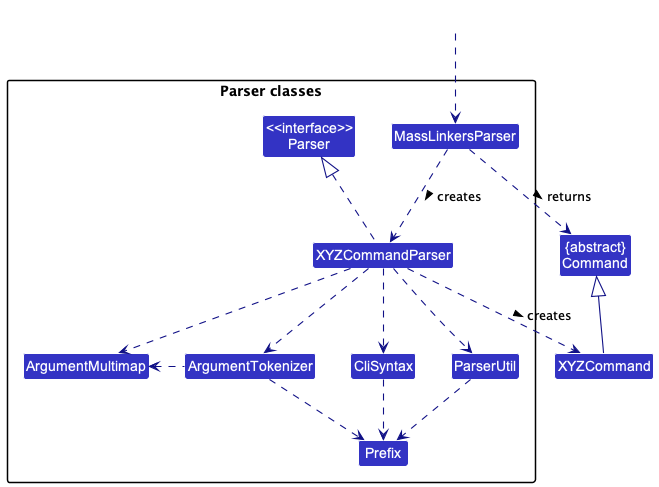
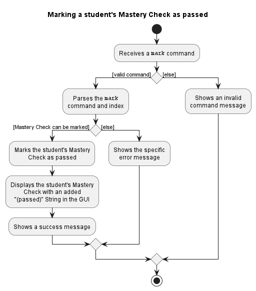

* Table of Contents
{:toc}

--------------------------------------------------------------------------------------------------------------------

## **Acknowledgements**

Third-party libraries and licenses are listed here.

##### Bootstrap 5

Used in User Guide and Developer Guide.

Bootstrap 5.2 license: [https://getbootstrap.com/docs/5.2/about/license/](https://getbootstrap.com/docs/5.2/about/license/)

##### IBM Plex Sans

Font by IBM, used as typeface in FindMyIntern.

IBM Plex Sans Open Font License: [https://github.com/IBM/plex/blob/master/LICENSE.txt](https://github.com/IBM/plex/blob/master/LICENSE.txt)

--------------------------------------------------------------------------------------------------------------------

## **Setting up, getting started**

Refer to the guide [_Setting up and getting started_](SettingUp.md).

--------------------------------------------------------------------------------------------------------------------

## **Design**

:bulb: **Tip:** The `.puml` files used to create diagrams in this document can be found in the [diagrams](https://github.com/AY2223S1-CS2103T-T14-1/tp/tree/master/docs/diagrams) folder. Refer to the [_PlantUML Tutorial_ at se-edu/guides](https://se-education.org/guides/tutorials/plantUml.html) to learn how to create and edit diagrams.

### Architecture

The ***Architecture Diagram*** given above explains the high-level design of the App.

Given below is a quick overview of main components and how they interact with each other.

**Main components of the architecture**

**`Main`** has two classes called [`Main`](https://github.com/AY2223S1-CS2103T-T14-1/tp/blob/master/src/main/java/seedu/address/Main.java) and [`MainApp`](https://github.com/AY2223S1-CS2103T-T14-1/tp/blob/master/src/main/java/seedu/address/MainApp.java). It is responsible for,
* At app launch: Initializes the components in the correct sequence, and connects them up with each other.
* At shut down: Shuts down the components and invokes cleanup methods where necessary.

[**`Commons`**](#common-classes) represents a collection of classes used by multiple other components.

The rest of the App consists of four components.

* [**`UI`**](#ui-component): The UI of the App.
* [**`Logic`**](#logic-component): The command executor.
* [**`Model`**](#model-component): Holds the data of the App in memory.
* [**`Storage`**](#storage-component): Reads data from, and writes data to, the hard disk.

**How the architecture components interact with each other**

The *Sequence Diagram* below shows how the components interact with each other for the scenario where the user issues the command `delete 1`.

Each of the four main components (also shown in the diagram above),

* defines its *API* in an `interface` with the same name as the Component.
* implements its functionality using a concrete `{Component Name}Manager` class (which follows the corresponding API `interface` mentioned in the previous point.

For example, the `Logic` component defines its API in the `Logic.java` interface and implements its functionality using the `LogicManager.java` class which follows the `Logic` interface. Other components interact with a given component through its interface rather than the concrete class (reason: to prevent outside component's being coupled to the implementation of a component), as illustrated in the (partial) class diagram below.

The sections below give more details of each component.

### UI component

The **API** of this component is specified in [`Ui.java`](https://github.com/AY2223S1-CS2103T-T14-1/tp/blob/master/src/main/java/seedu/address/ui/Ui.java)

The UI consists of a `MainWindow` that is made up of parts e.g.`CommandBox`, `ResultDisplay`, `InternshipListPanel`, etc. All these, including the `MainWindow`, inherit from the abstract `UiPart` class which captures the commonalities between classes that represent parts of the visible GUI.

The `UI` component uses the JavaFx UI framework. The layout of these UI parts are defined in matching `.fxml` files that are in the `src/main/resources/view` folder. For example, the layout of the [`MainWindow`](https://github.com/AY2223S1-CS2103T-T14-1/tp/tree/master/src/main/java/seedu/address/ui/MainWindow.java) is specified in [`MainWindow.fxml`](https://github.com/AY2223S1-CS2103T-T14-1/tp/tree/master/src/main/resources/view/MainWindow.fxml)

The `UI` component,

* executes user commands using the `Logic` component.
* listens for changes to `Model` data so that the UI can be updated with the modified data.
* keeps a reference to the `Logic` component, because the `UI` relies on the `Logic` to execute commands.
* depends on some classes in the `Model` component, as it displays `Internship` object residing in the `Model`.

### Logic component

**API** : [`Logic.java`](https://github.com/AY2223S1-CS2103T-T14-1/tp/blob/master/src/main/java/seedu/address/logic/Logic.java)

Here's a (partial) class diagram of the `Logic` component:

How the `Logic` component works:
1. When `Logic` is called upon to execute a command, it uses the `FindMyInternParser` class to parse the user command.
1. This results in a `Command` object (more precisely, an object of one of its subclasses e.g., `AddCommand`) which is executed by the `LogicManager`.
1. The command can communicate with the `Model` when it is executed (e.g. to add an internship).
1. The result of the command execution is encapsulated as a `CommandResult` object which is returned back from `Logic`.

The Sequence Diagram below illustrates the interactions within the `Logic` component for the `execute("delete 1")` API call.

:information_source: **Note:** The lifeline for `DeleteCommandParser` should end at the destroy marker (X) but due to a limitation of PlantUML, the lifeline reaches the end of diagram.

Here are the other classes in `Logic` (omitted from the class diagram above) that are used for parsing a user command:

How the parsing works:
* When called upon to parse a user command, the `FindMyInternParser` class creates an `XYZCommandParser` (`XYZ` is a placeholder for the specific command name e.g., `AddCommandParser`) which uses the other classes shown above to parse the user command and create a `XYZCommand` object (e.g., `AddCommand`) which the `FindMyInternParser` returns back as a `Command` object.
* All `XYZCommandParser` classes (e.g., `AddCommandParser`, `DeleteCommandParser`, ...) inherit from the `Parser` interface so that they can be treated similarly where possible e.g, during testing.

### Model component
**API** : [`Model.java`](https://github.com/AY2223S1-CS2103T-T14-1/tp/blob/master/src/main/java/seedu/address/model/Model.java)

The `Model` component,

* stores the findMyIntern data i.e., all `Internship` objects (which are contained in a `UniqueInternshipList` object).
* stores the currently 'selected' `Internship` objects (e.g., results of a search query) as a separate _filtered_ list which is exposed to outsiders as an unmodifiable `ObservableList<Internship>` that can be 'observed' e.g. the UI can be bound to this list so that the UI automatically updates when the data in the list change.
* stores a `UserPref` object that represents the user’s preferences. This is exposed to the outside as a `ReadOnlyUserPref` objects.
* does not depend on any of the other three components (as the `Model` represents data entities of the domain, they should make sense on their own without depending on other components)

:information_source: **Note:** An alternative (arguably, a more OOP) model is given below. It has a `Tag` list in the `FindMyIntern`, which `Internship` references. This allows `FindMyIntern` to only require one `Tag` object per unique tag, instead of each `Internship` needing their own `Tag` objects. 

### Storage component

**API** : [`Storage.java`](https://github.com/AY2223S1-CS2103T-T14-1/tp/blob/master/src/main/java/seedu/address/storage/Storage.java)

The `Storage` component,
* can save both findMyIntern data and user preference data in json format, and read them back into corresponding objects.
* inherits from both `FindMyInternStorage` and `UserPrefStorage`, which means it can be treated as either one (if only the functionality of only one is needed).
* depends on some classes in the `Model` component (because the `Storage` component's job is to save/retrieve objects that belong to the `Model`)

### Common classes

Classes used by multiple components are in the `seedu.addressbook.commons` package.

--------------------------------------------------------------------------------------------------------------------

## **Implementation**

This section describes some noteworthy details on how certain features are implemented.

* [Add feature](#add-internship-feature)
* [Find feature](#find-internships-from-keywords)
* [Filter feature](#filter-by-applicationstatus-feature)
* [Mark feature](#mark-internship-feature)
* [Sort feature](#sort-internships-feature)

### Add `Internship` feature

#### Implementation

- An `AddCommandParser` class is created, which parses the user input by splitting the input by its prefixes, then returns the relevant `AddCommand`.
- `AddCommand` takes in an `Internship`.
- `Internship` holds the details of the `Internship` that the user wants to add.

When `execute` of `AddCommand` is run, the `Internship` is passed into the model to be added to the Internship list.

The following activity diagram summarizes what happens when a user executes an add command:

#### Design Considerations

- **Adding of internships with same company name:**
  - **Alternative 1:** Do not allow internships with same company name
    - Pros: Only need to check for duplicate company names
    - Cons: Do not allow multiple internships with the same company, even if the applications are for different roles
  - **Alternative 2 (current choice):** Allow internships with same company name if they have different tags
    - Pros: Allow multiple internships with the same company
    - Cons: Need to check for both duplicate company names and duplicate tags

### Find `Internships` from keywords

#### Implementation

- `FindCommandParser` parses the user input by splitting the input by whitespaces.
- The parsed user input, also known as keywords, are then passed to the predicate `ContainsKeywordsPredicate`.
- `FindCommand` then takes in the `ContainsKeywordsPredicate` containing the keywords.
- When `FindCommand#execute(model)` is called, it updates the given model to the `Internship` list where the `Company` or `Tag` matches the keywords.

The Sequence Diagram below illustrates the interactions within the Logic component as explained above.

#### Design Considerations

- Allowing for multiple keywords to show more than 1 specific internship in list
- **Components of `Internship` to be matched**
    - **Alternative 1:** Match all components of `Internship`, e.g. `Description`, `Link`, `Company`, etc.
        - Pros: Better search capability
        - Cons: Less specific internship list
    - **Alternative 2 (current choice):** Only allow for matching of `Company` and `Tag`
        - Pros: More logical search (A typical search would consist of roles or company name)
        - Cons: May not be what users want to search
- **Matching of keywords:**
  - **Alternative 1:** Only allows full word match
      - Pros: More specific internship list
      - Cons: Require typing full name of company or tag
  - **Alternative 2 (current choice):** Allows partial word match
      - Pros: Allow quick searching for company or tag
      - Cons: Less specific internship list

### Filter by `ApplicationStatus` feature

#### Implementation

`FilterCommand` was implemented similar to how `FindCommand` was implemented.
* A `FilterCommandParser` object is created, which parses the user input by passing it to `ApplicationStatus`, then returns the relevant `FilterCommand`.
* `FilterCommand` takes in a `InternshipHasApplicationStatusPredicate`.
* `InternshipHasApplicationStatusPredicate` implements `Predicate<Internship>`, and holds the `ApplicationStatus` that the user is filtering for.

When `execute` of `FilterCommand` is run, the `InternshipHasApplicationStatusPredicate` is passed into the model to filter the Internship list. 

The following activity diagram summarizes what happens when a user executes a filter command:

#### Design Considerations

* The implementation is similar to `FindCommand` as both have the same idea of filtering/finding something in the list.
* The model already supports filtering for a certain predicate, therefore it is only intuitive that `FilterCommand` would make use of this functionality, just like how `FindCommand` would.
* This implementation would allow easy extension should there be more `ApplicationStatus` added, since parsing of user input is done by `ApplicationStatus`.

### Mark `Internship` feature

#### Implementation

`MarkCommand` was implemented similar to how `EditCommand` was implemented.
* A `MarkCommandParser` object is created, which parses the user input by splitting the input by `PREFIX_APPLICATION_STATUS`, then returns the relevant `MarkCommand`.
* `MarkCommand` takes in an `index` and `applicationStatus`.
  
When `execute` of `MarkCommand` is run, a new `Internship` object with the updated `applicationStatus` is created, with all other fields unchanged. 
* The new `Internship` is passed into the model to be updated.

The following activity diagram summarizes what happens when a user executes a mark command.

#### Design Considerations
- The new `applicationStatus` must be different from the existing one for it to be updated.
- **Types of `applicationStatus`:**
  - **Alternative 1:** Allow any user input as `applicationStatus`
    * Pros: Variation of `applicationStatus` is not limited
    * Cons: Impossible to implement filter by `ApplicationStatus`
    feature
  - **Alternative 2 (current choice)**: Have a fixed set of `applicationStatus` that can be passed in
    - Pros: Allow easy filtering by `ApplicationStatus`
    - Cons: Fixed variation of `applicationStatus`

### Sort `Internships` feature
	
#### Implementation

`ModelManager` provides a `FilteredList` that is stored as an `ObservableList`.
`InternshipListPanel` stores this `ObservableList` to display the list of internship applications to the user.
- In order to sort the list of applications, we wrap the `FilteredList` as a `SortedList` in `ModelManager` 
before returning it as the `ObservableList`.
- This allows ModelManager to accept a `Comparator` using the method `updateSortedInternshipList` 
and update the `Comparator` of the `SortedList`.
- The `SortedList` will then be sorted according to the `Comparator` provided and the `ObservableList` will display the 
internship applications in the sorted order.

The following sequence diagram illustrates how the list is updated when the user enters the `sort applied` command:

#### Design Considerations

- Display internships in a reverse chronological order to easily refer to recent applications	
- **Storing the list of internship applications**:
    - **Alternative 1:** Update the stored internship list according to the sort criteria
        - Pros: Easily view in sorted order without having to re-type sort command
        - Cons: Not able to view original order once sorted
    - **Alternative 2 (current choice):** Maintain the stored list according to the order it was added by user
        - Pros: Allow user to view internship applications in the original order it was added 
        - Cons: Have to re-enter the sort command when the reopens the application

--------------------------------------------------------------------------------------------------------------------

## **Documentation, logging, testing, configuration, dev-ops**

* [Documentation guide](Documentation.md)
* [Testing guide](Testing.md)
* [Logging guide](Logging.md)
* [Configuration guide](Configuration.md)
* [DevOps guide](DevOps.md)

--------------------------------------------------------------------------------------------------------------------

## **Appendix: Requirements**

### Product scope

**Target user profile**:

* has a need to manage a significant number of internship applications
* prefer desktop apps over other types
* can type fast
* prefers typing to mouse interactions
* is reasonably comfortable using CLI apps

**Value proposition**: convenient and user-friendly app to manage and keep track of internship applications

### User stories

Priorities: High (must have) - `* * *`, Medium (nice to have) - `* *`, Low (unlikely to have) - `*`

| Priority | As a …       | I want to …                                                                    | So that I can…                                                   |
|----------|--------------|--------------------------------------------------------------------------------|------------------------------------------------------------------|
| `* * *`  | new user     | utilise the help function                                                      | see the instructions on how to use the app                       |
| `* * *`  | busy student | add internship applications quickly using CLI                                  | have more time for other things                                  |
| `* * *`  | student      | mark the internship as rejected, interviewed, applied or rejected              | know the status of the internship application                    |
| `* * *`  | user         | edit an internship application                                                 | update the details of an internship application                  |
| `* * *`  | user         | automatically save any edits made                                              | save edits even if I accidentally close the app                  |
| `* *`    | user         | add a short description of the internship                                      | know what the role is about                                      |
| `* *`    | busy student | view the interview date of each internship application                         | better manage my time and prepare accordingly                    |
| `* *`    | student      | add the link of the internship posting                                         | refer to the internship posting when preparing for interview     |
| `* *`    | lazy student | search for a specific internship using keywords                                | get matching results more quickly                                |
| `* *`    | student      | filter the internships that I have applied to by application status            | easily view the statuses of my applications                      |
| `* *`    | student      | sort the internships based on a sort criteria (applied date or interview date) | easily view my applications in a reverse chronological order     |
| `* *`    | user         | clear all internship applications                                              | focus on my applications for a new internship application period |

*{More to be added}*

### Use cases

(For all use cases below, the **System** is `FindMyIntern` and the **Actor** is the `user` unless specified otherwise)

**Use Case: UC1 - Add internship application to the tracker**

**MSS**:
1. User wants to add an internship application to the tracker.
2. User enters the details for the internship application.
3. FindMyIntern adds the new internship application into the tracker.

   Use case ends.

**Extensions**:
* 2a. User enters the details in the wrong format.
  * 2a1. FindMyIntern shows an error message.
  
    Use case ends.
* 2b. Details entered match an existing internship.
  * 2b1. FindMyIntern shows an error message.

    Use case ends.

 

**Use Case: UC2 - Edit an internship application**

**MSS**:
1. User requests to edit an internship application in the tracker.
2. FindMyIntern updates the details of the internship application in the tracker.

   Use case ends.

**Extensions**:
* 2a. User enters an invalid index.
    * 2a1. FindMyIntern shows an error message.

      Use case ends.

* 2b. User enters the details in the wrong format.
    * 2b1. FindMyIntern shows an error message.

      Use case ends.

 

**Use Case: UC3 - Mark status of internship application**

**MSS**:
1. User requests to mark the status of a specific internship application in the tracker.
2. FindMyIntern updates the internship application to the status.
   Use case ends.

**Extensions**:
* 2a. User enters the details in the wrong format.
  * 2a1. FindMyIntern shows an error message.
  
    Use case ends.

 

**Use Case: UC4 - Find internship applications using keywords**

**MSS**:
1. User wants to find internship applications stored in the tracker.
2. User enters the keywords for the search.
3. FindMyIntern shows a list of internship applications that match the keywords.
   
   Use case ends.

**Extensions**:
* 2a. User enters the details in the wrong format.
  * 2a1. FindMyIntern shows an error message.

    Use case ends.
  
* 3a. There were no internship applications that matched the keywords.
  * 3a1. FindMyIntern shows an empty list.
    Use case ends.

 

**Use Case: UC5 - Filter internship applications by application status**

**MSS**:
1. User wants to filter internship applications by application status.
2. User enters the desired application status.
3. FindMyIntern shows a list of internship applications with the desired application status.

   Use case ends.

**Extensions**:
* 2a. User enters the details in the wrong format.
  * 2a1. FindMyIntern shows an error message.

    Use case ends.
  
* 3a. There were no internship applications that contained the desired application status.
  * 3a1. FindMyIntern shows an empty list.

    Use case ends.

**Use Case: UC6 - Sort internship applications by sort criteria**

**MSS**:
1. User wants to sort internship applications by sort criteria.
2. User enters the desired sort criteria (applied or interview).
3. FindMyIntern shows a list of internship applications sorted by the desired sort criteria.

   Use case ends.

**Extensions**:
* 2a. User enters the details in the wrong format.
    * 2a1. FindMyIntern shows an error message.

      Use case ends.
    
* 3a. There were no internship applications that could be sorted by the sort criteria (interview).
    * 3a1. FindMyIntern shows the list of internship applications in the original order.

      Use case ends.

### Non-Functional Requirements

1.  Should work on any _mainstream OS_ as long as it has Java `11` or above installed.
2.  Should be able to hold up to 1000 internship applications without a noticeable sluggishness in performance for typical usage.
3.  A user with above average typing speed for regular English text (i.e. not code, not system admin commands) should be able to accomplish most of the tasks faster using commands than using the mouse.

*{More to be added}*

### Glossary

* **Mainstream OS**: Windows, Linux, Unix, OS-X

--------------------------------------------------------------------------------------------------------------------

## **Appendix: Instructions for manual testing**

Given below are instructions to test the app manually.

:information_source: **Note:** These instructions only provide a starting point for testers to work on;
testers are expected to do more *exploratory* testing.

### Launch and shutdown

1. Initial launch

   1. Download the jar file and copy into an empty folder

   1. Double-click the jar file 
      Expected: Shows the GUI with a set of sample internship applications. The window size may not be optimal.

1. Saving window preferences

   1. Resize the window to an optimal size. Move the window to a different location. Close the window.

   1. Re-launch the app by double-clicking the jar file. 
      Expected: The most recent window size and location is retained.

1. _{ more test cases …​ }_

### Deleting an internship

1. Deleting an internship while all internships are being shown

   1. Prerequisites: List all internships using the `list` command. Multiple internships in the list.

   1. Test case: `delete 1` 
      Expected: First internship application is deleted from the list. Details of the deleted internship application shown in the status message.

   1. Test case: `delete 0` 
      Expected: No internship application is deleted. Error details shown in the status message.

   1. Other incorrect delete commands to try: `delete`, `delete x`, `...` (where x is larger than the list size) 
      Expected: Similar to previous.

1. _{ more test cases …​ }_

### Saving data

1. Dealing with missing/corrupted data files

   1. _{explain how to simulate a missing/corrupted file, and the expected behavior}_

1. _{ more test cases …​ }_
