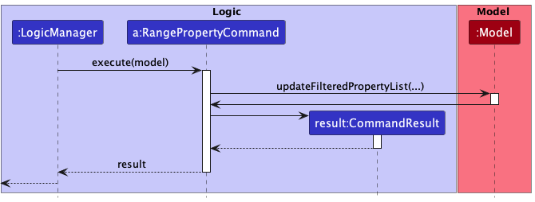
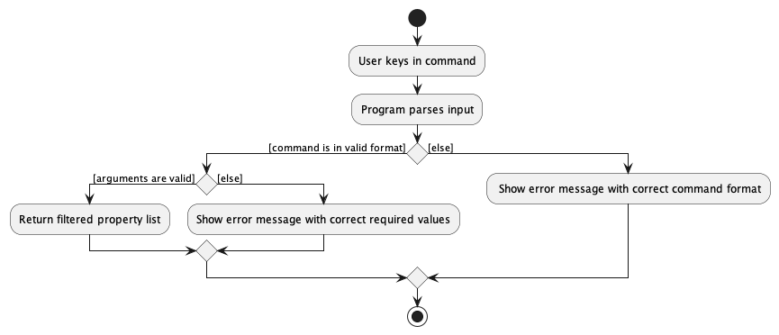
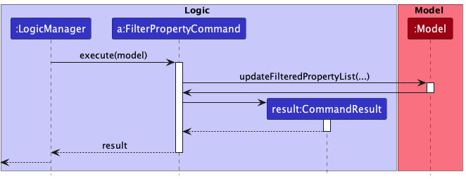
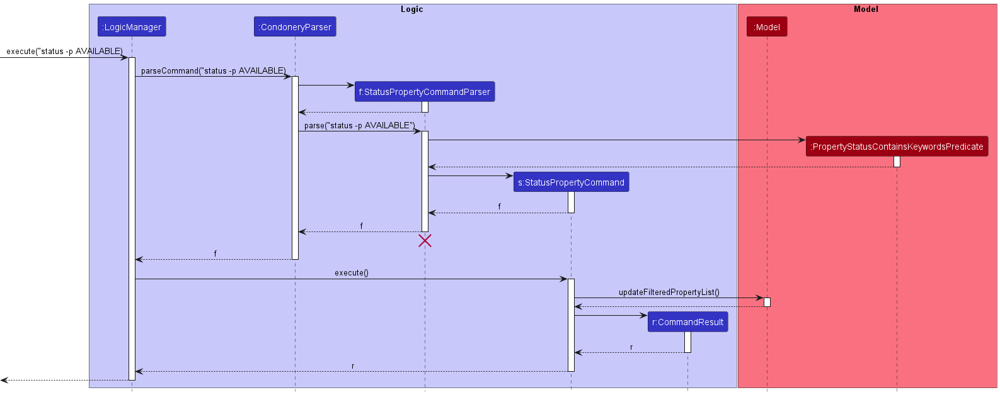
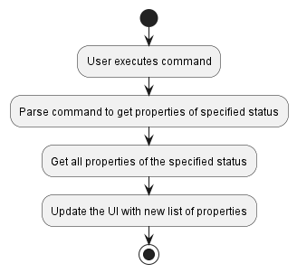

* Table of Contents
{:toc}

--------------------------------------------------------------------------------------------------------------------

## **Acknowledgements**

* Our Condonery Project is morphed from [SE-Education's AddressBook3](https://se-education.org/addressbook-level3/)

--------------------------------------------------------------------------------------------------------------------

## **Setting up, getting started**

Refer to the guide [_Setting up and getting started_](SettingUp.md).

--------------------------------------------------------------------------------------------------------------------

## **Design**

<div markdown="span" class="alert alert-primary">

:bulb: **Tip:** The `.puml` files used to create diagrams in this document can be found in the [diagrams](https://github.com/se-edu/addressbook-level3/tree/master/docs/diagrams/) folder. Refer to the [_PlantUML Tutorial_ at se-edu/guides](https://se-education.org/guides/tutorials/plantUml.html) to learn how to create and edit diagrams.
</div>

### Architecture


The ***Architecture Diagram*** given above explains the high-level design of the App.

Given below is a quick overview of main components and how they interact with each other.

**Main components of the architecture**

**`Main`** has two classes called [`Main`](https://github.com/AY2223S1-CS2103-W14-1/tp/blob/master/src/main/java/seedu/condonery/Main.java) and [`MainApp`](https://github.com/AY2223S1-CS2103-W14-1/tp/blob/master/src/main/java/seedu/condonery/MainApp.java). It is responsible for,
* At app launch: Initializes the components in the correct sequence, and connects them up with each other.
* At shut down: Shuts down the components and invokes cleanup methods where necessary.

[**`Commons`**](#common-classes) represents a collection of classes used by multiple other components.

The rest of the App consists of four components.

* [**`UI`**](#ui-component): The UI of the App.
* [**`Logic`**](#logic-component): The command executor.
* [**`Model`**](#model-component): Holds the data of the App in memory.
* [**`Storage`**](#storage-component): Reads data from, and writes data to, the hard disk.


**How the architecture components interact with each other**

The *Sequence Diagram* below shows how the components interact with each other for the scenario where the user issues the command `delete -p 1`.


Each of the four main components (also shown in the diagram above),

* defines its *API* in an `interface` with the same name as the Component.
* implements its functionality using a concrete `{Component Name}Manager` class (which follows the corresponding API `interface` mentioned in the previous point.

For example, the `Logic` component defines its API in the `Logic.java` interface and implements its functionality using the `LogicManager.java` class which follows the `Logic` interface. Other components interact with a given component through its interface rather than the concrete class (reason: to prevent outside component's being coupled to the implementation of a component), as illustrated in the (partial) class diagram below.


The sections below give more details of each component.

### UI component

The **API** of this component is specified in [`Ui.java`](https://github.com/se-edu/addressbook-level3/tree/master/src/main/java/seedu/address/ui/Ui.java)


The UI consists of a `MainWindow` that is made up of parts e.g.`CommandBox`, `ResultDisplay`, `PropertyListPanel`, `StatusBarFooter` etc. All these, including the `MainWindow`, inherit from the abstract `UiPart` class which captures the commonalities between classes that represent parts of the visible GUI.

The `UI` component uses the JavaFx UI framework. The layout of these UI parts are defined in matching `.fxml` files that are in the `src/main/resources/view` folder. For example, the layout of the [`MainWindow`](https://github.com/AY2223S1-CS2103-W14-1/tp/blob/master/src/main/java/seedu/condonery/ui/MainWindow.java) is specified in [`MainWindow.fxml`](https://github.com/AY2223S1-CS2103-W14-1/tp/blob/master/src/main/resources/view/MainWindow.fxml)

The `UI` component,

* executes user commands using the `Logic` component.
* listens for changes to `Model` data so that the UI can be updated with the modified data.
* keeps a reference to the `Logic` component, because the `UI` relies on the `Logic` to execute commands.
* depends on some classes in the `Model` component, as it displays `Property` and 'Client' objects residing in the `Model`.
* The UI also depends on UserPrefs to determine where to store images uploaded by the user.

### Logic component

**API** : [`Logic.java`](https://github.com/AY2223S1-CS2103-W14-1/tp/blob/master/src/main/java/seedu/condonery/logic/Logic.java)

Here's a (partial) class diagram of the `Logic` component:


How the `Logic` component works:
1. When `Logic` is called upon to execute a command, it uses the `CondoneryParser` class to parse the user command.
1. This results in a `Command` object (more precisely, an object of one of its subclasses e.g., `AddPropertyCommand`) which is executed by the `LogicManager`.
1. The command can communicate with the `Model` when it is executed (e.g. to add a property).
1. The result of the command execution is encapsulated as a `CommandResult` object which is returned back from `Logic`.

The Sequence Diagram below illustrates the interactions within the `Logic` component for the `execute("delete -p 1")` API call.


<div markdown="span" class="alert alert-info">:information_source: **Note:** The lifeline for `DeletePropertyCommandParser` should end at the destroy marker (X) but due to a limitation of PlantUML, the lifeline reaches the end of diagram.
</div>

Here are the other classes in `Logic` (omitted from the class diagram above) that are used for parsing a user command:


How the parsing works:
* When called upon to parse a user command, the `CondoneryParser` class creates an `XYZCommandParser` (`XYZ` is a placeholder for the specific command name e.g., `AddPropertyCommandParser`) which uses the other classes shown above to parse the user command and create a `XYZCommand` object (e.g., `AddPropertyCommand`) which the `CondoneryParser` returns back as a `Command` object.
* All `XYZCommandParser` classes (e.g., `AddPropertyCommandParser`, `DeletePropertyCommandParser`, ...) inherit from the `Parser` interface so that they can be treated similarly where possible e.g, during testing.

### Model component
**API** : [`Model.java`](https://github.com/AY2223S1-CS2103-W14-1/tp/blob/master/src/main/java/seedu/condonery/model/Model.java)


The `Model` component,

* stores the address book data i.e., all `Property` and `Client` objects (which are contained in `UniquePropertyList` and `UniqueClientList` objects respectively).
* stores the currently 'selected' `Property` objects (e.g., results of a search query) as a separate _filtered_ list which is exposed to outsiders as an unmodifiable `ObservableList<Property>` that can be 'observed' e.g. the UI can be bound to this list so that the UI automatically updates when the data in the list change.
* stores a `UserPref` object that represents the user’s preferences. This is exposed to the outside as a `ReadOnlyUserPref` objects.
* does not depend on any of the other three components (as the `Model` represents data entities of the domain, they should make sense on their own without depending on other components)

<div markdown="span" class="alert alert-info">:information_source: **Note:** An alternative (arguably, a more OOP) model is given below. It has a `Tag` list in the `PropertyDirectory`, which `Property` references. This allows `PropertyDirectory` to only require one `Tag` object per unique tag, instead of each `Property` needing their own `Tag` objects.<br>


</div>


### Storage component

**API** : [`Storage.java`](https://github.com/AY2223S1-CS2103-W14-1/tp/blob/master/src/main/java/seedu/condonery/storage/Storage.java)


The `Storage` component,
* can save both address book data and user preference data in json format, and read them back into corresponding objects.
* inherits from `PropertyDirectoryStorage`, `ClientDirectoryStorage`, and `UserPrefStorage`, which means it can be treated as any one (if only the functionality of only one is needed).
* depends on some classes in the `Model` component (because the `Storage` component's job is to save/retrieve objects that belong to the `Model`)

### Common classes

Classes used by multiple components are in the `seedu.condonery.commons` package.

--------------------------------------------------------------------------------------------------------------------

## **Implementation**

This section describes some noteworthy details on how certain features are implemented.

### Select property/client feature

The select feature is meant to expand on either a `Property` or a `Client` to display its details in the GUI. Importantly, a `Property` can hold a list of interested clients and a `Client` can hold a list of properties that the client is interested in. Depending on if a `Property` or `Client` is selected, the GUI changes to show just the selected `Property`/`Client` in its respective tab, and its interested clients/intersted properties in the other tab. The select command is as follows:
```
select -[pc] [INDEX]
```
The compulsory input `INDEX` would correspond to the current displayed list in the GUi.
Examples of usage:
* `select -p 2`
* `select -c 10`


### Range feature

The range feature allows the user to filter properties by a price range in Condonery.

The feature is activated by the command pattern `range -p l/[lower] u/[upper]`.

**Parsing of command within the `Logic` component**

Much like the other core features, we introduced an intermediate between `CondoneryParser` and the range command parser,
that is the `RangePropertyCommandParser`.

These are the steps that will be taken when parsing a range command:

1. The `CondoneryParser` checks if the user command is a range command. Then it creates a `RangePropertyCommandParser`.
2. The `RangePropertyCommandParser` which implements the `Parser` interface, parses the command via `Parser#parse`.
3. If the user command is valid, the parser creates the corresponding `Command` object for execution.

Given below is a sequence diagram for interactions inside the Logic component for the `execute(range -p l/<LOWER> u/<UPPER>`
API call. Note that the command (e.g., `range -p l/100,000 u/500,000`)is truncated for brevity.


**Execution of command within the `Logic` component**

When a `RangePropertyCommand` is created by the `RangePropertyCommandParser`, it is executed with `model` passed in
as the parameter.

Firstly, the `updateFilteredPropertyList` is called to get the list of properties within the specified price range.

Next, a `CommandResult` object containing the message to be displayed to the user is returned to `LogicManager`.



**Error handling within the `Logic` component**

The below activity diagram shows the overall process of execution of `execute(range -p l/100 u/200)`.

In order to ensure data cleanliness and that the inputs by the users are valid, errors are thrown at various stages if:

- Incorrect command format is used (e.g. missing price as argument, missing prefixes)
- Arguments are invalid (e.g. negative prices)



**Design consideration**

Aspect: How to filter properties by prices

- **Alternative 1** (current choice): Add a lower and upper prefix to command phrase to indicate lower and upper bound.
    - Pros:
      - Less time-consuming to implement.
      - Easier to parse price range.
    - Cons:
      - Imposes strict requirement on use of lower and upper prefixes.
- **Alternative 2**: Allow user to key in two separate integers in command.
  - Pros:
    - Easy and fairly intuitive user input system
  - Cons:
    - More time-consuming to implement.
    - Need extra checking to correctly parse two separate integers and identify lower and upper bounds.
    - More prone to manual user entry error.

Alternative 1 was chosen to enable more efficient parsing of commands.

### Filter feature

The filter feature returns a list of properties whose tags contain any of the given keywords.

The feature is activated by the command pattern `filter -p TAG [MORE_TAGS]`.

**Parsing of command within the `Logic` component**

Much like the other core features, we introduced an intermediate between `CondoneryParser` and the filter command parser,
that is the `FilterPropertyCommandParser`.

These are the steps that will be taken when parsing a range command:

1. The `CondoneryParser` checks if the user command is a filter command. Then it creates a `FilterPropertyCommandParser`.
2. The `FilterPropertyCommandParser` which implements the `Parser` interface, parses the command via `Parser#parse`.
3. If the user command is valid, the parser creates the corresponding `Command` object for execution.

Given below is a sequence diagram for interactions inside the Logic component for the `execute(range -p l/<LOWER> u/<UPPER>`
API call. Note that the command (e.g., `filter -p High-end Luxury` is truncated for brevity.


**Execution of command within the `Logic` component**

When a `FilterPropertyCommand` is created by the `FilterPropertyCommandParser`, it is executed with `model` passed in
as the parameter.

Firstly, the `updateFilteredPropertyList` is called to get the list of properties whose tags match any of the given arguments.

Next, a `CommandResult` object containing the message to be displayed to the user is returned to `LogicManager`.



**Error handling within the `Logic` component**

The below activity diagram shows the overall process of execution of `execute(range -p l/100 u/200`.

In order to ensure data cleanliness and that the inputs by the users are valid, errors are thrown at various stages if:

- Incorrect command format is used (e.g. missing tag argument)


### Filter by Property Status Feature [Yue Hern]
This feature allows users to filter properties by `PropertyStatusEnum`. 

The feature is activated by the command patter `status -p [property_status]`

**Parsing of command within the Logic component**

This command uses the `StatusPropertyCommandParser` to parse the command.

These are the steps that will be taken when parsing a range command:

1. The `CondoneryParser` checks if the user command is a range command. Then it creates a `StatusPropertyCommandParser`.
2. The `StatusPropertyCommandParser` which implements the `Parser` interface, parses the command via `Parser#parse`.
3. If the user `command` is valid, the parser creates the corresponding `Command` object for execution.



**Execution of command within the Logic component**

When a `StatusPropertyCommand` is created by the `StatusPropertyCommandParser`, it is executed with model passed in as the parameter.

Firstly, the `updateFilteredPropertyList` is called to get the list of properties within the specified price range.

Next, a `CommandResult` object containing the message to be displayed to the user is returned to `LogicManager`.

**Error handling within the Logic component**



**Design consideration**

Aspect: Input format for `StatusPropertyCommand`

- **Alternative 1** (current choice): Accept both lower and upper case for `StatusPropertyCommand` argument
(e.g. accept both `status -p available` and `status -p AVAILABLE` inputs)
  - Pros: 
    - Less prone to error for the user
    - More intuitive for the user
  - Cons:
    - Format be confusing for user
- **Alternative 2**: Only accept upper case input for `StatusPropertyCommand`
  - Cons:
    - More prone to error
    - User has to follow case, which can be troublesome

- Alternative 1 was chosen because of its ease of use, more intuitive, and less error-prone reasons.


### Commands

#### \[Proposed\] Search Command

#### Proposed Implementation

The proposed search command allows the user to search for a particular `Property`. It is facilitated by `SearchCommand`.
It extends the `Command` class.

Users can specify if they want to perform the search for a `Property` or `Client` with the following
options

1. `-p` Search for a particular property with matching keywords
2. `-c` Search for a particular client with matching keywords

#### Parsing of commands within the `Logic` component

The parsing of commands begins once the `LogicManager` receives and tries to execute the user input.

To parse the different commands in our application, we have individual command parsers for the different commands
(e.g. `EditCommandParser`).

The steps taken when parsing a search command are as follows:

1. The `SearchCommandParser` will check what type (`Property` or `Client`) the search is for
and create the corresponding parser
   1. `search -p` will create the command: `SearchPropertyCommand`
   2. `search -c` will create the command: `SearchClientCommand`
3. The respective parsers all implement the `Parser` interface, and the `Parser#parse` method will then be called.

#### Design Considerations:

- Create a `SearchCommand` class

### User Uploaded Images [Haoren]

The application allows users to upload their own images for Property and Client models. By default, the images are stored
in `data/images`, but users can specify their custom directory in `preferences.json`.

The Image object is not initialized until the PropertyCard/ClientCard of the UI is rendered. This is to save memory
consumption and rely on the Lazy Loading of Observable List. We need to inject the UserPrefs into the Property/Client
models in order to determine the location to source for the uploaded images.

### \[Proposed\] Undo/redo feature

#### Proposed Implementation

The proposed undo/redo mechanism is facilitated by `VersionedAddressBook`.
It extends `AddressBook` with an undo/redo history, stored internally as an `addressBookStateList` and `currentStatePointer`.
Additionally, it implements the following operations:

* `VersionedAddressBook#commit()` — Saves the current address book state in its history.
* `VersionedAddressBook#undo()` — Restores the previous address book state from its history.
* `VersionedAddressBook#redo()` — Restores a previously undone address book state from its history.

These operations are exposed in the `Model` interface as `Model#commitAddressBook()`, `Model#undoAddressBook()` and `Model#redoAddressBook()` respectively.

Given below is an example usage scenario and how the undo/redo mechanism behaves at each step.

Step 1. The user launches the application for the first time. The `VersionedAddressBook` will be initialized with the initial address book state, and the `currentStatePointer` pointing to that single address book state.


Step 2. The user executes `delete 5` command to delete the 5th person in the address book. The `delete` command calls `Model#commitAddressBook()`, causing the modified state of the address book after the `delete 5` command executes to be saved in the `addressBookStateList`, and the `currentStatePointer` is shifted to the newly inserted address book state.


Step 3. The user executes `add n/David …​` to add a new person. The `add` command also calls `Model#commitAddressBook()`, causing another modified address book state to be saved into the `addressBookStateList`.


<div markdown="span" class="alert alert-info">:information_source: **Note:** If a command fails its execution, it will not call `Model#commitAddressBook()`, so the address book state will not be saved into the `addressBookStateList`.

</div>

Step 4. The user now decides that adding the person was a mistake, and decides to undo that action by executing the `undo` command. The `undo` command will call `Model#undoAddressBook()`, which will shift the `currentStatePointer` once to the left, pointing it to the previous address book state, and restores the address book to that state.


<div markdown="span" class="alert alert-info">:information_source: **Note:** If the `currentStatePointer` is at index 0, pointing to the initial AddressBook state, then there are no previous AddressBook states to restore. The `undo` command uses `Model#canUndoAddressBook()` to check if this is the case. If so, it will return an error to the user rather
than attempting to perform the undo.

</div>

The following sequence diagram shows how the undo operation works:


<div markdown="span" class="alert alert-info">:information_source: **Note:** The lifeline for `UndoCommand` should end at the destroy marker (X) but due to a limitation of PlantUML, the lifeline reaches the end of diagram.

</div>

The `redo` command does the opposite — it calls `Model#redoAddressBook()`, which shifts the `currentStatePointer` once to the right, pointing to the previously undone state, and restores the address book to that state.

<div markdown="span" class="alert alert-info">:information_source: **Note:** If the `currentStatePointer` is at index `addressBookStateList.size() - 1`, pointing to the latest address book state, then there are no undone AddressBook states to restore. The `redo` command uses `Model#canRedoAddressBook()` to check if this is the case. If so, it will return an error to the user rather than attempting to perform the redo.

</div>

Step 5. The user then decides to execute the command `list`. Commands that do not modify the address book, such as `list`, will usually not call `Model#commitAddressBook()`, `Model#undoAddressBook()` or `Model#redoAddressBook()`. Thus, the `addressBookStateList` remains unchanged.


Step 6. The user executes `clear`, which calls `Model#commitAddressBook()`. Since the `currentStatePointer` is not pointing at the end of the `addressBookStateList`, all address book states after the `currentStatePointer` will be purged. Reason: It no longer makes sense to redo the `add n/David …​` command. This is the behavior that most modern desktop applications follow.


The following activity diagram summarizes what happens when a user executes a new command:


#### Design considerations:

**Aspect: How undo & redo executes:**

* **Alternative 1:** Saves the initial PropertyDirectory and ClientDirectory on initialization. Store all commands in
CommandQueue and re-executes _n - 1_ commands on undo.
    * Pros: Easy to implement. Less memory usage
    * Cons: Might make undo command less responsive, depending on complexity of commands.
* **Alternative 2:** Saves the entire address book.
    * Pros: Easy to implement.
    * Cons: May have performance issues in terms of memory usage.

* **Alternative 3:** Individual command knows how to undo/redo by
  itself.
    * Pros: Will use less memory (e.g. for `delete`, just save the person being deleted).
    * Cons: We must ensure that the implementation of each individual command are correct.

_{more aspects and alternatives to be added}_

### \[Proposed\] Data archiving

_{Explain here how the data archiving feature will be implemented}_


--------------------------------------------------------------------------------------------------------------------

## **Documentation, logging, testing, configuration, dev-ops**

* [Documentation guide](Documentation.md)
* [Testing guide](Testing.md)
* [Logging guide](Logging.md)
* [Configuration guide](Configuration.md)
* [DevOps guide](DevOps.md)

--------------------------------------------------------------------------------------------------------------------

## **Appendix: Requirements**

### Product scope

***Target user profile**:

* middle-aged property agent selling new condos to prospective clients
* has a need to manage a significant number of property listings and clients
* prefer desktop apps over other types
* can type fast
* prefers typing to mouse interactions
* is reasonably comfortable using CLI apps

**Value proposition**: manage property listings and clients faster than a typical mouse/GUI driven app


### User stories

Priorities: High (must have) - `* * *`, Medium (nice to have) - `* *`, Low (unlikely to have) - `*`

| Priority | As a …​                                            | I want to …​               | So that I can…​                                                              |
| -------- |----------------------------------------------------|----------------------------|------------------------------------------------------------------------------|
| `* * *`  | new user                                           | see usage instructions     | refer to instructions when I forget how to use the App                       |
| `* * *`  | property agent                                     | add a new property listing |                                                                              |
| `* * *`  | property agent                                     | delete a property listing  | remove entries that I no longer need                                         |
| `* * *`  | property agent                                     | find a listing by name     | locate details of listings without having to go through the entire list      |
| `* *`    | property agent                                     | edit listing details       | update details of listings                                                   |
| `*`      | property agent with many listings in the directory | sort listings by price cap | locate a listing within budget without haveing to go through the entire list |

*{More to be added}*

### Use cases

(For all use cases below, the **System** is the `Condonery` and the **Actor** is the `use

**Use case: Delete a listing**

**MSS**

1.  User requests to list property
2.  Condonery shows a list of properties
3.  User requests to delete a specific property in the list
4.  Condonery deletes the person

    Use case ends.

**Extensions**

* 2a. The list is empty.

  Use case ends.

* 3a. The given index is invalid.

    * 3a1. Condonery shows an error message.

      Use case resumes at step 2.

*{More to be added}*

### Non-Functional Requirements

1. Should work on any _mainstream OS_ as long as it has Java `11` or above installed.
2. Should be able to hold up to 1000 persons without a noticeable sluggishness in performance for typical usage.
3. A user with above average typing speed for regular English text (i.e. not code, not system admin commands) should be able to accomplish most of the tasks faster using commands than using the mouse.
4. Should work on 32-bit and 64-bit environments.
5. Should work without an internet connection

*{More to be added}*

### Glossary

* **Mainstream OS**: Windows, Linux, Unix, OS-X
* **Contact**: A client of the app user
* **Private contact detail**: A contact detail that is not meant to be shared with others

--------------------------------------------------------------------------------------------------------------------

## **Appendix: Instructions for manual testing**

Given below are instructions to test the app manually.

<div markdown="span" class="alert alert-info">:information_source: **Note:** These instructions only provide a starting point for testers to work on;
testers are expected to do more *exploratory* testing.

</div>

### Launch and shutdown

1. Initial launch

    1. Download the jar file and copy into an empty folder

    1. Double-click the jar file Expected: Shows the GUI with a set of sample contacts. The window size may not be optimum.

2. Saving window preferences

    1. Resize the window to an optimum size. Move the window to a different location. Close the window.

    1. Re-launch the app by double-clicking the jar file.<br>
       Expected: The most recent window size and location is retained.

3. Sample Data
   1. Sample Data for both Properties and Clients should be shown
   2. User can choose to either clear the data with `clear -p` and `clear -c` respectively, or use the existing data to test the app.

### Create, Read, Update and Delete Properties

2. Creating a new property
   1. Prerequisites: The user should prepare an image to upload, in `.png` or `.jpg` file format. 
   2. Test case: `add -p n/Test Property a/Test Property Address p/100,000 h/HDB -i`<br>
      Expected: The application should show a FileChooser, prompting the user to upload an image of their property. You may upload any image you like to test, or close the FileChooser if you do not have an image ready.
   3. Test case: `add -p n/Test Property a/Test Property Address p/Invalid Price h/HDB`<br>
      Expected: No property is added. Error details shown in the status message for Invalid Price.

3. Deleting a property while all properties are being shown
    1. Prerequisites: List all properties using the `list -p` command. Multiple properties in the list.

    1. Test case: `delete -p 1`<br>
       Expected: First property is deleted from the list. Details of the deleted property shown in the status message. Timestamp in the status bar is updated.

    1. Test case: `delete -p 0`<br>
       Expected: No property is deleted. Error details shown in the status message. Status bar remains the same.

    1. Other incorrect delete commands to try: `delete`, `delete x`, `...` (where x is larger than the list size)<br>
       Expected: Similar to previous.

4. Editing a property while all properties are being shown
    1. Prerequisites: List all properties using the `list -p` command. Multiple properties in the list.
    2. Test case: `edit -p 1 n/New name`<br>
       Expected: First property in the list is updated with a new name. If the property initially had an image, the image should remain the same.
    3. Test case: `edit -p 1`
       Expected: No property is edited, Error details shown in the status message as user did not change any fields.
  
### Saving data

1. Dealing with missing/corrupted data files

    1. _{explain how to simulate a missing/corrupted file, and the expected behavior}_

2. _{ more test cases …​ }_
 
## **Appendix: Effort**
Majority of the complexity faced in building our app came from dealing with multiple entities, namely Property and Client.
Our group faced trouble in implementing a 2-way association between Clients and Properties. 

* For example, editing a `Client` with an association should update all references to the `Client`. As previously AB3 relied on an immutable implementation of editing entities, we had to do heavy testing to make sure that the information between all associations are synced.
* Moreover, we had to ensure that storage of the 2-way association is feasible. Currently, our `Property` entities store a list of Interested Clients. Along the way, we realised that we are unable to store a list of Properties in a `Client` entity, as this resulted in our serialised storage being circular. We had to change a lot of our code to fix this, as we realised our previous implementation could not handle the storage requirement.

Our group also tried to implement image storage for user's to upload their own pictures of Properties/Clients
Here are some design considerations we had to deal with:
* Initially, we wanted our `Logic` layer to handle the image uploading command. However, we soon realised this was unfeasible we as needed user input through the `Ui` layer, as we had to show a File Chooser, and only then handle the checking of file type. This problem was made more complicated
as our storage location depended on the `UserPrefs`, which was stored in the `Model` layer. As much as possible, we didn't want the `Ui` layer to directly access the `Model` layer.<br>
* The final solution our group came up with was to store the file name and file directory of each image in its respective entity (Property/Client). This allowed the `Ui` layer to directly source the image without accessing the `Model` layer, and instead accessing the individual entities in the `ObservableList`.
The image uploading was left to the `Ui` layer, and the `Logic` layer used the `CommandResult` to signal to the `Ui` layer to accept an image upload, similar to how the Help command is implemented.