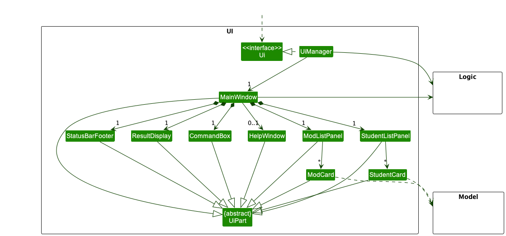

* Table of Contents
{:toc}

--------------------------------------------------------------------------------------------------------------------

## **Acknowledgements**

This project is based on the Friday-Level3 project created by the [SE-EDU initiative](https://se-education.org).

--------------------------------------------------------------------------------------------------------------------

## **Setting up, getting started**

Refer to the guide [_Setting up and getting started_](SettingUp.md).

--------------------------------------------------------------------------------------------------------------------

## **Design**

:bulb: **Tip:** The `.puml` files used to create diagrams in this document can be found in the [diagrams](https://github.com/AY2223S1-CS2103T-W15-4/tp/tree/master/docs/diagrams/) folder. Refer to the [_PlantUML Tutorial_ at se-edu/guides](https://se-education.org/guides/tutorials/plantUml.html) to learn how to create and edit diagrams.

### Architecture

The ***Architecture Diagram*** given above explains the high-level design of the App.

Given below is a quick overview of main components and how they interact with each other.

**Main components of the architecture**

**`Main`** has two classes called [`Main`](https://github.com/AY2223S1-CS2103T-W15-4/tp/blob/master/src/main/java/friday/Main.java) and [`MainApp`](https://github.com/AY2223S1-CS2103T-W15-4/tp/blob/master/src/main/java/friday/MainApp.java). It is responsible for,
* At app launch: Initializes the components in the correct sequence, and connects them up with each other.
* At shut down: Shuts down the components and invokes cleanup methods where necessary.

[**`Commons`**](#common-classes) represents a collection of classes used by multiple other components.

The rest of the App consists of four components.

* [**`UI`**](#ui-component): The UI of the App.
* [**`Logic`**](#logic-component): The command executor.
* [**`Model`**](#model-component): Holds the data of the App in memory.
* [**`Storage`**](#storage-component): Reads data from, and writes data to, the hard disk.

**How the architecture components interact with each other**

The *Sequence Diagram* below shows how the components interact with each other for the scenario where the user issues the command `delete 1`.

Each of the four main components (also shown in the diagram above),

* defines its *API* in an `interface` with the same name as the Component.
* implements its functionality using a concrete `{Component Name}Manager` class (which follows the corresponding API `interface` mentioned in the previous point.

For example, the `Logic` component defines its API in the `Logic.java` interface and implements its functionality using the `LogicManager.java` class which follows the `Logic` interface. Other components interact with a given component through its interface rather than the concrete class (reason: to prevent outside component's being coupled to the implementation of a component), as illustrated in the (partial) class diagram below.

The sections below give more details of each component.

### UI component

The **API** of this component is specified in [`Ui.java`](https://github.com/AY2223S1-CS2103T-W15-4/tp/blob/master/src/main/java/friday/ui/Ui.java)

The UI consists of a `MainWindow` that is made up of parts e.g.`CommandBox`, `ResultDisplay`, `StudentListPanel`, `StatusBarFooter` etc. All these, including the `MainWindow`, inherit from the abstract `UiPart` class which captures the commonalities between classes that represent parts of the visible GUI.

The `UI` component uses the JavaFx UI framework. The layout of these UI parts are defined in matching `.fxml` files that are in the `src/main/resources/view` folder. For example, the layout of the [`MainWindow`](https://github.com/AY2223S1-CS2103T-W15-4/tp/blob/master/src/main/java/friday/ui/MainWindow.java) is specified in [`MainWindow.fxml`](https://github.com/AY2223S1-CS2103T-W15-4/tp/blob/master/src/main/resources/view/MainWindow.fxml)

The `UI` component,

* executes user commands using the `Logic` component.
* listens for changes to `Model` data so that the UI can be updated with the modified data.
* keeps a reference to the `Logic` component, because the `UI` relies on the `Logic` to execute commands.
* depends on some classes in the `Model` component, as it displays `Student` object residing in the `Model`.

### Logic component

**API** : [`Logic.java`](https://github.com/AY2223S1-CS2103T-W15-4/tp/blob/master/src/main/java/friday/logic/Logic.java)

Here's a (partial) class diagram of the `Logic` component:

How the `Logic` component works:
1. When `Logic` is called upon to execute a command, it uses the `FridayParser` class to parse the user command.
1. This results in a `Command` object (more precisely, an object of one of its subclasses e.g., `AddCommand`) which is executed by the `LogicManager`.
1. The command can communicate with the `Model` when it is executed (e.g. to add a student).
1. The result of the command execution is encapsulated as a `CommandResult` object which is returned back from `Logic`.

The Sequence Diagram below illustrates the interactions within the `Logic` component for the `execute("delete 1")` API call.

:information_source: **Note:** The lifeline for `DeleteCommandParser` should end at the destroy marker (X) but due to a limitation of PlantUML, the lifeline reaches the end of diagram.

Here are the other classes in `Logic` (omitted from the class diagram above) that are used for parsing a user command:

How the parsing works:
* When called upon to parse a user command, the `FridayParser` class creates an `XYZCommandParser` (`XYZ` is a placeholder for the specific command name e.g., `AddCommandParser`) which uses the other classes shown above to parse the user command and create a `XYZCommand` object (e.g., `AddCommand`) which the `FridayParser` returns back as a `Command` object.
* All `XYZCommandParser` classes (e.g., `AddCommandParser`, `DeleteCommandParser`, ...) inherit from the `Parser` interface so that they can be treated similarly where possible e.g, during testing.

### Model component
**API** : [`Model.java`](https://github.com/AY2223S1-CS2103T-W15-4/tp/blob/master/src/main/java/friday/model/Model.java)

The `Model` component,

* stores the FRIDAY data i.e., all `Student` objects (which are contained in a `UniqueStudentList` object).
* stores the currently 'selected' `Student` objects (e.g., results of a search query) as a separate _filtered_ list which is exposed to outsiders as an unmodifiable `ObservableList<Student>` that can be 'observed' e.g. the UI can be bound to this list so that the UI automatically updates when the data in the list change.
* stores a `UserPref` object that represents the user’s preferences. This is exposed to the outside as a `ReadOnlyUserPref` objects.
* does not depend on any of the other three components (as the `Model` represents data entities of the domain, they should make sense on their own without depending on other components)

:information_source: **Note:** An alternative (arguably, a more OOP) model is given below. It has a `Tag` list in the `Friday`, which `Student` references. This allows `Friday` to only require one `Tag` object per unique tag, instead of each `Student` needing their own `Tag` objects. 

### Storage component

**API** : [`Storage.java`](https://github.com/AY2223S1-CS2103T-W15-4/tp/blob/master/src/main/java/friday/storage/Storage.java)

The `Storage` component,
* can save both FRIDAY data and user preference data in json format, and read them back into corresponding objects.
* inherits from both `FridayStorage` and `UserPrefStorage`, which means it can be treated as either one (if only the functionality of only one is needed).
* depends on some classes in the `Model` component (because the `Storage` component's job is to save/retrieve objects that belong to the `Model`)

### Common classes

Classes used by multiple components are in the `fridaybook.commons` package.

--------------------------------------------------------------------------------------------------------------------

## **Implementation**

This section describes some noteworthy details on how certain features are implemented.

[comment]: <> (### \[Proposed\] Undo/redo feature)

[comment]: <> (#### Proposed Implementation)

[comment]: <> (The proposed undo/redo mechanism is facilitated by `VersionedFriday`. It extends `Friday` with an undo/redo history, stored internally as an `FridayStateList` and `currentStatePointer`. Additionally, it implements the following operations:)

[comment]: <> (* `VersionedFriday#commit&#40;&#41;` — Saves the current FRIDAY state in its history.)

[comment]: <> (* `VersionedFriday#undo&#40;&#41;` — Restores the previous FRIDAY state from its history.)

[comment]: <> (* `VersionedFriday#redo&#40;&#41;` — Restores a previously undone FRIDAY state from its history.)

[comment]: <> (These operations are exposed in the `Model` interface as `Model#commitFriday&#40;&#41;`, `Model#undoFriday&#40;&#41;` and `Model#redoFriday&#40;&#41;` respectively.)

[comment]: <> (Given below is an example usage scenario and how the undo/redo mechanism behaves at each step.)

[comment]: <> (Step 1. The user launches the application for the first time. The `VersionedFriday` will be initialized with the initial FRIDAY state, and the `currentStatePointer` pointing to that single FRIDAY state.)

[comment]: <> (![UndoRedoState0]&#40;images/UndoRedoState0.png&#41;)

[comment]: <> (Step 2. The user executes `delete 5` command to delete the 5th student in the FRIDAY. The `delete` command calls `Model#commitFriday&#40;&#41;`, causing the modified state of the FRIDAY after the `delete 5` command executes to be saved in the `fridayStateList`, and the `currentStatePointer` is shifted to the newly inserted FRIDAY state.)

[comment]: <> (![UndoRedoState1]&#40;images/UndoRedoState1.png&#41;)

[comment]: <> (Step 3. The user executes `add n/David …​` to add a new student. The `add` command also calls `Model#commitFriday&#40;&#41;`, causing another modified FRIDAY state to be saved into the `fridayStateList`.)

[comment]: <> (![UndoRedoState2]&#40;images/UndoRedoState2.png&#41;)

[comment]: <> (
:information_source: **Note:** If a command fails its execution, it will not call `Model#commitFriday&#40;&#41;`, so the FRIDAY state will not be saved into the `fridayStateList`.)

[comment]: <> (
)

[comment]: <> (Step 4. The user now decides that adding the student was a mistake, and decides to undo that action by executing the `undo` command. The `undo` command will call `Model#undoFriday&#40;&#41;`, which will shift the `currentStatePointer` once to the left, pointing it to the previous FRIDAY state, and restores the FRIDAY to that state.)

[comment]: <> (![UndoRedoState3]&#40;images/UndoRedoState3.png&#41;)

[comment]: <> (
:information_source: **Note:** If the `currentStatePointer` is at index 0, pointing to the initial Friday state, then there are no previous Friday states to restore. The `undo` command uses `Model#canUndoFriday&#40;&#41;` to check if this is the case. If so, it will return an error to the user rather)

[comment]: <> (than attempting to perform the undo.)

[comment]: <> (
)

[comment]: <> (The following sequence diagram shows how the undo operation works:)

[comment]: <> (![UndoSequenceDiagram]&#40;images/UndoSequenceDiagram.png&#41;)

[comment]: <> (
:information_source: **Note:** The lifeline for `UndoCommand` should end at the destroy marker &#40;X&#41; but due to a limitation of PlantUML, the lifeline reaches the end of diagram.)

[comment]: <> (
)

[comment]: <> (The `redo` command does the opposite — it calls `Model#redoFriday&#40;&#41;`, which shifts the `currentStatePointer` once to the right, pointing to the previously undone state, and restores the FRIDAY to that state.)

[comment]: <> (
:information_source: **Note:** If the `currentStatePointer` is at index `fridayStateList.size&#40;&#41; - 1`, pointing to the latest FRIDAY state, then there are no undone AddressBook states to restore. The `redo` command uses `Model#canRedoAddressBook&#40;&#41;` to check if this is the case. If so, it will return an error to the user rather than attempting to perform the redo.)

[comment]: <> (
)

[comment]: <> (Step 5. The user then decides to execute the command `list`. Commands that do not modify the FRIDAY, such as `list`, will usually not call `Model#commitAddressBook&#40;&#41;`, `Model#undoAddressBook&#40;&#41;` or `Model#redoAddressBook&#40;&#41;`. Thus, the `fridayStateList` remains unchanged.)

[comment]: <> (![UndoRedoState4]&#40;images/UndoRedoState4.png&#41;)

[comment]: <> (Step 6. The user executes `clear`, which calls `Model#commitAddressBook&#40;&#41;`. Since the `currentStatePointer` is not pointing at the end of the `fridayStateList`, all FRIDAY states after the `currentStatePointer` will be purged. Reason: It no longer makes sense to redo the `add n/David …​` command. This is the behavior that most modern desktop applications follow.)

[comment]: <> (![UndoRedoState5]&#40;images/UndoRedoState5.png&#41;)

[comment]: <> (The following activity diagram summarizes what happens when a user executes a new command:)

[comment]: <> ()

[comment]: <> (#### Design considerations:)

[comment]: <> (**Aspect: How undo & redo executes:**)

[comment]: <> (* **Alternative 1 &#40;current choice&#41;:** Saves the entire FRIDAY.)

[comment]: <> (  * Pros: Easy to implement.)

[comment]: <> (  * Cons: May have performance issues in terms of memory usage.)

[comment]: <> (* **Alternative 2:** Individual command knows how to undo/redo by)

[comment]: <> (  itself.)

[comment]: <> (  * Pros: Will use less memory &#40;e.g. for `delete`, just save the student being deleted&#41;.)

[comment]: <> (  * Cons: We must ensure that the implementation of each individual command are correct.)

[comment]: <> (_{more aspects and alternatives to be added}_)

[comment]: <> (### \[Proposed\] Data archiving)

[comment]: <> (_{Explain here how the data archiving feature will be implemented}_)

### Sort feature

#### Rationale
This is a feature that enables the sorting of students using various criteria. With many students to keep track of, we
decided to add this feature to allow users to quickly organize their students in different ways.

#### Implementation

The current implementation of the sort feature allows users to sort all students based on the given criteria, in ascending
or descending order. The classes corresponding to the current list of criteria are: `Name`, `TelegramHandle`, `Consultation`,
`MasteryCheck`, and `Grade`.

In this section, we will use the following Activity Diagram to outline the process when the `sort` command is executed.

The `sort` command will be executed by `SortCommand`. Before that, `SortCommandParser` uses instances of `Prefix` and
`Order` in `CliSyntax` to parse the user input and decide what comparator is passed to `SortCommand`. The sorted list
is stored as `sortedStudents` in `ModelManager`, and is updated every time `SortCommand` is run.

To assist with the sorting, classes `Name`, `TelegramHandle`, `Consultation`, and `MasteryCheck` implement the `Comparable`
interface, where the natural ordering of `String` and `LocalDate` are used to implement the `compareTo` method. The `Grade`
class does not implement the interface as its attributes are `String`s.

Given below is an example usage scenario and how the sort mechanism behaves at each step.

1. FRIDAY initialises an `ObservableList<Student>` named `students` and
a `SortedList<Student>` named `sortedStudents` upon launch.

2. The user executes `sort n/a` command to sort the students by name in ascending order.

3. The user input is passed to
`LogicManager`, which then calls the `SortCommandParser#parse` method to parse the argument `n/a`.

4. The `SortCommandParser` checks that the criteria and order are valid, and creates a `SortCommand` with a `Comparator`
that orders the student names alphabetically.

5. The `LogicManager` calls the `SortCommand#execute` method, which in turn calls  `Model#updateSortedStudentList`
to update `sortedStudents` with the given `Comparator`.

6. The list `students` is set to `sortedStudents`, and the `StudentListPanel#setList` method is called to refresh the
`ListView` in the UI with the new `students` list.

The following Sequence Diagram summarises the aforementioned steps.

#### Design considerations:

**Aspect: How many criteria should the sort command accept**

* **Alternative 1 (current choice):** Accept only one criterion
    * Pros: Clear to the user, and easy to implement.
    * Cons: Unable to further sort students with a secondary criteria when the first criteria of some students match.

* **Alternative 2:** Accept multiple criteria and sort in the order they are given
    * Pros: More precise sorting when many students have matching details, e.g. same Mastery Check dates.
    * Cons: Sorting becomes confusing for the user and difficult to implement if many criteria are given.

**Aspect: How to sort missing details**

* **Alternative 1 (current choice)** Students with missing details are sorted last in ascending order, and first in descending order
    * Pros: When sorting in ascending order, students with missing details are shown at the bottom to reduce clutter.
            Users can sort a detail in descending order to see which students have the detail missing.
    * Cons: Top of the list may be cluttered with students with missing details when sorted in descending order.

* **Alternative 2** Students with missing details are sorted last in descending order.
  * Pros: Students with relevant details are immediately available at the top of the list.

Reason for choosing alternative 1: provide a way for users to quickly see which students have missing details.

### Alias feature

#### Implementation

The alias command will be executed by `AliasCommand`. Aliases added will be stored in a `UniqueAliasList`, while
in-built command names (e.g. add, delete) will be stored in a constant `reservedCommandList`.

Given below is an example usage scenario and how the alias mechanism behaves at each step.

1. The user launches the application for the first time. FRIDAY will initialise an `ALiasManager`
with an empty `UniqueAliasList`.

2. The user executes `alias list ls` command to add an alias `ls` for the command `list`. The `alias` command
will check that `list` is in the `reservedCommandList` and `ls` is not in the `UniqueAliasList`. After both conditions
are fulfilled, an `Alias("list","ls")` object will be created and will be added to the `UniqueAliasList` with
`Model#addAlias(Alias toadd)`.

3. The user executes `ls` using the alias of the `list` command. The `AliasManager` will check that
the alias `ls` is assigned to a command (in this case it is `list`) in `FridayParser`. `commandWord` in
`FridayParser` will then be assigned the name of the command in the `reservedCommandList` and the `ListCommand`
is then executed.

_{To add sequence diagram}_

_{To add activity diagram}_

#### Design considerations:

**Aspect: How alias command is implemented:**

_{To add other design considerations}_

### Grade Feature
FRIDAY allows the user to record their students' grades for assessments and examinations in CS1101S. There are 5 
assessments in CS1101S, namely Reading Assessment 1 (RA1), Reading Assessment 2 (RA2), Practical Assessment, Midterm 
exam, and the Final exam. Each student in FRIDAY will have a list of their grades for the 5 assessments, showing the 
name of the assessment and the student's score for the assessment. Users are able to view and edit the individual 
students' grades for the assessments.

#### Implementation
The `grade` command is executed by `GradeCommand`. In CS1101S, the 5 main examinations are Reading Assessment 1, Reading Assessment 2, Practical Assessment, Midterm exam, and Final exam, which are denoted by "ra1", "ra2", "pa", "mt", and "ft" respectively.

For each student, there are 5 grades, each with the result scored by the student, in percentages between 0% and 100% inclusive, and the name of the examination it is associated with.
The grades are then stored in a `GradesList` which is unique for every student and has a fixed length of 5 for every student managed by the user.

Given below is an example usage scenario and how the grading mechanism behaves at each step.

1. The user executes the `grade 5 ra1/90 pa/69.90` command to edit the grades of Reading Assessment 1 and
Practical Assessment for the 5th student in FRIDAY. `GradeCommandParser` checks that the command is valid, and searches for the specific scores from the user's input using the `Prefix` of the examinations. `GradeCommandParser` then creates a new `EditGradeDescriptor` which is then used to create the new `GradeCommand`.

2. The `GradeCommand` will access the `GradesList` of the specified student and the individual grades specified by the user. The `GradesList` is updated, where Reading Assessment 1 and Practical Assessment examinations are updated with the new scores, and the other examinations have the same scores as before.

The following Sequence Diagram shows the aforementioned steps.

#### Design considerations:

**Aspect: Should we allow users to determine the examinations:**
* **Alternative 1 (current choice): Fix the examinations in the list of grades for every student**
  * Pros: Standardised for every student, without the need to check, create or delete examinations for every student, and easy to implement.
  * Cons: Less freedom for users. Unaccounted for unforeseen circumstances (e.g. There is a change in the assessments for the CS1101S module).
* **Alternative 2: Allow users to create and delete their own examinations**
  * Pros: Provides freedom for users and flexibility for changes in the grading system of the module.
  * Cons: Not standardised for every student, and more prone to user error, as each examination will thus need to create new unique prefixes and identity to know which examination it is referring to.

**Aspect: Should we allow users to set the scores of each grade in their own way (e.g. "99%", "A", "65/70", etc.):**
* **Alternative 1 (current choice): Standardise scoring of each grade in terms of percentage:**
  * Pros: Standardised and neat for every assessment and for every student, applicable for the 5 assessments in the CS1101S module, and easy to implement.
  * Cons: Less flexible for assessments whereby percentage scores are not applicable. (e.g. Pass/Fail assessments, alphabetical grading, etc.), and the possible need to manually calculate the percentage.

* **Alternative 2: Users can input the scores in any String they desire:**
  * Pros: More flexibility and freedom for user
  * Cons: Very difficult to check for valid scores due to large number of possibility, not standardised for every student and grade, less able to compare the students' strengths and weaknesses in certain assessments, and difficult to implement.

### Find feature

#### Implementation
The find command is executed similar to all other commands. It goes through the parser and is interpreted using the
logic established. However, it is unique in the sense that it will look through all the possible fields and data
and return matches.

Example of current implementation of find feature

1. The user launches the application for the first time. FRIDAY will initialise a list of all the fields
and their data into a list of students.

2. When user types in the find command the logic will tell the program to go through all the fields for every
student inside the student class and return the student if there is a successful match in any of the fields

--------------------------------------------------------------------------------------------------------------------

## **Documentation, logging, testing, configuration, dev-ops**

* [Documentation guide](Documentation.md)
* [Testing guide](Testing.md)
* [Logging guide](Logging.md)
* [Configuration guide](Configuration.md)
* [DevOps guide](DevOps.md)

--------------------------------------------------------------------------------------------------------------------

## **Appendix: Requirements**

### Product scope

**Target user profile**:

* CS1101S Teaching Assistants
* prefers desktop apps over other types
* can type fast
* prefers typing to mouse interactions
* is reasonably comfortable using CLI apps

**Value proposition**
1. One easy-to-access place to track each student’s individual progress
2. Makes TA’s lives easier by removing the need to manually filter students
3. Easier and more convenient to manage and schedule meetings with students
4. Manage students faster than a typical mouse/GUI driven app
5. Constraint: won’t be able to actually grade assignments using FRIDAY

### User stories

Priorities: High (must have) - `* * *`, Medium (nice to have) - `* *`, Low (unlikely to have) - `*`

| Priority | As a …​           | I want to …​                                                        | So that I can…​                                                  |
|----------|-------------------|---------------------------------------------------------------------|------------------------------------------------------------------|
| `* * *`  | user              | add students                                                        |                                                                  |
| `* * *`  | user              | remove students                                                     |                                                                  |
| `* * *`  | user              | add my students’ contact details                                    | contact them when I need to                                      |
| `* * *`  | user              | delete my students’ contact details                                 | remove outdated information                                      |
| `* * *`  | user              | add my students’ grades and marks for tests                         | assess and see how well they are performing                      |
| `* * *`  | user              | delete my students’ grades and marks for tests                      | remove outdated results                                          |
| `* * *`  | user              | add queries from students                                           | keep track and be reminded of the students' questions            |
| `* * *`  | user              | delete certain comments that are no longer relevant                 | not clutter up space with old comments                           |
| `* * *`  | user              | add comments for a specific student                                 | take note of their progress                                      |
| `* * *`  | user              | view the information of a specific student                          | retrieve details about the student                               |
| `* * *`  | user              | search for keywords                                                 | look for information i need from my students                     |
| `* * *`  | user              | be given helpful error messages when I give an invalid command      | troubleshoot easily without consulting the User Guide every time |
| `* * *`  | user              | add dates for my students’ Mastery Checks                           | schedule the meetings                                            |
| `* * *`  | user              | delete dates for my students’ Mastery Checks                        | remove outdated dates and Mastery Checks                         |
| `* *`    | user              | get help in the app itself                                          | get help without consulting the User Guide                       |
| `* *`    | user              | edit my students’ grades and marks for tests                        | update the student’s results                                     |
| `* *`    | user              | edit the contact details of a specific student                      | update the student’s contact details                             |
| `* *`    | user              | edit the information of a specific student                          | update the student’s details.                                    |
| `* *`    | user              | edit previously added comments                                      | update my comments for a student.                                |
| `* *`    | user              | sort my students by Mastery Check dates                             | easily see when is the next Mastery Check.                       |
| `* *`    | user              | sort my students by consultation dates                              | easily see when is the next consultation.                        |
| `* *`    | new user          | see the app populated with sample data                              | easily see how the app will look when it is in use               |
| `* *`    | new user          | purge all current data                                              | get rid of sample/experimental data I used for exploring the app |
| `* *`    | expert user       | create custom alias for my commands                                 | enter commands more efficiently                                  |
| `* *`    | expert user       | delete a custom alias                                               | remove aliases I no longer need                                  |
| `* *`    | intermediate user | generate random pairs to group my students into pairs               | split my students for pair work                                  |
| `*`      | expert user       | view all my current macros                                          | view all my macros and know what they do                         |
| `*`      | expert user       | create my own macros to  perform certain functions                  | be more efficient using the app                                  |
| `*`      | intermediate user | have suggestions on comments to give students for generic  feedback | provide fast feedback                                            |
| `*`      | intermediate user | customize the look and feel of the software                         | make the software feel like my own                               |

*{More to be added}*

### Use cases

(For all use cases below, the **System** is `FRIDAY` and the **Actor** is the `user`, unless specified otherwise)

**Use case: Delete a student**

**System: FRIDAY**

**Actor: User**

**MSS**

1.  User requests to list students
2.  FRIDAY shows a list of students
3.  User requests to delete a specific student in the list
4.  FRIDAY deletes the student

    Use case ends.

**Extensions**

* 2a. The list is empty.

  Use case ends.

* 3a. The given index is invalid.

    * 3a1. FRIDAY shows an error message.

      Use case resumes at step 2.

**Use case: List a student's details**

**System: FRIDAY**

**Actor: User**

**MSS**

1. User requests to list all students
2. FRIDAY shows a list of students
3. User requests to view the details of a specific student in the list
4. FRIDAY displays the details of the student

    Use case ends.

**Extensions**

* 2a. The list is empty.

  Use case ends.

* 3a. The given index is invalid.

    * 3a1. FRIDAY shows an error message.

      Use case resumes at step 2.

**Use case: Add details to a student**

**System: FRIDAY**

**Actor: User**

**MSS**

1. User requests to list students
2. FRIDAY shows a list of students
3. User requests to add details for a specific student in the list
4. FRIDAY adds details for the student

    Use case ends.

**Extensions**

* 2a. The list is empty.

  Use case ends.

* 3a. The given index is invalid.

    * 3a1. FRIDAY shows an error message.

      Use case resumes at step 2.

* 3b. The given details have the wrong formats or tags

    * 3b1. FRIDAY shows an error message.

      Use case resumes at step 2.

**Use case: Edit details of a student**

**System: FRIDAY**

**Actor: User**

**MSS**

1. User requests to list students
2. FRIDAY shows a list of students
3. User requests to edit details for a specific student in the list
4. FRIDAY edits details for the student

    Use case ends.

**Extensions**

* 2a. The list is empty.

  Use case ends.

* 3a. The given index is invalid.

    * 3a1. FRIDAY shows an error message.

      Use case resumes at step 2.

* 3b. The given details have the wrong formats or tags

    * 3b1. FRIDAY shows an error message.

      Use case resumes at step 2.

**Use case: Edit remarks for a student**

**System: FRIDAY**

**Actor: User**

**MSS**

1. User requests to list students
2. FRIDAY shows a list of students
3. User requests to edit remarks for a specific student in the list
4. FRIDAY edits details for the student

   Use case ends.

**Extensions**

* 2a. The list is empty.

  Use case ends.

* 3a. The given index is invalid.

    * 3a1. FRIDAY shows an error message.

      Use case resumes at step 2.

* 3b. The given remark is empty.

    * 3b1. FRIDAY removes remarks for the specified student.

      Use case ends.

**Use case: Delete details of a student**

**System: FRIDAY**

**Actor: User**

**MSS**

1. User requests to list students
2. FRIDAY shows a list of students
3. User requests to delete details for a specific student in the list
4. FRIDAY deletes details for the student

    Use case ends.

**Extensions**

* 2a. The list is empty.

  Use case ends.

* 3a. The given index is invalid.

    * 3a1. FRIDAY shows an error message.

      Use case resumes at step 2.

* 3b. The given details have the wrong formats or tags

    * 3b1. FRIDAY shows an error message.

      Use case resumes at step 2.

**Use case: Edit grades for a student**

**System: FRIDAY**

**Actor: User**

**MSS**

1. User requests to list students
2. FRIDAY shows a list of students
3. User requests to edit grades for a specific student in the list
4. FRIDAY edits grades for the student

   Use case ends.

**Extensions**

* 2a. The list is empty.

  Use case ends.

* 3a. The given index is invalid.

    * 3a1. FRIDAY shows an error message.

      Use case resumes at step 2.

* 3b. The given score of the grade is empty.

    * 3b1. FRIDAY shows an error message.

      Use case resumes at step 2.

**Use case: Sort students**

**System: FRIDAY**

**Actor: User**

**MSS**

1. User requests to sort students with a specific criteria and order
2. FRIDAY displays the students in sorted order

   Use case ends.

**Extensions**

* 1a. The given criteria is invalid.

    * 1a1. FRIDAY shows an error message.

      Use case resumes at step 1.

* 1b. The given order is invalid.

    * 1b1. FRIDAY shows an error message.

      Use case resumes at step 1.

* 1c. More than one criterion is given.

    * 1c1. FRIDAY shows an error message.

      Use case resumes at step 1.

**Use case: Mark a student's Mastery Check as passed.**

**System: FRIDAY**

**Actor: User**

**MSS**

1. User requests to list students
2. FRIDAY shows a list of students
3. User requests to mark the Mastery Check of a specific student as passed
4. FRIDAY marks the student's Mastery Check as passed

   Use case ends.

**Extensions**

* 2a. The list is empty.

  Use case ends

* 3a. The given index is invalid.

    * 3a1. FRIDAY shows an error message.

      Use case resumes at step 2.

* 3b. The Mastery Check of the student has already been marked as passed.

    * 3b1. FRIDAY shows an error message.

      Use case resumes at step 2.

**Use case: Unmark a student's Mastery Check.**

**System: FRIDAY**

**Actor: User**

**MSS**

1. User requests to list students
2. FRIDAY shows a list of students
3. User requests to unmark the Mastery Check of a specific student
4. FRIDAY unmarks the student's Mastery Check as passed

   Use case ends.

**Extensions**

* 2a. The list is empty.

  Use case ends

* 3a. The given index is invalid.

    * 3a1. FRIDAY shows an error message.

      Use case resumes at step 2.

* 3b. The Mastery Check of the student has not yet been marked as passed.

    * 3b1. FRIDAY shows an error message.

      Use case resumes at step 2.

### Non-Functional Requirements

1.  Should work on any _mainstream OS_ as long as it has Java `11` or above installed.
2.  Should be able to hold up to 100 students without a noticeable sluggishness in performance for typical usage.
3.  A user with above average typing speed for regular English text (i.e. not code, not system admin commands) should be able to accomplish most of the tasks faster using commands than using the mouse.

*{More to be added}*

### Glossary

* **Mainstream OS**: Windows, Linux, Unix, OS-X
* **Private contact detail**: A contact detail that is not meant to be shared with others
* **TA / Avenger**: Teaching assistants, namely CS1101S teaching assistants (also called "Avengers"), who are the target audience of our product FRIDAY.
* **Reading Assessment**: Assessments in the form of online quiz with Multiple-Choice Questions (MCQ). There are a total of two reading assessments, namely RA1 and RA2, throughout the semester. Reading Assessments have weightage in the students' final grade for the module.
* **Mastery Check**: An assessment of the students' understanding of topics conducted by the user (the teaching assistants).
There are two Mastery Checks through the semester. Students will be assessed by their knowledge of the topics covered by presenting to their teaching assistant in pairs.
Since users have to arrange dates to meet with their students to conduct the Mastery Checks, FRIDAY allows users to record the scheduled dates for each student.
--------------------------------------------------------------------------------------------------------------------

## **Appendix: Instructions for manual testing**

Given below are instructions to test the app manually.

:information_source: **Note:** These instructions only provide a starting point for testers to work on;
testers are expected to do more *exploratory* testing.

### Launch and shutdown

1. Initial launch

   1. Download the jar file and copy into an empty folder

   1. Double-click the jar file Expected: Shows the GUI with a set of sample contacts. The window size may not be optimum.

1. Saving window preferences

   1. Resize the window to an optimum size. Move the window to a different location. Close the window.

   1. Re-launch the app by double-clicking the jar file. 
       Expected: The most recent window size and location is retained.

### Adding a student
1. Adding a student with different details
   1. Prerequisites: A student named "Alex Yeoh" and a student with Telegram handle "tommy123" have already been added.
   2. Test case: `add n/Jacelyn c/2022-07-08`  
      Expected: A student named Jacelyn with consultation date 8 July 2022 is added.
   3. Test case: `add n/alex yeoh`  
      Expected: No student is added. Error details shown in the status message.
   4. Test case: `add n/Tom t/tommy123`  
      Expected: No student is added. Error details shown in the status message.
   5. Other incorrect delete commands to try: `add`, `add Ben`, `add n/`  
      Expected: Similar to previous.

### Deleting a student

1. Deleting a student while all students are being shown

   1. Prerequisites: List all students using the `list` command. Multiple students in the list.

   1. Test case: `delete 1` 
      Expected: First contact is deleted from the list. Details of the deleted contact shown in the status message. Timestamp in the status bar is updated.

   1. Test case: `delete 0` 
      Expected: No student is deleted. Error details shown in the status message. Status bar remains the same.

   1. Other incorrect delete commands to try: `delete`, `delete x`, `...` (where x is larger than the list size) 
      Expected: Similar to previous.

### Sorting students
1. Sorting students with different criteria and order
    1. Prerequisites: List all students using the `list` command. Multiple students in the list.
    2. Test case: `sort t/a`  
       Expected: Students sorted by Telegram handle in alphabetical order. Students with missing Telegram handles are sorted last.
    3. Test case: `sort m/d`  
       Expected: Students sorted by Mastery Check dates, from latest to earliest. Students with missing Mastery Check dates are sorted first.
    4. Test case: `sort g/a`  
       Expected: Students not sorted. Error details shown in the status message.
    5. Other incorrect delete commands to try: `sort`, `sort n/`, `sort n/b`  
       Expected: Similar to previous.

### Saving data

1. Dealing with missing/corrupted data files

   1. _{explain how to simulate a missing/corrupted file, and the expected behavior}_

