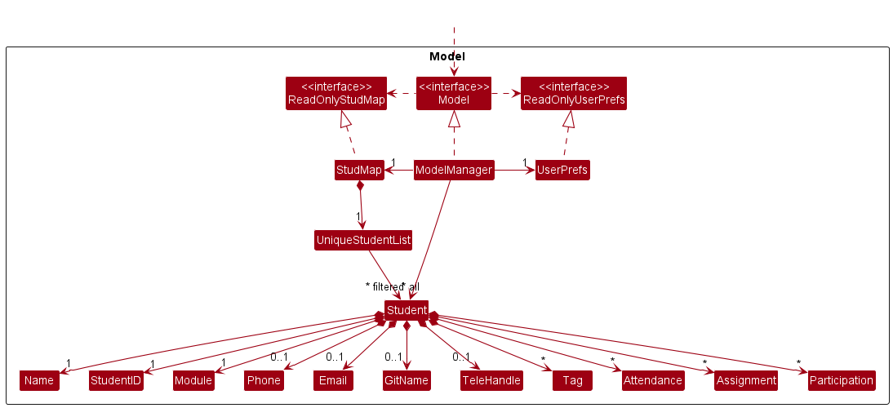
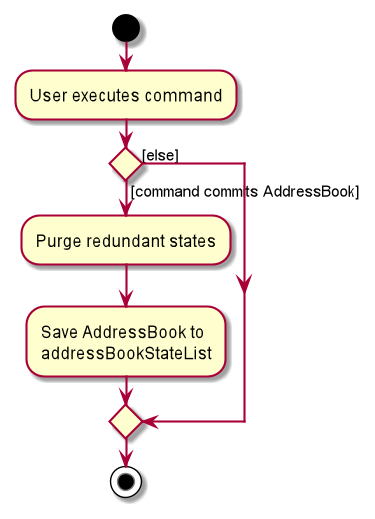
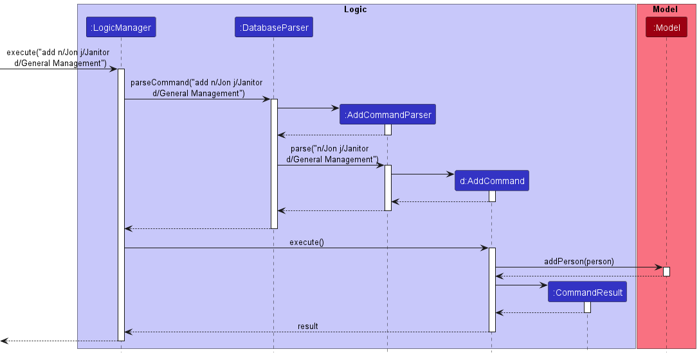
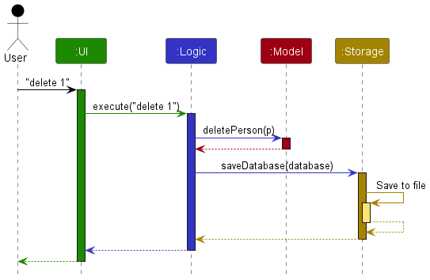

- Table of Contents
  {:toc}

---

## **Acknowledgements**

This project is based on the AddressBook-Level3 project created by the [SE-EDU initiative](https://se-education.org).

---

## **Setting up, getting started**

Refer to the guide [_Setting up and getting started_](SettingUp.md).

---

## **Design**

:bulb: **Tip:** The `.puml` files used to create diagrams in this document can be found in the [diagrams](https://github.com/se-edu/addressbook-level3/tree/master/docs/diagrams/) folder. Refer to the [_PlantUML Tutorial_ at se-edu/guides](https://se-education.org/guides/tutorials/plantUml.html) to learn how to create and edit diagrams.

### Architecture

The **_Architecture Diagram_** given above explains the high-level design of the App.

Given below is a quick overview of main components and how they interact with each other.

**Main components of the architecture**

**`Main`** has two classes called [`Main`](https://github.com/se-edu/addressbook-level3/tree/master/src/main/java/coydir/Main.java) and [`MainApp`](https://github.com/se-edu/addressbook-level3/tree/master/src/main/java/coydir/MainApp.java). It is responsible for,

- At app launch: Initializes the components in the correct sequence, and connects them up with each other.
- At shut down: Shuts down the components and invokes cleanup methods where necessary.

[**`Commons`**](#common-classes) represents a collection of classes used by multiple other components.

The rest of the App consists of four components.

- [**`UI`**](#ui-component): The UI of the App.
- [**`Logic`**](#logic-component): The command executor.
- [**`Model`**](#model-component): Holds the data of the App in memory.
- [**`Storage`**](#storage-component): Reads data from, and writes data to, the hard disk.

**How the architecture components interact with each other**

The _Sequence Diagram_ below shows how the components interact with each other for the scenario where the user issues the command `delete 1`.

Each of the four main components (also shown in the diagram above),

- defines its _API_ in an `interface` with the same name as the Component.
- implements its functionality using a concrete `{Component Name}Manager` class (which follows the corresponding API `interface` mentioned in the previous point.

For example, the `Logic` component defines its API in the `Logic.java` interface and implements its functionality using the `LogicManager.java` class which follows the `Logic` interface. Other components interact with a given component through its interface rather than the concrete class (reason: to prevent outside component's being coupled to the implementation of a component), as illustrated in the (partial) class diagram below.

The sections below give more details of each component.

### UI component

The **API** of this component is specified in [`Ui.java`](https://github.com/se-edu/addressbook-level3/tree/master/src/main/java/coydir/ui/Ui.java)

The UI consists of a `MainWindow` that is made up of parts e.g.`CommandBox`, `ResultDisplay`, `PersonListPanel`, `StatusBarFooter` etc. All these, including the `MainWindow`, inherit from the abstract `UiPart` class which captures the commonalities between classes that represent parts of the visible GUI.

The `UI` component uses the JavaFx UI framework. The layout of these UI parts are defined in matching `.fxml` files that are in the `src/main/resources/view` folder. For example, the layout of the [`MainWindow`](https://github.com/se-edu/addressbook-level3/tree/master/src/main/java/coydir/ui/MainWindow.java) is specified in [`MainWindow.fxml`](https://github.com/se-edu/addressbook-level3/tree/master/src/main/resources/view/MainWindow.fxml)

The `UI` component,

- executes user commands using the `Logic` component.
- listens for changes to `Model` data so that the UI can be updated with the modified data.
- keeps a reference to the `Logic` component, because the `UI` relies on the `Logic` to execute commands.
- depends on some classes in the `Model` component, as it displays `Person` object residing in the `Model`.

### Logic component

**API** : [`Logic.java`](https://github.com/se-edu/addressbook-level3/tree/master/src/main/java/coydir/logic/Logic.java)

Here's a (partial) class diagram of the `Logic` component:

How the `Logic` component works:

1. When `Logic` is called upon to execute a command, it uses the `AddressBookParser` class to parse the user command.
1. This results in a `Command` object (more precisely, an object of one of its subclasses e.g., `AddCommand`) which is executed by the `LogicManager`.
1. The command can communicate with the `Model` when it is executed (e.g. to add a person).
1. The result of the command execution is encapsulated as a `CommandResult` object which is returned back from `Logic`.

The Sequence Diagram below illustrates the interactions within the `Logic` component for the `execute("delete 1")` API call.

:information_source: **Note:** The lifeline for `DeleteCommandParser` should end at the destroy marker (X) but due to a limitation of PlantUML, the lifeline reaches the end of diagram.

Here are the other classes in `Logic` (omitted from the class diagram above) that are used for parsing a user command:

How the parsing works:

- When called upon to parse a user command, the `AddressBookParser` class creates an `XYZCommandParser` (`XYZ` is a placeholder for the specific command name e.g., `AddCommandParser`) which uses the other classes shown above to parse the user command and create a `XYZCommand` object (e.g., `AddCommand`) which the `AddressBookParser` returns back as a `Command` object.
- All `XYZCommandParser` classes (e.g., `AddCommandParser`, `DeleteCommandParser`, ...) inherit from the `Parser` interface so that they can be treated similarly where possible e.g, during testing.

### Model component

**API** : [`Model.java`](https://github.com/se-edu/addressbook-level3/tree/master/src/main/java/coydir/model/Model.java)

The `Model` component,

- stores the address book data i.e., all `Person` objects (which are contained in a `UniquePersonList` object).
- stores the currently 'selected' `Person` objects (e.g., results of a search query) as a separate _filtered_ list which is exposed to outsiders as an unmodifiable `ObservableList<Person>` that can be 'observed' e.g. the UI can be bound to this list so that the UI automatically updates when the data in the list change.
- stores a `UserPref` object that represents the user’s preferences. This is exposed to the outside as a `ReadOnlyUserPref` objects.
- does not depend on any of the other three components (as the `Model` represents data entities of the domain, they should make sense on their own without depending on other components)

:information_source: **Note:** An alternative (arguably, a more OOP) model is given below. It has a `Tag` list in the `AddressBook`, which `Person` references. This allows `AddressBook` to only require one `Tag` object per unique tag, instead of each `Person` needing their own `Tag` objects. 

### Storage component

**API** : [`Storage.java`](https://github.com/se-edu/addressbook-level3/tree/master/src/main/java/coydir/storage/Storage.java)

The `Storage` component,

- can save both address book data and user preference data in json format, and read them back into corresponding objects.
- inherits from both `AddressBookStorage` and `UserPrefStorage`, which means it can be treated as either one (if only the functionality of only one is needed).
- depends on some classes in the `Model` component (because the `Storage` component's job is to save/retrieve objects that belong to the `Model`)

### Common classes

Classes used by multiple components are in the `coydirbook.commons` package.

---

## **Implementation**

This section describes some noteworthy details on how certain features are implemented.

### \[Proposed\] Undo/redo feature

#### Proposed Implementation

The proposed undo/redo mechanism is facilitated by `VersionedAddressBook`. It extends `AddressBook` with an undo/redo history, stored internally as an `addressBookStateList` and `currentStatePointer`. Additionally, it implements the following operations:

- `VersionedAddressBook#commit()` — Saves the current address book state in its history.
- `VersionedAddressBook#undo()` — Restores the previous address book state from its history.
- `VersionedAddressBook#redo()` — Restores a previously undone address book state from its history.

These operations are exposed in the `Model` interface as `Model#commitAddressBook()`, `Model#undoAddressBook()` and `Model#redoAddressBook()` respectively.

Given below is an example usage scenario and how the undo/redo mechanism behaves at each step.

Step 1. The user launches the application for the first time. The `VersionedAddressBook` will be initialized with the initial address book state, and the `currentStatePointer` pointing to that single address book state.

Step 2. The user executes `delete 5` command to delete the 5th person in the address book. The `delete` command calls `Model#commitAddressBook()`, causing the modified state of the address book after the `delete 5` command executes to be saved in the `addressBookStateList`, and the `currentStatePointer` is shifted to the newly inserted address book state.

Step 3. The user executes `add n/David …​` to add a new person. The `add` command also calls `Model#commitAddressBook()`, causing another modified address book state to be saved into the `addressBookStateList`.

:information_source: **Note:** If a command fails its execution, it will not call `Model#commitAddressBook()`, so the address book state will not be saved into the `addressBookStateList`.

Step 4. The user now decides that adding the person was a mistake, and decides to undo that action by executing the `undo` command. The `undo` command will call `Model#undoAddressBook()`, which will shift the `currentStatePointer` once to the left, pointing it to the previous address book state, and restores the address book to that state.

:information_source: **Note:** If the `currentStatePointer` is at index 0, pointing to the initial AddressBook state, then there are no previous AddressBook states to restore. The `undo` command uses `Model#canUndoAddressBook()` to check if this is the case. If so, it will return an error to the user rather
than attempting to perform the undo.

The following sequence diagram shows how the undo operation works:

:information_source: **Note:** The lifeline for `UndoCommand` should end at the destroy marker (X) but due to a limitation of PlantUML, the lifeline reaches the end of diagram.

The `redo` command does the opposite — it calls `Model#redoAddressBook()`, which shifts the `currentStatePointer` once to the right, pointing to the previously undone state, and restores the address book to that state.

:information_source: **Note:** If the `currentStatePointer` is at index `addressBookStateList.size() - 1`, pointing to the latest address book state, then there are no undone AddressBook states to restore. The `redo` command uses `Model#canRedoAddressBook()` to check if this is the case. If so, it will return an error to the user rather than attempting to perform the redo.

Step 5. The user then decides to execute the command `list`. Commands that do not modify the address book, such as `list`, will usually not call `Model#commitAddressBook()`, `Model#undoAddressBook()` or `Model#redoAddressBook()`. Thus, the `addressBookStateList` remains unchanged.

Step 6. The user executes `clear`, which calls `Model#commitAddressBook()`. Since the `currentStatePointer` is not pointing at the end of the `addressBookStateList`, all address book states after the `currentStatePointer` will be purged. Reason: It no longer makes sense to redo the `add n/David …​` command. This is the behavior that most modern desktop applications follow.

The following activity diagram summarizes what happens when a user executes a new command:

#### Design considerations:

**Aspect: How undo & redo executes:**

- **Alternative 1 (current choice):** Saves the entire Coydir

  - Pros: Easy to implement.
  - Cons: May have performance issues in terms of memory usage.

- **Alternative 2:** Individual command knows how to undo/redo by
  itself.
  - Pros: Will use less memory (e.g. for `delete`, just save the person being deleted).
  - Cons: We must ensure that the implementation of each individual command are correct.

### Add feature

#### Implementation

This section explains the implementation of the `add` feature. The command takes in two compulsory parameters which is the employee name and position, executing the command leads to the addition of an employee person into the records of coydir.

Below is a sequence diagram and explanation of how `add` is executed.

Step 1. The user enters the command `add n/Jon j/janitor`.

Step 2. User input is parsed by `AddCommandParser` which creates the`AddCommand` object, then the method `LogicManager#execute` is called to create the AddCommand object.

Step 3. The `execute` method of AddCommand is then called on the object, which returns a `CommandResult` object.

Step 4. This adds the `person` from the list from the model. The `employeeID` is set and if there already exist a `person` object with the same field data, a `CommandException` will be thrown and a message indicating duplicate person will be shown. If the `person` object does not exist, then using `model#addPerson()`, the `person` object is added to the `database`.

Step 5. `storage#saveDatabase` is then called on the current `database`, updates the database to contain the new `person`.

### Delete feature

#### Implementation (_Proposed_)

This section explains the implementation of the `delete` feature. The command takes in one parameter which is the employee ID, executing the command leads to the removal of the employee with that specific employee ID from coydir.

Below is a sequence diagram and explanation of how `delete` is executed.

Step 1. The user enters the command `delete 1`.

Step 2. User input is parsed by `DeleteCommandParser` which creates the `DeleteCommand` object, then the method `LogicManager#execute` is called to create the `DeleteCommand` object.

Step 3. The `execute` method of `DeleteCommand` is then called on the object, which returns a `CommandResult` object.

Step 4. This finds the `person` from the list from `model#getFilteredPersonList` by its employee ID which is `1` in this case. If there does not exist a `person` object with employee ID of `1`, a `CommandException` will be thrown and a message indicating invalid ID given will be shown. If the `person` object exists, then using `model#deletePerson()`, the `person` object is deleted from the `database`.

Step 5. storage#saveDatabase is then called on the current `database`, updates the database to not contain the deleted `person`.

### Find feature

This section explains the implementation of the `find` feature. The command takes in a number of parameters, which serve as the "filters" for the finding/searching function. At present, we have implemented finding by name, department, position, and any combination of these three. Thus it is possible to use these altogether to search for a person with high specificity.
As of version `1.3.0`, the feature supports searching by name, position, or department, which are the 3 mandatory fields that a `Person` must have when added into the database.

The `find` command updates the model's filtered persons list based on the search filters.
On the UI, the side panel will, by default, display the employee profile of the first person in the filtered list.
If there is none, then it will show the home panel.

Below is a sequence diagram and explanation of how `find` is executed. In this simple example, we will look at the command `find n/Alex`.

Step 1. The user enters the command `find n/Alex`.

Step 2. User input is parsed by `FindCommandParser` which creates a `PersonMatchesKeywordsPredicate`, which is a predicate used to create the `FindCommand` object, then the method `LogicManager#execute` is called to create the `FindCommand` object.

Step 3. The `execute` method of `FindCommand` is then called on the object.

Step 4. This then calls the `model#updateFilteredPersonList` method, which iterates through the list of `Person` objects returned by the `model#getFilteredPersonList` for the search parameter specified (in this case, name being "Alex"). It then keeps track of any `Person` objects that matches this specified parameter.

Step 5. This returns a `CommandResult` object, which is returned to the `LogicManager`, and eventually, the `MainWindow`, prompting the `MainWindow` to call `model#getFilteredPersonList` and display the first-indexed person, if there is any.

### View feature

This section explains the implementation of the `view` feature. The command takes in one parameter which is the index. Executing the command leads to the more detailed information of the specific employee to be shown on the right panel.

Below is a sequence diagram and explanation of how `view` is executed.

Step 1. The use enters the command `view 1`.

Step 2. User input is parsed by `ViewCommandParser` which created the `ViewCommand` object, then the method `LogicManager#execute` is called to create the `ViewCommand` object.

Step 3. The `execute` method of `ViewCommand` is then called on the object, which returns a `CommandResult` object.

Step 4. This finds the `person` from the list from the `model#getFilteredPersonList` by its index which is `1` in this case. If there does not exist a `person` object with index `1`, a `CommandException` will be thrown and a messafe indicating invalid index given will be shown. If the `person` object exists, then the `MainWindow#handleView` will be trigger, which results in the panel being updated with the correct `person` information.

### BatchAdd

This feature is created for users to add multiple entries at once.
In the case of this application, there are two main reasons why our User (HR Executive) would use this.

1. User is new and needs to import all the current data into the database.
2. There is a new recruitment cycle and company has recruited a large number of employees.

Moving on to the implementation, some things to note.

- As of now, our feature only accommodates adding from a CSV file.
- Fields does not allow for commas inside.

These are possible things to work on for future iterations.

#### Implementation

Pre-requisites: User has a CSV file filled with whatever information they have
and has stored it in the `/data` folder of the repository.

Step 1: User executes `batchadd filename` command. In the `LogicManager` class, the `DatabaseParser` method is called.
This will return a new `BatchAddParser` object and `parse` function is then called.
A helper function in `ParserUtil` helps to trim the filename and check if it is valid. If no argument is provided, a
`ParseException` will be thrown.

Step 2: The `parse` function returns a `BatchAddCommand` which is then executed. In this `execute` function, the first
step would be to read the information in the CSV file (`getInfo` function). A `BufferedReader` object is used to read the CSV file and write it
into a `List<AddCommand>`. If file does not exist in the folder, a `FileNotFound` exception is thrown too.

Step 3. Once `getInfo` returns a `List<AddCommand>`, the list will then be iterated through to execute each `AddCommand`
If there is any duplicate Person found, the function call will be aborted and the database will be reverted to its original state.

Step 4. `storage#saveDatabase` is then called on the current `database`, updates the database to contain the new persons added.

#### Design Considerations

- Alternative 1 (Current Choice): Make use of the execution of the `AddCommand`.
  - Pros: Makes use of the Error Handling that the `AddCommand` has.
  - Cons: `BatchAdd` will fail if Add fails.
- Alternative 2: Own implementation of `BatchAdd` without relying on `AddCommand`.
  - Pros: If Add Fails, BatchAdd can still work.
  - Cons: Implementation Heavy.

---

## **Documentation, logging, testing, configuration, dev-ops**

- [Documentation guide](Documentation.md)
- [Testing guide](Testing.md)
- [Logging guide](Logging.md)
- [Configuration guide](Configuration.md)
- [DevOps guide](DevOps.md)

---

## **Appendix: Requirements**

### Product scope

**Target user profile**:

Our target user is a Chief Human Resources Officer (CHRO) who:

- types fast
- is comfortable with using CLI for inputting commands
- needs a centralized platform for accessing and updating employees’ data
- is a Top-level management executive in charge of an organization's employees

**Value proposition**:

Coydir enables the Company’s HR executive to quickly access the list of all employees, and make necessary updates based on changes in the company’s structure. This grants excellent visualization of the company structure, which will be useful in company organization or restructuring.

### User stories

_Currently for Coydir v1.2_

Priorities: High (must have) - `* * *`, Medium (nice to have) - `* *`, Low (unlikely to have) - `*`

| Priority | As a …​ | I want to …​                      | So that I can…​                                  |
| -------- | ------- | --------------------------------- | ------------------------------------------------ |
| `* * *`  | user    | add a new person                  | keep the database updated with the employee list |
| `* * *`  | user    | delete a person                   | remove entries that I no longer need             |
| `* * *`  | user    | list people in the database       | keep track of who is in the company              |
| `* * *`  | user    | edit details of employees         | correct the details of the employees             |
| `* * *`  | user    | view contact details of employees | contact them if necessary                        |
| `* * *`  | user    | save my data                      | load the data I input previously                 |

_{More to be added}_

### Use cases

(For all use cases below, the **System** is the `Coydir` and the **Actor** is the `user`, unless specified otherwise)

**Use case: Delete a person**

**MSS**

1.  User requests to list persons
2.  Coydir shows a list of persons
3.  User requests to delete a specific person in the list
4.  Coydir deletes the person

    Use case ends.

**Extensions**

- 2a. The list is empty.

  - 2a1. Coydir shows an error message

    Use case ends.

- 3a. The given index is invalid.

  - 3a1. Coydir shows an error message.

  Use case resumes at step 2.

**Use case: Edit details of a person**

**MSS**

1. User requests to list persons
2. Coydir shows a list of persons
3. User requests to delete a specific person in the list
4. Coydir deletes the person
5. User adds specific person back with the updated changes.

   Use case ends.

**Extensions**

- 2a. The list is empty.

  - 2a1. Coydir shows an error message

    Use case ends.

- 3a. The given index is invalid.

  - 3a1. Coydir shows an error message.

    Use case resumes at step 2.

**Use case: Find details of a person**

**MSS**

1. User requests to find details of specific person
2. Coydir shows the details of person specific person

   Use case ends.

**Extensions**

- 2a. There is no such person in the list

  - 2a1. Coydir shows an error message

    Use case ends.

**Use case: View details of a person**

**MSS**

1. User request to view details of a specific person in the list
2. Coydir shows the details of the specific person

   Use case ends.

**Extensions**

- 1a. The given index is invalid.

  - 1a1. Coydir shows an error message.

    Use case ends.

_{More to be added}_

### Non-Functional Requirements

1. Should work on any _mainstream OS_ as long as it has Java `11` or above installed.
2. Should be able to hold up to 1000 persons without a noticeable sluggishness in performance for typical usage.
3. A user with above average typing speed for regular English text (i.e. not code, not system admin commands) should be able to accomplish most of the tasks faster using commands than using the mouse.
4. Documentation: user guide should be sufficiently clear such that all users can understand how to use the app after reading the guide.
5. The product should be easy to use by person with little experience of using a command line application.

_{More to be added}_

### Glossary

- **Mainstream OS**: Windows, Linux, Unix, OS-X
- **Private contact detail**: A contact detail that is not meant to be shared with others
- **Entries**: Profile of a person which contains all the necessary details about the person

_{More to be added}_

---

## **Appendix: Instructions for manual testing**

Given below are instructions to test the app manually.

:information_source: **Note:** These instructions only provide a starting point for testers to work on;
testers are expected to do more *exploratory* testing.

### Launch and shutdown

1. Initial launch

   1. Download the jar file and copy into an empty folder

   1. Double-click the jar file Expected: Shows the GUI with a set of sample contacts. The window size may not be optimum.

1. Saving window preferences

   1. Resize the window to an optimum size. Move the window to a different location. Close the window.

   1. Re-launch the app by double-clicking the jar file. 
      Expected: The most recent window size and location is retained.

1. _{ more test cases …​ }_

### Deleting a person

1. Deleting a person while all persons are being shown

   1. Prerequisites: List all persons using the `list` command. Multiple persons in the list.

   1. Test case: `delete 1` 
      Expected: First contact is deleted from the list. Details of the deleted contact shown in the status message. Timestamp in the status bar is updated.

   1. Test case: `delete 0` 
      Expected: No person is deleted. Error details shown in the status message. Status bar remains the same.

   1. Other incorrect delete commands to try: `delete`, `delete x`, `...` (where x is larger than the list size) 
      Expected: Similar to previous.

1. _{ more test cases …​ }_

### Saving data

1. Dealing with missing/corrupted data files

   1. _{explain how to simulate a missing/corrupted file, and the expected behavior}_

1. _{ more test cases …​ }_
