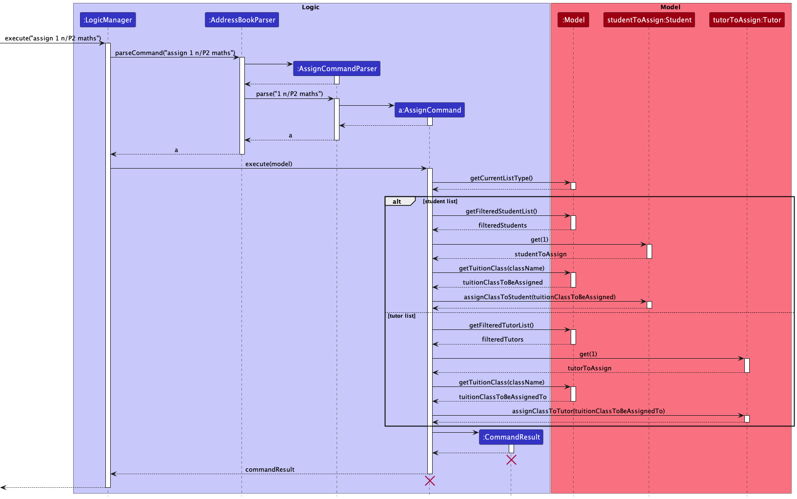

* Table of Contents
  {:toc}

--------------------------------------------------------------------------------------------------------------------

## **Acknowledgements**

* {list here sources of all reused/adapted ideas, code, documentation, and third-party libraries -- include links to the original source as well}

--------------------------------------------------------------------------------------------------------------------

## **Setting up, getting started**

Refer to the guide [_Setting up and getting started_](SettingUp.md).

--------------------------------------------------------------------------------------------------------------------

## **Design**

:bulb: **Tip:** The `.puml` files used to create diagrams in this document can be found in the [diagrams](https://github.com/se-edu/addressbook-level3/tree/master/docs/diagrams/) folder. Refer to the [_PlantUML Tutorial_ at se-edu/guides](https://se-education.org/guides/tutorials/plantUml.html) to learn how to create and edit diagrams.

### Architecture

The ***Architecture Diagram*** given above explains the high-level design of the App.

Given below is a quick overview of main components and how they interact with each other.

**Main components of the architecture**

**`Main`** has two classes called [`Main`](https://github.com/se-edu/addressbook-level3/tree/master/src/main/java/seedu/address/Main.java) and [`MainApp`](https://github.com/se-edu/addressbook-level3/tree/master/src/main/java/seedu/address/MainApp.java). It is responsible for,
* At app launch: Initializes the components in the correct sequence, and connects them up with each other.
* At shut down: Shuts down the components and invokes cleanup methods where necessary.

[**`Commons`**](#common-classes) represents a collection of classes used by multiple other components.

The rest of the App consists of four components.

* [**`UI`**](#ui-component): The UI of the App.
* [**`Logic`**](#logic-component): The command executor.
* [**`Model`**](#model-component): Holds the data of the App in memory.
* [**`Storage`**](#storage-component): Reads data from, and writes data to, the hard disk.

**How the architecture components interact with each other**

The *Sequence Diagram* below shows how the components interact with each other for the scenario where the user issues the command `delete 1`.

Each of the four main components (also shown in the diagram above),

* defines its *API* in an `interface` with the same name as the Component.
* implements its functionality using a concrete `{Component Name}Manager` class (which follows the corresponding API `interface` mentioned in the previous point.

For example, the `Logic` component defines its API in the `Logic.java` interface and implements its functionality using the `LogicManager.java` class which follows the `Logic` interface. Other components interact with a given component through its interface rather than the concrete class (reason: to prevent outside component's being coupled to the implementation of a component), as illustrated in the (partial) class diagram below.

The sections below give more details of each component.

### UI component

The **API** of this component is specified in [`Ui.java`](https://github.com/se-edu/addressbook-level3/tree/master/src/main/java/seedu/address/ui/Ui.java)

The UI consists of a `MainWindow` that is made up of parts e.g.`CommandBox`, `ResultDisplay`, `PersonListPanel`, `StatusBarFooter` etc. All these, including the `MainWindow`, inherit from the abstract `UiPart` class which captures the commonalities between classes that represent parts of the visible GUI.

The `UI` component uses the JavaFx UI framework. The layout of these UI parts are defined in matching `.fxml` files that are in the `src/main/resources/view` folder. For example, the layout of the [`MainWindow`](https://github.com/se-edu/addressbook-level3/tree/master/src/main/java/seedu/address/ui/MainWindow.java) is specified in [`MainWindow.fxml`](https://github.com/se-edu/addressbook-level3/tree/master/src/main/resources/view/MainWindow.fxml)

The `UI` component,

* executes user commands using the `Logic` component.
* listens for changes to `Model` data so that the UI can be updated with the modified data.
* keeps a reference to the `Logic` component, because the `UI` relies on the `Logic` to execute commands.
* depends on some classes in the `Model` component, as it displays `Person` object residing in the `Model`.

### Logic component

**API** : [`Logic.java`](https://github.com/se-edu/addressbook-level3/tree/master/src/main/java/seedu/address/logic/Logic.java)

Here's a (partial) class diagram of the `Logic` component:

How the `Logic` component works:
1. When `Logic` is called upon to execute a command, it uses the `AddressBookParser` class to parse the user command.
1. This results in a `Command` object (more precisely, an object of one of its subclasses e.g., `AddCommand`) which is executed by the `LogicManager`.
1. The command can communicate with the `Model` when it is executed (e.g. to add a person).
1. The result of the command execution is encapsulated as a `CommandResult` object which is returned back from `Logic`.

The Sequence Diagram below illustrates the interactions within the `Logic` component for the `execute("delete 1")` API call.

:information_source: **Note:** The lifeline for `DeleteCommandParser` should end at the destroy marker (X) but due to a limitation of PlantUML, the lifeline reaches the end of diagram.

Here are the other classes in `Logic` (omitted from the class diagram above) that are used for parsing a user command:

How the parsing works:
* When called upon to parse a user command, the `AddressBookParser` class creates an `XYZCommandParser` (`XYZ` is a placeholder for the specific command name e.g., `AddCommandParser`) which uses the other classes shown above to parse the user command and create a `XYZCommand` object (e.g., `AddCommand`) which the `AddressBookParser` returns back as a `Command` object.
* All `XYZCommandParser` classes (e.g., `AddCommandParser`, `DeleteCommandParser`, ...) inherit from the `Parser` interface so that they can be treated similarly where possible e.g, during testing.

### Model component
**API** : [`Model.java`](https://github.com/se-edu/addressbook-level3/tree/master/src/main/java/seedu/address/model/Model.java)

The `Model` component,

* stores the address book data i.e., all `Person` objects (which are contained in a `UniquePersonList` object).
* stores the currently 'selected' `Person` objects (e.g., results of a search query) as a separate _filtered_ list which is exposed to outsiders as an unmodifiable `ObservableList<Person>` that can be 'observed' e.g. the UI can be bound to this list so that the UI automatically updates when the data in the list change.
* stores a `UserPref` object that represents the user’s preferences. This is exposed to the outside as a `ReadOnlyUserPref` objects.
* does not depend on any of the other three components (as the `Model` represents data entities of the domain, they should make sense on their own without depending on other components)

:information_source: **Note:** An alternative (arguably, a more OOP) model is given below. It has a `Tag` list in the `AddressBook`, which `Person` references. This allows `AddressBook` to only require one `Tag` object per unique tag, instead of each `Person` needing their own `Tag` objects. 

### Storage component

**API** : [`Storage.java`](https://github.com/se-edu/addressbook-level3/tree/master/src/main/java/seedu/address/storage/Storage.java)

The `Storage` component,
* can save both address book data and user preference data in json format, and read them back into corresponding objects.
* inherits from both `AddressBookStorage` and `UserPrefStorage`, which means it can be treated as either one (if only the functionality of only one is needed).
* depends on some classes in the `Model` component (because the `Storage` component's job is to save/retrieve objects that belong to the `Model`)

### Common classes

Classes used by multiple components are in the `seedu.addressbook.commons` package.

--------------------------------------------------------------------------------------------------------------------

## **Implementation**

This section describes some noteworthy details on how certain features are implemented.

### \[Proposed\] Undo/redo feature

#### Proposed Implementation

The proposed undo/redo mechanism is facilitated by `VersionedAddressBook`. It extends `AddressBook` with an undo/redo history, stored internally as an `addressBookStateList` and `currentStatePointer`. Additionally, it implements the following operations:

* `VersionedAddressBook#commit()` — Saves the current address book state in its history.
* `VersionedAddressBook#undo()` — Restores the previous address book state from its history.
* `VersionedAddressBook#redo()` — Restores a previously undone address book state from its history.

These operations are exposed in the `Model` interface as `Model#commitAddressBook()`, `Model#undoAddressBook()` and `Model#redoAddressBook()` respectively.

Given below is an example usage scenario and how the undo/redo mechanism behaves at each step.

Step 1. The user launches the application for the first time. The `VersionedAddressBook` will be initialized with the initial address book state, and the `currentStatePointer` pointing to that single address book state.

Step 2. The user executes `delete 5` command to delete the 5th person in the address book. The `delete` command calls `Model#commitAddressBook()`, causing the modified state of the address book after the `delete 5` command executes to be saved in the `addressBookStateList`, and the `currentStatePointer` is shifted to the newly inserted address book state.

Step 3. The user executes `add n/David …​` to add a new person. The `add` command also calls `Model#commitAddressBook()`, causing another modified address book state to be saved into the `addressBookStateList`.

:information_source: **Note:** If a command fails its execution, it will not call `Model#commitAddressBook()`, so the address book state will not be saved into the `addressBookStateList`.

Step 4. The user now decides that adding the person was a mistake, and decides to undo that action by executing the `undo` command. The `undo` command will call `Model#undoAddressBook()`, which will shift the `currentStatePointer` once to the left, pointing it to the previous address book state, and restores the address book to that state.

:information_source: **Note:** If the `currentStatePointer` is at index 0, pointing to the initial AddressBook state, then there are no previous AddressBook states to restore. The `undo` command uses `Model#canUndoAddressBook()` to check if this is the case. If so, it will return an error to the user rather
than attempting to perform the undo.

The following sequence diagram shows how the undo operation works:

:information_source: **Note:** The lifeline for `UndoCommand` should end at the destroy marker (X) but due to a limitation of PlantUML, the lifeline reaches the end of diagram.

The `redo` command does the opposite — it calls `Model#redoAddressBook()`, which shifts the `currentStatePointer` once to the right, pointing to the previously undone state, and restores the address book to that state.

:information_source: **Note:** If the `currentStatePointer` is at index `addressBookStateList.size() - 1`, pointing to the latest address book state, then there are no undone AddressBook states to restore. The `redo` command uses `Model#canRedoAddressBook()` to check if this is the case. If so, it will return an error to the user rather than attempting to perform the redo.

Step 5. The user then decides to execute the command `list`. Commands that do not modify the address book, such as `list`, will usually not call `Model#commitAddressBook()`, `Model#undoAddressBook()` or `Model#redoAddressBook()`. Thus, the `addressBookStateList` remains unchanged.

Step 6. The user executes `clear`, which calls `Model#commitAddressBook()`. Since the `currentStatePointer` is not pointing at the end of the `addressBookStateList`, all address book states after the `currentStatePointer` will be purged. Reason: It no longer makes sense to redo the `add n/David …​` command. This is the behavior that most modern desktop applications follow.

The following activity diagram summarizes what happens when a user executes a new command:

#### Design considerations:

**Aspect: How undo & redo executes:**

* **Alternative 1 (current choice):** Saves the entire address book.
    * Pros: Easy to implement.
    * Cons: May have performance issues in terms of memory usage.

* **Alternative 2:** Individual command knows how to undo/redo by
  itself.
    * Pros: Will use less memory (e.g. for `delete`, just save the person being deleted).
    * Cons: We must ensure that the implementation of each individual command are correct.

_{more aspects and alternatives to be added}_

### \[Implemented\] Assign/unassign feature

#### Implementation

User would be required to input the command `assign` followed by the index of the person that the user want 
to assign a class to. Lastly, user would have to input the exact tuition class name in the following prefix 
and syntax `n/[Class Name]` to specify which tuition class they want to assign to the specified person.

The `assign` and `unassign` features requires the user to be currently be either in student or tutor list.
If the user is currently not in any of the two lists, the feature will not work and user would be prompted
to go to the valid current list through a `command exception`.

During the execution of `assign` command, it would first check for the type of current list the user is in
as mentioned above. If the current list is student list, the index of assign command would be referred to the
student list and same for if the current list is a tutor list. 

After, the index that the user inputted would be checked 
to see if it is within the size of the current list. If it exceeds the size of the list, a `command exception` would be 
thrown and user would be informed of their invalid index. 

Then with the tuition class name that the user inputted and parsed, it would
be searched among the list of tuition class for matching names. If there is no matching tuition class in the list, 
a `command exception` would be thrown and user would be informed that the tuition class they inputted does not exist.

If there is no `command exception` thrown due to the above scenarios, the tuition class would be assigned to the 
specified student/tutor.

The following sequence diagram shows how the `assign` operation works:

The `unassign` command just does the opposite - it calls `Student#unassignClassFromStudent`/ 
`Tutor#unassignClassFromTutor` instead which remove the specified tuition class from the list of
tuition classes in the student/tutor.

#### Design considerations:

**Aspect: How assign & unassign executes:**

* **Alternate 1 (current choice)):** `assign`/`unassign` just involves adding / removing tuition class from 
  a list of tuition classes that every student/tutor has.
  * Pros: Easier to implement and store in Json format.
  * Cons: Not keeping a list of students and tutors for tuition classes may
  result in a more tedious process when searching in the future.
* **Alternate 2:** `assign`/`unassign` involves adding / removing tuition class from
  a list of tuition classes that every student/tutor has and as well as the tuition classes
  keeping a list of students and tutors it has. 
  * Pros: Makes searching process easier in the future.
  * Cons: Hard and tedious to implement the storing of information in Json. 

### \[Implemented\] Find by fields feature

#### Implementation

The proposed find by fields mechanism searches the currently displayed list based on multiple fields by taking in a set of prefixes with their respective keywords and updating the respective `FilteredList`.

Given below is an example usage scenario and how the find by fields mechanism behaves at each step.

Step 1. The user launches the application. The `ModelManager` would be initialised and the type is set to the default list type which is `STUDENT_LIST`.

Step 2. The user execute `list tutor` command to list out all tutors by calling `ListTutorCommand`. The `ListTutorCommand` calls `Model#updateCurrentListType()` with `TUTOR_LIST` being the parameter, causing the type in `ModelManager` to update to `TUTOR_LIST`.

Step 3. The user executes `find n/john q/computing i/nus` command to search for all tutors who are named John and have graduated from NUS with computing qualifications. The user's input is first parsed into the `AddressBookParser`, where the `COMMAND_WORD` and the `arguments` are separated, and the `Model.ListType` is determined.

Step 4. After checking that the `COMMAND_WORD`, a new `FindCommandParser` is returned with the `arguments` parsed into it.

Step 5. In the `FindCommandParser`, the `arguments` are tokenized into an `ArgumentMultimap`, where the respective `prefixes` and `keywords` are extracted from the `arguments` and mapped to each other. Afterwards, the pairs of `prefixes` and `keywords` are put into a `HashMap<Prefix, String>`. A `FindCommand` is then returned with the `HashMap<Prefix, String>` parsed into it.

Step 6. In the `FindCommand`, a `TutorContainsKeywordsPredicate<Tutor>` is created with the `keywords` as input, which tests if the `keywords` are contained by the respective fields in the tutors.

Step 7. Afterwards, the `filteredList` of tutors is updated with that `TutorContainsKeywordsPredicate<Tutor>` in the `ModelManager`. A new `CommandResult` is then returned and a list of tutors with that predicate is then shown.

Step 8. The user now decides he wants to be more specific with his search, and decides to execute `find n/John Doe q/bachelor of computing i/nus` to find all tutors who are named John Doe, and have graduated from NUS with a bachelor's degree in computing. A more specific list of students is then shown.

_{more aspects and alternatives to be added}_

### \[Implemented\] List type feature

#### Implementation

The list type feature is motivated by the existence of the three different entities that are manipulated by myStudent, namely `Student`, `Tutor` and `TuitionClass`. It is implemented as an enum class `ListType` in `Model` which includes three types - `STUDENT_LIST`, `TUTOR_LIST` and `TUITIONCLASS_LIST` (PERSON_LIST is to be removed in future version). 

The current list type is kept as a `ListType` field `type` in `ModelManager` which implements `Model`. As `Student`, `Tutor` and `TuitionClass` instances are stored in `FilteredList` `filteredStudent`, `filterdTutors` and `filterdTuitionClass` in `ModelManager`, `ListType` `type` would indicate which of the three would be operated on by the `Logic` component. Additionally, to allow access by the `Logic` component, `Model` implements setter and getter methods for the `type`:

* `Model#updateCurrentListType()` - Updates the `type` to the specified list type.
* `Model#getCurrentListType()` - Returns the `ListType` `type` that the `ModelManager` currently stores.
* Model#getCurrentList()` - Returns the current filtered list from `filteredStudents`, `filteredTutors` and `filteredTuitionClass` directly according to the current list type.

The operations are exposed to `Logic` interface as `Logic#updateCurrentListType()`, `Logic#getCurrentListType()` and `Logic#getCurrentList()` respectively. Since `Ui` keeps a reference to `Logic`, these operations can be accessed by `Ui` as well.

`ListType` `type` is referred to by any method that need to access to the current list. Given below is an example usage scenario including `ListTuitionClassCommand` and how the list type mechanism behaves in each step.

Step 1. The user launches the application for the first time. The `ModelManager` would be initialised and the `type` is set to the default list type which is `STUDENT_LIST`.

Step 2. The user execute `list_c` command to list out tuition classes by ccalling `ListTuitionClassCommand`. The `ListTuitionClassCommand` calls `Model#updateCurrentListType()` with `TUITIONCLASS_LIST` being the parameter, causing the type in `ModelManager` to update to `TUITIONCLASS_LIST`. 

Step 3. The command then returns a `commandResult` with its `commandType` field being `LIST`. This will cause calling `commandResult.isList()` to return true. 

Step 4. The `commandResult` is then returned to the `commandResult` in the `executeCommand()` method in `MainWindow`. The `executeCommand()` method then checks that `commandResult.isList()` returns true and calls `MainWindow#handleList()`.

Step 5. The `handleList()` method checks the `type` in `ModelManager` with `Logic#getCurrentListType()`. Since the `type` is set to `TUITIONCLASS_LIST`, it will change the children of `entityListPanelPlaceholder` to `tuitionClassListPanel`, which holds the list of tuition classes.

Step 6. The `handleList()` method then calls `setLabelStyle()`. Similar to `handleList()`, `setLabelStyle()` calls `Logic#getCurrentListType()` to get the `type` in `ModelManager` and set the style class of the `tuitionClassLabelPanel` to `SELECTED_CLASS_LABEL_STYLE_CLASS`, and the `studentLabelPanel` along with the `tutorLabelPanel` to `UNSELECETED_LABEL_STYLE_CLASS`. 

Another example that makes use of the list type is the `DeleteCommand`. Since the `delete` command deletes the entity with the specified index in the current list, it needs to access to the current list type. Below are the steps of how list type mechanism behaves.

Step 1. The user launches the application for the first time. The `ModelManager` would be initialised and the `type` is set to the default list type which is `STUDENT_LIST`.

Step 2. The user executes `delete 1` command to delete the 1th student in the list. The `delete` command calls `Model#getCurrentListType` and gets `STUDENT_LIST` as the current list type. 

Step 3. The `delete` command then deletes the student by calling `Model#deletePerson` with the student to be deleted being the parameter.

### \[Implemented\] Sort Command
The sort command allows users to sort the respective list from Oldest to the Newest entry, Alphabetically or in Reverse order.  
Sorting by default means sorting by oldest to newest updated entry. Editing an entry is considered updating it.  
*(To be added)*: sort by class timings, level.

#### Implementation
Since the list displayed is directly linked to each `Student`, `Tutor` and `TuitionClass` internal list, we can just sort it and the displayed list will be updated. The list to be sorted will be the list that is currently displayed in the UI. `SortCommand` will know this using `ModelManager::getCurrentListType`.  
Sorting by default and alphabetical order is done using the `.sort(Comparator<? super E>)` method of a list, and sorting in reverse is done using `java.util.Collections`.  
** *TODO: add PlantUML diagram* ** 

| Sort by 	     | methods 	|
|---------------|---	|
| Default 	     | Comparator.compare(Student::getUniqueId) 	|
| Alphabetical 	 | Comparator.compare(Tutor::getName) 	|
| Reverse 	     | Collections.reverse(internalList) 	|

#### Design considerations:

**Aspect: How to save the order of the entries since the time/date an entry was entered is not stored.**

* **Alternative 1:** Store entries in a separate list, `OrderedList`.
    - A new entry will first be added to `OrderedList`.
    - `internalList` will then copy the `OrderedList`.
    - when the user wants to sort the list in alphabetical or reverse order, `internalList` will be sorted accordingly.
    - To sort by default, `internalList` just copies the current `OrderedList`.

* **Alternative 2:** Store the order of entries as a field in their respective objects.
    - Have a static field to count the number of `Student`, `Tutor` and `TuitionClass` instances.
    - When a new entry is added, it'll contain a `uniqueId` field, which is the order the entry was added in.
    - When the user wants to sort by default, the comparator can use this `uniqueId` to compare 2 instances.

### \[Proposed\] Data archiving

_{Explain here how the data archiving feature will be implemented}_

### Adding a student, tutor or class

#### Implementation

The add mechanism is facilitated by `AddCommand`. It extends `Command` with an enum type `Entity` representing the three different types of entities that can be added to the `Model`. Also, it stores the `Person` or `TuitionClass` instances to be added. Additionally, it implements the following operations:

* `AddCommand#of()` — Creates an `AddCommand` instance encapsulating the entity to be added.
* `AddCommand#execute()` — Executes adding of the encapsulated entity to the `Model`.

The `AddCommand#execute()` operation is exposed in the `Logic` interface as `Logic#execute()`.

Given below is an example usage scenario and how the add mechanism behaves at each step.

Step 1. The user launches the application for the first time. 

Step 2. The user executes `add student n/David ...` to add a new student. `AddCommand#of()` is called and a new `AddCommand` instance encapsulating a new `Student` instance to be added to `Model` is instantiated. The `AddCommand#execute()` of this instance is then called, adding the `Student` instance to the `Model`.

The following sequence diagram shows how the add operation works:

{diagram to be added}

Step 3. The user executes `list_s` to view the list of students he has added.

The following activity diagram summarizes what happens when a user executes the add command:

{diagram to be added}
#### Design considerations:

**Aspect: How to handle the adding of class and person separating:**

* **Alternative 1 (current choice):** An `AddCommand` instance has both `Person` and `Class` fields but only atmost one can be non-null at a time.
  * Pros: Less cluttered.
  * Cons: Harder to implement.
* **Alternative 2:** Separate classes that extend `Command` for adding of class and person separately.
  * Pros: Easier to implement.
  * Cons: More cluttered.

--------------------------------------------------------------------------------------------------------------------

## **Documentation, logging, testing, configuration, dev-ops**

* [Documentation guide](Documentation.md)
* [Testing guide](Testing.md)
* [Logging guide](Logging.md)
* [Configuration guide](Configuration.md)
* [DevOps guide](DevOps.md)

--------------------------------------------------------------------------------------------------------------------

## **Appendix: Requirements**

### Product scope

**Target user profile**:

* needs to manage a large pool of information on students, tutors and classes
* needs to retrieve and update information quickly to handle administrative matters
* prefer desktop apps over other types
* can type decently fast
* prefers typing to mouse interactions
* is comfortable using CLI apps

**Value proposition**: To help manage information on students, tutors and classes more efficiently than a typical mouse/GUI driven app, and to assist in handling administrative matters in an organised manner.

### User stories

Priorities: High (must have) - `* * *`, Medium (nice to have) - `* *`, Low (unlikely to have) - `*`

| Priority | As a …​            | I want to …​                            | So that I can…​                                                         |
|----------|--------------------|-----------------------------------------|-------------------------------------------------------------------------|
| `* * *`  | sole tuition admin | see a list of commands and their usages | refer to the commands when I forgot them                                |
| `* * *`  | sole tuition admin | add a student and his particulars       |                                                                         |
| `* * *`  | sole tuition admin | add a tutor and his particulars         |                                                                         |
| `* * *`  | sole tuition admin | add a class and its data                |                                                                         |
| `* * *`  | sole tuition admin | delete a student and his particulars    | clean up the storage / delete wrong information                         |
| `* * *`  | sole tuition admin | delete a tutor and his particulars      | clean up the storage / delete wrong information                         |
| `* * *`  | sole tuition admin | delete a class and its data             | clean up the storage / delete wrong information                         |
| `* * *`  | sole tuition admin | display a list of students              | get an overview of all the students in the tuition center               |
| `* * *`  | sole tuition admin | display a list of tutors                | get an overview of all the tutors in the tuition center                 |
| `* * *`  | sole tuition admin | display a list of classes               | get an overview of all the classes in the tuition center                |
| `* * *`  | sole tuition admin | find entities by name                   | locate details of entities without having to go through the entire list |
| `* * *`  | sole tuition admin | assign a student to a class             |                                                                         |
| `* * *`  | sole tuition admin | unassigned a student from a class       |                                                                         |
| `* * *`  | sole tuition admin | assigned a tutor from a class           |                                                                         |
| `* * *`  | sole tuition admin | unassigned a tutor from a class         |                                                                         |
*{More to be added}*

### Use cases

(For all use cases below, the **System** is `myStudents` and the **Actor** is the `tuition admin`, unless specified otherwise)

**Use case: Viewing help**

**Guarantees:**

- A list of commands and their usages will be shown.

**MSS**

1.  User requests for help by entering the help command.
2.  myStudents shows a list of commands and their usages.

    Use case ends.

**Use case: Add a student**

**Guarantees:**

- A student and his particulars are added to the database if there are no syntax errors.

**MSS**

1.  User add student by entering the command and student details.
2.  myStudents adds the student.

    Use case ends.

**Extensions**

* 1a. The add command syntax is invalid.

    * 1a1. myStudents shows an error message.
    * 1a2. myStudents will prompt another user input.

      Use case ends.

**Use case: Add a tutor**

**Guarantees:**

- A tutor and his particulars are added to the database if there are no syntax errors.

**MSS**

1.  User add tutor by entering the command and tutor details.
2.  myStudents adds the tutor.

    Use case ends.

**Extensions**

* 1a. The add command syntax is invalid.

    * 1a1. myStudents shows an error message.
    * 1a2. myStudents will prompt another user input.

      Use case ends.

**Use case: Add a class**

**Guarantees:**

- A class and its particulars are added to the database if there are no syntax errors.

**MSS**

1.  User add class by entering the command and class details.
2.  myStudents adds the class.

    Use case ends.

**Extensions**

* 1a. The add command syntax is invalid.

    * 1a1. myStudents shows an error message.
    * 1a2. myStudents will prompt another user input.

      Use case ends.

**Use case: Delete a student**

**Guarantees:**

- The student at the specified index will be deleted along with his particulars if they exist.

**MSS**

1.  User requests to list students
2.  myStudents shows a list of students
3.  User requests to delete a specific student in the list
4.  myStudents deletes the student

    Use case ends.

**Extensions**

* 2a. The list is empty.

  Use case ends.

* 3a. The given index is invalid.

    * 3a1. myStudents shows an error message.

      Use case resumes at step 2.

**Use case: Delete a tutor**

**Guarantees:**

- The tutor at the specified index will be deleted along with his particulars if they exist.

**MSS**

1.  User requests to list tutors
2.  myStudents shows a list of tutors
3.  User requests to delete a specific tutor in the list
4.  myStudents deletes the tutor

    Use case ends.

**Extensions**

* 2a. The list is empty.

  Use case ends.

* 3a. The given index is invalid.

    * 3a1. myStudents shows an error message.

      Use case resumes at step 2.

**Use case: Delete a class**

**Guarantees:**

- The class at the specified index will be deleted along with its data if they exist.

**MSS**

1.  User requests to list classes
2.  myStudents shows a list of classes
3.  User requests to delete a specific class in the list
4.  myStudents deletes the class

    Use case ends.

**Extensions**

* 2a. The list is empty.

  Use case ends.

* 3a. The given index is invalid.

    * 3a1. myStudents shows an error message.

      Use case resumes at step 2.

**Use case: List all students**

**Guarantees:**

- A list of students will be shown if there is at least one student in the database.

**MSS**

1.  User requests to list all students
2.  myStudents shows a list of all students

    Use case ends.

**Extensions**

* 2a. The list is empty.

  Use case ends.

**Use case: List all tutors**

**Guarantees:**

- A list of tutors will be shown if there is at least one tutor in the database.

**MSS**

1.  User requests to list all tutors
2.  myStudents shows a list of all tutors

    Use case ends.

**Extensions**

* 2a. The list is empty.

  Use case ends.

**Use case: List all classes**

**Guarantees:**

- A list of classes will be shown if there is at least one class in the database.

**MSS**

1.  User requests to list all classes
2.  myStudents shows a list of all classes

    Use case ends.

**Extensions**

* 2a. The list is empty.

  Use case ends.

**Use case: Find entities**

**Guarantees:**

- A list of entities whose names match the keyword input will be displayed if at least one of such entity exists.

**MSS**

1.  User request to find entities based on keyword input.
2.  myStudents shows a list of all entities whose names match the keyword input.

    Use case ends.

**Extensions**

* 2a. The list is empty.

  Use case ends.

*{More to be added}*

### Non-Functional Requirements

1. Should work on any _mainstream OS_ as long as it has Java `11` or above installed.
2. Should be able to hold up to 1000 persons without a noticeable sluggishness in performance for typical usage.
3. A user with above average typing speed for regular English text (i.e. not code, not system admin commands) should be able to accomplish most of the tasks faster using commands than using the mouse.
4. Should be able to toggle between light and dark themes to suit the user's preferences.

*{More to be added}*

### Glossary

* **Mainstream OS**: Windows, Linux, Unix, OS-X
* **Private contact detail**: A contact detail that is not meant to be shared with others

--------------------------------------------------------------------------------------------------------------------

## **Appendix: Instructions for manual testing**

Given below are instructions to test the app manually.

:information_source: **Note:** These instructions only provide a starting point for testers to work on;
testers are expected to do more *exploratory* testing.

### Launch and shutdown

1. Initial launch

    1. Download the jar file and copy into an empty folder

    1. Double-click the jar file Expected: Shows the GUI with a set of sample contacts. The window size may not be optimum.

1. Saving window preferences

    1. Resize the window to an optimum size. Move the window to a different location. Close the window.

    1. Re-launch the app by double-clicking the jar file. 
       Expected: The most recent window size and location is retained.

1. _{ more test cases …​ }_

### Deleting a person

1. Deleting a person while all persons are being shown

    1. Prerequisites: List all persons using the `list` command. Multiple persons in the list.

    1. Test case: `delete 1` 
       Expected: First contact is deleted from the list. Details of the deleted contact shown in the status message. Timestamp in the status bar is updated.

    1. Test case: `delete 0` 
       Expected: No person is deleted. Error details shown in the status message. Status bar remains the same.

    1. Other incorrect delete commands to try: `delete`, `delete x`, `...` (where x is larger than the list size) 
       Expected: Similar to previous.

1. _{ more test cases …​ }_

### Saving data

1. Dealing with missing/corrupted data files

    1. _{explain how to simulate a missing/corrupted file, and the expected behavior}_

1. _{ more test cases …​ }_
