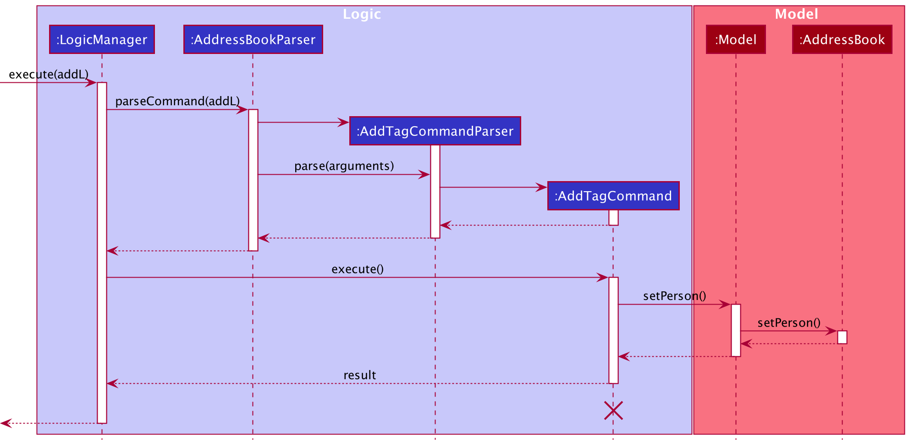
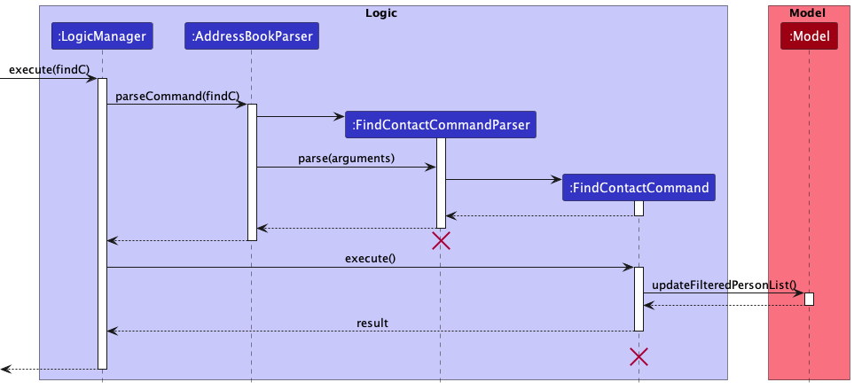
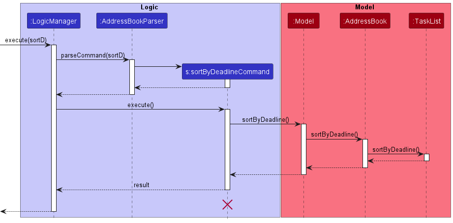

* Table of Contents
{:toc}

--------------------------------------------------------------------------------------------------------------------

## **Acknowledgements**

* {list here sources of all reused/adapted ideas, code, documentation, and third-party libraries -- include links to the original source as well}

--------------------------------------------------------------------------------------------------------------------

## **Setting up, getting started**

Refer to the guide [_Setting up and getting started_](SettingUp.md).

--------------------------------------------------------------------------------------------------------------------

## **Design**

:bulb: **Tip:** The `.puml` files used to create diagrams in this document can be found in the [diagrams](https://github.com/se-edu/addressbook-level3/tree/master/docs/diagrams/) folder. Refer to the [_PlantUML Tutorial_ at se-edu/guides](https://se-education.org/guides/tutorials/plantUml.html) to learn how to create and edit diagrams.

### Architecture

The ***Architecture Diagram*** given above explains the high-level design of the App.

Given below is a quick overview of main components and how they interact with each other.

**Main components of the architecture**

**`Main`** has two classes called [`Main`](https://github.com/se-edu/addressbook-level3/tree/master/src/main/java/seedu/address/Main.java) and [`MainApp`](https://github.com/se-edu/addressbook-level3/tree/master/src/main/java/seedu/address/MainApp.java). It is responsible for,
* At app launch: Initializes the components in the correct sequence, and connects them up with each other.
* At shut down: Shuts down the components and invokes cleanup methods where necessary.

[**`Commons`**](#common-classes) represents a collection of classes used by multiple other components.

The rest of the App consists of four components.

* [**`UI`**](#ui-component): The UI of the App.
* [**`Logic`**](#logic-component): The command executor.
* [**`Model`**](#model-component): Holds the data of the App in memory.
* [**`Storage`**](#storage-component): Reads data from, and writes data to, the hard disk.

**How the architecture components interact with each other**

The *Sequence Diagram* below shows how the components interact with each other for the scenario where the user issues the command `delete 1`.

Each of the four main components (also shown in the diagram above),

* defines its *API* in an `interface` with the same name as the Component.
* implements its functionality using a concrete `{Component Name}Manager` class (which follows the corresponding API `interface` mentioned in the previous point.

For example, the `Logic` component defines its API in the `Logic.java` interface and implements its functionality using the `LogicManager.java` class which follows the `Logic` interface. Other components interact with a given component through its interface rather than the concrete class (reason: to prevent outside component's being coupled to the implementation of a component), as illustrated in the (partial) class diagram below.

The sections below give more details of each component.

### UI component

The **API** of this component is specified in [`Ui.java`](https://github.com/se-edu/addressbook-level3/tree/master/src/main/java/seedu/address/ui/Ui.java)

The UI consists of a `MainWindow` that is made up of parts e.g.`CommandBox`, `ResultDisplay`, `PersonListPanel`, `StatusBarFooter` etc. All these, including the `MainWindow`, inherit from the abstract `UiPart` class which captures the commonalities between classes that represent parts of the visible GUI.

The `UI` component uses the JavaFx UI framework. The layout of these UI parts are defined in matching `.fxml` files that are in the `src/main/resources/view` folder. For example, the layout of the [`MainWindow`](https://github.com/se-edu/addressbook-level3/tree/master/src/main/java/seedu/address/ui/MainWindow.java) is specified in [`MainWindow.fxml`](https://github.com/se-edu/addressbook-level3/tree/master/src/main/resources/view/MainWindow.fxml)

The `UI` component,

* executes user commands using the `Logic` component.
* listens for changes to `Model` data so that the UI can be updated with the modified data.
* keeps a reference to the `Logic` component, because the `UI` relies on the `Logic` to execute commands.
* depends on some classes in the `Model` component, as it displays `Person` object residing in the `Model`.

### Logic component

**API** : [`Logic.java`](https://github.com/se-edu/addressbook-level3/tree/master/src/main/java/seedu/address/logic/Logic.java)

Here's a (partial) class diagram of the `Logic` component:

How the `Logic` component works:
1. When `Logic` is called upon to execute a command, it uses the `AddressBookParser` class to parse the user command.
1. This results in a `Command` object (more precisely, an object of one of its subclasses e.g., `AddCommand`) which is executed by the `LogicManager`.
1. The command can communicate with the `Model` when it is executed (e.g. to add a person).
1. The result of the command execution is encapsulated as a `CommandResult` object which is returned back from `Logic`.

The Sequence Diagram below illustrates the interactions within the `Logic` component for the `execute("delete 1")` API call.

:information_source: **Note:** The lifeline for `DeleteCommandParser` should end at the destroy marker (X) but due to a limitation of PlantUML, the lifeline reaches the end of diagram.

Here are the other classes in `Logic` (omitted from the class diagram above) that are used for parsing a user command:

How the parsing works:
* When called upon to parse a user command, the `AddressBookParser` class creates an `XYZCommandParser` (`XYZ` is a placeholder for the specific command name e.g., `AddCommandParser`) which uses the other classes shown above to parse the user command and create a `XYZCommand` object (e.g., `AddCommand`) which the `AddressBookParser` returns back as a `Command` object.
* All `XYZCommandParser` classes (e.g., `AddCommandParser`, `DeleteCommandParser`, ...) inherit from the `Parser` interface so that they can be treated similarly where possible e.g, during testing.

### Model component
**API** : [`Model.java`](https://github.com/se-edu/addressbook-level3/tree/master/src/main/java/seedu/address/model/Model.java)

The `Model` component,

* stores the address book data i.e., all `Person` objects (which are contained in a `UniquePersonList` object).
* stores the currently 'selected' `Person` objects (e.g., results of a search query) as a separate _filtered_ list which is exposed to outsiders as an unmodifiable `ObservableList<Person>` that can be 'observed' e.g. the UI can be bound to this list so that the UI automatically updates when the data in the list change.
* stores a `UserPref` object that represents the user’s preferences. This is exposed to the outside as a `ReadOnlyUserPref` objects.
* does not depend on any of the other three components (as the `Model` represents data entities of the domain, they should make sense on their own without depending on other components)

:information_source: **Note:** An alternative (arguably, a more OOP) model is given below. It has a `Tag` list in the `AddressBook`, which `Person` references. This allows `AddressBook` to only require one `Tag` object per unique tag, instead of each `Person` needing their own `Tag` objects. 

### Storage component

**API** : [`Storage.java`](https://github.com/se-edu/addressbook-level3/tree/master/src/main/java/seedu/address/storage/Storage.java)

The `Storage` component,
* can save both address book data and user preference data in json format, and read them back into corresponding objects.
* inherits from both `AddressBookStorage` and `UserPrefStorage`, which means it can be treated as either one (if only the functionality of only one is needed).
* depends on some classes in the `Model` component (because the `Storage` component's job is to save/retrieve objects that belong to the `Model`)

### Common classes

Classes used by multiple components are in the `seedu.addressbook.commons` package.

--------------------------------------------------------------------------------------------------------------------

## **Implementation**

This section describes some noteworthy details on how certain features are implemented.

### \[Proposed\] Add/delete tag feature

#### Proposed Implementation

The proposed add/delete tag mechanism operates for both contacts and tasks in YellowBook.

Every instance of AddTagCommand and DeleteTagCommand is created with two booleans.
For AddTagCommand, they are addTagToTask and addTagToContact. 
For DeleteTagCommand, they are removeTagFromTask and removeTagFromContact.
Only one of these booleans will be true. Otherwise, an exception is thrown.

Depending on the status of these booleans, an EditTaskDescriptor or EditPersonDescriptor is created respectively.

This descriptor object is then used to modify the list of tags attached to the selected task/contact. 

A new contact/task is created, with all attributes copied over from the original person, except for the list of tags, where the modified version is used.

This contact/task then replaces the previous contact/task in the YellowBook via `AddressBook#setPerson()`.

Given below is an example usage scenario and how the add/delete tag mechanism behaves at each step.

Step 1. The user executes `addL c/1 t/CS2103T` to add the tag "CS2103T" to the first contact in the contact list. 

:information_source: **Note:** The above command will fail if the contact list is empty. An error message will be displayed informing the user.

Step 2. The user now decides that adding the tag was a mistake, and decides to undo that action by executing `deleteT c/1 l/CS2103T`.

:information_source: **Note:** The tag provided in the `deleteL` command must be an exact match for that provided in the `addL` command. Matching is case-sensitive. Otherwise, YellowBook will display an error message stating that no such tag is present on the selected user.

The following sequence diagram shows how the undo operation works:

:information_source: **Note:** The lifeline for `UndoCommand` should end at the destroy marker (X) but due to a limitation of PlantUML, the lifeline reaches the end of diagram.

#### Design considerations:

**Aspect: How undo & redo executes:**

* **Alternative 1 (current choice):** Implement a static class to edit tag list.
  * Pros: Preserves immutability of Contact and Task. 
  * Cons: Longer code, requires writing a new class.
  
* **Alternative 2:** Use the existing EditContact and EditTask classes.
    * Pros: Requires no additional code.
    * Cons: Increases coupling. Will fail if the associated classes stop working.

### Find contact feature

#### Implementation

The sort mechanism is facilitated by `PersonContainsKeywordsPredicate`. It implements `Predicate<Person>`, which means it is a functional interface that tests a person object against a condition. The `test` method returns true if the person object contains all the keywords given by the user.

Step 1. The user enters with findC command with one or more of the contact's fields as parameters (e.g. name, address, phone, email)

Step 2. The `FindCommandParser` class parses the user input and creates a `PersonContainsKeywordsPredicate` object with the given parameters. 

Step 3. The `FindCommand` class then calls the `Model#updateFilteredPersonList()` method with the predicate object as the parameter. 

Step 4. The `Model` class then updates the filtered list of contacts in the `AddressBook` class.

Given below is an example usage scenario and how the find mechanism behaves at each step.

#### Design considerations:

**Aspect: How the paramters supplied are matched to contact fields:**

* **Alternative 1 (current choice):** Matches individual words in the parameter to the contact fields (case insensitive)
    * Pros: Users are able to make more generic searches as only one word needs to match.
    * Cons: Results are less precise as users are unable to search multi-word strings.

* **Alternative 2:** Allow users to specify which keywords are to be matched individually/multi-word strings
    * Pros: Allow more precise searches.
    * Cons: User needs to remember additional syntax.
    * Cons: More complex implementation.

### Sort feature

#### Implementation

The sort mechanism is facilitated by `TaskList` with the sorting status stored internally as `isSortByDeadline`. It implements the following operations:

* `TaskList#sortByDeadline()` — Sorts the task list by deadline.
* `TaskList#sortById()` — Sorts the task list by id, which is the order the tasks were added in.

The two operations are exposed in the `Model` interface as `Model#sortByDeadline()` and `Model#sortById()` respectively.

Given below is an example usage scenario and how the sort mechanism behaves at each step.

Step 1. The user launches the application with some tasks in the task list already.

Step 2. The user executes `sortD` command to sort the task list by deadline. The `sortD` command calls `Model#sortByDeadline()`, causing the task list to sort by deadline.
The following sequence diagram shows how the sort by deadline operation works:

Step 3. The user has seen the most urgent tasks to be completed but realises that there is one more task that has not been added. The user executes `addT d/do …` to add a new task.  The `addT` command eventually calls `TaskList#sortByDeadline()` to sort the task list after adding the new task.

Step 4. The user now decides that the initial order of the task list looks much better after finding out the tasks to do. The user executes `sortI` to sort the task list by id. The `sortI` command calls `Model#sortById()` to sort the task list based on id. 

#### Design considerations:

**Aspect: How the sort methods executes:**

* **Alternative 1 (current choice):** Saves the sorting status after sorting
  * Pros: Only need to enter sort command once for task list to permanently be sorted even when the task list is modified.
  * Cons: Harder to implement as other task list need to be updated constantly to ensure sorting order.

* **Alternative 2:** Don't save the sorting status and just sort once
  * Pros: Easy to implement.
  * Cons: Need to type a sort command each time the list is changed to preserve sorting order. 

--------------------------------------------------------------------------------------------------------------------

## **Documentation, logging, testing, configuration, dev-ops**

* [Documentation guide](Documentation.md)
* [Testing guide](Testing.md)
* [Logging guide](Logging.md)
* [Configuration guide](Configuration.md)
* [DevOps guide](DevOps.md)

--------------------------------------------------------------------------------------------------------------------

## **Appendix: Requirements**

### Product scope

**Target user profile**:

* is a university student
* is involved in many projects
* has a need to manage a significant number of project contacts and tasks
* prefer desktop apps over other types
* can type fast
* prefers typing to mouse interactions
* is reasonably comfortable using CLI apps

**Value proposition**: 

* manage project contacts and tasks faster than a typical mouse/GUI driven app
* manage many group projects at the same time
* provide a central location for managing project contacts and tasks together
* track progress on various tasks to ensure milestones are met

### User stories

Priorities: High (must have) - `* * *`, Medium (nice to have) - `* *`, Low (unlikely to have) - `*`

| Priority | As a …​                                    | I want to …​                     | So that I can…​                                                                      |
| -------- | ------------------------------------------ | ------------------------------ | ------------------------------------------------------------------------------------ |
| `* * *`  | technically competent student who prefers typing to clicking | have a CLI   | perform operations quickly | 
| `* * *`  | student who is part of many group projects | keep track of the contact information of my groupmates | communicate with my team |
| `* * *`  | student who is part of many group projects | track the progress of each group towards its goals | know if everyone is putting in their share of work |
| `* * *`  | student who often has to email others | store people’s emails    | remember their emails | 
| `* * *`  | student who prefers calling                | see the person’s phone number  | call them |
| `* * *`  | student who prefers visiting someone in person |  see the person’s address  | visit them |
| `* * *`  | SWE student                                | save the github usernames of my contacts | view their repo |
| `* * *`  | student                                    | edit the information on people’s profiles | update the information when necessary | 
| `* * *`  | student who pefers a compact social circle | delete contacts                | stop keeping old contacts |
| `* * *`  | team leader                                | add and remove people from a project when forming the project group | know who is part of the project group |
| `* * *`  | team leader                                | remove a project and the people associated with it once the project is done | avoid cluttering my workspace |
| `* * *`  | team member                                | group contacts                 | know which people are involved in which projects | 
| `* * *`  | team member                                | give status updates on individual tasks | inform the group on my progress |
| `* * *`  | forgetful student                          | keep track of my tasks         | know which tasks need to be completed |
| `* * *`  | forgetful student                          | mark tasks as complete         | know if I have completed the task already | 
| `* * *`  | forgetful student                          | note the deadline of my tasks  | complete my tasks on time | 
| `* * *`  | forgetful person                           | save people’s profiles with photos | remember their names | 
| `* * *`  | forgetful person                           | keep notes on the people I’ve met | remember important things about them | 
| `* *`    | team leader                                | see my team’s progress towards completing their assigned tasks | know if my team is on track |
| `* *`    | team leader                                | assign tasks to my team members | divide the work efficiently |
| `* *`    | team leader                                | archive a project and the people associated with it once the project is done | avoid cluttering my workspace|
| `* *`    | team member                                | send reminders to other team members | remind them to do their work | 
| `* *`    | team member                                | use an idea board | generate inspiration with my teammates | 
| `* *`    | anxious student                            | see the percentage completion of the tasks | feel at ease | 
| `* *`    | anxious student                            | see if I am on track with my deadlines | be assured that my tasks are not behind schedule | 
| `* *`    | forgetful student                          | be reminded of upcoming deadlines | ensure that I won't miss them | 
| `* *`    | artistic student                           | change the colour palette of my UI to my preference | enjoy looking at the UI | 
| `* *`    | student with color blindness               | have my software be composed of minimal colors | distinguish all elements |
| `* *`    | student who does work late at night        | use dark mode                  | choose not to strain my eyes | 
| `*`      | student who struggles with remembering identities | add nicknames to my contacts | better identify them |
| `*`      | student who prefers pen and paper          | print out my tasks             | annotate on it physically | 
| `*`      | artistic student                           | have the software I use to look aesthetic | enjoy using them |
| `*`      | student who is bad with names              | see the person’s first name emphasized | know how to address the person| 
| `*`      | student with poor eyesight                 | ensure that my software have big fonts and large buttons | distinguish all elements | 
| `*`      | animal loving person                       | have some cute animals in the background | feel entertained while managing my tasks | 

### Use cases

(For all use cases below, the **System** is the `YellowBook` and the **Actor** is the `user`, unless specified otherwise)

**Use case: Add a contact**

**MSS**

1.  User request to add a contact
2.  YellowBook adds the contact

    Use case ends.
    
**Extensions**

* 1a. The details of the contact are incomplete.
     
    * 1a1. YellowBook shows an error message.

	     Use case ends.
    
* 1b. The contact given already exists.
	   
    * 1b1. YellowBook shows an error message.
  
      Use case ends.

**Use case: Delete a person**

**MSS**

1.  User requests to list persons
2.  YellowBook shows a list of persons
3.  User requests to delete a specific person in the list
4.  AddressBook deletes the person

    Use case ends.

**Extensions**

* 2a. The list is empty.

  Use case ends.

* 3a. The given index is invalid.

    * 3a1. YellowBook shows an error message.

      Use case resumes at step 2.

**Use case: Add a task**

**MSS**

1.  User requests to list tasks
2.  YellowBook shows a list of tasks
3.  User requests to delete a specific task in the list
4.  YellowBook deletes the task

    Use case ends.

**Extensions**

* 2a. The list is empty.

  Use case ends.

* 3a. The given index is invalid.

    * 3a1. YellowBook shows an error message.

      Use case resumes at step 2.

**Use case: Add a task**

**MSS**

1.  User requests to list tasks
2.  YellowBook shows a list of tasks
3.  User requests to add a task to the list
4.  YellowBook adds the task to the end of the list

    Use case ends.

**Extensions**

* 3a. The user gives an invalid date format.

    * 3a1. YellowBook shows an error message.

      Use case resumes at step 2.

* 3a. The user does not provide a task description.

    * 3a1. YellowBook shows an error message.

      Use case resumes at step 2.

**Use case: Delete a task**

**MSS**

1.  User requests to list tasks
2.  YellowBook shows a list of tasks
3.  User requests to delete a specific task in the list
4.  YellowBook deletes the task

    Use case ends.

**Extensions**

* 2a. The list is empty.

  Use case ends.

* 3a. The given index is invalid.

    * 3a1. YellowBook shows an error message.

      Use case resumes at step 2.

**Use case: Mark a task**

**MSS**

1. User requests to list tasks
2. YellowBook shows a list of tasks
3. User requests to mark a specific task in the list
4. YellowBook marks that task as done

    Use case ends.

**Extensions**

* 2a. The list is empty.

  Use case ends.

* 3a. The given index is invalid.

    * 3a1. YellowBook shows an error message.

      Use case resumes at step 2.

**MSS**

1. User requests to list tasks
2. YellowBook shows a list of tasks
3. User requests to find a task tagged to specific contact
4. YellowBook shows a list of task tagged to that contact

   Use case ends.

**Extensions**

* 2a. The list is empty.

  Use case ends.

* 3a. There is no contact matching specified keywords.

    * 3a1. YellowBook shows an error message.

      Use case resumes at step 2.

**Use case: Add a label to an existing task**

**MSS**

1. User requests to list tasks
2. YellowBook shows a list of tasks
3. User requests to tag a specific task in the list with a label
4. YellowBook tags the task with specified label

    Use case ends.

**Extensions**

* 2a. The list is empty.

  Use case ends.

* 3a. The given index is invalid.

    * 3a1. YellowBook shows an error message.

      Use case resumes at step 2.

  
*{More to be added}*

### Non-Functional Requirements

1. Should work on any _mainstream OS_ as long as it has Java `11` or above installed.
2. Should be able to hold up to 30,000 persons without a _noticeable sluggishness_ in performance for typical usage.
3. Should be able to hold up to 30,000 tasks without a _noticeable sluggishness_ in performance for typical usage.
4. A user with _above average typing speed_ for _regular text_ should be able to accomplish 
most of the tasks faster using commands than using the mouse.
5. Contact/task/tag names should contain alphanumeric characters and/or spaces and/or symbols.
6. Contact/task/tag names should be case-insensitive.
7. Contact phone numbers should contain numbers only.
8. Should be usable by first-time user without referencing external guides.
9. GUI should be usable by colour blind users.
10. Should work on both 32-bit and 64-bit environments.
11. GUI should appear as-designed on screens with resolutions from 1024x576 to 3840x2160.
12. Should display a visual prompt when YellowBook is processing an user input.
13. The project is expected to deliver a _new iteration_ every 2 weeks.
14. Should work without an active internet connection.
15. Data files from YellowBook v1.1 onwards should be compatible with the future versions.

*{More to be added}*

### Glossary

* **Mainstream OS**: Windows, Linux, Unix, OS-X
* **Private contact detail**: A contact detail that is not meant to be shared with others
* **New iteration**: A working MVP
* **Noticeable sluggishness**: 50-150ms, which is the average latency range for most sites
* **Above average typing speed**: 65 to 70 words per minute, well above the average of 40 words per minute
* **Regular text**: English words, excluding code and system admin commands

--------------------------------------------------------------------------------------------------------------------

## **Appendix: Instructions for manual testing**

Given below are instructions to test the app manually.

:information_source: **Note:** These instructions only provide a starting point for testers to work on;
testers are expected to do more *exploratory* testing.

### Launch and shutdown

1. Initial launch

   1. Download the jar file and copy into an empty folder

   1. Double-click the jar file Expected: Shows the GUI with a set of sample contacts. The window size may not be optimum.

1. Saving window preferences

   1. Resize the window to an optimum size. Move the window to a different location. Close the window.

   1. Re-launch the app by double-clicking the jar file. 
       Expected: The most recent window size and location is retained.

1. _{ more test cases …​ }_

### Deleting a person

1. Deleting a person while all persons are being shown

   1. Prerequisites: List all persons using the `list` command. Multiple persons in the list.

   1. Test case: `delete 1` 
      Expected: First contact is deleted from the list. Details of the deleted contact shown in the status message. Timestamp in the status bar is updated.

   1. Test case: `delete 0` 
      Expected: No person is deleted. Error details shown in the status message. Status bar remains the same.

   1. Other incorrect delete commands to try: `delete`, `delete x`, `...` (where x is larger than the list size) 
      Expected: Similar to previous.

1. _{ more test cases …​ }_

### Saving data

1. Dealing with missing/corrupted data files

   1. _{explain how to simulate a missing/corrupted file, and the expected behavior}_

1. _{ more test cases …​ }_
