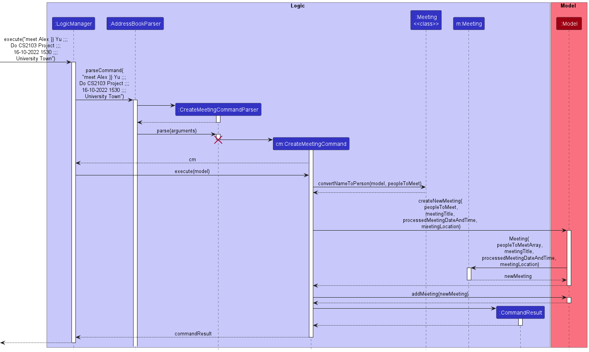
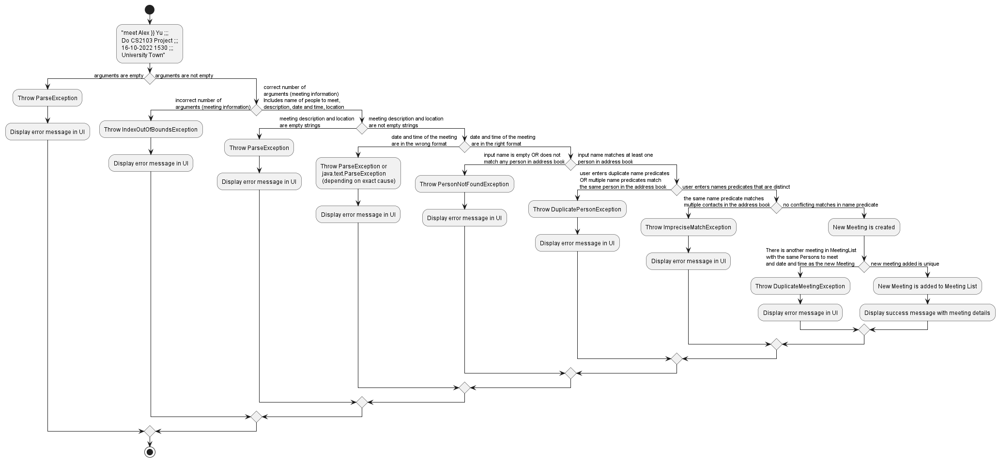
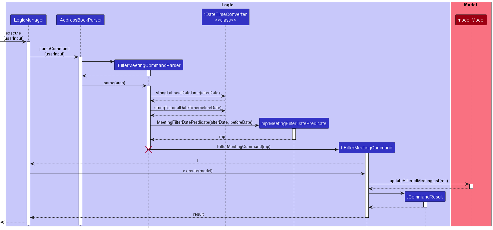

* Table of Contents
{:toc}

--------------------------------------------------------------------------------------------------------------------

## **Acknowledgements**

* {list here sources of all reused/adapted ideas, code, documentation, and third-party libraries -- include links to the original source as well}

--------------------------------------------------------------------------------------------------------------------

## **Setting up, getting started**

Refer to the guide [_Setting up and getting started_](SettingUp.md).

--------------------------------------------------------------------------------------------------------------------

## **Design**

<div markdown="span" class="alert alert-primary">

:bulb: **Tip:** The `.puml` files used to create diagrams in this document can be found in the [diagrams](https://github.com/se-edu/addressbook-level3/tree/master/docs/diagrams/) folder. Refer to the [_PlantUML Tutorial_ at se-edu/guides](https://se-education.org/guides/tutorials/plantUml.html) to learn how to create and edit diagrams.
</div>

### Architecture


The ***Architecture Diagram*** given above explains the high-level design of the App.

Given below is a quick overview of main components and how they interact with each other.

**Main components of the architecture**

**`Main`** has two classes called [`Main`](https://github.com/se-edu/addressbook-level3/tree/master/src/main/java/seedu/address/Main.java) and [`MainApp`](https://github.com/se-edu/addressbook-level3/tree/master/src/main/java/seedu/address/MainApp.java). It is responsible for,
* At app launch: Initializes the components in the correct sequence, and connects them up with each other.
* At shut down: Shuts down the components and invokes cleanup methods where necessary.

[**`Commons`**](#common-classes) represents a collection of classes used by multiple other components.

The rest of the App consists of four components.

* [**`UI`**](#ui-component): The UI of the App.
* [**`Logic`**](#logic-component): The command executor.
* [**`Model`**](#model-component): Holds the data of the App in memory.
* [**`Storage`**](#storage-component): Reads data from, and writes data to, the hard disk.


**How the architecture components interact with each other**

The *Sequence Diagram* below shows how the components interact with each other for the scenario where the user issues the command `delete 1`.


Each of the four main components (also shown in the diagram above),

* defines its *API* in an `interface` with the same name as the Component.
* implements its functionality using a concrete `{Component Name}Manager` class (which follows the corresponding API `interface` mentioned in the previous point.

For example, the `Logic` component defines its API in the `Logic.java` interface and implements its functionality using the `LogicManager.java` class which follows the `Logic` interface. Other components interact with a given component through its interface rather than the concrete class (reason: to prevent outside component's being coupled to the implementation of a component), as illustrated in the (partial) class diagram below.


The sections below give more details of each component.

### UI component

The **API** of this component is specified in [`Ui.java`](https://github.com/se-edu/addressbook-level3/tree/master/src/main/java/seedu/address/ui/Ui.java)


The UI consists of a `MainWindow` that is made up of parts e.g.`CommandBox`, `ResultDisplay`, `PersonListPanel`, `StatusBarFooter` etc. All these, including the `MainWindow`, inherit from the abstract `UiPart` class which captures the commonalities between classes that represent parts of the visible GUI.

The `UI` component uses the JavaFx UI framework. The layout of these UI parts are defined in matching `.fxml` files that are in the `src/main/resources/view` folder. For example, the layout of the [`MainWindow`](https://github.com/se-edu/addressbook-level3/tree/master/src/main/java/seedu/address/ui/MainWindow.java) is specified in [`MainWindow.fxml`](https://github.com/se-edu/addressbook-level3/tree/master/src/main/resources/view/MainWindow.fxml)

The `UI` component,

* executes user commands using the `Logic` component.
* listens for changes to `Model` data so that the UI can be updated with the modified data.
* keeps a reference to the `Logic` component, because the `UI` relies on the `Logic` to execute commands.
* depends on some classes in the `Model` component, as it displays `Person` object and `Meeting` object residing in the `Model`.

### Logic component

**API** : [`Logic.java`](https://github.com/se-edu/addressbook-level3/tree/master/src/main/java/seedu/address/logic/Logic.java)

Here's a (partial) class diagram of the `Logic` component:


How the `Logic` component works:
1. When `Logic` is called upon to execute a command, it uses the `AddressBookParser` class to parse the user command.
1. This results in a `Command` object (more precisely, an object of one of its subclasses e.g., `AddCommand`) which is executed by the `LogicManager`.
1. The command can communicate with the `Model` when it is executed (e.g. to add a person).
1. The result of the command execution is encapsulated as a `CommandResult` object which is returned back from `Logic`.

The Sequence Diagram below illustrates the interactions within the `Logic` component for the `execute("delete 1")` API call.


<div markdown="span" class="alert alert-info">:information_source: **Note:** The lifeline for `DeleteCommandParser` should end at the destroy marker (X) but due to a limitation of PlantUML, the lifeline reaches the end of diagram.
</div>

Here are the other classes in `Logic` (omitted from the class diagram above) that are used for parsing a user command:


How the parsing works:
* When called upon to parse a user command, the `AddressBookParser` class creates an `XYZCommandParser` (`XYZ` is a placeholder for the specific command name e.g., `AddCommandParser`) which uses the other classes shown above to parse the user command and create a `XYZCommand` object (e.g., `AddCommand`) which the `AddressBookParser` returns back as a `Command` object.
* All `XYZCommandParser` classes (e.g., `AddCommandParser`, `DeleteCommandParser`, ...) inherit from the `Parser` interface so that they can be treated similarly where possible e.g, during testing.

### Model component
**API** : [`Model.java`](https://github.com/se-edu/addressbook-level3/tree/master/src/main/java/seedu/address/model/Model.java)


The `Model` component,

* stores the address book data i.e., all `Person` objects (which are contained in a `UniquePersonList` object).
* stores the currently 'selected' `Person` objects (e.g., results of a search query) as a separate _filtered_ list which is exposed to outsiders as an unmodifiable `ObservableList<Person>` that can be 'observed' e.g. the UI can be bound to this list so that the UI automatically updates when the data in the list change.
* stores a `UserPref` object that represents the user’s preferences. This is exposed to the outside as a `ReadOnlyUserPref` objects.
* does not depend on any of the other three components (as the `Model` represents data entities of the domain, they should make sense on their own without depending on other components)

<div markdown="span" class="alert alert-info">:information_source: **Note:** An alternative (arguably, a more OOP) model is given below. It has a `Tag` list in the `AddressBook`, which `Person` references. This allows `AddressBook` to only require one `Tag` object per unique tag, instead of each `Person` needing their own `Tag` objects.<br>


</div>


### Storage component

**API** : [`Storage.java`](https://github.com/se-edu/addressbook-level3/tree/master/src/main/java/seedu/address/storage/Storage.java)


The `Storage` component,
* can save both address book data, meeting list data and user preference data in json format, and read them back into corresponding objects.
* inherits from both `AddressBookStorage`, `MeetingListStorage` and `UserPrefStorage`, which means it can be treated as either one (if only the functionality of only one is needed).
* depends on some classes in the `Model` component (because the `Storage` component's job is to save/retrieve objects that belong to the `Model`)

### Common classes

Classes used by multiple components are in the `seedu.addressbook.commons` package.

--------------------------------------------------------------------------------------------------------------------

## **Implementation**

This section describes some noteworthy details on how certain features are implemented.

### [Implemented] Create Meetings with Persons in the Address Book
#### Implementation

The command to create meetings consists of these various classes:
- Class `CreateMeetingCommand` which extends the abstract class `Command`
- Class `CreateMeetingCommandParser` which implements the interface `Parser<CreateMeetingCommand>`
- Class `Meeting`
- Interface `ReadOnlyMeetingList`
- Class `MeetingList` which implements the interface `ReadOnlyMeetingList`
- Class `UniqueMeetingList` which implements the interface `Iterable<Meeting>`

As with all other commands in Yellow Pages, the create meeting feature contains a subclass of `Parser` which is
involved in `AddressBookParser` and a subclass of `Command` that returns an appropriate new `CommandResult` Object.

Creating the `ReadOnlyMeetingList` interface and implementing it in the class `MeetingList` allows meetings to be stored
can be stored in a system similar to how Persons are stored in the `Addressbook`, which involves a set of list methods
similar to those in `AddressBook`. `MeetingList` allows meetings to be stored in a centralised location while the 
software is running. 

The class `UniqueMeetingList` mirrors the class `UniquePersonList`, where a list of distinct meetings are stored in 
an `ObservableList<Meeting>`. Every distinct `Meeting` Object created will be stored in a `UniqueMeetingList` 
encapsulated by `MeetingList`.

The class `Meeting` encapsulates the information of a meeting created by the user, which includes:
- `peopleToMeetArray`: an `ArrayList` of the Persons to meet
- `peopleToMeetList`: a `UniquePersonList` of the Persons to meet
- `meetingDescription`: a `String` containing the title/ description of the meeting
- `meetingDateAndTime`: a `String` containing the date and time of the meeting
- `meetingLocation`: a `String` containing the location of the meeting

Command: `<Names of people to meet (from address book, split names by }} )> ;;; <Title of meeting> ;;; 
<Date and time of meeting (in dd-MM-yyyy HHmm format, time is optional)> ;;; <location of meeting>`

Example:
`meet Alex Yeoh }} Bernice Yu ;;; Study Session ;;; 06-10-2022 2015 ;;; UTown`

Primarily there are 6 main cases for this command:
- The name(s) input by the user match existing Person(s) in the `AddressBook` 
and the date and time of the meeting in the user input is in the correct format
-- this is the intended usage of the command and a new Meeting object is created
1. Arguments after the command word `meet` is empty
-- Throws a `ParseException` and an error message will be displayed
2. Name of person to meet does not match any name in the `AddressBook `
-- Throws a `PersonNotFoundException` and an error message will be displayed
3. The date and time of the meeting is not in `dd-MM-yyyy HHmm (time is optional) format`
  -- Throws a `ParseException` and an error message will be displayed
4. The user adds duplicate Persons to meet to the meeting
  -- Throws a `DuplicatePersonException` and an error message will be displayed
5. The user adds the wrong number of information to the create meeting command
  -- Throws an `IndexOutOfBoundsException` and an error message will be displayed
6. The user adds a meeting with the same Persons and at the same date and time as an existing meeting
  -- Throws a `DuplicateMeetingException` and an error message will be displayed


The diagrams below should sufficiently explain the main cases for the command.


#### Sequence Diagram for Creating New Meetings


#### Activity Diagram for Creating New Meetings


### [Implemented] Storage for meetings
#### Implementation


The implementation of the storage for meetings closely follows the way address book was implemented. There were many classes 
that had to be copied, and they included
- `MeetingList`
- `ReadOnlyMeetingList`
- `JsonMeetingListStorage`
- `JsonAdaptedMeeting`
- `JsonSerializableMeetingList`
- `MeetingListStorage`

The following classes had to be extended in order to support meeting list
- `MainApp`
- `UserPrefs`
- `ReadOnlyUserPrefs`
- `SampleDataUtil`
- `Storage`
- `StorageManager`
- `Model`
- `ModelManager`
- `Logic`
- `LogicManager`
- `AddressBookParser`

The app maintained its own internal list of meetings in the `ModelManager` and the 
`LogicManager` would save the current model whenever the execute function to the `meetinglist.json`. As such, there
was no need of having to create additional classes to support the model or logic classes


### [Implemented] Filter Meetings between Dates
#### Implementation

The filter meetings between dates command consists of these various classes:
- `FilterMeetingCommand` which extends `Command`
- `FilterMeetingCommandParser` which extends `Parser<FilterMeetingCommand>`
- `MeetingFilterPredicate` which extends `Predicate<Meeting>`

As with all other commands in Yellow Pages, find meetings has a `Parser` subclass, namely `FilterMeetingCommandParser`
which parses the user input and returns a `FilterMeetingCommand` object with a `new MeetingFilterPredicate` that contains the 
"verified" user inputs. Utilizing the `Predicate` system allows the 
command to simply offer up a new `Predicate` object. In this case, it is simply a predicate checking if each Meeting 
Object's date is between two given dates. This `MeetingFilterDatePredicate` is then used to update the
`filteredMeetings` list in the `ModelManager`, allowing it to temporarily store and display the meetings matching the `MeetingFilterDatePredicate`.

The `FilterMeetingCommandParser` class utilizes a utility class called `DateTimeConverter`. The `FilterMeetingCommandParser` class converts the 
DateTime values from the Meeting which is stored as a `String` in the `EEEE, d MMMM uuuu hh:mm a` format into a `LocalDateTime` 
object for comparison with other dates.

Command: `filtermeetingsbetween Date A ;;; Date B`, both Date A and B must be real dates that follow the 
dd-MM-yyyy HHmm format.

Primarily there are three main cases for this command,
- `Date A < Date B` - this is the intended use of the command and will correctly display Meeting Object's whose dates 
are within the range of Date A and Date B. 
- `Date A = Date B` - while not being the intended use also works, and will display Meeting Objects whose
  date = Date A = Date B.
- `Date A > Date B` - will throw an error as this is an invalid syntax.


#### Sequence Diagram for Filter Meetings between Dates


### [Implemented] Find Meetings
#### Implementation
The find meetings command consists of these various classes:
- `FindMeetingCommand` which extends `Command`
- `FindMeetingCommandParser` which extends `Parser<FilterMeetingCommand>`
- `MeetingContainsKeywordsPredicate` which extends `Predicate<Meeting>`
- `FindMeetingFunctionalInterface`which acts as a Functional Interface to pass functions as parameters.


As with all other commands in Yellow Pages, find meetings has a `Parser` subclass, namely `FindMeetingCommandParser`
which parses the user input and returns a `FindMeetingCommand` object with a `new MeetingContainsKeywordsPredicate` that 
contains the following parameters: 
- Array of Keywords entered by the user
- One of three `static` Functional Interfaces which are:
  - `Meeting::getDescription`
  - `Meeting::getLocation`
  - `Meeting::getPeopleToMeetAsString`

Utilizing the `Predicate` system allows the command to simply offer up a new `Predicate` object. 
In this case, it is a predicate checking if one of a Meeting Object's fields (corresponding to the Functional Interfaces) matches a keyword. 
This `MeetingContainsKeywordsPredicate` is then used to update the `filteredMeetings` list in the `ModelManager`, 
allowing it to temporarily store and display the meetings matching the `MeetingContainsKeywordsPredicate`.

The aforementioned `static` Functional Interfaces exist within the `FindMeetingCommand` class, 
these interfaces are used to indicate which Meeting field (description, location and people) to search the keywords provided in.
This implementation raises two important questions:
#### 1. Why are they static?
   
`static` values were used instead of creating new Functional Interface Objects each time primarily because of limitations in Java. 
Namely, Java is unable to compare two Functional Interface Objects unless they are the same Object. This affected Unit Testing
as without comparison, we would never be able to test if two `MeetingContainsKeywordsPredicate` were the same. Utilizing static
Functional Interfaces allowed us to compare these two of them together and provide higher quality tests.

#### 2. Why use functional interfaces?

Functional Interfaces were used as a means to parameterize various getter functions from the Meeting Class.
This allows the `MeetingContainsKeywordsPredicate` to directly use the function instead of relying on identities and conditional 
statements to locate the correct Meeting field. In way this can be seen as an application of _defensive programming_, whereby the use 
of Functional Interfaces limit the chances of things going wrong. Using Functional Interfaces implies that any errors/bugs that happen 
in regard to the wrong Meeting field to select lay solely in the `FindMeetingCommandParser` passing the wrong parameters. Furthermore, this 
implementation aids in scalability of the Meeting Object, adding more fields to a Meeting just requires us to declare a new 
`static` Functional Interface with the appropriate field and to update the `verifyParameters` function.

#### Sequence Diagram for Find Meeting
**Note**: `lambda` refers to a Functional Interface.


### [Implemented] Sort Meetings

The sort meetings command consists of these various classes:
- `SortMeetingCommand` which extends `Command`
- `SortMeetingCommandParser` which extends `Parser<FilterMeetingCommand>`

Like all other commands in Yellow Pages, sort meetings has a `Parser` subclass, namely `SortMeetingCommandParser`
which parses the user input and returns a `SortMeetingCommand` with a boolean parameter `isInAscending` that indicates
whether to sort the meeting list in Ascending or Descending order.

Sort Meetings primarily uses Java's `List::sort` that `SortMeetingCommand` 
accesses through the `ObservableList<Meeting>` in the `Model`. 
It utilizes the `compareTo` method found in Meetings to compare two Meeting Objects by date. 
The comparator function used in the Sort is as follows:
```
public void sortByDate(boolean isInAscending) {
    //Ternary operator checks if isInAscending is true and negates the results if it is false
    internalList.sort((Meeting m1, Meeting m2) -> isInAscending
            ? m1.compareTo(m2)
            : -m1.compareTo(m2));
}
```

Note that the `isInAscending` value decides whether the `compareTo` result is negated. This implementation allowed
for the option of sorting Ascending (non-negated) and Descending (negated). Furthermore, calling the `sort` function 
in this manner allows us to make changes to the list **permanently** which is intended.

#### Sequence Diagram for Sort Meeting


### [Implemented] Edit Meeting Details
#### Implementation

The edit meeting details command consists of these various classes:
- `EditMeetingCommand` which extends `Command`
- `EditMeetingCommandParser` which extends `Parser<FilterMeetingCommand>`


As with all other commands in Yellow Pages, edit meeting has a `Parser` subclass that goes through the
`AddressBookParser` and a `Command` subclass that returns an appropriate new `CommandResult` Object.

`EditMeetingCommand` follows closely the implementation of the `EditCommand` where an `EditMeetingDescriptor` is created
where only the edit fields are filled in. Next, a new `Meeting` object is created where the contents in the non-null 
fields of the `EditMeetingDescriptor` are copied over, otherwise the contents of the field in the original `Meeting` 
object would be copied over. Lastly, this new `Meeting` object would replace the targeted Meeting, resulting in the 
relevant fields being updated.

Command: `editmeeting meeting index [d/description] [dd/DateAndTime] [l/location]`, DateAndTime must follow the
dd-MM-yyyy HHmm format. Do note that index starts from 1 starting from the first meeting listed. 

Primarily there are 3 cases for this command,
- all 3 fields are to be updated - e.g. `editmeeting 1 d/cs2104 dd/23-04-2022 l/nus 2334`
- only 2 fields are to be updated - e.g. `editmeeting 1 d/cs2105 l/ntu`
- only 1 field is to be updated - e.g. `editmeeting 1 d/cs2106`


### \[Proposed\] Undo/redo feature

#### Proposed Implementation

The proposed undo/redo mechanism is facilitated by `VersionedAddressBook`. It extends `AddressBook` with an undo/redo history, stored internally as an `addressBookStateList` and `currentStatePointer`. Additionally, it implements the following operations:

* `VersionedAddressBook#commit()` — Saves the current address book state in its history.
* `VersionedAddressBook#undo()` — Restores the previous address book state from its history.
* `VersionedAddressBook#redo()` — Restores a previously undone address book state from its history.

These operations are exposed in the `Model` interface as `Model#commitAddressBook()`, `Model#undoAddressBook()` and `Model#redoAddressBook()` respectively.

Given below is an example usage scenario and how the undo/redo mechanism behaves at each step.

Step 1. The user launches the application for the first time. The `VersionedAddressBook` will be initialized with the initial address book state, and the `currentStatePointer` pointing to that single address book state.


Step 2. The user executes `delete 5` command to delete the 5th person in the address book. The `delete` command calls `Model#commitAddressBook()`, causing the modified state of the address book after the `delete 5` command executes to be saved in the `addressBookStateList`, and the `currentStatePointer` is shifted to the newly inserted address book state.


Step 3. The user executes `add n/David …​` to add a new person. The `add` command also calls `Model#commitAddressBook()`, causing another modified address book state to be saved into the `addressBookStateList`.


<div markdown="span" class="alert alert-info">:information_source: **Note:** If a command fails its execution, it will not call `Model#commitAddressBook()`, so the address book state will not be saved into the `addressBookStateList`.

</div>

Step 4. The user now decides that adding the person was a mistake, and decides to undo that action by executing the `undo` command. The `undo` command will call `Model#undoAddressBook()`, which will shift the `currentStatePointer` once to the left, pointing it to the previous address book state, and restores the address book to that state.


<div markdown="span" class="alert alert-info">:information_source: **Note:** If the `currentStatePointer` is at index 0, pointing to the initial AddressBook state, then there are no previous AddressBook states to restore. The `undo` command uses `Model#canUndoAddressBook()` to check if this is the case. If so, it will return an error to the user rather
than attempting to perform the undo.

</div>

The following sequence diagram shows how the undo operation works:


<div markdown="span" class="alert alert-info">:information_source: **Note:** The lifeline for `UndoCommand` should end at the destroy marker (X) but due to a limitation of PlantUML, the lifeline reaches the end of diagram.

</div>

The `redo` command does the opposite — it calls `Model#redoAddressBook()`, which shifts the `currentStatePointer` once to the right, pointing to the previously undone state, and restores the address book to that state.

<div markdown="span" class="alert alert-info">:information_source: **Note:** If the `currentStatePointer` is at index `addressBookStateList.size() - 1`, pointing to the latest address book state, then there are no undone AddressBook states to restore. The `redo` command uses `Model#canRedoAddressBook()` to check if this is the case. If so, it will return an error to the user rather than attempting to perform the redo.

</div>

Step 5. The user then decides to execute the command `list`. Commands that do not modify the address book, such as `list`, will usually not call `Model#commitAddressBook()`, `Model#undoAddressBook()` or `Model#redoAddressBook()`. Thus, the `addressBookStateList` remains unchanged.


Step 6. The user executes `clear`, which calls `Model#commitAddressBook()`. Since the `currentStatePointer` is not pointing at the end of the `addressBookStateList`, all address book states after the `currentStatePointer` will be purged. Reason: It no longer makes sense to redo the `add n/David …​` command. This is the behavior that most modern desktop applications follow.


The following activity diagram summarizes what happens when a user executes a new command:


#### Design considerations:

**Aspect: How undo & redo executes:**

* **Alternative 1 (current choice):** Saves the entire address book.
  * Pros: Easy to implement.
  * Cons: May have performance issues in terms of memory usage.

* **Alternative 2:** Individual command knows how to undo/redo by
  itself.
  * Pros: Will use less memory (e.g. for `delete`, just save the person being deleted).
  * Cons: We must ensure that the implementation of each individual command are correct.

_{more aspects and alternatives to be added}_

### \[Proposed\] Data archiving

_{Explain here how the data archiving feature will be implemented}_


--------------------------------------------------------------------------------------------------------------------

## **Documentation, logging, testing, configuration, dev-ops**

* [Documentation guide](Documentation.md)
* [Testing guide](Testing.md)
* [Logging guide](Logging.md)
* [Configuration guide](Configuration.md)
* [DevOps guide](DevOps.md)

--------------------------------------------------------------------------------------------------------------------

## **Appendix: Requirements**

### Product scope

**Target user profile**:

* has a need to manage a significant number of contacts
* has a need to keep track of meetings with others
* prefer desktop apps over other types
* can type fast
* prefers typing to mouse interactions
* is reasonably comfortable using CLI apps
* is a member of a university/organization

**Value proposition**: manage contacts faster than a typical mouse/GUI driven app


### User stories

Priorities: High (must have) - `* * *`, Medium (nice to have) - `* *`, Low (unlikely to have) - `*`

| Priority | As a …​                                | I want to …​                                      | So that I can…​                                                                         |
|-------| -------------------------------------- |---------------------------------------------------|-----------------------------------------------------------------------------------------|
| `***` | user                                   | add a new contact to my contact list              |                                                                                         |
| `***` | user                                   | edit existing contacts in my contact list         |                                                                                         |
| `***` | user                                   | delete contacts in my contact list                |                                                                                         |
| `***` | user                                   | view all my contacts                              |                                                                                         |
| `***` | user                                   | search for specific contacts                      | find particular people                                                                  |
| `***` | user                                   | add a new meeting                                 | keep track of my meetings with the people in the database                               |
| `***` | user                                   | edit my existing meetings                         |                                                                                         |
| `***` | user                                   | delete my existing meetings                       |                                                                                         |
| `***` | user                                   | view all my meetings                              | have an overview of the people I will be meeting at certain timings and plan my schedule |
| `***` | user                                   | search for specific meetings                      |                                                                                         |
| `***` | user                                   | add multiple tags to my contacts                  | categorise them more accurately                                                         |
| `***` | user                                   | add meeting times with people on my contact list  | better remember these meetings                                                          |
| `**`  | user                                   | prioritise my upcoming meetings                   | better manage my time                                                                   |
| `**`  | user                                   | sort my meetings based on priority                | see my meetings with greater priority on the top                                        |
| `*`  | user                                   | customise the theme                               |                                                                                         |
| `**` | user                                   | share my contacts                                 | share with my friends                                                                   |
| `**` | user                                   | share my meeting schedule                         | communicate with other people my availability                                           |
| `**` | user                                   | import my meeting schedule                        |                                                                                         |
| `*` | user                                   | view the calendar in a day/week/month/year format |                                                                  |


### Use cases

(For all use cases below, the **System** is `YellowPages` and the **Actor** is the `user`, unless specified otherwise)

**Use case: Find all contacts taking same module**

**MSS**

1. User opens the software
2. System displays the welcome message and makes CLI ready for user input
3. User inputs command search for all contacts with the tag
4. Software displays acknowledgement message
5. Software searches for contacts associated with the tag and displays the entire list
6. Use case ends

**Use case: Find all contacts taking same module**

**MSS**

1. User opens the software
2. System displays the welcome message and makes CLI ready for user input
3. User inputs command search for all contacts with the tag
4. Software displays acknowledgement message
5. Software searches for contacts associated with the tag and displays the entire list
6. Use case ends

**Use case: Create meeting with 2 contacts**

**MSS**

1. User opens software
2. System displays the welcome message and makes CLI ready for user input
3. User inputs command to create a meeting at a specific timing with specific contacts
4. Software displays acknowledgement message
5. Software creates meeting object with 2 contacts associated at specified time
6. Software displays creation message with meeting name and 2 contacts
7. Use case ends


### Non-Functional Requirements

* Domain rules: User should ideally be a student or staff of NUS
* Constraints: - Data from the original database cannot be modified
* Technical requirements: Program should work on both Mac and Windows
* Performance requirements: Opening the app should be within two seconds.
* Quality requirements: System should be usable by anyone, and does not require a guide
* Process requirements: Project expected to be completed by week 10
* Notes about project scope: The product is not required to interface with other messaging apps


### Glossary

* **Mainstream OS**: Windows, Linux, Unix, OS-X

--------------------------------------------------------------------------------------------------------------------

## **Appendix: Instructions for manual testing**

Given below are instructions to test the app manually.

<div markdown="span" class="alert alert-info">:information_source: **Note:** These instructions only provide a starting point for testers to work on;
testers are expected to do more *exploratory* testing.

</div>

### Launch and shutdown

1. Initial launch

   1. Download the jar file and copy into an empty folder

   1. Double-click the jar file Expected: Shows the GUI with a set of sample Contacts and Meetings. The window size may not be optimum.

1. Saving window preferences

   1. Resize the window to an optimum size. Move the window to a different location. Close the window.

   1. Re-launch the app by double-clicking the jar file.<br>
       Expected: The most recent window size and location is retained.
   
### Find by Tag
1. Find contact using tags 
   1. Prerequisite: Have at least one person with the tag `Friends`
   2. Test Case: `findtag friends` <br>
      Expected: A success message should appear. Persons with the tag `friends` will appear on the contact list.
### Deleting a person

1. Deleting a person while all persons are being shown

   1. Prerequisites: List all persons using the `list` command. Multiple persons in the list.

   1. Test Case: `delete 1`<br>
      Expected: First contact is deleted from the list. Details of the deleted contact shown in the status message. Timestamp in the status bar is updated. Furthermore, if the Person is included in a meeting, they should be deleted from the meeting as well. 

   1. Test Case: `delete 0`<br>
      Expected: No person is deleted. Error details shown in the status message. Status bar remains the same.

   1. Other incorrect delete commands to try: `delete`, `delete x`, `...` (where x is larger than the list size)<br>
      Expected: Similar to previous.

2. Deleting a person while they are the last person in a meeting
   1. Prerequisite: Have a Person be the last person in a meeting. Assume that this "Last Person" has an Index of 1

   2. Test Case: `delete 1` <br>
      Expected: Person is not deleted and an error message stating that the meeting Person at Index 1 is the last member of must be deleted first.

### Editing a person
1. Editing a person while all persons are being shown
   1. Prerequisites: List all persons using the `list` command. Multiple persons are assumed to be in the list.
   2. Test Case: `edit 1 n/editedName p/123456 e/email@email.com a/address land 123` <br>
      Expected: Person at Index 1 should be updated with the new information. 
   3. Test case: `edit 0 n/editedName p/123456 e/email@email.com a/address land 123`<br>
   Expected: No person is edited. Error details shown in the status message. Status bar remains the same.
2. Editing a person should reflect in a meeting if they are a part of it.
   1. Prerequisites: Person at Index 1 should belong to a meeting.
   2. Test Case: `edit 1 n/edited name` <br>
      Expected: Person at Index 1 should be updated with a new name, the meeting they are in also should be updated with the new information.

### List Meetings
1. Listing out all meetings
   1. Prerequisites: Have at least one (recommended more) meeting objects in Yellow Pages.
   2. Test Case: `listmeeting` <br>
      Expected: All meetings should be listed in the status message, as well as displayed in the UI.

### Create Meetings
1. Create Meeting
   1. Prerequisites: Have two Persons named `John` and `Alex` in the contact list.
   2. Test Case: `meet John }} Alex ;;; Meeting ;;; 10-10-2022 1530 ;;; UTown`
      Expected: A success message should appear. A meeting with the above parameters should be created as well.
   
2. Create Meeting with similar named persons
   1. Prerequisites: Have two Persons named `John Tan` and `John Doe` in the contact list.
   2. Test Case: `meet John Tan;;; Meeting ;;; 10-10-2022 1530 ;;; UTown` <br>
      Expected: A success message should appear. A meeting with the above parameters should be created as well.
   3. Test Case: `meet John Tan;;; Meeting ;;; 10-10-2022 1530 ;;; UTown` <br>
      Expected: Error message should appear. Contact list should also display contacts with the keyword `John` in their names.

### Edit Meetings
1. Edit Meeting
    1. Prerequisites: Have at least one meeting.
    2. Test Case: `editmeeting 1 d/a name dd/10-10-2022 1000 l/COM3` <br>
       Expected: A success message should appear. Meeting at Index 1 should be updated with the parameters used.

### Delete Meetings
1. Delete Meeting
   1. Prerequisites: Have at least one meeting.
   2. Test Case: `deletemeeting 1` <br> 
      Expected: A success message should appear. Meeting at Index 1 should be deleted.

### Add Person to Meeting
1. Add Person to a Meeting
    1. Prerequisites: Have a person named `Alex` and at least one meeting, assuming `Alex` is not in the meeting at Index 1.
    2. Test Case: `addpersontomeeting 1; Alex` <br>
       Expected: A success message should appear. Meeting at Index 1 should have `Alex` added to it.

2. Add similar named persons to a meeting
    1. Prerequisites: Have two Persons named `John Tan` and `John Doe` in the contact list and at least one meeting, assuming `John Doe` is not in meeting at Index 1.
    2. Test Case: `addpersontomeeting 1; John Doe` <br>
       Expected: A success message should appear. `John Doe` should be added to the meeting at Index 1.
    3. Test Case: `addpersontomeeting 1; John` <br>
       Expected: Error message should appear. Person is not added to the meeting and the contact list should also display contacts with the keyword `John` in their names.

3. Add person already in meeting
   1. Prerequisites: Have a person called `Alex` and `Alex` should be in the meeting at Index 1.
   2. Test Case: `addpersontomeeting 1; Alex` <br>
      Expected: Error message should appear. Person is not added to the meeting again.

### Delete Person from Meeting
1. Delete Person from Meeting
   1. Prerequisite: Have a persons named `John Doe` and `Mary Sue` be in the meeting at Index 1, and they are not the only two people in said meeting.
   2. Test Case: `deletepersonfrommeeting 1; John, Mary` <br>
      Expected: A success message should appear. `John Doe` and `Mary Sue` should be removed from the meeting at Index 1.
2. Add delete similar named persons from a meeting
    1. Prerequisites: Have two Persons named `John Tan` and `John Doe` in the contact list and at least one meeting, assuming `John Doe` is in meeting at Index 1.
    2. Test Case: `deletepersonfrommeeting 1; John Doe` <br>
       Expected: A success message should appear. `John Doe` should be removed from the meeting at Index 1.
    3. Test Case: `deletepersonfrommeeting 1; John` <br>
       Expected: Error message should appear. Person is not removed from the meeting and the contact list should also display contacts with the keyword `John` in their names.
3. Deleting the last person from a meeting
   1. Prerequisite: Have a meeting at Index 1 with only one person, `John Doe`.
   2. Test Case: `deletepersonfrommeeting 1; John Doe`
      Expected: Error message should appear. Person is not removed from the meeting.

### Filter Meetings
1. Filter meetings between two dates
   1. Prerequisites: Have at least one meeting that falls between the dates `10-10-2022 0000` and `15-10-2022 0000`
   2. Test Case: `filtermeetingsbetween 10-10-2022 0000 ;;; 15-10-2022 0000` <br>
       Expected: A success message should appear. Only meeting(s) that fall between those two dates should be listed. All other meetings should not appear.
2. Filter meetings based on a single date
   1. Prerequisites: Have at least one meeting that falls on `10-10-2022 0000`
   2. Test Case: `filtermeetingsbetween 10-10-2022 0000 ;;; 10-10-2022 0000` <br>
      Expected: A success message should appear. Only meeting(s) that fall on `10-10-2022 0000` will be listed.

### Sort Meetings
1. Sort meetings in ascending order
   1. Prerequisites: Have at least three meetings with different dates.
   2. Test Case: `sortmeetings asc` or `sortmeetings desc` <br>
      A success message should appear. Should sort the meeting list by date in ascending or descending order (based on the command). 
   3. Close and open Yellow Pages again, the meeting list should still be sorted.

### Find Meetings
1. Find meeting with description
   1. Prerequisites: Have several meetings with at least one meeting with the description `AMeeting`.
   2. Test Case: `findmeeting /named AMeeting` <br>
      Expected: A success message should appear. Meetings with descriptions containing the keyword `AMeeting` should be listed. 
2. Find meeting with location
   1. Prerequisites: Have several meetings with at least one meeting with the location `UTown`
   2. Test Case: `findmeeting /at UTown` <br>
      Expected: A success message should appear. Meetings with their location set as `UTown` should be listed.
3. Find meeting with people
   1. Prerequisites: Have several meetings with at least one meeting with a Person `John`
   2. Test Case: `findmeeting /with John` <br>
      Expected: A success message should appear. All meetings with `John` should appear, meetings with other persons with the keyword `John`
 should also appear


### Saving data

1. Dealing with missing/corrupted data files

   1. Prerequisite: `meetinglist.json` and `addressbook.json` were somehow corrupted
   2. Delete both files in the /data file found in the root folder of `Yellow Pages.jar`
   3. Run `Yellow Pages.jar` again, it will generate default information.

## Appendix: Effort

Compared to AB3, Yellow Pages makes extensive use of dates. This caused plenty of unforeseen consequences in the form of date conversion and manipulation. 
Creating a utility class that let us convert dates in String to actual LocalDateTime objects or converting dates in String to other formats
helped us to centralize and better manage this issue.

