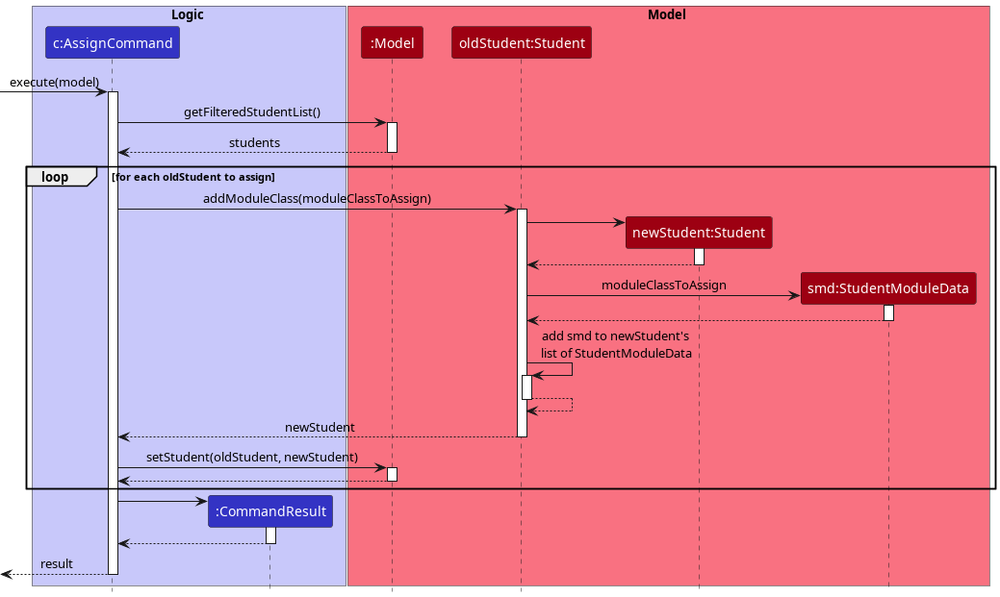
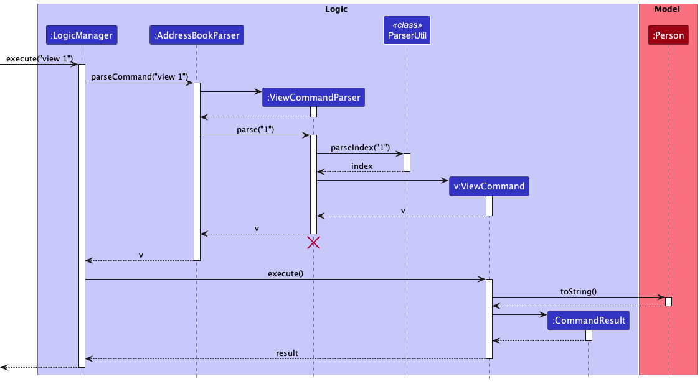
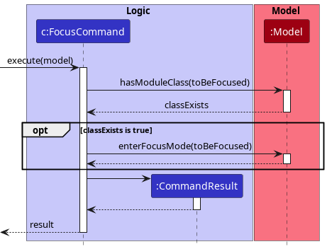
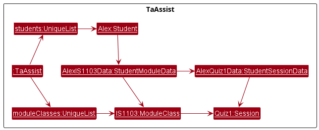
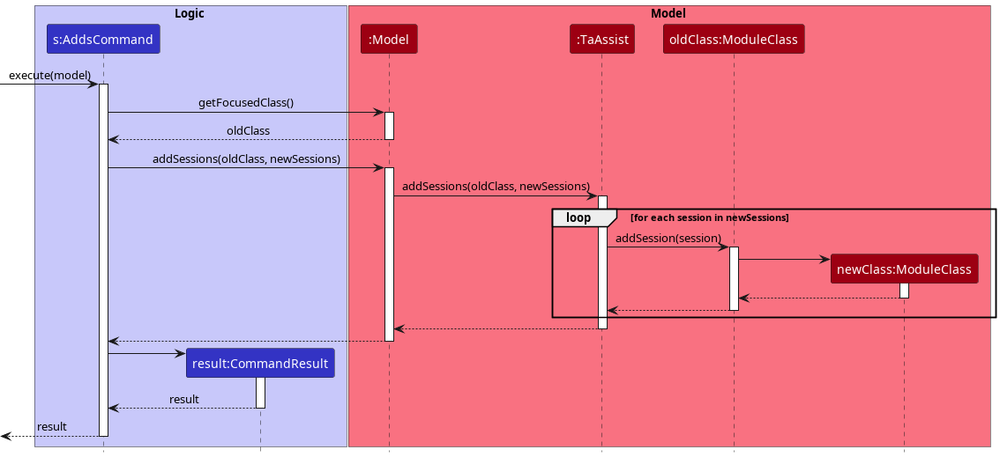
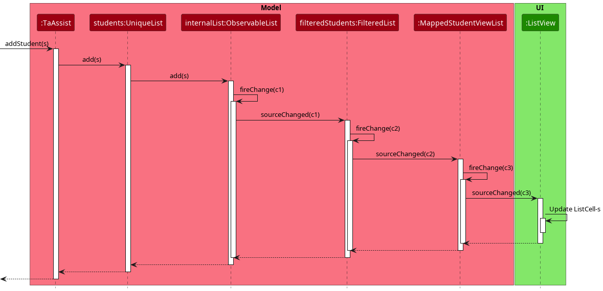

* Table of Contents
{:toc}
--------------------------------------------------------------------------------------------------------------------

## **Acknowledgements**

We'd like to thank:
* The [CS2103/T teaching team](https://nus-cs2103-ay2223s1.github.io/website/admin/instructors.html) for guiding us throughout the development of this project.
* [SE-Edu's AddressBook-Level3](https://github.com/se-edu/addressbook-level3) for laying the foundations on which our (brownfield) project is built upon.
* The [JavaFX](https://openjfx.io/), [Jackson](https://github.com/FasterXML/jackson), and [JUnit](https://junit.org/junit5/) project teams for their awesome work
on which our product is built upon!

--------------------------------------------------------------------------------------------------------------------

## **Setting up, getting started**

Refer to the guide [_Setting up and getting started_](SettingUp.md).

--------------------------------------------------------------------------------------------------------------------

## **Design**

:bulb: **Tip:** The `.puml` files used to create diagrams in this document can be found in the [diagrams](https://github.com/AY2223S1-CS2103T-T12-1/tp/tree/master/docs/diagrams/) folder. Refer to the [_PlantUML Tutorial_ at se-edu/guides](https://se-education.org/guides/tutorials/plantUml.html) to learn how to create and edit diagrams.

### Architecture

The ***Architecture Diagram*** given above explains the high-level design of the App.

Given below is a quick overview of main components and how they interact with each other.

**Main components of the architecture**

**`Main`** has two classes called [`Main`](https://github.com/AY2223S1-CS2103T-T12-1/tp/blob/master/src/main/java/seedu/taassist/Main.java) and [`MainApp`](https://github.com/AY2223S1-CS2103T-T12-1/tp/blob/master/src/main/java/seedu/taassist/MainApp.java). It is responsible for,
* At app launch: Initializes the components in the correct sequence, and connects them up with each other.
* At shut down: Shuts down the components and invokes cleanup methods where necessary.

[**`Commons`**](#common-classes) represents a collection of classes used by multiple other components.

The rest of the App consists of four components.

* [**`UI`**](#ui-component): The UI of the App.
* [**`Logic`**](#logic-component): The command executor.
* [**`Model`**](#model-component): Holds the data of the App in memory.
* [**`Storage`**](#storage-component): Reads data from, and writes data to, the hard disk.

**How the architecture components interact with each other**

The *Sequence Diagram* below shows how the components interact with each other for the scenario where the user issues the command `delete 1`.

Each of the four main components (also shown in the diagram above),

* defines its *API* in an `interface` with the same name as the Component.
* implements its functionality using a concrete `{Component Name}Manager` class (which follows the corresponding API `interface` mentioned in the previous point.

For example, the `Logic` component defines its API in the `Logic.java` interface and implements its functionality using the `LogicManager.java` class which follows the `Logic` interface. Other components interact with a given component through its interface rather than the concrete class (reason: to prevent outside component's being coupled to the implementation of a component), as illustrated in the (partial) class diagram below.

The sections below give more details of each component.

### UI component

The **API** of this component is specified in [`Ui.java`](https://github.com/AY2223S1-CS2103T-T12-1/tp/blob/master/src/main/java/seedu/taassist/ui/Ui.java)

The UI consists of a `MainWindow` that is made up of parts e.g.`CommandBox`, `ResultDisplay`, `StudentListPanel`, `StatusBarFooter` etc. All these, including the `MainWindow`, inherit from the abstract `UiPart` class which captures the commonalities between classes that represent parts of the visible GUI.

The `UI` component uses the JavaFx UI framework. The layout of these UI parts are defined in matching `.fxml` files that are in the `src/main/resources/view` folder. For example, the layout of the [`MainWindow`](https://github.com/AY2223S1-CS2103T-T12-1/tp/blob/master/src/main/java/seedu/taassist/ui/MainWindow.java) is specified in [`MainWindow.fxml`](https://github.com/AY2223S1-CS2103T-T12-1/tp/blob/master/src/main/resources/view/MainWindow.fxml)

The `UI` component,

* executes user commands using the `Logic` component.
* listens for changes to `Model` data so that the UI can be updated with the modified data.
* keeps a reference to the `Logic` component, because the `UI` relies on the `Logic` to execute commands.
* depends on some classes in the `Model` component, as it displays `Student`, `ModuleClass` and `Session` object residing in the `Model`.

### Logic component

**API** : [`Logic.java`](https://github.com/AY2223S1-CS2103T-T12-1/tp/blob/master/src/main/java/seedu/taassist/logic/Logic.java)

Here's a (partial) class diagram of the `Logic` component:

How the `Logic` component works:
1. When `Logic` is called upon to execute a command, it uses the `TaAssistParser` class to parse the user command.
2. This results in a `Command` object (more precisely, an object of one of its subclasses e.g., `AddCommand`) which is executed by the `LogicManager`.
3. The command can communicate with the `Model` when it is executed (e.g. to add a student).
4. The result of the command execution is encapsulated as a `CommandResult` object which is returned back from `Logic`.

The sequence diagram below illustrates the interactions within the `Logic` component for the `execute("delete 1")` API call.

:information_source: **Note:** The lifeline for `DeleteCommandParser` should end at the destroy marker (X) but due to a limitation of PlantUML, the lifeline reaches the end of diagram.

Here are the other classes in `Logic` (omitted from the class diagram above) that are used for parsing a user command:

How the parsing works:
* When called upon to parse a user command, the `TaAssistParser` class creates an `XYZCommandParser` (`XYZ` is a placeholder for the specific command name e.g., `AddCommandParser`) which uses the other classes shown above to parse the user command and create a `XYZCommand` object (e.g., `AddCommand`) which the `TaAssistParser` returns back as a `Command` object.
* All `XYZCommandParser` classes (e.g., `AddCommandParser`, `DeleteCommandParser`, ...) inherit from the `Parser` interface so that they can be treated similarly where possible e.g, during testing.

The following sequence diagram shows how a generic command `XYZCommand` is parsed from user input with the help of `XYZCommandParser`.

### Model component
**API** : [`Model.java`](https://github.com/AY2223S1-CS2103T-T12-1/tp/blob/master/src/main/java/seedu/taassist/model/Model.java)

The `Model` component,

* stores data in TA-Assist:
  * all `Student` objects are contained in a `UniqueList` object.
  * all `ModuleClass` objects are also contained in a `UniqueList` object.
* stores the currently 'selected' `StudentView` objects (e.g., results of a search query) as a separate _filtered_ list which is exposed to outsiders as an unmodifiable `ObservableList<StudentView>` that can be 'observed' e.g. the UI can be bound to this list so that the UI automatically updates when the data in the list change.
* the `StudentView` object is a class that encapsulates `Student` data along with a `SessionData` to be displayed to `UI`. More details regarding this class can be referred to in [the Implementation section](#querying-student-grades-for-a-session).
* stores the currently 'focused' `ModuleClass` object.
* stores a `UserPref` object that represents the user’s preferences. This is exposed to the outside as a `ReadOnlyUserPref` objects.
* does not depend on any of the other three components (i.e. `Ui`, `Logic` and `Storage`) as the `Model` represents data entities of the domain, they should make sense on their own without depending on other components.

#### UniqueList

The `UniqueList` class is a generic class that stores a collection of unique elements. In TA-Assist, a `UniqueList` stores either all the `Student` objects or all the `ModuleClass` objects.

#### Student, ModuleClass and Session

Each `Student` object stores all module-class-related data, such as the `ModuleClass` and session data, in a `StudentModuleData` object. 
Session data belonging to a `Student` is stored in `SessionData` objects.

`Student`, `ModuleClass` and `Session` objects implement the `Identity` interface which has a single `isSame` method. The `isSame` method allows `Identity` objects to define
a weaker notion of equality than the `equals` method.

Similarly, objects that keep a reference of `Student`, `ModuleClass` or `Session` objects such as the `UniqueList` and `StudentModuleData` may also implement the `Identity` method.

### Storage component

**API** : [`Storage.java`](https://github.com/AY2223S1-CS2103T-T12-1/tp/blob/master/src/main/java/seedu/taassist/storage/Storage.java)

The `Storage` component,
* can save both TA-Assist data and user preference data in json format, and read them back into corresponding objects.
* inherits from both `TaAssistStorage` and `UserPrefStorage`, which means it can be treated as either one (if only the functionality of only one is needed).
* depends on some classes in the `Model` component (because the `Storage` component's job is to save/retrieve objects that belong to the `Model`)

### Common classes

Classes used by multiple components are in the `seedu.taassist.commons` package.

--------------------------------------------------------------------------------------------------------------------

## **Implementation**

This section describes some noteworthy details on how certain features are implemented along with explanations
for why certain functions are implemented in such a manner.

### Creating and deleting module classes

Module class information is stored as `ModuleClass` objects, which captures the name of the module class as well as the sessions created for the module class. When the user creates a module class, the program creates a new `ModuleClass` object with the module class name and adds it to the collection of `ModuleClass` objects previously created, which is managed by the `TaAssist` class.

When deleting module classes, all students previously assigned to those module classes will have the module classes unassigned from them, before the `ModuleClass` objects corresponding to those module classes are removed from the collection captured by `TaAssist`.

The following methods in `TaAssist` manages the adding and deleting of module classes from the collection:

- `TaAssist#addModuleClass(ModuleClass moduleClass)` - Adds the provided module class to the list of module classes created.
- `TaAssist#removeModuleClass(ModuleClass moduleClass)` - Removes the provided module class from the list of module classes created.

### Assigning students to module classes

Each student object contains a collection of `StudentModuleData` where module classes and the grades the student obtained for the sessions of the module classes are stored. When the user assigns students to a module class, a new `StudentModuleData` object is created and added to the collection for each student.

Given below are the different steps taken when the user assigns students to a module class.

Step 1: The user enters the command keyword `assign`, followed by the indices of the students he want to assign module classes to, and the names of the module classes that he wants to assign to the students. Example: `assign 1 2 3 c/CS1101S`.

Step 2: The program makes use of the `TAAssistParser` to make sense of the keyword, and determine which parser to use to parse the arguments. In this case, the `AssignCommandParser` is used.

Step 3: The `AssignCommandParser` makes sense of the arguments, and creates an `AssignCommand` object with the student indices and the module classes to assign them to.

Step 4: The `AssignCommand` object is executed. The student indices are be used to retrieve the `Student` objects from the list of students captured by the `Model` interface. For each student, the program creates a new `StudentModuleData` object for each module class that is not already assigned to the student. The `StudentModuleData` object only contains the module class name and not any session information. The `StudentModuleData` objects created for the student are added to the student object's collection of `StudentModuleData`.

Step 5: The execution ends and returns a `CommandResult` object containing the success message to be displayed by the GUI to the user.

#### Design considerations:

* Alternative 1 (current choice): Let each student maintain a collection of module classes that the student is being assigned to.
  * Pros: Only captures necessary information, and easier to implement. This structure is also easier to capture session information for the students.
  * Cons: Will be creating multiple `StudentModuleData` objects for a module class when multiple students are assigned to the module class. This may cause performance issues from the large number of objects created.
* Alternative 2: Create a matrix of students and classes to determine which module class is assigned to which student.
  * Pros: Will allow fast query to whether a student is assigned to a module class, or when looking for all the students assigned to a certain module class.
  * Cons: Can possibly be storing a lot of unnecessary information. Considering the target audience of TAs, it is very unlikely for them to be teaching the same student for multiple module classes.

### Unassigning students from module classes

The implementation of unassigning students from module classes is similar to how module classes are assigned to students. The difference is that in the unassigning process, the `StudentModuleData` of the mentioned module classes are removed from the collection of `StudentModuleData` maintained by the students instead.

Refer to [Assigning students to module classes](#assigning-students-to-module-classes) for more information.

### Grading a student for a session

Giving grades for a session is only possible when a `ModuleClass` is focused. It requires updating the student's list of
`StudentModuleData`, where the matching `StudentModuleData` with the current focused `ModuleClass` is updated to reflect 
the given grade.

Given bellow are the steps taken when the user gives grade to a student for a session: 

Step 1: The user input is parsed similar to other commands and a `GradeCommand` object is created using the given 
student indices, session name, and grade. 

Step 2: The `GradeCommand` object is executed. The given indices are used to retrieve the `Student` objects from the 
current curated list of students in `Model` using the `ParserStudentIndexUtil#parseStudentFromIndices` method. For each 
student, steps 3 to 5 are repeated.

Step 3: The old `Student` object is used to create an updated `Student` object via the `Student#updateGrade` method. 
The method creates the new student with an updated list of `StudentModuleData` by going through the list of the 
old `Student` object's list of `StudentModuleData` and updating the `StudentModuleData` that matches the current 
focused `ModuleClass`.

Step 4: The `StudentModuleData#updateGrade` method is used to create a new `StudentModuleData` object with the
updated grade for the session. The method first creates a new `StudentModuleData` object which has the same list of
`SessionData` except the one matching with the given session (if any). The method then creates a new `SessionData` 
object with the given grade and adds it to the list of `SessionData` in the new `StudentModuleData` object. 

Step 5: After finishing steps 3-4, the `GradeCommand` will have an updated student. Then the `Model#setStudent` method
is used to replace the old `Student` object with the updated one in our model. 

Step 6: The execution ends and returns a `CommandResult` object containing the success message to be displayed by the GUI
to the user. 

### Viewing session-wise grades of a student in a class

Viewing session-wise grades of a student is only possible when a `ModuleClass` is in focus. It requires going through
the list of `StudentModuleData` of the `Student` object and finding the data for the matching focused class. After retrieving it, 
the session-wise grade can be read from the list of `SessionData` stored inside the `StudentModuleData`.  

Given bellow are the steps taken when the user wants to view a student's session-wise grades:

Step 1: The user input is parsed similar to other commands and a `ViewCommand` object is created using the given student index. 

Step 2: The `ViewCommand` object is executed. The given index is used to retrieve the correct `Student` object from the 
curated list of students in `Model` using the `ParserStudentIndexUtil#parseStudentFromIndex` method.  

Step 3: The `StudentModuleData` of the student that matches with the current focus class is retrieved using the 
`Student#findStudentModuleData` method. This method achieves that by searching the `UniqueList` with a new `StudentModuleData`
that has the identity of the current focus class. This `StudentModuleData` is guaranteed to exist, since the program is in
focus mode. 

Step 4: The list of `SessionData` is retrieved from the `StudentModuleData` using the `StudentModuleData#getSessionDataList` method.

Step 5: A response message is constructed from the list of `SessionData`, containing all the session-wise grades of the student. 

Step 6: The execution ends and returns a `CommandResult` object containing the constructed response to be displayed by GUI to the user. 

### Tracking the state of focus mode

The state of focus mode is tracked by `ModelManager`, which stores the current focused `ModuleClass` (`focusedClass`, as seen in the [class diagram for `Model`](#model-component)).
When `focusedClass` is `null`, it indicates that focus mode is inactive. `ModelManager` returns the state of the focus mode via the following methods:
* `ModelManager#isInFocusMode()` - Checks whether focus mode is active.
* `ModelManager#getFocusedClass()` - Returns the current `ModuleClass` in focus.

The following methods in `ModelManager` toggles the state of the focus mode:
* `ModelManager#enterFocusMode(ModuleClass classToFocus)` - Sets focus mode to be active.
  * This is achieved by setting `focusedClass` to be a non-null `ModuleClass` object.
  * This method assumes that `focusedClass` is an existing `ModuleClass` in `TaAssist`.

* `ModuleClass#exitFocusMode()` - Sets focus mode to be inactive.
  * This is achieved by setting `focusedClass` to be `null`.

The above methods are also exposed to the `Model` interface.

The `Logic` component calls these methods in `Model` to execute commands that require access to the state of the focus mode.

For example, the following sequence diagram shows how the `focus` command activates focus mode:

On the other hand, the `unfocus` command deactivates focus mode by setting `focusedClass` to `null`.

### Immutability of Session, ModuleClass, and Student

In the implementation of the `Session`, `ModuleClass` and `Student` classes, it was decided to implement them in an immutable manner. 
This is done mainly for three reasons:
- Java passes its values by-reference, this can cause quite the confusion if objects returned by `Model` are mutated.
- Simplifies loading data from `Storage` as we do not need to ensure contents of data in one object has is referencing the same object as another.
- Reduces the possibility of an unobserved mutation as data in `Model` is commonly observed by `UI` through an `ObservableList`.

As such, if the codebase is to be extended to store additional classes within `Model`, it is recommended to implement them
in an immutable manner unless there's good reason not to do so.

### Identity: A weaker notion of equality

Since any modifications to an immutable object in `Model` would require constructing new objects, we'll need a method to identify
objects with the same identities, i.e. two `ModuleClass`-s have the same identity if their module codes are equal.

For instance, consider the following hypothetical scenario:

Assume the current state of `TaAssist` is as follows:

Now, let's say the user wants to add a `Quiz2` session to IS1103. However, since `ModuleClass` is immutable, we'll have
to construct a new `IS1103` ModuleClass instance instead. Call this new instance `NewIS1103`. Hence, the state of 
`TaAssist` will now look like the one below:

Now, notice that `AlexIS1103Data` is no longer referencing the same object. In addition, since their contents
are different, we can't check with the `equals` method, as the `equals` method in our codebase should perform a strict
equality check, i.e. all contents of the two objects must be equal for `equals` to return `True`. Hence, there's no way
to identify whether `IS1103` and `NewIS1103` are *inherently* the same module or not.

To handle this issue, `Session`, `ModuleClass`, and `Student` classes implement the interface `Identity<T>` which contains a method
`isSame(T obj)` used to compare whether two objects have equivalent identities, i.e. `ModuleClass`-es have equal identity if their
module code are then same.

This `Identity` construct is similar to a `<Key, Value>` pair  in a HashMap implementation, where we use the `Key` to 
determine the object's identity and `Value` for its satellite values.

### Managing Sessions within a Class

As `ModuleClass` is immutable, we will construct new `ModuleClass` instances each time we modify the attributes of a `ModuleClass` object.
The following methods in `ModuleClass` constructs new `ModuleClass` instances based on the current `ModuleClass` instance:
- `ModuleClass#addSession(session)` - Constructs a new `ModuleClass` with the provided `Session` added into the session list.
- `ModuleClass#removeSession(session)` - Constructs a new `ModuleClass` with the provided `Session` removed from the session list.

In addition, methods such as `addSessions` and `removeSessions` are also provided in `Model` and 
`TaAssist` to help manage sessions within a class.

For example, the following sequence diagram shows how the command `adds s/Lab1`
creates a `Session` named "Lab1" and adds it inside the focused class.

:information_source: **Note:** The above diagram assumes that `Model` is currently in focus mode and 
the focused class doesn't contain a session named `Lab1` as of current.

### Querying student grades for a session

This feature allows the user to query student grades of a session to `TaAssist`. `TaAssist` will provide a response showing the grades of all students of the queried session.

Its implementation is facilitated by two classes:

#### StudentView class
`StudentView` encapsulates the view of a `Student` for the UI. It stores the `Student` data itself along with a `SessionData` if queried.

`SessionData` can be queried from a `Student` through the `StudentView::withSession` method. This will construct a new `StudentView` that encapsulates the queried `SessionData`.

This encapsulated `SessionData` internally represented with three values:
* `null`: `SessionData` has not been queried
* an empty `Optional`: `SessionData` has been queried, but doesn't exist in `Student`.
* an `Optional` encapsulating a `SessionData`: `SessionData` has been queried and does exist in `Student`.

#### MappedStudentViewList class
`MappedStudentViewList` maps an `ObservableList<Student>` to an `ObservableList<StudentView>`. 

It takes in `ObservableList<Student>` as a source list. Each `Student` in the source list will be mapped to a `StudentView`. 

It stores two additional parameters, a `ModuleClass` and a `Session`. These parameters are used in determining which `SessionData` to be queried from `Student` and encapsulated by the resulting `StudentView`. 
If either of these two parameters are `null`, `MappedStudentViewList` will assume no `Session` is being queried and the resulting `StudentView` will follow suit.

If the source list is modified, `MappedStudentViewList` will also map the new `Student` data accordingly and execute a `fireChange` to inform its listeners of a new update. 

If the two parameters are modified through the `MappedStudentViewList::setTarget` method, `MappedStudentViewList` will re-map all `Student` to the appropriate `StudentView`-s and execute a `fireChange` to inform its listeners of a new update.

With these two classes implemented, `SessionData` can now be easily passed to `UI` by simply passing the `MappedStudentViewList` within
`ModelManager` to `UI`. `UI` will then update accordingly whenever the `MappedStudentViewList` fires a change.

The following sequence diagram shows how changes are propagated to the `UI` through the chain of `ObservableList`-s when `TaAssist::addStudent(s)` is called:

:information_source: **Note:** The diagram above simplifies the `ListView` interaction as it is abstracted away by JavaFX and its details are mostly irrelevant to our implementation.

#### Design Considerations

**Aspect: How query data is passed to `UI`:**
* **Option 1 (Current Choice).** Pair `Student` and `SessionData` together in a `StudentView` class.
  * Pros: With `Observable` pattern, can be made to automatically update when a new student is graded. Simplifies `UI` implementation.
  * Cons: Complicates design of `Model` as it adds another class just for handling the "view" of a student.
* **Option 2.** Maintain two `ObservableList`-s for `Student` and `SessionData` seperately.
  * Pros: Reduces the need of a encapsulating class, which simplifies the design of `Model`.
  * Cons: Hard to maintain. Accidental slip-up in updating one list but not the other can occur.
* **Option 3.** Let UI query the data from `Student`
  * Pros: `Model` needs no change.
  * Cons: Breaks abstraction principle. Non-trivial querying of fields from `Student` should be handled by `Model`.
* **Option 4.** Pass data through `CommandResult`
  * Pros: Easy to implement.
  * Cons: Hard to maintain. Each `Command` now needs to know that `CommandResult` can pass data other than for result display.

### UI Implementation
**Home Screen**

The main screen consists of the following components:
* `ResultDisplay` shows the results produced by the command input from the user; 
* `ModuleClassListPanel` shows a list of module classes, each `ModuleClassCard` represents a module class, arranged in alphabetical order;
* `StudentListPanel` shows a list of student, each `StudentCard` represents a student, arranged in alphabetical order;
* `CommandBox`, the Command Line Interface (CLI) for user to key in command and
* `HelpWindow` shown with a help button, redirect users to our User Guide to facilitate their usage;

It was designed with the following considerations:
* Users have class-oriented focus while using this application. Their actions such as grading/assigning students to a class or initiating sessions revolve around a particular class, therefore we find it suitable to put the classes users have added within the `MainWindow`.
* Operations on students can be performed conveniently by showing the list of all students on the main window, such as deleting, adding and finding students whenever required.
* As we are targeting users with higher preference on CLI than GUI, putting the command input box at the bottom of the window may be more instinctive for their usage, due to the high similarity with the implementation of command terminals from various operating systems.

**Focus Mode**

The screen upon entering the focus mode consists of components:
* `ResultDisplay`, as aforementioned, shows the results produced by the command input from the user;
* `SessionListPanel` shows a list of sessions, with each `SessionCard` representing a session, sorted based on the most recently added date;
* `StudentListPanel`, similar to the main screen, shows a list of student, with each `StudentCard` representing a student, arranged in alphabetical order;
* `CommandBox`, the Command Line Interface (CLI) for user to key in command and
* `HelpWindow` shown with a help button that redirects users to our User Guide to facilitate their usage; a back button that allow user to leave the focus mode; and a header which shows the class the user is currently focused in.

Whenever users call `scores s/SESSION_NAME`, the grade pertaining to that particular session appear, with ungraded students highlighted in red to the users.

It was designed with the following consideration:
* As sessions are usually time-sensitive, with those added later often being the more relevant sessions, sorting the sessions with the newest session at the front facilitate users in finding the sessions they are concerned with recently.

--------------------------------------------------------------------------------------------------------------------

## **Documentation, logging, testing, configuration, dev-ops**

* [Documentation guide](Documentation.md)
* [Testing guide](Testing.md)
* [Logging guide](Logging.md)
* [Configuration guide](Configuration.md)
* [DevOps guide](DevOps.md)

--------------------------------------------------------------------------------------------------------------------

## **Appendix: Requirements**

### Product scope

**Target user profile**:

* works as teaching assistants.
* has a need to keep track of students' grades, attendance, and work submission status of relevant modules.
* prefers desktop apps over other types.
* can type fast.
* prefers typing to mouse interactions.
* is reasonably comfortable using CLI apps.

**Value proposition**:
* Fast management of students' grades over the typical GUI-driven app.
* Easy navigation and batch processing with the help of filter and search functionality.
* CSV file generation of student data.

### User stories

Priorities: High (must have) - `* * *`, Medium (nice to have) - `* *`, Low (unlikely to have) - `*`

| Priority | As a …​         | I want to …​                             | So that I can…​                          |
| -------- | --------------- | ---------------------------------------- | ---------------------------------------- |
| `* * *`  | New user        | Get help for specific commands           | Learn the complete features of a command and know how to use it. |
| `* * *`  | User            | Add students to my class                 | Decide who to have in my class.          |
| `* * *`  | User            | Delete students from my class            | Decide who to have in my class.          |
| `* * *`  | User            | Give participation points to students    | Keep track of their participation in class. |
| `* * *`  | User            | Take attendance of my students           | Keep track of their class attendance.    |
| `* * *`  | User            | Delete students from TA-Assist           | Keep my list of students concise.        |
| `* * *`  | User            | View all my classes                      | See what classes I am teaching.          |
| `* *  `  | Infrequent user | Remember the last used commands          | Quickly find the commands that I need.   |
| `* *  `  | An expert user  | Create macros to perform multiple tasks  | Be more efficient at using the system.   |
| `* *  `  | User            | Edit students' information               | Easily and quickly update their information. |
| `* * *`  | User            | Create assignments that contribute to CA components | Assign grades to assignments done by students. |
| `* *  `  | User            | Assign weightage to my created assignments | Estimate the overall performance of my students. |
| `* * *`  | User            | Change participation marks previously given to my students | Correctly and accurately reflect the marks for my students. |

### Use cases

(For all use cases below, the **System** is `TA-Assist` and the **Actor** is the `User`, unless specified otherwise)

**Use case: UC1 - Enter focus mode for a class**

**MSS**
1. User requests to enter focus mode for a class.
2. TA-Assist enters focus mode for the class.
3. TA-Assist indicates that the user is in the focus mode for the class.
4. TA-Assist lists all the students in the class.
5. TA-Assist lists all the sessions in the class.

    Use case ends.

**Extensions**
* *a. User requests to exit focus mode.
    * *a1. TA-Assist exits focus mode.
    * *a2. TA-Assist indicates that the user has exited focus mode.

      Use case ends.

* 2a. The class does not exist.
  * 2a1. TA-Assist tells the user that the class does not exist.

    Use case ends

* 4a. The list of students is empty.

  Use case resumes at step 5.

* 5a. The list of sessions is empty.

  Use case ends.

**Use case: UC2 - Give a student a score for a session in a class**

**MSS**
1. User requests to <u>enter focus mode for a class (UC1)</u>.
2. User requests to allocate a score for a specific student in the class, for a specific session.
3. TA-Assist updates the score for the student.
4. TA-Assist indicates that the score for the student has been updated.

   Use case ends.

**Extensions**
* 3a. The student does not exist in the class.
  * 3a1. TA-Assist tells the user that the student does not exist.

    Use case ends.

* 3b. The session does not exist in the class.
  * 3b1. TA-Assist tells the user that the session does not exist.

    Use case ends.

**Use case: UC3 - Add a student**

**MSS**
1. User requests to add a student with the specified name and information.
2. TA-Assist creates a student with the given name.
3. TA-Assist indicates that the student has been added.

   Use case ends.

**Extensions**
* 2a. The student name is empty.
  * 2a1. TA-Assist shows an error message.

    Use case ends.

* 2b. The student already exists.
  * 2b1. TA-Assist tells the user that the student already exists.

    Use case ends.

* 2c. The student's phone number, email address, home address and/or class is/are provided.
  * 2c1. TA-Assist creates a student with a name along with these information.

    Use case resumes at step 3.

**Use case: UC4 - Delete a student**

**MSS**
1. User requests to list students.
2. TA-Assist shows a list of students.
3. User requests to delete a specific student in the list.
4. TA-Assist deletes the student.
5. TA-Assist indicates that the student has been deleted.

   Use case ends.

**Extensions**
* 2a. The list is empty.

  Use case ends.

* 3a. The given index is invalid.
  * 3a1. TA-Assist indicates that the index is invalid.

    Use case resumes at step 2.

**Use case: UC5 - Create a class**

**MSS**
1. User requests to create a new class with the specified class name.
2. TA-Assist creates a new class with the given class name.
3. TA-Assist indicates that the class has been created.

   Use case ends.

**Extensions**
* 2a. The class already exists.
  * 2a1. TA-Assist tells the user that the class already exists.

    Use case ends.

* 2b. The class name is empty.
  * 2b1. TA-Assist shows an error message.

    Use case ends.

**Use case: UC6 - Create a session in a class**

**MSS**
1. User requests to <u>enter focus mode for a class (UC1)</u>.
2. User requests to create a new session for the class.
3. TA-Assist creates a new session for the class.
4. TA-Assist indicates that the session has been created.

    Use case ends.

**Extensions**
* 3a. The session already exists.
  * 3a1. TA-Assist tells the user that the session already exists.

    Use case ends.

* 3b. The session name is empty.
    * 3b1. TA-Assist shows an error message.

      Use case ends.

### Non-Functional Requirements

1. Should work on any mainstream OS with Java 11 or above installed.
2. Should work without requiring an installer.
3. Should not depend on a remote server.
4. Should not use a DBMS (Database Management System).
5. Should store data in a human editable text file.
6. Product JAR file should not exceed 100MB.
7. A user with above average typing speed for regular English text (i.e. not code, not system admin commands) should be able to accomplish most of the tasks faster using commands than using the mouse.
8. GUI should be usable for screen resolutions of 1280x720 and higher with 150% scaling.
9. GUI should work well for screen resolutions of 1920x1080 and higher with 100-125% scaling.

### Glossary

* **Mainstream OS**: Windows, Linux, Unix, and macOS

--------------------------------------------------------------------------------------------------------------------

## **Appendix: Instructions for manual testing**

Given below are instructions to test the app manually.

:information_source: **Note:** These instructions only provide a starting point for testers to work on;
testers are expected to do more *exploratory* testing.

### Launch and shutdown

1. Initial launch

   1. Download the jar file and copy into an empty folder

   1. Double-click the jar file 
   
   Expected: Shows the GUI with a set of sample students and classes. The window size may not be optimum on certain resolutions.

1. Saving window preferences

   1. Resize the window to an optimum size. Move the window to a different location. Close the window.

   1. Re-launch the app by double-clicking the jar file.
   
   Expected: The most recent window size and location is retained.

### Deleting a student

1. Deleting a student while all students are being shown

   1. Prerequisites: List all students using the `list` command. Multiple students in the list.

   1. Test case: `delete 1` 
      Expected: First contact is deleted from the list. Details of the deleted contact shown in the status message. Timestamp in the status bar is updated.

   1. Test case: `delete 0` 
      Expected: No student is deleted. Error details shown in the status message. Status bar remains the same.

   1. Other incorrect delete commands to try: `delete`, `delete x`, `...` (where x is larger than the list size) 
      Expected: Similar to previous.

### Adding sessions

1. Adding a session to a class

   1. Prerequisites: The class `CS1231S` exists in TA-Assist without any sessions assigned. 
      TA-Assist is currently in focus mode and is focusing on the `CS1231S` class.

   1. Test case: `adds s/Tut 1` 
      Expected: A session named `Tut 1` is added with the current system date and is displayed on the session list.

   1. Test case: `adds s/Tut 1 d/2022-01-01` 
      Expected: A session named `Tut 1` is added with its date set to `1st January 2022` and is displayed on the session list.

   1. Test case: `adds s/Lab 1 d/2019-02-29` 
      Expected: Session is not created as `29th February 2019` is not a valid date.

1. Batch adding sessions to a class

   1. Prerequisites: The class `CS1231S` exists in TA-Assist without any sessions assigned.
   TA-Assist is currently in focus mode and is focusing on the `CS1231S` class.

   1. Test case: `adds s/Tut 2 s/Lab 2` 
      Expected: Two sessions named `Tut 2` and `Lab 2` is added with the current system date and is displayed on the session list.

   1. Test case: `adds s/Tut 3 s/Lab 3 d/2000-01-01` 
      Expected: Two sessions named `Tut 3` and `Lab3` is added with its date set to `1st January 2000` and is displayed on the session list.
   
   1. Test case: `adds s/Tut 4 d/2000-02-02 s/Lab 4 d/2020-04-20` 
      Expected: Two sessions named `Tut 4` and `Lab 4` is added with its date set to `20th April 2020` and is displayed on the session list.

### Saving data

1. Data file is corrupted

   1. Prerequisite: Jar file has been launched and data files have been generated.

   1. Close the application. Open `data/taassist.json` and add some random characters.

   1. Re-launch the app.
   
   Expected: An alert box appears stating the data file has been corrupted and queries the user if they want to continue
   with a new data file.

1. Data file is missing

   1. Prerequisite: Jar file has been launched and data files have been generated.

   1. Close the application. Rename `data/taassist.json` to `data/taassist.json.bak`.

   1. Re-launch the app.

   Expected: TA-Assist launches normally and re-generates the sample data similar to when the application is first launched.
