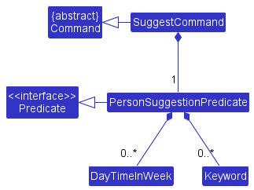
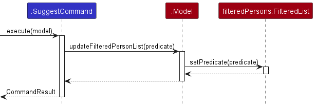

:bulb: Before we begin, it is important to note that:
* Minefriends is not affiliated with Minecraft, Mojang Studios or Microsoft in any way.
* Minefriends is an independently developed software. It is not a product owned by Mojang Studios or Microsoft.
* Team Minefriends do not own Minecraft, in whole or in part.

### What is Minefriends

Minefriends is an address book for Minecraft players to find friends to play Minecraft multiplayer with,
at the right time, with the right game modes and on the right servers.

### What is this guide about

This developer guide provides readers with the understanding of the motivations for the development of
Minefriends together with its technical design and implementation details. A broad view of the architecture of 
Minefriends is given and selected implementation details of important features are given as well.

### Who is this guide for

This guide is written for
* Maintainers who wish to extend/alter the features of Minefriends
* Developers who wish to morph Minefriends for their own use
* Minecraft players who wish to adapt Minefriends to better suit their own needs

### How to use this guide

#### Organization

The guide is organized in a way that it starts with the motivations of building Minefriends, followed
by a big-picture design overview of the various components before diving into individual feature implementations.
* To get a good general understanding of Minefriends, it is recommended to read the guide from top to bottom.
* However, you can also jump to a certain part using the [table of contents](#table-of-contents).

#### Legend

* Text in [blue](#how-to-use-this-guide) are links that you can use to navigate to another part of the document or to an external document/website.
* Text in **bold** are used to emphasize an important point.
* Text in `this` are used to refer to code or names related to the codebase.

:bulb: Text in a blue box are tips; they provide additional information about a particular point.

--------------------------------------------------------------------------------------------------------------------

## **Table of contents**

* Table of Contents
{:toc}

--------------------------------------------------------------------------------------------------------------------

## **Acknowledgements**

### External libraries

### Graphics and assets
* App Icon - Minecraft Book & Quill icon: https://minecraft.fandom.com/wiki/Book_and_Quill
* Font - Minecraft font: https://fontmeme.com/fonts/minecraft-font/
* Background textures - Dirt block: https://minecraft.fandom.com/wiki/Dirt
* Background textures - Grass block: https://minecraft.fandom.com/wiki/Grass_Block
* Background textures - Bedrock: https://minecraft.fandom.com/wiki/Bedrock
* Creeper texture:
* Creeper explosion texture: 
* Creeper explosion audio: Self-recorded in game

These assets are copyright Mojang Studios, which are available for non-commercial use.
The terms of use can be found [here](https://www.minecraft.net/en-us/terms).

--------------------------------------------------------------------------------------------------------------------

## **Setting up, getting started**

Refer to the guide [_Setting up and getting started_](SettingUp.md).

--------------------------------------------------------------------------------------------------------------------

## **Conceptualization of Minefriends**

--------------------------------------------------------------------------------------------------------------------

## **Design of Minefriends**

:bulb: **Tip:** The `.puml` files used to create diagrams in this document can be found in the [diagrams](https://github.com/se-edu/addressbook-level3/tree/master/docs/diagrams/) folder. Refer to the [_PlantUML Tutorial_ at se-edu/guides](https://se-education.org/guides/tutorials/plantUml.html) to learn how to create and edit diagrams.

### Architecture

The ***Architecture Diagram*** given above explains the high-level design of the App.

Given below is a quick overview of main components and how they interact with each other.

**Main components of the architecture**

**`Main`** has two classes called [`Main`](https://github.com/se-edu/addressbook-level3/tree/master/src/main/java/seedu/address/Main.java) and [`MainApp`](https://github.com/se-edu/addressbook-level3/tree/master/src/main/java/seedu/address/MainApp.java). It is responsible for,
* At app launch: Initializes the components in the correct sequence, and connects them up with each other.
* At shut down: Shuts down the components and invokes cleanup methods where necessary.

[**`Commons`**](#common-classes) represents a collection of classes used by multiple other components.

The rest of the App consists of four components.

* [**`UI`**](#ui-component): The UI of the App.
* [**`Logic`**](#logic-component): The command executor.
* [**`Model`**](#model-component): Holds the data of the App in memory.
* [**`Storage`**](#storage-component): Reads data from, and writes data to, the hard disk.

**How the architecture components interact with each other**

The *Sequence Diagram* below shows how the components interact with each other for the scenario where the user issues the command `delete 1`.

Each of the four main components (also shown in the diagram above),

* defines its *API* in an `interface` with the same name as the Component.
* implements its functionality using a concrete `{Component Name}Manager` class (which follows the corresponding API `interface` mentioned in the previous point.

For example, the `Logic` component defines its API in the `Logic.java` interface and implements its functionality using the `LogicManager.java` class which follows the `Logic` interface. Other components interact with a given component through its interface rather than the concrete class (reason: to prevent outside component's being coupled to the implementation of a component), as illustrated in the (partial) class diagram below.

The sections below give more details of each component.

### UI component

The **API** of this component is specified in [`Ui.java`](https://github.com/se-edu/addressbook-level3/tree/master/src/main/java/seedu/address/ui/Ui.java)

The UI consists of a `MainWindow` that is made up of parts e.g.`CommandBox`, `ResultDisplay`, `PersonListPanel`, `StatusBarFooter` etc. All these, including the `MainWindow`, inherit from the abstract `UiPart` class which captures the commonalities between classes that represent parts of the visible GUI.

The `UI` component uses the JavaFx UI framework. The layout of these UI parts are defined in matching `.fxml` files that are in the `src/main/resources/view` folder. For example, the layout of the [`MainWindow`](https://github.com/se-edu/addressbook-level3/tree/master/src/main/java/seedu/address/ui/MainWindow.java) is specified in [`MainWindow.fxml`](https://github.com/se-edu/addressbook-level3/tree/master/src/main/resources/view/MainWindow.fxml)

The `UI` component,

* executes user commands using the `Logic` component.
* listens for changes to `Model` data so that the UI can be updated with the modified data.
* keeps a reference to the `Logic` component, because the `UI` relies on the `Logic` to execute commands.
* depends on some classes in the `Model` component, as it displays `Person` object residing in the `Model`.

### Logic component

**API** : [`Logic.java`](https://github.com/se-edu/addressbook-level3/tree/master/src/main/java/seedu/address/logic/Logic.java)

Here's a (partial) class diagram of the `Logic` component:

How the `Logic` component works:
1. When `Logic` is called upon to execute a command, it uses the `AddressBookParser` class to parse the user command.
1. This results in a `Command` object (more precisely, an object of one of its subclasses e.g., `AddCommand`) which is executed by the `LogicManager`.
1. The command can communicate with the `Model` when it is executed (e.g. to add a person).
1. The result of the command execution is encapsulated as a `CommandResult` object which is returned back from `Logic`.

The Sequence Diagram below illustrates the interactions within the `Logic` component for the `execute("delete 1")` API call.

:information_source: **Note:** The lifeline for `DeleteCommandParser` should end at the destroy marker (X) but due to a limitation of PlantUML, the lifeline reaches the end of diagram.

Here are the other classes in `Logic` (omitted from the class diagram above) that are used for parsing a user command:

How the parsing works:
* When called upon to parse a user command, the `AddressBookParser` class creates an `XYZCommandParser` (`XYZ` is a placeholder for the specific command name e.g., `AddCommandParser`) which uses the other classes shown above to parse the user command and create a `XYZCommand` object (e.g., `AddCommand`) which the `AddressBookParser` returns back as a `Command` object.
* All `XYZCommandParser` classes (e.g., `AddCommandParser`, `DeleteCommandParser`, ...) inherit from the `Parser` interface so that they can be treated similarly where possible e.g, during testing.

### Model component
**API** : [`Model.java`](https://github.com/se-edu/addressbook-level3/tree/master/src/main/java/seedu/address/model/Model.java)

The `Model` component,

* stores the address book data i.e., all `Person` objects (which are contained in a `UniquePersonList` object).
* stores the currently 'selected' `Person` objects (e.g., results of a search query) as a separate _filtered_ list which is exposed to outsiders as an unmodifiable `ObservableList<Person>` that can be 'observed' e.g. the UI can be bound to this list so that the UI automatically updates when the data in the list change.
* stores a `UserPref` object that represents the user’s preferences. This is exposed to the outside as a `ReadOnlyUserPref` objects.
* does not depend on any of the other three components (as the `Model` represents data entities of the domain, they should make sense on their own without depending on other components)

:information_source: **Note:** An alternative (arguably, a more OOP) model is given below. It has a `Tag` list in the `AddressBook`, which `Person` references. This allows `AddressBook` to only require one `Tag` object per unique tag, instead of each `Person` needing their own `Tag` objects. 

### Storage component

**API** : [`Storage.java`](https://github.com/se-edu/addressbook-level3/tree/master/src/main/java/seedu/address/storage/Storage.java)

The `Storage` component,
* can save both address book data and user preference data in json format, and read them back into corresponding objects.
* inherits from both `AddressBookStorage` and `UserPrefStorage`, which means it can be treated as either one (if only the functionality of only one is needed).
* depends on some classes in the `Model` component (because the `Storage` component's job is to save/retrieve objects that belong to the `Model`)

### Common classes

Classes used by multiple components are in the `seedu.addressbook.commons` package.

--------------------------------------------------------------------------------------------------------------------

## **Selected implementation details**

This section describes some noteworthy details on how certain features are implemented.

### Edit a Friend

#### Description

The "edit" feature allows users to edit details of their friends.

#### Implementation

The edit feature is facilitated through the `EditCommand` and `EditCommandParser` classes. In
the `EditCommand` class, there is a `EditPersonDescriptor` nested class which takes in all
the updated details of the friend to be edited.

MineFriends will then call the "createEditedPerson" method which will create a new person
with new details. This will then invoke a call to the `ModelManager` class to set the new person
in the addressBook.

The following class diagram shows the organization of the classes for "edit".

### Suggest a Friend

#### Description

The "suggest" feature suggests a friend for the user to play Minecraft with based on a given
set of constraints.

#### Implementation

The suggest feature is facilitated through the `SuggestCommand`, `SuggestCommandParser`
and `PersonSuggestionPredicate` classes. Once parsed, every `SuggestCommand` will contain
a `PersonSuggestionPredicate` such that the predicate can be used to filter
through the list of all friends to get a list of suggested friends.

The `PersonSuggestionPredicate` is made up of two parts, a collection of `DayTimeInWeek` and a collection of `Keyword`. 
Minefriends will find all persons that is available for *any* of the `DayTimeInWeek` and contains *all* the keywords in 
the collection of `Keyword`.

The following class diagram shows the organization of the classes for "suggest".

The following sequence diagram shows the flow of the execution of the suggest command.
Some details related to the general parsing and execution of commands are omitted
as they have been explained under [logic](#logic-component).

### Autocomplete Commands

#### Description

The "autocomplete" feature matches the current text to all the commands for the user when the user types in the command box.

#### Implementation

The autocomplete feature is facilitated through the `TextFields` class under the ControlsFX library.
The `TextFields` class provides a static method `bindAutoCompletion` that will create a new auto-completion binding between
the given TextField using the given auto-complete suggestions.

Everytime the user modifies the input, a `AutoCompletePopup` object, which is a `PopupWindow`, will appear below the CommandBox.
The object will display a list of suggestions that matches the current text in the text field.

Alternative implementations of coming up with our own classes were considered aside from using the ControlsFX library. 
However, coming up with the solution requires a great amount of effort for the same amount of functionality. 
Hence, the decision was made to use the ControlsFX library.

The following activity diagram shows the workflow for the autocomplete feature.

### Display Friend Preferences and Socials as Tags

#### Description

Whenever the user enters or modifies the in-game preferences or social handles of a friend, it is displayed as 
various coloured tags under the friend's profile.

#### Implementation

The display feature is facilitated through the `PersonCard`, `PersonListPanel`, `PersonListViewCell` and `UIPart` class, 
and configured using the `DarkTheme.css` **FXML** file.

The `PersonCard` class inherits from the `UIPart` class, representing the panel that displays each friend's profile.
Its information is set by the `setGraphic()` method in the nested `PersonListViewCell` class in the `PersonListPanel` class. 

Inside the `PersonCard` class, there are multiple `FlowPane` fields, each representing a type of user preference.
Each `FlowPane` field is tagged with the **@FXML** notation, for use by **FXML** markup.

Everytime the user updates a friend's in-game preferences or social handles, a new `PersonCard` object is created. The object 
will retrieve the corresponding user information and add them as individual labelled tags under the friend's profile.

Each type of user preference is then tagged with a different colour, specified in the `DarkTheme.css` file, for 
easy differentiation of information.

The following class diagram shows the relationship between the classes in the UI system:

#### Design Considerations:

#### 1. Which user information should be shown as tags?

* **Alternative 1 (current choice):** Only in-game preferences (such as preferred game types and Minecraft servers) and social handles. 
  * Pros:
    * Strategic display of only the more important user details.
    * Less cluttered, cleaner user interface.
  * Cons: 
    * We have to decide which user details are of higher priority to Minecraft users, which may differ from user to user.
* Alternative 2: Show all user information as tags.
  * Pros:
    * Easy to implement as the format is consistent for all information.
  * Cons:
    * Too many tags displayed can make it harder to users to find the information they need at one glance.

### \[Proposed\] Undo/redo feature

#### Proposed Implementation

The proposed undo/redo mechanism is facilitated by `VersionedAddressBook`. It extends `AddressBook` with an undo/redo history, stored internally as an `addressBookStateList` and `currentStatePointer`. Additionally, it implements the following operations:

* `VersionedAddressBook#commit()` — Saves the current address book state in its history.
* `VersionedAddressBook#undo()` — Restores the previous address book state from its history.
* `VersionedAddressBook#redo()` — Restores a previously undone address book state from its history.

These operations are exposed in the `Model` interface as `Model#commitAddressBook()`, `Model#undoAddressBook()` and `Model#redoAddressBook()` respectively.

Given below is an example usage scenario and how the undo/redo mechanism behaves at each step.

Step 1. The user launches the application for the first time. The `VersionedAddressBook` will be initialized with the initial address book state, and the `currentStatePointer` pointing to that single address book state.

Step 2. The user executes `delete 5` command to delete the 5th person in the address book. The `delete` command calls `Model#commitAddressBook()`, causing the modified state of the address book after the `delete 5` command executes to be saved in the `addressBookStateList`, and the `currentStatePointer` is shifted to the newly inserted address book state.

Step 3. The user executes `add n/David …​` to add a new person. The `add` command also calls `Model#commitAddressBook()`, causing another modified address book state to be saved into the `addressBookStateList`.

:information_source: **Note:** If a command fails its execution, it will not call `Model#commitAddressBook()`, so the address book state will not be saved into the `addressBookStateList`.

Step 4. The user now decides that adding the person was a mistake, and decides to undo that action by executing the `undo` command. The `undo` command will call `Model#undoAddressBook()`, which will shift the `currentStatePointer` once to the left, pointing it to the previous address book state, and restores the address book to that state.

:information_source: **Note:** If the `currentStatePointer` is at index 0, pointing to the initial AddressBook state, then there are no previous AddressBook states to restore. The `undo` command uses `Model#canUndoAddressBook()` to check if this is the case. If so, it will return an error to the user rather
than attempting to perform the undo.

The following sequence diagram shows how the undo operation works:

:information_source: **Note:** The lifeline for `UndoCommand` should end at the destroy marker (X) but due to a limitation of PlantUML, the lifeline reaches the end of diagram.

The `redo` command does the opposite — it calls `Model#redoAddressBook()`, which shifts the `currentStatePointer` once to the right, pointing to the previously undone state, and restores the address book to that state.

:information_source: **Note:** If the `currentStatePointer` is at index `addressBookStateList.size() - 1`, pointing to the latest address book state, then there are no undone AddressBook states to restore. The `redo` command uses `Model#canRedoAddressBook()` to check if this is the case. If so, it will return an error to the user rather than attempting to perform the redo.

Step 5. The user then decides to execute the command `list`. Commands that do not modify the address book, such as `list`, will usually not call `Model#commitAddressBook()`, `Model#undoAddressBook()` or `Model#redoAddressBook()`. Thus, the `addressBookStateList` remains unchanged.

Step 6. The user executes `clear`, which calls `Model#commitAddressBook()`. Since the `currentStatePointer` is not pointing at the end of the `addressBookStateList`, all address book states after the `currentStatePointer` will be purged. Reason: It no longer makes sense to redo the `add n/David …​` command. This is the behavior that most modern desktop applications follow.

The following activity diagram summarizes what happens when a user executes a new command:

#### Design considerations:

**Aspect: How undo & redo executes:**

* **Alternative 1 (current choice):** Saves the entire address book.
  * Pros: Easy to implement.
  * Cons: May have performance issues in terms of memory usage.

* **Alternative 2:** Individual command knows how to undo/redo by
  itself.
  * Pros: Will use less memory (e.g. for `delete`, just save the person being deleted).
  * Cons: We must ensure that the implementation of each individual command are correct.

_{more aspects and alternatives to be added}_

### \[Proposed\] Data archiving

_{Explain here how the data archiving feature will be implemented}_

### \[Proposed\] Amending Representation of Various Servers

The proposed representation of various Minecraft servers is in the format 
of `server name@IP address`. Each server can have duplicate names but each 
server will have a unique IP address.

#### Reason for Implementation
The current representation of Minecraft servers is in the format of solely 
an IP address e.g. `111.111.111.111`

This is much less user-friendly as compared to the proposed representation 
where users are able to remember various servers by their server names, 
and distinguish servers with the same names by their IP addresses 
e.g. `Mineplex @ 111.111.111.111`

#### Proposed Implementation

The server class currently only allows the server to be documented in the 
format of an IP address.

With the input `ms/ 111.111.111.111`,  
1) The `Parse` method in `AddCommandParser` will recognize the `prefix_minecraft_server`. 
2) The method will then call `parseServers` method of `ParserUtil`.  
3) `parseServers` method of `ParserUtil` will examine the validity of the 
server name by calling the `parseServer` method of `ParserUtil`.  
4) If it is a valid server name, a new server class will be created and 
added into the set of Server.  
5) The set of Server will then be an attribute of the new `Person` created.

Substantial changes will be made to the server class with constraints such as
validation regex being amended.

--------------------------------------------------------------------------------------------------------------------

## **Documentation, logging, testing, configuration, dev-ops**

* [Documentation guide](Documentation.md)
* [Testing guide](Testing.md)
* [Logging guide](Logging.md)
* [Configuration guide](Configuration.md)
* [DevOps guide](DevOps.md)

--------------------------------------------------------------------------------------------------------------------

## **Appendix: Requirements**

### Product scope

**Target user persona**:

A male 14 year old teenager who plays Minecraft multiplayer with his friends. He is an expert Minecraft player. He has school and extracurricular commitments but always finds time to play Minecraft. He plays a variety of multiplayer game modes (eg. creative, hunger games, skyblock, PvP etc.) and he has different friends who play Minecraft with him in different ways. He is familiar with Minecraft commands and so he is comfortable with the CLI.

**Target user profile**:

* plays Minecraft multiplayer with friends regularly
* has many Minecraft friends (online and offline) from all over the world
* prefer desktop apps over other types
* prefers typing to mouse interactions and types fast
* is comfortable with using the Minecraft command line, and by hence extension, using CLI apps

**Value proposition**: 

There are many servers and multiplayer game modes in Minecraft, and players have different schedules to when they can play. We want to help players find the right people to play the right game with at the right time.

### User stories

Priorities: High (must have) - `* * *`, Medium (nice to have) - `* *`, Low (unlikely to have) - `*`

| Priority | As a …​                                    | I want to …​                   | So that I can…​                                                        |
| -------- | ------------------------------------------ | ------------------------------ | ---------------------------------------------------------------------- |
| `* * *`  | new user                                   | see usage instructions         | refer to instructions when I forget how to use the App                 |
| `* * *`  | user                                       | add a new person               |                                                                        |
| `* * *`  | user                                       | delete a person                | remove entries that I no longer need                                   |
| `* * *`  | user                                       | find a person by name          | locate details of persons without having to go through the entire list |
| `* *`    | user                                       | hide private contact details   | minimize chance of someone else seeing them by accident                |
| `*`      | user with many persons in the address book | sort persons by name           | locate a person easily                                                 |
| `*`      | Minecraft multiplayer player               | view all my friends who are online easily                       | save time contacting them individually to start a game together     |
| `*`      | parent of a young Minecraft player         | ban Minecraft from redirecting my child to third-party websites | protect them from stranger-danger online                            |
| `* * *`  | Minecraft multiplayer player               | add my friends to the contact list                              | keep track of their information                                     |
| `* *`    | Minecraft multiplayer player               | search for my friends through the CLI                           | track their current game status and find information about them     |
| `* * *`  | Minecraft multiplayer player               | view all my friends in the list                                 | know who I have added as a friend already and who I haven’t add yet |
| `* *`    | Minecraft multiplayer player               | save all the data of my contacts                                | not need to search for them or re-compile them again                |
| `*`      | Minecraft multiplayer player               | login after typing in a password                                | ensure that nobody else can access my contact list                  |
| `*`      | Minecraft survival games player            | know my friend's strengths and weaknesses in game               | form a strategic team to increase odds of winning                   |
| `*`      | Minecraft PvP player                       | find friends to play together at the same time                  | team up and be stronger                                             |
| `*`      | Experienced Minecraft player               | use the command line interface comfortably                      | do things more efficiently in the application                       |
| `*`      | Minecraft player                           | change my password                                              | keep my account secure so nobody can hack my account                |
| `*`      | Long time Minecraft player                 | have a lot of friends                                           | keep track of those friends                                         |
| `*`      | Beginner Minecraft player                  | learn the controls                                              | play with my friends                                                |
| `*`      | Minecraft player                           | reset my password                                               | still login in the case I forget my password                        |
| `*`      | Minecraft PvP player                       | keep track of my friends’ general online (availability) times   | know when to expect them to be online                               |
| `* * *`  | Minecraft multiplayer player               | know the contact number of my friends                           | can call them to play                                               |
| `* * *`  | Minecraft multiplayer player               | know the social media handles of my friends                     | can text them to play                                               |
| `* * *`  | Minecraft multiplayer player               | know the email address of my friends                            | can still communicate with them if all the other ways fail          |
| `* * *`  | Minecraft multiplayer player               | know the addresses of my friends                                | can play together with them physically                              |
| `*`      | Minecraft multiplayer player               | see what types of game modes my friends like to play            | call the correct person to play the correct type of game            |
| `*`      | Minecraft multiplayer player               | remember what servers my friends have been banned on            | call the right person to play the right server                      |
| `* * *`  | Minecraft multiplayer player               | remember what time zones my friends are in                      | can call them at the right time                                     |
| `*`      | Minecraft player                           | set up an authentication system                                 | can protect my privacy                                              |
| `*`      | Adult Minecraft Player                     | keep track of certain details                                   | do not need to remember everything if there are too many details about my friends |
| `*`      | Tech Savvy Minecraft Player                | customize CLI to their own liking                               | have a good feeling when I use the CLI                              |
| `*`      | Not so tech-savvy Minecraft Player         | practice their CLI skills                                       | master the CLI inputs                                               |
| `*`      | Minecraft Fan                              | want everything related about Minecraft                         | feel fulfilled in life                                              |
| `*`      | Minecraft Player who is banned from certain servers | find those people who his contacts are cut             | play with them on another server                                    |
| `* * *`  | Minecraft multiplayer players              | know my friends in game username                                | recognize them in game                                              |
| `* *`    | Minecraft multiplayer players              | know my friends in game skin                                    | recognize them in game                                              |

*{More to be added}*

### Use cases

(For all use cases below, the **System** is the `MineFriends` and the **Actor** is the `friend`, unless specified otherwise)
      
**Use case: Add a friend**

**MSS**

1.  User requests to add a specific friend in the list
2.  MineFriends adds the friend to the list

    Use case ends.

**Extensions**

* 1a. The given format is invalid.

    * 1a1. MineFriends shows an error message.

      Use case ends.

**Use case: Delete a friend**

**MSS**

1.  User requests to list friends
2.  MineFriends shows a list of friends
3.  User requests to delete a specific friend in the list
4.  MineFriends deletes the friend

    Use case ends.

**Extensions**

* 2a. The list is empty.

  Use case ends.

* 3a. The given index is invalid.

    * 3a1. MineFriends shows an error message.

      Use case resumes at step 2.
      
**Use case: Edit a friend**

**MSS**

1.  User requests to list friends
2.  MineFriends shows a list of friends
3.  User requests to edit a specific friend in the list
4.  MineFriends edits the friend

    Use case ends.

**Extensions**

* 2a. The list is empty.

  Use case ends.

* 3a. The given index is invalid.

    * 3a1. AddressBook shows an error message.

      Use case resumes at step 2.

*{More to be added}*

### Non-Functional Requirements

1.  Should work on any _mainstream OS_ as long as it has Java `11` or above installed.
2.  Should be able to hold up to 1000 persons without a noticeable sluggishness in performance for typical usage.
3.  A user with above average typing speed for regular English text (i.e. not code, not system admin commands) should be able to accomplish most of the tasks faster using commands than using the mouse.
4.  Not suitable for platforms with on-screen keyboards as the keyboard popup may block the screen view.
5.  Should be able to launch multiple instance of the app on the same platform.
6.  Should be able to be used by a novice who has never used a CLI program before.
7.  Not required to handle the messaging send between the friends.
8.  Not required to handle the app on mobile platform.

*{More to be added}*

### Glossary

* **Mainstream OS**: Windows, Linux, Unix, OS-X
* **Private contact detail**: A contact detail that is not meant to be shared with others
* **Minecraft**: An openworld sandbox [game](https://www.minecraft.net/en-us)
* **MineFriends**: The name of our app
* **Username**: Username of `friend` in Minecraft
* **Server**: A Minecraft multiplayer server
* **Socials**: Social Media such as Facebook, Instagram, Snapchat etc.
* **Player**: A person that plays Minecraft
* **PvP**: A type of gamemode in minecraft where one player battles another player

--------------------------------------------------------------------------------------------------------------------

## **Appendix: Instructions for manual testing**

Given below are instructions to test the app manually.

:information_source: **Note:** These instructions only provide a starting point for testers to work on;
testers are expected to do more *exploratory* testing.

### Launch and shutdown

1. Initial launch

   1. Download the jar file and copy into an empty folder

   1. Double-click the jar file Expected: Shows the GUI with a set of sample contacts. The window size may not be optimum.

1. Saving window preferences

   1. Resize the window to an optimum size. Move the window to a different location. Close the window.

   1. Re-launch the app by double-clicking the jar file. 
       Expected: The most recent window size and location is retained.

1. _{ more test cases …​ }_

### Deleting a person

1. Deleting a person while all persons are being shown

   1. Prerequisites: List all persons using the `list` command. Multiple persons in the list.

   1. Test case: `delete 1` 
      Expected: First contact is deleted from the list. Details of the deleted contact shown in the status message. Timestamp in the status bar is updated.

   1. Test case: `delete 0` 
      Expected: No person is deleted. Error details shown in the status message. Status bar remains the same.

   1. Other incorrect delete commands to try: `delete`, `delete x`, `...` (where x is larger than the list size) 
      Expected: Similar to previous.

1. _{ more test cases …​ }_

### Saving data

1. Dealing with missing/corrupted data files

   1. _{explain how to simulate a missing/corrupted file, and the expected behavior}_

1. _{ more test cases …​ }_
