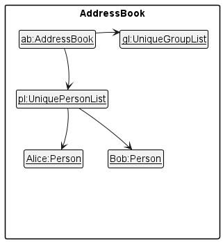

* Table of Contents
{:toc}

--- 

## **Acknowledgements**

* This project is based on the AddressBook-Level 3 project created by the [`SE-EDU initiative`](https://se-education.org/).

* The idea for [`UniqueGroupList`](https://github.com/AY2223S1-CS2103T-W10-1/tp/blob/master/src/main/java/seedu/address/model/group/UniqueGroupList.java) is replicated from that of [`UniquePersonList`](https://github.com/AY2223S1-CS2103T-W10-1/tp/blob/master/src/main/java/seedu/address/model/person/UniquePersonList.java).

* The formula used to determine the colour gradient for the [`workload`](https://github.com/AY2223S1-CS2103T-W10-1/tp/blob/master/src/main/java/seedu/address/model/assignment/Workload.java) used in [`PersonCard`](https://github.com/AY2223S1-CS2103T-W10-1/tp/blob/master/src/main/java/seedu/address/ui/PersonCard.java) is adapted from [`here`](https://stackoverflow.com/questions/340209/generate-colors-between-red-and-green-for-a-power-meter)

--------------------------------------------------------------------------------------------------------------------

## **Setting up, getting started**

Refer to the guide [_Setting up and getting started_](SettingUp.md).

--- 

## **Design**

:bulb: **Tip:** The `.puml` files used to create diagrams in this document can be found in the [diagrams](https://github.com/se-edu/addressbook-level3/tree/master/docs/diagrams/) folder. Refer to the [_PlantUML Tutorial_ at se-edu/guides](https://se-education.org/guides/tutorials/plantUml.html) to learn how to create and edit diagrams.

### Architecture

The ***Architecture Diagram*** given above explains the high-level design of the App.

Given below is a quick overview of main components and how they interact with each other.

**Main components of the architecture**

**`Main`** has two classes called [`Main`](https://github.com/AY2223S1-CS2103T-W10-1/tp/blob/master/src/main/java/seedu/address/Main.java) and [`MainApp`](https://github.com/AY2223S1-CS2103T-W10-1/tp/blob/master/src/main/java/seedu/address/MainApp.java). It is responsible for,
* At app launch: Initializes the components in the correct sequence, and connects them up with each other.
* At shut down: Shuts down the components and invokes cleanup methods where necessary.

[**`Commons`**](#common-classes) represents a collection of classes used by multiple other components.

The rest of the App consists of four components.

* [**`UI`**](#ui-component): The UI of the App.
* [**`Logic`**](#logic-component): The command executor.
* [**`Model`**](#model-component): Holds the data of the App in memory.
* [**`Storage`**](#storage-component): Reads data from, and writes data to, the hard disk.

**How the architecture components interact with each other**

The *Sequence Diagram* below shows how the components interact with each other for the scenario where the user issues the command `deleteperson John`.

Each of the four main components (also shown in the diagram above),

* defines its *API* in an `interface` with the same name as the Component.
* implements its functionality using a concrete `{Component Name}Manager` class (which follows the corresponding API `interface` mentioned in the previous point.

For example, the `Logic` component defines its API in the `Logic.java` interface and implements its functionality using the `LogicManager.java` class which follows the `Logic` interface. Other components interact with a given component through its interface rather than the concrete class (reason: to prevent outside component's being coupled to the implementation of a component), as illustrated in the (partial) class diagram below.

The sections below give more details of each component.

--- 

### UI component

The **API** of this component is specified in [`Ui.java`](https://github.com/AY2223S1-CS2103T-W10-1/tp/blob/master/src/main/java/seedu/address/ui/Ui.java)

The UI consists of a `MainWindow` that is made up of the following parts e.g. `CommandBox`, `ResultDisplay`, `PersonListPanel`, `StatusBarFooter`, `Help Window`, `AssignmentListPanel`, `GroupListPanel`. All these, including the `MainWindow`, inherit from the abstract `UiPart` class which captures the commonalities between classes that represent parts of the visible GUI.

The `UI` component uses the JavaFx UI framework. The layout of these UI parts are defined in matching `.fxml` files that are in the `src/main/resources/view` folder. For example, the layout of the [`MainWindow`](https://github.com/AY2223S1-CS2103T-W10-1/tp/blob/master/src/main/java/seedu/address/ui/MainWindow.java) is specified in [`MainWindow.fxml`](https://github.com/AY2223S1-CS2103T-W10-1/tp/blob/master/src/main/resources/view/MainWindow.fxml)

The `UI` component,

* executes user commands using the `Logic` component.
* listens for changes to `Model` data so that the UI can be updated with the modified data.
* keeps a reference to the `Logic` component, because the `UI` relies on the `Logic` to execute commands.
* depends on some classes in the `Model` component, as it can display `Person`, `Group`, `Assignment` objects residing in the `Model`.

--- 

### Logic component

**API** : [`Logic.java`](https://github.com/AY2223S1-CS2103T-W10-1/tp/blob/master/src/main/java/seedu/address/logic/Logic.java)

Here's a (partial) class diagram of the `Logic` component:

How the `Logic` component works:
1. When `Logic` is called upon to execute a command, it uses the `AddressBookParser` class to parse the user command.
1. This results in a `Command` object (more precisely, an object of one of its subclasses e.g., `AddPersonCommand`) which is executed by the `LogicManager`.
1. The command can communicate with the `Model` when it is executed (e.g. to add a person).
1. The result of the command execution is encapsulated as a `CommandResult` object which is returned back from `Logic`.

The Sequence Diagram below illustrates the interactions within the `Logic` component for the `execute("deleteperson John")` API call.

:information_source: **Note:** The lifeline for `DeleteCommandParser` should end at the destroy marker (X) but due to a limitation of PlantUML, the lifeline reaches the end of diagram.

Here are the other classes in `Logic` (omitted from the class diagram above) that are used for parsing a user command:

How the parsing works:
* When called upon to parse a user command, the `AddressBookParser` class creates an `XYZCommandParser` (`XYZ` is a placeholder for the specific command name e.g., `AddPersonCommandParser`) which uses the other classes shown above to parse the user command and create a `XYZCommand` object (e.g., `AddPersonCommand`) which the `AddressBookParser` returns back as a `Command` object.
* All `XYZCommandParser` classes (e.g., `AddPersonCommandParser`, `DeletePersonCommandParser`, ...) inherit from the `Parser` interface so that they can be treated similarly where possible e.g, during testing.

--- 

### Model component
**API** : [`Model.java`](https://github.com/AY2223S1-CS2103T-W10-1/tp/blob/master/src/main/java/seedu/address/model/Model.java)

The `Model` component,

* stores the address book data:
  * all `Person` objects (which are contained in a `UniquePersonList` object).
  * all `Group` objects (which are contained in a `UniqueGroupList` object).
* stores the currently 'selected' `Person` or `Group` objects (e.g., results of a search query) as separate _filtered_ lists which are exposed to outsiders as
unmodifiable `ObservableList<Person>` and `ObservableList<Group>`that can be 'observed' e.g. the UI can be bound to this list so that the UI automatically updates when the data in the lists change.
* stores a `UserPref` object that represents the user’s preferences. This is exposed to the outside as a `ReadOnlyUserPref` objects.
* does not depend on any of the other three components (as the `Model` represents data entities of the domain, they should make sense on their own without depending on other components)

**Person** : [`Person.java`](https://github.com/AY2223S1-CS2103T-W10-1/tp/blob/master/src/main/java/seedu/address/model/person/Person.java)

The `Person` component in relation to `Addressbook` and `UniquePersonList` is given in further detail here.

The `Person` component,

* is composed of `Name`, `Phone`, `Email`, `Address` mandatory attributes
* references any number of `Tags` from the `UniqueTagList` in `Addressbook`. This allows `AddressBook` to only require one `Tag` object per unique tag, instead of each `Person` needing their own `Tag` objects.
* references any number of `Assignments` stored in a `Hashmap<key:String, value:ArrayList<ssignment>>`. This enables keeping track of a `Person`'s assignments under a specific `Group`.

**Group** : [`Group.java`](https://github.com/AY2223S1-CS2103T-W10-1/tp/blob/master/src/main/java/seedu/address/model/group/Group.java)

The `Group` component in relation to `Addressbook` and `UniqueGroupList` is given in further detail here.

The `Group` component,
* is composed of `GroupName` mandatory attribute
* references any number of `Persons` from the `UniquePersonList` in Addressbook. This allows `AddressBook` to only require one `Person` object per unique person, instead of each `Group` needing their own `Person` objects.

**Assignment** : [`Assignment.java`](https://github.com/AY2223S1-CS2103T-W10-1/tp/blob/master/src/main/java/seedu/address/model/assignment/Assignment.java)

The `Assignment` component,
* is composed of `Task` mandatory attribute, which is a string description of the `Assignment`.
* is composed of `Workload` mandatory attribute, coded as an enum of `High`, `Medium` or `Low`.
* has an optional `Deadline` attribute which is a `LocalDateTime` object.

--- 

### Storage component

**API** : [`Storage.java`](https://github.com/AY2223S1-CS2103T-W10-1/tp/blob/master/src/main/java/seedu/address/storage/Storage.java)

The `Storage` component,
* can save both address book data and user preference data in json format, and read them back into corresponding objects.
* inherits from both `AddressBookStorage` and `UserPrefStorage`, which means it can be treated as either one (if only the functionality of only one is needed).
* depends on some classes in the `Model` component (because the `Storage` component's job is to save/retrieve objects that belong to the `Model`)

--- 

### Common classes

Classes used by multiple components are in the `seedu.addressbook.commons` package.

--- 

## **Implementation**

This section describes some noteworthy details on how certain features are implemented.

### **\[Developed\] Add/Delete Group feature**

#### **Implementation**
This feature allows groups to be added to and deleted from TABS, facilitated by the `UniqueGroupList`.
It is achieved by the following operations:

- `Model#addGroup(GroupName)` - Adds a group to TABS with the input groupname.
- `Model#deleteGroup(GroupName)` - Deletes the group with the input groupname, and removes any members and assignments associated.

Given below is an example usage scenario and how groups are added/deleted at each stage.

**Step 1.**
The user launches the application for the first time. Presuming they have not made changes to the default persons,
the `AddressBook` model looks like this (some Persons removed for simplicity):

**Step 2.**
User executes `addgroup g/CS2103T`. This causes a new group with `GroupName` "CS2103T" and no members to be
added to the `AddressBook` model, reflected below:

**Note:** The associated parser `AddGroupCommandParser` checks that the entered group name is valid, following same
conventions as naming a `Person`, and the command itself `AddGroupCommand` checks that a group of the same name does
not already exist in the app.

**Step 3.**
Suppose now the user adds `Alice` and `Bob` as members of group CS2103T as shown in [this implementation](#developed-adddelete-member-feature). 
Then, the user assigns `Alice` a task named Task1 under the group CS2103T as demonstrated in [this implementation](#developed-assigndelete-task-feature).
The `AddressBook` model now looks like this:

**Step 4.**
User executes `deletegroup g/CS2103T`. This deletes the group with `GroupName` "CS2103T" and additionally:
- Removes any members of the group e.g. `Alice` and `Bob` in this instance
- Removes any tasks associated with the group e.g. `Alice`'s task.
The `AddressBook` model now looks like this:

**Note:** The associated parser `DeleteGroupCommandParser` checks that the entered group name is valid, following same
conventions as naming a `Person`, and the command itself `DeleteGroupCommand` checks that a group with this name exists
in the app. Below is an activity diagram reflecting this:

For simplicity, only the `DeleteGroupCommand`'s execution is shown below. Both commands operate via a similar sequence:

**Design Considerations:**

**Aspect: Data Structure used to store Groups:**
- Alternative 1 (current choice): Reference the `UniquePersonList` in `AddressBook` class
  - Pros:
    - Design is consistent with existing system architecture.
  - Cons:
    - `UniquePersonList` implementation may be unfamiliar.
- Alternative 2: Use simpler data structure e.g. Sets/ArrayList
  - Pros:
    - Can leverage Java libraries, simple to implement.
  - Cons:
    - Design may not be consistent with existing system architecture.
    - Run risk of not accounting for future features, have to design workarounds that weaken the data structure.
    - May violate immutability principle employed in the existing system architecture.

--- 

### **\[Developed\] Add/Delete member feature**

#### **Implementation**
This feature allows members to be added to and deleted from a group. It is
achieved by the following operations:

- `Model#addMember(Name, GroupName)` - Adds the person with the input name to the group with input groupname.
- `Model#deleteMember(Name, GroupName)` - Removes the person with the input name from the group with the input groupname.

Given below is an example usage scenario and how groups are added/deleted at each stage.

**Step 1.**
Starting from the default persons, the user has executed `addgroup g/CS2103T` to add a group with
`GroupName` "CS2103T". The `AddressBook` model is reflected below:

**Step 2.**
User executes `addmember g/CS2103T n/Alice` to add `Alice` to the
group `CS2103T`. The associated command `AddGroupMemberCommand` first
constructs an `editedPerson` and `editedGroup` to replace `Alice` and
`CS2103T` respectively, before calling `Model#setPerson()` and
`Model#setGroup()` with the respective edits to change `Alice` and
`CS2103T` in the `AddressBook`.
The `AddressBook` model is reflected below:

**Note:** The command itself `AddGroupMemberCommand` checks that both person `Alice` and group
`CS2103T` exist in the app, and that `Alice` is not already a member of `CS2103T`.

**Step 3.**
Suppose the user assigns `Alice` a task under the group. The `AddressBook` model now looks like this:

**Step 4.**
User executes `deletemember g/CS2103T n/Alice`. This removes `Alice` from `CS2103T` and removes any tasks
associated with the group. The associated command `DeleteGroupMemberCommand` first
constructs an `editedPerson` and `editedGroup` to replace `Alice` and
`CS2103T` respectively, before calling `Model#setPerson()` and
`Model#setGroup()` with the respective edits to change `Alice` and
`CS2103T`.
The `AddressBook` model now looks like this:

**Note:** The command itself `DeleteGroupMemberCommand` checks that both person `Alice` and group
`CS2103T` exist in the app, and that `Alice` is a member of `CS2103T` prior to deletion.

For simplicity, only the `DeleteGroupMemberCommand`'s execution is shown below. Both commands operate via a similar sequence:

**Design Considerations:**

**Aspect: How a group maintains references to its members:**
- Alternative 1 (current choice): Maintains a reference to a `Person` object.
  - Pros:
    - When deleting group/performing groupwide assignment or deletion of task, easier to retrieve each member to be edited.
  - Cons:
    - Duplication of `Person` in memory, may have performance issues.
- Alternative 2: Maintain a String/`Name` object `Person` only.
  - Pros:
    - No duplication of `Person` in memory, though `Name` object may be duplicated.
  - Cons:
    - When deleting group/performing groupwide assignment or deletion of task, have to lookup the actual `Person` object in AB3 model;
      incur overhead.
- Alternative 3: References to `Group` maintained in a member i.e. the other way around.
  - Pros:
    - No duplication of `Person` in memory.
  - Cons:
    - Deleting group/performing groupwide assignment or deletion of task is even more difficult as
      will have to perform linear scan of the entire `Person` list to surface affected members.
    
--- 

### **\[Developed\] Display/List Group feature**

#### **Implementation**
This feature allows a single group to be listed, or displays all groups. It is facilitated
by the following operations:

- `Model#displayGroup(GroupName)` - Finds and lists the group with the input groupname.
- `Model#listGroups()` - Displays all groups in TABS

Given below is an example usage scenario and how groups can be individually displayed/displayed altogether in TABS.

**Step 1.**
Starting from the default persons, the user has executed `addgroup g/CS2103T` to add a group with
`GroupName` "CS2103T".

**Step 2.**
User executes `displaygroup CS2103T`. The associated command `DisplayGroupCommand` calls
`Model#updateFilteredGroupList(predicate)` with the given predicate being the `GroupName` CS2103T
to display just the group with that name.

**Note:**
`DisplayGroupCommand` first checks validity of input against the full group list, obtained as an
`ObservableList<Group>` from `Model#getFilteredGroupList()`. If the input `GroupName` does not correspond
to a group in this list, a `CommandException` will be thrown notifying the user accordingly.

**Step 3.**
User executes `listgroups`. The associated command `ListGroupsCommand` calls
`Model#updateFilteredGroupList(PREDICATE_SHOW_ALL_GROUPS)`to display all groups in the app.

For simplicity, only the `DisplayGroupCommand`'s execution is shown below. Both commands operate via a similar sequence:

--- 

### **\[Developed\] Assign/Delete Task feature**

#### **Implementation**
This feature allows the user to assign a task to a member, or remove a task from a member. It is facilitated
by the following operations:

- `Model#assignTask(GroupName, Name, Task, Workload, [Deadline])` - Creates an `Assignment` with `Task` (description),
`Workload` and optional `Deadline`. This `Assignment` will be added to the person with the input name, under the group
with the input groupname (a person can hold multiple `Assignments` of the same `Task`, but under different groups).
- `Model#deleteTask(GroupName, Name, Task)`. Deletes the `Assignment` with description `Task` from the person with the input name,
under the group with the input groupname.

Given below is an example usage scenario and how tasks are assigned/deleted at each stage.

**Step 1.**
Starting from the default persons, the user has executed `addgroup g/CS2103T` to add a group with
`GroupName` "CS2103T", then `addmember g/CS2103T n/Alice` to add `Alice` to
the group `CS2103T`. The `AddressBook` model is reflected below:

**Step 2.**
User executes `assigntask Alice g/CS2103T task/Task w/High`. This:
- Constructs an Assignment with `Task` "Task" and `Workload` "High".
- Constructs an `editedPerson` to replace `Alice` with a copy which
includes this Assignment, and an `editedGroup` containing the edited
`Alice`.
- Calls `Model#setPerson()` and `Model#setGroup()` with the respective
edits to change `Alice` and `CS2103T` in the `AddressBook`.

The `AddressBook` model is reflected below:

**Note:** `AssignTaskCommandParser` will check if the assignment's parameters are parsed properly,
such as `Task` being non-empty, `Deadline` being a valid date, etc.
`AssignTaskCommand` further checks if both the person and group with the specified name and groupname respectively
exist in the app, that the person is a member of the group, and the person doesn't already have a similar task under
the group.

The user flow of Assign Task can be illustrated in the Activity Diagram as shown below.

**Step 3.**
User executes `deletetask Alice g/CS2103T task/Task`. This constructs an `editedPerson`
to replace `Alice` with a copy which removes the Assignment whose `Task` matches input,
and an `editedGroup` containing the edited `Alice`. This also calls `Model#setPerson()` and `Model#setGroup()` with the respective
edits to change `Alice` and `CS2103T` in the `AddressBook`.

The `AddressBook` model is reflected below:

**Note:** `DeleteTaskCommand` checks if both the person and group with the specified name and groupname respectively
exist in the app, that the person is a member of the group, and the person has the specified task under
the group.

For simplicity, only the `DeleteTaskCommand`'s execution is shown below. Both commands operate via a similar sequence:

**Design Considerations:**

**Aspect: Where task list should be maintained**
- Alternative 1: `Group` object stores a HashMap mapping `Person` to task
  - Pros:
    - Easy to implement
    - Deleting tasks from a `Person` does not require modification of the `Person` object.
  - Cons:
    - If the `Person` is part of multiple groups, retrieving all tasks to display on their card requires referencing multiple `Group` objects.
- Alternative 2 (Current Option): `Person` object stores `Assignments` as a HashMap of `<key:String, value:ArrayList<ssignment>>` where the String is the group name.
  - Pros:
    - Since a `Person` object can be in multiple `Groups`, storing all tasks in `Person` incurs less overhead when all those tasks are displayed in the assignments view.
  - Cons:
    - Deleting tasks from a `Person` requires modification of the `Person` object. This is compounded when multiple `Person`s are updated in one command i.e. bulk commands.
    
--- 

### **\[Developed\] Bulk Assignment & Deletion of Tasks**

#### **Implementation**
This feature allows tasks to be assigned to/deleted from all members of a group simultaneously.
It is facilitated by the following operations:

- `Model#assignTaskAll(GroupName, Task, Workload, [Deadline]` - Creates an `Assignment` with `Task` (description),
  `Workload` and optional `Deadline`. This `Assignment` will be added to all members in the group
  with the input groupname. A member who has the same task name is skipped over.
- `Model#deleteTask(GroupName, Name, Task)`. Deletes the `Assignment` with description `Task` from all members
  in the group with the input groupname. A member who does not have this task is skipped over.

Given below is an example usage scenario and how tasks are assigned/deleted in bulk.

**Step 1.**
Starting from the default persons, the user has executed `addgroup g/CS2103T` to add a group with
`GroupName` "CS2103T", then `addmember g/CS2103T n/Alice`, `addmember g/CS2103T n/Alice` to add `Alice` and `Bob` to
the group `CS2103T`. The `AddressBook` model is reflected below:

**Step 2.**
User executes `assigntaskall g/CS2103T task/Task1 w/High`. This:
- Constructs an Assignment with `Task1` "Task" and `Workload` "High".
- For each member `Alice` and `Bob`:
  - Constructs an `editedPerson` to replace the member with a copy which
    includes this Assignment, and an `editedGroup` containing the edited
    member.
  - Calls `Model#setPerson()` and `Model#setGroup()` with the respective
    edits to change member and `CS2103T` in the `AddressBook`.

The `AddressBook` model is reflected below:

**Note:** `AssignTaskAllCommandParser` will check if the assignment's parameters are parsed properly,
such as `Task` being non-empty, `Deadline` being a valid date, etc.
`AssignTaskAllCommand` further checks if group with the specified groupname exists in the app. Each member in the group
is handled in a for loop. Members who already have the assignment enter a `continue` block to the next iteration
and are not edited.

**Step 3.**
User executes `deletetaskall g/CS2103T task/Task`. Similar to above:
- For each member `Alice` and `Bob`:
  - Constructs an `editedPerson` to replace the member with a copy which
    removes this Assignment, and an `editedGroup` containing the edited
    member.
  - Calls `Model#setPerson()` and `Model#setGroup()` with the respective
    edits to change member and `CS2103T` in the `AddressBook`.

The `AddressBook` model is reflected below:

**Note:** `DeleteTaskAllCommand` checks if group with the specified groupname exists in the app. Each member in the group
is handled in a for loop. Members who do not have the assignment enter a `continue` block to the next iteration
and are not edited.

For simplicity, only the `DeleteTaskAllCommand`'s execution is shown below. Both commands operate via a similar sequence:

**Design Considerations:**

**Aspect: How to handle `Person`s with duplicate task when assigning/no task when deleting:**
- Alternative 1 (Current Option): Person who already has the same task name is skipped over
  - Pros:
    - More user-friendly; if the user does not know that a `Person` already has/does not have the assignment to be added/deleted respectively, the end result is close to the desired outcome.
  - Cons:
    - Have to maintain a list of updated `Person`s to feedback to user; more difficult to implement.
    - The task assigned previously is a different object to the one currently being assigned; can cause memory issues.
- Alternative 2: Return CommandException
  - Pros:
    - Easier to implement.
  - Cons:
    - Less user-friendly; if the user does not keep track of tasks already assigned, cannot take advantage of
      the feature easily.
- Alternative 3: Replace tasks of the same name
  - Pros:
    - More user-friendly; if the user intends to replace the tasks previously assigned, the end result is close to the desired outcome.
    - Since task objects are replaced, no duplication of tasks exists.
  - Cons:
    - In addition to the difficulties mentioned in Alternative 1, must also replace tasks inside a `Person` object; most difficult option to implement.
    
--- 

## **Documentation, logging, testing, configuration, dev-ops**

* [Documentation guide](Documentation.md)
* [Testing guide](Testing.md)
* [Logging guide](Logging.md)
* [Configuration guide](Configuration.md)
* [DevOps guide](DevOps.md)

--- 

## **Appendix: Requirements**
### Product scope
**Target user profile**:
Project team leaders with many projects, members and tasks to assign.

**Value proposition**:
* view information of which group members are in their project.
* track which tasks have been assigned to which members.
* see an estimate of how much workload each member has.
* receive information regarding upcoming deadlines.

### User stories

#### Priorities:
- High (must have) &nbsp;&nbsp;&nbsp;&nbsp;&nbsp;&nbsp;&nbsp;&nbsp;- `* * *`
- Medium (nice to have) - `* *`
- Low (unlikely to have) &nbsp;- `*`

| Priority | As a ...          | I want to ...                                                                  | So that I can ...                                                                      |
|:---------|:------------------|:-------------------------------------------------------------------------------|:---------------------------------------------------------------------------------------|
| `* * * ` | beginner user     | see usage instructions                                                         | refer to instructions when I forget how to use the App                                 |
| `* * *`  | beginner user     | add contacts to my app                                                         |                                                                                        |
| `* * *`  | beginner user     | remove existing contacts on my app                                             | remove entries that I no longer need                                                   |
| `* * *`  | beginner user     | create a group                                                                 |                                                                                        |
| `* * *`  | beginner user     | add members to a group                                                         |                                                                                        |
| `* *`    | intermediate user | locate a particular contact                                                    | quickly find a member                                                                  |
| `* *`    | intermediate user | have a quick overview of all my groups with their existing members             |                                                                                        |
| `* * *`  | intermediate user | assign tasks to members                                                        |                                                                                        |
| `* *`    | intermediate user | have a quick overview of tasks assigned to members in the group                |                                                                                        |
| `* *`    | intermediate user | create a tag specific to the group project                                     | quickly assign tags to members                                                         |
| `* *`    | intermediate user | place tags on group members                                                    | better identify their role                                                             |
| `* *`    | intermediate user | assign multiple tags to a user if needed                                       | identify their roles more specifically                                                 |
| `* *`    | intermediate user | filter and search for groups                                                   | quickly identify the one in particular                                                 |
| `* *`    | advanced user     | view deadlines for each project                                                | periodically use this for self-reminder                                                |
| `* *`    | advanced user     | have a rough sense of the workload of every member in the group                | assign future tasks with more confidence                                               |
| `*`      | advanced user     | view a member’s tasks in more detail                                           | assign future tasks to them with more confidence                                       |
| `* * *`  | advanced user     | add more tasks to a member                                                     |                                                                                        |
| `* * *`  | advanced user     | delete tasks from a member                                                     |                                                                                        |
| `*`      | advanced user     | categorise the tasks assigned into different levels of intensity               | not judge workload based solely on the number of tasks per member                      |
| `* * *`  | advanced user     | delete unused groups after the project is completed                            | declutter my app                                                                       |
| `* * *`  | advanced user     | delete existing tags if they are no longer relevant                            | declutter my app                                                                       |
| `*`      | advanced user     | reuse existing tags in groups for future projects                              | establish new projects under my management style                                       |
| `*`      | advanced user     | move tags and assignments from one user to another easily                      | ensure that members can ‘swap’ roles hassle-free                                       |
| `* *`    | expert user       | perform group-wide addition of tags and assignments                            | ensure that repetitive new assignments are made as quickly and accurately as possible. |
| `* *`    | expert user       | perform group-wide removal of tags and assignments                             | ensure that group members’ roles are quickly cleared owing to new demands              |
| `*`      | expert user       | be notified when a member completes his task or when a deadline is approaching | better manage my time                                                                  |
| `*`      | expert user       | create shortcuts and pin most important projects on the top of the app         | access these projects faster                                                           |
| `*`      | expert user       | have the choice of deleting users from the app when a project completes        | quickly declutter my app                                                               |
| `*`      | expert user       | set timers to add/delete groups after a project ends                           | ensure that I do not have too many groups cluttering the database                      |

--- 

## Use cases

For all use cases below, the **System** is `TABS` and the **Actor** is the user, unless specified otherwise.

### UC1: Add a person

**MSS**

1. User requests to add a person in TABS.
2. TABS display that person is successfully added.

&nbsp;&nbsp;
Use case ends.

**Extensions:**

&nbsp;&nbsp;
1a. The person already exists in TABS.

&nbsp;&nbsp;&nbsp;&nbsp;&nbsp;&nbsp;&nbsp;&nbsp;
1a1. TABS displays that the person already exists in TABS.

&nbsp;&nbsp;&nbsp;&nbsp;&nbsp;&nbsp;&nbsp;&nbsp;
Use case ends.

&nbsp;&nbsp;
1b. TABS detects missing or invalid required fields.

&nbsp;&nbsp;&nbsp;&nbsp;&nbsp;&nbsp;&nbsp;&nbsp;
1b1. TABS displays the format of the command and the required fields.

&nbsp;&nbsp;&nbsp;&nbsp;&nbsp;&nbsp;&nbsp;&nbsp;
Use case ends.

&nbsp;&nbsp;
1c. TABS detects missing optional fields.

&nbsp;&nbsp;&nbsp;&nbsp;&nbsp;&nbsp;&nbsp;&nbsp;
1c1. TABS sets the optional field to be empty.

&nbsp;&nbsp;&nbsp;&nbsp;&nbsp;&nbsp;&nbsp;&nbsp;
Use case resumes at step 2.

### UC2: Edit a person’s details

**MSS**

1. User requests to edit an existing person in TABS.
2. TABS displays the modified person.

&nbsp;&nbsp;
Use case ends.

**Extensions:**

&nbsp;&nbsp;
1a. The person specified is not found in TABS.

&nbsp;&nbsp;&nbsp;&nbsp;&nbsp;&nbsp;&nbsp;&nbsp;
1a1. TABS displays that the person does not exist.

&nbsp;&nbsp;&nbsp;&nbsp;&nbsp;&nbsp;&nbsp;&nbsp;
Use case ends.

&nbsp;&nbsp;
1b. TABS detects missing or invalid required fields.

&nbsp;&nbsp;&nbsp;&nbsp;&nbsp;&nbsp;&nbsp;&nbsp;
1b1. TABS displays the format of the command and the required fields.

&nbsp;&nbsp;&nbsp;&nbsp;&nbsp;&nbsp;&nbsp;&nbsp;
Use case ends.

### UC3: Find a person

**MSS**

1. User requests to find an existing person in TABS by providing filters.
2. TABS displays the person found based on the filter.

&nbsp;&nbsp;
Use case ends.

**Extensions**

&nbsp;&nbsp;
1a. TABS detects missing or invalid filters.

&nbsp;&nbsp;&nbsp;&nbsp;&nbsp;&nbsp;&nbsp;&nbsp;
1a1. TABS displays the format of the command and the filter.

&nbsp;&nbsp;&nbsp;&nbsp;&nbsp;&nbsp;&nbsp;&nbsp;
Use case ends.

&nbsp;&nbsp;
1b. No person in TABS matches the filters provided.

&nbsp;&nbsp;&nbsp;&nbsp;&nbsp;&nbsp;&nbsp;&nbsp;
1b1. TABS displays that no person is found.

&nbsp;&nbsp;&nbsp;&nbsp;&nbsp;&nbsp;&nbsp;&nbsp;
Use case ends.

### UC4: List every person

**MSS**

1. User requests to list every person.
2. TABS shows the list of every person in TABS.

&nbsp;&nbsp;
Use case ends.

### UC5: Delete a person

**MSS**

1. User requests to delete an existing person in TABS.
2. TABS displays that the person is successfully deleted.

&nbsp;&nbsp;
Use case ends.

**Extensions:**

&nbsp;&nbsp;
1a. The person specified is not found in TABS.

&nbsp;&nbsp;&nbsp;&nbsp;&nbsp;&nbsp;&nbsp;&nbsp;
1a1. TABS displays that the person specified does not exist in TABS.

&nbsp;&nbsp;&nbsp;&nbsp;&nbsp;&nbsp;&nbsp;&nbsp;
Use case ends.

&nbsp;&nbsp;
1b. TABS detects missing or invalid required fields.

&nbsp;&nbsp;&nbsp;&nbsp;&nbsp;&nbsp;&nbsp;&nbsp;
1b1. TABS displays the format of the command and the required fields.

&nbsp;&nbsp;&nbsp;&nbsp;&nbsp;&nbsp;&nbsp;&nbsp;
Use case ends.

### UC6: Add a group

**MSS**

1. User requests to add a group in TABS.
2. TABS adds the group.

&nbsp;&nbsp;
Use case ends.

**Extensions:**

&nbsp;&nbsp;
1a. The group already exists in TABS.

&nbsp;&nbsp;&nbsp;&nbsp;&nbsp;&nbsp;&nbsp;&nbsp;
1a1. TABS displays that the group already exists in TABS.

&nbsp;&nbsp;&nbsp;&nbsp;&nbsp;&nbsp;&nbsp;&nbsp;
Use case ends.

&nbsp;&nbsp;
1b. TABS detects missing or invalid required fields.

&nbsp;&nbsp;&nbsp;&nbsp;&nbsp;&nbsp;&nbsp;&nbsp;
1b1. TABS displays the format of the command and the required fields.

&nbsp;&nbsp;&nbsp;&nbsp;&nbsp;&nbsp;&nbsp;&nbsp;
Use case ends.

### UC7: Display a group

**MSS**

1. User requests to display a group in TABS.
2. TABS displays the group with its members.

&nbsp;&nbsp;
Use case ends.

**Extensions:**

&nbsp;&nbsp;
1a. The group specified is not found in TABS.

&nbsp;&nbsp;&nbsp;&nbsp;&nbsp;&nbsp;&nbsp;&nbsp;
1a1. TABS displays that the group specified does not exist in TABS.

&nbsp;&nbsp;&nbsp;&nbsp;&nbsp;&nbsp;&nbsp;&nbsp;
Use case ends.

&nbsp;&nbsp;
1b. TABS detects missing or invalid required fields.

&nbsp;&nbsp;&nbsp;&nbsp;&nbsp;&nbsp;&nbsp;&nbsp;
1b1. TABS displays the format of the command and the required fields.

&nbsp;&nbsp;&nbsp;&nbsp;&nbsp;&nbsp;&nbsp;&nbsp;
Use case ends.

### UC8: List all groups

**MSS**

1. User requests to list all the groups in TABS.
2. TABS displays all the group with their respective members.

&nbsp;&nbsp;
Use case ends.

### UC9: Delete a group

**MSS**

1. User requests to delete a group in TABS.
2. TABS displays that the group is successfully deleted.

&nbsp;&nbsp;
Use case ends.

**Extensions:**

&nbsp;&nbsp;
1a. The group specified is not found in TABS.

&nbsp;&nbsp;&nbsp;&nbsp;&nbsp;&nbsp;&nbsp;&nbsp;
1a1. TABS displays that the group specified does not exist in TABS.

&nbsp;&nbsp;&nbsp;&nbsp;&nbsp;&nbsp;&nbsp;&nbsp;
Use case ends.

&nbsp;&nbsp;
1b. TABS detects missing or invalid required fields.

&nbsp;&nbsp;&nbsp;&nbsp;&nbsp;&nbsp;&nbsp;&nbsp;
1b1. TABS displays the format of the command and the required fields.

&nbsp;&nbsp;&nbsp;&nbsp;&nbsp;&nbsp;&nbsp;&nbsp;
Use case ends.

### UC10: Add a person to a group

**MSS**

1. User requests to add a person to a group in TABS.
2. TABS displays that the person specified is added to the group specified.

&nbsp;&nbsp;
Use case ends.

**Extensions:**

&nbsp;&nbsp;
1a. The person specified or the group specified is not found in TABS.

&nbsp;&nbsp;&nbsp;&nbsp;&nbsp;&nbsp;&nbsp;&nbsp;
1a1. TABS displays that the person specified or the group specified does not exist.

&nbsp;&nbsp;&nbsp;&nbsp;&nbsp;&nbsp;&nbsp;&nbsp;
Use case ends.

&nbsp;&nbsp;
1b. The person specified is already in the group specified.

&nbsp;&nbsp;&nbsp;&nbsp;&nbsp;&nbsp;&nbsp;&nbsp;
1b1. TABS displays that the person specified is already in the group specified.

&nbsp;&nbsp;&nbsp;&nbsp;&nbsp;&nbsp;&nbsp;&nbsp;
Use case ends.

&nbsp;&nbsp;
1c. TABS detects missing or invalid required fields.

&nbsp;&nbsp;&nbsp;&nbsp;&nbsp;&nbsp;&nbsp;&nbsp;
1c1. TABS displays the format of the command and the required fields.

&nbsp;&nbsp;&nbsp;&nbsp;&nbsp;&nbsp;&nbsp;&nbsp;
Use case ends.

### UC11: Remove a person from a group

**MSS**

1. User requests to remove an existing person from an existing group.
2. TABS displays that the person specified is removed from the group.

&nbsp;&nbsp;
Use case ends.

**Extensions:**

&nbsp;&nbsp;
1a. The person specified or the group specified is not found in TABS.

&nbsp;&nbsp;&nbsp;&nbsp;&nbsp;&nbsp;&nbsp;&nbsp;
1a1. TABS displays that the person specified or the group specified does not exist.

&nbsp;&nbsp;&nbsp;&nbsp;&nbsp;&nbsp;&nbsp;&nbsp;
Use case ends.

&nbsp;&nbsp;
1b. The group specified does not have the person specified in TABS.

&nbsp;&nbsp;&nbsp;&nbsp;&nbsp;&nbsp;&nbsp;&nbsp;
1b1. TABS displays that the person specified is not in the group specified.

&nbsp;&nbsp;&nbsp;&nbsp;&nbsp;&nbsp;&nbsp;&nbsp;
Use case ends.

&nbsp;&nbsp;
1c. TABS detects missing or invalid required fields.

&nbsp;&nbsp;&nbsp;&nbsp;&nbsp;&nbsp;&nbsp;&nbsp;
1c1. TABS displays the format of the command and the required fields.

&nbsp;&nbsp;&nbsp;&nbsp;&nbsp;&nbsp;&nbsp;&nbsp;
Use case ends.

### UC12: Assign a task to a member

**MSS**

1. User requests to assign a task to a member in TABS.
2. TABS displays that the task is added and is tagged to the person specified under the group specified.

&nbsp;&nbsp;
Use case ends.

**Extensions:**

&nbsp;&nbsp;
1a. The person specified or the group specified is not found in TABS.

&nbsp;&nbsp;&nbsp;&nbsp;&nbsp;&nbsp;&nbsp;&nbsp;
1a1. TABS displays that the person specified or the group specified does not exist.

&nbsp;&nbsp;&nbsp;&nbsp;&nbsp;&nbsp;&nbsp;&nbsp;
Use case ends.

&nbsp;&nbsp;
1b. The group specified does not have the person specified in TABS.

&nbsp;&nbsp;&nbsp;&nbsp;&nbsp;&nbsp;&nbsp;&nbsp;
1b1. TABS displays that the person specified is not in the group specified.

&nbsp;&nbsp;&nbsp;&nbsp;&nbsp;&nbsp;&nbsp;&nbsp;
Use case ends.

&nbsp;&nbsp;
1c. The task specified already exists for the person specified in TABS.

&nbsp;&nbsp;&nbsp;&nbsp;&nbsp;&nbsp;&nbsp;&nbsp;
1c1. TABS displays that the task specified already exists for the person specified in TABS.

&nbsp;&nbsp;&nbsp;&nbsp;&nbsp;&nbsp;&nbsp;&nbsp;
Use case ends.

&nbsp;&nbsp;
1d. TABS detects missing or invalid fields.

&nbsp;&nbsp;&nbsp;&nbsp;&nbsp;&nbsp;&nbsp;&nbsp;
1d1. TABS displays the format of the command and the required fields.

&nbsp;&nbsp;&nbsp;&nbsp;&nbsp;&nbsp;&nbsp;&nbsp;
Use case ends.

### UC13: Remove a task from a member

**MSS**

1. User requests to remove a task from a member.
2. TABS displays that the task is successfully removed from that member.

&nbsp;&nbsp;
Use case ends.

**Extensions:**

&nbsp;&nbsp;
1a. The person specified or the group specified is not found in TABS.

&nbsp;&nbsp;&nbsp;&nbsp;&nbsp;&nbsp;&nbsp;&nbsp;
1a1. TABS displays that the person specified or the group specified does not exist.

&nbsp;&nbsp;&nbsp;&nbsp;&nbsp;&nbsp;&nbsp;&nbsp;
Use case ends.

&nbsp;&nbsp;
1b. The group specified does not have the person specified in TABS.

&nbsp;&nbsp;&nbsp;&nbsp;&nbsp;&nbsp;&nbsp;&nbsp;
1b1. TABS displays that the person specified is not in the group specified.

&nbsp;&nbsp;&nbsp;&nbsp;&nbsp;&nbsp;&nbsp;&nbsp;
Use case ends.

&nbsp;&nbsp;
1c. The person specified does not have the task specified in TABS.

&nbsp;&nbsp;&nbsp;&nbsp;&nbsp;&nbsp;&nbsp;&nbsp;
1c1. TABS displays that the person specified does not have the task specified.

&nbsp;&nbsp;&nbsp;&nbsp;&nbsp;&nbsp;&nbsp;&nbsp;
Use case ends.

&nbsp;&nbsp;
1d. TABS detects missing or invalid fields.

&nbsp;&nbsp;&nbsp;&nbsp;&nbsp;&nbsp;&nbsp;&nbsp;
1d1. TABS displays the format of the command and the required fields.

&nbsp;&nbsp;&nbsp;&nbsp;&nbsp;&nbsp;&nbsp;&nbsp;
Use case ends.

### UC14: Group assignment of task

**MSS**

1. User requests to add a task to every member of a group.
2. TABS displays that the task is successfully added to every group member.

&nbsp;&nbsp;
Use case ends.

**Extensions:**

&nbsp;&nbsp;
1a. The group specified is not found in TABS.

&nbsp;&nbsp;&nbsp;&nbsp;&nbsp;&nbsp;&nbsp;&nbsp;
1a1. TABS displays that the group specified does not exist.

&nbsp;&nbsp;&nbsp;&nbsp;&nbsp;&nbsp;&nbsp;&nbsp;
Use case ends.

&nbsp;&nbsp;
1b. All the group members already have the task specified.

&nbsp;&nbsp;&nbsp;&nbsp;&nbsp;&nbsp;&nbsp;&nbsp;
1b1. TABS displays that the all the group members already have the task specified.

&nbsp;&nbsp;&nbsp;&nbsp;&nbsp;&nbsp;&nbsp;&nbsp;
Use case ends.

&nbsp;&nbsp;
1c. The group does not consist any members.

&nbsp;&nbsp;&nbsp;&nbsp;&nbsp;&nbsp;&nbsp;&nbsp;
1c1. TABS displays that the group does not have any members.

&nbsp;&nbsp;&nbsp;&nbsp;&nbsp;&nbsp;&nbsp;&nbsp;
Use case ends.

&nbsp;&nbsp;
1d. TABS detects missing or invalid fields.

&nbsp;&nbsp;&nbsp;&nbsp;&nbsp;&nbsp;&nbsp;&nbsp;
1d1. TABS displays the format of the command and the required fields.

&nbsp;&nbsp;&nbsp;&nbsp;&nbsp;&nbsp;&nbsp;&nbsp;
Use case ends.

### UC15: Group removal of task

**MSS**

1. User requests to remove a task from every member in a group in TABS.
2. TABS displays that the task is successfully removed from every group member.

&nbsp;&nbsp;
Use case ends.

**Extensions:**

&nbsp;&nbsp;
1a. The group specified is not found in TABS.

&nbsp;&nbsp;&nbsp;&nbsp;&nbsp;&nbsp;&nbsp;&nbsp;
1a1. TABS displays that the group specified does not exist.

&nbsp;&nbsp;&nbsp;&nbsp;&nbsp;&nbsp;&nbsp;&nbsp;
Use case ends.

&nbsp;&nbsp;
1b. The task specified is not found in the group specified in TABS.

&nbsp;&nbsp;&nbsp;&nbsp;&nbsp;&nbsp;&nbsp;&nbsp;
1b1. TABS displays that the task specified does not exist in any group member.

&nbsp;&nbsp;&nbsp;&nbsp;&nbsp;&nbsp;&nbsp;&nbsp;
Use case ends.

&nbsp;&nbsp;
1c. The group does not consist any members.

&nbsp;&nbsp;&nbsp;&nbsp;&nbsp;&nbsp;&nbsp;&nbsp;
1c1. TABS displays that the group does not have any members.

&nbsp;&nbsp;&nbsp;&nbsp;&nbsp;&nbsp;&nbsp;&nbsp;
Use case ends.

&nbsp;&nbsp;
1d. TABS detects missing or invalid fields.

&nbsp;&nbsp;&nbsp;&nbsp;&nbsp;&nbsp;&nbsp;&nbsp;
1d1. TABS displays the format of the command and the required fields.

&nbsp;&nbsp;&nbsp;&nbsp;&nbsp;&nbsp;&nbsp;&nbsp;
Use case ends.

--- 

## Non-functional requirements

1. Should work on any **mainstream** OS (Windows, Linux, Unix, OS-X) as long as it has `Java 11` or above installed.
2. Should be able to hold up to 500 persons and/or 10 groups without noticeable sluggishness in performance.
3. Bulk assignments/removals should be able to handle up to 20 persons without noticeable sluggishness in performance.
4. Workload indicators, if using colours, should be easily distinguishable.
5. Content should be saved to a save file that can be opened and edited with mainstream text editors e.g. Notepad.
