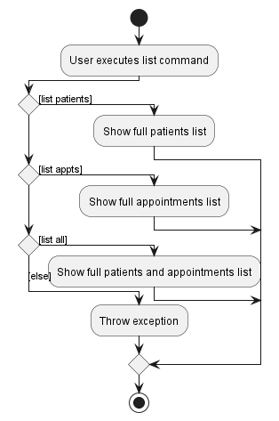
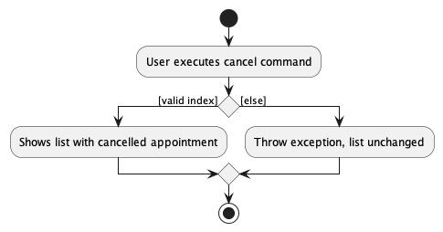
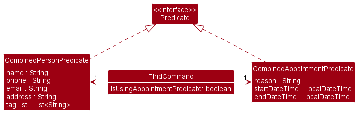

* Table of Contents
{:toc}

--------------------------------------------------------------------------------------------------------------------

## **Acknowledgements**

* {list here sources of all reused/adapted ideas, code, documentation, and third-party libraries -- include links to the original source as well}

--------------------------------------------------------------------------------------------------------------------

## **Setting up, getting started**

Refer to the guide [_Setting up and getting started_](SettingUp.md).

--------------------------------------------------------------------------------------------------------------------

## **Design**

:bulb: **Tip:** The `.puml` files used to create diagrams in this document can be found in the [diagrams](https://github.com/se-edu/addressbook-level3/tree/master/docs/diagrams/) folder. Refer to the [_PlantUML Tutorial_ at se-edu/guides](https://se-education.org/guides/tutorials/plantUml.html) to learn how to create and edit diagrams.

### Architecture

The ***Architecture Diagram*** given above explains the high-level design of the App.

Given below is a quick overview of main components and how they interact with each other.

**Main components of the architecture**

**`Main`** has two classes called [`Main`](https://github.com/se-edu/addressbook-level3/tree/master/src/main/java/seedu/address/Main.java) and [`MainApp`](https://github.com/se-edu/addressbook-level3/tree/master/src/main/java/seedu/address/MainApp.java). It is responsible for,
* At app launch: Initializes the components in the correct sequence, and connects them up with each other.
* At shut down: Shuts down the components and invokes cleanup methods where necessary.

[**`Commons`**](#common-classes) represents a collection of classes used by multiple other components.

The rest of the App consists of four components.

* [**`UI`**](#ui-component): The UI of the App.
* [**`Logic`**](#logic-component): The command executor.
* [**`Model`**](#model-component): Holds the data of the App in memory.
* [**`Storage`**](#storage-component): Reads data from, and writes data to, the hard disk.

**How the architecture components interact with each other**

The *Sequence Diagram* below shows how the components interact with each other for the scenario where the user issues the command `delete 1`.

Each of the four main components (also shown in the diagram above),

* defines its *API* in an `interface` with the same name as the Component.
* implements its functionality using a concrete `{Component Name}Manager` class (which follows the corresponding API `interface` mentioned in the previous point.

For example, the `Logic` component defines its API in the `Logic.java` interface and implements its functionality using the `LogicManager.java` class which follows the `Logic` interface. Other components interact with a given component through its interface rather than the concrete class (reason: to prevent outside component's being coupled to the implementation of a component), as illustrated in the (partial) class diagram below.

The sections below give more details of each component.

### UI component

The **API** of this component is specified in [`Ui.java`](https://github.com/se-edu/addressbook-level3/tree/master/src/main/java/seedu/address/ui/Ui.java)

The UI consists of a `MainWindow` that is made up of parts e.g.`CommandBox`, `ResultDisplay`, `PersonListPanel`, `StatusBarFooter` etc. All these, including the `MainWindow`, inherit from the abstract `UiPart` class which captures the commonalities between classes that represent parts of the visible GUI.

The `UI` component uses the JavaFx UI framework. The layout of these UI parts are defined in matching `.fxml` files that are in the `src/main/resources/view` folder. For example, the layout of the [`MainWindow`](https://github.com/se-edu/addressbook-level3/tree/master/src/main/java/seedu/address/ui/MainWindow.java) is specified in [`MainWindow.fxml`](https://github.com/se-edu/addressbook-level3/tree/master/src/main/resources/view/MainWindow.fxml)

The `UI` component,

* executes user commands using the `Logic` component.
* listens for changes to `Model` data so that the UI can be updated with the modified data.
* keeps a reference to the `Logic` component, because the `UI` relies on the `Logic` to execute commands.
* depends on some classes in the `Model` component, as it displays `Person` object residing in the `Model`.

### Logic component

**API** : [`Logic.java`](https://github.com/se-edu/addressbook-level3/tree/master/src/main/java/seedu/address/logic/Logic.java)

Here's a (partial) class diagram of the `Logic` component:

How the `Logic` component works:
1. When `Logic` is called upon to execute a command, it uses the `AddressBookParser` class to parse the user command.
1. This results in a `Command` object (more precisely, an object of one of its subclasses e.g., `AddCommand`) which is executed by the `LogicManager`.
1. The command can communicate with the `Model` when it is executed (e.g. to add a person).
1. The result of the command execution is encapsulated as a `CommandResult` object which is returned back from `Logic`.

The Sequence Diagram below illustrates the interactions within the `Logic` component for the `execute("delete 1")` API call.

:information_source: **Note:** The lifeline for `DeleteCommandParser` should end at the destroy marker (X) but due to a limitation of PlantUML, the lifeline reaches the end of diagram.

Here are the other classes in `Logic` (omitted from the class diagram above) that are used for parsing a user command:

How the parsing works:
* When called upon to parse a user command, the `AddressBookParser` class creates an `XYZCommandParser` (`XYZ` is a placeholder for the specific command name e.g., `AddCommandParser`) which uses the other classes shown above to parse the user command and create a `XYZCommand` object (e.g., `AddCommand`) which the `AddressBookParser` returns back as a `Command` object.
* All `XYZCommandParser` classes (e.g., `AddCommandParser`, `DeleteCommandParser`, ...) inherit from the `Parser` interface so that they can be treated similarly where possible e.g, during testing.

### Model component
**API** : [`Model.java`](https://github.com/se-edu/addressbook-level3/tree/master/src/main/java/seedu/address/model/Model.java)

The `Model` component,

* stores the address book data i.e., all `Person` objects (which are contained in a `UniquePersonList` object).
* stores the currently 'selected' `Person` objects (e.g., results of a search query) as a separate _filtered_ list which is exposed to outsiders as an unmodifiable `ObservableList<Person>` that can be 'observed' e.g. the UI can be bound to this list so that the UI automatically updates when the data in the list change.
* stores a `UserPref` object that represents the user’s preferences. This is exposed to the outside as a `ReadOnlyUserPref` objects.
* does not depend on any of the other three components (as the `Model` represents data entities of the domain, they should make sense on their own without depending on other components)

:information_source: **Note:** An alternative (arguably, a more OOP) model is given below. It has a `Tag` list in the `AddressBook`, which `Person` references. This allows `AddressBook` to only require one `Tag` object per unique tag, instead of each `Person` needing their own `Tag` objects. 

### Storage component

**API** : [`Storage.java`](https://github.com/se-edu/addressbook-level3/tree/master/src/main/java/seedu/address/storage/Storage.java)

The `Storage` component,
* can save both address book data and user preference data in json format, and read them back into corresponding objects.
* inherits from both `AddressBookStorage` and `UserPrefStorage`, which means it can be treated as either one (if only the functionality of only one is needed).
* depends on some classes in the `Model` component (because the `Storage` component's job is to save/retrieve objects that belong to the `Model`)

### Common classes

Classes used by multiple components are in the `seedu.addressbook.commons` package.

--------------------------------------------------------------------------------------------------------------------

## **Implementation**

This section describes some noteworthy details on how certain features are implemented.

### \[Proposed\] List patients/appointments feature

#### Proposed Implementation
The proposed list patients/appointments mechanism is facilitated by the `UniquePersonList` and `UniqueAppointmentList`
respectively. They extend `Iterable` and store lists of `Person` and `Appointment`.

An example usage scenario of list patients/appointments is given below:

**Steps:**
1. After launching the application, user executes the command `find alex` to search for entries in both
`UniquePersonList` and `UniqueAppointmentList` that contains "alex". This causes entries in the list which
does not contain "alex" to be hidden from the GUI. This will set the premise of using `list patients` and
`list appts`.

2. When user wants to view the full list of patients again, he/she can enter the command `list patients`. Note that
this command only interacts with the `UniquePersonList` and not the `UniqueAppointmentList`, thus it will not modify
the displayed list of appointments in any way.

3. When user wants to view the full list of appointments again, he/she can enter the command `list appts`. Note that
   this command only interacts with the `UniqueAppointmentList` and not the `UniquePersonList`, thus it will not modify
   the displayed list of patients in any way.

To help you understand what is going on behind the scenes, here is a sequence diagram that demonstrates how
`list patients` work:

From the diagram, the `ListCommand` object passes the predicate to show all entries to the `ModelManager`, which
will call onto a JavaFX function to modify the displayed list. For `list appts`, it follows a similar
process as well.

**Aspect: How the command is implemented:**
* **Alternative 1 (current choice):** `list patients` and `list appts` as a command words.
  * Pros: No additional parser class required
  * Cons: `ListCommand#execute()` will have more lines of code.
* **Alternative 2:** `list` as a command word with arguments `patients` or `appts` following it.
  * Pros: Seems more aligned with other commands that require more than 1 word of input
  * Cons: Require an additional `ListCommandParser` to work; more lines of code required.

We ultimately went with Alternative 1 since we do not expect `list` to take in many different arguments.

###**Cancel feature**:  
The implemented cancel feature allows users to cancel a patient's appointment based on its index in the appointment list.  
It is implemented similar to other idENTify commands and it extends `SelectAppointmentCommand`, an abstract class which encapsulates  
operations which require selecting appointments from an appointment list. The logical flow of using this command is shown in the
activity diagram given below.

The `AddressBookParser` will first check for the `cancel` command word. The cancel command
is facilitated by the `CancelCommandParser` and `CancelCommand` classes. The `CancelCommandParser`
parses the user input and obtains the index inputted by the user, before creating the cancel command to
execute the deletion of the appointment from the current appointment list.
Given below is an overview of how the cancel command executes the deletion of an appointment to delete the
first appointment (index 1) in the appointment list:

#### Design considerations:

**Aspect: How we decided to choose the user command:**

* **Alternative 1 (current choice):** Select an appointment index from appointment list
  * Pros: More convenient for the end user to just choose the indexed appointment from the current appointment list.
  * Cons: The details of a patient's appointments will not be shown under the patient's details in the patient's list.

* **Alternative 2:** Use both patient and appointment index to select an appointment to delete.
  itself.
  * Pros: Intuitive if the user just wants to delete a specified patient's appointments.
  * Cons: Appointments will have to be shown under tha patient list which will clutter up the UI.

Our team decided to change the user input format of the cancel command from `cancel PATIENT_INDEX APPOINTMENT_INDEX`
to `cancel APPOINTMENT_INDEX`, so it is faster for
the user to key in, and also more similar to the other commands with only 1 index.

### \[In progress\] Appointments archiving

#### In progress

The archive mechanism implements the following operations:

* `idENTify#archive()` — Archive appointments according to their tags or dates.

The operation is exposed in the `Command` interface as `Command#ArchiveAppointmentCommand()`.

Given below is an example usage scenario and how the archive mechanism behaves at each step.

Step 1. The user launches the application for the first time. The `idENTify` will be initialized with the initial
appointment list.

Step 2. The user executes `archive appts /t` command to archive patients by their tags, causing the modified list of
appointments after the `archive appts /t` command executes to show on the screen.

The Sequence Diagram below illustrates the interactions within the `Logic` component for the `execute
("archive appts")` API
call.

The following activity diagram summarizes what happens when a user executes a new command:

#### Design considerations:

**Aspect: How archive appointment executes:**

* **Current choice:** Create multiple appointment lists according to tags or dates and merge all the lists to show the
  merged list on the screen.

_{more aspects and alternatives to be added}_

### \[Implemented\] Book feature

#### Implementation

The `AddressBookParser` class checks for the `book` command word to begin. The book mechanism is facilitated by the `BookCommandParser` and `BookCommand` classes. The `BookCommandParser` implements the `Parser` interface and takes in the user input and parses it into an index and 3 string values. The 3 string values are obtained from the `ArgumentMultimap` that checks whether the user has inputted the 3 prefixes supported by this feature.

The 3 prefixes are:
* `r/` for reason
* `d/` for dateTime
* `pe/` for recurring time period (optional)

After retrieving the string values, the `BookCommandParser` uses the `ParserUtil` class to convert these values and create an `Appointment` object. A `BookCommand` object will be created with the given index and `Appointment` object. The `BookCommand` object will retrieve the specified person in the `UniquePersonList` and adds
the `Appointment` object to the person's list of appointments.

The newly added `Appointment` object will also be saved in the JSON file through the usage of a Jackson-friendly class `JsonAdaptedAppointment`.

Given below are some example usage scenarios and how the book feature behaves in each scenario.

Scenario 1: User inputs an empty reason in the `r/` prefix.

The `ParserUtil` class will detect that the given reason is empty and throws a `CommandException`, which will feedback to the user that he has given an invalid reason.

Scenario 2: User inputs an invalid dateTime in the `d/` prefix, such as `2022-15-10 14:00`.

The `ParserUtil` class will detect that the given dateTime is invalid and throws a `CommandException`, which will feedback to the user that he has given an invalid dateTime.

Scenario 3: User inputs an invalid recurring time period in the `pe/` prefix, such as `1S`.

The `ParserUtil` class will detect that the given time period is invalid and throws a `CommandException`, which will feedback to the user that he has given an invalid time period.

Scenario 4: User tries to book an appointment with the same time as other appointments of the same person.

This object diagram illustrates the above scenario. As the specified person has already booked an appointmnet in `Dec 10 2022 12:00`, the newly created `Appointment` object will not be associated with the person. The `BookCommand` will throw a `CommandException`, which will feedback to the user that he tried to book an appointment at the same time as the other appointments.

The following sequence diagram helps to provide a clearer picture to how the book operation works:

The following Class diagram shows how serializing `Appointment` objects into JSON format is done.

`Appointment` objects are mapped to `JsonAdaptedAppointment` objects, so that they contain only relevant fields to store and works easier with Jackson.
These objects are stored in a list field of the `JsonAdaptedPerson` and are stored together in a single JSON file, for easier retrival and assignment when starting up the application.

#### Design Considerations:

**Aspect: Where to assign Appointment objects:**

* **Alternative 1 (current implementation):** Each person stores his own list of appointments, as well as the `UniqueAppointmentList` class storing the same objects.
  * Pros: Easier to keep track of which appointments are associated to which person for other appointment related features.
  * Cons: Must ensure both the person's appointments and `UniqueAppointmentList` appointments are equal, in edit/cancel/delete features.

* **Alternative 2:** `Appointment` objects are stored only in the `UniqueAppointmentList` class.
  * Pros: Easier to maintain as there's only one appointment object.
  * Cons: Harder and more costly to track of each person's appointments, especially if the person himself is edited or deleted in the process.

### Mark/Unmark feature

The execution of the `mark`/`unmark` is quite similar to each other, with some minor differences.

Given below is an example usage scenario, where the user enters `mark 1` as the input,
and how the mark mechanism behaves at each step.

The `unmark` command functions similiarly to `mark`, but with the use of `UnmarkCommandParser` and `UnmarkCommand`
classes in place of `MarkCommandParser` and `MarkCommand` respectively.
It also lacks the logic to add recurring appointments.

#### Design considerations:

**Aspect: How mark & unmark executes:**
* **Alternative 1 (current choice):** `MarkCommand` and `UnmarkCommand` takes in an `Index` denoting the appointment to
mark/unmark.
    * Pros: Easy to implement.
    * Cons: Will have to compute the actual appointment to mark `MarkCommand`/`UnmarkCommand` itself.

* **Alternative 2:** `MarkCommand` and `UnmarkCommand` takes in the `Appointment` to be marked as a parameter in its
constructor directly
    * Pros: Cohesiveness is increased, as it only needs to concern itself with marking/unmarking the appointment.
    * Cons: The `CommandResult` object generated at the end of the command will not have the `Index` of the appointment
  recorded in it. This makes it harder to debug using `CommandResult` when bugs occur.

### Find `execute()` implementation

The `find` command,
* Takes in 2 predicates `CombinedPersonPredicate` and `CombinedAppointmentPredicate`.
* `CombinedPersonPredicate` stores all person related search strings and tests for all patients that satisfies all
the search terms.
* `CombinedAppointmentPredicate` stores all appointment related search tags and tests for all appointments that
satisfies all the search terms.
* These 2 predicates are then used together to create a single predicate that displays all the relevant patient
and appointments.

#### Design considerations:

**Aspect: How to pass in search terms to `FindCommand`:**
* **Alternative 1:** Store all search terms in `FindCommand` and use `Predicate#and` to combine the
the search predicates.
    * Pros: Easy and quick to implement. No extra classes needed.
    * Cons: There is no way to override the `Predicate#equals()`. Testability of `FindCommand` would be low.

* **Alternative 2:** Create 1 class for each search term
(E.g `NameContainsSequencePredicate`, `AppointmentContainsReasonPredicate` etc.). Create a `CombinedPersonPredicate`
and a `CombinedAppointmentPredicate` that takes in all these 'lesser' predicates and combine them to form the actual
predicate to filter the list with.
    * Pros: Testability of `FindCommand` would be very high.
    * Cons: Large amount of classes needed. There would also be the issue of excessive duplication of code.
It would also be time-consuming to add in potential new predicates in the future as much more test cases would be needed
to test each individual class.

* **Alternative 3 (current choice):** Keep the `CombinedPersonPredicate` and `CombinedAppointmentPredicate`,
and store the relevant search terms into each predicate. Combine those search terms in the predicate class itself.
    * Pros: Testability of `FindCommand` would be high. Extending the method features in the future would also be
more efficient than alternative 2.
    * Cons: Slightly less testable than alternative 2. However, the increased efficiency is worth the tradeoff.

--------------------------------------------------------------------------------------------------------------------

## **Documentation, logging, testing, configuration, dev-ops**

* [Documentation guide](Documentation.md)
* [Testing guide](Testing.md)
* [Logging guide](Logging.md)
* [Configuration guide](Configuration.md)
* [DevOps guide](DevOps.md)

--------------------------------------------------------------------------------------------------------------------

## **Appendix: Requirements**

### Product scope

**Target User Profile:**
* Tech savvy admin staff in Ear, Nose, Throat (ENT) department
* Has a need to manage a significant number of contacts
* Prefer desktop apps over other types
* Can type fast
* Prefer typing to mouse interactions
* Is reasonably comfortable using Command-Line Interface (CLI) apps

**Value proposition:**
* ENT doctors treat patients who often have chronic conditions and our product will make it easier for the staff to keep track of these patients, such as their appointment dates, the severity of their condition, their diagnosis, etc
* ENT department offers a lot of services including head & neck surgery, voice clinic, and otology / skull base, etc; therefore, they need this app to filter different types of patients

### User stories

Priorities: High (must have) - `* * *`, Medium (nice to have) - `* *`, Low (unlikely to have) - `*`

| Priority | As a …​                                    | I want to …​                   | So that I can…​                                                        |
| -------- | ------------------------------------------ | ------------------------------ | ---------------------------------------------------------------------- |
| `* * *`  | starting user                              | view a help screen             | understand how this application works                                  |
| `* * *`  | user                                       | search idENTify                | find specific patients and information faster                          |
| `* * *`  | user                                       | add a contact of the patient   | keep track of the patient's contact details                            |
| `* * *`  | user                                       | delete a contact of the patient| remove the patient from my contacts when no longer needed              |
| `* * *`  | user                                       | book an appointment for the patient | schedule the patient to meet the doctor                           |
| `* * *`  | user                                       | cancel an appointment for the patient | ensure that the appointment schedule is updated and accurate    |
| `* * *`  | user                                       | save the data of my contacts when I exit the app  | not lose the contacts when I open the app again     |
| `* * *`  | user                                       | mark an appointment as done    |  know that the patient has already visited                             |
| `* *`    | user                                       | edit information about a patient | merge and keep his information up to date                            |
| `* *`    | clumsy user                                | edit an existing appointment   | fix my error in setting their appointment details                      |
| `* *`    | clumsy user                         | unmark an appointment as done  | change my appointment state without deleting and adding the appointment again |

*{More to be added}*

### Use cases

(For all use cases below, the **System** is the `idENTify` and the **Actor** is the `user`, unless specified otherwise)

**Use Case: UC01 - Add a Patient**

**Guarantees**: A patient contact is added into idENTify.

**MSS**

1. User adds the patient by entering the command and the patient details.
2. idENTify adds the patient.

    Use case ends

**Extensions**

* 1a. idENTify detects an error in the entered data.
  - 1a1. idENTify shows an error message.
  - 1a2. User enters new data.
  - Steps 1a1-1a2 are repeated until the data entered are correct.

  Use case resumes at step 2.

**Use Case: UC02 - Show a list of patients**

**Guarantees**: A list of patients’ contact is shown.

**MSS**

1. User requests to list patients
2. idENTify shows a list of patients.

    Use case ends

**Extensions**
- 2a. The list is empty.

     Use case ends

**Use Case: UC03 - Show a list of appointments**

**Guarantees**: A list of appointments is shown.

**MSS**
1. User requests to list appointments
2. idENTify shows a list of appointments

   Use case ends

**Extensions**
- 2a. The list is empty.

    Use case ends

**Use Case: UC04 - Delete a patient**

**Guarantees**: The patient will be deleted from the patient list only if the data entered are correct.

**MSS**
1. User gets the <ins>list of patients(UC02)<ins>.
2. User requests to delete a specific patient in the list.
3. idENTify deletes the patient.

    Use case ends

**Use Case: UC05 - find a patient**

**Guarantees:**  A list of patients that matches the given query if applicable.
1.  User requests to find a patient.
2.  idENTify shows a list of patients that matches the given query.

    Use case ends.

**Extensions**

- 2a. The list is empty.

    Use case ends.

**Use Case: UC06 -  Book an appointment**

**Guarantees:** An appointment is booked for the patient only if the data entered are correct.

**MSS**

1.  User gets the <ins>list of patients(UC02)<ins>.
2.  User requests to book an appointment for a specified patient.
3.  idENTify shows that an appointment has been booked for that patient.

    Use case ends.

**Extensions**

* 2a.  idENTify detects an error in the entered data.
  - 2a1. idENTify shows an error message.
  - 2a2. User enters new data.
  - Steps 2a1-2a2 are repeated until the data entered are correct.

  Use case resumes at step 3.

**Use Case: UC07 - cancel an appointment**

**Guarantees:** The appointment will be deleted from the appointment list only if the data entered are correct.

**MSS**
1.  User gets the <ins>list of appointments(UC03)<ins>.
2.  User requests to cancel a specific appointment in the list.
3.  idENTify shows that the appointment has been cancelled.

    Use case ends.

**Extensions**

* 2a. idENTify detects an error in the entered data.
  - 2a1. idENTify shows an error message.
  - 2a2. User enters new data.
  - Steps 2a1-2a2 are repeated until the data entered are correct.

  Use case resumes at step 3.

**Use Case: UC08 - mark an appointment**

**Guarantees:** The appointment will be marked as done only if the data entered are correct.

**MSS**
1.  User gets the <ins>list of appointments(UC03)<ins>.
2.  User requests to mark a specified appointment for a specified patient.
3.  idENTify marks the selected appointment.

    Use case ends.

**Extensions**

* 2a. idENTify detects an error in the entered data.
  - 2a1. idENTify shows an error message.
  - 2a2. User enters new data.
  - Steps 2a1-2a2 are repeated until the data entered are correct.

  Use case resumes at step 3.

 **Use Case: UC09 - edit an appointment**

**Guarantees:** The appointment will have its fields edited only if the data entered are correct.

**MSS**
1.  User gets the <ins>list of appointments(UC03)<ins>.
2.  User requests to edit a specified appointment for a specified patient.
3.  idENTify edits the selected appointment.

    Use case ends.

**Extensions**

* 2a. idENTify detects an error in the entered data.
  - 2a1. idENTify shows an error message.
  - 2a2. User enters new data.
  - Steps 2a1-2a2 are repeated until the data entered are correct.

  Use case resumes at step 3.

**Use Case: UC10 - edit a patient**

**Guarantees:** The patient's contact will have its fields edited only if the data entered are correct.

**MSS**
1.  User gets the <ins>list of patients(UC02)<ins>.
2.  User requests to edit a specified patient details.
3.  idENTify edits the selected patient contact.

    Use case ends.

**Extensions**

* 2a. idENTify detects an error in the entered data.
  - 2a1. idENTify shows an error message.
  - 2a2. User enters new data.
  - Steps 2a1-2a2 are repeated until the data entered are correct.

  Use case resumes at step 3.

### Non-Functional Requirements

1. Should work on Windows, Linux, OS-X Operating System (OS) as long as it has Java 11.
2. Should be able to hold up to 1000 persons without a noticeable sluggishness in performance for typical usage.
3. A user with above average typing speed for regular English text should be able to accomplish most of the tasks
   faster using commands than using the mouse.
4. Should not be used with offensive language.
5. Expected to adhere to a schedule that delivers a feature set every one month.
6. Should respond to each command at most 1 second long.
7. Not required to make calls to contacts.
8. Should be able to store data locally in a human editable text file.
9. Should not use Database Management System to store data.
10. Product should be a result of evolving the given code base.
11. Should be for a single user.
12. Should be able to be used at any time (even beyond this semester)
13. Should not exceed 100MB in size.
14. Should not require external software to run.

*{More to be added}*

### Glossary

* **Regular English text**: Basic text that is keyed in by a user. Not code or not system admin commands.

* **Operating System (OS)**: The low-level software that supports a computer's basic functions, common ones include
  Windows, macOS, Linux.
* **Search string**: The text that a user uses to find a specific patient (such as a part of the patient’s name).
* **Command-Line Interface (CLI)**: A text-based user interface (UI) used to run programs, manage computer files and
  interact with the computer.
* **Graphical User Interface (GUI)**: A graphics-based operating system interface that uses icons, menus and a mouse
  (to click on the icon or pull down the menus) to manage interaction with the system.
* **Main Success Scenario**: Describes the most straightforward interaction for a given use case, which assumes that nothing goes wrong.
* **Actor**: A role played by a user. An actor can be a human or another system. Actors are not part of the system; they reside outside the system.
* **Backward compatible**: Refers to a hardware or software system that can use the interface of an older version of the same product.
* **Store data locally**: Allow the required data to be stored in a file in the user’s computer.
* **Database Management Systems (DBMS)**: Software systems used to store, retrieve, and run queries on data. A DBMS serves as an interface between an end-user and a database, allowing users to create, read, update, and delete data in the database.

--------------------------------------------------------------------------------------------------------------------

## **Appendix: Instructions for manual testing**

Given below are instructions to test the app manually.

:information_source: **Note:** These instructions only provide a starting point for testers to work on;
testers are expected to do more *exploratory* testing.

### Launch and shutdown

1. Initial launch

   1. Download the jar file and copy into an empty folder

   1. Double-click the jar file Expected: Shows the GUI with a set of sample contacts. The window size may not be optimum.

1. Saving window preferences

   1. Resize the window to an optimum size. Move the window to a different location. Close the window.

   1. Re-launch the app by double-clicking the jar file. 
       Expected: The most recent window size and location is retained.

1. _{ more test cases …​ }_

### Deleting a person

1. Deleting a person while all persons are being shown

   1. Prerequisites: List all persons using the `list` command. Multiple persons in the list.

   1. Test case: `delete 1` 
      Expected: First contact is deleted from the list. Details of the deleted contact shown in the status message. Timestamp in the status bar is updated.

   1. Test case: `delete 0` 
      Expected: No person is deleted. Error details shown in the status message. Status bar remains the same.

   1. Other incorrect delete commands to try: `delete`, `delete x`, `...` (where x is larger than the list size) 
      Expected: Similar to previous.

1. _{ more test cases …​ }_

### Saving data

1. Dealing with missing/corrupted data files

   1. _{explain how to simulate a missing/corrupted file, and the expected behavior}_

1. _{ more test cases …​ }_
