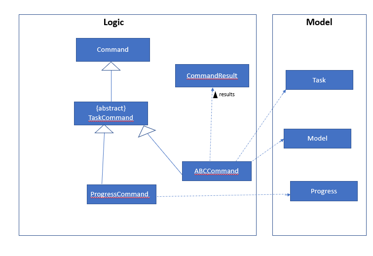
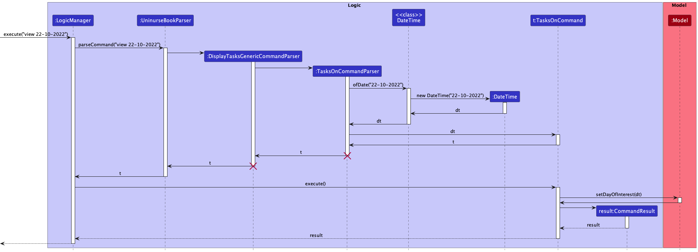

* Table of Contents
{:toc}

--------------------------------------------------------------------------------------------------------------------

## **Acknowledgements**

* {list here sources of all reused/adapted ideas, code, documentation, and third-party libraries -- include links to the original source as well}

--------------------------------------------------------------------------------------------------------------------

## **Setting up, getting started**

Refer to the guide [_Setting up and getting started_](SettingUp.md).

--------------------------------------------------------------------------------------------------------------------

## **Design**

:bulb: **Tip:** The `.puml` files used to create diagrams in this document can be found in the [diagrams](https://github.com/se-edu/addressbook-level3/tree/master/docs/diagrams/) folder. Refer to the [_PlantUML Tutorial_ at se-edu/guides](https://se-education.org/guides/tutorials/plantUml.html) to learn how to create and edit diagrams.

### Architecture

The ***Architecture Diagram*** given above explains the high-level design of the App.

Given below is a quick overview of main components and how they interact with each other.

**Main components of the architecture**

**`Main`** has two classes called [`Main`](https://github.com/se-edu/addressbook-level3/tree/master/src/main/java/seedu/address/Main.java) and [`MainApp`](https://github.com/se-edu/addressbook-level3/tree/master/src/main/java/seedu/address/MainApp.java). It is responsible for,
* At app launch: Initializes the components in the correct sequence, and connects them up with each other.
* At shut down: Shuts down the components and invokes cleanup methods where necessary.

[**`Commons`**](#common-classes) represents a collection of classes used by multiple other components.

The rest of the App consists of four components.

* [**`UI`**](#ui-component): The UI of the App.
* [**`Logic`**](#logic-component): The command executor.
* [**`Model`**](#model-component): Holds the data of the App in memory.
* [**`Storage`**](#storage-component): Reads data from, and writes data to, the hard disk.

**How the architecture components interact with each other**

The *Sequence Diagram* below shows how the components interact with each other for the scenario where the user issues the command `delete 1`.

Each of the four main components (also shown in the diagram above),

* defines its *API* in an `interface` with the same name as the Component.
* implements its functionality using a concrete `{Component Name}Manager` class (which follows the corresponding API `interface` mentioned in the previous point.

For example, the `Logic` component defines its API in the `Logic.java` interface and implements its functionality using the `LogicManager.java` class which follows the `Logic` interface. Other components interact with a given component through its interface rather than the concrete class (reason: to prevent outside component's being coupled to the implementation of a component), as illustrated in the (partial) class diagram below.

The sections below give more details of each component.

### UI component

The **API** of this component is specified in [`Ui.java`](https://github.com/se-edu/addressbook-level3/tree/master/src/main/java/seedu/address/ui/Ui.java)

The UI consists of a `MainWindow` that is made up of parts e.g.`CommandBox`, `ResultDisplay`, `PersonListPanel`, `StatusBarFooter` etc. All these, including the `MainWindow`, inherit from the abstract `UiPart` class which captures the commonalities between classes that represent parts of the visible GUI.

The `UI` component uses the JavaFx UI framework. The layout of these UI parts are defined in matching `.fxml` files that are in the `src/main/resources/view` folder. For example, the layout of the [`MainWindow`](https://github.com/AY2223S1-CS2103T-T12-4/tp/blob/master/src/main/java/seedu/uninurse/ui/MainWindow.java) is specified in [`MainWindow.fxml`](https://github.com/AY2223S1-CS2103T-T12-4/tp/blob/master/src/main/resources/view/MainWindow.fxml)

The `UI` component,

* executes user commands using the `Logic` component.
* listens for changes to `Model` data so that the UI can be updated with the modified data.
* keeps a reference to the `Logic` component, because the `UI` relies on the `Logic` to execute commands.
* depends on some classes in the `Model` component, as it displays `Person` object residing in the `Model`.

### Logic component

**API** : [`Logic.java`](https://github.com/se-edu/addressbook-level3/tree/master/src/main/java/seedu/address/logic/Logic.java)

Here's a (partial) class diagram of the `Logic` component:

How the `Logic` component works:
1. When `Logic` is called upon to execute a command, it uses the `UninurseBookParser` class to parse the user command.
1. This results in a `Command` object (more precisely, an object of one of its subclasses e.g., `AddCommand`) which is executed by the `LogicManager`.
1. The command can communicate with the `Model` when it is executed (e.g. to add a person).
1. The result of the command execution is encapsulated as a `CommandResult` object which is returned back from `Logic`.

The Sequence Diagram below illustrates the interactions within the `Logic` component for the `execute("delete 1")` API call.

:information_source: **Note:** The lifeline for `DeleteCommandParser` should end at the destroy marker (X) but due to a limitation of PlantUML, the lifeline reaches the end of diagram.

Here are the other classes in `Logic` (omitted from the class diagram above) that are used for parsing a user command:

How the parsing works:
* When called upon to parse a user command, the `UninurseBookParser` class creates an `XYZCommandParser` (`XYZ` is a placeholder for the specific command name e.g., `AddCommandParser`) which uses the other classes shown above to parse the user command and create a `XYZCommand` object (e.g., `AddCommand`) which the `UninurseBookParser` returns back as a `Command` object.
* All `XYZCommandParser` classes (e.g., `AddCommandParser`, `DeleteCommandParser`, ...) inherit from the `Parser` interface so that they can be treated similarly where possible e.g, during testing.

### Model component
**API** : [`Model.java`](https://github.com/se-edu/addressbook-level3/tree/master/src/main/java/seedu/address/model/Model.java)

The `Model` component,

* stores the UniNurse book data i.e., all `Person` objects (which are contained in a `UniquePersonList` object) and all of its saved versions.
* stores the currently 'selected' `Person` objects (e.g., results of a search query) as a separate _filtered_ list which is exposed to outsiders as an unmodifiable `ObservableList<Person>` that can be 'observed' e.g. the UI can be bound to this list so that the UI automatically updates when the data in the list change.
* stores a `UserPref` object that represents the user’s preferences. This is exposed to the outside as a `ReadOnlyUserPref` objects.
* does not depend on any of the other three components (as the `Model` represents data entities of the domain, they should make sense on their own without depending on other components)
* _Diagram to be updated with new `Patient`attributes ..._

:information_source: **Note:** An alternative (arguably, a more OOP) model is given below. It has a `Tag` list in `UniNurse`, which `Person` references. This allows `UniNurse` to only require one `Tag` object per unique tag, instead of each `Person` needing their own `Tag` objects. 

* each patient has a TaskList, which holds Tasks which can be NonRecurringTasks or RecurringTasks. The below Class diagram illustrates their relationship.

### Storage component

**API** : [`Storage.java`](https://github.com/se-edu/addressbook-level3/tree/master/src/main/java/seedu/address/storage/Storage.java)

The `Storage` component,
* can save both Uninurse book data and user preference data in json format, and read them back into corresponding objects.
* inherits from both `UninurseBookStorage` and `UserPrefStorage`, which means it can be treated as either one (if only the functionality of only one is needed).
* depends on some classes in the `Model` component (because the `Storage` component's job is to save/retrieve objects that belong to the `Model`)

### Common classes

Classes used by multiple components are in the `seedu.uninurse.commons` package.

--------------------------------------------------------------------------------------------------------------------

## **Implementation**

This section describes some noteworthy details on how certain features are implemented.

### Task viewing feature

#### Implementation

The viewing of tasks that are associated with patients can be achieved using the following 2 commands.

* `listTask` to list all tasks associated to all patients.
* `viewTask PATIENT_INDEX` to list task associated to the patient at the specified `PATIENT_INDEX`.

 

The `listTask` command is executed when the user enters the command into the UI which is handled by `ListTaskCommand`. Note that the command does not accept any arguments, hence there is no need for a `ListTaskCommandParser` to be created.

The change is reflected in the UI by calling `Model#updateFilteredPersonList()` with the predicate that returns true if a patient in the list has associated tasks. This currently only updates the patient list panel to display patients that have associated tasks and does not update the output panel. (Future implementations would update the output panel to display all tasks associated with all patients.)

The following sequence diagram illustrates the interactions between the `Logic` and `Model` component when the command is being executed.

 

The `viewTask` command is executed when the user enters the command into the UI which is handled by `ViewTaskCommand`. Since the command requires an argument `PATIENT_INDEX`, a `ViewTaskCommandParser` is created to determine the validity of the arguments provided. Given that valid arguments are provided, the command is then executed in the following manner.

1. The `Patient` at the specified `PATIENT_INDEX` is retrieved from the `lastShownList` obtained from the `Model` component.
1. The `Model` component updates its current list with `Model#updateFilteredPersonList()` to display only the specified `Patient`.
1. The `UI` component updates its result display by displaying the feedback message from `ViewTaskCommand`.
1. The `UI` component updates its output panel by displaying a `TaskListPanel`.

Note that `TaskListPanel` only displays the complete list of tasks of the specified patient and essential information such as the patient name and tags.

The following sequence diagrams illustrates the interactions between the `UI`, `Logic` and `Model` component when the command is being executed.

### Viewing tasks on a particular day feature

#### Implementation

The `tasksOn` command parses the user input and generates a `DateTime` object, however the time fields are default values since we only care about the particular Date, the it filters each patient by whether they have a 
task on the given Date. Each patient themselves filter their TaskList to arrive at the conclusion on whether they have a task on the given Date. Then the Model is set to show the filtered Patients, each with their own TaskList to also 
only the Tasks on the given Date.

The Sequence diagram below shows the execution of a tasksOn command

### \[Proposed\] Undo/redo feature
### Add/delete medical conditions from patients

Users can add a medical condition to a particular patient by providing the following details:
1. The patient's index number shown in the displayed patient list.
2. The condition to be added.

There are two ways a user can add a medical condition:
1. Add multiple medical conditions at one go when the user first creates a patient.
2. Add one condition at a time to an existing patient.

#### Implementation

A medical condition is represented by `Condition`, and multiple conditions are stored internally as a `ConditionList`.
`ConditionList` facilitates the add/delete condition mechanism, and each patient only has one associated `ConditionList`.
`ConditionList` mainly implements the following operations:
* `ConditionList#add()`: adds a condition to the patient's list of conditions.
* `ConditionList#delete()`: removes a condition from the patient's list of conditions.

Figure 1 below summarises what happens when a user executes an add condition command on a specified patient:
<figure>
    
    <figcaption>
        <em>Figure 1: Activity diagram showing the flow of events when a user executes an add condition command</em>
    </figcaption>
</figure>

#### Interactions 

Given below is an example usage scenario and how the add condition mechanism behaves at each step.

1. The user executes the `addCondition 1 c/Diabetes` command to add a condition to the first patient in the
displayed patient list.

2. `UninurseBookParser#parseCommand()` parses the command word `addCondition`, and then creates a corresponding `AddConditionCommandParser` object.

3. `AddConditionCommandParser#parse()` parses the patient index `1` and the condition `Diabetes` provided, and then creates an `AddConditionCommand` object.

4. The `AddConditionCommand` object interacts with the `Model` to add a condition to the specified patient's condition list.

5. `Logic` returns a `CommandResult` object, which encapsulates the result of the execution of the add condition command.

Figure 2 below shows how `Logic` executes the add condition operation:
<figure>
    
    <figcaption>
        <em>Figure 2: Sequence diagram showing interactions within the Logic component when a user executes an add condition command</em>
    </figcaption>
</figure>

_To be updated with details of delete condition feature ..._

### Undo/redo feature

The undo/redo mechanism is facilitated by `PersistentUninurseBook`. It consists of a list of `UninurseBookSnapshot`, which itself consists of a `UninurseBook` and a `CommandResult`. `PersistentUninurseBook` stores the saved versions of all `UninurseBook`s, stored internally as:
* `workingCopy`, which is the current (possibly unsaved) version of `UninurseBook`.
* `uninurseBookVersions` and `currentVersion`, which are the saved versions of `UninurseBook`s and which version we last replaced `workingCopy` with.

Additionally, it implements the following operations:

* `PersistentUninurseBook#makeSnapshot(CommandResult)` — Saves the current Uninurse book state (i.e. `workingCopy`) in its history, along with the command result message.
* `PersistentUninurseBook#undo()` — Restores the previous Uninurse book state from its history.
* `PersistentUninurseBook#redo()` — Restores a previously undone Uninurse book state from its history.

These operations are exposed in the `Model` interface as `Model#makeSnapshot(CommandResult)`, `Model#undo()` and `Model#redo()` respectively.

Given below is an example usage scenario and how the undo/redo mechanism behaves at each step.

Step 1. The user launches the application for the first time. The `PersistentUninurseBook` will be initialized with the initial Uninurse book state, and the `currentVersion` pointing to that single Uninurse book state.

Step 2. The user executes `delete -p 5` command to delete the 5th person in the Uninurse book. The `delete` command calls `Model#makeSnapshot(CommandResult)`, causing the modified state of the Uninurse book after the `delete -p 5` command executes to be saved in the `uninurseBookVersions` along with the `CommandResult` of the `delete` command, and the `currentVersion` is shifted to the newly inserted Uninurse book state.

Step 3. The user executes `add n/David …` to add a new person. The `add` command also calls `Model#makeSnapshot(CommandResult)`, causing another modified Uninurse book state and the `CommandResult` of the `add` command to be saved into the `uninurseBookVersions`.

:information_source: **Note:** If a command fails its execution, it will not call `Model#makeSnapshot(CommandResult)`, so the Uninurse book state will not be saved into the `uninurseBookVersions`.

Step 4. The user now decides that adding the person was a mistake, and decides to undo that action by executing the `undo` command. The `undo` command will call `Model#undo()`, which will shift the `currentVersion` once to the left, pointing it to the previous Uninurse book state, and restores the Uninurse book to that state.

:information_source: **Note:** If the `currentVersion` is at index 0, pointing to the initial UninurseBook state, then there are no previous UninurseBook states to restore. The `undo` command uses `Model#canundo()` to check if this is the case.

The following sequence diagram shows how the undo operation works:

:information_source: **Note:** The lifeline for `UndoCommand` should end at the destroy marker (X) but due to a limitation of PlantUML, the lifeline reaches the end of diagram.

The `redo` command does the opposite — it calls `Model#redo()`, which shifts the `currentVersion` once to the right, pointing to the previously undone state, and restores the Uninurse book to that state.

:information_source: **Note:** If the `currentVersion` is at index `uninurseBookVersions.size() - 1`, pointing to the latest Uninurse book state, then there are no undone UninurseBook states to restore. The `redo` command uses `Model#canredo()` to check if this is the case.

Step 5. The user then decides to execute the command `list`. Commands that do not modify the Uninurse book, such as `list`, will usually not call `Model#makeSnapshot(CommandResult)`, `Model#undo()` or `Model#redo()`. Thus, the `uninurseBookVersions` remains unchanged.

Step 6. The user executes `clear`, which calls `Model#makeSnapshot(CommandResult)`. Since the `currentVersion` is not pointing at the end of the `uninurseBookVersions`, all Uninurse book states after the `currentVersion` will be purged. Reason: It no longer makes sense to redo the `add n/David …` command. This is the behavior that most modern desktop applications follow.

The following activity diagram summarizes what happens when a user executes a new command:

#### Design considerations:

**Aspect: How undo & redo executes:**

* **Alternative 1 (current choice):** Saves the entire Uninurse book.
  * Pros: Easy to implement.
  * Cons: May have performance issues in terms of memory usage.

* **Alternative 2:** Individual command knows how to undo/redo by
  itself.
  * Pros: Will use less memory (e.g. for `delete`, just save the person being deleted).
  * Cons: We must ensure that the implementation of each individual command are correct.

_{more aspects and alternatives to be added}_

### \[Proposed\] Data archiving

_{Explain here how the data archiving feature will be implemented}_

### UpdatedPersonCard for UI
#### Implementation:
Adding/editing/deleting a patient would have a `UpdatedPersonCard` with the patient’s details appear in the `OutputPanel` of the `UI`. The possible commands to achieve this are:
1. add n/NAME p/PHONE_NUMBER e/EMAIL a/ADDRESS [d/TASK_DESCRIPTION]… [t/TAG]…
2. edit -p PATIENT_INDEX
3. delete -p PATIENT_INDEX 

When the user enters any of the above 3 inputs, `UninurseBookParser` parses the inputs and returns the appropriate `Command` (i.e. `AddPatientCommand`, `EditPatientCommand`, or `DeletePatientCommand`) to `LogicManager`. Once the `Command` is executed, the patient is then set as the `patientOfInterest` in the `Model` by calling the `Model#setPatientOfInterest()` method. 

Below is a sequence diagram to show the interaction between the `Logic` and `Model` components for **adding a patient** (sequence is similar for editing and deleting a patient):

After that, `MainWindow` would call `LogicManager#getPatientOfInterest()` to retrieve the required patient. Thereafter, assuming a patient is added, `MainWindow` calls `OutputPanel#handleAddPatient()` with the patient as a parameter, which would then create a `UpdatedPersonCard` with the patient’s details which appears in the `OutputPanel`.

Below is the sequence diagram which shows the entire interaction between the `UI`, `Logic`, and `Model` components for **adding a patient** (sequence is similar for editing and deleting a patient):

--------------------------------------------------------------------------------------------------------------------

## **Documentation, logging, testing, configuration, dev-ops**

* [Documentation guide](Documentation.md)
* [Testing guide](Testing.md)
* [Logging guide](Logging.md)
* [Configuration guide](Configuration.md)
* [DevOps guide](DevOps.md)

--------------------------------------------------------------------------------------------------------------------

## **Appendix: Requirements**

### Product scope

**Target user profile**:

This product is for private nurses to help manage the details and needs of their patients.

* has a need to manage a significant number of patient contacts
* wants to be able to view patient's needs at a glance
* prefer to have quick access to details of patient's contacts and their needs
* prefer desktop apps over other types
* can type fast
* prefers typing to mouse interactions
* is reasonably comfortable using CLI apps

**Value proposition**: Allows private nurses to manage different detail-sensitive tasks for specific patients in a more organized manner.

### User stories

Priorities: High (must have) - `* * *`, Medium (nice to have) - `* *`, Low (unlikely to have) - `*`

| Priority | As a …                                     | I want to …                                                      | So that I can…                                                         |
| -------- | ------------------------------------------ | ---------------------------------------------------------------- | ---------------------------------------------------------------------- |
| `* * *`  | user                                       | add a person                                                     |                                                                        |
| `* * *`  | user                                       | delete a person                                                  | remove entries that I no longer need                                   |
| `* * *`  | private nurse                              | be able to edit a patient's details                              | update their information if there are any changes                      |
| `* * *`  | private nurse with many patients           | search a patient by name                                         | locate a patient easily                                                |
| `* * *`  | user                                       | add a task to a patient                                          | know what task I need to do for the patient                            |
| `* * *`  | private nurse                              | delete a task associated with a patient                          | remove tasks that I no longer need                                     |
| `* * *`  | private nurse                              | edit a task associated with a patient                            | update the task if there are any changes                               |
| `* * *`  | private nurse                              | know what tasks I need to do                                     | prepare for them beforehand                                            |
| `* * *`  | private nurse                              | view all tasks associated with a patient                         |                                                                        |
| `* * *`  | private nurse                              | know the patient's family member's details                       | contact them in case of emergency                                      |
| `* *`    | user                                       | see my list of patients for the day                              | know my schedule                                                       |
| `* *`    | private nurse with many patients and tasks | search a patient by name and task                                | locate a patient with a specific task or name easily                   |
| `* *`    | private nurse with many patients           | view all tasks for a particular day                              | easily see the more urgent tasks I have for the day                    |
| `* *`    | busy nurse with short attention span       | customise what information I can see at a glance                 | waste less time looking through long chunks of text to find what I want|
| `* *`    | private nurse                              | know the exact location of my patient (i.e floor no and room no) | quickly navigate to their side when needed                             |
| `* *`    | private nurse                              | know the type of ward (i.e. contagious, non-contagious)          | know if I need to don PPE before attending to them                     |
| `* *`    | member of the hospital                     | update the room location of the patient                          | know if the patient is moved for any reasons, everyone involved will be aware of the change|
| `* *`    | private nurse                              | know which doctors are assigned to my patients                   | report any irregularities to them                                      |
| `* *`    | private nurse                              | know the doctors (and their contact) assigned to the patients    | know who to contact in case of emergency                               |
| `* *`    | private nurse                              | add a recurring task associated with a patient                   | keep track of tasks that I have to do repeatedly (e.g. weekly visits)  |
| `* *`    | private nurse                              | delete a recurring task associated with a patient                | remove any tasks that I no longer need                                 |
| `* *`    | private nurse                              | edit a recurring task associated with a patient                  | update the task to reflect any changes                                 |
| `* *`    | doctor                                     | key in additional notes about the patients                       | let anyone attending to them know more about the patients              |
| `* *`    | private nurse                              | know additional notes the doctor made about the patient          | better care for the patients                                           |
| `* *`    | private nurse                              | delete a note about a patient                                    | remove notes that I no longer need                                     |
| `* *`    | private nurse                              | edit a note about a patient                                      | update it to reflect any changes                                       |
| `* *`    | private nurse                              | view all notes about a patient                                   |                                                                        |
| `* *`    | private nurse                              | add a medical condition to a patient                             | take note of the conditions they have                                  |
| `* *`    | private nurse                              | delete a medical condition from a patient                        | remove conditions a patient may have recovered from                    |
| `* *`    | private nurse                              | edit a medical condition of a patient                            | update any changes (e.g. severity of condition, etc.)                  |
| `* *`    | private nurse                              | view all medical conditions of a patient                         | have better overview of the needs and type of care the patient needs   |
| `* *`    | doctor                                     | update the medication type and dosage                            | progressively monitor the patient and update the info accordingly      |
| `* *`    | doctor                                     | key in medication types and dosage                               | let nurses administer the appropriate type and amount                  |
| `* *`    | private nurse                              | know what medication my patient needs                            | prepare the dosages accordingly                                        |
| `* *`    | private nurse                              | know what type of medication my patient is allergic to           | avoid any potential mistake administering medication                   |
| `* *`    | private nurse                              | be able to undo/redo recent commands I made in case of a mistake |                                                                        |
| `* *`    | private nurse                              | archive former patient details (e.g., patient is cured)          | more easily keep track of only active patients and also still able to recall a patient's details if needed in the future (e.g., patient gets another disease, don't have to ask them for contact details again)|
| `*`      | doctor in charge of the patient,           | control who has edit or read access                              | ensure no unqualified person can change the patients medicine requirements|

*{More to be added}*

### Use cases

(For all use cases below, the **System** is the `UniNurse` application and the **Actor** is the `user`,
unless specified otherwise)

---

**Use case: UC01 - View the list of all patients**

**MSS**

1. User requests to list patients.
2. UniNurse shows a list of patients.

    Use case ends.

**Extensions**

* 2a. The list is empty.

    Use case ends.

---

**Use case: UC02 - Add a patient**

**MSS**

1. User adds a patient to patient list with patient details.
2. UniNurse shows the list of patients with the newly added patient.

    Use case ends.

**Extensions**

* 1a. The given details are invalid.

    * 1a1. UniNurse shows an error message.

      Use case resumes at step 1.

---

**Use case: UC03 - Edit a patient**

**MSS**

1. User requests to <u>view the list of patients (UC01)</u>.
2. User requests to edit a patient profile with the information that they want to change.
3. UniNurse edits the patient.

    Use case ends.

**Extensions**

* 2a. The given index is invalid.

    * 2a1. UniNurse shows an error message.

      Use case resumes at step 2.

* 2b. The given details to edit are invalid.

    * 2b1. UniNurse shows an error message.

      Use case resumes at step 2.

* 2c. The new details to be updated are invalid.

    * 2b1. UniNurse shows an error message.

      Use case resumes at step 2.

---

**Use case: UC04 - Delete a patient**

**MSS**

1. User requests to <u>view the list of patients (UC01)</u>.
2. User requests to delete a specific patient in the list.
3. UniNurse deletes the patient.

    Use case ends.

**Extensions**

* 2a. The given index is invalid.

    * 2a1. UniNurse shows an error message.

      Use case resumes at step 2.

---

**Use case: UC05 - Find patients with keywords**

**MSS**

1. User requests to find patients whose names have specified keywords.
2. UniNurse shows a list of patients whose names have specified keywords.
   
    Use case ends.

**Extensions**

* 1a. No keywords are given.

   * 1a1. UniNurse shows an error message.
  
     Use case ends. 
   
---

**Use case: UC06 - Add a task to a specified patient**

**MSS**

1. User requests to <u>view the list of patients (UC01)</u>.
2. User requests to add a task with its description to a specific patient.
3. UniNurse adds the task to a patient.
   
    Use case ends.

**Extensions**

* 2a. The given patient index is invalid.

    * 2a1. UniNurse shows an error message.

      Use case resumes at step 2.

* 2b. The given task details is invalid.

    * 2b1. UniNurse shows an error message.

      Use case resumes at step 2.

---

**Use case: UC07 - Edit a task associated with a specified patient**

**MSS**

1. User requests to <u>view the list of patients (UC01)</u>.
2. User requests to edit a task with its description they want to change, by specifying the specific patient and specific task.
3. UniNurse edits the task description of the chosen task of the specified patient.

    Use case ends.

**Extensions**

* 2a. The given patient index is invalid.

    * 2a1. UniNurse shows an error message.

      Use case resumes at step 2.

* 2b. The given task index of the specified patient is invalid.

    * 2b1. UniNurse shows an error message.

      Use case resumes at step 2.

* 2c. The given task details is invalid.
  
    * 2c1. UniNurse shows an error message.

      Use case resumes at step 2.

---

**Use case: UC08 - Delete a task associated with a specified patient**

**MSS**
1. User requests to <u>view the list of patients (UC01)</u>.
2. User requests to delete a task by specifying the specific patient and specific task.
3. UniNurse deletes the task of the specified patient.

    Use case ends.

**Extensions**

* 2a. The given patient index is invalid.

  * 2a1. UniNurse shows an error message.
    
    Use case resumes at step 2.

* 2b. The given task index of the specified patient is invalid.

    * 2b1. UniNurse shows an error message.

      Use case resumes at step 2.
    
---

**Use case: UC09 - See the list of tasks to be completed**

**MSS**

1.  User requests to list tasks.
2.  UniNurse shows a list of tasks together with patient name.

    Use case ends.

**Extensions**

* 2a. The list is empty.

  Use case ends.

---

**Use case: UC10 - See the list of tasks associated with a specific patient**

**MSS**

1.  User requests to list tasks for patient at a specified index.
2.  UniNurse shows a list of tasks for the specified patient.

    Use case ends.

**Extensions**

* 1a. The given index is invalid or out of range.

    * 1a1. UniNurse shows an error message.

      Use case ends.

* 2a. The list is empty.

  Use case ends.

---

**Use case: UC11 - See the list of patients with tasks on current day**

**MSS**

1. User requests to list patients with tasks for the current day.
2. UniNurse shows a list of patients with tasks for that day.

   Use case ends.

**Extensions**

* 2a. The list is empty.

  Use case ends.

---

**Use case: UC12 - See the list of tasks on a particular day**

**MSS**

1. User requests to list tasks on a particular day.
2. UniNurse shows the list of tasks on that particular day.

   Use case ends.

**Extensions**

* 1a. The given date is invalid or wrong format.

    * 1a1. UniNurse shows an error message.

      Use case ends.

* 2a. The list is empty.

  Use case ends.

---

**Use case: UC13 - Undo a modification command**

**MSS**

1. User requests to undo the last command which modifies the patient or task list, excluding undo or redo commands.
2. UniNurse reverts the patient and task list to the version before the last modification command.

   Use case ends.

**Extensions**

* 1a. There are no more commands to undo.

    * 1a1. UniNurse shows an error message.

      Use case ends.

* 1b. The undo limit has been reached.
    * 1b1. UniNurse shows an error message.

      Use case ends.

---

**Use case: UC14 - Reverse an undo command**

**MSS**

1. User requests to reverse the last undo command.
2. UniNurse reverts the patient and task list to the version before the last undo command.

   Use case ends.

**Extensions**

* 1a. The previous command is not an undo command.

    * 1a1. UniNurse shows an error message.

      Use case ends.
    

---

**Use case: UC15 - Add a medical condition to a specified patient**

**MSS**

1. User requests to <u>view the list of patients (UC01)</u>.
2. User requests to add a medical condition with its details to a specific patient.
3. UniNurse adds the medical condition to a patient.

   Use case ends.

**Extensions**

* 2a. The given patient index is invalid.

    * 2a1. UniNurse shows an error message.

      Use case resumes at step 2.

* 2b. The given medical condition details are invalid.

    * 2b1. UniNurse shows an error message.

      Use case resumes at step 2.

---

**Use case: UC16 - Edit a medical condition associated with a specified patient**

**MSS**

1. User requests to <u>view the list of patients (UC01)</u>.
2. User requests to edit a medical condition with the details they want to change, by specifying the patient and medical condition.
3. UniNurse edits the details of the chosen condition of the specified patient.

   Use case ends.

**Extensions**

* 2a. The given patient index is invalid.

    * 2a1. UniNurse shows an error message.

      Use case resumes at step 2.

* 2b. The given medical condition index of the specified patient is invalid.

    * 2b1. UniNurse shows an error message.

      Use case resumes at step 2.

* 2c. The given medical condition details are invalid.

    * 2c1. UniNurse shows an error message.

      Use case resumes at step 2.

---

**Use case: UC17 - Delete a medical condition associated with a specified patient**

**MSS**
1. User requests to <u>view the list of patients (UC01)</u>.
2. User requests to delete a medical condition by specifying the patient and medical condition .
3. UniNurse deletes the medical condition of the specified patient.

   Use case ends.

**Extensions**

* 2a. The given patient index is invalid.

    * 2a1. UniNurse shows an error message.

      Use case resumes at step 2.

* 2b. The given medical condition index of the specified patient is invalid.

    * 2b1. UniNurse shows an error message.

      Use case resumes at step 2.

---

**Use case: UC18 - Add a tag to a specified patient**

**MSS**

1. User requests to <u>view the list of patients (UC01)</u>.
2. User requests to add a tag with its details to a specific patient.
3. UniNurse adds the tag to a patient.

   Use case ends.

**Extensions**

* 2a. The given patient index is invalid.

    * 2a1. UniNurse shows an error message.

      Use case resumes at step 2.

* 2b. The given tag details are invalid.

    * 2b1. UniNurse shows an error message.

      Use case resumes at step 2.

---

**Use case: UC19 - Edit a tag associated with a specified patient**

**MSS**

1. User requests to <u>view the list of patients (UC01)</u>.
2. User requests to edit a tag with the details they want to change, by specifying the patient and tag.
3. UniNurse edits the details of the chosen tag of the specified patient.

   Use case ends.

**Extensions**

* 2a. The given patient index is invalid.

    * 2a1. UniNurse shows an error message.

      Use case resumes at step 2.

* 2b. The given tag index of the specified patient is invalid.

    * 2b1. UniNurse shows an error message.

      Use case resumes at step 2.

* 2c. The given tag details are invalid.

    * 2c1. UniNurse shows an error message.

      Use case resumes at step 2.

---

**Use case: UC20 - Delete a tag associated with a specified patient**

**MSS**
1. User requests to <u>view the list of patients (UC01)</u>.
2. User requests to delete a tag by specifying the patient and tag.
3. UniNurse deletes the tag of the specified patient.

   Use case ends.

**Extensions**

* 2a. The given patient index is invalid.

    * 2a1. UniNurse shows an error message.

      Use case resumes at step 2.

* 2b. The given tag index of the specified patient is invalid.

    * 2b1. UniNurse shows an error message.

      Use case resumes at step 2.

*{More to be added}*

---

### Non-Functional Requirements

1. Should work on any _mainstream OS_ as long as it has Java `11` or above installed.
2. Should be able to hold up to 1000 persons without a noticeable sluggishness in performance for typical usage.
3. A user with above average typing speed for regular English text (i.e. not code, not system admin commands) should be able to accomplish most of the tasks faster using commands than using the mouse.
4. Any user action should produce a result within 1 second.
5. Each person should be able to hold up to 50 tasks without a noticeable sluggishness in performance for typical usage.
6. A user should be able to easily access tasks associated with a patient.
7. The product is not required to handle data between multiple users.

*{More to be added}*

### Glossary

* **Private Nurse**: A private duty nurse who is self-employed or works for a home health care organization and provides nursing care to patients with restricted mobility or ability for self-care
* **PPE**: Personal Protective Equipment is equipment worn to minimize exposure to hazards that cause serious workplace injuries and illnesses
* **Mainstream OS**: Windows, Linux, Unix, OS-X
* **Private contact detail**: A contact detail that is not meant to be shared with others

--------------------------------------------------------------------------------------------------------------------

## **Appendix: Instructions for manual testing**

Given below are instructions to test the app manually.

:information_source: **Note:** These instructions only provide a
starting point for testers to work on; testers are expected to do more *exploratory* testing.

### Launch and shutdown

1. Initial launch

   1. Download the jar file and copy into an empty folder

   1. Double-click the jar file Expected: Shows the GUI with a set of sample contacts. The window size may not be optimum.

1. Saving window preferences

   1. Resize the window to an optimum size. Move the window to a different location. Close the window.

   1. Re-launch the app by double-clicking the jar file. 
       Expected: The most recent window size and location is retained.

1. _{ more test cases … }_

### Deleting a person

1. Deleting a person while all persons are being shown

   1. Prerequisites: List all persons using the `list` command. Multiple persons in the list.

   1. Test case: `delete 1` 
      Expected: First contact is deleted from the list. Details of the deleted contact shown in the status message. Timestamp in the status bar is updated.

   1. Test case: `delete 0` 
      Expected: No person is deleted. Error details shown in the status message. Status bar remains the same.

   1. Other incorrect delete commands to try: `delete`, `delete x`, `...` (where x is larger than the list size) 
      Expected: Similar to previous.

1. _{ more test cases … }_

### Saving data

1. Dealing with missing/corrupted data files

   1. _{explain how to simulate a missing/corrupted file, and the expected behavior}_

1. _{ more test cases … }_
