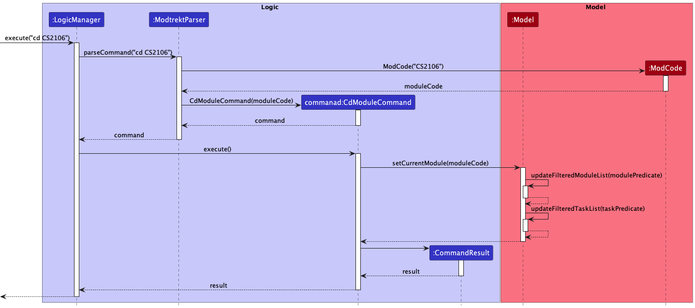
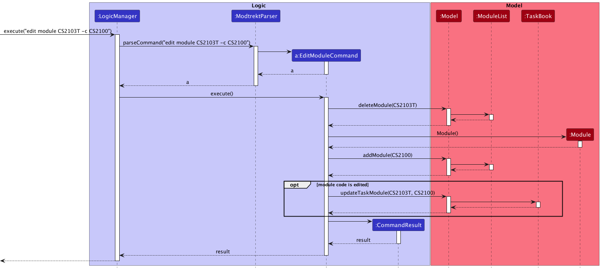
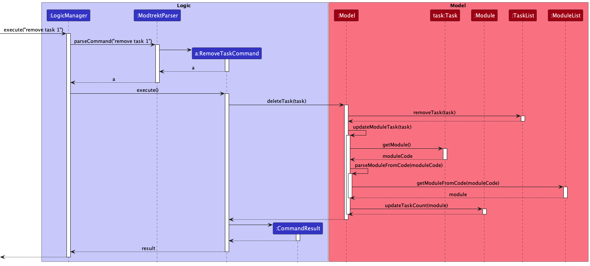
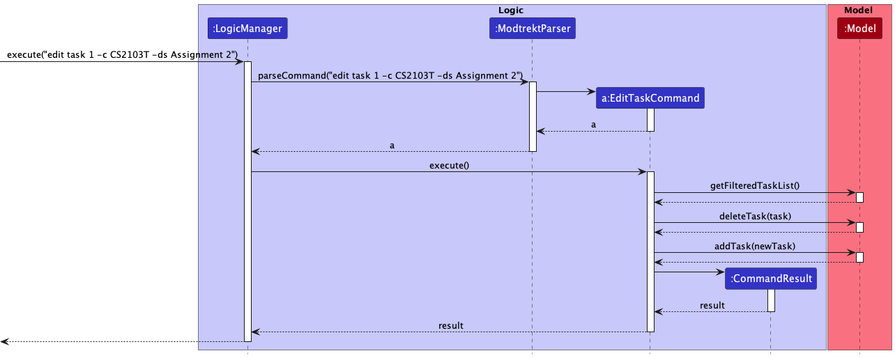
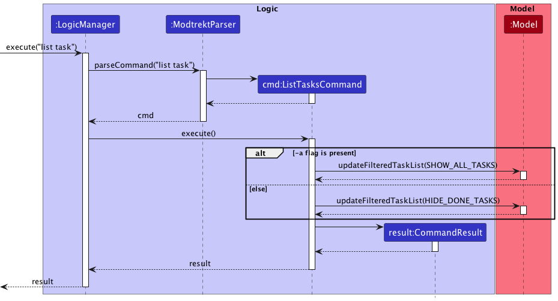

## Table of Contents
1. [Acknowledgements](#acknowledgements)
2. [Setting up, getting started](#setting-up-getting-started)
3. [Design](#design)
    - [Architecture](#architecture)
    - [UI component](#ui-component)
    - [Logic component](#logic-component)
    - [Model component](#model-component)
    - [Storage component](#storage-component)
    - [Common classes](#common-classes)
4. [Implementation](#implementation)
    - [Module Features](#module-features)
        - [Add Module](#add-module)
        - [Remove Module](#remove-module)
        - [Navigation](#navigation)
    - [Task/Deadline Features](#taskdeadline-features)
        - [Add Task](#add-task)
        - [Remove Task](#remove-task)
        - [Edit Task](#edit-task)
        - [Marking Tasks as Done](#marking-tasks-as-done)
        - [Task Listing](#task-listing)
5. [Documentation, logging, testing, configuration, dev-ops](#documentation-logging-testing-configuration-dev-ops)
6. [Appendix: Requirements](#appendix-requirements)
    - [Product Scope](#product-scope)
    - [User Stories](#user-stories)
    - [Use Cases](#use-cases)
    - [Non-Functional Requirements](#non-functional-requirements)
    - [Glossary](#glossary)
7. [Appendix: Instructions for manual testing](#appendix-instructions-for-manual-testing)

## Acknowledgements

* {list here sources of all reused/adapted ideas, code, documentation, and third-party libraries -- include links to the original source as well}

## Setting up, getting started

Refer to the guide [_here_](SettingUp.md).

## Design

### Architecture

The ***Architecture Diagram*** given above explains the high-level design of the App.

Given below is a quick overview of main components and how they interact with each other.

**Main components of the architecture**

**`Main`** has two classes called [`Main`](https://github.com/se-edu/addressbook-level3/tree/master/src/main/java/seedu/address/Main.java) and [`MainApp`](https://github.com/se-edu/addressbook-level3/tree/master/src/main/java/seedu/address/MainApp.java). It is responsible for,
* At app launch: Initializes the components in the correct sequence, and connects them up with each other.
* At shut down: Shuts down the components and invokes cleanup methods where necessary.

[**`Commons`**](#common-classes) represents a collection of classes used by multiple other components.

The rest of the App consists of four components.

* [**`UI`**](#ui-component): The UI of the App.
* [**`Logic`**](#logic-component): The command executor.
* [**`Model`**](#model-component): Holds the data of the App in memory.
* [**`Storage`**](#storage-component): Reads data from, and writes data to, the hard disk.

**How the architecture components interact with each other**

The *Sequence Diagram* below shows how the components interact with each other for the scenario where the user issues the command `delete -m 1` to remove the module with index `1`.

Note that while our program has both tasks and modules, the flow of logic for doing operations (i.e. delete, add etc.) on them are similar. Therefore, although the following sections only illustrate the components in the context of modules, they are similar when applied in the context of tasks as well.

Each of the four main components (also shown in the diagram above),

* defines its *API* in an `interface` with the same name as the Component.
* implements its functionality using a concrete `{Component Name}Manager` class (which follows the corresponding API `interface` mentioned in the previous point.

For example, the `Logic` component defines its API in the `Logic.java` interface and implements its functionality using the `LogicManager.java` class which follows the `Logic` interface. Other components interact with a given component through its interface rather than the concrete class (reason: to prevent outside component's being coupled to the implementation of a component), as illustrated in the (partial) class diagram below.

The sections below give more details of each component. As stated above, tasks are omitted in place of modules in the following sections due to the similarity between them.

### UI component

**API** : [`Ui.java`](https://github.com/AY2223S1-CS2103T-W10-4/tp/blob/master/src/main/java/modtrekt/ui/Ui.java)

Section by : [Marciano](https://github.com/midnightfeverrr)

The UI consists of a `MainWindow` that is made up of parts e.g.`CommandBox`, `ResultDisplay`, `ModuleListPanel`, `StatusBarFooter` etc.
All these, including the `MainWindow`, inherit from the abstract `UiPart` class which captures the commonalities between
classes that represent parts of the visible GUI.

The `UI` component uses the JavaFx UI framework.
The layout of these UI parts are defined in matching `.fxml` files that are in the `src/main/resources/view` folder.
For example, the layout of the [`MainWindow`](https://github.com/AY2223S1-CS2103T-W10-4/tp/blob/master/src/main/java/modtrekt/ui/MainWindow.java)
is specified in [`MainWindow.fxml`](https://github.com/AY2223S1-CS2103T-W10-4/tp/blob/master/src/main/resources/view/MainWindow.fxml)

The `UI` component,

* Executes user commands using the `Logic` component.
* Listens for changes to `Model` data so that the UI can be updated with the modified data.
* Keeps a reference to the `Logic` component, because the `UI` relies on the `Logic` to execute commands.
* Depends on some classes in the `Model` component, as it displays `Module` object residing in the `Model`.

#### MainWindow

The `MainWindow` class is the hub for all UI components which are listed below:
* `CommandBox` - Command box to get user input.
* `ResultDisplay` - Displays the message returned by the command entered. (Soon to contain avatar image)
* `ModuleListPanel` - Panel displaying the modules input to the system.
* `TaskListPanel` - Panel displaying the task input to the system (According to the respective module).
* `ProfileSidePanel` - Panel displaying the user's profile and fundamental details.

The `MainWindow` coordinates the backend of the system to the frontend of the system to make visible changes to the interface.

This is done through the `executeCommand(String commandText)` method. Upon user input, the logic class executes the
respective command and the model is updated to reflect the changes.
Subsequently, after the model has been updated, the following UI classes `ResultDisplay` is refreshed as a result.

#### CommandBox

The `CommandBox` class contains an editable JavaFX Component `TextArea`, which allows user to input user commands.

#### ResultDisplay

The `ResultDisplay` class shows the message returned from the user's input.

1. Command is executed on `MainWindow`.
2. `MainWindow` calls the method `executeCommand`, which refreshes the resultant message displayed in `ResultDisplay`.
3. `ResultDisplay` updates its JavaFX `TextArea` according to the `CommandResult` of the command given.
   In this case, the `TextArea` will display the message returned as a result of the command.
4. ResultDisplay displays visible change on the interface.
5. `executeCommand` ends execution.

#### ModuleListPanel

The `ModuleListPanel` class contains `ListView<Module>` JavaFX component displaying a list view of the component inside.
In this case, the list inside is a list of `ModuleCard` class.

The contents of the list are dependent on the `modules` that the user's data. Each module input by the user will be displayed
as a `ModuleCard` object, presented in the form of `ListView`.

#### TaskListPanel

The `TaskListPanel` class contains `ListView<Task>` JavaFX component displaying a list view of the component inside.
In this case, the list inside is a list of `TaskCard` class.

The contents of the list are dependent on the `tasks` that the user's data. Each module input by the user will be displayed
as a `TaskCard` object, presented in the form of `ListView`.

#### ProfileSidePanel

The `ProfileSidePanel` class contains the user's profile. The following information is displayed in on the object:
* `Course` name
* Inspiring quote
* Modular Credits completed by user
* Number of Active Tasks

Here is how the `ProfileSidePanel` works:

1. Command executed on `MainWindow`.
2. `Model` is updated.
3. `MainWindow` calls the method `refresh`, which refreshes the `ProfileSidePanel`.
4. `ProfileSidePanel` uses `Logic` to obtain the corresponding information:
    1. MC Completed
    2. Active Tasks
5. `ProfileSidePanel` executes corresponding JavaFX methods to update displayed information.
6. `ProfileSidePanel` shows visible change on the interface.
7. `refresh` ends execution.

#### Other Components
In addition to the main UI components in the `MainWindow` class, these are other UI Components:
* `ModuleCard` - Individual card containing the relevant information of the module.
  List of ModuleCard contained in the ModuleListPanel.
* `TaskCard` - Individual card containing the relevant information of the task.
  List of TaskCards contained in the TaskListPanel.
* `HelpWindow` - Pop-up window containing the link the User Guide, as well as a (proposed) list of all the commands in the application.

### Logic component

**API** : [`Logic.java`](https://github.com/se-edu/addressbook-level3/tree/master/src/main/java/seedu/address/logic/Logic.java)

Here's a (partial) class diagram of the `Logic` component:

How the `Logic` component works:
1. When `Logic` is called upon to execute a command, it uses the `ModtrektParser` class to parse the user command.
1. This results in a `Command` object (more precisely, an object of one of its subclasses e.g., `AddCommand`) which is executed by the `LogicManager`.
1. The command can communicate with the `Model` when it is executed (e.g. to add or remove a module).
1. The result of the command execution is encapsulated as a `CommandResult` object which is returned back from `Logic`.

The Sequence Diagram below illustrates the interactions within the `Logic` component for the `execute("delete -m 1")` API call.

:information_source: **Note:** The lifeline for `RemoveCommandParser` should end at the destroy marker (X) but due to a limitation of PlantUML, the lifeline reaches the end of diagram.

Here are the other classes in `Logic` (omitted from the class diagram above) that are used for parsing a user command:

How the parsing works:
* When called upon to parse a user command, the `ModtrektParser` class creates an `XYZCommandParser` (`XYZ` is a placeholder for the specific command name e.g., `AddCommandParser`) which uses the other classes shown above to parse the user command and create a `XYZCommand` object (e.g., `AddCommand`) which the `ModtrektParser` returns back as a `Command` object.
* All `XYZCommandParser` classes (e.g., `AddCommandParser`, `RemoveCommandParser`, ...) inherit from the `Parser` interface so that they can be treated similarly where possible e.g, during testing.

### Model component
**API** : [`Model.java`](https://github.com/AY2223S1-CS2103T-W10-4/tp/blob/master/src/main/java/modtrekt/model/Model.java)

The `Model` component,

* stores the address book data i.e., all `Module` objects (which are contained in a `UniqueModuleList` object).
* stores the currently 'selected' `Module` objects (e.g., results of a search query) as a separate _filtered_ list which is exposed to outsiders as an unmodifiable `ObservableList<Module>` that can be 'observed' e.g. the UI can be bound to this list so that the UI automatically updates when the data in the list change.
* stores a `UserPref` object that represents the user’s preferences. This is exposed to the outside as a `ReadOnlyUserPref` objects.
* does not depend on any of the other three components (as the `Model` represents data entities of the domain, they should make sense on their own without depending on other components)

:information_source: **Note:** An alternative (arguably, a more OOP) model is given below. It has a `Tag` list in the `ModuleList`, which `Module` references. This allows `ModuleList` to only require one `Tag` object per unique tag, instead of each `Module` needing their own `Tag` objects. 

### Storage component

**API** : [`Storage.java`](https://github.com/AY2223S1-CS2103T-W10-4/tp/blob/master/src/main/java/modtrekt/storage/Storage.java)

The `Storage` component,
* can save both address book data and user preference data in json format, and read them back into corresponding objects.
* inherits from both `ModuleListStorage` and `UserPrefStorage`, which means it can be treated as either one (if only the functionality of only one is needed).
* depends on some classes in the `Model` component (because the `Storage` component's job is to save/retrieve objects that belong to the `Model`)

### Common classes

Classes used by multiple components are in the `modtrekt.commons` package.

## **Implementation**

This section describes some noteworthy details on how certain features are implemented.

### Module Features

Section by : [Ho Jun Hao](https://github.com/hojunhao2000)

### Add module

In this section, the functionality of `add module` feature, expected execution path, and the interactions between
`AddCommand`, `ModtrektParser`, and other objects will be discussed.

#### What is the add module feature

The `add module` features allows users to add a module that they have taken or are currently taking into the
`ModuleList`.

In order to add tasks or deadlines related to the module, a module would have to be created.

Information regarding module, for verbose inputs, can be recognised in the CLI using tags

These tags are:

- `-n <module_name>`
- `-cr <module_credit>`

#### Design considerations

**Aspect 1: How many modules are added:**

* **Alternative 1 (current choice):** Add 1 module added per AddModuleCommand.
    * Pros: Easy to implement.
    * Cons: May have to type more to add multiple modules.

* **Alternative 2:** Add multiple modules per AddModuleCommand.
    * Pros: Convenient for user.
    * Cons: More complicated, may require much more parsing.

We decided to go with the alternative 1 to keep the logic simple and easier to work with. To tackle the cons we tried to
reduce the compulsory AddModuleCommand parameters and created simplified commands such as `add mod`

**Aspect 2: What parameters do we need:**

* **Alternative 1:** Manually add all the required parameters.
    * Pros: Able to add modules that are not on NUSMods.
    * Cons: Troublesome to add multiple parameters.

* **Alternative 2:** Only require module code and fetch the relevant information from NUSMods API.
    * Pros: Convenient for user as the only module code is required for the parameter.
    * Cons: If the NUSMods API server is down, users would not be able to add their modules.

We decided to go implement both alternatives as we wanted to give users greater flexibility.

#### Current implementation

The diagram below showcases the path execution for when adding a module

The diagram below shows how the add command work with input `add mod CS2103T`

The arguments are first parsed through `ModtrektParser` to identify the command word and its various parameters.
The process is being simplified using the `JCommander` library which automatically parses the command and returns the
appropriate command, in this case AddModuleCommand. During execution, module details would be fetched from NUSMods and 
a `Module` would be fetched. The module then be added to the `ModuleList` through `Model`.

In the event that the HTTP request made to NUSMods fails when fetching, a fallback data file is present to provide the
module data. The fallback data file is a JSON file that contains the module data of all the modules in NUS as of AY22/23.
The fallback data file is located in `src/main/modrekt/logic/parser/modules/data/modules.json`.

Additionally, the endpoint used to fetch from NUSMods is currently set to only fetch the modules in the academic year
of 2022-2033 (AY22/23). This is an intended effect, as a collaboration with NUS is something we hope to seek in the
future to provide a more robust module data fetching system. As such, if utilised in years beyond AY22/23,
the module data obtained may be out of date.
To further mitigate this, we also have our verbose module adding command, where users can specify the module name, code
and credits, without any reliance on NUSMods.

### Remove Module

In this section, the functionality of `remove module` feature, expected execution path, and the interactions between the
`RemoveModuleCommand`, `ModtrektParser`, and other objects will be discussed.

#### What is the remove module feature

The `remove module` features allows users to remove a module that they have taken or mistakenly inputted into
`ModuleList`.

Removal of a `Module` would remove all `Task` and `Deadline` associated with it.

#### Design considerations

**Aspect: How are modules removed:**

* **Alternative 1 (current choice):** Using their index in the list.
    * Pros: Easier for user to select.
    * Cons: May be hard to find module especially if module list is long. More complicated as index may change
      especially after modifying the module list

* **Alternative 2:** Using the module code.
    * Pros: User need not list the modules to find exact module to remove.
    * Cons: User needs to type more.

We decided to go with the alternative 1 as it would be faster for users to type inputs. Furthermore, at any point, it is
unlikely that users will take so many modules such that the GUI is unable to display all the modules. We also have a
feature that would remove previously taken modules so that it would not clutter up the GUI.

#### Current implementation

The diagram below showcases the path execution for when removing a module

The diagram below shows how the remove command work with input `remove module CS2103T`

The arguments are first parsed through `ModtrektParser` to identify the command word. The `JCommander` library would
help us parse the command and return the appropriate command. In this case it is `RemoveModuleCommand`.When the 
`RemoveModuleCommand` is executed, it would first remove the `Module` from the `ModuleList`. Then it would remove all 
`Task` in the `TaskBook` with the `Module`.

### Navigation

Section by : [David](https://github.com/vvidday)

#### Change Current Module

The `cd` command allows users to set a module as the **current module**, which accomplishes two things:
* Firstly, it filters the current task list in the UI to only show tasks from the corresponding module
* Additionally, all further commands are parsed in the context of the corresponding module. For instance, commands that require a task index, such as `remove -t 1`, will now base the index on the *updated filtered* task list.

The relevant commands are:
* **`cd <module code>`** sets the current module to the module with the specified module code
* **`cd ..`** sets the current module to `null`, if it is not already `null`

#### Design Considerations

The syntax and command word were aspects that we took into consideration in the design process.

1. **Using the shorthand word `cd` and similar syntax e.g. `cd ..` (Current Implementation)**
* Pro: Users who are familiar with CLI applications will be able to use similar syntax for navigation inside the application
* Pro: Users will be able to navigate through the application faster, due to the shorter command word and syntax
* Con: Users who are not familiar with CLI applications would have to remember a specific command word that may not be very intuitive

2. **Using a longer command word e.g. `enter` and `exit`**
* Pro: The command word is more universally intuitive, especially for users who are not familiar with CLI applications
* Con: Users who are already familiar with CLI applications will have to relearn navigation using a different command
* Con: Users will have to type out a longer command word and syntax, which will reduce the speed at which a user can navigate through the application

Taking into account that our [target user profile](#product-scope) is one that is familiar with using CLI apps, we chose option 1 as it provided the most benefit for such a user. In particular, it contributes to the goal of allowing the user to accomplish tasks (in this case navigation) in a shorter time using the CLI.

#### Current implementation

The current module is a `ModCode` stored as a variable in [ModelManager](https://github.com/AY2223S1-CS2103T-W10-4/tp/blob/master/src/main/java/modtrekt/model/ModelManager.java). Its value is used as part of a custom predicate that is used to call `Model::updateFilteredTaskList`, in order to filter the tasks to only display those belonging to the corresponding module.

The following activity diagram shows the execution and control flow for the `cd` command.

As seen from the diagram, when the user enters the command `cd ..` to exit from the currently selected module, a check is performed to determine whether there *is* a current module.

In the case where there is no current module, i.e. the user is already at the 'root' (and all modules/tasks are listed), an error message is shown to the user alerting them of this fact. This improves the user experience as it prevents the case of a user repeatedly entering the `cd ..` command and wondering why the display never changes.

The sequence diagram below shows the flow of the interactions between the different components upon execution of the command `cd CS2106`.

In the diagram, the predicates `modulePredicate` and `taskPredicate` are the custom predicates used to filter the module and task lists, respectively. They are within the `setCurrentModule` method in `Model`.

### Marking modules as done

Section by : [Marciano](https://github.com/midnightfeverrr)

Allows users to mark their modules as done,
and alternate between viewing all modules and viewing undone modules via the list command.

Every module in the module list will be in either the done or undone state.
New tag will be created to mark a module as `done`.

In this section, we will discuss the management of done/undone state, as well as the
interactions between the commands and the UI.

The relevant commands for this section are:
* **`done module <module code>`**  marks the module with a done tag in the UI
* **`undone module <module code>`** removes the done tag from a module (if present) in the UI

#### Design considerations

There was an alternative we considered for users to select the module to mark as done:

* **Alternative 1:** Using the module name:
    * Pro: Users do not have to search for a module code.
    * Con: Users have to type a significant amount to disambiguate modules by their name.

* **Alternative 2:** Using the module index:
    * Pro: Users can mark modules as done without much typing.
    * Con: Module index is not visible in UI. It is quite tedious to count the index manually if user has a lot of modules.

* **Alternative 3:** Using the module code (current implementation):
    * Pro: Users can mark modules as done by their module code easily without much typing.
    * Con: Users still have to type more than if they were to specify via index.

To optimize the amount of typing a user has to do, we decided to choose the second option.

#### Current implementation

The done/undone state is handled in the `Module` class via a boolean flag `isDone`.
Because `Module` is immutable, the methods `Module::done` and `Module::undone` return a new `Module`
with the done/undone state changed instead of mutating the `isDone` variable directly.

The following diagram shows the execution and control flow of the `done` command.

The diagram below shows how the `done` command work with input `done module CS1101S`

Notice how we explicitly prevent a done module from being marked as done again. Even though marking a done module as
done again is inconsequential from a data perspective (nothing in a `Module` changes other than the creation of a new
instance), it is still a user error that should be handled:

> Suppose that a user intended to mark a module as undone, but accidentally entered the `done` command instead.
By displaying an error instead of silently accepting the erroneous command, the user is notified and
can enter the correct command next—this results in better UX!

The classes directly involved in setting the done/undone state from user input are:
* `DoneModuleCommand` and `UndoneModuleCommand` which are the commands that when executed, mark tasks as done or undone respectively.
* `ModtrektParser` which parses the command word and delegates the parsing to JCommander.
* `LogicManager` which executes the commands.

For brevity, we omit the diagrams and explanations for marking modules as undone—it is the direct inverse of marking tasks as done,
such that the control flow is exactly the same: just replace "done" and its derivatives
with "undone", and vice versa.

### Module listing

Section by : [Marciano](https://github.com/midnightfeverrr)

Module listing allows users to view the modules they have added.

The relevant commands for this section are:
* **`cd`** sets path to the homepage. (Not inside of any module)
* **`ls mod`/`ls module`** displays only the undone modules (active modules) in the UI.
* **`ls mod -a`/`ls module -a`** displays all the modules, including the ones marked done, in the UI.

#### Current implementation

We check for the presence of the `-a` flag to decide whether to display done tasks.

The following diagram shows the execution and control flow of the `list module` command.

The sequence diagram below details the interactions between the command and the model
for the `ls mod` and `ls mod -a` commands:

The predicates defined by `Model.PREDICATE_SHOW_ALL_MODULES` and `PREDICATE_HIDE_DONE_MODULES` are used to filter
the tasks displayed in the UI via the `updateFilteredModuleList` method in the `Model` interface.

_Side note: We delegate parsing to JCommander which already has the command object registered_

### Edit Module

Section by : [Ho Jun Hao](https://github.com/hojunhao2000)

In this section, the functionality of `edit module` feature, expected execution path, and the interactions between the
`EditModuleCommand`, `ModtrektParser`, and other objects will be discussed.

#### What is the edit module feature

The `edit module` features allows users to edit a module that they have erroneously added.
This allows them to update details of the module, such as the module name, module credit and module code.

Editing a module code would edit all the tasks currently associated to the module to the new module code.

#### Design considerations

**Aspect 1: Whether editing modules should be allowed:**

* **Alternative 1 (current choice):** Allow editing of modules.
    * Pros: Allows users to change partial details in the event of a small error.
    * Cons: Have to parse a varying amount of optional arguments.

* **Alternative 2:** No edit command, user would have to delete and re-add their module.
    * Pros: Convenient for development, less bug-prone.
    * Cons: Inconvenient and troublesome for the user.

We decided to go with the alternative 1 to give our users the best experience possible. We concluded that editing a
module would be faster than deleting a module and re-entering all the details, particularly if the user is using the
verbose command inputs.

#### Current implementation

The diagram below showcases the path execution for when edit a module

The diagram below shows how the remove command work with input `edit module CS2103T -c CS2100`

Note that the sequence diagram has been kept simple, as the logic flow for `addModule` and `deleteModule` have been
covered in greater detail in the earlier diagrams.

The arguments are first parsed through `ModtrektParser` to identify the command word. Using the `Jcommander` library, we
are then able to parse through the commands and automatically generate the corresponding command. In this case an
`EditModuleCommand`. When the `EditTaskCommand` is executed, it would first obtain the `Module` using the `Module Code`.
Then it would create a new module replacing with the appropriate new/old inputs. It would then delete the old module and
replace it with the new module. If module code is edited, it would replace all the old tasks with old module code with
new tasks with new module code.

### Tasks

### Task/Deadline Features

Section by : [Dominic](https://github.com/domoberzin)

### Add task

In this section, the functionality of `add` task feature, expected execution path, and the interactions between
`AddTaskCommand`, `AddDeadlineCommand`, `AddTaskCommandParser`, and other objects will be discussed.
Deadlines are an extension of tasks, and have a due date. For the most part, their implementations are
similar, and areas where they differ will be highlighted. As such, please consider deadline to be synonymous
with task, unless explicitly stated.

#### What is the add task feature

The `add` task features allows users to add a task or a deadline that they have taken or are currently taking into the
`TaskList`.

In order to add tasks or deadlines related to the module, a module would have to be created.

Additionally, the modules to which these tasks belong need to be specified within
the command. If the user is CD-ed into the module, the module code will not
be required in the command.

Information regarding tasks/deadlines can be recognised in the CLI using tags.

These tags are:

- `-t <task name/description>`
- `-d <YYYY-MM-DD>` (this is only required for adding deadlines)
- `-c <module_code>`

#### Design considerations

**Aspect 1: How many tasks are added:**

* **Alternative 1 (current choice):** Add 1 task added per AddTaskCommand.
    * Pros: Easy to implement.
    * Cons: May have to type more to add multiple tasks.

* **Alternative 2:** Add multiple tasks per AddTaskCommand.
    * Pros: Convenient for user.
    * Cons: More complicated, may require much more parsing.

We decided to go with the alternative 1 to keep the logic simple and easier to work with. To tackle the cons we tried to
reduce the compulsory AddTaskCommand parameters.

**Aspect 2: What parameters do we need:**

* **Alternative 1:** Add task by specifying module index instead of code.
    * Pros: Less verbosity in the command, user can go off of the displayed index.
    * Cons: Slightly more complicated as more errors need to be handled (invalid index etc.). Users
      may also be more prone to adding the task to the wrong module.

* **Alternative 2:** Require the user to specify the module code.
    * Pros: Reduces the chance of error by the user, users will not need to remember the module index.
    * Cons: User has to type more information in the command.

We decided to implement alternative 2 in order to reduce the chance of user error and reduce the
potential for bugs.

#### Current implementation

The diagram below showcases the path execution for adding a task, when a user is **NOT** CD-ed
into a module. For ease of understanding, we will be adding a task instead of a deadline. Note that
the flow is exactly the same for both tasks and deadlines.

The diagram below shows how the add command work with input `add -m -c CS2103T`

The arguments are first parsed through `ModtrektParser` to identify the command word. The command word will help
identify the type of `Parser` needed to parse the rest of the arguments. In this case it is `AddTaskCommandParser`. After
parsing the arguments, a deadline or a task object is created, depending on the presence of a deadline flag. The task
would be used to instantiate an `AddTaskCommand`. When the `AddTaskCommand` is executed, the `Model` would add the task
to the `TaskList`. After adding the task, the `Model` invokes its own method to update the task count of the module
whose code is associated with the task.

### Remove Task

In this section, the functionality of `remove` task feature, expected execution path, and the interactions between the
`RemoveTaskCommand`, `RemoveTaskCommandParser`, and other objects will be discussed.

#### What is the remove task feature

The `remove` task features allows users to remove a task/deadline that they have taken or mistakenly inputted into
`TaskList`.

Removal of a `Task` would result in the reduction of the task count of the `Module` with the module code the task
is associated with.

#### Current implementation

The diagram below showcases the path execution for when removing a task

The diagram below shows how the remove command work with input `remove -t 1`

The arguments are first parsed through `ModtrektParser` to identify the command word. The command word will help
identify the type of `Parser` needed to parse the rest of the arguments. In this case it is `RemoveTaskCommandParser`. After
obtaining the index, it would be used to instantiate a `RemoveTaskCommand`. When the `RemoveTaskCommand` is executed, it would
first obtain the `Task` using the index. Then it would remove the `Task` from the `TaskList`. Using the saved
`Task` it would then reduce the task count of the `Module` whose code is equal to that of the removed `Task`.

### Edit Task

In this section, the functionality of `edit` task feature, expected execution path, and the interactions between the
`EditTaskCommand`, `ModtrektParser`, and other objects will be discussed.

#### What is the edit task feature

The `edit` task features allows users to edit a task/deadline that they have erroneously added.
This allows them to update details of the task, such as the due date, description and module code.

Editing a task has no effect on the task count of a module, as it is a replacement of an existing task.

#### Design considerations

**Aspect 1: Whether editing tasks should be allowed:**

* **Alternative 1 (current choice):** Allow editing of tasks.
    * Pros: Allows users to change partial details in the event of a small error.
    * Cons: Have to parse a varying amount of optional arguments.

* **Alternative 2:** No edit command, user would have to delete and re-add their task.
    * Pros: Convenient for development, less bug-prone.
    * Cons: Inconvenient and troublesome for the user.

We decided to go with the alternative 1 to give our users the best experience possible.

#### Current implementation

The diagram below showcases the path execution for when edit a task

The diagram below shows how the remove command work with input `edit -t 1 -c CS2103T -ds Assignmet 2`

Note that the sequence diagram has been kept simple, as the logic flow for `addTask(t)` and
`removeTask(t)` have been covered in greater detail in the earlier diagrams.

The arguments are first parsed through `ModtrektParser` to identify the command word. The command word will help
identify the type of `Parser` needed to parse the rest of the arguments. In this case it is `EditTaskCommandParser`. After
obtaining the index, it would be used to instantiate a `EditTaskCommand`. When the `EditTaskCommand` is executed, it would
first obtain the `Task` using the index. Then it would remove the `Task` from the `TaskList`. It would also create a new Task
with the information specified by the user.  The `TaskList` is subsequently updated and the user can now see the updated
task details in the list.

### Marking tasks as done

Section by : [Jonathan](https://github.com/jontmy)

Marking tasks as done allows users to selectively hide tasks that they have completed.

Every task in the task book will be in either the done or undone state.
New tasks will be created in the undone state.

In this section, we will discuss the management of done/undone state, as well as the
interactions between the commands, their parsers, and the UI.

The relevant commands for this section are:
* **`done task <task index>`**  marks the task visible in the UI with the specified index as done.
* **`undone task <task index>`** marks the task visible in the UI with the specified index as undone.

#### Design considerations

There was an alternative we considered for users to select the task to mark as done:

* **Alternative 1:** Using the task name:
    * Pro: Users do not have to search for a task and its index.
    * Pro: Users can mark tasks that aren't visible in the UI as done.
    * Con: Users have to type a significant amount to disambiguate tasks by their name.
    * Con: Users have to remember the task names which may be difficult if there are many tasks.

* **Alternative 2:** Using the task index of the current module (current implementation):
    * Pro: Users can mark tasks as done by their index easily without much typing.
    * Con: Users now have to use `cd` to change the current module tied to the task they want to mark as done.
    * Con: Users now have to use `ls` and `ls -A` to view undone tasks or all tasks respectively.

Seeing as we prioritize a CLI, we chose the second option as it would be simpler for users,
even though the `cd` and `ls` commands add a bit of overhead.

#### Current implementation

The done/undone state is handled in the `Task` class via a boolean flag `isDone`.
Because `Task` is immutable, the methods `Task::setAsDone` and `Task::setAsUndone` return a new `Task`
with the done/undone state changed instead of mutating the `isDone` variable directly.

The following activity diagram shows the execution and control flow of the `done` command.

Notice how we explicitly prevent a done task from being marked as done again. Even though marking a done task as done again
is inconsequential from a data perspective (nothing in a `Task` changes other than the creation of a new instance),
it is still a user error that should be handled:

> Suppose that a user intended to mark a task as undone, but accidentally entered the `done` command instead.
By displaying an error instead of silently accepting the erroneous command, the user is notified and
can enter the correct command next—this results in better UX!

The classes directly involved in setting the done/undone state from user input are:
* `DoneTaskCommand` and `UndoneTaskCommand` which are the commands that when executed, mark tasks as done or undone respectively.
* `ModtrektParser` which parses the command word and delegates the parsing to JCommander.
* `LogicManager` which executes the commands.

For brevity, we omit the diagrams and explanations for marking tasks as undone—it is the direct inverse of marking tasks as done,
such that the control flow is exactly the same: just replace "done" and its derivatives
with "undone", and vice versa.

### Task listing

Section by : [Jonathan](https://github.com/jontmy)

Task listing allows users to view the tasks they have created which belong to a module.

The relevant commands for this section are:
* **`cd`** sets the current module to view tasks for.
* **`ls`** displays only the undone tasks for the current module in the UI.
* **`ls -a`** displays all the tasks for the current module, including the ones done, in the UI.

#### Current implementation

We check for the presence of the `-a` flag to decide whether to display done tasks.

The predicates defined by `Model.SHOW_ALL_TASKS` and `Model.HIDE_DONE_TASKS` are used to filter
the tasks displayed in the UI via the `updateFilteredTaskList` method in the `Model` interface.

The sequence diagram below details the interactions between the command, parser, and the model
for the`ls` and `ls -a` commands:

## Documentation, logging, testing, configuration, dev-ops

* [Documentation guide](Documentation.md)
* [Testing guide](Testing.md)
* [Logging guide](Logging.md)
* [Configuration guide](Configuration.md)
* [DevOps guide](DevOps.md)

## Appendix: Requirements

### Product scope

**Target user profile**:

* is an undergraduate studying at NUS
* has a need to track their modules
* has a need to track tasks and deadlines from their modules
* prefers desktop apps over other types
* can type fast
* prefers typing to mouse interactions
* familiar and reasonably comfortable using CLI apps

**Value proposition**: manage modules and tasks/deadlines for each module faster than a typical GUI driven app

### User stories

Priorities: High (must have) - `* * *`, Medium (nice to have) - `* *`, Low (unlikely to have) - `*`

| Category         | Priority | As a ...                           | I want to ...                                                                             | So that I can ...                                                 |
|------------------|----------|------------------------------------|-------------------------------------------------------------------------------------------|-------------------------------------------------------------------|
| Onboarding       | `***`    | first time user learning the app   | see the basic commands in the welcome message                                             | start adding modules and tasks immediately                        |
| Onboarding       | `***`    | first time user exploring the app  | see the app working with sample data                                                      | see how the app looks in action                                   |
| UI/UX            | `**`     | impatient user                     | utilise commands to quickly be reminded of deadlines                                      | save time locating my deadlines                                   |
| UI/UX            | `***`    | advanced user                      | use shortcuts or shorthand commands to add tasks and deadlines                            | accomplish these tasks in a shorter amount of time                |
| UI/UX            | `***`    | experienced user                   | quickly add and filter out all my tasks and deadlines using the commands instead of a GUI | these actions are much faster                                     |
| UI/UX            | `***`    | novice user                        | use a help command to get a summary of the available commands and how to use them         | learn which commands to use                                       |
| UI/UX            | `***`    | beginner user                      | see clear and complete error messages when I provide invalid input                        | correct my mistakes                                               |
| Module Planning  | `***`    | NUS freshie                        | add/mark the modules that I plan to take                                                  | organize my study plan                                            |
| Module Planning  | `***`    | user                               | delete the modules that I added                                                           | fix my mistakes if needed                                         |
| Tasks / Deadline | `**`     | student overwhelmed by assignments | sort my deadlines                                                                         | prioritise the ones that are due the soonest                      |
| Tasks / Deadline | `**`     | student overwhelmed by tasks       | assign priority ratings to various tasks                                                  | prioritise the ones that I deem are more important                |
| Tasks / Deadline | `**`     | student overwhelmed by tasks       | sort tasks via priority ratings                                                           | figure out which ones to work on first                            |
| Tasks / Deadline | `***`    | second time user                   | add a task                                                                                | so that I can keep track of the things I need to do for a module  |
| Tasks / Deadline | `***`    | second time user                   | add a deadline                                                                            | so that I can keep track of tasks with a due date                 |
| Tasks / Deadline | `***`    | user                               | choose which modules to add my tasks and deadlines to                                     | organise my tasks and deadlines according to modules              |
| Tasks / Deadline | `***`    | user                               | view my tasks and deadlines per module                                                    | see my tasks and deadlines in an organised manner                 |
| Tasks / Deadline | `***`    | user                               | change the module of a specific task or deadline                                          | move my tasks and deadlines around if I make a mistake            |
| Tasks / Deadline | `***`    | clumsy user                        | delete tasks and deadlines                                                                | ensure my homepage is not cluttered with unused items             |
| Tasks / Deadline | `**`     | novice user                        | mark tasks and deadlines that are completed as done                                       | refer to them in future                                           |
| Tasks / Deadline | `***`    | novice user                        | change a deadline that I had created                                                      | adjust the due date accordingly in the event the deadline changes |

### Use cases

(For all use cases below, the **System** is the `ModtRekt` and the **Actor** is the `user`, unless specified otherwise)

**Use case: View all active tasks and deadlines**

**MSS**

1. User requests to view all active tasks and deadlines
2. ModtRekt shows all active tasks and deadlines, categorised into modules

   Use case ends.

**Extensions**

* 2a. The list is empty.

    * 2a.1 ModtRekt displays an empty list.

      Use case ends

**Use case: Add a task**

**MSS**

1. User requests to add a task and specifies the module for the task
2. ModtRekt adds the task
3. Task count of the module is updated, and the task is added to the displayed list

   Use case ends.

**Extensions**

* 2a. The module list is empty
    * 2a1. ModtRekt shows an error message when the command is entered

      Use case ends.

* 3a. The given module code is invalid

    * 3a1. ModtRekt shows an error message when the command is entered

      Use case resumes at step 1.

**Use case: Add a deadline**

**MSS**

1. User requests to add a deadline and specifies the module for the deadline
2. ModtRekt adds the deadline
3. Task count of the module is updated, and the deadline is added to the displayed list

   Use case ends.

**Extensions**

* 2a. The module list is empty
    * 2a1. ModtRekt shows an error message when the command is entered

      Use case ends.

* 3a. The given module code is invalid

    * 3a1. ModtRekt shows an error message when the command is entered

      Use case resumes at step 1.

**Use case: Remove a task**

**MSS**

1. User requests to remove a task
2. ModtRekt shows a list of tasks
3. User requests to remove a specific task via index
4. ModtRekt removes the task

   Use case ends.

**Extensions**

* 2a. The task list is empty.

  Use case ends.

* 3a. The given index is invalid.

    * 3a1. ModtRekt shows an error message.

      Use case resumes at step 2.

*{More to be added}*

### Non-Functional Requirements

1. Should work on any _mainstream OS_ as long as it has Java `11` or above installed.
2. Should be able to hold up to 100 modules without a noticeable sluggishness in performance (i.e. should take less than 1 second to load)
3. A user with above 80 wpm typing speed for regular English text (i.e. not code, not system admin commands) should be able to accomplish most of the tasks faster using commands than using the mouse.
4. The interface should be user-friendly enough such that a user who has never seen the user guide should be able to use it.

*{More to be added}*

### Glossary

_**Mainstream OS**_

Windows, Linux, Unix, OS-X

_**Private contact detail**_

A contact detail that is not meant to be shared with others

## **Appendix: Instructions for manual testing**

Given below are instructions to test the app manually.

:information_source: **Note:** These instructions only provide a starting point for testers to work on;
testers are expected to do more *exploratory* testing.

### Launch and shutdown

1. Initial launch

    1. Download the jar file and copy into an empty folder

    1. Double-click the jar file Expected: Shows the GUI with a set of sample contacts. The window size may not be optimum.

1. Saving window preferences

    1. Resize the window to an optimum size. Move the window to a different location. Close the window.

    1. Re-launch the app by double-clicking the jar file. 
       Expected: The most recent window size and location is retained.

1. _{ more test cases …​ }_

### Removing a task

1. Removing a task while all tasks are being shown

    1. Prerequisites: All tasks (done and undone) are shown, and user is not currently cd-ed into a module.

    1. Test case: `remove -t 1` 
       Expected: First task is deleted from the list. Details of the deleted task shown in the status message.

    1. Test case: `remove -t 0` 
       Expected: No task is deleted. Error details shown in the status message. Status bar remains the same.

    1. Other incorrect remove commands to try: `remove`, `remove -t x`, `...` (where x is larger than the list size) 
       Expected: Similar to previous.

1. _{ more test cases …​ }_

### Saving data

1. Dealing with missing/corrupted data files

    1. _{explain how to simulate a missing/corrupted file, and the expected behavior}_

2. _{ more test cases …​ }_
