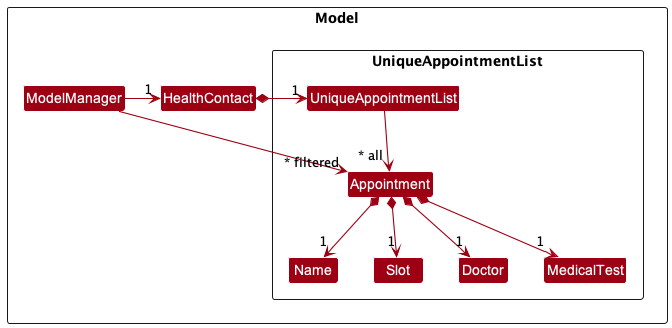
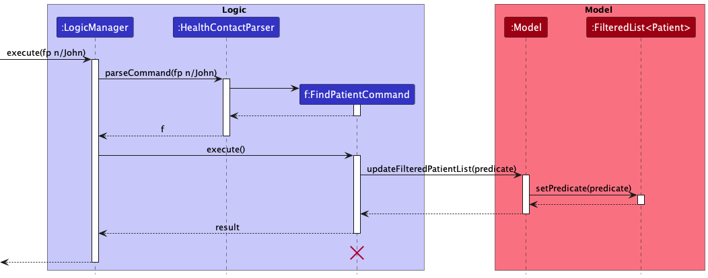
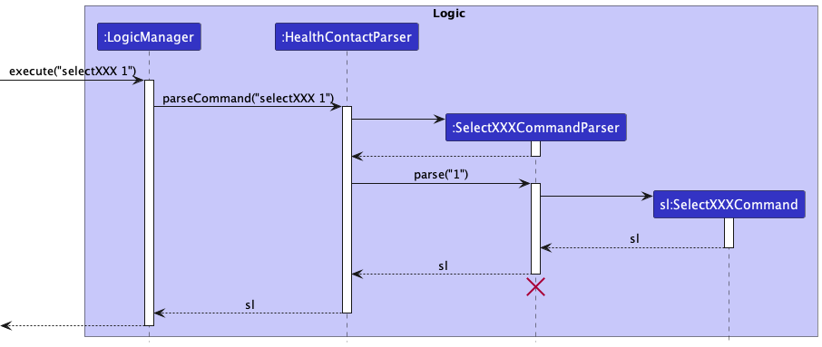
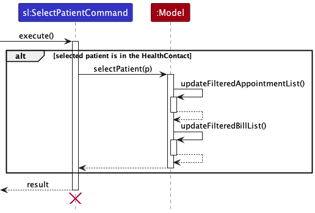
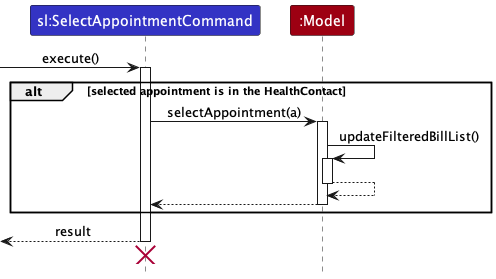

* Table of Contents
{:toc}

--------------------------------------------------------------------------------------------------------------------

## **Acknowledgements**

* {list here sources of all reused/adapted ideas, code, documentation, and third-party libraries -- include links to the original source as well}

--------------------------------------------------------------------------------------------------------------------

## **Setting up, getting started**

Refer to the guide [_Setting up and getting started_](SettingUp.md).

--------------------------------------------------------------------------------------------------------------------

## **Design**

:bulb: **Tip:** The `.puml` files used to create diagrams in this document can be found in the [diagrams](https://github.com/se-edu/addressbook-level3/tree/master/docs/diagrams/) folder. Refer to the [_PlantUML Tutorial_ at se-edu/guides](https://se-education.org/guides/tutorials/plantUml.html) to learn how to create and edit diagrams.

### Architecture

The ***Architecture Diagram*** given above explains the high-level design of the App.

Given below is a quick overview of main components and how they interact with each other.

**Main components of the architecture**

**`Main`** has two classes called [`Main`](https://github.com/se-edu/addressbook-level3/tree/master/src/main/java/seedu/address/Main.java) and [`MainApp`](https://github.com/se-edu/addressbook-level3/tree/master/src/main/java/seedu/address/MainApp.java). It is responsible for,
* At app launch: Initializes the components in the correct sequence, and connects them up with each other.
* At shut down: Shuts down the components and invokes cleanup methods where necessary.

[**`Commons`**](#common-classes) represents a collection of classes used by multiple other components.

The rest of the App consists of four components.

* [**`UI`**](#ui-component): The UI of the App.
* [**`Logic`**](#logic-component): The command executor.
* [**`Model`**](#model-component): Holds the data of the App in memory.
* [**`Storage`**](#storage-component): Reads data from, and writes data to, the hard disk.

**How the architecture components interact with each other**

The *Sequence Diagram* below shows how the components interact with each other for the scenario where the user issues the command `delete 1`.

Each of the four main components (also shown in the diagram above),

* defines its *API* in an `interface` with the same name as the Component.
* implements its functionality using a concrete `{Component Name}Manager` class (which follows the corresponding API `interface` mentioned in the previous point.

For example, the `Logic` component defines its API in the `Logic.java` interface and implements its functionality using the `LogicManager.java` class which follows the `Logic` interface. Other components interact with a given component through its interface rather than the concrete class (reason: to prevent outside component's being coupled to the implementation of a component), as illustrated in the (partial) class diagram below.

The sections below give more details of each component.

### UI component

The **API** of this component is specified in [`Ui.java`](https://github.com/se-edu/addressbook-level3/tree/master/src/main/java/seedu/address/ui/Ui.java)

The UI consists of a `MainWindow` that is made up of parts e.g.`CommandBox`, `ResultDisplay`, `PatientListPanel`, `AppointmentListPanel`, `BillListPanel`, `StatusBarFooter` etc. All these, including the `MainWindow`, inherit from the abstract `UiPart` class which captures the commonalities between classes that represent parts of the visible GUI.

The `UI` component uses the JavaFx UI framework. The layout of these UI parts are defined in matching `.fxml` files that are in the `src/main/resources/view` folder. For example, the layout of the [`MainWindow`](https://github.com/se-edu/addressbook-level3/tree/master/src/main/java/seedu/address/ui/MainWindow.java) is specified in [`MainWindow.fxml`](https://github.com/se-edu/addressbook-level3/tree/master/src/main/resources/view/MainWindow.fxml)

The `UI` component,

* executes user commands using the `Logic` component.
* listens for changes to `Model` data so that the UI can be updated with the modified data.
* keeps a reference to the `Logic` component, because the `UI` relies on the `Logic` to execute commands.
* depends on some classes in the `Model` component, as it displays `Patient` object residing in the `Model`.

### Logic component

**API** : [`Logic.java`](https://github.com/se-edu/addressbook-level3/tree/master/src/main/java/seedu/address/logic/Logic.java)

Here's a (partial) class diagram of the `Logic` component:

How the `Logic` component works:
1. When `Logic` is called upon to execute a command, it uses the `HealthContactParser` class to parse the user command.
1. This results in a `Command` object (more precisely, an object of one of its subclasses e.g., `AddCommand`) which is executed by the `LogicManager`.
1. The command can communicate with the `Model` when it is executed (e.g. to add a patient).
1. The result of the command execution is encapsulated as a `CommandResult` object which is returned back from `Logic`.

The Sequence Diagram below illustrates the interactions within the `Logic` component for the `execute("delete 1")` API call.

:information_source: **Note:** The lifeline for `DeleteCommandParser` should end at the destroy marker (X) but due to a limitation of PlantUML, the lifeline reaches the end of diagram.

Here are the other classes in `Logic` (omitted from the class diagram above) that are used for parsing a user command:

How the parsing works:
* When called upon to parse a user command, the `HealthContactParser` class creates an `XYZCommandParser` (`XYZ` is a placeholder for the specific command name e.g., `AddCommandParser`) which uses the other classes shown above to parse the user command and create a `XYZCommand` object (e.g., `AddCommand`) which the `HealthContactParser` returns back as a `Command` object.
* All `XYZCommandParser` classes (e.g., `AddCommandParser`, `DeleteCommandParser`, ...) inherit from the `Parser` interface so that they can be treated similarly where possible e.g, during testing.

### Model component
**API** : [`Model.java`](https://github.com/se-edu/addressbook-level3/tree/master/src/main/java/seedu/address/model/Model.java)

#### Model

The `Model` component,

* stores the HealthContact data i.e.,
    * all `Patient` objects (which are contained in a `UniquePatientList` object)
    * all `Appointment` objects (which are contained in a `UniqueAppointmentList` object)
    * all `Bill` objects (which are contained in a `UniqueBillList` object)
* stores the currently 'selected' `Patient`, `Appointment` or `Bill` objects (e.g., results of a search query) as a separate _filtered_ list which is exposed to outsiders as an unmodifiable `ObservableList<Patient>`, `ObservableList<Appointment>` or `ObservableList<Bill>` that can be 'observed' e.g. the UI can be bound to this list so that the UI automatically updates when the data in the list change.
* stores a `UserPref` object that represents the user’s preferences. This is exposed to the outside as a `ReadOnlyUserPref` object.
* does not depend on any of the other three components (as the `Model` represents data entities of the domain, they should make sense on their own without depending on other components)

#### Patient

* The `Patient` object stored in the `Model`, stores the personal information of a patient. Take note that every `Patient` must have a unique `Name` because the application differentiates `Patient` by `Name`.
* Take note that,
    * the application differentiates patients by `Name`
    * same letters of `Name` in different cases are considered as the same `Name`
#### Appointment

* The `Appointment` object stored in the `Model`, stores the information of an appointment.
* Take note that,
    * the `Name` must be a `Name` from an existing `Patient`
    * the application differentiates appointments by all four attributes
    * same letters of `MedicalTest`, `Doctor` and `Name` in different cases are considered as same `MedicalTest`, `Doctor` and `Name`.

#### Bill

* The `Bill` object stored in the `Model`, stores the information of a bill.
* Take note that,
    * the `Appointment` must be the same as an existing `Appointment`
    * one `Appointment` can attach at most one bill
    * the application differentiates bills by all four attributes.

### Storage component

**API** : [`Storage.java`](https://github.com/se-edu/addressbook-level3/tree/master/src/main/java/seedu/address/storage/Storage.java)

The `Storage` component,
* can save both HealthContact data and user preference data in json format, and read them back into corresponding objects.
* inherits from both `HealthContactStorage` and `UserPrefStorage`, which means it can be treated as either one (if only the functionality of only one is needed).
* depends on some classes in the `Model` component (because the `Storage` component's job is to save/retrieve objects that belong to the `Model`)

### Common classes

Classes used by multiple components are in the `seedu.healthcontact.commons` package.

--------------------------------------------------------------------------------------------------------------------

## **Implementation**

This section describes some noteworthy details on how certain features are implemented.

### \[Proposed\] Undo/redo feature

#### Proposed Implementation

The proposed undo/redo mechanism is facilitated by `History`. It tracks the states of `HealthContact` with an undo/redo history, stored internally as an `healthContactHistory` and `redoHealthContactHistory`. Additionally, it implements the following operations:

* `History#updateHealthContactHistory()` — Saves the current HealthContact state, the FilteredPatients state, the FilteredAppointment state and FilteredBills state in `undoFilteredPatientsHistory`, `undoFilteredAppointmentHistory` and `undoFilteredBillsHistory` respectively.
* `History#getHealthContactHistory(int index)` — Get the saved state of HealthContact given an index. This method is used for restoring the previous HealthContact state from its history.
* `History#updateRedoContactHistory()` — Saves the current HealthContact state, the FilteredPatients state, the FilteredAppointment state and FilteredBills state before an Undo command in `redoFilteredPatientsHistory`, `redoFilteredAppointmentHistory` and `redoFilteredBillsHistory` respectively.
* `History#getRedoHealthContactHistory(int index)` — Get the saved state of HealthContact given an index. This method is used for restoring the previous HealthContact state from its history after an Undo Command.

Given below is an example usage scenario and how the undo/redo mechanism behaves at each step.

Step 1. The user launches the application for the first time. The `undoHealthContactHistory`, `redoHealthContactHistory`, `undoFilteredPatientsHistory`, `redoFilteredPatientsHistory`, `undoFilteredAppointmentHistory`, `redoFilteredAppointmentHistory`, `undoFilteredBillsHistory` and `redoFilteredBillsHistory` will be initialized empty.

Step 2. The user executes `delete 5` command to delete the 5th patient in the HealthContact. The `delete` command calls `History#updateHealthContactHistory()`, causing the original state of the HealthContact before the `delete 5` command executes to be saved in the `healthContactHistory`.

Step 3. The user executes `addpatient n/David … ` to add a new patient. The `addpatient` command also calls `History#updateHealthContactHistory()`, causing another HealthContact state before the command is executed to be saved into the `healthContactHistory`.

:information_source: **Note:** If a command fails its execution, it will not call `Model#commitHealthContact()`, so the HealthContact state will not be saved into the `healthContactStateList`.

Step 4. The user now decides that adding the patient was a mistake, and decides to undo that action by executing the `undo` command. The `undo` command will call `Model#undo()`, which will get the latest HealthContact state from `healthContactHistory` using `History#getHealthContactHistory(int index)` and restores it to that version.

The following sequence diagram shows how the undo operation works:

:information_source: **Note:** The lifeline for `UndoCommand` should end at the destroy marker (X) but due to a limitation of PlantUML, the lifeline reaches the end of diagram.

The `redo` command does the opposite — it calls `Model#redo()`, which will get the latest HealthContact state from `redoHealthContactHistory` using `History#getRedoHealthContactHistory(int index)` and restores it to that version.

:information_source: **Note:** If the `currentStatePointer` is at index `healthContactStateList.size() - 1`, pointing to the latest HealthContact state, then there are no undone HealthContact states to restore. The `redo` command uses `Model#canRedoHealthContact()` to check if this is the case. If so, it will return an error to the user rather than attempting to perform the redo.

Step 5. The user then decides to execute the command `list`. Commands that do not modify the HealthContact, such as `list`, will still call `Model#undo()` but it will compare the HealthContact state to the latest HealthContact state in `healthContactHistory`. Therefore, if the states are the same, the Undo command will not be performed.

The following activity diagram summarizes what happens when a user executes a new command:

#### Design considerations:

**Aspect: How undo & redo executes:**

* **Alternative 1 (current choice):** Saves the entire HealthContact.
    * Pros: Easy to implement.
    * Cons: May have performance issues in terms of memory usage.

* **Alternative 2:** Individual command knows how to undo/redo by
  itself.
    * Pros: Will use less memory (e.g. for `delete`, just save the patient being deleted).
    * Cons: We must ensure that the implementation of each individual command are correct.

### Add Feature

#### Current Implementation

The add mechanism is facilitated by `AddCommandParser` and `AddCommand`. It extends `Command` with an undo/redo history, 
stored internally as an `healthContactStateList` and `currentStatePointer`.

Given below is an example usage scenario and how the add mechanism behaves at each step.

Step 1. The user launches the application for the first time. The `VersionedHealthContact` will be initialized with the initial HealthContact state, 
and the `currentStatePointer` pointing to that single HealthContact state.

Step 2. The user executes `add n/David …​` to add a new patient. The `add` command calls `Model#commitHealthContact()`, 
causing another modified HealthContact state to be saved into the `healthContactStateList`.

Step 3. The application will then save the patient into the `patientList` and display the patient added.

The add feature is now separated for the patients, appointments and bills sections.

Design considerations:
1. Length of command word
2. Whether to use a prefix for the name of the patient
3. Number of parameters for the command

Alternatives:

1. Use a shorter command word (eg. ap instead of addpatient)
    - Pros: Easy to type
    - Cons: Might be confusing for the user
2. Use a prefix for the name of the patient (eg. n/ instead of just the name)
    - Pros: Easier to implement
    - Cons: Might be confusing for the user
3. Combine add feature for patients, appointments and bills into one command
    - Pros: Easier to implement
    - Cons: Might be confusing for the user

### Edit Feature

#### Current Implementation

The edit mechanism is facilitated by `EditCommandParser` and `EditCommand`. It extends `Command` with an undo/redo history.
The edition is done through `EditPatient`, `EditAppointment` and `EditBill` functions.

Given below is an example usage scenario and how the edit mechanism behaves at each step.

Step 1. The user launches the application for the first time. All patients, appointments and bills are shown in different sections
of the application as indexed lists.

Step 2. The user executes `editpatient 1 n/John` to edit the first patient in the list to have the name John. The `editpatient` command
calls `Model#commitHealthContact()`, causing another modified HealthContact state to be saved into the `healthContactStateList`.

Step 3. The application will then save the edited patient into the `patientList` and display the edited patient.

The edit feature is now separated for the patients, appointments and bills sections.

Design considerations:
1. Length of command word
2. Whether to use a prefix for the name of the patient
3. Number of parameters for the command

Alternatives:
1. Use a shorter command word (eg. ep instead of editpatient)
    - Pros: Easy to type
    - Cons: Might be confusing for the user
2. Use a prefix for the name of the patient (eg. n/ instead of just the name)
    - Pros: Easier to implement
    - Cons: Might be confusing for the user
3. Combine edit feature for patients, appointments and bills into one command
    - Pros: Easier to implement
    - Cons: Might be confusing for the user

### Find Feature

#### Current Implementation

The `FindPatientCommand`, `FindAppointmentCommand` and `FindBillCommand` make use of predicates to filter the list of patients, appointments and bills respectively.
Each command's parser parses the field prefixes and filter inputs keyed in by the user to create the command with Optional predicates for each field passed in as parameters.
The command then creates a combined predicate and upon execution, updates the filtered list of patients, appointments or bills in the model by setting the new predicate.

Given below is an example usage scenario for __FindPatientCommand__ and how the find mechanism behaves at each step.

Step 1. The user launches the application. The `filteredPatients` list is initialized with an "always true" predicate for all the patient fields and all patients are shown to the user as an indexed list on the patient list panel.

Step 2. The user executes the `findpatient n/John` or `fp n/John` command to find all patients with the name field containing "John". 
The `FindPatientCommand` calls `Model#updateFilteredPatientList(predicate)` to set the predicate of the `filteredPatients` list to the new predicate created by the command. 
The application displays the list of patients with names containing "John" on the patient list panel.

The following sequence diagram shows how the `FindPatientCommand` works:

The find feature is now separated for the patients, appointments and bills sections.

Design considerations:
1. Usage of command word
2. Usage of prefixes for each field
3. Usage of Optional predicates

Alternatives:
1. Use `find` as the command word for patients, appointments and bills
    - Pros: Easy to remember and type the command word
    - Cons: Too many prefixes to type in one command if we want to search by multiple fields, which can make the command very long
2. Create a new predicate class for each field instead of using Optional predicates
    - Pros: Predicates are more clearly separated and defined 
    - Cons: More classes to maintain

###Delete Feature

####Current Implementation

The delete mechanism deletes a patient, appointment or bill identified by their index in the list. The deletion is done
through the `deletePatient`, `deleteAppointment` and `deleteBill` functions in `ModelManager`.

Given below is an example usage scenario and how the delete mechanism behaves at each step.

Step 1. The user launches the application. All patients, appointments and bills are shown on different sections
of the application as indexed lists.

Step 2. The user executes `deletePatient 2` command to delete the patient at index 2 in the list.
The `delete` command calls `Model#deletePatient` to delete the patient from the list of patients.

The delete feature is now separated for the patients, appointments and bills sections. Deleting a patient also deletes
related appointments.

### Select Feature

#### Current Implementation

The select commands simulates a click on the `PatientCard` or `AppointmentCard` in the UI.

The select methods are separated for patients and appointments, with command word `selectpatient`
and `selectappointment` respectively.

The select commands make use of the index of a patient or an appointment in the 'FilteredList's
to identify whose appointments and bills to show.

The `SelectPatientCommandParser` and `SelectAppointmentCommandParser` convert
input String containing target index to the SelectCommand objects.

The following sequence diagram shows how the `SelectXXXCommand` is parsed:

On execution, the SelectPatientCommand will invoke the `Model#selectPatient()` and `Model#selectAppointment()` in the Model to
update the `FilteredAppointmentList` and `FilteredBillList` to include selected patient's information only.

The following sequence diagram shows how the `SelectPatientCommand` is executed:

The following sequence diagram shows how the `SelectAppointmentCommand` is executed:

Given below is an example usage scenario and how the mechanism behaves at each step.

Step 1. The user executes `selectpatient 1` command to show all appointments and bills
tied to the first listed patient.
The `SelectPatient` command calls `Model#selectPatient(index)` to update the list of appointments
and bills in the application.

Step 2. The application displays the list of appointments and bills with the name equals to
the first patient on the patient list panel.

The select feature is now separated for the patients and appointments sections.

Design considerations:
1. Length of command word

Alternatives:

1. Use a shorter command word (e.g. slp instead of selectpatient, sla instead of selectappointment)
    - Pros: Easy to type
    - Cons: Easier to type the wrong short-form command as they differ by 1 letter

### Set Payment Status Feature

#### Current Implementation

The `SetPaidCommand` marks the payment status of a bill as paid. The `SetPaidCommandParser` parses the bill index input of the user
and creates a `SetPaidCommand` object with the index passed in as a parameter. The `SetPaidCommand` then calls `Model#setBillAsPaid` to mark the bill as paid. The patient bill panel now shows that the checkbox for the bill is ticked, indicating that the bill is paid.

Given below is an example usage scenario and how the `SetPaidCommand` behaves at each step.

Step 1. The user launches the application and all patients, appointments and bills are shown on different panels as indexed lists.

Step 2. The user executes the `setpaid 1` command to mark the first bill on the bill panel as paid. The `SetPaidCommand` calls `Model#setBillAsPaid`, which marks the bill in the `HealthContact` object as paid. The application displays the bill panel with the first bill's payment status checkbox ticked.

The following sequence diagram shows how the `SetPaidCommand` works:

The `SetUnpaidCommand` works similarly to the `SetPaidCommand`, just that it marks the payment status of a bill as unpaid.

Design considerations:
1. Whether to combine `SetPaidCommand` and `SetUnpaidCommand` into one command or split them

Alternatives:
1. Combine `SetPaidCommand` and `SetUnpaidCommand` into one command
    - Pros: Shorter command word, eg. `set`
    - Cons: Use a prefix to indicate user's intention to set bill as paid or unpaid

### Sort Feature

#### Current Implementation

The sort feature allows the user to sort the list of patients, appointments and bills in the application.

It does this by creating comparators and sorting `UniqueBillList`, `UniqueAppointmentList` and `UniquePatientList` according to the user inputted criteria and order.

The sort feature is now separated for the patients, appointments and bills sections with command word `sortpatient`, `sortappointment` and `sortbill`.

Given below is an example usage scenario and how the find mechanism behaves at each step.

Step 1. The user launches the application. All patients, appointments and bills are shown on different sections
of the application as indexed lists.

Step 2. The user executes `sortpatient c/name o/asc` command to sort all patients by name in ascending order.
The command calls `Model#sortPatients(Comparator<Patient> comparator, boolean isAscending)` to sort `UniquePatientList` according to the comparator and the order.

Step 3. The application displays the list of patients sorted according to the patients' name and in ascending order.

#### Design considerations:

1. Length of command word
2. Criteria which the lists can be sorted by
3. Order which the lists can be sorted by

**Aspect: How sort executes:**

* **Alternative 1 (current choice):** Saves the entire HealthContact.
  * Pros: Easy to implement.
  * Cons: May have performance issues in terms of memory usage.
* **Alternative 2:** Individual command knows how to sort by itself.
  * Pros: Will use less memory (e.g. for `delete`, just save the patient being deleted).
  * Cons: We must ensure that the implementation of each individual command are correct.
  

### Command Shortcut Feature

The commands in HealthContact make use of `CommandWord` class to allow alternative command words to a command.
Each command is allowed to have one main command word and any number of alternative command words to get triggered.
The alternative command words are used to provide shorter command words for convenience in typing long commands.

Given below are examples of usage of the command shortcut:
* `aa` is equivalent to `addappointment`
* `dp` is equivalent to `deletepatient`
* `ls` is equivalent to `list`

Every command stores its command words using the class `CommandWord`.

The `HealthContactParser` invokes the `CommandWord#match(String)` to check if the input String is one of the options of
the command.

--------------------------------------------------------------------------------------------------------------------

## **Documentation, logging, testing, configuration, dev-ops**

* [Documentation guide](Documentation.md)
* [Testing guide](Testing.md)
* [Logging guide](Logging.md)
* [Configuration guide](Configuration.md)
* [DevOps guide](DevOps.md)

--------------------------------------------------------------------------------------------------------------------

## **Appendix: Requirements**

**Product scope**
* Only helps the user to store data and keep track of patients involved in online consultations
* Does not perform any of the real-world tasks such as starting an online consultation with patients or allowing payment through QR codes

**Target user profile**:

* has a need to manage a significant number of contacts
* prefer desktop apps over other types
* can type fast
* prefers typing to mouse interactions
* is reasonably comfortable using CLI apps

**Value proposition**: HealthContact is a one-stop app that helps the receptionist of family clinics to manage and keep track of patient details and information such as appointments and bills for telemedicine services, especially for those clinics without apps to expedite the process.

### User stories

Priorities: High (must have) - `* * *`, Medium (nice to have) - `* *`, Low (unlikely to have) - `*`

| Priority | As a …​                     | I want to …​                               | So that I can…​                                                                         |
|----------|-----------------------------|--------------------------------------------|-----------------------------------------------------------------------------------------|
| `* * *`  | user                        | add a patient                              | keep track of the patient in a database                                                 |
| `* * *`  | user                        | edit a patient                             | make changes to patients' details in the database                                       |
| `* * *`  | user                        | delete a patient                           | remove a patient and his or her details if they are no longer needed                    |
| `* * *`  | user                        | add an appointment                         | keep track of the patient's appointments in the database                                |
| `* * *`  | user                        | edit an appointment                        | make changes to appointments' details in the database                                   |
| `* * *`  | user                        | delete an appointment                      | remove an appointment from the database once it is over                                 |
| `* *`    | user with many patients     | sort patients by name/phone/email/address  | classify patients according to each criteria (e.g. name, phone, email, address) easily  |
| `* *`    | user with many appointments | sort appointments by name/test/slot/doctor | classify appointments according to each criteria (e.g. name, test, slot, doctor) easily |
| `* *`    | user with many bills        | sort bills by name/amount/date/status      | classify bills according to each criteria (e.g. name, amount, date, status) easily      |
| `* *`    | user                        | find a patient                             | locate details of patients without having to go through the entire list                 |
| `* *`    | user                        | find an appointment                        | locate details of appointments without having to go through the entire list             |
| `* *`    | user                        | find a bill                                | locate details of bills without having to go through the entire list                    |
| `* *`    | user                        | select a patient                           | view all appointments and bills tagged to that patient                                  |
| `* *`    | user                        | select an appointment                      | view all bills tagged to that appointment                                               |
| `* *`    | careless user               | undo an action                             | revert a command once I have realised the command is a mistake                          |
| `* *`    | indecisive user             | redo an action                             | revert an undo command once I have changed my mind and I to execute the command again   |

### Use cases

(For all use cases below, the **System** is the `HealthContact` and the **Actor** is the `user`, unless specified otherwise)

**Use case: Adding a patient**

**MSS**

1.  User requests to add a patient
2.  HealthContact requests for details of the patient to add
3.  User enters the requested details.
4.  HealthContact adds the patient

    Use case ends.

**Extensions**

* 3a. The format for add command is not followed.

    * 3a1. HealthContact shows an error message.

      Use case resumes at step 2.

**Use case: Adding an appointment**

**MSS**

1. User requests to add an appointment
2. HealthContact requests for details of the appointment to add
3. User enters the requested details.
4. HealthContact adds the appointment

   Use case ends.

**Extensions**

* 3a. The format for add command is not followed.

    * 3a1. HealthContact shows an error message.

      Use case resumes at step 2.

* 3b. The patient does not exist.

    * 3b1. HealthContact shows an error message.

      Use case resumes at step 2.
    
**Use case: Adding a bill to an appointment**

**MSS**

1. User requests to add a bill to an appointment.
2. HealthContact requests for details of the bill to add to the appointment.
3. User enters the requested details.
4. HealthContact adds the bill to the appointment.

   Use case ends.

**Extensions**

* 3a. The format for AddBillCommand is not followed.

    * 3a.1 HealthContact shows an error message.

      Use case resumes at step 2.

* 3b. The bill for an appointment already exists.

    * 3b.1 HealthContact shows an error message.

      Use case resumes at step 2.
    
**Use case: Editing a patient**

**MSS**

1.  User requests to edit a patient
2.  HealthContact requests for the detailed information about the patient
3.  User enters the detailed information about the patient
4.  HealthContact edits the patient

    Use case ends.

**Extensions**

* 3a. The given name is invalid.

    * 3a1. HealthContact shows an error message.

      Use case resumes at step 2.

**Use case: Editing an appointment**

**MSS**

1. User requests to edit an appointment
2. HealthContact requests for the detailed information about the appointment
3. User enters specific information about the appointment
4. HealthContact edits the appointment

    Use case ends.

**Extensions**

* 3a. The given name is invalid.

    * 3a1. HealthContact shows an error message.

      Use case resumes at step 2.
    
**Use case: Editing a bill of an appointment**

**MSS**

1. User requests to edit a bill of an appointment.
2. HealthContact requests for details of the bill to be edited.
3. User enters the requested details.
4. HealthContact edits the bill.

    Use case ends.

**Extensions**

* 3a. The format for EditBillCommand is not followed.

    * 3a.1 HealthContact shows an error message.

      Use case resumes at step 2.

* 3b. Index of the edited bill is not allowed.

    * 3b.1 HealthContact shows an error message.

      Use case resumes at step 2.

**Use case: Deleting a patient**

**MSS**

1. User requests to delete a patient
2. HealthContact requests for the index of the patient to be deleted
3. User enters the index of the patient to be deleted
4. HealthContact deletes the patient

    Use case ends.

**Extensions**

* 2a. The given index is invalid.

    * 2a1. HealthContact shows an error message.

      Use case resumes at step 2.

**Use case: Deleting an appointment**

**MSS**

1. User requests to delete an appointment
2. HealthContact requests for the index of the appointment to be deleted
3. User enters the index of the appointment to be deleted
4. HealthContact deletes the appointment

    Use case ends.

**Extensions**

* 2a. The given index is invalid.

    * 2a1. HealthContact shows an error message.

      Use case resumes at step 2.

**Use case: Deleting a bill of an appointment**

**MSS**

1. User requests to delete a bill of an appointment.
2. HealthContact requests for the index of the bill to be deleted.
3. User enters the index of the bill to be deleted.
4. HealthContact deletes the bill.

    Use case ends.

**Extensions**

* 2a. The given index is invalid.

    * 2a.1 HealthContact shows an error message.

      Use case resumes at step 2.

**Use case: Sorting patients**

**MSS**

1. User requests to sort the list of patients
2. HealthContact requests for the type of sorting to be done
3. User enters the type of sorting to be done
4. HealthContact sorts the list of patients

    Use case ends.

**Extensions**

* 3a. The given type of sorting is invalid.

    * 3a1. HealthContact shows an error message.

      Use case resumes at step 2.

**Use case: Sorting appointments**

**MSS**

1. User requests to sort the list of appointments
2. HealthContact requests for the type of sorting to be done
3. User enters the type of sorting to be done
4. HealthContact sorts the list of appointments

    Use case ends.

**Extensions**

* 3a. The given type of sorting is invalid.

    * 3a1. HealthContact shows an error message.

      Use case resumes at step 2.

**Use case: Sorting bills**

**MSS**

1. User requests to sort the list of bills
2. HealthContact requests for the type of sorting to be done
3. User enters the type of sorting to be done
4. HealthContact sorts the list of bills

    Use case ends.

**Extensions**

* 3a. The given type of sorting is invalid.

    * 3a1. HealthContact shows an error message.

      Use case resumes at step 2.

**Use case: Finding a patient**

**MSS**

1. User requests to find a patient
2. HealthContact requests for the name of the patient to be found
3. User enters the name of the patient to be found
4. HealthContact finds the patient

    Use case ends.

**Extensions**

* 3a. The given name is invalid.

    * 3a1. HealthContact shows an error message.

      Use case resumes at step 2.

* 3b. The patient does not exist.

    * 3b1. HealthContact shows an error message.

      Use case resumes at step 2.

**Use case: Finding an appointment**

**MSS**

1. User requests to find an appointment
2. HealthContact requests for the detailed information of the appointment to be found
3. User enters the detailed information of the appointment to be found
4. HealthContact finds the appointment

    Use case ends.

**Extensions**

* 3a. The given information is invalid.

    * 3a1. HealthContact shows an error message.

      Use case resumes at step 2.

* 3b. The appointment does not exist.

    * 3b1. HealthContact shows an error message.

      Use case resumes at step 2.

**Use case: Finding a bill**

**MSS**

1. User requests to find a bill
2. HealthContact requests for the detailed information of the bill to be found
3. User enters the detailed information of the bill to be found
4. HealthContact finds the bill

    Use case ends.

**Extensions**

* 3a. The given information is invalid.

    * 3a1. HealthContact shows an error message.

      Use case resumes at step 2.

* 3b. The bill does not exist.

    * 3b1. HealthContact shows an error message.

      Use case resumes at step 2.

**Use case: Undoing a command**

**MSS**

1. User requests to undo a command
2. HealthContact undoes the command

    Use case ends.

**Extensions**

* 2a. The command to undo is invalid.

    * 2a1. HealthContact shows an error message.

      Use case resumes at step 2.

**Use case: Redoing a command**

**MSS**

1. User requests to redo a command
2. HealthContact redoes the command

    Use case ends.

**Extensions**

* 2a. The command to redo is invalid.

    * 2a1. HealthContact shows an error message.

      Use case resumes at step 2.

**Use case: Listing**

**MSS**

1. User requests to list all patients, appointments and bills
2. HealthContact lists all patients, appointments and bills

    Use case ends.

### Non-Functional Requirements

1. Should work on any _mainstream OS_ as long as it has Java `11` or above installed.
2. Should be able to hold up to 1000 patients, appointments and bills without a noticeable sluggishness in performance for typical usage.
3. Notes on project scope: The application does not execute any real-world tasks such as calling the patients for appointments or accepting payment from patients.
4. The system should respond within 2 seconds.
5. A user who has an English-text typing speed that is above average should be able to execute all the commands faster than using a mouse to do so.
6. The application should work without internet connection.

### Glossary

* **Patient**: A person who makes an appointment with a doctor at the family clinic
* **Telemedicine service**: A service that allows exchange of medical information from one location to another using electronic communication, e.g. an online consultation with a doctor
* **Receptionist**: An admin staff at the front desk of the family clinic, who is responsible for arranging telemedicine services for patients
* **Appointment**: A scheduled time and date for a patient to see the doctor
* **Bill**: The total amount charged for an appointment
* **Payment Status**: Whether a bill has been paid by the patient
--------------------------------------------------------------------------------------------------------------------

## **Appendix: Instructions for manual testing**

Given below are instructions to test the app manually.

:information_source: **Note:** These instructions only provide a starting point for testers to work on;
testers are expected to do more *exploratory* testing.

### Launch and shutdown

1. Initial launch

   1. Download the jar file and copy into an empty folder

   1. Double-click the jar file Expected: Shows the GUI with a set of sample contacts. The window size may not be optimum.

1. Saving window preferences

   1. Resize the window to an optimum size. Move the window to a different location. Close the window.

   1. Re-launch the app by double-clicking the jar file. 
       Expected: The most recent window size and location is retained.

1. _{ more test cases …​ }_

### Deleting a patient

1. Deleting a patient while all patients are being shown

   1. Prerequisites: List all patients using the `list` command. Multiple patients in the list.

   1. Test case: `delete 1` 
      Expected: First contact is deleted from the list. Details of the deleted contact shown in the status message. Timestamp in the status bar is updated.

   1. Test case: `delete 0` 
      Expected: No patient is deleted. Error details shown in the status message. Status bar remains the same.

   1. Other incorrect delete commands to try: `delete`, `delete x`, `...` (where x is larger than the list size) 
      Expected: Similar to previous.

1. _{ more test cases …​ }_

### Saving data

1. Dealing with missing/corrupted data files

   1. _{explain how to simulate a missing/corrupted file, and the expected behavior}_

1. _{ more test cases …​ }_

-----------------------------------------------------------------------------------------------------------------

## Appendix: Effort

