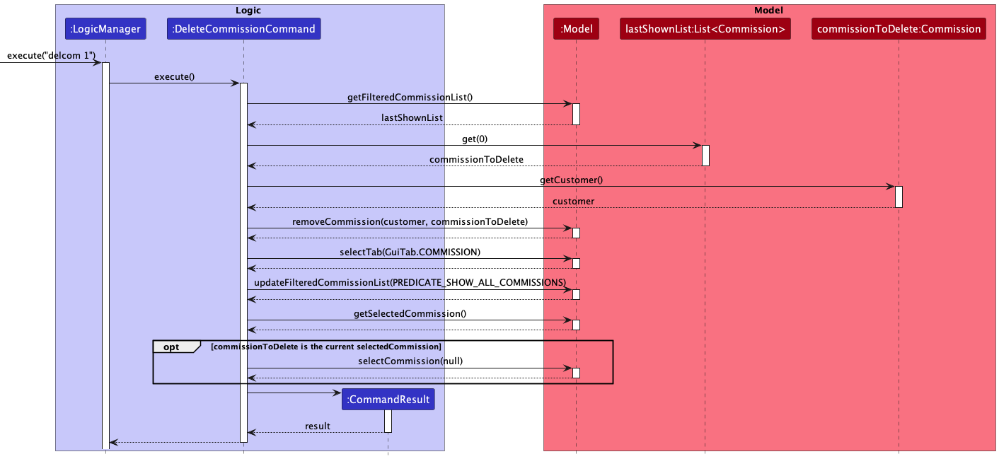

* Table of Contents
{:toc}

--------------------------------------------------------------------------------------------------------------------

## **Acknowledgements**

* This project is based on the AddressBook-Level3 project created by the SE-EDU initiative. 

--------------------------------------------------------------------------------------------------------------------

## **Setting up, getting started**

Refer to the guide [_Setting up and getting started_](SettingUp.md).

--------------------------------------------------------------------------------------------------------------------

## **Design**

    :bulb: **Tip:** The `.puml` files used to create diagrams in this document can be found in the [diagrams](https://github.com/AY2223S1-CS2103T-W11-3/tp/tree/master/docs/diagrams/) folder. Refer to the [_PlantUML Tutorial_ at se-edu/guides](https://se-education.org/guides/tutorials/plantUml.html) to learn how to create and edit diagrams.

### Architecture

The ***Architecture Diagram*** given above explains the high-level design of the App.

Given below is a quick overview of main components and how they interact with each other.

**Main components of the architecture**

**`Main`** has two classes called [`Main`](https://github.com/AY2223S1-CS2103T-W11-3/tp/tree/master/src/main/java/seedu/address/Main.java) and [`MainApp`](https://github.com/AY2223S1-CS2103T-W11-3/tp/tree/master/src/main/java/seedu/address/MainApp.java). It is responsible for,
* At app launch: Initializes the components in the correct sequence, and connects them up with each other.
* At shut down: Shuts down the components and invokes cleanup methods where necessary.

[**`Commons`**](#common-classes) represents a collection of classes used by multiple other components.

The rest of the App consists of four components.

* [**`UI`**](#ui-component): The UI of the App.
* [**`Logic`**](#logic-component): The command executor.
* [**`Model`**](#model-component): Holds the data of the App in memory.
* [**`Storage`**](#storage-component): Reads data from, and writes data to, the hard disk.

**How the architecture components interact with each other**

The *Sequence Diagram* below shows how the components interact with each other for the scenario where the user issues the command `delete 1`.

Each of the four main components (also shown in the diagram above),

* defines its *API* in an `interface` with the same name as the Component.
* implements its functionality using a concrete `{Component Name}Manager` class (which follows the corresponding API `interface` mentioned in the previous point.

For example, the `Logic` component defines its API in the `Logic.java` interface and implements its functionality using the `LogicManager.java` class which follows the `Logic` interface. Other components interact with a given component through its interface rather than the concrete class (reason: to prevent outside component's being coupled to the implementation of a component), as illustrated in the (partial) class diagram below.

The sections below give more details of each component.

### UI component

The **API** of this component is specified in [`Ui.java`](https://github.com/AY2223S1-CS2103T-W11-3/tp/tree/master/src/main/java/seedu/address/ui/Ui.java)

The UI consists of a `MainWindow` that is made up of parts e.g.`CommandBox`, `ResultDisplay`, `CustomerListPanel`, `StatusBarFooter` etc. All these, including the `MainWindow`, inherit from the abstract `UiPart` class which captures the commonalities between classes that represent parts of the visible GUI.

The `UI` component uses the JavaFx UI framework. The layout of these UI parts are defined in matching `.fxml` files that are in the `src/main/resources/view` folder. For example, the layout of the [`MainWindow`](https://github.com/AY2223S1-CS2103T-W11-3/tp/tree/master/src/main/java/seedu/address/ui/MainWindow.java) is specified in [`MainWindow.fxml`](https://github.com/AY2223S1-CS2103T-W11-3/tp/tree/master/src/main/resources/view/MainWindow.fxml)

The `UI` component,

* executes user commands using the `Logic` component.
* listens for changes to `Model` data so that the UI can be updated with the modified data.
* keeps a reference to the `Logic` component, because the `UI` relies on the `Logic` to execute commands.
* depends on some classes in the `Model` component, as it displays `Customer` object residing in the `Model`.

### Logic component

**API** : [`Logic.java`](https://github.com/AY2223S1-CS2103T-W11-3/tp/tree/master/src/main/java/seedu/address/logic/Logic.java)

Here's a (partial) class diagram of the `Logic` component:

How the `Logic` component works:
1. When `Logic` is called upon to execute a command, it uses the `AddressBookParser` class to parse the user command.
1. This results in a `Command` object (more precisely, an object of one of its subclasses e.g., `AddCommand`) which is executed by the `LogicManager`.
1. The command can communicate with the `Model` when it is executed (e.g. to add a customer).
1. The result of the command execution is encapsulated as a `CommandResult` object which is returned back from `Logic`.

The Sequence Diagram below illustrates the interactions within the `Logic` component for the `execute("delete 1")` API call.

:information_source: **Note:** The lifeline for `DeleteCommandParser` should end at the destroy marker (X) but due to a limitation of PlantUML, the lifeline reaches the end of diagram.

Here are the other classes in `Logic` (omitted from the class diagram above) that are used for parsing a user command:

How the parsing works:
* When called upon to parse a user command, the `AddressBookParser` class creates an `XYZCommandParser` (`XYZ` is a placeholder for the specific command name e.g., `AddCustomerCommandParser`) which uses the other classes shown above to parse the user command and create a `XYZCommand` object (e.g., `AddCommand`) which the `AddressBookParser` returns back as a `Command` object.
* All `XYZCommandParser` classes (e.g., `AddCustomerCommandParser`, `DeleteCommandParser`, ...) inherit from the `Parser` interface so that they can be treated similarly where possible e.g, during testing.

### Model component
**API** : [`Model.java`](https://github.com/AY2223S1-CS2103T-W11-3/tp/tree/master/src/main/java/seedu/address/model/Model.java)

The `Model` component,

* stores the art buddy data i.e., all `Customer` objects (which are contained in a `UniqueCustomerList` object).
* stores all `Commission` objects within their respective `Customer` object (which are contained in a `UniqueCommissionList` object).
* stores all `Iteration` objects within their respective `Commission` object (which are contained in a `UniqueIterationList` object).
* stores the currently 'selected' `Customer` as an `ObservableObject<Customer>` respectively, which lets us listen to changes to the selected customer for performing UI updates.
  * the same applies to the currently selected `Commission`.
* stores the current 'sorted' and 'filtered' objects (sorted based on the `sortcus` or `find` commands) as a separate _sorted_ and _filtered_ list which is exposed to outsiders as an unmodifiable `ObservableList<Customer>` that can be 'observed' e.g. the UI can be bound to this list so that the UI automatically updates when the data in the list change.
* stores the current list of `Commission` objects belonging to the selected `Customer` (e.g., results of a search query) as a separate _filtered_ list which is exposed to outsiders as an unmodifiable `ObservableList<Commission>` that can be 'observed' e.g. the UI can be bound to this list so that the UI automatically updates when the data in the list changes.
* stores a `UserPref` object that represents the user’s preferences. This is exposed to the outside as a `ReadOnlyUserPref` objects.
* does not depend on any of the other three components (as the `Model` represents data entities of the domain, they should make sense on their own without depending on other components)
* keeps track of the currently selected GUI tab using a `GuiTab` enum. The tab that the GUI displays is updated after each command is executed. 

:information_source: **Note:** An alternative (arguably, a more OOP) model is given below. It has a `Tag` list in the `AddressBook`, which `Customer` references. This allows `AddressBook` to only require one `Tag` object per unique tag, instead of each `Customer` needing their own `Tag` objects. 

### Storage component

**API** : [`Storage.java`](https://github.com/AY2223S1-CS2103T-W11-3/tp/tree/master/src/main/java/seedu/address/storage/Storage.java)

The `Storage` component,
* can save both address book data and user preference data in json format, and read them back into corresponding objects.
* inherits from `AddressBookStorage`, `UserPrefStorage` and `ImageStorage`, which means it can be treated as any one of them (if only the functionality of only one is needed).
* depends on some classes in the `Model` component (because the `Storage` component's job is to save/retrieve objects that belong to the `Model`)
* handles the following image functionality:
  * loading of [`BufferedImage`](https://docs.oracle.com/en/java/javase/11/docs/api/java.desktop/java/awt/image/BufferedImage.html) from a specified path in the image directory.
  * storing a [`BufferedImage`](https://docs.oracle.com/en/java/javase/11/docs/api/java.desktop/java/awt/image/BufferedImage.html) within the image directory.
  * :information_source: **Note:** the image directory (in which all images are stored) is defined by `imageBaseDirectoryPath` within [`UserPrefs.java`](https://github.com/AY2223S1-CS2103T-W11-3/tp/tree/master/src/main/java/seedu/address/model/UserPrefs.java).

### Common classes

Classes used by multiple components are in the `seedu.addressbook.commons` package.

--------------------------------------------------------------------------------------------------------------------

## **Implementation**

This section describes some noteworthy details on how certain features are implemented.

### Commissions
The class diagram below shows our current implementation of the `Commission` class.

Each commission in `ArtBuddy` contains...
- a `Title`
- a `Fee`
- a `Deadline`
- a `Completion Status`
- a `Set<Tags>` with any number of `Tag`s
- an *optional* `Description`
- a reference to its `Customer` object
- a `UniqueIterationList` containing its `Iteration`s

Commissions are currently stored in the individual `Customer`'s `UniqueCommissionList`.

#### Design Considerations:

**Aspect 1: Location to store the commission objects**

* **Alternative 1 (current choice):** Store all commission objects within their individual customer objects.
  * Pros:
    * Easy to implement.
    * Commands requiring commissions of a specific customer becomes more efficient.
  * Cons:
    * Commands requiring commissions from all customers are less efficient.
* **Alternative 2:** Store all commission objects in `AddressBook`.
  * Pros:
    * Commands requiring commissions from all customers can be more efficient.
  * Cons:
    * More difficult to implement, since a deleted customer's commissions has to be individually deleted from this master list of commissions.
    * Less efficient for commands for an individual customer's commissions.

**Aspect 2: How to store the commission objects in `Customer`**

* **Alternative 1 (current choice):**  create a `UniqueCommissionList` class
  * Pros:
    * Supports indexing of commissions already, which is convenient for most of our commands.
  * Cons:
    * Another class is necessary.
* **Alternative 2:** Use `Set<Commissions>`
  * Pros:
    * Individual customers' data does not require "ordering". Sets thus provide more efficient add/delete/find operations.
  * Cons:
    * Does not support indexing. Would still need another data structure in `ModelManager` when commands request commissions by index.
    * Edit becomes tedious to implement as it requires a combination of create and delete.

#### Deleting a Commission (`delcom`)

Deletes a commission based on user input, and deletes the commission from the active customer.

##### Implementation
This section explains how the `delcom` command is implemented.

Support for the `delcom` command is integrated with `DeleteCommissionCommandParser` and `DeleteCommissionCommand`.

It is important to note that our commission commands usually require retrieving the customer to operate on the customer's
commission list directly, due to our method of storing commissions (inside their Customer objects).

1. User specified arguments (the commission index) are passed to the DeleteCommissionCommandParser and the arguments are broken up by the ArgumentTokenizer and ArgumentMultimap.

1. The arguments will then be parsed by ParserUtil. An error will be thrown if the inputs were invalid or if no customer is selected yet.

1. A new DeleteCommissionCommand object will be initialised.

1. DeleteCommissionCommand#execute() will then get the currently shown list of commissions and identify the target commission to delete.

1. This commission is passed into Customer#removeCommission to be removed directly from the customer's commission list.

1. Model updates the GuiTab to show the Commission tab and selectedCommission to not show the deletedCommission and these changes are observed by the UI.

1. The success message will be returned to the user by the CommandResult.

The sequence diagram below shows the interaction between `Logic` and `Model` when `delcom 1` is executed.
The parser part is omitted for brevity, but it is very similar to the other commands.

### Iterations
Iterations help users keep track of the progress of their commissions. Each commission iteration
essentially represents a version of the commissioned artwork.

Iterations contain:
* a `Date`, which uses a `LocalDate` in its underlying implementation, representing the date
tied to the iteration
* an `IterationDescription`, which represents a textual description of the iteration
* a `Path`, which is the file path of an image representing the iteration artwork
* and a `Feedback`, which represents textual feedback to the iteration.

Since an iteration must be tied to a commission, this composition is captured by storing the
iterations in a `UniqueIterationList` inside the associated commission object.

#### Adding an Iteration (`additer`)
Adding an `Iteration` creates an iteration based on the user input, and adds the iteration to the
active commission. Like all other add commands, users may either add an iteration via the
command line or the GUI.

##### Implementation
Support for the add iteration command is integrated with the `AddIterationParser`,
which enables ArtBuddy to parse user input into an `AddIterationCommand`. The
`AddIterationCommand` stores the iteration created from the user inputs. This
iteration is added to the active commission's `UniqueIterationList` when the
`AddIterationCommand` is executed by the `LogicManager`.

Note that if there is no presently active commission, the iteration will not be added.

The sequence diagram below shows the interactions between the Logic, Model, and Storage components when
the user runs the command `additer d/2022-10-10 n/Changed the colour scheme p//Users/john/Downloads/Draft 1.png
f/Updated colour scheme is much better`.

 

 

##### Design Considerations
<table>
<tr><th colspan="4">Aspect 1: Image File Handling</th></tr>
<tr><th></th><th>Alternative</th><th>Pros</th><th>Cons</th></tr>
<tr><td>1</td>
<td>Store and use the image at the file path specified in the <code>additer</code> command</td>
<td>Easy to implement</td><td>The user might modify the image at the given file path. For instance,
the image may be edited, renamed, moved, or entirely deleted.

This imposes the constraint on the user not to modify their files if they do not wish for
their files on ArtBuddy to be similarly modified, which is not ideal in most cases.

In addition, it exposes ArtBuddy to some vulnerabilities that may lead to unexpected behaviour.
For example, the user might change the file to an unsupported file type.

All these potential failures have to be gracefully handled- which poses a big challenge because
there are so many areas for error that some may be overlooked. Furthermore, many of these issues
might not have ideal solutions that do not diminish the user experience and are easy to implement.
</td>

</tr>
<tr><td>2</td>
<td>Make a defensive copy of the uploaded image <strong>(current)</strong></td>
<td>Making a defensive copy of the uploaded image in ArtBuddy protects the images used
in ArtBuddy from modification and the problems associated to user modification, as explained above.</td>
<td>Additional overhead will have to be added to the execution of <code>additer</code> commands,
because a copy of the image has to be made each time the command is executed.

Furthermore, it introduces deeper coupling between the `Logic` and `Storage` components since
the `AddIterationCommand` class in `Logic` would have to depend on `Storage` to copy the image into ArtBuddy.
</td>
</tr>
<tr><td colspan="4">Overall, the team felt that the tradeoffs in overhead and coupling were worth making due to the
severity of bugs that could have been introduced in ArtBuddy otherwise.</td></tr>
</table>

<table>
<tr><th colspan="4">Aspect 2: Image Copy File Naming</th></tr>
<tr><th></th><th>Alternative</th><th>Pros</th><th>Cons</th></tr>
<tr><td>1</td><td>Naming the copy of the image file with the original filename</td>
<td>-</td><td>There may be files with the same original file name. This could result
in duplicate filenames in the ArtBuddy storage folder, which is not allowed.</td></tr>

<tr><td>2</td><td>Creating sub-folders for each customer and commission, where the
image copy will be stored. The image copy files will be named after their iteration
description.</td><td>As iteration descriptions are guaranteed to be unique within each commission,
we can guarantee that all filenames within each folder will be unique.</td>
<td>Many nested folders would have to be created in ArtBuddy just to store iteration images.

In addition, it would introduce overheads into other commands, such as <code>deliter</code>
and <code>edititer</code> because the filenames of these files would have to be modified to
ensure they can be referenced to the correct iteration, and also avoid the issue with duplicate filenames.
Furthermore, iteration descriptions may contain characters that result in invalid filenames.
</td></tr>

<tr><td>3</td><td>Keeping a global count and naming the image copy file after its customer,
commission and this global count.</td><td>Each combination of customer name and commission title
is guaranteed to be unique.

Also, since there is a restriction on customer names and commission titles, they are suitable to be used as filenames.

Editing and deletion of iterations will not incur additional overheads as the unique global count
would ensure that each iteration image remains uniquely identifiable after these commands.
</td>

<td>Even though we are getting closer to a unique hash, editing and deletion of customers and commissions would
still be problematic. These commands still require the filenames to be renamed- else, they would risk facing the
same issue of duplicate filenames within the image storage folder.

In addition, the introduction of a global variable would introduce a high level of coupling.
</td>
</tr>

<tr><td>4</td><td>Use a randomly generated hash as the filename <strong>(current)</strong></td>
<td>High probability of the unique filenames.

Removed dependency on the state of the `Customer`, `Commission`, or `Iteration` object it belongs to.
Hence, no additional overhead will be incurred with delete or edit commands.
</td>
<td>While small, there is a non-zero probability of getting duplicate filenames</td>
</tr>
<tr><td colspan="4">Overall, the team agreed that using a randomly generated hash was definitely
the most elegant way of handling file naming. Furthermore, the tradeoffs are almost negligible
as duplicate filenames can be easily handled by generating a new hash until a unique filename is obtained.</td></tr>
</table>

### \[Proposed\] Undo/redo feature

#### Proposed Implementation

The proposed undo/redo mechanism is facilitated by `VersionedAddressBook`. It extends `AddressBook` with an undo/redo history, stored internally as an `addressBookStateList` and `currentStatePointer`. Additionally, it implements the following operations:

* `VersionedAddressBook#commit()` — Saves the current address book state in its history.
* `VersionedAddressBook#undo()` — Restores the previous address book state from its history.
* `VersionedAddressBook#redo()` — Restores a previously undone address book state from its history.

These operations are exposed in the `Model` interface as `Model#commitAddressBook()`, `Model#undoAddressBook()` and `Model#redoAddressBook()` respectively.

Given below is an example usage scenario and how the undo/redo mechanism behaves at each step.

Step 1. The user launches the application for the first time. The `VersionedAddressBook` will be initialized with the initial address book state, and the `currentStatePointer` pointing to that single address book state.

Step 2. The user executes `delete 5` command to delete the 5th customer in the address book. The `delete` command calls `Model#commitAddressBook()`, causing the modified state of the address book after the `delete 5` command executes to be saved in the `addressBookStateList`, and the `currentStatePointer` is shifted to the newly inserted address book state.

Step 3. The user executes `add n/David …​` to add a new customer. The `add` command also calls `Model#commitAddressBook()`, causing another modified address book state to be saved into the `addressBookStateList`.

:information_source: **Note:** If a command fails its execution, it will not call `Model#commitAddressBook()`, so the address book state will not be saved into the `addressBookStateList`.

Step 4. The user now decides that adding the customer was a mistake, and decides to undo that action by executing the `undo` command. The `undo` command will call `Model#undoAddressBook()`, which will shift the `currentStatePointer` once to the left, pointing it to the previous address book state, and restores the address book to that state.

:information_source: **Note:** If the `currentStatePointer` is at index 0, pointing to the initial AddressBook state, then there are no previous AddressBook states to restore. The `undo` command uses `Model#canUndoAddressBook()` to check if this is the case. If so, it will return an error to the user rather
than attempting to perform the undo.

The following sequence diagram shows how the undo operation works:

:information_source: **Note:** The lifeline for `UndoCommand` should end at the destroy marker (X) but due to a limitation of PlantUML, the lifeline reaches the end of diagram.

The `redo` command does the opposite — it calls `Model#redoAddressBook()`, which shifts the `currentStatePointer` once to the right, pointing to the previously undone state, and restores the address book to that state.

:information_source: **Note:** If the `currentStatePointer` is at index `addressBookStateList.size() - 1`, pointing to the latest address book state, then there are no undone AddressBook states to restore. The `redo` command uses `Model#canRedoAddressBook()` to check if this is the case. If so, it will return an error to the user rather than attempting to perform the redo.

Step 5. The user then decides to execute the command `list`. Commands that do not modify the address book, such as `list`, will usually not call `Model#commitAddressBook()`, `Model#undoAddressBook()` or `Model#redoAddressBook()`. Thus, the `addressBookStateList` remains unchanged.

Step 6. The user executes `clear`, which calls `Model#commitAddressBook()`. Since the `currentStatePointer` is not pointing at the end of the `addressBookStateList`, all address book states after the `currentStatePointer` will be purged. Reason: It no longer makes sense to redo the `add n/David …​` command. This is the behavior that most modern desktop applications follow.

The following activity diagram summarizes what happens when a user executes a new command:

#### Design considerations:

**Aspect: How undo & redo executes:**

* **Alternative 1 (current choice):** Saves the entire address book.
  * Pros: Easy to implement.
  * Cons: May have performance issues in terms of memory usage.

* **Alternative 2:** Individual command knows how to undo/redo by
  itself.
  * Pros: Will use less memory (e.g. for `delete`, just save the customer being deleted).
  * Cons: We must ensure that the implementation of each individual command are correct.

_{more aspects and alternatives to be added}_

### \[Proposed\] Data archiving

_{Explain here how the data archiving feature will be implemented}_

--------------------------------------------------------------------------------------------------------------------

## **Documentation, logging, testing, configuration, dev-ops**

* [Documentation guide](Documentation.md)
* [Testing guide](Testing.md)
* [Logging guide](Logging.md)
* [Configuration guide](Configuration.md)
* [DevOps guide](DevOps.md)

--------------------------------------------------------------------------------------------------------------------

## **Appendix: Requirements**

### Product scope

**Target user profile**:

* An artist who works through commissions
* has a need to manage clients and commissions
* wants to review past commission works and feedbacks
* wants to market himself to the right clients
* prefers desktop apps over other types
* is reasonably comfortable using CLI apps
* prefers typing to mouse interactions

**Value proposition**:
Allows artists to hone their craft systematically and tune their artworks to fit the taste of their clients which ultimately builds their reputation.

### User stories

Priorities: High (must have) - `* * *`, Medium (nice to have) - `* *`, Low (unlikely to have) - `*`

| Priority | As a …​                                                 | I want to …​                                                              | So that I can…​                                               |
|----------|---------------------------------------------------------|---------------------------------------------------------------------------|---------------------------------------------------------------|
| `* * *`  | artist                                                  | exit from the program                                                     |                                                               |
| `* * *`  | artist                                                  | get a list of all my commissions of one specific customer                 |                                                               |
| `* * *`  | new user                                                | get help                                                                  | know how to use the product                                   |
| `* * *`  | artist eager to improve his craft                       | review past feedback given by customers                                   | better the quality of my subsequent works                     |
| `* * *`  | artist                                                  | delete commissions                                                        |                                                               |
| `* * *`  | artist                                                  | view uploaded images of my previous commissions                           |                                                               |
| `* * *`  | artist                                                  | upload images of art                                                      |                                                               |
| `* * *`  | artist                                                  | create a customer entry                                                   |                                                               |
| `* * *`  | artist with loyal customers                             | see customer's repeated payment / commissions                             | start a loyalty program to encourage their purchases          |
| `* *`    | artist                                                  | prioritize my commissions                                                 | keep track of the most urgent commissions                     |
| `* *`    | artist                                                  | categorize the artstyle of my commissions                                 |                                                               |
| `* *`    | artist                                                  | sort my commissions by due date                                           | easily access all commissions with pressing due dates         |
| `* *`    | artist                                                  | search for commissions by date                                            |                                                               |
| `* *`    | artist                                                  | search for commissions by type                                            |                                                               |
| `* *`    | artist                                                  | search for commissions by name                                            |                                                               |
| `* *`    | artist who can offer multiple kinds of commissions      | categorize the commissions                                                | better analyse the commissions.                               |
| `* *`    | artist who has similar customers                        | categorize them into groups                                               | systematically review their feedback and apply the takeaways. |
| `* *`    | artist who works traditionally                          | retain iterations of my work from the sketch phase to the final rendering |                                                               |
| `* *`    | artist who creates non-commissioned works               | determine potential customers who might be interested to purchase them    |                                                               |
| `* *`    | busy artist with several commissions ongoing            | track the deadlines of each commission                                    | ensure my work is delivered on time                           |
| `* *`    | busy artist with several commissions ongoing            | track my progress in each of them                                         |                                                               |
| `* *`    | artist keen to make my hobby a side hustle              | determine the type of commissions that have proven lucrative              | focus my efforts into these genres                            |
| `* *`    | artist                                                  | update images of art                                                      | re-upload the image if I uploaded the wrong file              |
| `* *`    | artist                                                  | calculate my monthly income                                               |                                                               |
| `*`      | artist who may receive multiples of the same commission | duplicate my commissions                                                  | not have to manually enter the same information every time    |
| `*`      | long-time user                                          | hide/archive old commissions                                              | not be distracted by too much information                     |
| `*`      | artist                                                  | store image references used when drawing the commission                   |                                                               |
| `*`      | artist                                                  | clear all existing commissions                                            |                                                               |
| `*`      | artist                                                  | search for commissions by customers                                       |                                                               |
| `*`      | artist                                                  | search for commissions by multiple types(intersect)                       |                                                               |
| `*`      | artist                                                  | search for commissions by multiple types(union)                           |                                                               |
| `*`      | artist who works on multiple devices                    | transfer my application data from one device to the other                 |                                                               |

### Use cases

(For all use cases below, the **System** is `ArtBuddy`
and the **Actor** is the `user`, unless specified otherwise)

**Use case: View a Customer**

**MSS**

1. User requests to list customers
2. ArtBuddy shows a list of customers
3. User requests to open customer in the list
4. ArtBuddy shows the list of commissions the customer made and the details of the customer

    Use case ends.

**Extensions**

* 1a. The customer list is empty.

    Use case ends.
* 2a. The given index is invalid.

    * 2a1. ArtBuddy shows an error message.

      Use case ends.

**Use case: Add a customer**

**MSS**

1. ArtBuddy shows a list of customers
2. User requests to add a customer and his or her details to the list
3. ArtBuddy shows the updated list of customers

    Use case ends.

**Extensions**

* 2a. Necessary customer details not given.

    * 2a1. ArtBuddy shows an error message.

      Use case ends.

**Use case: Delete a commission**

**MSS**

1. ArtBuddy shows the list of commissions from the opened customer
2. User requests to delete a specific commission in the list
3. ArtBuddy deletes the commission and updates the list displayed

   Use case ends.

**Extensions**

* 1a. The commission list is empty.

  Use case ends.

* 2a. The given index is invalid.

    * 2a1. ArtBuddy shows an error message.

      Use case ends.

**Use case: Add a commission**

**MSS**

1. ArtBuddy shows the list of commissions from the opened customer
2. User requests to add a commission and its related details to the list
3. ArtBuddy adds the commission and updates the list displayed

   Use case ends.

**Extensions**

* 2a. Necessary commission details not given.

    * 2a1. ArtBuddy shows an error message.

      Use case ends.

**Use case: Delete a Customer**

**MSS**

1.  User requests to list customers
2.  ArtBuddy shows a list of customers
3.  User requests to delete a customer in the list
4.  ArtBuddy warns the user that all commissions under the customer will be deleted, and confirms whether the user still wants to proceed
5.  User confirms.
6.  ArtBuddy deletes the customer

    Use case ends.

**Extensions**

* 2a. The list is empty.

  Use case ends.

* 3a. The given index is invalid.

    * 3a1. ArtBuddy shows an error message.

      Use case resumes at step 2.

* 4a. The user chooses not to proceed with the deletion.

  Use case ends.

**Use case: Open a commission**

**Preconditions: AB currently has a customer open.**

**MSS**
1. User enters a command to open a specific commission.
2. AB shows the commission’s details.

    Use case ends.

**Extensions**

* 1a. AB detects an invalid command format.
  * 1a1. AB displays an error message informing User of the command format.

    Use case ends.

* 1b. AB detects the selected commission does not exist.
  * 1b1. AB displays an error message.

    Use case ends.

**Use case: Add iteration to a commission** 
**Guarantees:**
* An iteration, with an associated image, will be added to the specified commission only if its creation is successful
* The new iteration will not be created if the image provided is not valid (e.g. it does not exist, or it is not
  of the correct image format)

**MSS:**
1. User <u>opens a commission they want to edit (Open Commission)</u>.
2. User enters the command to add an iteration to the commission selected, specifying the image to use for the
   iteration using an absolute file path.
3. AB creates a new iteration for the commission, associated with the image specified.
4. AB updates the GUI to also show the new iteration.

   Use case ends.

**Extensions:**
* 2a. The user enters a command that AB does not recognise.
    * 2a1. AB shows an error message, and asks the user to enter a correct command.
    * 2a2. User enters a new command.

      Steps 2a1 and 2a2 are repeated until the command is correctly entered.

      Use case resumes from step 3.

* 2b. The specified file path the user specifies is invalid or does not exist.
    * 2b1. AB shows an error message, and asks the user for a new command with a valid file path that exists.
    * 2b2. User enters a new command.

      Steps 2b1 and 2b2 are repeated until the command is correctly entered.

      Use case resumes from step 3.

* 2c. The specified file under the file path is not a valid file type.
    * 2c1. AB lets the user know that the file is not supported, and requests for a new command
      with a file of support file types.
    * 2c2. User enters a new command.

      Steps 2c1 and 2c2 are repeated until the command is correctly entered.

      Use case resumes from step 3.

**Use case: Delete an iteration of a commission 
Preconditions: AB currently has a commission opened. **

**MSS:**
1. Artist enters a command to delete a specified iteration of the commission.
2. AB deletes the specified iteration and updates the GUI.
   Use case ends.

**Extensions:**
* 1a. The user enters a command that AB does not recognise.
    * 1a1. AB shows an error message, and asks the user to enter a correct command.
    * 1a2. User enters a new command. 
      Steps 1a1 and 1a2 are repeated until the command is correctly entered. 
      Use case resumes from step 2.

* 1b. The user tries to delete an iteration that does not exist.
    * 1b1. AB shows an error message and asks the user to specify an iteration that exists.
    * 1b2. User enters a new command. 
      Steps 1b1 and 1b2 are repeated until the command is valid. 
      Use case resumes from step 2.

### Non-Functional Requirements

1.  Should work on any _mainstream OS_ as long as it has Java `11` or above installed.
2.  Should be able to hold up to 500 customers, 2000 commissions and 8000 iterations without a noticeable sluggishness in performance for typical usage.
3.  A user with above average typing speed for regular English text (i.e. not code, not system admin commands) should be able to accomplish most of the tasks faster using commands than using the mouse.
4. The app should be designed for and used by a single user.
5. The app data should be stored in a human-editable text file and not a DBMS.
6. Images and other app assets should be stored locally and not in a remote server.
7. The app should be well tested with a coverage of above 65% to allow bugs to be found more easily.
8. The product should be usable on all standard screen resolutions above 1280x720.
9. The product should be packaged within a single JAR file with a filesize of up to 100MB.

### Glossary

* **Mainstream OS**: Windows, Linux, Unix, OS-X
* **Customer**: A contact detail. Contains information about the customer, and a list of commissions.
* **Commission**: An art piece requested by a customer that has been delivered or is in progress. Contains specifics about the commission and a list of iterations.
* **Iteration**: A single version of a commission. Contains an image and a text comment on the image.

--------------------------------------------------------------------------------------------------------------------

## **Appendix: Instructions for manual testing**

Given below are instructions to test the app manually.

:information_source: **Note:** These instructions only provide a starting point for testers to work on;
testers are expected to do more *exploratory* testing.

### Launch and shutdown

1. Initial launch

   1. Download the jar file and copy into an empty folder

   1. From the terminal, `cd` into that empty folder and run `java -jar artbuddy.jar`
   
      Expected: Shows the GUI with a set of sample customers, commissions and iterations. The window size may not be optimum.

1. Saving window preferences

   1. Resize the window to an optimum size. Move the window to a different location. Close the window.

   1. Re-launch the app by double-clicking the jar file. 
       Expected: The most recent window size and location is retained.

1. Shutdown
   2. Shutdown the application via closing the window or using the `exit` command.

### Commands

#### Customer-related commands
> Note that you can run customer-related commands, even in the Commission view. That is a **feature**, not
a bug.

##### 1. `addcus` Command
  1. Prerequisites: None. 
     1. Test case: `addcus n/John Doe p/98765432 e/johnd@example.com t/tag`
        1. Expected:  New customer named John Doe appears on the customer list. Application switched to the Customer view. 
           Details of new customer shown on the right pane.
     1. Test case: `addcus n/John Doe p/98765432 e/johnd@example.com t/tag`
        1. Expected: Duplicate customer not added. Error message is displayed.

##### 2. `editcus` Command
1. Prerequisites: There is at least one customer.
  1. Test case: `editcus 1 t/new tag`
     1. Expected: The first customer should now only have one tag. Application switched to customer view. Edited customer's
    details displayed on the right pane.
  1. Test case: `editcus 1`
     1. No customer edited. Error details displayed.
  1. Test case: `editcus 0 t/new tag`
     1. No customer edited. Error details displayed.

##### 3. `delcus` Command
1. Deleting a customer while all customers are being shown
    1. Prerequisites: List all customers using the `list` command. Multiple customers in the list.
    1. Test case: `delcus 1` 
       1. Expected: First contact is deleted from the list. Details of the deleted customer shown in the status message. Timestamp in the status bar is updated.
    1. Test case: `delcus 0` 
       1. Expected: No customer is deleted. Error details shown in the status message. Status bar remains the same.
    1. Other incorrect delete commands to try: `delcus`, `delcus x`, `...` (where x is larger than the list size) 
       1. Expected: Similar to previous.

##### 4. `opencus` Command
1. Prerequisites: At least one customer.
   1. Test case: `opencus 1`
      1. Expected: Customer's details shown on the right pane. If customer has any commissions, they can be seen with
      `listcom`.
   1. Test case: `opencus`
      1. Expected: No customer is selected. Error details in the status message.

#### Commission-related commands
> Note that you can run commission-related commands, even in the Customer view. That is a **feature**, not
a bug.

##### 5. `addcom` Command
1. Prerequisites:
    1. There are customers.
    2. a **customer should be selected** (i.e. in the Customer view, you should see a customer on the right pane.)
       If not fulfilled, run the `opencus` command, e.g `opencus 1`.
1. Test case: `addcom n/Tokyo Ghoul Kaneki f/50 d/2022-10-10 s/False p/Unfamiliar, I will need to do up a reference board first. t/digital t/neon`
   1. Expected: Commission added to customer's commission list. Application switches to the commission view. New
      commission details displayed on the right pane.
1. Test case:  `addcom n/Tokyo Ghoul Kaneki f/50 d/2022-10-10 s/False p/commission with the same name`
   1. Expected: Commission is not added. Error message displayed.

##### 6. `editcom` Command
1. Prerequisites:
    1. There are commissions in the displayed commission list.
1. Test case: `editcom 1 t/tag`
    1. Expected: Commission is edited. Application switches to Commission view. Edited commission's details displayed on
       the right pane.
1. Test case: `editcom 0`
    1. Expected: No commission is edited. Error message displayed.

##### 7. `delcom` Command
1. Prerequisites:
    1. There are commissions in the displayed commission list.
1. Test case: `delcom 1`
    1. Expected: Commission is deleted. Application switches to Commission view. If deleted commission was the selected
       commission, selected commission is reset on the right pane.
1. Test case: `delcom 0`
    1. Expected: No commission is deleted. Error message displayed.

##### 8. `opencom` Command
1. Prerequisites:
    1. There are commissions in the displayed commission list.
1. Test case: `opencom 1`
    1. Expected: Application switches to Commission view. Selected commission's details displayed on right pane.
1. Test case: `opencom 0`
    1. Expected: No commission is selected. Error message displayed.

#### Iteration-related commands
> Note that you can run iteration-related commands, even in the Customer view. That is a **feature**, not
a bug.

##### 9. `additer` Command

:exclamation: **Caution:**
Our commands use file paths, which means they are dependent on your computer. Please try the following command with an
absolute filepath, that is **unique to you**, of images when testing our `additer` command. You can refer to the User
Guide for more information.

1. Prerequisites:
   1. A commission is selected. If not fulfilled, use the `opencom` command first.
1. Test case: <code>additer d/2022-10-10 n/Changed the colour scheme. p/{YOUR OWN FILE PATH HERE} f/Updated colour scheme is much better.</code>
   1. Expected: A new iteration is created. You can see it in the right pane of the Commission's view, at the bottom of the iteration's list.
1. Test case: <code>additer d/2022-10-10 n/Changed the colour scheme. p/{YOUR OWN FILE PATH HERE} f/Updated colour scheme is much better.</code>
   1. Expected: Duplicate iteration not created. Error details displayed.

##### 10. `edititer` Command
1. Prerequisites:
   1. A commission is selected. If not fulfilled, use the `opencom` command first.
   1. The selected commission has at least one iteration.
1. Test case: `edititer 1 f/feedback changed`
   1. Expected: Feedback of first iteration changed.
1. Test case: `edititer 0`
   1. Expected: No iteration edited. Error details displayed.

##### 11. `deliter` Command
1. Prerequisites:
    1. A commission is selected. If not fulfilled, use the `opencom` command first.
    1. The selected commission has at least one iteration.
1. Test case: `deliter 1`
    1. Expected: Iteration deleted.
1. Test case: `deliter 0`
   1. Expected: No iteration deleted. Error details displayed.

#### Filtering / Sorting commands

##### 12. `list` Command
1. Prerequisites: None.
1. Test case: `list`
   1. Expected: Switched to the Customer view. Customer list shows all customers.

##### 13. `find` Command
1. Prerequisites: Technically, none. However, it is better to have some customers, so you can see the results of this command.
1. Test case: `find k/Alex`
   1. Expected: Switched to customer view. Filtered customer list shows all customers with `Alex` in their name.

##### 14. `sortcus` Command
1. Prerequisites: Technically, none. However, it is better to have some customers, so you can see the results of this command.
1. Test case: `sortcus n/-`
   1. Expected: Switched to Customer view. Customer list sorted in descending order of name.
1. Test case: `sortcus n/+`
   1. Expected: Switched to Customer view. Customer list sorted in ascending order of name.

##### 15. `listcom` Command
1. Prerequisites: None.
1. Test case: `listcom`
   1. Expected: If a customer is selected, show all of customer's commissions. Otherwise, show all commissions.

##### 16. `allcom` Command
1. Prerequisites: None.
1. Test case: `allcom`
   1. Expected: Switched to Commission view. Commission List shows all commissions.

##### 17. `findcom` Command
1. Prerequisites: Similar to `find`, technically, none. However, having some commissions will make it easier to see the results of this command.
1. Test case: `findcom k/1`
   1. Expected: Switched to Commission view. All commissions with `1` in their name are displayed.

### Saving data

1. Dealing with missing/corrupted data files

   1. Prerequisites:
      1. There is a data file. By default, it should be at `data/artbuddy.json`
   1. Remove the starting `{`, then launch ArtBuddy.
   1. ArtBuddy's customer and commission list will all be empty. The corrupted data file will be overwritten when new
      customers are added to ArtBuddy.
   1. To restart the application with sample data, delete the corrupted json file and re-run the application.

## **Appendix: Effort**

A significant volume of effort was expended to develop ArtBuddy from the original AB3.
This is due to AB3 dealing primarily with only one entity Person while ArtBuddy deals with three entities, `Customer`,
`Commission` and `Iteration`.

### Major changes:
* Adding two entirely new entity types, `Commission` and `Iteration`
* Refactoring `Customer` and `Commission` to use the Builder Pattern to support optional arguments
* Supporting Images for `Iteration`
* Creating CRUD commands for the two completely new models, `Commission` and `Iteration`
* Designing `sort` command for `Customer` with many options for the user
* Implementing `find` commands for both `Customer` and `Commission` with added tag filtering functionality
* Redesigning the GUI

### Challenges faced:

#### Revamping the GUI
Amongst these changes, the most challenging change must be updating the GUI.

Firstly, ArtBuddy's three entities are very closely linked, with `Commission`s belonging to a `Customer` and
`Iteration`s belonging to a `Commission`. As a result, a lot of effort was expended to ensure the UI can properly
observe the models and filtered list. This is mostly facilitated by ArtBuddy's custom `ObservableObject` class.
A lot of listeners also had to be added in many parts of `Model` and `Ui` to ensure changes are properly propagated.

Secondly, ArtBuddy's GUI has changed significantly from the original AB3 GUI. Multiple new components have been added,
including tabs and split panes, pie charts for statistics, and even pop up windows and image drag and drop as an
alternate way of adding customers, commissions and iterations. There are also a lot of CSS changes to make the product
look more appealing to the user.

#### Creating new entities
`Commission` and `Iteration` are new entities and had to be written from scratch and integrated properly into all of
AB3's components, such as `Ui`, `Model`, `Storage` without breaking existing abstractions. The design had to clearly
thought out (e.g. which classes should help store the model and what methods are necessary) for easier implementation
of commands.

#### Implementing Images
Images for Iterations are a novel feature for ArtBuddy. There were many complications to consider:
* What if the file path is invalid?
* What if the file is not an image?
* What if the file is an image but not supported by JavaFx?
* What if the image file name is the same as another image?
* Images can have different dimensions. How should this be rendered in the GUI?

As a result, the implementation for this had to keep evolving in ArtBuddy, from a naive file copy to a more robust
implementation, a `SimpleImageStorage` class using classes such as `ImageIO` and `BufferedImage`.
