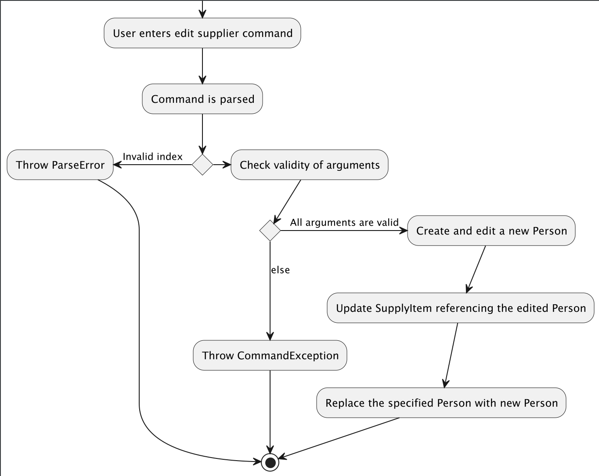
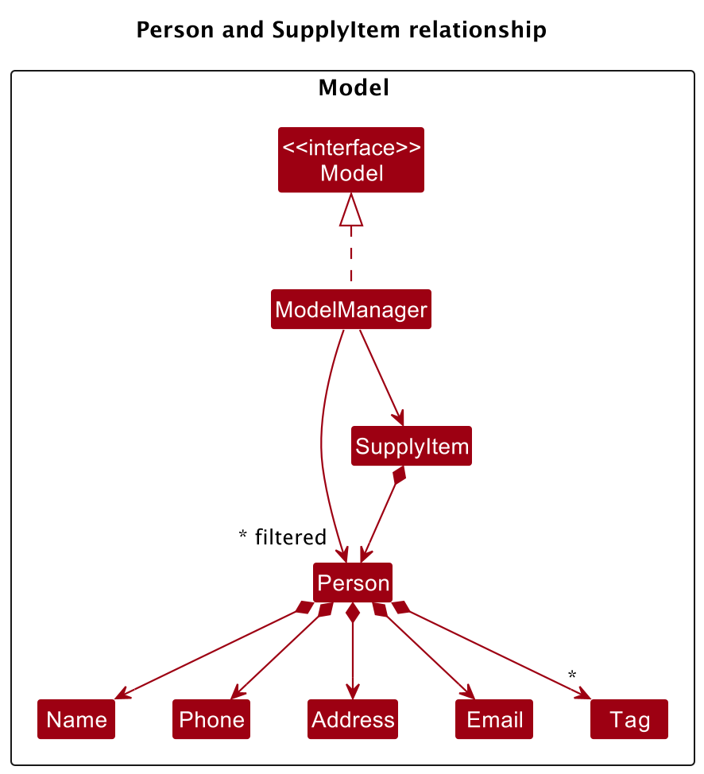
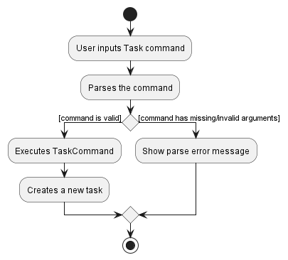

* Table of Contents
{:toc}

--------------------------------------------------------------------------------------------------------------------

## **Acknowledgements**

* {list here sources of all reused/adapted ideas, code, documentation, and third-party libraries -- include links to the original source as well}

--------------------------------------------------------------------------------------------------------------------

## **Setting up, getting started**

Refer to the guide [_Setting up and getting started_](SettingUp.md).

--------------------------------------------------------------------------------------------------------------------

## **Design**

:bulb: **Tip:** The `.puml` files used to create diagrams in this document can be found in the [diagrams](https://github.com/se-edu/addressbook-level3/tree/master/docs/diagrams/) folder. Refer to the [_PlantUML Tutorial_ at se-edu/guides](https://se-education.org/guides/tutorials/plantUml.html) to learn how to create and edit diagrams.

### Architecture

The ***Architecture Diagram*** given above explains the high-level design of the App.

Given below is a quick overview of main components and how they interact with each other.

**Main components of the architecture**

**`Main`** has two classes called [`Main`](https://github.com/se-edu/addressbook-level3/tree/master/src/main/java/seedu/address/Main.java) and [`MainApp`](https://github.com/se-edu/addressbook-level3/tree/master/src/main/java/seedu/address/MainApp.java). It is responsible for,
* At app launch: Initializes the components in the correct sequence, and connects them up with each other.
* At shut down: Shuts down the components and invokes cleanup methods where necessary.

[**`Commons`**](#common-classes) represents a collection of classes used by multiple other components.

The rest of the App consists of four components.

* [**`UI`**](#ui-component): The UI of the App.
* [**`Logic`**](#logic-component): The command executor.
* [**`Model`**](#model-component): Holds the data of the App in memory.
* [**`Storage`**](#storage-component): Reads data from, and writes data to, the hard disk.

**How the architecture components interact with each other**

The *Sequence Diagram* below shows how the components interact with each other for the scenario where the user issues the command `delete 1`.

Each of the four main components (also shown in the diagram above),

* defines its *API* in an `interface` with the same name as the Component.
* implements its functionality using a concrete `{Component Name}Manager` class (which follows the corresponding API `interface` mentioned in the previous point.

For example, the `Logic` component defines its API in the `Logic.java` interface and implements its functionality using the `LogicManager.java` class which follows the `Logic` interface. Other components interact with a given component through its interface rather than the concrete class (reason: to prevent outside component's being coupled to the implementation of a component), as illustrated in the (partial) class diagram below.

The sections below give more details of each component.

### UI component

The **API** of this component is specified in [`Ui.java`](https://github.com/se-edu/addressbook-level3/tree/master/src/main/java/seedu/address/ui/Ui.java)

The UI consists of a `MainWindow` that is made up of parts e.g.`CommandBox`, `ResultDisplay`, `PersonListPanel`, `TaskListPanel`, `InventoryPanel`, `StatusBarFooter` etc. All these, including the `MainWindow`, inherit from the abstract `UiPart` class which captures the commonalities between classes that represent parts of the visible GUI.

The `UI` component uses the JavaFx UI framework. The layout of these UI parts are defined in matching `.fxml` files that are in the `src/main/resources/view` folder. For example, the layout of the [`MainWindow`](https://github.com/se-edu/addressbook-level3/tree/master/src/main/java/seedu/address/ui/MainWindow.java) is specified in [`MainWindow.fxml`](https://github.com/se-edu/addressbook-level3/tree/master/src/main/resources/view/MainWindow.fxml)

The `UI` component,

* executes user commands using the `Logic` component.
* listens for changes to `Model` data so that the UI can be updated with the modified data.
* keeps a reference to the `Logic` component, because the `UI` relies on the `Logic` to execute commands.
* depends on some classes in the `Model` component, as it displays `Person` and `Task` objects residing in the `Model`.

### Logic component

**API** : [`Logic.java`](https://github.com/se-edu/addressbook-level3/tree/master/src/main/java/seedu/address/logic/Logic.java)

Here's a (partial) class diagram of the `Logic` component:

How the `Logic` component works:
1. When `Logic` is called upon to execute a command, it uses the `AddressBookParser` class to parse the user command.
1. This results in a `Command` object (more precisely, an object of one of its subclasses e.g., `AddCommand`) which is executed by the `LogicManager`.
1. The command can communicate with the `Model` when it is executed (e.g. to add a person).
1. The result of the command execution is encapsulated as a `CommandResult` object which is returned back from `Logic`.

The Sequence Diagram below illustrates the interactions within the `Logic` component for the `execute("delete 1")` API call.

:information_source: **Note:** The lifeline for `DeleteCommandParser` should end at the destroy marker (X) but due to a limitation of PlantUML, the lifeline reaches the end of diagram.

Here are the other classes in `Logic` (omitted from the class diagram above) that are used for parsing a user command:

How the parsing works:
* When called upon to parse a user command, the `AddressBookParser` class creates an `XYZCommandParser` (`XYZ` is a placeholder for the specific command name e.g., `AddCommandParser`) which uses the other classes shown above to parse the user command and create a `XYZCommand` object (e.g., `AddCommand`) which the `AddressBookParser` returns back as a `Command` object.
* All `XYZCommandParser` classes (e.g., `AddCommandParser`, `DeleteCommandParser`, ...) inherit from the `Parser` interface so that they can be treated similarly where possible e.g, during testing.

### Model component
**API** : [`Model.java`](https://github.com/se-edu/addressbook-level3/tree/master/src/main/java/seedu/address/model/Model.java)

The `Model` component,

* stores the address book data i.e., all `Person` objects (which are contained in a `UniquePersonList` object).
* stores the task list data i.e., all `Task` objects (which are contained in a `ObservableList` object) that can be 'observed' e.g. the UI can be bound to this list so that the UI automatically updates when the data in the list change.
* stores the inventory data i.e., all `SupplyItem` objects (which are contained in a `ObservableList` object) that can be 'observed' e.g. the UI can be bound to this list so that the UI automatically updates when the data in the list change.
* stores the currently 'selected' `Person` objects (e.g., results of a search query) as a separate _filtered_ list which is exposed to outsiders as an unmodifiable `ObservableList<Person>` that can be 'observed' e.g. the UI can be bound to this list so that the UI automatically updates when the data in the list change.
* stores a `UserPref` object that represents the user’s preferences. This is exposed to the outside as a `ReadOnlyUserPref` objects.
* does not depend on any of the other four components (as the `Model` represents data entities of the domain, they should make sense on their own without depending on other components)

:information_source: **Note:** An alternative (arguably, a more OOP) model is given below. It has a `Tag` list in the `AddressBook`, which `Person` references. This allows `AddressBook` to only require one `Tag` object per unique tag, instead of each `Person` needing their own `Tag` objects. 

### Storage component

**API** : [`Storage.java`](https://github.com/se-edu/addressbook-level3/tree/master/src/main/java/seedu/address/storage/Storage.java)

The `Storage` component,
* can save address book data, task list data, inventory data, and user preference data in json format, and read them back into corresponding objects.
* inherits from both `AddressBookStorage`, `TaskListStorage`, `InventoryStorage` and `UserPrefStorage`, which means it can be treated as either one (if only the functionality of only one is needed).
* depends on some classes in the `Model` component (because the `Storage` component's job is to save/retrieve objects that belong to the `Model`)
* `JsonAdaptedTaskTag`, `JsonAdaptedSupplyItemTag` and `JsonAdaptedPersonTag` are actually the non-ambiguous direct representation of `JsonAdaptedTag`.

### Common classes

Classes used by multiple components are in the `seedu.addressbook.commons` package.

--------------------------------------------------------------------------------------------------------------------

## **Implementation**

This section describes some noteworthy details on how certain features are implemented.

### \[Developed\] Mark/un-mark feature

**Implementation**

**NOTE**: `markTask` and `unmarkTask` has it's implementation done in a similar fashion and hence the below guide will be for
`markTask` only.

This feature allows tasks to be marked as completed or not completed, using the `mark` or `unmark` command. This is facilitated
via the `MarkTaskCommand` and `MarkTaskCommandParser` classes.

The `MarkTaskCommandParser` parses the input given by the user and ensures the validity of the index. Tasks at the target index
will then be marked as completed with the help of the following methods:

* `Model#getFilteredTaskList()` Retrieves the `Task` indicated by its index from `ObservableList<Task>`.
* `Model#setTask(markedTask, targetIndex)` which sets the `status` class variable of the `markedTask` to `true`.
* `MarkTaskCommand#createMarkedTask(taskToMark, configureMarkedTask)` will create a marked task based on the configuration of `configureMarkedTask`.

Given below is an example of how `MarkTaskCommand` is being executed.

**Steps**

Step 1. The user enters the `markTask 1` command.

Step 2. The `MarkTaskCommandParser` parses the index and ensures that the index given is valid. In this process, a `MarkTaskCommand` object with the argument containing the target index is created.

Step 3. The `MarkTaskCommand` is executed. Task of index 1 is retrieved by calling the `ObservableList#get()` method.

Step 4. If the task exists at index 1, then the marked `Task` will be created by calling
`MarkTaskCommand#createMarkedTask(taskToMark, configureMarkedTask)`. Then, `Model#setTask(taskToMark, targetIndex)` will be called which sets the `Task` at index 1 to be a marked `Task`.

Step 5. `CommandResult` is then returned, notifying the user that the `Task` has been marked as completed successfully.

**Activity Diagram**

The user flow is illustrated in the *Activity Diagram* as shown below.

**Design Considerations**

**Aspect: Utilising toggling instead of setting `true`:**

* **Choice 1 (Chosen Method): Sets status of a `Task` as `true`**
  * Advantages: Gives the developer more control to handle the `Task`, more towards extensibility for future iterations where we might need to have extra parameters to be updated when a `Task` is completed.
  * Disadvantages: More tedious to maintain due to more code being involved.
* **Choice 2: Toggles the current status of `Task` to `true` if the `Task` is not completed otherwise does nothing to the `Task`**
  * Advantages: Easier to maintain for the developer. Acts like a switch and when a `Task` is already completed, marking it again will do nothing (Saves more computational power).
  * Disadvantages: Harder for future extension in the event that we need to do much more than just toggling the status of a `Task`.

### Edit Supplier feature

#### Implementation

The functionality to edit a supplier's details is contained within the `EditCommand` class, which extends the abstract `Command` class by operating on a given `Model` in the following summarised way:

A `Person` in the given `Model` is selected using an index number, following which a new `Person` object with user-specified details is created.
Finally, the old `Person` is replaced with the new `Person` after validity checks have succeeded.

To achieve the aforementioned, the `EditCommand` class encapsulates the nested class `EditPersonDescriptor`, which serves to hold the user's input details that will subsequently be used to update the chosen `Person`.
`EditPersonDescriptor` implements:

- `isAnyFieldEdited()` — Checks if any of the fields to be updated is non-empty.
- Getters and setters to access and modify the corresponding fields of the given `EditPersonDescriptor` object.

The respective `Parser` subclass, in this case `EditCommandParser`, is called by a chain of method calls starting when the program is launched.

#### Rationale for implementation

As per the initial implementation of AB3, two `Person` objects cannot have the same name. For our real life scenario, it is irregular for two suppliers to have different names but the same phone number.
As a result, `Person#isSamePerson(Person otherPerson)` has been modified to check for either the same `name` OR the same `phone`.

The mechanism of `EditCommand` meant that when an edit command is executed, the `editedPerson` with newly edited attributes would be compared in equality to the initial `personToEdit` it was supposed to edit, or effectively "replace".

This led to some bugs, for instance in the scenario that the `editedPerson` differed from the initial `personToEdit` by only either `name` OR `phone`, these two `Person` objects would be compared and fail the original implementation of `Person#isSamePerson(Person otherPerson)` because
of the other similar field (`phone` or `name` respectively), every time.

This called for a new method, `Model#hasPersonExcluding(Person person, Person excludedPerson)`, which effectively ignores the initial `personToEdit` when comparing all existing `Person` objects for equal `name` or `phone` attributes.

#### Execution of the edit command

The arguments provided to this function call, which specify the details to edit the target `Person` with, are each prefixed by various prefixes (such as `n/` for `Name`, `i/` for `Item`)
to allow the `ArgumentTokenizer` and `ArgumentMultimap` to recognise and split the provided arguments into the correct categories for easier parsing and updating.

Given below is an example usage scenario and how the edit supplier command behaves at each step.

Step 1. The user launches the application. The `ReadOnlyAddressBook` that holds supplier data in the application is initialised with supplier data stored on the `AddressBookStorage` saved on disk, otherwise it is populated with sample supplier data from `SampleDataUtil`.

Step 2. The user executes `edit 2 n/New Supplier Name p/61234567 i/Cookies` to edit the 2nd person in the supplier list to have the new name of "New Supplier Name", the new phone number of "61234567" and the new item supplied of "Cookies".
Then, multiple processes occur to parse, validate and execute the command.
- `EditCommandParser` parses this command in multiple steps. First, `ArgumentTokenizer#tokenize()` creates an `ArgumentMultimap` from the given arguments and respective prefixes. This allows the `Index` of the chosen supplier, and the input details for each field to be extracted.
  If the provided `Index` is invalid, a `ParseException` is thrown. Otherwise, for each existing valid prefix in the `ArgumentMultimap`, an `EditPersonDescriptor` is built with the input values corresponding to the prefixes.
  The existing prefixes are `n/`, `p/` and `i/`, and values are "New Supplier Name", "61234567" and "Cookies" respectively. A new `EditCommand` is constructed with the given `Index` and `EditPersonDescriptor`.
  
- At this point, there are multiple checks for validity of the `Index` and `EditPersonDescriptor` arguments. Notably, the edited `Person`, who is to replace the old `Person`, has to be unique from the other existing `Person`s within the address book.
  `Model#hasPersonExcluding(Person person, Person excludedPerson)` facilitates this by first excluding the `Person` to be edited from the duplicate checks, then calling `Person#isSamePerson(Person otherPerson)` to compare the edited `Person` with all other `Person`s.
  Again, this checks if the two `Person` objects have the same `Name` or `Phone` attributes.
  

- If all checks pass, `Model#setPerson(Person target, Person editedPerson)` is called to replace the old `Person` with the edited `Person` within the `ObservableList<Person>`, which is encapsulated within the `UniquePersonList` class and serves to ensure uniqueness of all of its `Person` contents.

The following activity diagram summarises what happens when a user executes an edit supplier command.

#### Proposed enhancements/changes

Subsequently, the `SupplyItem` class which encapsulates an item in a vendor's inventory will be implemented. Each instance of this class contains a reference to a `Person` (i.e. each item in the inventory is supplied by one supplier).
As a result, editing a supplier's details necessitate a corresponding update to the `SupplyItem` object that has a reference to the edited `Person`.

### \[Developed\] AddTask feature

**Implementation**

This feature allow us to `Tasks` to be added to the `TaskList` for vendors to keep track of tasks they need to do.

The proposed addTask feature is facilitated by `AddTaskCommand` and `AddTaskCommandParser` classes

The `AddTaskCommandParser` parses the input given by the user and ensures that all input required to create the
tasks are present and valid. Once inputs are parsed and are valid, a `Task` instance will be created and will be
added to the taskList.

The feature will be implemented with the help of the following operations:
* `Model#addTask(Task task)` which adds a newly created `Task` instance to the taskList.
* `AddTaskCommandParser#parse(String arg)` which will parse the input then create a new task then returns an 
AddTaskCommand with the new task created.

Given below is an example of how `AddTaskCommand` is being executed

**Steps**

Step 1. The user enters the `addTask d/Buy Chicken dl/2020-12-12 t/Food` command.
d/ represents the task description, dl/ represents deadline and t/ represents tag.

Step 2. The `AddTaskCommandParser` parses the input and ensures that command is valid.
For it to be valid, all compulsory field such as deadline and descriptions must be present.
Tag field is optional. Further checks are that date given are in the correct format of 
`yyyy-mm-dd`. Also date given must be a valid gregorian calendar date.
Which means **01 <= dd <= 28/29/30/31** depending on month especially February. 
**01 <= mm <= 12** for month.
If these checks are not valid, an exception will be thrown.
If checks are valid, a new Task instance will be created and a `AddTaskCommand` with the argument
containing the new Task will be created.

Step 3. The execute method in `AddTaskCommand` is being called. Then `Model#addTask(Task task)`
method is being called. Which will add the new Task into the `TaskList`.

Step 4. `CommandResult` is then returned, notifying the user that the `Task` is successfully added.

**Activity Diagram**
The user flow is illustrated in the *Activity Diagram* below.

**Design considerations**

**Aspect: How deadline should be handled**

* **Alternative 1 (current choice):** Parser will convert String format of date into localDate
    * Pros: More versatile, make it easier for us developer to compare between task should we want
  to make any comparison using the date
    * Cons: More strict input must be given by user in the current format `yyyy-mm-dd`

* **Alternative 2:** Deadline remains as a string format.
    * Pros: Simpler way of displaying deadline to user, lesser bugs since we do not have to 
  parse the string into localDate which reduces the amount of bugs.
    * Cons: More restrictive when it comes to using dateline to compare and sort the task
  based on deadline. 

_{more aspects and alternatives to be added}_

### \[Proposed\] Undo/redo feature

#### Proposed Implementation

The proposed undo/redo mechanism is facilitated by `VersionedAddressBook`. It extends `AddressBook` with an undo/redo history, stored internally as an `addressBookStateList` and `currentStatePointer`. Additionally, it implements the following operations:

* `VersionedAddressBook#commit()` — Saves the current address book state in its history.
* `VersionedAddressBook#undo()` — Restores the previous address book state from its history.
* `VersionedAddressBook#redo()` — Restores a previously undone address book state from its history.

These operations are exposed in the `Model` interface as `Model#commitAddressBook()`, `Model#undoAddressBook()` and `Model#redoAddressBook()` respectively.

Given below is an example usage scenario and how the undo/redo mechanism behaves at each step.

Step 1. The user launches the application for the first time. The `VersionedAddressBook` will be initialized with the initial address book state, and the `currentStatePointer` pointing to that single address book state.

Step 2. The user executes `delete 5` command to delete the 5th person in the address book. The `delete` command calls `Model#commitAddressBook()`, causing the modified state of the address book after the `delete 5` command executes to be saved in the `addressBookStateList`, and the `currentStatePointer` is shifted to the newly inserted address book state.

Step 3. The user executes `add n/David …​` to add a new person. The `add` command also calls `Model#commitAddressBook()`, causing another modified address book state to be saved into the `addressBookStateList`.

:information_source: **Note:** If a command fails its execution, it will not call `Model#commitAddressBook()`, so the address book state will not be saved into the `addressBookStateList`.

Step 4. The user now decides that adding the person was a mistake, and decides to undo that action by executing the `undo` command. The `undo` command will call `Model#undoAddressBook()`, which will shift the `currentStatePointer` once to the left, pointing it to the previous address book state, and restores the address book to that state.

:information_source: **Note:** If the `currentStatePointer` is at index 0, pointing to the initial AddressBook state, then there are no previous AddressBook states to restore. The `undo` command uses `Model#canUndoAddressBook()` to check if this is the case. If so, it will return an error to the user rather
than attempting to perform the undo.

The following sequence diagram shows how the undo operation works:

:information_source: **Note:** The lifeline for `UndoCommand` should end at the destroy marker (X) but due to a limitation of PlantUML, the lifeline reaches the end of diagram.

The `redo` command does the opposite — it calls `Model#redoAddressBook()`, which shifts the `currentStatePointer` once to the right, pointing to the previously undone state, and restores the address book to that state.

:information_source: **Note:** If the `currentStatePointer` is at index `addressBookStateList.size() - 1`, pointing to the latest address book state, then there are no undone AddressBook states to restore. The `redo` command uses `Model#canRedoAddressBook()` to check if this is the case. If so, it will return an error to the user rather than attempting to perform the redo.

Step 5. The user then decides to execute the command `list`. Commands that do not modify the address book, such as `list`, will usually not call `Model#commitAddressBook()`, `Model#undoAddressBook()` or `Model#redoAddressBook()`. Thus, the `addressBookStateList` remains unchanged.

Step 6. The user executes `clear`, which calls `Model#commitAddressBook()`. Since the `currentStatePointer` is not pointing at the end of the `addressBookStateList`, all address book states after the `currentStatePointer` will be purged. Reason: It no longer makes sense to redo the `add n/David …​` command. This is the behavior that most modern desktop applications follow.

The following activity diagram summarizes what happens when a user executes a new command:

#### Design considerations:

**Aspect: How undo & redo executes:**

* **Alternative 1 (current choice):** Saves the entire address book.
    * Pros: Easy to implement.
    * Cons: May have performance issues in terms of memory usage.

* **Alternative 2:** Individual command knows how to undo/redo by
  itself.
    * Pros: Will use less memory (e.g. for `delete`, just save the person being deleted).
    * Cons: We must ensure that the implementation of each individual command are correct.

_{more aspects and alternatives to be added}_

### \[Proposed\] AddItem Feature

#### Proposed Implementation

This feature allows `SupplyItems` to be added to the `Inventory` for vendors

The proposed addItem mechanism is facilitated by `AddItemCommand` and `AddItemCommandParser` classes

The `AddItemCommandParser` helps to parse the input given by user and ensures the validity of the index.
Suppliers at target index will be retrieved and their respective information will be added to Inventory

The feature will be implemented with the help of this following operations:

* `AddItemCommand#createSupplyItem(retrievedSupplier, currentStock, minStock)` — Creates a SupplyItem to be added to the Inventory list
* `Model#getFilteredPersonList()` — Retrieves the supplier of that index from `ObservableList<Person>`
* `Model#addSupplyItem(supplyItemToBeAdded)` — Adds the supply item to inventory

These operations are exposed in the `Model` interface as `Model#getFilteredPersonList()` and `Model#addSupplyItem(supplyItemToBeAdded)` respectively.

Given below is an example usage scenario and how the addItem mechanism behaves at each step.

Step 1. The user executes the command by inputting `addItem 1 c/5 m/2`

Step 2. This command calls the `AddItemCommandParser` to parse index,currentStock and minStock. Hence it adds the item of the 1st Supplier in the PersonList to Inventory
, where the item has currentStock of 5 and minStock of 2.

Step 3. The `AddItemCommand` is executed. Supplier of index 1 is retrieved by calling the `ObservableList#get()` method.

Step 4. If index is valid and supplier exists, then a new `supplyItem` which will be added will be created by calling `AddItemCommand#createSupplyItem(supplier, currentStock, minStock)` .

Step 5. Then `Model#addSupplyItem(supplyItemToBeAdded)` command will be called to add the supplyItem to `Inventory`.

Step 6. `CommandResult` is then returned to notify user that the `supplyItem` of that supplier has been added to `Inventory`.

The following activity diagram summarizes what happens when a user executes `addItem` command:

#### Design considerations:

**Aspect: How supplyItem to be added is retrieved:**

* **Alternative 1 (current choice):** Retrieve from `PersonList` with current suppliers
    * Pros: Easy for user to add supplyItems as it only requires them to view index in list of suppliers
    * Cons: More prone to bugs as it involves both `PersonList` and `Inventory`

* **Alternative 2:** User inputs all details for `supplyItem`
    * Pros: Easier to maintain. 
    * Cons: More tedious for user to input all details.

_{more aspects and alternatives to be added}_

### \[Proposed\] Data archiving

_{Explain here how the data archiving feature will be implemented}_

--------------------------------------------------------------------------------------------------------------------

## **Documentation, logging, testing, configuration, dev-ops**

* [Documentation guide](Documentation.md)
* [Testing guide](Testing.md)
* [Logging guide](Logging.md)
* [Configuration guide](Configuration.md)
* [DevOps guide](DevOps.md)

--------------------------------------------------------------------------------------------------------------------

## **Appendix: Requirements**

### Product scope

**Target user profile**:

* has a need to manage a significant number of suppliers
* prefer desktop apps over other types
* can type fast
* prefers typing to mouse interactions
* is reasonably comfortable using CLI apps

**Value proposition**: manage suppliers faster than a typical mouse/GUI driven app

### User stories

Priorities: High (must have) - `* * *`, Medium (nice to have) - `* *`, Low (unlikely to have) - `*`

| Priority | As a …​                                        | I want to …​                                                                    | So that I can…​                                                         |
|----------|------------------------------------------------|---------------------------------------------------------------------------------|-------------------------------------------------------------------------|
| `* * *`  | new user                                       | see usage instructions                                                          | refer to instructions when I forget how to use the Salesy App           |
| `* * *`  | vendor                                         | add a new supplier                                                              |                                                                         |
| `* * *`  | vendor                                         | add a new task by specifying task description only                              | keep track of a to do list of tasks                                     |
| `* * *`  | vendor                                         | delete a task                                                                   | remove tasks that I no longer need                                      |
| `* * *`  | vendor                                         | delete a supplier                                                               | remove suppliers that I no longer interact with                         |
| `* * *`  | vendor                                         | find a supplier by company name                                                 | locate details of supplier without having to go through the entire list |
| `* * *`  | vendor                                         | view the tasks that has the earliest deadline                                   | do tasks that matter more first                                         |
| `* * *`  | vendor                                         | mark my task as complete / imcomplete                                           | keep track of my to do list                                             |
| `* * *`  | vendor                                         | increment supplies                                                              | update supplies                                                         |
| `* * *`  | vendor                                         | view my command status and result in a GUI view                                 | have a sense of whether my command is a success or failure              |
| `* * *`  | vendor                                         | deduct supplies from supplier                                                   | keep track of what supplies are remaining                               |
| `* *`    | vendor with many suppliers in Salesy           | sort suppliers by type of product they supply to my stall                       | locate a supplier easily                                                |
| `* *`    | vendor with many hours of usage in Salesy      | add a new supplier with all related information in one go                       | avoid making multiple commands                                          |
| `* *`    | vendor with many hours of usage in Salesy      | add a new task with all related information in one go                           | avoid making multiple commands                                          |
| `* *`    | vendor                                         | update the task description                                                     | make last minute changes to the task if needed                          |
| `* *`    | vendor                                         | update supplier details                                                         | make changes to supplier if needed                                      |
| `* *`    | vendor with many suppliers and tasks in Salesy | have a summary page of relevant information of suppliers and tasks in one place | have a good overview without using the CLI at all                       |
| `* *`    | first time and experienced vendor user         | be given command tips when I enter the wrong command                            | refer to insturction when I forget how to use the Salesy App            |
| `* *`    | vendor                                         | find supplies that are running low                                              | replenish low stock supplies in advance                                 |
| `*`      | vendor with many suppliers in Salesy           | view suppliers in a sorted manner                                               | locate a supplier easily                                                |
| `*`      | vendor with many tasks in Salesy               | sort tasks by name                                                              | locate a task easily                                                    |
| `*`      | vendor                                         | keep track of sales revenue, expenses and profit                                | see if my business is doing well                                        |
| `*`      | vendor that is a long time user                | sort inventory into different categories                                        | keep track of different types of inventory(hardware, perishables, fuel) |
| `*`      | vendor                                         | view ingredients needed for recepies                                            | know what to get from suppliers                                         |
| `*`      | vendor                                         | have a view of a queue system of my orders                                      | know when each supplier will come and replenish the order               |

*{More to be added}*

### Use cases

(For all use cases below, the **System** is `Salesy` and the **Actor** is the `NUS canteen vendor`, unless specified otherwise)

**Use case: View the help page**

**MSS**

1. Vendor clicks on the help tab
2. Salesy shows the various commands that are available to use.
3. Vendor clicks on the <u>drop down of the task </u> that she wants to further expand
4. <u>Drop down</u> will expand and vendor is able to view the command guide.

   Use case ends

**Use case: Add a task**

**MSS**

1. Vendor enters the command to add task
2. Salesy shows that command is successful and displays the task added

   Use case ends.

**Extensions**

* 1a. Salesy detects that the command entered is in an invalid format.
    * 1a1. Salesy shows an error message as well as a guide on the add task command.
    
    Use case resumes at step 1.
    
* 1b. Salesy detects that the command entered has an invalid date.
    * 1b1. Salesy shows an error message specific to invalid date.
    
    Use case resumes at step 1.

* 1c. Salesy detects that the command entered has a date that is before today.
    * 1c1. Salesy issues a warning.
    Use case resumes at step 2.

**Use case: Delete a task**

**MSS**

1. Vendor requests to delete a specific task in the list.
2. Salesy deletes the task from the task list and shows a success message.

    Use case ends.

**Extensions**

* 1a. Salesy detects that the command entered is in an invalid format.
    * 1a1. Salesy shows an error message as well as a guide on the specified delete task command.
    
    Use case resumes at step 1.

* 1b. Salesy detects that the index does not exist on the task list.
    * 1b1. Salesy shows an error message.

    Use case resumes at step 1.

**Use case: Edit a task**

**MSS**

1. Vendor requests to edit a specific task in the list.
2. Salesy updates the task from the task list and shows a success message.

    Use case ends.

**Extensions**

* 1a. Salesy detects that the command entered is in an invalid format.
    * 1a1. Salesy shows an error message as well as a guide on the specified edit task command.

    Use case resumes at step 1.

* 1b. Salesy detects that the index does not exist on the task list.
    * 1b1. Salesy shows an error message.

    Use case resumes at step 1.

**Use case: Mark a task as done**

**MSS**

1. Vendor requests to <u>list pending tasks</u>.
2. Salesy shows a list of tasks
3. Vendor requests to mark a specific task in the list as done.
4. Salesy marks the task as done.

   Use case ends.

**Extensions**

* 1a. The list is empty

  Use case ends.
* 3b. The given index is invalid.

    * 3b1. Salesy shows an error message.

  Use case resumes at step 3.

**Use case: Un marks a task as done**

**MSS**

1. Vendor requests to <u>list pending tasks</u>.
2. Salesy shows a list of tasks
3. Vendor requests to un mark a specific task in the list as done.
4. Salesy un marks the task as done.

   Use case ends.

**Extensions**

* 1a. The list is empty

  Use case ends.
* 3b. The given index is invalid.

    * 3b1. Salesy shows an error message.

  Use case resumes at step 3.

**Use case: View pending tasks**

**MSS**

1. Vendor requests to view pending tasks
2. Salesy shows a list of tasks that are marked undone.

   Use case ends.

**Extensions**

* 2a. The list is empty.

  Use case ends.

**Use case: Decrement supplies**

**MSS**

1. Vendor requests to list the inventory.
2. Salesy shows a list of items.
3. Vendor requests to decrement an item in the list by a specified quantity.
4. Salesy decrements the inventory.

   Use case ends.

**Extensions**

* 2a. The list is empty.

  Use case ends.

* 3a. The amount to be decremented results in negative quantity

    * 3a1. Salesy displays an error message.

      Use case resumes at step 2.

**Use case: Add a supplier**

**MSS**

1. Vendor requests to add supplier.
2. Salesy adds the supplier and displays the details of the added supplier

   Use case ends.

**Extensions**

* 1a. The command entered is in an invalid format.
    * 1a1. Salesy shows an error message as well as a guide on the add supplier command.
* 1b. A supplier with the same name/phone already exists.
    * 1b1. Salesy shows an error message that the supplier already exists.

    Use case resumes at step 1.

**Use case: Delete a supplier**

**MSS**

1. Vendor requests to delete supplier
2. Salesy deletes the supplier and displays the details of the deleted supplier

   Use case ends.

**Extensions**

* 1a. The command entered is in an invalid format.
    * 1a1. Salesy shows an error message as well as a guide on the delete supplier command.
* 1b. The index number specified is invalid.
    * 1b1. Salesy shows an error message that the index provided is invalid.

    Use case resumes at step 1.

**Use case: List all existing suppliers**

**MSS**

1. Vendor requests list suppliers
2. Salesy displays all existing suppliers

   Use case ends.

**Extensions**

* 1a. The list is empty.
    Use case ends.

**Use case: Find a supplier**

**MSS**

1. Vendor requests to find a supplier.
2. Salesy shows a list of matching suppliers based on vendor's query.

   Use case ends.

**Extensions**

* 1a. The list is empty.
  * 1a1. Salesy displays an empty list.
* 1b. No existing suppliers match the vendor's query.
  * 1b1. Salesy displays an empty list.
  
  Use case ends.

**Use case: Edit a supplier**

**MSS**

1. Vendor requests to edit a supplier
2. Salesy edits the supplier and displays the updated details of the edited supplier

   Use case ends.

**Extensions**

* 1a. The command entered is in an invalid format.
    * 1a1. Salesy shows an error message as well as a guide on the edit supplier command.
* 1b. The index number to specify a supplier to edit is invalid.
    * 1b1. Salesy shows an error message that the index provided is invalid.
* 1c. The new name/phone for the edited supplier conflicts with an existing supplier's name/phone.
    * 1c1. Salesy shows an error message that there is already an existing supplier with the provided details.

  Use case resumes at step 1.

*{More to be added}*

### Non-Functional Requirements

1. Should work on any _mainstream OS_ as long as it has Java `11` or above installed.
2. Should be able to hold up to 1000 persons without a noticeable sluggishness in performance for typical usage.
3. A user with above average typing speed for regular English text (i.e. not code, not system admin commands) should be able to accomplish most of the tasks faster using commands than using the mouse.
4. Should be able to finish executing valid commands within 1 second.
5. Should be able to work without an internet connection.

*{More to be added}*

### Glossary

* **Mainstream OS**: Windows, Linux, Unix, OS-X
* **Private contact detail**: A contact detail that is not meant to be shared with others
* **Query**: actual word or string of words that user wants to search
* **GUI**: Graphical User Interface
* **CLI**: Command Line Interface

--------------------------------------------------------------------------------------------------------------------

## **Appendix: Instructions for manual testing**

Given below are instructions to test the app manually.

:information_source: **Note:** These instructions only provide a starting point for testers to work on;
testers are expected to do more *exploratory* testing.

### Launch and shutdown

1. Initial launch

    1. Download the jar file and copy into an empty folder

    1. Double-click the jar file Expected: Shows the GUI with a set of sample contacts. The window size may not be optimum.

1. Saving window preferences

    1. Resize the window to an optimum size. Move the window to a different location. Close the window.

    1. Re-launch the app by double-clicking the jar file. 
       Expected: The most recent window size and location is retained.

1. _{ more test cases …​ }_

### Deleting a person

1. Deleting a person while all persons are being shown

    1. Prerequisites: List all persons using the `list` command. Multiple persons in the list.

    1. Test case: `delete 1` 
       Expected: First contact is deleted from the list. Details of the deleted contact shown in the status message. Timestamp in the status bar is updated.

    1. Test case: `delete 0` 
       Expected: No person is deleted. Error details shown in the status message. Status bar remains the same.

    1. Other incorrect delete commands to try: `delete`, `delete x`, `...` (where x is larger than the list size) 
       Expected: Similar to previous.

1. _{ more test cases …​ }_

### Saving data

1. Dealing with missing/corrupted data files

    1. _{explain how to simulate a missing/corrupted file, and the expected behavior}_

2. _{ more test cases …​ }_       
