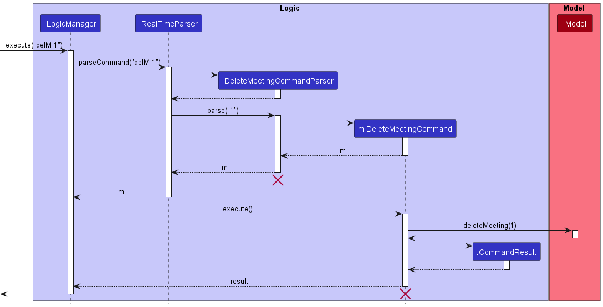
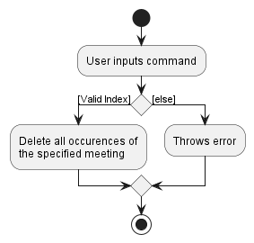
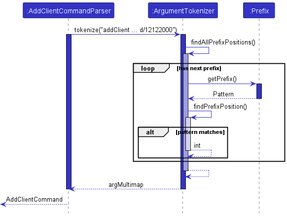

* Table of Contents
{:toc}

--------------------------------------------------------------------------------------------------------------------

## 1. Preface

### 1.1 Product description

_MyInsuRec_ is a desktop app for financial advisors. It provides financial advisors with client, meeting and product management abilities to ease their mental load. It also provides some CRM features such as the ability to look up clients with upcoming birthdays.

### 1.2 Acknowledgements

* _MyInsuRec_ is a brown-field project based on the [AB3 project template](https://github.com/se-edu/addressbook-level3) by
  [se-education.org](https://se-education.org).
  * Libraries used: [JavaFx](https://openjfx.io/), [Jackson](https://github.com/FasterXML/jackson), [JUnit5](https://junit.org/junit5/)

## 1.3 Setting up, getting started

Refer to the guide [_Setting up and getting started_](SettingUp.md).

--------------------------------------------------------------------------------------------------------------------

## 2. Design

:bulb: **Tip:** The `.puml` files used to create diagrams in this document can be found in the [diagrams](https://github.com/AY2223S1-CS2103T-W16-4/tp/tree/master/docs/diagrams) folder. Refer to the [_PlantUML Tutorial_ at se-edu/guides](https://se-education.org/guides/tutorials/plantUml.html) to learn how to create and edit diagrams.

### 2.1 Architecture

The ***Architecture Diagram*** given above explains the high-level design of the App.

Given below is a quick overview of main components and how they interact with each other.

#### 2.1.1 Main components of the architecture

**`Main`** has two classes called [`Main`](https://github.com/AY2223S1-CS2103T-W16-4/tp/blob/master/src/main/java/seedu/address/Main.java) and [`MainApp`](https://github.com/AY2223S1-CS2103T-W16-4/tp/blob/master/src/main/java/seedu/address/MainApp.java). It is responsible for,
* At app launch: Initializes the components in the correct sequence, and connects them up with each other.
* At shut down: Shuts down the components and invokes cleanup methods where necessary.

[**`Commons`**](#common-classes) represents a collection of classes used by multiple other components.

The rest of the App consists of four components.

* [**`UI`**](#ui-component): The UI of the App.
* [**`Logic`**](#logic-component): The command executor.
* [**`Model`**](#model-component): Holds the data of the App in memory.
* [**`Storage`**](#storage-component): Reads data from, and writes data to, the hard disk.

#### 2.1.2 How the architecture components interact with each other

The *Sequence Diagram* below shows how the components interact with each other for the scenario where the user issues the command `delClient i/1` ([deletes the client](https://ay2223s1-cs2103t-w16-4.github.io/tp/UserGuide.html#714-delete-client-delclient) found at index 1).

Each of the four main components (also shown in the diagram above),

* defines its *API* in an `interface` with the same name as the Component.
* implements its functionality using a concrete `{Component Name}Manager` class (which follows the corresponding API `interface` mentioned in the previous point.

For example, the `Logic` component defines its API in the `Logic.java` interface and implements its functionality using the `LogicManager.java` class which follows the `Logic` interface. Other components interact with a given component through its interface rather than the concrete class (reason: to prevent outside component's being coupled to the implementation of a component), as illustrated in the (partial) class diagram below.

The sections below give more details of each component.

### 2.2 UI component

The **API** of this component is specified in [`Ui.java`](https://github.com/AY2223S1-CS2103T-W16-4/tp/blob/master/src/main/java/seedu/address/ui/Ui.java)

The UI consists of a `MainWindow` that is made up of parts e.g.`CommandBox`, `ResultDisplay`, `ClientListPanel`, `StatusBarFooter` etc. All these, including the `MainWindow`, inherit from the abstract `UiPart` class which captures the commonalities between classes that represent parts of the visible GUI.

The `UI` component uses the JavaFx UI framework. The layout of these UI parts are defined in matching `.fxml` files that are in the `src/main/resources/view` folder. For example, the layout of the [`MainWindow`](https://github.com/AY2223S1-CS2103T-W16-4/tp/blob/master/src/main/java/seedu/address/ui/MainWindow.java) is specified in [`MainWindow.fxml`](https://github.com/AY2223S1-CS2103T-W16-4/tp/blob/master/src/main/resources/view/MainWindow.fxml)

The `UI` component,

* executes user commands using the `Logic` component.
* listens for changes to `Model` data so that the UI can be updated with the modified data.
* keeps a reference to the `Logic` component, because the `UI` relies on the `Logic` to execute commands.
* depends on some classes in the `Model` component, as it displays `Client` object residing in the `Model`.

### 2.3 Logic component

**API** : [`Logic.java`](https://github.com/AY2223S1-CS2103T-W16-4/tp/blob/master/src/main/java/seedu/address/logic/Logic.java)

Here's a (partial) class diagram of the `Logic` component:

How the `Logic` component works:
1. When `Logic` is called upon to execute a command, it uses the `MyInsuRecParser` class to parse the user command.
1. This results in a `Command` object (more precisely, an object of one of its subclasses e.g., `AddClientCommand`) which is executed by the `LogicManager`.
1. The command can communicate with the `Model` when it is executed (e.g. to add a client).
1. The result of the command execution is encapsulated as a `CommandResult` object which is returned from `Logic`.

The Sequence Diagram below illustrates the interactions within the `Logic` component for the `execute("delClient i/1")` API call.

:information_source: **Note:** The lifeline for `DeleteClientCommandParser` should end at the destroy marker (X) but due to a limitation of PlantUML, the lifeline reaches the end of diagram.

Here are the other classes in `Logic` (omitted from the class diagram above) that are used for parsing a user command:

How the parsing works:
* When called upon to parse a user command, the `MyInsuRecParser` class creates an `XYZCommandParser` (`XYZ` is a placeholder for the specific command name e.g., `AddClientCommandParser`) which uses the other classes shown above to parse the user command and create a `XYZCommand` object (e.g., `AddClientCommand`) which the `MyInsuRecParser` returns back as a `Command` object.
* All `XYZCommandParser` classes (e.g., `AddClientCommandParser`, `DeleteClientCommandParser`, ...) inherit from the `Parser` interface so that they can be treated similarly where possible e.g, during testing.

### 2.4 Model component
**API** : [`Model.java`](https://github.com/AY2223S1-CS2103T-W16-4/tp/blob/master/src/main/java/seedu/address/model/Model.java)

The `Model` component,

* stores the _MyInsuRec_ data i.e., all `Client` objects (which are contained in a `UniqueClientList` object).
* stores the currently 'selected' `Client` objects (e.g., results of a search query) as a separate _filtered_ list which is exposed to outsiders as an unmodifiable `ObservableList<Client>` that can be 'observed' e.g. the UI can be bound to this list so that the UI automatically updates when the data in the list change.
* stores a `UserPref` object that represents the user’s preferences. This is exposed to the outside as a `ReadOnlyUserPref` objects.
* does not depend on any of the other three components (as the `Model` represents data entities of the domain, they should make sense on their own without depending on other components)

### 2.5 Storage component

**API** : [`Storage.java`](https://github.com/AY2223S1-CS2103T-W16-4/tp/blob/master/src/main/java/seedu/address/storage/Storage.java)

The `Storage` component,
* can save both _MyInsuRec_ data and user preference data in json format, and read them back into corresponding objects.
* inherits from both `MyInsuRecStorage` and `UserPrefStorage`, which means it can be treated as either one (if only the functionality of only one is needed).
* depends on some classes in the `Model` component (because the `Storage` component's job is to save/retrieve objects that belong to the `Model`)

### 2.6 Common classes

Classes used by multiple components are in the `seedu.address.commons` package.

--------------------------------------------------------------------------------------------------------------------

## 3. Implementation

This section describes some noteworthy details on how certain features are implemented.

### 3.1 `Client`-related features

#### 3.1.1 Edit Client feature

Syntax: `editClient i/INDEX [n/NAME] [p/PHONE_NUMBER] [a/ADDRESS] [e/EMAIL] [b/BIRTHDAY] [pd/PRODUCT]`

Purpose: Edit a `Client` from the `UniqueClientList` in `Model`.

##### Implementation

Usage Scenario of `editClient`:

1) User inputs `editClient i/1 a/123 Street` to edit the first client in the `Model` by adding an address.

Below is a sequence diagram that illustrates the execution of `editClient i/1 a/123 Street` command and the interaction with `Model`.

### 3.2 `Meeting`-related features

#### 3.2.1 Add Meeting feature

Syntax: `addMeeting i/INDEX d/DATE t/TIME dn/DESCRIPTION`

Purpose: Adds a meeting with the given information to the internal model and storage

##### Implementation

In keeping with the command execution structure of the overall program, the command
specific classes `AddMeetingCommand` and `AddMeetingCommandParser` were added to the commands and parser packages respectively. The main parser `MyInsuRecParser` was modified
to accept the new command word, `addMeeting`.

The following sequence diagram offers a high-level overview of how
the command is executed.

##### Design Considerations

**Aspect: What the addMeeting command accepts as a reference to a client:**

- **Alternative 1 (current choice):** Accept the client's list index.
    - Pros: Each valid index is guaranteed to refer to a unique client.
    - Cons: It is less intuitive for the user compared to typing in a name.
- **Alternative 2:** Accept the client's name.
    - Pros: It is intuitive for the user to enter a name.
    - Cons: Names have to be spelt exactly as stored, otherwise the name.
      could be referencing more than one client.

**Aspect: The parameters that the AddMeetingCommand constructor should accept:**

- **Alternative 1 (current choice):** Accept the parsed command arguments separately.
    - Pros: The logic and operations on the model that are associated with
      command execution are inside the AddMeetingCommand.
    - Cons: The design of AddMeetingCommand is less intuitive.
- **Alternative 2:** Accept a completed Meeting.
    - Pros: The design of AddMeetingCommand is simpler.
    - Cons: The parser will need to have access to the model in order to
      obtain the referenced client.

#### 3.2.2 Delete Meeting Feature

Syntax: `delMeeting i/x`, where x is an index shown in the Meeting List.

Purpose: Delete a specified `Meeting` from the Meeting List in `Model`

##### Implementation

Usage Scenario of `delMeeting`:

1) User inputs `listMeeting` to view the current meetings in the `Model`'s Meeting List with their respective indexes.
2) User then inputs `delMeeting i/1` to delete the first meeting shown in `listMeeting`. This will evoke `Command#execute` in `LogicManager`.

Below is a sequence diagram that illustrates the execution of `delMeeting i/1` command and the interaction with `Model`.

Below is an activity diagram that summarises the execution of `delMeeting`.

##### Design Considerations

**Aspect: How many meetings to delete in one command**

- **Alternative Solution 1 (current choice):** Allows only one deletion
    - Pros: Easy to implement
    - Cons: Troublesome in the event where multiple meetings
- **Alternative Solution 2:** Allows multiple deletion
    - Pros: Convenient to delete multiple meetings when needed.
    - Cons: Complex to implement
- Considering that the approach taken to develop MyInsuRec is a breath first approach,
  where we should only build to the point where every iteration is a working product,
  **Solution 1** is thus chosen as it is easier to implement.

#### 3.2.3 View Meeting feature

Syntax: `viewMeeting i/INDEX`

Purpose: View details associated with a meeting, such as meeting’s date and time.

##### Implementation

Usage Scenario of `viewMeeting`:

1) User inputs `viewMeeting i/1` to view the first meeting in the `Model`.

:information_source: **Note:** If `INDEX` is larger than the current meeting list's size or `INDEX` is negative, then it will not show any meeting details. It will return an error to the user.

Below is a sequence diagram that illustrates the execution of `viewMeeting` command and the interaction with `Model`.

#### 3.2.4 List Meeting feature

Syntax: `listMeeting`

Purpose: View all `Meeting` from the Meeting List in `Model`.

##### Implementation

Usage Scenario of `listMeeting`:

1) User inputs `listMeeting` to view the current meetings in the `Model`.

Below is a sequence diagram that illustrates the execution of `listMeeting` command and the interaction with `Model`.

#### 3.2.5 Edit Meeting feature

Syntax: `editMeeting i/INDEX [d/DATE] [st/START TIME] [et/END TIME] [dn/DESCRIPTION]`

Purpose: Edit a `Meeting` from the `NoConflictMeetingList` in `Model`

##### Implementation

Usage Scenario of `editMeeting`:

1) User inputs `editMeeting i/1 d/09112023` to edit the first meeting in the `Model` by changing its date.

Every `Meeting` is uniquely identified by a UUID in storage, so essentially all fields in a `Meeting` can be edited without loss of its uniqueness.
Below is an activity diagram that summarizes how the updates are reflected in `MyInsuRec`.
`EditMeetingCommand#execute` caused the model to be updated first and then the storage.

Below is a sequence diagram that illustrates the execution of `editMeeting i/1 d/09112023` command and the interaction with `Model`.

##### Design Considerations

**Aspect: Class that triggers `Model` and `Storage` update**

- **Alternative Solution 1 (current choice):** `LogicManager#execute` causes both updates
    - Pros: Any error in updating storage or model can be identified within `execute()`.
    - Cons: Execute command performs two functions, update model and update storage, which is not ideal for separating responsibilities.
- **Alternative Solution 2:** `LogicManager` causes `Model` update which internally triggers `Storage` update
    - Pros: Removes one instance of cohesion between `Logic` and `Storage` (`Logic` can access `Storage` via `Model` only).
    - Cons: `Model` is a single point of failure in this scheme.
- `LogicManager` is responsible for coordinating both `Model` and `Storage` updates because `Model` and `Storage` should be kept as separate entities according to the architecture. **Solution 1** is thus chosen as it maintains the design pattern chosen in the architecture.

### 3.3 `Product`-related features

### 3.4 UI

#### 3.4.1 Different view panels

The GUI changes view panels depending on the last executed command. For example, a `listMeeting` will cause the meeting list view panel to be displayed, while `viewClient i/1` will cause a detailed client view panel to be displayed.

#### Implementation

Below is a sequence diagram that illustrates the execution of `listMeeting` command and the interaction with `Model`, which demonstrates how a view panel changes to `MeetingListPanel`.

#### Rationale

We chose to implement the changing of view panels through `CommandResult` due to its simplicity and the intended effects are clear. Furthermore, this is in line with how `HelpCommand` and `ExitCommand` is implemented.

#### Proposed future changes

We feel that there is a way for us to cut down on repetition of code. More specifically, the methods for setting the view panels which is currently done through four very similar methods in `MainWindow#setListPanelToXYZ`. We are currently exploring the use of event listeners on the Model, such that when a command is executed, the Model can listen for the specific view for the UI to display. This however causes the Model to have to depend on UI which results in more coupling of compartments. Another possibility is to have a general `MainWindow#setListPanelToXYZ` which takes in some input to specify which view to show. It will behave much like how `MyInsuRecParser#parseCommand` works, using switch cases to decide which panels to use.

### 3.5 Proposed Features

#### 3.5.1 Multiple possible prefixes per command

Purpose: In this proposed feature, the user is provided with  multiple possible prefixes for defining fields in a command.
For example, currently we can define a client's birthday using the `b/` prefix.
However, since a birthday is essentially a date, a user may prefer to reuse the `d/` prefix instead (see `addMeeting` command).

##### Implementation

`AddClientCommandParser` depends on multiple `Prefix` objects such as `PREFIX_BIRTHDAY`, and `PREFIX_DATE` to identify each field in an `AddClientCommand`.
Currently, `Prefix` class stores the required prefix word as a `String`.
Consider changing the prefix word to a `Pattern` which can be matched against using `Matcher` class.
For all prefixes we are looking for, we first get the matching pattern using `getPrefix()`.
Then, `findPrefixPosition()`  validates the presence of a field and also obtain the index of its first occurrence.
From then on, the `AddClientCommand` can be built as expected.

##### Design Considerations

**Aspect: How prefixes are stored:**

- **Alternative Solution 1 (current Choice):** `Prefix::getPrefix` returns a `Pattern` that `findPrefixPosition()` can match against using `Matcher` class (see diagram below).
- Pros: `Matcher` has several useful methods for validating a match.
- Case-insensitive matches can be made easily by setting a flag in the `Pattern`.
- Cons: Regex string used to define a pattern may be difficult to read. 
  - e.g. `String regexForBirthday = "[b|d|birthday|birthdate][\\\\]"` is not as clear as Alternative 2
- **Alternative Solution 2:** Store each possible prefix as a `String` in a `List` maintained by `Prefix`.
- Pros: `String` matches are easier to understand than regexes 
  - e.g. `String[] patternsForBirthday = {"b", "d", "birthday", "birthdate"}` and check for matches in this array. 
- Cons: `List` of `String` returned is cumbersome for pattern matching, i.e. Iterate through every `String` in `patternsForBirthday` to look for a match.
- **Solution 1** is chosen because: 
  - A single `Pattern` for each `Prefix` is more succinct that a `List`.
  - No need to iterate through a list of `Strings` to find a match.
  - Matches can be made using pre-existing methods in `Matcher` class (no need to rely on `String` methods)
<!-- problematic, rmb to update the header hashs after complete -->
  
--------------------------------------------------------------------------------------------------------------------

## 4. Documentation, logging, testing, configuration, dev-ops

* [Documentation guide](Documentation.md)
* [Testing guide](Testing.md)
* [Logging guide](Logging.md)
* [Configuration guide](Configuration.md)
* [DevOps guide](DevOps.md)

--------------------------------------------------------------------------------------------------------------------

## 5. Appendix: Requirements

### 5.1 Product scope

**Target user profile**:

* insurance agent
* has a need to manage a significant number of contacts
* has a need to look up client's information
* has a need to track a significant amount of meetings
* requires reminders regarding meeting schedules.
* prefer desktop apps over other types
* can type fast
* prefers typing to mouse interactions
* is reasonably comfortable using CLI apps

**Value proposition**:

* manage clients' information faster than a typical mouse/GUI driven app
* view scheduled meetings with client's details in one glance
* less effort to recall client's information, more effort to satisfy client's needs

### 5.2 User stories

Priorities: High (must have) - `* * *`, Medium (nice to have) - `* *`

| Priority | As an …         | I want to …                                                 | So that I can…                                                             | Conditions                                                             |
|----------|-----------------|-------------------------------------------------------------|-----------------------------------------------------------------------------|------------------------------------------------------------------------|
| `* * *`  | insurance agent | add client details                                          | keep track of my client's details                                           |                                                                        |
| `* * *`  | insurance agent | view all my clients                                         | see who I am providing services to                                          |                                                                        |
| `* * *`  | insurance agent | delete clients' details                                     | remove clients whom I am no longer serving                                  |                                                                        |
| `* * * ` | insurance agent | update my clients details                                   | have the latest contact details to keep in touch with my clients.           | All fields that uniquely identify a client should be uneditable        |
| `* * *`  | insurance agent | add client meetings                                         | keep track of when to meet clients                                          | Meetings with timing conflict are not allowed                          |
| `* * *`  | insurance agent | view all client meetings                                    | see when I have meetings                                                    |                                                                        |
| `* * *`  | insurance agent | see an overview of today’s client meetings                  | know what my schedule looks like for the day                                |                                                                        |
| `* * *`  | insurance agent | delete client meetings                                      | remove meetings that are canceled                                           |                                                                        |
| `* *`    | insurance agent | add and edit a list of the products a client bought         | better track which products might interest them                             | Product are created by the agent before being associated with a client |
| `* *`    | insurance agent | know which products my clients have bought                  | gauge the popularity of each product                                        | Clients can be filtered according to the product they bought           |
| `* *`    | insurance agent | see the birthdays of my clients for the upcoming week/month | send my clients a thank you/birthday gift and maintain a close relationship |                                                                        |
| `* *`    | insurance agent | set the default views in my app to light mode and dark mode |                                                                             |                                                                        |

### 5.3 Use cases

(For all use cases below, the **System** is the `MyInsuRec` and the **Actor** is the `insurance agent`, unless specified otherwise)

#### 5.3.1 Use case: UC1 - Add a client

**MSS**

1. User requests to add a client.
2. System adds the client.

   Use case ends.

**Extensions**

* 1a. User inputs incomplete client data.

    * 1a1. System shows an error message.

      Use case ends.

#### 5.3.2 Use case: UC2 - View a client

**MSS**

1. User selects client to view.
2. System displays the client information.

   Use case ends.

**Extensions**

* 1a. User selects non-existent client.

    * 1a1. System shows an error message.

      Use case ends.

#### 5.3.3 Use case: UC3 - List all clients

**MSS**

1. User requests for a list of all clients.
2. System shows a list of all clients.

   Use case ends.

#### 5.3.4 Use case: UC4 - List all meetings

**MSS**

1. User requests for a list of all meetings.
2. System shows a list of all meetings.

   Use case ends.

#### 5.3.5 Use case: UC5 - Delete a meeting

**MSS**

1. User requests for a [list of all meetings (UC4)](#use-case-uc4---list-all-meetings).
2. System shows a list of all meetings.
3. User requests to delete one meeting from the list.
4. System deletes the meeting specified by the user.
5. System informs user that the specified meeting is deleted.

   Use case ends.

**Extensions**

* 3a. User deletes a meeting that was not shown in the list.

    * 3a1. System shows an error message.

      Use case ends.

### 5.4 Non-Functional Requirements

1.  Should work on any _mainstream OS_ as long as it has Java `11` or above installed.
2.  Should be able to hold up to 1000 clients without a noticeable sluggishness in performance for typical usage.
3.  A user with above average typing speed for regular English text (i.e. not code, not system admin commands) should be able to accomplish most of the tasks faster using commands than using the mouse.
4.  Should be usable by a novice who has never used a command line interface.
5.  Common actions should require 5 or less input phrases to accomplish.
6.  UI should be intuitive and easy to understand.

### 5.5 Glossary

#### Quick Reference

- [Mainstream OS](#mainstream-os)
- [Meeting](#meeting)
- [Timing Conflict](#timing-conflict)

#### *M*

###### Mainstream OS

Windows, MacOS, Unix.

###### Meeting

An event scheduled between the user and a client at a specific date and time.

#### *T*

###### Timing Conflict

Time periods that overlap. e.g. meetings should not be happening on the same time.

--------------------------------------------------------------------------------------------------------------------

## 6. Appendix: Instructions for manual testing

Given below are instructions to test the app manually.

:information_source: **Note:** These instructions only provide a starting point for testers to work on;
testers are expected to do more *exploratory* testing.

### 6.1 Launch and shutdown

1. Initial launch

   1. Download the jar file and copy into an empty folder

   1. Double-click the jar file Expected: Shows the GUI with a set of sample contacts. The window size may not be optimum.

1. Saving window preferences

   1. Resize the window to an optimum size. Move the window to a different location. Close the window.

   1. Re-launch the app by double-clicking the jar file. 
       Expected: The most recent window size and location is retained.

1. _{ more test cases …  }_

### 6.2 Deleting a client

1. Deleting a client while all clients are being shown

   1. Prerequisites: List all clients using the `listClient` command. Multiple clients in the list.

   1. Test case: `delClient 1` 
      Expected: First contact is deleted from the list. Details of the deleted contact shown in the status message. Timestamp in the status bar is updated.

   1. Test case: `delClient 0` 
      Expected: No client is deleted. Error details shown in the status message. Status bar remains the same.

   1. Other incorrect delete commands to try: `delClient`, `delClient x`, `...` (where x is larger than the list size) 
      Expected: Similar to previous.

1. _{ more test cases …  }_

### 6.3 Saving data

1. Dealing with missing/corrupted data files

   1. _{explain how to simulate a missing/corrupted file, and the expected behavior}_

1. _{ more test cases …​ }_
