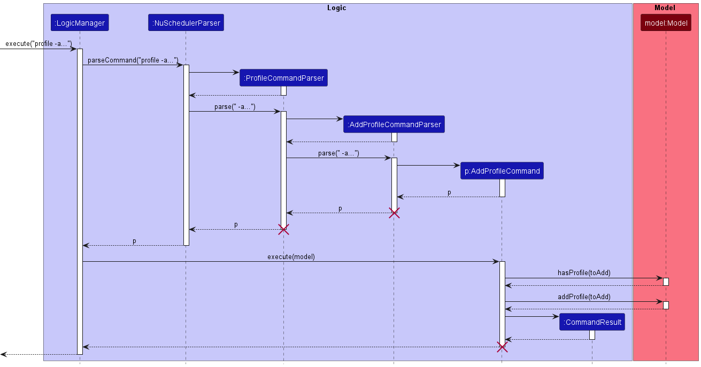
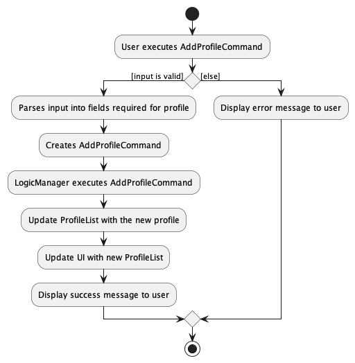
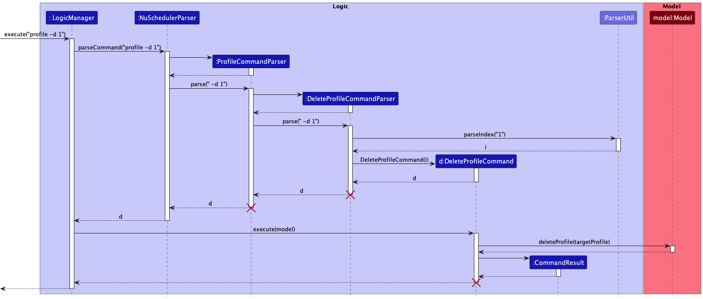
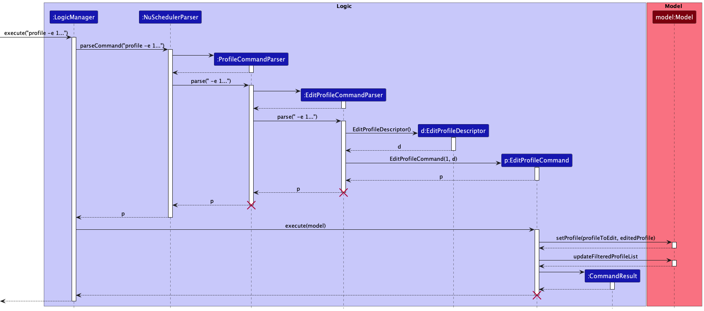
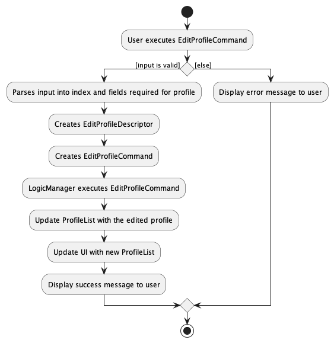
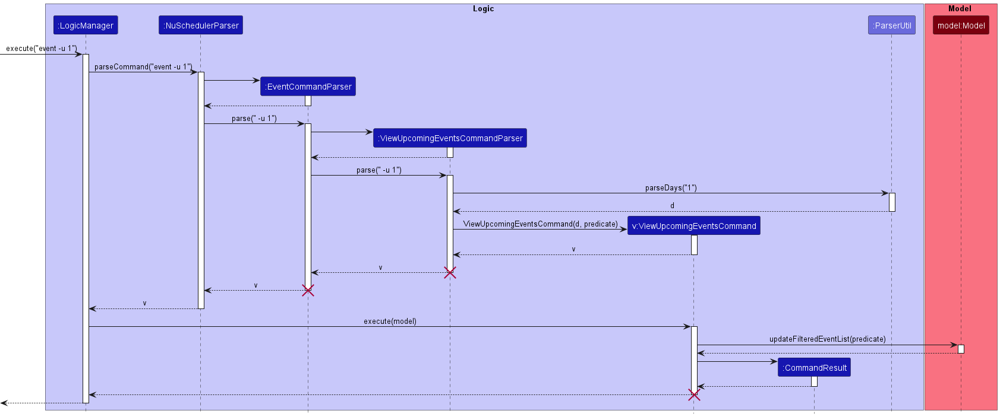
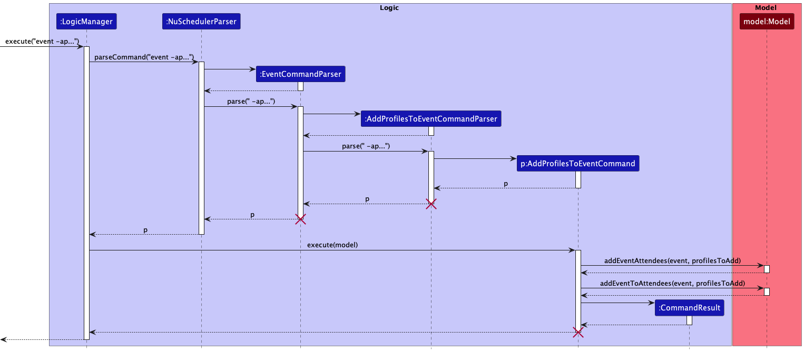

<h2 id="toc-title" class="no-num"> Table of Contents </h2>

* Table of Contents
{:toc}

--------------------------------------------------------------------------------------------------------------------

## **Acknowledgements**

* This project is built upon the existing code for [AddressBook Level-3](https://github.com/se-edu/addressbook-level3).
* The following are sources of code we have reused or adapted in our project:
  * [Regex for telegram usernames](https://github.com/AY2122S2-CS2103T-W09-1/tp/blob/master/src/main/java/seedu/address/model/person/Telegram.java)

--------------------------------------------------------------------------------------------------------------------

## **Setting up, getting started**

Refer to the guide [_Setting up and getting started_](SettingUp.md).

--------------------------------------------------------------------------------------------------------------------

## **Design**

:bulb: **Tip:** The `.puml` files used to create diagrams in this document can be found in the [diagrams](https://github.com/se-edu/addressbook-level3/tree/master/docs/diagrams/) folder. Refer to the [_PlantUML Tutorial_ at se-edu/guides](https://se-education.org/guides/tutorials/plantUml.html) to learn how to create and edit diagrams.

### Architecture

The ***Architecture Diagram*** given above explains the high-level design of the App.

Given below is a quick overview of main components and how they interact with each other.

**Main components of the architecture**

**`Main`** has two classes called [`Main`](https://github.com/se-edu/addressbook-level3/tree/master/src/main/java/seedu/address/Main.java) and [`MainApp`](https://github.com/se-edu/addressbook-level3/tree/master/src/main/java/seedu/address/MainApp.java). It is responsible for,
* At app launch: Initializes the components in the correct sequence, and connects them up with each other.
* At shut down: Shuts down the components and invokes cleanup methods where necessary.

[**`Commons`**](#common-classes) represents a collection of classes used by multiple other components.

The rest of the App consists of four components.

* [**`UI`**](#ui-component): The UI of the App.
* [**`Logic`**](#logic-component): The command executor.
* [**`Model`**](#model-component): Holds the data of the App in memory.
* [**`Storage`**](#storage-component): Reads data from, and writes data to, the hard disk.

**How the architecture components interact with each other**

The *Sequence Diagram* below shows how the components interact with each other for the scenario where the user issues the command `profile -d 1`.

Each of the four main components (also shown in the diagram above),

* defines its *API* in an `interface` with the same name as the Component.
* implements its functionality using a concrete `{Component Name}Manager` class (which follows the corresponding API `interface` mentioned in the previous point.

For example, the `Logic` component defines its API in the `Logic.java` interface and implements its functionality using the `LogicManager.java` class which follows the `Logic` interface. Other components interact with a given component through its interface rather than the concrete class (reason: to prevent outside component's being coupled to the implementation of a component), as illustrated in the (partial) class diagram below.

The sections below give more details of each component.

### UI component

The **API** of this component is specified in [`Ui.java`](https://github.com/se-edu/addressbook-level3/tree/master/src/main/java/seedu/address/ui/Ui.java)

The UI consists of a `MainWindow` that is made up of parts e.g.`CommandBox`, `ResultDisplay`, `ProfileListPanel`, `EventListPanel`, `StatusBarFooter` etc. All these, including the `MainWindow`, inherit from the abstract `UiPart` class which captures the commonalities between classes that represent parts of the visible GUI.

The `UI` component uses the JavaFx UI framework. The layout of these UI parts are defined in matching `.fxml` files that are in the `src/main/resources/view` folder. For example, the layout of the [`MainWindow`](https://github.com/se-edu/addressbook-level3/tree/master/src/main/java/seedu/address/ui/MainWindow.java) is specified in [`MainWindow.fxml`](https://github.com/se-edu/addressbook-level3/tree/master/src/main/resources/view/MainWindow.fxml)

The `UI` component,

* executes user commands using the `Logic` component.
* listens for changes to `Model` data so that the UI can be updated with the modified data.
* keeps a reference to the `Logic` component, because the `UI` relies on the `Logic` to execute commands.
* depends on some classes in the `Model` component, as it displays `Profile` object residing in the `Model`.

### Logic component

**API** : [`Logic.java`](https://github.com/se-edu/addressbook-level3/tree/master/src/main/java/seedu/address/logic/Logic.java)

Here's a (partial) class diagram of the `Logic` component:

How the `Logic` component works:
1. When `Logic` is called upon to execute a command, it uses the `NuSchedulerParser` class to parse the user command.
1. This results in a `Command` object (more precisely, an object of one of its subclasses e.g., `AddProfileCommand`) which is executed by the `LogicManager`.
1. The command can communicate with the `Model` when it is executed (e.g. to add a profile).
1. The result of the command execution is encapsulated as a `CommandResult` object which is returned from `Logic`.

The Sequence Diagram below illustrates the interactions within the `Logic` component for the `execute("profile -d 1")` API call.

Here are the other classes in `Logic` (omitted from the class diagram above) that are used for parsing a user command:

How the parsing works:
* When called upon to parse a user command, the `NuSchedulerParser` class creates an `XCommandParser` (`X` is a placeholder for the command type e.g., `ProfileCommandParser`, `EventCommandParser`) for `Profile` and `Event` commands.
* A `YCommandParser` (`Y` is a placeholder for general command names e.g., `ClearCommandParser`, `ExitCommandParser`) is created instead for other commands.
* For `Event` and `Profile` commands,  `ProfileCommandParser` and `EventCommandParser` will create the respective `ZXCommandParser` (`Z` is a placeholder for the command name of command type `X` e.g., `AddProfileCommandParser`) to parse the user command. After parsing the user command, a `ZXCommand` (e.g., `AddProfileCommand`) object is created which is then returned by `NuSchedulerParser` as a `Command` object.
* For other general commands, `YCommandParser` creates `YCommand` (e.g., `ClearCommand`, `ExitCommand`) which is returned by `NuSchedulerParser` as a `Command` object.
* All `XCommandParser`, `YCommandParser` and `ZXCommandParser` classes implements the `Parser` interface so that they can be treated similarly where possible e.g, during testing.

### Model component
**API** : [`Model.java`](https://github.com/se-edu/addressbook-level3/tree/master/src/main/java/seedu/address/model/Model.java)

Both `Event` and `Profile` data are handled by the `Model` component. Since the implementation for both objects are similar, we will only describe `Profile` objects below.

The `Model` component,
* stores the NuScheduler data i.e., all `Profile` objects (which are contained in a `UniqueProfileList` object).
* stores the currently 'selected' `Profile` objects (e.g., results of a search query) as a separate _filtered_ list which is exposed to outsiders as an unmodifiable `ObservableList<Profile>` that can be 'observed' e.g. the UI can be bound to this list so that the UI automatically updates when the data in the list change.
* stores a `UserPref` object that represents the user’s preferences. This is exposed to the outside as a `ReadOnlyUserPref` objects.
* does not depend on any of the other three components (as the `Model` represents data entities of the domain, they should make sense on their own without depending on other components)

:information_source: **Note:** An alternative (arguably, a more OOP) model is given below (`Event` is ommitted for simplification). It has a `Tag` list in the `NuScheduler`, which `Profile` references. This allows `NuScheduler` to only require one `Tag` object per unique tag, instead of each `Profile` needing their own `Tag` objects. 

### Storage component

**API** : [`Storage.java`](https://github.com/se-edu/addressbook-level3/tree/master/src/main/java/seedu/address/storage/Storage.java)

The `Storage` component,
* can save both NuScheduler data and user preference data in json format, and read them back into corresponding objects.
* inherits from both `NuSchedulerStorage` and `UserPrefStorage`, which means it can be treated as either one (if only the functionality of only one is needed).
* depends on some classes in the `Model` component (because the `Storage` component's job is to save/retrieve objects that belong to the `Model`)

### Common classes

Classes used by multiple components are in the `seedu.addressbook.commons` package.

--------------------------------------------------------------------------------------------------------------------

## **Implementation**

This section describes some noteworthy details on how certain features are implemented.

### Add Command

#### Description

In this section, we will describe how our add commands are implemented. In NUScheduler, there are two variants of add commands, namely the `AddProfileCommand` and the `AddEventCommand`. `AddProfileCommand` is used to add a new `Profile`, whereas `AddEventCommand` is used to add a new `Event`.

Since both `AddProfileCommand` and `AddEventCommand` are implemented in a similar manner, we will be using the `AddProfileCommand` to illustrate the implementation of add commands.

The `AddProfileCommand` extends the `ProfileCommand` abstract class. `ProfileCommand` is an abstract class which extends the `Command` class. `AddProfileCommand` overrides the `Command#execute` method, to add new profiles when called.

#### Implementation

1. When the user inputs a command to add a profile, the input is passed to `LogicManager` to be executed.
2. `LogicManager` will call `NuSchedulerParser#parseCommand`, which will create a new `ProfileCommandParser`.
3. The method `ProfileCommandParser#parse` is then called, and return a new `AddProfileCommandParser`.
4. The method `AddProfileCommandParser#parse` will then return a new `AddProfileCommand`, if the user has entered the correct inputs.
5. The `LogicManager` will call `Command#execute` method of the `AddProfileCommand`, which will then create a new `Profile` using the `Model#addProfile` method.
6. When the command completes successfully, a `CommandResult` object is returned to the `LogicManager`, which will then display a success message to the user.

The following sequence diagram shows how the `AddProfileCommand` works.

The following activity diagram shows the process when a user calls the `AddProfileCommand`.

#### Design Considerations

- **Alternative 1 (Current Design)**: Separate the `AddProfileCommand` and the `AddEventCommand` as separate classes.
    - Pros: More flexibility in the parsing and order of the commands.
    - Cons: Additional classes are implemented, and thus higher complexity.
- **Alternative 2**: Have one single `AddCommand` class.
    - Pros: Less classes to implement.
    - Cons: Prevents us from using separate command words for adding profiles and adding events.

### Delete Command

#### Description

In this section, we will describe how our delete commands are implemented. In NUScheduler, there are two variants of delete commands, namely the `DeleteProfileCommand` and the `DeleteEventCommand`. `DeleteProfileCommand` is used to  delete `Profile`s, whereas `DeleteEventCommand` is used to delete `Event`s.

Since both `DeleteProfileCommand` and `DeleteEventCommand` are implemented in a similar manner, we will be using the `DeleteProfileCommand` to illustrate the implementation of delete commands.

The `DeleteProfileCommand` extends the `ProfileCommand` abstract class. `ProfileCommand` is an abstract class which extends the `Command` class. `DeleteProfileCommand` overrides the `Command#execute` method, to delete the specified profile when called.

#### Implementation

1. When the user inputs a command to delete a profile, the input is passed to `LogicManager` to be executed.
2. `LogicManager` will call `NuSchedulerParser#parseCommand`, which will create a new `ProfileCommandParser`.
3. The method `ProfileCommandParser#parse` is then called, and returns a new `DeleteProfileCommandParser`.
4. The method `DeleteProfileCommandParser#parse` will then return a new `DeleteProfileCommand`, if the user has entered the correct inputs.
5. The `LogicManager` will call `Command#execute` method of the `DeleteProfileCommand`, which will then delete the `Profile` at the specified index, using the `Model#deleteProfile` method.
6. When the command completes successfully, a `CommandResult` object is returned to the `LogicManager`, which will then display a success message to the user.

The following sequence diagram shows how the `DeleteProfileCommand` works.

The following activity diagram shows the process when a user calls the `DeleteProfileCommand`.

#### Design Considerations

The design considerations for the delete commands and the add commands are largely similar, please refer to the [Design Considerations](#design-considerations) for the add commands for more details.

### Edit Command

#### Description

In this section, we will describe how our edit commands are implemented. In NUScheduler, there are two variants of edit commands, namely the `EditProfileCommand` and the `EditEventCommand`. `EditProfileCommand` is used to edit details of existing `Profile`s, whereas `EditEventCommand` is used to edit details of existing `Event`s.

Since both `EditProfileCommand` and `EditEventCommand` are implemented in a similar manner, we will be using the `EditProfileCommand` to illustrate the implementation of edit commands.

The `EditProfileCommand` extends the `ProfileCommand` abstract class. `ProfileCommand` is an abstract class which extends the `Command` class. `EditProfileCommand` overrides the `Command#execute` method, to edit existing profiles when called.

#### Implementation

1. When the user inputs a command to edit a profile, the input is passed to `LogicManager` to be executed.
2. `LogicManager` will call `NuSchedulerParser#parseCommand`, which will create a new `ProfileCommandParser`.
3. The method `ProfileCommandParser#parse` is then called, and return a new `EditProfileCommandParser`.
4. The method `EditProfileCommandParser#parse` will then return a new `EditProfileCommand`, if the user has entered the correct inputs.
5. The `LogicManager` will call `Command#execute` method of the `EditProfileCommand`, which will then update the `Profile` with the new details, using the `Model#setProfile` method.
6. When the command completes successfully, a `CommandResult` object is returned to the `LogicManager`, which will then display a success message to the user.

The following sequence diagram shows how the `EditProfileCommand` works.

The following activity diagram shows the process when a user calls the `EditProfileCommand`.

#### Design Considerations

The design considerations for the edit commands and the add commands are largely similar, please refer to the [Design Considerations](#design-considerations) for the add commands for more details.

### View Command

#### Description

In this section, we will describe how our view commands are implemented. In NUScheduler, there are two variants of view commands, namely the `ViewProfileCommand` and the `ViewEventCommand`. `ViewProfileCommand` is used to view a list of `Profile`s, whereas `ViewEventCommand` is used to view a list of `Event`s.

Since both `ViewProfileCommand` and `ViewEventCommand` are implemented in a similar manner, we will be using the `ViewProfileCommand` to illustrate the implementation of view commands.

The `ViewProfileCommand` extends the `ProfileCommand` abstract class. `ProfileCommand` is an abstract class which extends the `Command` class. `ViewProfileCommand` overrides the `Command#execute` method, to view existing profiles when called.

#### Implementation

1. After the user command is parsed by `NuSchedulerParser`, a `Command` object (more precisely, a `ViewCommand` object) will be returned to the `LogicManager`.
2. The `LogicManager` will then call `Command#execute` of the `ViewCommand`, passing the `Model` object as parameter.
3. During the execution of the `ViewCommand`, `Model#updateFilteredProfileList` will be called. The method takes in a `Predicate`, in this case the `Predicate` returns `true` for all inputs. This is to allow all `Profile`s to be listed.
4. `Model#updateFilteredProfileList` method will then update the `FilteredList` to contain all `Profile`s, which will then be reflected on the terminal.
5. At the end of method, a `CommandResult` object will be returned which will be used to indicate a successful execution of the command in the display.

The following sequence diagram shows what happens when `ViewCommand` gets executed.

The following activity diagram summarizes what happens when a user executes a view command.

### View Upcoming Events Command

#### Description

In this section, we will describe how view upcoming events command is implemented.

The `ViewUpcomingEventsCommand` class extends the `EventCommand` abstract class. `EventCommand` extends the abstract `Command` class. `ViewUpcomingEventsCommand` overrides the `Command#execute` method, to display upcoming event commands when called.

#### Implementation

1. When the user inputs a command to view upcoming events, `LogicManager` will call `NuSchedulerParser#parseCommand`, which will create a new `ViewUpcomingEventsCommandParser`.
2. The method `ViewUpcomingEventsCommandParser#parse` is then called. It calls `ParserUtil#parseDays`which returns the days input as an integer.
3. Days input will be used to create a new `StartDateWithinTimeFramePredicate`.
4. Using the days integer and the predicate, `ViewUpcomingEventsCommandParser` creates `ViewUpcomingEventsCommand` which gets returned to `LogicManager`.
5. The `LogicManager` will call `Command#execute` method of the `ViewUpcomingEventsCommand`, which will then call `Model#updateFilteredEventList` to display the desired events.
6. When the command completes successfully, a `CommandResult` object is returned to the `LogicManager`, which will then display a success message to the user.

The following sequence diagram shows what happens when `ViewUpcomingEventsCommand` gets executed.

The following activity diagram summarizes what happens when a user executes a view upcoming events command.

### AddProfilesToEventCommand

#### Description

In this section, we will describe how the `AddProfilesToEventCommand` is implemented. `AddAttendeesCommand` is used to add existing `Profile`s to an `Event` as attendees.

The `AddProfilesToEventCommand` class extends the `EventCommand` abstract class. `EventCommand` is an abstract class which extends the `Command` class. `AddProfilesToEventCommand` overrides the `Command#execute` method to add new attendees to an event when called.

#### Proposed implementation

Similar to other commands, the user input to add attendees is passed to `LogicManager` to be executed. The following details the key difference in the methods that is invoked when the `AddProfilesToEventCommand#execute()` method is called:

* `Model#addEventAttendees()` - Adds the specified `Profile`s to the `Attendees` attribute of the `Event`.

Given below is an example usage scenario on how `AddProfilesToEventCommand` can be used and how it works.

Step 1. The user clears all the data in the application with the `ClearCommand`and then enters the following commands:

* `profile -a n/John ...` - adds a `Profile` with the name "John"
* `event -a n/Consultation ...` - adds an `Event` with the title "Consultation"

Step 2. The user executes `event -ap 1 n/1` to add the `Profile` John of `Index` 1 to the `Attendees` attribute under the `Event` Consultation of `Index` 1.

:information_source: **Note:** Multiple profiles can be added at once. If one or more of the specified profiles has already been added to the event as an attendee, the command will still execute successfully. However, if any of the specified indexes are out of bounds, an error is returned to the user.

The following sequence diagram illustrates how the operation works.

#### Design Considerations

* **Alternative 1 (Current Design)**: Separate `AddProfilesToEventCommand` from `AddEventCommand` and `EditEventCommand`.
  * Pros: Greater convenience.
  * Cons: Harder to implement.
* **Alternative 2**: Include the addition of attendees under `AddEventCommand` and any changes to the list of attendees under `EditEventCommand`.
  * Pros: Easier to implement.
  * Cons: Very inconvenient especially when an `Event` already has many attendees.

Alternative 1 was largely chosen due to the current implementation of the edit commands. Upon calling the edit command to change a specified attribute, the entire attribute will be overwritten with the new details.

Consider an `Event` with the `Tag`s [school] and [tutorial]. If the user wishes to add another `Tag`, they would have to specify the existing two `Tag`s along with the new `Tag`. This would be similar for attendees if **alternative 2** were chosen. Considering that an `Event` can have a lot more attendees than `Tag`s, **alternative 2** will be extremely inconvenient. To add to a long list of attendees, a user will have to specify the entire list of `Profile` indexes correctly to ensure that no existing `Profile`s are accidentally removed.

Therefore, **alternative 1** is chosen as the design as the user would only have to specify one `Profile` to add.

--------------------------------------------------------------------------------------------------------------------

## **Documentation, logging, testing, configuration, dev-ops**

* [Documentation guide](Documentation.md)
* [Testing guide](Testing.md)
* [Logging guide](Logging.md)
* [Configuration guide](Configuration.md)
* [DevOps guide](DevOps.md)

--------------------------------------------------------------------------------------------------------------------

## **Appendix: Requirements**

### Product scope

**Target user profile**:

* NUS students
* has a need to regularly keep in touch with a large and diverse network of connections
* prefer desktop apps over other types
* can type fast
* prefers typing to mouse interactions
* is reasonably comfortable using CLI apps

**Value proposition**: help the end user keep track of various connections, view schedules based on various filters, and enable users to filter and search connections based on connection types

### User stories

Priorities: High (must have) - `* * *`, Medium (nice to have) - `* *`, Low (unlikely to have) - `*`

| Priority | As a …​                          | I want to …​                                               | So that I can…​                                               |
|----------|----------------------------------|------------------------------------------------------------|---------------------------------------------------------------|
| `* * *`  | potential user exploring the app | see a list of features                                     | learn how to use the app                                      |
| `* * *`  | potential user exploring the app | test out the features with the sample data provided        | familiarise with the app's features before deciding to use it |
| `* * *`  | user ready to use the app        | reset the app's data                                       | tailor the data to my own needs and add my own data           |
| `* * *`  | new user                         | view how to use the app at any time                        | be reminded of the commands if I forget them                  |
| `* * *`  | user                             | add new profiles                                           |                                                               |
| `* * *`  | user                             | remove profiles that I am no longer in contact with        | focus on the relevant profiles                                |
| `* * *`  | user                             | view all the profiles I've added at one glance             | check the connections I have added                            |
| `* * *`  | user                             | find individual profiles                                   | access their contact information                              |
| `* * *`  | user                             | create an event with a name, timing, and relevant profiles |                                                               |
| `* * *`  | user                             | remove past events                                         |                                                               |
| `* * *`  | user                             | view individual events                                     | know its timing and who is involved                           |
| `* *`    | user                             | view upcoming events                                       | plan my schedule for the near future                          |

### Use cases

(For all use cases below, the **System** is the `NUScheduler` and the **Actor** is the `user`, unless specified otherwise)

**Use case: UC01 - View all profiles**

**MSS**

1.  User requests to view all profiles.
2.  NUScheduler shows a list of profiles.

    Use case ends.

**Extensions**

* 2a. The list is empty.

  Use case ends.

**Use case: UC02 - Delete a profile**

**MSS**

1. User requests to <u>view all profiles (UC01)</u>.
2. User requests to delete a specific profile in the list.
3. NUScheduler deletes the Profile.

    Use case ends.

**Extensions**

* 2a. The given index is invalid.

    * 2a1. NUScheduler shows an error message.

      Use case resumes from step 2.

**Use case: UC03 - Add an event**

**MSS**

1. User requests to add an event to the schedule.
2. NUScheduler adds the event and displays the updated schedule of events.

   Use case ends.

**Extensions**

* 1a. The Title, starting date or the ending date is not provided.

    * 1a1. NUScheduler reminds user of the correct format to add an event.

      Use case ends.

**Use case: UC04 - View upcoming events**

**MSS**

1. User requests to view all upcoming events within the next specified days.
2. NUScheduler displays the filtered list of matching events.

**Extensions**

* 1a. The given time period is invalid.

    * 1a1. NUScheduler shows an error message.

      Use case ends.

* 2a. There are no events in the next specified days.

  Use case ends.

**Use case: UC05 - Add attendees to event**

**MSS**

1. User requests to add a profile to the event.
2. NUScheduler adds the profile to the event and displays the updated event attendees.

**Extensions**

* 1a. The given event to add profile to is invalid.

    * 1a1. NUScheduler shows an error message.

      Use case ends.

* 1b. The given profile to add is invalid
    * 1b1. NUScheduler shows an error message.

      Use case ends.

### Non-Functional Requirements

1. Should work on any _mainstream OS_ as long as it has Java `11` or above installed.
2. Should be able to hold up to 1000 profiles without a noticeable sluggishness in performance for typical usage.
3. Should be able to hold up to 1000 events without a noticeable sluggishness in performance for typical usage.
4. A user with above average typing speed for regular English text (i.e. not code, not system admin commands) should be able to accomplish most of the tasks faster using commands than using the mouse.
5. Response to any commands should be displayed within 5 seconds.
6. A user's individual schedule should not be accessible to other users.
7. The _GUI_ should display data logic warnings when commands are entered with incomplete fields.
8. The _GUI_ should be at least 1280 by 720 pixels to clearly display all information.

### Glossary

* **Mainstream OS**: Windows, Linux, Unix, OS-X
* **GUI**: Graphical User Interface, a visual display that users can interact with
* **NUS**: National University of Singapore, tertiary education institute
* **End user**: _NUS_ students who use NUScheduler to handle their schedules
* **Contact details**: Contains information such as Phone number and Email, allowing the _end user_ to communicate with other users
* **Profile**: Contains user information such as their Name and _contact details_
* **Connections**: _Profiles_ who the _end user_ is connected to and requires meeting with
* **Event**: A planned meeting containing the Name, Start timing and End timing of the meeting. Also contains _profiles_ of users participating in the meeting

--------------------------------------------------------------------------------------------------------------------

## **Appendix: Instructions for manual testing**

Given below are instructions to test the app manually.

:information_source: **Note:** These instructions only provide a starting point for testers to work on;
testers are expected to do more *exploratory* testing.

### Launch and shutdown

1. Initial launch

   1. Download the jar file and copy into an empty folder

   1. Double-click the jar file Expected: Shows the GUI with a set of sample profiles and events.

1. Saving window preferences

   1. Resize the window to an optimum size. Move the window to a different location. Close the window.

   1. Re-launch the app by double-clicking the jar file. 
       Expected: The most recent window size and location is retained.

### Deleting a Profile

1. Deleting a Profile while all Profiles are being shown

   1. Prerequisites: List all Profiles using the `profile -v` command. Multiple Profiles in the list.

   2. Test case: `profile -d 1` 
      Expected: First profile is deleted from the list. Details of the deleted profile shown in the status message. If first profile is attending any events, the profile will be removed from the event as well.

   4. Test case: `profile - d 0` 
      Expected: No Profile is deleted. Error details shown in the status message. Status bar remains the same.

   5. Other incorrect delete commands to try: `profile -d`, `profile -d x`, `...` (where x is larger than the list size) 
      Expected: Similar to previous.

### Saving data

1. Dealing with missing/corrupted data files

   1. Open `data/nuscheduler.json` in the directory where NUScheduler is downloaded.
   2. Edit any email to a non-NUS email.
   3. Relaunch `NUScheduler.jar`.
   4. Expected: Data is invalid thus NUScheduler starts with an empty data file.
