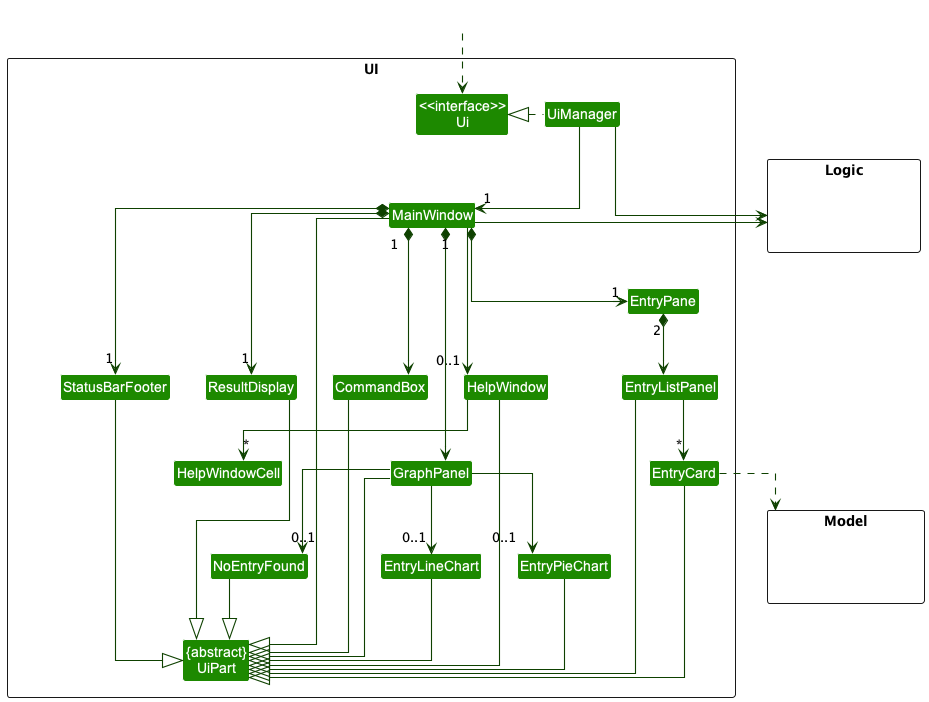
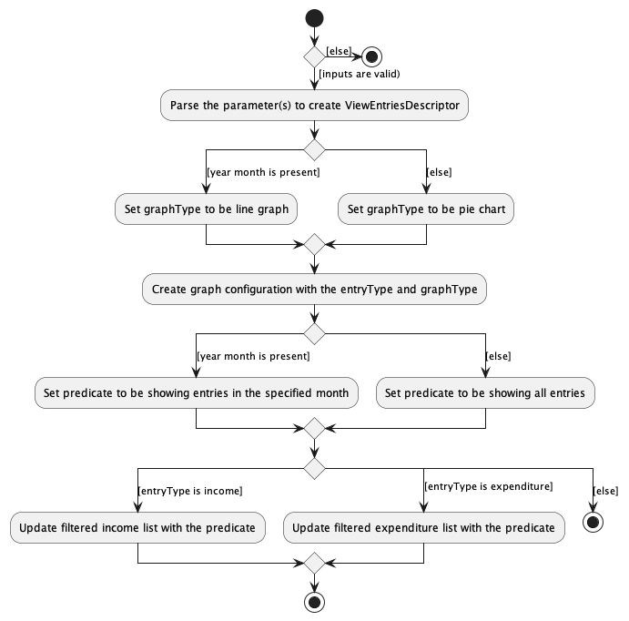

* Table of Contents
<!-- TOC -->
  * [**Acknowledgements**](#acknowledgements)
  * [**Setting up, getting started**](#setting-up-getting-started)
  * [**Design**](#design)
    * [Architecture](#architecture)
    * [UI component](#ui-component)
    * [Logic component](#logic-component)
    * [Model component](#model-component)
    * [Storage component](#storage-component)
    * [Common classes](#common-classes)
  * [**Implementation**](#implementation)
    * [Summarise Entries](#summarise-entries)
      * [Design considerations:](#design-considerations)
    * [Add Entry](#add-entry)
      * [Design Considerations](#design-considerations)
    * [Edit Entry](#edit-entry)
    * [\[Proposed\] Undo/redo feature](#proposed-undoredo-feature)
      * [Proposed Implementation](#proposed-implementation)
      * [Design considerations:](#design-considerations)
    * [\[Proposed\] Data archiving](#proposed-data-archiving)
    * [[Proposed\] Pie Chart View feature](#proposed-pie-chart-view-feature)
      * [Implementation](#implementation)
  * [**Documentation, logging, testing, configuration, dev-ops**](#documentation-logging-testing-configuration-dev-ops)
  * [**Appendix: Requirements**](#appendix-requirements)
    * [Product scope](#product-scope)
    * [User stories](#user-stories)
    * [Use cases](#use-cases)
    * [Non-Functional Requirements](#non-functional-requirements)
    * [Glossary](#glossary)
  * [**Appendix: Instructions for manual testing**](#appendix-instructions-for-manual-testing)
    * [Launch and shutdown](#launch-and-shutdown)
    * [Adding an entry](#adding-an-entry)
    * [Deleting an entry](#deleting-an-entry)
    * [Editing an entry](#editing-an-entry)
    * [View PieChart](#view-piechart)
    * [Summary statistics](#summary-statistics)
    * [Saving data](#saving-data)
<!-- TOC -->

--------------------------------------------------------------------------------------------------------------------

## **Acknowledgements**

* {list here sources of all reused/adapted ideas, code, documentation, and third-party libraries -- include links to the
  original source as well}

--------------------------------------------------------------------------------------------------------------------

## **Setting up, getting started**

Refer to the guide [_Setting up and getting started_](SettingUp.md).

--------------------------------------------------------------------------------------------------------------------

## **Design**

:bulb: **Tip:** The `.puml` files used to create diagrams in this document can be found in
the [diagrams](https://github.com/se-edu/addressbook-level3/tree/master/docs/diagrams/) folder. Refer to the [_PlantUML
Tutorial_ at se-edu/guides](https://se-education.org/guides/tutorials/plantUml.html) to learn how to create and edit
diagrams.

### Architecture

The ***Architecture Diagram*** given above explains the high-level design of the App.

Given below is a quick overview of main components and how they interact with each other.

**Main components of the architecture**

**`Main`** has two classes
called [`Main`](https://github.com/se-edu/addressbook-level3/tree/master/src/main/java/seedu/address/Main.java)
and [`MainApp`](https://github.com/se-edu/addressbook-level3/tree/master/src/main/java/seedu/address/MainApp.java). It
is responsible for,

* At app launch: Initializes the components in the correct sequence, and connects them up with each other.
* At shut down: Shuts down the components and invokes cleanup methods where necessary.

[**`Commons`**](#common-classes) represents a collection of classes used by multiple other components.

The rest of the App consists of four components.

* [**`UI`**](#ui-component): The UI of the App.
* [**`Logic`**](#logic-component): The command executor.
* [**`Model`**](#model-component): Holds the data of the App in memory.
* [**`Storage`**](#storage-component): Reads data from, and writes data to, the hard disk.

**How the architecture components interact with each other**

The *Sequence Diagram* below shows how the components interact with each other for the scenario where the user issues
the command `delete 1 t/e`.

Each of the four main components (also shown in the diagram above),

* defines its *API* in an `interface` with the same name as the Component.
* implements its functionality using a concrete `{Component Name}Manager` class (which follows the corresponding
  API `interface` mentioned in the previous point.

For example, the `Logic` component defines its API in the `Logic.java` interface and implements its functionality using
the `LogicManager.java` class which follows the `Logic` interface. Other components interact with a given component
through its interface rather than the concrete class (reason: to prevent outside component's being coupled to the
implementation of a component), as illustrated in the (partial) class diagram below.

The sections below give more details of each component.

### UI component

The **API** of this component is specified
in [`Ui.java`](https://github.com/se-edu/addressbook-level3/tree/master/src/main/java/seedu/address/ui/Ui.java)

The UI consists of a `MainWindow` that is made up of parts e.g.`CommandBox`, `ResultDisplay`, `EntryPane`
, `StatusBarFooter` etc. All these, including the `MainWindow`, inherit from the abstract `UiPart` class which captures
the commonalities between classes that represent parts of the visible GUI.

The `UI` component uses the JavaFx UI framework. The layout of these UI parts are defined in matching `.fxml` files that
are in the `src/main/resources/view` folder. For example, the layout of
the [`MainWindow`](https://github.com/se-edu/addressbook-level3/tree/master/src/main/java/seedu/address/ui/MainWindow.java)
is specified
in [`MainWindow.fxml`](https://github.com/se-edu/addressbook-level3/tree/master/src/main/resources/view/MainWindow.fxml)

The `UI` component,

* executes user commands using the `Logic` component.
* listens for changes to `Model` data so that the UI can be updated with the modified data.
* keeps a reference to the `Logic` component, because the `UI` relies on the `Logic` to execute commands.
* depends on some classes in the `Model` component, as it displays `Entry` object residing in the `Model`.

### Logic component

**API** : [`Logic.java`](https://github.com/se-edu/addressbook-level3/tree/master/src/main/java/seedu/address/logic/Logic.java)

Here's a (partial) class diagram of the `Logic` component:

How the `Logic` component works:

1. When `Logic` is called upon to execute a command, it uses the `PennyWiseParser` class to parse the user command.
1. This results in a `Command` object (more precisely, an object of one of its subclasses e.g., `AddCommand`) which is
   executed by the `LogicManager`.
1. The command can communicate with the `Model` when it is executed (e.g. to add a entry).
1. The result of the command execution is encapsulated as a `CommandResult` object which is returned back from `Logic`.

The Sequence Diagram below illustrates the interactions within the `Logic` component for the `execute("delete 1")` API
call.

:information_source: **Note:** The lifeline for `DeleteCommandParser` should end at the destroy marker (X) but due to a limitation of PlantUML, the lifeline reaches the end of diagram.

Here are the other classes in `Logic` (omitted from the class diagram above) that are used for parsing a user command:

How the parsing works:

* When called upon to parse a user command, the `PennyWiseParser` class creates an `XYZCommandParser` (`XYZ` is a
  placeholder for the specific command name e.g., `AddCommandParser`) which uses the other classes shown above to parse
  the user command and create a `XYZCommand` object (e.g., `AddCommand`) which the `PennyWiseParser` returns back as
  a `Command` object.
* All `XYZCommandParser` classes (e.g., `AddCommandParser`, `DeleteCommandParser`, ...) inherit from the `Parser`
  interface so that they can be treated similarly where possible e.g, during testing.

### Model component

**API** : [`Model.java`](https://github.com/se-edu/addressbook-level3/tree/master/src/main/java/seedu/address/model/Model.java)

The `Model` component,

* stores the application data i.e., all `Entry` objects (which are contained in a `UniqueEntryList` object).
* stores the currently 'selected' `Entry` objects (e.g., results of a search query) as a separate _filtered_ list which
  is exposed to outsiders as an unmodifiable `ObservableList<Entry>` that can be 'observed' e.g. the UI can be bound to
  this list so that the UI automatically updates when the data in the list change.
* stores a `UserPref` object that represents the user’s preferences. This is exposed to the outside as
  a `ReadOnlyUserPref` objects.
* does not depend on any of the other three components (as the `Model` represents data entities of the domain, they
  should make sense on their own without depending on other components)

### Storage component

**API** : [`Storage.java`](https://github.com/se-edu/addressbook-level3/tree/master/src/main/java/seedu/address/storage/Storage.java)

The `Storage` component,

* can save both application data and user preference data in json format, and read them back into corresponding
  objects.
* inherits from both `PennyWiseStorage` and `UserPrefStorage`, which means it can be treated as either one (if only
  the functionality of only one is needed).
* depends on some classes in the `Model` component (because the `Storage` component's job is to save/retrieve objects
  that belong to the `Model`)

### Common classes

Classes used by multiple components are in the `seedu.addressbook.commons` package.

--------------------------------------------------------------------------------------------------------------------

## **Implementation**

This section describes some noteworthy details on how certain features are implemented.

### Summarise Entries

The `summary` command is implemented by the `SummaryCommandParser` and `SummaryCommand` classes

`SummaryCommandParser` class is responsible for parsing the parameter received from the user

`SummaryCommand` class is responsible for generating the summary statistic for the specified duration

Below is a sequence diagram and explanation of how the SummaryCommand is executed.

Step 1.The user enters `summary mo/08-2022` command in the main window

Step 2. The command is handled by `LogicManager#execute` method,
which then calls the `PennyWiseParser#parseCommand` method

Step 3. The `PennyWiseParser` matches the word summary in the string and extracts the argument string `mo/08-2022`

Step 4. The `PennyWiseParser` then calls `SummaryCommandParser#parse` method
and the argument string is converted to a List

Step 5. The `SummaryCommandParser` creates a new MonthPredicate instance to handle the filter

Step 6. The `SummaryCommandParser` creates a new `SummaryCommand` instance with the `MonthPredicate` instance and
returns it to `PennyWiseParser`, which in turn returns to `LogicManger`.

Step 7. The `LogicManager` calls the `SummaryCommand#execute` method.

Step 8. The `SummaryCommand` calls the `Model#updateFilteredEntry` method and
filters the income and expenditure entries by the month

Step 9. The application calculates the summary statistics for the filtered income and expenditure entries.

Step 10. The `SummaryCommand` then creates a CommandResult and returns it to `LogicManager`.

#### Design considerations:
* **Alternative 1 (current choice):** Only allow users to generate summary statistic either by month or all entries
  * Pros: Easier to implement. The statistics by month is also logical as
  users will generally budget based on a monthly basis
  * Cons: Users will not be able to customise the scope of the summary
  statistic further (e.g summarising entries for the past week)

* **Alternative 2:** Provide the option to specify a start and end date to generate summary statistic
  * Pros: Allows more customisation to the scope of the summary statistics
  * Cons: Harder to implement and the command will be more complex as it will require more parameters

### Add Entry

The `add` command is implemented by the `AddCommandParser` and `AddCommand` classes.

`AddCommandParser` class is responsible for parsing the parameter received from the user.

`AddCommand` class is responsible for adding a new entry to the specified list.

Below is a sequence diagram and explanation of how the AddCommand is executed.

Step 1. The user enters `add t/e d/Lunch a/7.20 da/04-10-2022 c/Food` command in the main window.

Step 2. The command is handled by `LogicManager#execute` method, which then calls the `PennyWiseParser#parseCommand`method.

Step 3. The `PennyWiseParser` matches the entry details in the string and extracts the argument string `t/e d/Lunch a/7.20 da/04-10-2022 c/Food`.

Step 4. The `PennyWiseParser` then calls `AddCommandParser#parse` method and the argument string is converted to a List.

Step 5. The `AddCommandParser` then creates a new instances of arguments needed for an Entry: `EntryType`, `Description`, `Amount`, `Date`, `Category`.

Step 6. The `AddCommandParser` uses the new instances to create a new instance of `Entry`, depending on the `EntryType` specified.

Step 7. The `AddCommandParser` creates a new `AddCommand` instance with the new `Entry` instance and returns it to `PennyWiseParser`, which in turns returns to `LogicManager`.

Step 8. The `LogicManager` calls the `AddCommand#execute` method.

Step 9. The `AddCommand` calls the `Model#addExpenditure` or `Model#addIncome` method and adds the new entry to the specified list.

Step 10. The `AddCommand` then creates a `CommandResult` instance and returns it to `LogicManager`.

#### Design Considerations
* **Alternative 1 (current choice):** Only allow users to create an Entry with 1 type of category
  * Pros: Users are able to distinctly sort their entries into specific pre-determined categories.
  * Cons: Users would not be able to specify entries under their own categories.

* **Alternative 2:** Allow users to specify their own categories.
  * Pros: Users can be more flexible in grouping their spending/incomes.
  * Cons: Possible dilution of categories, which would make the PieChart diagram not as useful.

### Edit Entry

The `edit` command is implemented by the `EditCommandParser` and `EditCommand` classes.

`EditCommandParser` class is responsible for parsing the parameter received from the user.

`EditCommand` class is responsible for editing an existing entry in the application.

Below is a sequence diagram and explanation of how the EditCommand is executed.

Step 1. The user enters `edit 1 t/e d/LunchDeck` command in the main window.

Step 2. The command is handled by `LogicManager#execute` method, which then calls the `PennyWiseParser#parseCommand`method.

Step 3. The `PennyWiseParser` matches the entry details in the string and extracts the argument string `1 t/e d/LunchDeck`.

Step 4. The `PennyWiseParser` then calls `EditCommandParser#parse` method and the argument string is converted to a List.

Step 5. The `EditCommandParser` then creates a new instance of the `EditEntryDescriptor` to describe the fields to be updated: `EntryType`, `Description`, `Amount`, `Date`, `Category`.

Step 6. The `EditCommandParser` creates a new `EditCommand` instance with the `EditEntryDescriptor` instance and returns it to `PennyWiseParser`, which in turns returns to `LogicManager`.

Step 7. The `LogicManager` calls the `EditCommand#execute` method.

Step 8. The `EditCommand` calls the `Model#getFilteredExpenditureList` method to retrieve the list of expenditure entries.

Step 9. The `EditCommand` invokes the `EditCommand#getEntryToEdit` method to get the entry to be edited, then creates a new instance of the edited entry using `EditCommand#createdEditedEntry`.

Step 10. The `EditCommand` then calls the `Model#setExpenditure` method to update the expenditure and the `Model#updateFilteredExpenditureList` method to update the list of expenditure with the updated entry.

Step 11. The `EditCommand` eventually creates a `CommandResult` instance and returns it to `LogicManager`.

### \[Proposed\] Undo/redo feature

#### Proposed Implementation

The proposed undo/redo mechanism is facilitated by `VersionedPennyWise`. It extends `PennyWise` with an undo/redo
history, stored internally as an `pennyWiseStateList` and `currentStatePointer`. Additionally, it implements the
following operations:

* `VersionedPennyWise#commit()` — Saves the current PennyWise state in its history.
* `VersionedPennyWise#undo()` — Restores the previous PennyWise state from its history.
* `VersionedPennyWise#redo()` — Restores a previously undone PennyWise state from its history.

These operations are exposed in the `Model` interface as `Model#commitPennyWise()`, `Model#undoPennyWise()`
and `Model#redoPennyWise()` respectively.

Given below is an example usage scenario and how the undo/redo mechanism behaves at each step.

Step 1. The user launches the application for the first time. The `VersionedPennyWise` will be initialized with the
initial PennyWise state, and the `currentStatePointer` pointing to that single PennyWise state.

Step 2. The user executes `delete 5` command to delete the 5th entry in the application. The `delete` command
calls `Model#commitPennyWise()`, causing the modified state of the application after the `delete 5` command executes
to be saved in the `pennyWiseStateList`, and the `currentStatePointer` is shifted to the newly inserted PennyWise
state.

Step 3. The user executes `add t/e …​` to add a new entry. The `add` command also calls `Model#commitPennyWise()`
, causing another modified PennyWise state to be saved into the `pennyWiseStateList`.

:information_source: **Note:** If a command fails its execution, it will not call `Model#commitPennyWise()`, so the application state will not be saved into the `pennyWiseStateList`.

Step 4. The user now decides that adding the entry was a mistake, and decides to undo that action by executing
the `undo` command. The `undo` command will call `Model#undoPennyWise()`, which will shift the `currentStatePointer`
once to the left, pointing it to the previous application state, and restores the application to that state.

:information_source: **Note:** If the `currentStatePointer` is at index 0, pointing to the initial PennyWise state, then there are no previous PennyWise states to restore. The `undo` command uses `Model#canUndoPennyWise()` to check if this is the case. If so, it will return an error to the user rather
than attempting to perform the undo.

The following sequence diagram shows how the undo operation works:

:information_source: **Note:** The lifeline for `UndoCommand` should end at the destroy marker (X) but due to a limitation of PlantUML, the lifeline reaches the end of diagram.

The `redo` command does the opposite — it calls `Model#redoPennyWise()`, which shifts the `currentStatePointer` once
to the right, pointing to the previously undone state, and restores the application to that state.

:information_source: **Note:** If the `currentStatePointer` is at index `pennyWiseStateList.size() - 1`, pointing to the latest PennyWise state, then there are no undone PennyWise states to restore. The `redo` command uses `Model#canRedoPennyWise()` to check if this is the case. If so, it will return an error to the user rather than attempting to perform the redo.

Step 5. The user executes `clear`, which calls `Model#commitPennyWise()`. Since the `currentStatePointer` is not
pointing at the end of the `pennyWiseStateList`, all application states after the `currentStatePointer` will be
purged. Reason: It no longer makes sense to redo the `add t/e …​` command. This is the behavior that most modern
desktop applications follow.

The following activity diagram summarizes what happens when a user executes a new command:

#### Design considerations:

**Aspect: How undo & redo executes:**

* **Alternative 1 (current choice):** Saves the entire penny wise.
    * Pros: Easy to implement.
    * Cons: May have performance issues in terms of memory usage.

* **Alternative 2:** Individual command knows how to undo/redo by itself.
    * Pros: Will use less memory (e.g. for `delete`, just save the entry being deleted).
    * Cons: We must ensure that the implementation of each individual command are correct.

_{more aspects and alternatives to be added}_

### \[Proposed\] Data archiving

_{Explain here how the data archiving feature will be implemented}_

### [Proposed\] Pie Chart View feature

#### Implementation
The pie chart view feature displays a pie chart view by categories of spending/income entries, and can be accessed via the `view` command. Additionally, it implements the following operation
* `getExpensePieChartData()`
* `getIncomePieChartData()`

These operations are exposed in the `Model` interface as `Model#getExpensePieChartData()`, `Model#getIncomePieChartData()` respectively.

The activity diagram below shows the workflow when a user executes the `view` command.

:information_source: **Note:** The command syntax for view command is as follows:
view entryType graphType
E.g. `view t/e g/c` indicates type expenses and graph category. This shows a pie chart view of the expenses entries grouped by categories.

Given below is an example usage scenario and how the pie chart view mechanism behaves at each step.

Step 1. The user types in `view t/e g/c` command in the main window.

Step 2. This command is handled by `MainWindow#executeCommand` method, which then calls the `LogicManager#execute` method

Step 3. `LogicManager` then calls the `pennyWiseParser#parseCommand` method which matches the command word `view` in the string and extracts the arguments string `t/e g/c`.

Step 4. `pennyWiseParser` then calls the `ViewCommandParser#parse` method. In this method, it is ensured that the input is of the correct format, and the entryType and graphType is extracted.

Step 5. `LogicManager`then calls the `ViewCommand#execute` method which returns a `CommandResult` that is returned to `LogicManager` and passed to `MainWindow`.

Step 6. `MainWindow` then calls the `handleGraph` method which determines what data to update before calling `updateGraph`.

Step 7. In `updateGraph`, `LogicManager#getExpensePieChartData` calls `ModelManager#getPieChartData` which returns the pieChartData for the pieChart to be created and rendered on the UI.

Design considerations:
* **Alternative 1(current choice):** The pie chart updates only after `view` command.
    * Pros: Easy to extend since we are adding more graph representation of data later such as bar graphs.
    * Cons: Not responsive to changes in data, for instance if the user adds an entry, the pie chart will not be automatically updated.
* **Alternative 2:** Pie chart updates immediately after changing tabs from expenses and income.
    * Pros: Intuitive, simple and quick for user.
    * Cons: Difficult to extend to other graph types as user might prefer other graph representations.

--------------------------------------------------------------------------------------------------------------------

## **Documentation, logging, testing, configuration, dev-ops**

* [Documentation guide](Documentation.md)
* [Testing guide](Testing.md)
* [Logging guide](Logging.md)
* [Configuration guide](Configuration.md)
* [DevOps guide](DevOps.md)

--------------------------------------------------------------------------------------------------------------------

## **Appendix: Requirements**

### Product scope

**Target user profile**:

* has a need to manage a significant number of expenditures or income streams
* prefer desktop apps over other types
* can type fast
* prefers typing to mouse interactions
* is reasonably comfortable using CLI apps

**Value proposition**:
* Empower students with the ability to make sensible financial decisions in their budgeting.
* Provides an overview of their own expenditures and income, displaying it in a graphical manner for easy comprehension.
* Students would be able to easily identify categories they are overspending, and hone in on which one to cut down on.

### User stories

Priorities: High (must have) - `HIGH`, Medium (nice to have) - `MEDIUM`, Low (unlikely to have) - `LOW`

| Priority | As a …​        | I want to …​                                                                             | So that I can…​                                                                                           |
|----------|----------------|------------------------------------------------------------------------------------------|--------------------------------------------------------------------------------------------------------------------|
| `HIGH`   | user           | input expenses/income   delete expenses/income   input expenses/income with date | record my expenses/income   remove any wrong expenses/income records   keep track of when I spend my money |
| `HIGH`   | user           | view all my expenses/income                                                              | get an overview of all my expenses/income                                                                          |
| `HIGH`   | user           | summarize my expenses/income                                                             | be aware of the amount of money I can spend                                                                        |
| `MEDIUM` | user           | edit any mistakes in my expenses/income entries                                          | correctly log my budgeting                                                                                         |
| `MEDIUM` | organised user | tag my expenses/income based on specific categories                                      | keep track of which components I am spending more on                                                               |
| `MEDIUM` | organised user | filter my expenses by tags                                                               | have an overview of the areas where I spent                                                                        |
| `MEDIUM` | organised user | filter my expenses by date range                                                         | have an overview of the amount I spent in a given period                                                           |
| `LOW`    | visual learner | have graphs that reflects my expenses/income                                             | better understand my spending/income patterns                                                                      |
| `LOW`    | user           | view a list of commands and how to use them                                              | refer to it when i forgot the commands                                                                             |

*{More to be added}*

### Use cases

(For all use cases below, the **System** is the `PennyWise` and the **Actor** is the `User`, unless specified
otherwise, for all **Entries**, they can only be of type `expenditure` or `income`.)

**Use case: UC1 - Add an entry**

**MSS**

1. User requests to add an entry
2. PennyWise adds the entry to the specified list
3. PennyWise shows updated list with new entry added

   Use case ends.

**Extensions**

* 1a. The given command has an invalid syntax.

    * 1a1. PennyWise shows an error message.

      Use case resumes at step 1.

**Use case: UC2 - Delete an entry**

**MSS**

1. User requests to list entries
2. PennyWise shows requested list of entries
3. User requests to delete a specific entry in the list
4. PennyWise deletes the entry
5. PennyWise shows updated list

   Use case ends.

**Extensions**

* 2a. The list is empty.

  Use case ends.

* 3a. The given command has an invalid syntax.

    * 3a1. PennyWise shows an error message.

      Use case resumes at step 1.

**Use case: UC3 - Edit an entry**

**MSS**

1. User requests to list entries
2. PennyWise shows requested list of entries
3. User requests to edit a specific entry in the list
4. PennyWise edits the entry
5. PennyWise shows updated list

   Use case ends.

**Extensions**

* 2a. The list is empty.

  Use case ends.

* 3a. The given command has an invalid syntax.

    * 3a1. PennyWise shows an error message.

      Use case resumes at step 1.

**Use case: UC4 - Viewing a list**

**MSS**

1. User requests to list entries
2. PennyWise shows requested list of entries
3. PennyWise shows graphical overview of entries

   Use case ends.

**Extensions**

* 2a. The list is empty.

  Use case ends.

* 3a. The given command has an invalid syntax.

    * 3a1. PennyWise shows an error message.

      Use case resumes at step 1.

**Use case: UC5 - Summarizing statistics**

**MSS**

1. User requests to view summary
2. PennyWise shows calculated summary of entries
3. PennyWise shows graphical summary of entries

   Use case ends.

**Extensions**

* 2a. The list is empty.

  Use case ends.

**Use case: UC6 - Clearing the application**

**MSS**

1. User requests to clear entries in PennyWise
2. PennyWise clears all entries from both lists

   Use case ends.

**Use case: UC7 - Exiting the application**

**MSS**

1. User requests to exit the application
2. PennyWise exits

   Use case ends.

**Use case: UC8 - View help**

**MSS**

1. User requests to view help
2. PennyWise displays a pop-up window with a link to the user guide

   Use case ends.

*{More to be added}*

### Non-Functional Requirements

1. **Technical requirements**: The system should work on any _mainstream OS_ as long as it has Java `11` or above installed.
2. **Performance requirements**: The system should be able to hold up to 1000 entries without a noticeable sluggishness in performance for typical usage.
3. **Performance requirements**: The system should respond within two seconds.
4. **Quality requirements**: A user with above average typing speed for regular English text (i.e. not code, not system admin commands) should be
   able to accomplish most of the tasks faster using commands than using the mouse.
5. **Quality requirements**: The system should be easily usable by a novice who has never managed budgeting.
6. **Data Requirements**: Data should be persisted within the user's file system only.
7. **Documentation**: The User Guide and Developer Guide should be directed towards self-help for users.
8. The user interface should be intuitive enough for users who are not IT-savvy.
9. The source code should be open source.
10. The product is offered as a free online service.

*{More to be added}*

### Glossary

* **Mainstream OS**: Windows, Linux, Unix, macOS
* **Entry**: An entry refers to either an expenditure or income
--------------------------------------------------------------------------------------------------------------------

## **Appendix: Instructions for manual testing**

Given below are instructions to test the app manually.

:information_source: **Note:** These instructions only provide a starting point for testers to work on;
testers are expected to do more *exploratory* testing.

### Launch and shutdown

1. Initial launch

    1. Download the jar file and copy into an empty folder

    1. Double-click the jar file Expected: Shows the GUI with a set of sample contacts. The window size may not be
       optimum.

1. Saving window preferences

    1. Resize the window to an optimum size. Move the window to a different location. Close the window.

    1. Re-launch the app by double-clicking the jar file. 
       Expected: The most recent window size and location is retained.

1. _{ more test cases …​ }_

### Adding an entry

1. Adding an entry while all entries are being shown

    1. Prerequisites: None

    1. Test case: `add t/e d/Lunch a/7.20 da/04-10-2022 c/Food` 
       Expected: Entry is added to the expenditure list. Details of the added entry shown in the status message.

    1. Test case: ``add t/e d/Lunch a/$7.20 da/04-10-2022 c/Food ... `` 
       Expected: No entry is added. Error details shown in the status message on amount formatted to 2 decimal places.

    1. Test case: `add d/Lunch a/7.20 da/04-10-2022 c/Food` 
       Expected: No entry is added. Error details shown in the status message.

    1. Other incorrect delete commands to try: `add`, `add da/15-Feb-2022`, `add x`, `...` (where x a string that does not follow the command format)  
       Expected: Similar to previous.

### Deleting an entry

1. Deleting an entry while all entries are being shown

    1. Prerequisites: At least 1 entry in the specified list.

    1. Test case: `delete 1 t/e` 
       Expected: First expenditure entry is deleted from the list. Details of the deleted entry shown in the status message.
       Timestamp in the status bar is updated.

    1. Test case: `delete 0 t/e` 
       Expected: No entry is deleted. Error details shown in the status message. Status bar remains the same.

    1. Other incorrect delete commands to try: `delete`, `delete x t/e`, `...` (where x is larger than the list size),
       `delete 1 y` (where y is a string that does not follow the command format)  
       Expected: Similar to previous.

### Editing an entry

1. Editing an entry while all entries are being shown

    1. Prerequisites: At least 1 entry in the specified list.

    1. Test case: `edit 1 t/e d/Edited Description` 
       Expected: First expenditure entry is edited from the list. Details of the edited entry shown in the status message.

    1. Test case: `edit 0 t/e d/Edited Description` 
       Expected: No entry is edited. Error details shown in the status message.

    1. Other incorrect delete commands to try: `edit`, `edit x t/e`, `...` (where x is larger than the list size),
    `edit 1 y` (where y is a string that does not follow the command format) 
       Expected: Similar to previous.

### View PieChart

1. Viewing the PieChart for a list of entry

    1. Prerequisites: At least 1 entry in the specified list.

    1. Test case: `view t/e g/c` 
       Expected: Updated PieChart of expenditures is displayed. Success details shown in the status message.

    1. Test case: `view t/e` 
       Expected: Old Diagram remains shown. Error details shown in the status message.

    1. Other incorrect delete commands to try: `view`, `view x`, `...` (where x is a string that does not follow the command format) 
       Expected: Similar to previous.

### Summary statistics

1. Viewing the PieChart for a list of entry

    1. Prerequisites: Multiple entries in expenditure and income lists.

    1. Test case: `summary` 
       Expected: Status message shows the total expenditure, total income and total balance.

    1. Test case: `summary da/01-10-2022` 
       Expected: Status message shows the total expenditure, total income and total balance for the 01-10-2022

    1. Other correct summary commands to try: `summary da/x`, `...` (where x is a string that follows the date format) 
       Expected: Similar to previous, but for the specific date `x`.

    1. Other incorrect delete commands to try: `summary x`, `...` (where x is a string that does not follow the command format) 
       Expected: Error details shown in the status message.

1. _{ more test cases …​ }_

### Saving data

1. Dealing with missing/corrupted data files

    1. _{explain how to simulate a missing/corrupted file, and the expected behavior}_

1. _{ more test cases …​ }_
