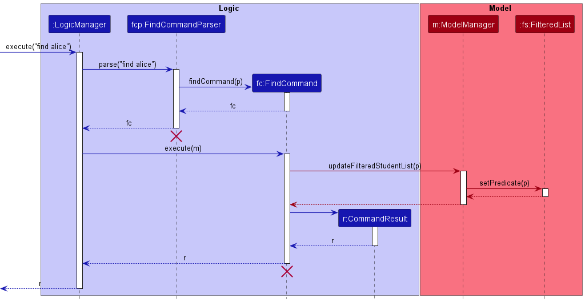
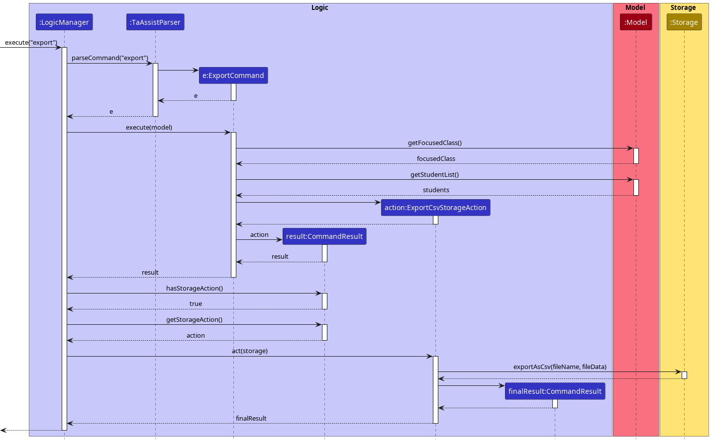

* Table of Contents
{:toc}

--------------------------------------------------------------------------------------------------------------------

## **Acknowledgements**

* Regex for GitHub Username taken from [here](https://github.com/shinnn/github-username-regex)

* Code for a method in the pie chart feature was reused with minimal changes from [_this StackOverflow post_](https://stackoverflow.com/questions/35479375)

--------------------------------------------------------------------------------------------------------------------

## **Setting up, getting started**

Refer to the guide [_Setting up and getting started_](SettingUp.md).

--------------------------------------------------------------------------------------------------------------------

## **Design**

:bulb: **Tip:** The `.puml` files used to create diagrams in this document can be found in the [diagrams](https://github.com/se-edu/addressbook-level3/tree/master/docs/diagrams/) folder. Refer to the [_PlantUML Tutorial_ at se-edu/guides](https://se-education.org/guides/tutorials/plantUml.html) to learn how to create and edit diagrams.

### Architecture

The ***Architecture Diagram*** given above explains the high-level design of the App.

Given below is a quick overview of main components and how they interact with each other.

**Main components of the architecture**

**`Main`** has two classes called [`Main`](https://github.com/se-edu/addressbook-level3/tree/master/src/main/java/seedu/address/Main.java) and [`MainApp`](https://github.com/se-edu/addressbook-level3/tree/master/src/main/java/seedu/address/MainApp.java). It is responsible for,
* At app launch: Initializes the components in the correct sequence, and connects them up with each other.
* At shut down: Shuts down the components and invokes cleanup methods where necessary.

[**`Commons`**](#common-classes) represents a collection of classes used by multiple other components.

The rest of the App consists of four components.

* [**`UI`**](#ui-component): The UI of the App.
* [**`Logic`**](#logic-component): The command executor.
* [**`Model`**](#model-component): Holds the data of the App in memory.
* [**`Storage`**](#storage-component): Reads data from, and writes data to, the hard disk.

**How the architecture components interact with each other**

The *Sequence Diagram* below shows how the components interact with each other for the scenario where the user issues the command `delete 1`.

Each of the four main components (also shown in the diagram above),

* defines its *API* in an `interface` with the same name as the Component.
* implements its functionality using a concrete `{Component Name}Manager` class (which follows the corresponding API `interface` mentioned in the previous point.

For example, the `Logic` component defines its API in the `Logic.java` interface and implements its functionality using the `LogicManager.java` class which follows the `Logic` interface. Other components interact with a given component through its interface rather than the concrete class (reason: to prevent outside component's being coupled to the implementation of a component), as illustrated in the (partial) class diagram below.

The sections below give more details of each component.

### UI component

The **API** of this component is specified in [`Ui.java`](https://github.com/se-edu/addressbook-level3/tree/master/src/main/java/seedu/address/ui/Ui.java)

The UI consists of a `MainWindow` that is made up of parts e.g.`CommandBox`, `ResultDisplay`, `PersonListPanel`, `StatusBarFooter` etc. All these, including the `MainWindow`, inherit from the abstract `UiPart` class which captures the commonalities between classes that represent parts of the visible GUI.

The `UI` component uses the JavaFx UI framework. The layout of these UI parts are defined in matching `.fxml` files that are in the `src/main/resources/view` folder. For example, the layout of the [`MainWindow`](https://github.com/se-edu/addressbook-level3/tree/master/src/main/java/seedu/address/ui/MainWindow.java) is specified in [`MainWindow.fxml`](https://github.com/se-edu/addressbook-level3/tree/master/src/main/resources/view/MainWindow.fxml)

The `UI` component,

* executes user commands using the `Logic` component.
* listens for changes to `Model` data so that the UI can be updated with the modified data.
* keeps a reference to the `Logic` component, because the `UI` relies on the `Logic` to execute commands.
* depends on some classes in the `Model` component, as it displays `Person` object residing in the `Model`.

### Logic component

**API** : [`Logic.java`](https://github.com/se-edu/addressbook-level3/tree/master/src/main/java/seedu/address/logic/Logic.java)

Here's a (partial) class diagram of the `Logic` component:

How the `Logic` component works:
1. When `Logic` is called upon to execute a command, it uses the `AddressBookParser` class to parse the user command.
1. This results in a `Command` object (more precisely, an object of one of its subclasses e.g., `AddCommand`) which is executed by the `LogicManager`.
1. The command can communicate with the `Model` when it is executed (e.g. to add a person).
1. The result of the command execution is encapsulated as a `CommandResult` object which is returned back from `Logic`.

The Sequence Diagram below illustrates the interactions within the `Logic` component for the `execute("delete 1")` API call.

:information_source: **Note:** The lifeline for `DeleteCommandParser` should end at the destroy marker (X) but due to a limitation of PlantUML, the lifeline reaches the end of diagram.

Here are the other classes in `Logic` (omitted from the class diagram above) that are used for parsing a user command:

How the parsing works:
* When called upon to parse a user command, the `AddressBookParser` class creates an `XYZCommandParser` (`XYZ` is a placeholder for the specific command name e.g., `AddCommandParser`) which uses the other classes shown above to parse the user command and create a `XYZCommand` object (e.g., `AddCommand`) which the `AddressBookParser` returns back as a `Command` object.
* All `XYZCommandParser` classes (e.g., `AddCommandParser`, `DeleteCommandParser`, ...) inherit from the `Parser` interface so that they can be treated similarly where possible e.g, during testing.

### Model component
**API** : [`Model.java`](https://github.com/se-edu/addressbook-level3/tree/master/src/main/java/seedu/address/model/Model.java)

The `Model` component,

* stores the address book data i.e., all `Person` objects (which are contained in a `UniquePersonList` object).
* stores the currently 'selected' `Person` objects (e.g., results of a search query) as a separate _filtered_ list which is exposed to outsiders as an unmodifiable `ObservableList<Person>` that can be 'observed' e.g. the UI can be bound to this list so that the UI automatically updates when the data in the list change.
* stores a `UserPref` object that represents the user’s preferences. This is exposed to the outside as a `ReadOnlyUserPref` objects.
* does not depend on any of the other three components (as the `Model` represents data entities of the domain, they should make sense on their own without depending on other components)

### Storage component

**API** : [`Storage.java`](https://github.com/se-edu/addressbook-level3/tree/master/src/main/java/seedu/address/storage/Storage.java)

The `Storage` component,
* can save both address book data and user preference data in json format, and read them back into corresponding objects.
* inherits from both `AddressBookStorage` and `UserPrefStorage`, which means it can be treated as either one (if only the functionality of only one is needed).
* depends on some classes in the `Model` component (because the `Storage` component's job is to save/retrieve objects that belong to the `Model`)

### Common classes

Classes used by multiple components are in the `seedu.addressbook.commons` package.

--------------------------------------------------------------------------------------------------------------------

## **Implementation**

This section describes some noteworthy details on how certain features are implemented.

### Delete multiple contacts (enhancement to delete feature)

`DeleteCommand` now accepts multiple inputs and allows multiple `Person` to be deleted from the `Model` in a single command.

The sequence diagram below shows how a `DeleteCommand` with multiple inputs is executed.

#### Differences from original `DeleteCommand` implementation:
1. `DeleteCommandParser` now returns a `Set<Index>` instead of just a single `Index` to be used as arguments for the `DeleteCommand`constructor.
2. If any of the inputs are invalid (out of bounds indexes or non-integer characters) a `ParseException` will be thrown, even if other inputs are valid.

:information_source: **Note:** The order of the inputs does not matter as the set is sorted in reverse order before creating the `DeleteCommand` object. This ensures that deletion of each entry in the `model` does not affect the deletion of the subsequent entries while the `for` loop is running.

### Fast Template Feature

#### Implementation

The Fast Template Feature is facilitated by `TemplateCommand`. It extends 'Command' with a String`personChosen` class field that stores the chosen Person. The chosen Person refers to the Person that the User wants the template of, i.e. `prof / ta / student`. Additonally, it implements the following operations:
- TemplateCommand#execute() - Executes the template command, whose command word is `tt`.
- TemplateCommand#isValidPerson(String p) - Returns the boolean indicating whether the string p refers to a valid person. I.e. is a command word for a Person

Given below is an example usage scenario and how the template operation mechanism behaves at each step.

Step 1. The user types `tt prof` and presses enter.

Step 2. The `tt prof ` will be parsed by `AddressBook#parseCommand()` which will return a `TemplateCommandParser`.

Step 3. The `TemplateCommandParser` will parse `prof` using `parse()`. This will return a `TemplateCommand` since `prof` is a valid command word for a Person, in this case Professor.

Step 4. The `TemplateCommand` will then be executed using `TemplateCommand#execute()`.

Step 5. A `CommandResult` will be returned. It has the field `personTemplateString` that is set to `"prof"`.

Step 6. The UI will call `hasPersonTemplate()` from the CommandResult.

Step 7. If the previous step is true, the UI will update itself accordingly, i.e. paste the appropriate Person's template on the CLI, by calling `handleTemplate()`.

The following sequence diagram shows how the github feature works.

#### Design considerations:

**Aspect: How the template is provided to User:**

* **Current Implementation:** Pastes the template directly into the CLI where the User types commands
    * Pros: More intuitive
    * Cons: More complicated to implement, need to click or press tab + left arrow to get to CLI.

* **Alternative:** Copies the template into the User's clipboard
    * Pros: Easier to implement, can access CLI directly after pasting
    * Cons: Less intuitive, less technically competent users may not understand what a clipboard is.

### Open Github Profile Page Feature

#### Implementation

The Open Github Profile Page Feature is facilitated by `GithubCommand`. It extends 'Command' with an `Index` class field that stores the target index. The target index refers to the index of the Address that users want to execute the Github command on. Additonally, it implements the following operations:
- GithubCommand#execute() - Executes the GitHub command.

Given below is an example usage scenario and how the GitHub operation mechanism behaves at each step.

Step 1. The user types `github 1` and presses enter.

Step 2. The `github 1 ` will be parsed by `AddressBook#parseCommand()` which will return a `GithubCommandParser`.

Step 3. The `GithubCommandParser` will parse `1` using `parse()`. This will return a `GithubCommand`

Step 4. The `GithubCommand` will then be executed using `GithubCommand#execute()`.

:information_source: **Note:** executes() checks if the GitHub username field of target person is empty. If it is empty an exception will be thrown.

Step 5. The `Model#openGithub()` method will be called and the githubProfile page associated to target address would be opened on the user's default browser using `java.awt.Desktop.getDesktop.browse(uri)`.

Step 6. A `CommandResult` indicating successful completion of the command will be returned.

The following sequence diagram shows how the GitHub feature works.

The following activity diagram summarizes what happens when a user executes a new GitHub command:

#### Design considerations:

**Aspect: How open GitHub profile page feature executes:**

* **Alternative 1 (current choice):** Opens GitHub profile page through user's default browser.
    * Pros: Easy to implement.
    * Cons: Users will be redirected to their default browser.

* **Alternative 2:** Opens GitHub profile page through in-built browser.
    * Pros: Users will be able to see the GitHub profile page from the app itself
    * Cons: Difficult to implement. (need to build browser on app, need to reserve UI space for it)

### Find Contact

#### Implementation

The Find Contact Feature is facilitated by `FindCommand`. It extends `Command` with a `PersonMatchesPredicate` field (which extends the `Predicate` interface) that is used to filter persons to produce the desirable list of contacts.

Given below is an example usage scenario and how the find command mechanism behaves at each step.

Step 1. The user types `find n/bob` and presses enter.

Step 2. The `find n/bob` will be parsed by `AddressBook#parseCommand()` which will return a `FindCommandParser` which also creates a `PersonMatchesPredicate`.

Step 3. The `FindCommandParser` will parse `n/bob` using `parse()` and then set the `namesList` of the `PersonMatchesPredicate` to a list of strings containing `bob`.

:information_source: **Note:** `FindCommand` supports an "all fields matched" mode and "any fields matched" for module codes and tags. This means the setting of the modulesList and tagsList works differently than the other fields.

Step 5. `FindCommandParser` then creates a `FindCommand` by passing the `PersonMatchesPredicate` to its constructor.

Step 4. The `FindCommand` will then be executed using `FindCommand#execute()`.

Step 5. The `Model#updateFilteredPersonList(predicate);` method will be called and the list of persons will be filtered according to the `PersonMatchesPredicate`.

Step 6. A `CommandResult` indicating successful completion of the command will be returned.

Step 7. A list of contacts, if any, will be displayed to the user.

The following sequence diagram shows how the find contact feature works.

#### Design considerations:

**Aspect: How open github profile page feature executes:**

* **Alternative 1 (current choice):** Use a class that implements the `Predicate` interface to filter contacts.
    * Pros: Easily extendable for future enhancements of find command.
    * Pros: Less of the codebase needs to be changed.

* **Alternative 2:** Create a generic contact class through the fields provided and match with other contacts to filter.
    * Cons: Difficult to implement / bad runtime and memory usage when multiple values are provided for a single field. e.g. `find n/bob anne` will mean 2 contacts are created with names `bob` and `anne` respectively. Current contacts will then need to be compared with both of these.

### Sort List Feature

#### Implementation

The proposed sort mechanism is facilitated by `SortCommand`. It extends `Command` which alters the `UniquePersonList`
stored within `AddressBook` to display the list on the UI in a sorted order according to the users specification. The
`Order` class is used to specify the arrangement of the list in either `Order.ASCENDING` or `Order.DESCENDING`.

Given below is an example usage scenario and how the sort command mechanism behaves at each step.

Step 1. The user types `sort A-Z n/name` and presses enter.

Step 2. The `sort A-Z n/name` will be parsed by `AddressBook#parseCommand()` which will return a `SortCommandParser` and a `SortPersonListDescriptor`

Step 3. The `FindCommandParser` will parse `A-Z` and `n/name` using `parse()` and then create an `Order` based on `A-Z` and also set the `isSortByName` and
`isSortByModuleCode` attributes of the `SortPersonListDescriptor`.

Step 4. `SortCommandParser` then creates a `SortCommand` by passing the `Order` and `SortPersonListDescriptor` to its constructor.

Step 5. The `SortCommand` will then be executed using `SortCommand#execute()`.

Step 6. The `Model#sort(order, isSortByName, isSortByModuleCode);` method will be called and the list of persons will be sorted according to the `order`, `isSortByName` and `isSortByModuleCode`.

Step 7. A `CommandResult` indicating successful completion of the command will be returned.

Step 8. A list of contacts in a sorted order, if any, will be displayed to the user.

The following sequence diagram shows how the sort feature works.

The following activity diagram summarizes what happens when a user executes a new sort command:

#### Design considerations:

**Aspect: How to simplify the command for User:**

* **Current Implementation:** Use A-Z to specify ascending to minimise characters and improve ease of understanding
    * Pros: More intuitive
    * Cons: Harder to extend to sorting other items such as rating where A-Z does not make sense to users.

* **Alternative:** Use the word ascending or descending
    * Pros: Easier to generalise to sorting the contact list by other features that has a numerical value.
    * Cons: More letters for user to type.

### Export List Feature

#### Implementation

The proposed export mechanism is facilitated by `ExportCommand`. It extends `Command` which fetches the directory
where the `JSON` copy of the `AddressBook` is stored at. It then uses the `CsvUtils` to create a new CSV file and
parse the `JSON objects` in the file specified and copies it into the new CSV file with a file name specified by user.
`FileName` class is used to specify the name of the file being added to avoid adding a file with an incompatible name.

Given below is an example usage scenario and how the export command mechanism behaves at each step.

Step 1. The user types `export mycontacts` and presses enter.

Step 2. The `export mycontacts` will be parsed by `AddressBook#parseCommand()` which will return a `ExportCommandParser`.

Step 3. The `ExportCommandParser` will parse `mycontacts` using `parse()` and then create an `FileName`.

Step 4. `ExportCommandParser` then creates a `ExportCommand` by passing the `FileName` to its constructor.

Step 5. The `ExportCommand` will then be executed using `ExportCommand#execute()`.

Step 6. The `Model#getAddressBookFilePath();` method will be called and passed into the fileToExport
parameter of `CsvUtils#exportAsCsv(fileToExport, exportLocation)` along with the `FileName` as the exportLocation parameter.

Step 7. The `CsvUtils#exportAsCsv(fileToExport, exportLocation)` will create a CSV version of the `Addressbook` in the specified `exportLocation`.

Step 8. The `Desktop` will then be used to open the CSV file created.

Step 9. A `CommandResult` indicating successful completion of the command will be returned along with the absolute path of the exported file.

The following sequence diagram shows how the export feature works.

#### Design considerations:

**Aspect: How to simplify the command for User:**

* **Current Implementation:** Allow users to specify the name of the file they want to store the CSV version of the `addressbook` into.
    * Pros: Allows more customisation for the users.
    * Cons: Might confuse users that are not very familiar with naming files.

* **Alternative:** Use a single word export.
    * Pros: Very intuitive to use and fool-proof.
    * Cons: Users have less customisation.

### \[Proposed\] Undo/redo feature

#### Proposed Implementation

The proposed undo/redo mechanism is facilitated by `VersionedAddressBook`. It extends `AddressBook` with an undo/redo history, stored internally as an `addressBookStateList` and `currentStatePointer`. Additionally, it implements the following operations:

* `VersionedAddressBook#commit()` — Saves the current address book state in its history.
* `VersionedAddressBook#undo()` — Restores the previous address book state from its history.
* `VersionedAddressBook#redo()` — Restores a previously undone address book state from its history.

These operations are exposed in the `Model` interface as `Model#commitAddressBook()`, `Model#undoAddressBook()` and `Model#redoAddressBook()` respectively.

Given below is an example usage scenario and how the undo/redo mechanism behaves at each step.

Step 1. The user launches the application for the first time. The `VersionedAddressBook` will be initialized with the initial address book state, and the `currentStatePointer` pointing to that single address book state.

Step 2. The user executes `delete 5` command to delete the 5th person in the address book. The `delete` command calls `Model#commitAddressBook()`, causing the modified state of the address book after the `delete 5` command executes to be saved in the `addressBookStateList`, and the `currentStatePointer` is shifted to the newly inserted address book state.

Step 3. The user executes `add n/David …​` to add a new person. The `add` command also calls `Model#commitAddressBook()`, causing another modified address book state to be saved into the `addressBookStateList`.

:information_source: **Note:** If a command fails its execution, it will not call `Model#commitAddressBook()`, so the address book state will not be saved into the `addressBookStateList`.

Step 4. The user now decides that adding the person was a mistake, and decides to undo that action by executing the `undo` command. The `undo` command will call `Model#undoAddressBook()`, which will shift the `currentStatePointer` once to the left, pointing it to the previous address book state, and restores the address book to that state.

:information_source: **Note:** If the `currentStatePointer` is at index 0, pointing to the initial AddressBook state, then there are no previous AddressBook states to restore. The `undo` command uses `Model#canUndoAddressBook()` to check if this is the case. If so, it will return an error to the user rather
than attempting to perform the undo.

The following sequence diagram shows how the undo operation works:

:information_source: **Note:** The lifeline for `UndoCommand` should end at the destroy marker (X) but due to a limitation of PlantUML, the lifeline reaches the end of diagram.

The `redo` command does the opposite — it calls `Model#redoAddressBook()`, which shifts the `currentStatePointer` once to the right, pointing to the previously undone state, and restores the address book to that state.

:information_source: **Note:** If the `currentStatePointer` is at index `addressBookStateList.size() - 1`, pointing to the latest address book state, then there are no undone AddressBook states to restore. The `redo` command uses `Model#canRedoAddressBook()` to check if this is the case. If so, it will return an error to the user rather than attempting to perform the redo.

Step 5. The user then decides to execute the command `list`. Commands that do not modify the address book, such as `list`, will usually not call `Model#commitAddressBook()`, `Model#undoAddressBook()` or `Model#redoAddressBook()`. Thus, the `addressBookStateList` remains unchanged.

Step 6. The user executes `clear`, which calls `Model#commitAddressBook()`. Since the `currentStatePointer` is not pointing at the end of the `addressBookStateList`, all address book states after the `currentStatePointer` will be purged. Reason: It no longer makes sense to redo the `add n/David …​` command. This is the behavior that most modern desktop applications follow.

The following activity diagram summarizes what happens when a user executes a new command:

#### Design considerations:

**Aspect: How undo & redo executes:**

* **Alternative 1 (current choice):** Saves the entire address book.
    * Pros: Easy to implement.
    * Cons: May have performance issues in terms of memory usage.

* **Alternative 2:** Individual command knows how to undo/redo by
  itself.
    * Pros: Will use less memory (e.g. for `delete`, just save the person being deleted).
    * Cons: We must ensure that the implementation of each individual command are correct.

--------------------------------------------------------------------------------------------------------------------

## **Documentation, logging, testing, configuration, dev-ops**

* [Documentation guide](Documentation.md)
* [Testing guide](Testing.md)
* [Logging guide](Logging.md)
* [Configuration guide](Configuration.md)
* [DevOps guide](DevOps.md)

--------------------------------------------------------------------------------------------------------------------

## **Appendix: Requirements**

### Product scope

**Target user profile**:

* has a need to manage a significant number of TA, professor, and other students' contact information
* prefer desktop apps over other types
* can type fast
* prefers typing to mouse interactions
* is reasonably comfortable using CLI apps

**Value proposition**: For students to manage Professor/TA /Students based on information provided allowing them to save time.

### User stories

Priorities: High (must have) - `* * *`, Medium (nice to have) - `* *`, Low (unlikely to have) - `*`

| Priority | As a …​   | I want to …​                                                            | So that I can…​                                                                                           |
|----------|-----------|-------------------------------------------------------------------------|-----------------------------------------------------------------------------------------------------------|
| `* * *`  | Student   | add contacts of my tutors/professors/friends                            | keep track of my social network                                                                           |
| `* * *`  | Student   | remove unnecessary contacts from my address book                        | manage my social network                                                                                  |
| `* * *`  | Student   | find contacts based on name                                             | look up a person’s contact easily                                                                         |
| `* * *`  | Student   | edit contacts in  address book                                          | make changes if that a person’s contact changed                                                           |
| `* * *`  | Student   | display all the contacts in my list                                     | see all the contacts that I have added so far                                                             |
| `* * *`  | New User  | clear all examples sample address                                       | start using the application quickly                                                                       |
| `* * *`  | Student   | keep track of my tutors/professors/friend's github username             | find their github username easily                                                                         |
| `* * *`  | Lazy User | open github profile page of my tutors/professor/ friends with a command | view my friends/Teaching Assistants/Professors github projects easily                                     |
| `* * *`  | Student   | keep track of professor's specialisation                                | know which professor to consult                                                                           |
| `* * *`  | Student   | keep track of my fellow students' year                                  | know who I should approach for help                                                                       |
| `* * *`  | Student   | keep track of my contact's location                                     | know where I should approach for help / to meet                                                           |
| `* * *`  | New User  | get a template command for adding a tutor / professor / friend          | start using the application quickly without having to constantly look up the User Guide on all the fields |
| `* * *`  | Student   | visualise my contact list in a pie chart                                | have a quick overview of my network                                                                       |
| `* * *`  | Student   | search by module code                                                   | so that I can see all my peers, profs and TAs for a certain module                                        |
| `* * *`  | Student   | find the consultation timing of tutors/professors                       | so I know when I can approach a professor for help                                                        |
| `* * *`  | Student   | find the location for a specific module                                 | know where my class is                                                                                    |
| `* * *`  | Student   | find my friends or peers doing the same mod as me                       | know who to ask for help or who to form groups with                                                       |
| `* * *`  | Student   | filter through the contacts shown in GUI                                | I can search quickly for any contact I want to find                                                       |

*{More to be added}*

### Use cases

(For all use cases below, the **System** is the `SoConnect` and the **Actor** is the `user`, unless specified otherwise)

**Use case: Add a student**

**MSS**

1. User requests to list persons.
2. SoConnect shows a list of persons.
3. User requests to add a student to the list.
4. SoConnect adds the student to the list.

**Extensions**

* 3a. The student specified by the user is invalid.
  * 3a1. SoConnect shows an error message.
    Use case resumes at step 2.
**Use case: Delete a person**

**MSS**

1.  User requests to list persons.
2.  SoConnect shows a list of persons.
3.  User requests to delete multiple people in the list.
4.  SoConnect deletes the all the people specified by the user.

    Use case ends.

**Extensions**

* 2a. The list is empty.

  Use case ends.

* 3a. At least one of the given indexes is invalid.

    * 3a1. SoConnect shows an error message.

      Use case resumes at step 2.

**Use case: Open a person's GitHub profile page**

**MSS**

1.  User requests to list persons.
2.  SoConnect shows a list of persons.
3.  User requests to open the GitHub profile page of a specific person in the list.
4.  SoConnect opens the person's GitHub profile page on User's default browser.

    Use case ends.

**Extensions**

* 2a. The list is empty.

  Use case ends.

* 3a. The given index is invalid or the person at given index does not have a GitHub username associated him/her.

    * 3a1. AddressBook shows an error message.

      Use case resumes at step 2.

**Use case: Get Template for adding a Person**

**MSS**

1.  User requests for a template for a specific type of Person. i.e. prof / ta / student.
2.  SoConnect pastes the template on the CLI.
3.  User fills in the template with the right information and presses enter.
4.  SoConnect adds the person into storage.

    Use case ends.

**Extensions**
* 1a. SoConnect detects an error in specified person entered.

    * 1a1. SoConnect shows an error message.

      Use case resumes at step 1.

* 3a. SoConnect detects an error in the entered information.

    * 3a1. SoConnect shows an error message.

      Use case resumes at step 3.

**Use case: Find person for any desired action**

**MSS**

1.  User enters details to filter list by.
2.  SoConnect returns the list of persons matching the details provided.
3.  User performs desired action on contact(s) shown.

    Use case ends.

**Extensions**
* 1a. SoConnect detects an error with the details entered.

    * 1a1. SoConnect shows an error message.
    * 1a2. User enters new data.
      Steps 1a1-1a2 are repeated until the data entered are correct.

      Use case resumes from step 2.

### Non-Functional Requirements

1.  Should work on any _mainstream OS_ as long as it has Java `11` or above installed.
2.  Should be able to hold up to 1000 persons without a noticeable sluggishness in performance for typical usage.
3.  A user with above average typing speed for regular English text (i.e. not code, not system admin commands) should be able to accomplish most of the tasks faster using commands than using the mouse.
4.  User has to have a basic grasp of English as other languages are currently not supported.

### Glossary

* **Mainstream OS**: Windows, Linux, Unix, OS-X
* **Private contact detail**: A contact detail that is not meant to be shared with others

--------------------------------------------------------------------------------------------------------------------

## **Appendix: Instructions for manual testing**

Given below are instructions to test the app manually.

:information_source: **Note:** These instructions only provide a starting point for testers to work on;
testers are expected to do more *exploratory* testing.

### Launch and shutdown

1. Initial launch

   1. Download the jar file and copy into an empty folder

   1. Double-click the jar file Expected: Shows the GUI with a set of sample contacts. The window size may not be optimum.

1. Saving window preferences

   1. Resize the window to an optimum size. Move the window to a different location. Close the window.

   1. Re-launch the app by double-clicking the jar file. 
       Expected: The most recent window size and location is retained.

### Deleting a person

1. Deleting a person while all persons are being shown

   1. Prerequisites: List all persons using the `list` command. Multiple persons in the list.

   1. Test case: `delete 1` 
      Expected: First contact is deleted from the list. Details of the deleted contact shown in the status message. Timestamp in the status bar is updated.

   1. Test case: `delete 0` 
      Expected: No person is deleted. Error details shown in the status message. Status bar remains the same.

   1. Other incorrect delete commands to try: `delete`, `delete x`, `...` (where x is larger than the list size) 
      Expected: Similar to previous.

### Opening a person's GitHub Profile Page

1. Opening a person's GitHub Profile Page while all persons are being shown

    1. Prerequisites: List all persons using the `list` command. Multiple persons in the list. 1st person in list has an associated GitHub Username. 2nd person in list does not have an associated GitHub username.

    2. Test case: `github 1` 
       Expected: The person's GitHub profile page will be opened in user's default browser. Success message shown in status message

    3. Test case: `github 0` 
       Expected: No GitHub Profile page will be opened. Error details shown in the status message.

    4. Test case: `github 2` 
       Expected: No GitHub Profile page will be opened. Error details shown in the status message.

    5. Other incorrect GitHub commands to try: `github`, `github x`, `...` (where x is larger than the list size) 
       Expected: Similar to previous.

### Saving data
Note that SoConnect's address book data is stored as a JSON file at [JAR File Location]/data/addressbook.json. Users are able and welcome to update data directly by editing that data file.

#### Dealing with missing/corrupted data files
* If the changes to the data file makes the format of the information invalid, SoConnect will discard all data and start with an empty data file at the next run.
