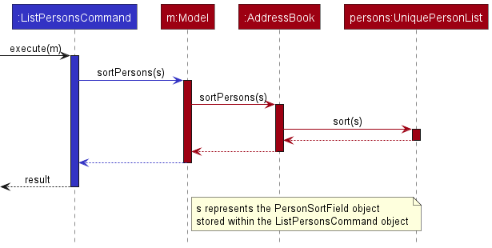
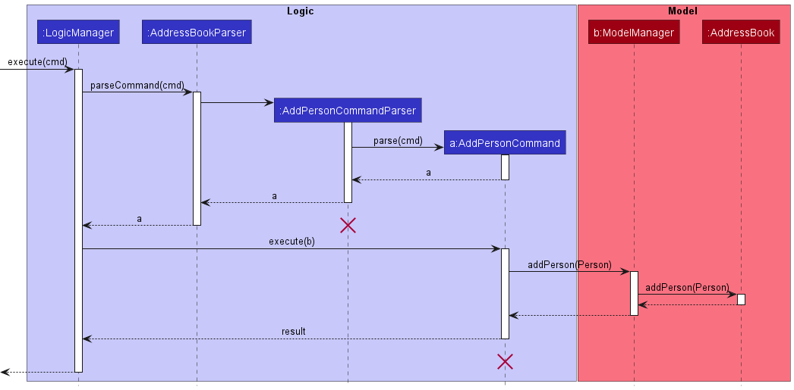
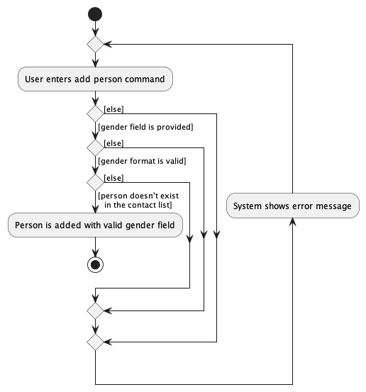
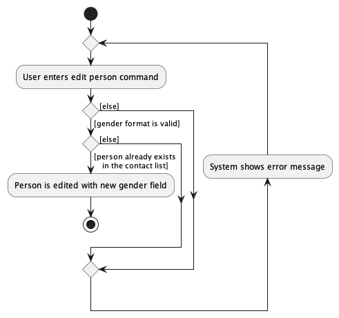
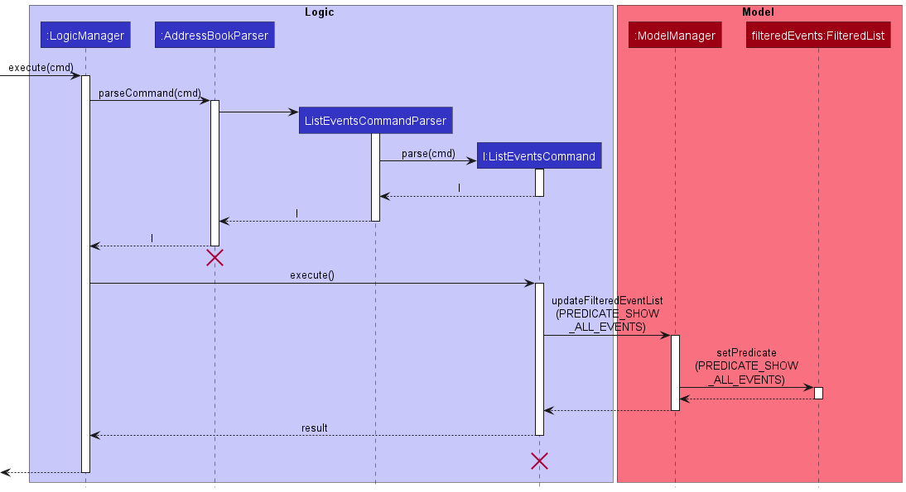

* Table of Contents
{:toc}

--------------------------------------------------------------------------------------------------------------------

## **Acknowledgements**

* {list here sources of all reused/adapted ideas, code, documentation, and third-party libraries -- include links to the original source as well}

--------------------------------------------------------------------------------------------------------------------

## **Setting up, getting started**

Refer to the guide [_Setting up and getting started_](SettingUp.md).

--------------------------------------------------------------------------------------------------------------------

## **Design**

:bulb: **Tip:** The `.puml` files used to create diagrams in this document can be found in the [diagrams](https://github.com/se-edu/addressbook-level3/tree/master/docs/diagrams/) folder. Refer to the [_PlantUML Tutorial_ at se-edu/guides](https://se-education.org/guides/tutorials/plantUml.html) to learn how to create and edit diagrams.

### Architecture

The ***Architecture Diagram*** given above explains the high-level design of the App.

Given below is a quick overview of main components and how they interact with each other.

**Main components of the architecture**

**`Main`** has two classes called [`Main`](https://github.com/se-edu/addressbook-level3/tree/master/src/main/java/seedu/address/Main.java) and [`MainApp`](https://github.com/se-edu/addressbook-level3/tree/master/src/main/java/seedu/address/MainApp.java). It is responsible for,
* At app launch: Initializes the components in the correct sequence, and connects them up with each other.
* At shut down: Shuts down the components and invokes cleanup methods where necessary.

[**`Commons`**](#common-classes) represents a collection of classes used by multiple other components.

The rest of the App consists of four components.

* [**`UI`**](#ui-component): The UI of the App.
* [**`Logic`**](#logic-component): The command executor.
* [**`Model`**](#model-component): Holds the data of the App in memory.
* [**`Storage`**](#storage-component): Reads data from, and writes data to, the hard disk.

**How the architecture components interact with each other**

The *Sequence Diagram* below shows how the components interact with each other for the scenario where the user issues the command `delete 1`.

Each of the four main components (also shown in the diagram above),

* defines its *API* in an `interface` with the same name as the Component.
* implements its functionality using a concrete `{Component Name}Manager` class (which follows the corresponding API `interface` mentioned in the previous point.

For example, the `Logic` component defines its API in the `Logic.java` interface and implements its functionality using the `LogicManager.java` class which follows the `Logic` interface. Other components interact with a given component through its interface rather than the concrete class (reason: to prevent outside component's being coupled to the implementation of a component), as illustrated in the (partial) class diagram below.

The sections below give more details of each component.

### UI component

The **API** of this component is specified in [`Ui.java`](https://github.com/se-edu/addressbook-level3/tree/master/src/main/java/seedu/address/ui/Ui.java)

The UI consists of a `MainWindow` that is made up of parts e.g.`CommandBox`, `ResultDisplay`, `PersonListPanel`, `EventListPanel`, `StatusBarFooter` etc. All these, including the `MainWindow`, inherit from the abstract `UiPart` class which captures the commonalities between classes that represent parts of the visible GUI.

The `UI` component uses the JavaFx UI framework. The layout of these UI parts are defined in matching `.fxml` files that are in the `src/main/resources/view` folder. For example, the layout of the [`MainWindow`](https://github.com/se-edu/addressbook-level3/tree/master/src/main/java/seedu/address/ui/MainWindow.java) is specified in [`MainWindow.fxml`](https://github.com/se-edu/addressbook-level3/tree/master/src/main/resources/view/MainWindow.fxml)

The `UI` component,

* executes user commands using the `Logic` component.
* listens for changes to `Model` data so that the UI can be updated with the modified data.
* keeps a reference to the `Logic` component, because the `UI` relies on the `Logic` to execute commands.
* depends on some classes in the `Model` component, as it displays `Person` objects and `Event` objects residing in the `Model`.

### Logic component

**API** : [`Logic.java`](https://github.com/se-edu/addressbook-level3/tree/master/src/main/java/seedu/address/logic/Logic.java)

Here's a (partial) class diagram of the `Logic` component:

How the `Logic` component works:
1. When `Logic` is called upon to execute a command, it uses the `AddressBookParser` class to parse the user command.
1. This results in a `Command` object (more precisely, an object of one of its subclasses e.g., `AddCommand`) which is executed by the `LogicManager`.
1. The command can communicate with the `Model` when it is executed (e.g. to add a person).
1. The result of the command execution is encapsulated as a `CommandResult` object which is returned back from `Logic`.

The Sequence Diagram below illustrates the interactions within the `Logic` component for the `execute("delete 1")` API call.

:information_source: **Note:** The lifeline for `DeleteCommandParser` should end at the destroy marker (X) but due to a limitation of PlantUML, the lifeline reaches the end of diagram.

Here are the other classes in `Logic` (omitted from the class diagram above) that are used for parsing a user command:

How the parsing works:
* When called upon to parse a user command, the `AddressBookParser` class creates an `XYZCommandParser` (`XYZ` is a placeholder for the specific command name e.g., `AddCommandParser`) which uses the other classes shown above to parse the user command and create a `XYZCommand` object (e.g., `AddCommand`) which the `AddressBookParser` returns back as a `Command` object.
* All `XYZCommandParser` classes (e.g., `AddCommandParser`, `DeleteCommandParser`, ...) inherit from the `Parser` interface so that they can be treated similarly where possible e.g, during testing.

### Model component
**API** : [`Model.java`](https://github.com/se-edu/addressbook-level3/tree/master/src/main/java/seedu/address/model/Model.java)

The `Model` component,

* stores the address book data i.e., all `Person` and `Events` objects (which are contained in the `UniquePersonList` and `UniqueEventList` objects).
* stores the currently 'selected' `Person` objects (e.g., results of a search query) as a separate _filtered_ list which is exposed to outsiders as an unmodifiable `ObservableList<Person>` that can be 'observed' e.g. the UI can be bound to this list so that the UI automatically updates when the data in the list change.
* stores the currently 'selected' `Event` objects (e.g., results of a search query) as a separate _filtered_ list which is exposed to outsiders as an unmodifiable `ObservableList<Event>` that can be 'observed' e.g. the UI can be bound to this list so that the UI automatically updates when the data in the list change.
* stores a `UserPref` object that represents the user’s preferences. This is exposed to the outside as a `ReadOnlyUserPref` objects.
* does not depend on any of the other three components (as the `Model` represents data entities of the domain, they should make sense on their own without depending on other components)

:information_source: **Note:** An alternative (arguably, a more OOP) model is given below. It has a `Tag` list in the `AddressBook`, which `Person` references. This allows `AddressBook` to only require one `Tag` object per unique tag, instead of each `Person` needing their own `Tag` objects. 

### Storage component

**API** : [`Storage.java`](https://github.com/se-edu/addressbook-level3/tree/master/src/main/java/seedu/address/storage/Storage.java)

The `Storage` component,
* can save both address book data and user preference data in json format, and read them back into corresponding objects.
* inherits from both `AddressBookStorage` and `UserPrefStorage`, which means it can be treated as either one (if only the functionality of only one is needed).
* depends on some classes in the `Model` component (because the `Storage` component's job is to save/retrieve objects that belong to the `Model`)

### Common classes

Classes used by multiple components are in the `seedu.addressbook.commons` package.

--------------------------------------------------------------------------------------------------------------------

## **Implementation**

This section describes some noteworthy details on how certain features are implemented.

### Sort Persons

The sort persons feature allows the user to sort persons by their name, date of birth or gender.

The field to sort persons by is encapsulated within the `PersonSortField` class. `PersonSortField` stores the sort field enumeration (`PersonSortFieldType`) as well as the `Comparator` object that defines the sorting logic.

The following class diagram shows how the `PersonSortField` class integrates with the other components:

  

Sorting is performed as part of `listPersonsCommand#execute()`. The sorting operation is exposed in the `Model` interface as `Model#sortPersons()` which calls `AddressBook#sortPersons()` which in turn calls `UniquePersonList#sort()` to sort the underlying `ObservableList<Person>`.

The following sequence diagram illustrates the relevant sorting method calls for the command `listPersons s/n` with a `PersonSortField` object `s`:

:information_source: **Note:** Sorting is performed directly on the underlying `UniquePersonList` object, which means the sorted result is **permanent**. For example, if `listPersons s/n` and `listPersons` are executed back-to-back, the result of the second `listPersons` command will display the sorted results from the first `listPersons s/n` command because the sorted result is permanent.

#### Design Considerations:

**Aspect: How sorting is performed:**

Ideally, sorting should be a "view" level operation that doesn't change the underlying person list. However, the way the UI is designed makes it difficult to implement sorting as such. The issue is that the UI is **hardcoded** to only display persons from the `UniquePersonList` object. As such, any changes to the person list must be made directly to the `UniquePersonList` object. i.e. A modified copy of the person list cannot be passed to the UI during runtime since the UI is hardcoded to show only the `UniquePersonList` object.

Therefore, given the constraints of the UI, sorting is implemented as a **permanent operation**.

* **Alternative 1 (current choice):** Sort the underlying person list directly.
  * Pros: User can directly use the index numbers of the sorted list to interact with the persons using other commands such as `editPerson` or `deletePerson`.
  * Cons: Sorted result is permanent, instead of being a "view" level operation.

* **Alternative 2:** Sort the person list at the UI level.
   * Pros: Sorted result is not permanent. So sorting won't interfere with the underlying person list.
   * Cons: Requires redesigning a significant part of the `UI`, `Logic` and `Model` classes.

### Adding Events

The Add Event feature that is accessed through the `addEvent` command allows users to add new marketing campaigns of
the `event` class to the application.

The `event` added by the user will have 4 compulsory fields:
- Title of the `event`
- Date of the `event`
- Time of the `event`
- Purpose of the `event`

The `addEvent` operation is facilitated by `AddEventCommand` which extends from `Command`. If the users' input matches
the `COMMAND_WORD` of `AddEventCommand` in `AddressBookParser#parseCommand()`, `AddEventCommandParser#parse()` will
process the additional user inputs which constitute the 4 compulsory fields of the `event` class and return an
`AddEventCommand`.

Executing this Command object through the `AddEventCommand#execute()` triggers the `Model` interface's
`Model#addEvent()`. This operation subsequently calls upon the `AddressBook#addEvent()` operation which in turn calls
upon the `UniqueEventList#add()` operation and the `event` will be stored in memory.

The addEvent operation will also trigger the `StorageManager#saveAddressBook()` operation which will save the event to
a .JSON format together with all other `Person`(s) and `Event`(s) in memory.

The following sequence diagram will illustrate how the `addEvent` operation works:

:information_source: **Note:** `cmd` in the diagram represents the add
event command text entered by user. event represents the event class created and stored within AddEventCommand.
Additionally, saving of the updated events list has been excluded from this diagram for simplicity.

### Deleting Events

The Delete Event feature that is accessed through the `deleteEvent` command allows users to delete marketing campaigns of
the `event` class in the application.

The `deleteEvent` operation is facilitated by `DeleteEventCommand` which extends from `Command`. If the users' input matches
the `COMMAND_WORD` of `DeleteEventCommand` in `AddressBookParser#parseCommand()`, `DeleteEventCommandParser#parse()` will
process the additional user input which is the current index of the marketing event on the User Interface.

Executing this Command object through the `DeleteEventCommand#execute()` triggers the `Model` interface's
`Model#deleteEvent()`. This operation subsequently calls upon the `AddressBook#deleteEvent()` operation which in turn calls
upon the `UniqueEventList#remove()` operation and the `event` will be removed from memory.

The deleteEvent operation will also trigger the `StorageManager#saveAddressBook()` operation which will save the current
list of events which excludes the deleted event to a .JSON format together with all other `Person`(s) in memory.

The following sequence diagram will illustrate how the `deleteEvent` operation works:

:information_source: **Note:** `cmd` in the diagram represents the delete
event command text entered by user. event represents the instance of event class created and stored within DeleteEventCommand.
Additionally, saving of the updated events list from has been excluded from this diagram for simplicity.

### Add Gender

The Add Gender feature allows users to add a gender field (Male / Female) to a person in the contact list. It is performed as a part
 of `addPersonCommand#execute()`.

These operations are exposed in the `Model` interface as the method `Model#addPerson()`, which calls
`AddressBook#addPerson()` which calls `UniquePersonList#add()` to add a new person in the person list
stored in AddressBook.

The following sequence diagram shows the methods calls related to add person operation:

:information_source: **Note:** `cmd` in the diagram represents the add
person command text entered by user. The specific `UniquePersonList` operations are not shown in the diagram
for simplicity.

The following activity diagram shows what happens when a user executes a new add command:

:information_source: **Note:** Only the
activities related to gender field are considered and shown in this activity diagram.

:information_source: **Note:**Parser exceptions are thrown and caught if
gender field is not provided in the command, or the gender is not of valid format; Duplicated person exception is
thrown if the person to add already exists in the contact list. Error message is displayed on the GUI subsequently.

#### Design considerations:

**Aspect: Whether gender field should be optional for a person:**

* **Alternative 1 (current choice):** Compulsory gender field:
    * Pros: It is a more logical implementation because gender is a common attribute for all persons,
  similar to name, address, etc, which are also compulsory field for persons in contact list.
    * Cons: It is less flexible, since only female and male genders are accepted.

* **Alternative 2:** Optional gender field:
    * Pros: It is a more flexible implementation, since user has the choice to set gender to male or female,
  as well as hide gender.
    * Cons: It is less logical since gender is usually a required binary field in most applications.

### Edit Gender

The Edit Gender feature allows users to edit a gender field (Male / Female) of a person in the contact list.
It is performed as a part of `editPersonCommand#execute()`.

These operations are exposed in the `Model` interface as the method `Model#setPerson()`, which calls
`AddressBook#setPerson()` which calls `UniquePersonList#setPerson()` to replace an existing person with a new person
object with edited fields in the person list stored in AddressBook.

The following sequence diagram shows the methods calls related to edit person operation:

:information_source: **Note:** `cmd` in the diagram represents the edit
person command text entered by user; the `setPerson(P1, P2)` method replaces person P1 with person P2 in the person list
in the model. The specific `UniquePersonList` operations are not shown in the diagram for simplicity.

The following activity diagram shows what happens when a user executes a new edit command:

:information_source: **Note:** Only the
activities related to gender field are considered and shown in this activity diagram. All fields are considered optional
in edit person command, therefore, it is not compulsory that gender field must be provided.

:information_source: **Note:**Parser exceptions are thrown and caught if
the gender is not of valid format; Invalid person exception is thrown if the person to edit doesn't exist in the
contact list. Error message is displayed on the GUI subsequently.

### Add Date Of Birth

The Add Date Of Birth feature allows users to add a date of birth field (format: dd/mm/yyyy) to a person in the addressbook. It is performed as a part of `addPersonCommand#execute()`.

These operations are exposed in the `Model` interface as the method `Model#addPerson()`, which calls
`AddressBook#addPerson()` which calls `UniquePersonList#add()` to add a new person in the person list
stored in AddressBook.

The following sequence diagram shows the methods calls related to add person operation:

:information_source: **Note:** `cmd` in the diagram represents the add
person command text entered by user. The specific `UniquePersonList` operations are not shown in the diagram
for simplicity.

The following activity diagram shows what happens when a user executes a new add person command:

:information_source: **Note:** Only the
activities related to date of birth field are considered and shown in this activity diagram.

:information_source: **Note:**Parser exceptions are thrown and caught if
date of birth field is not provided in the command, or the date of birth is not of valid format; Duplicate person exception is
thrown if the person to add already exists in the addressbook. Error message is displayed on the GUI subsequently.

#### Design considerations:

**Aspect: Whether date of birth field should be optional for a person:**

* **Alternative 1 (current choice):** Compulsory date of birth field:
    * Pros: It is a more logical implementation because date of birth is a common attribute for all persons,
  similar to name, address, etc, which are also compulsory fields for persons in the addressbook.
    * Cons: It is less flexible in cases where the user is missing the date of birth field for a contact,
    but wants to add the contact anyways, as the user is not able to leave the date of birth field blank.

* **Alternative 2:** Optional date of birth field:
    * Pros: It is a more flexible implementation, since the user has the choice to set a date of birth,
    or leave it empty.
    * Cons: It is less logical since date of birth is a common attribute for all persons in the addressbook.

### Edit Date of Birth

The Edit Date of Birth feature allows users to edit a date of birth field (format: dd/mm/yyyy) of a person in the addressbook.
It is performed as a part of `editPersonCommand#execute()`.

These operations are exposed in the `Model` interface as the method `Model#setPerson()`, which calls
`AddressBook#setPerson()` which calls `UniquePersonList#setPerson()` to replace an existing person with a new person
object with edited fields in the person list stored in AddressBook.

The following sequence diagram shows the methods calls related to edit person operation:

:information_source: **Note:** `cmd` in the diagram represents the edit
person command text entered by user; the `setPerson(P1, P2)` method replaces person P1 with person P2 in the person list
in the model. The specific `UniquePersonList` operations are not shown in the diagram for simplicity.

The following activity diagram shows what happens when a user executes a new edit command:

:information_source: **Note:** Only the
activities related to date of birth field are considered and shown in this activity diagram. The edit person command only requires at least one of the optional fields to be given, all of the fields are optional, therefore, it is not compulsory that a date of birth field must be provided.

:information_source: **Note:**Parser exceptions are thrown and caught if
the date of birth is not of valid format; Invalid person exception is thrown if the person to edit doesn't exist in the
addressbook. Error message is displayed on the GUI subsequently.

### \[Proposed\] Undo/redo feature
#### Proposed Implementation

The proposed undo/redo mechanism is facilitated by `VersionedAddressBook`. It extends `AddressBook` with an undo/redo history, stored internally as an `addressBookStateList` and `currentStatePointer`. Additionally, it implements the following operations:

* `VersionedAddressBook#commit()` — Saves the current address book state in its history.
* `VersionedAddressBook#undo()` — Restores the previous address book state from its history.
* `VersionedAddressBook#redo()` — Restores a previously undone address book state from its history.

These operations are exposed in the `Model` interface as `Model#commitAddressBook()`, `Model#undoAddressBook()` and `Model#redoAddressBook()` respectively.

Given below is an example usage scenario and how the undo/redo mechanism behaves at each step.

Step 1. The user launches the application for the first time. The `VersionedAddressBook` will be initialized with the initial address book state, and the `currentStatePointer` pointing to that single address book state.

Step 2. The user executes `delete 5` command to delete the 5th person in the address book. The `delete` command calls `Model#commitAddressBook()`, causing the modified state of the address book after the `delete 5` command executes to be saved in the `addressBookStateList`, and the `currentStatePointer` is shifted to the newly inserted address book state.

Step 3. The user executes `add n/David …​` to add a new person. The `add` command also calls `Model#commitAddressBook()`, causing another modified address book state to be saved into the `addressBookStateList`.

:information_source: **Note:** If a command fails its execution, it will not call `Model#commitAddressBook()`, so the address book state will not be saved into the `addressBookStateList`.

Step 4. The user now decides that adding the person was a mistake, and decides to undo that action by executing the `undo` command. The `undo` command will call `Model#undoAddressBook()`, which will shift the `currentStatePointer` once to the left, pointing it to the previous address book state, and restores the address book to that state.

:information_source: **Note:** If the `currentStatePointer` is at index 0, pointing to the initial AddressBook state, then there are no previous AddressBook states to restore. The `undo` command uses `Model#canUndoAddressBook()` to check if this is the case. If so, it will return an error to the user rather
than attempting to perform the undo.

The following sequence diagram shows how the undo operation works:

:information_source: **Note:** The lifeline for `UndoCommand` should end at the destroy marker (X) but due to a limitation of PlantUML, the lifeline reaches the end of diagram.

The `redo` command does the opposite — it calls `Model#redoAddressBook()`, which shifts the `currentStatePointer` once to the right, pointing to the previously undone state, and restores the address book to that state.

:information_source: **Note:** If the `currentStatePointer` is at index `addressBookStateList.size() - 1`, pointing to the latest address book state, then there are no undone AddressBook states to restore. The `redo` command uses `Model#canRedoAddressBook()` to check if this is the case. If so, it will return an error to the user rather than attempting to perform the redo.

Step 5. The user then decides to execute the command `list`. Commands that do not modify the address book, such as `list`, will usually not call `Model#commitAddressBook()`, `Model#undoAddressBook()` or `Model#redoAddressBook()`. Thus, the `addressBookStateList` remains unchanged.

Step 6. The user executes `clear`, which calls `Model#commitAddressBook()`. Since the `currentStatePointer` is not pointing at the end of the `addressBookStateList`, all address book states after the `currentStatePointer` will be purged. Reason: It no longer makes sense to redo the `add n/David …​` command. This is the behavior that most modern desktop applications follow.

The following activity diagram summarizes what happens when a user executes a new command:

#### Design considerations:

**Aspect: How undo & redo executes:**

* **Alternative 1 (current choice):** Saves the entire address book.
  * Pros: Easy to implement.
  * Cons: May have performance issues in terms of memory usage.

* **Alternative 2:** Individual command knows how to undo/redo by
  itself.
  * Pros: Will use less memory (e.g. for `delete`, just save the person being deleted).
  * Cons: We must ensure that the implementation of each individual command are correct.

_{more aspects and alternatives to be added}_

### \[Proposed\] Data archiving

_{Explain here how the data archiving feature will be implemented}_

### Listing Events

The List Events feature allows users to enter `listEvents` and update the UI display for events, showing a list of all
events sorted in their current order inside `ModelManager`. In the future, the command will take in a parameter,
which specifies the field that the events list can be permanently sorted by.

The List Events feature is facilitated by `ListEventsCommand` which extends from `Command`. Additionally, it implements
the following operation:

* `ModelManager#updateFilteredEventList()`  — Updates the predicate inside `ModelManager`'s filtered event list
to modify and sort which and how events are shown.

This operation is exposed in the `Model` interface as the method `Model#updateFilteredEventList()`.

The following sequence diagram shows how the `listEvents` operation works.

:information_source: **Note:** Only the activities related to events are
considered and shown in this activity diagram.

:information_source: **Note:** The lifeline for `ListEventsCommand` should
end at the destroy marker (X) but due to a limitation of PlantUML, the lifeline reaches the end of the diagram.

#### Design Considerations:

**Aspect: If `listEvents` should sort events permanently:**
* **Alternative 1 (current choice):** Sort all events permanently.
  * Pros: Easy to implement.
  * Cons: Whenever events are added, they are always added as the last event in the event list. Once sorted, the order
  cannot be returned to the order which events were added.
* **Alternative 2:** Sort all events temporarily.
  * Pros: When users sort their events, the ordering of the events in `ModelManager` stays constant.
  * Cons: Hard to implement as a new form of storage or memory has to be created to maintain the relative ordering of
    events.

--------------------------------------------------------------------------------------------------------------------

## **Documentation, logging, testing, configuration, dev-ops**

* [Documentation guide](Documentation.md)
* [Testing guide](Testing.md)
* [Logging guide](Logging.md)
* [Configuration guide](Configuration.md)
* [DevOps guide](DevOps.md)

--------------------------------------------------------------------------------------------------------------------

## **Appendix: Requirements**

### Product scope

**Target user profile**: Duke The Market aims to help marketers of department stores better manage customer profiles and keep track of target customers during market plan rollouts.

* needs to manage a significant number of customer contacts
* prefers desktop apps over other types
* can type fast
* prefers typing to mouse interactions
* is reasonably comfortable using CLI apps
* needs to oversee many marketing events
* needs to track customer activity in own department store
* needs to generate statistics based of customer data

**Value proposition**: A one-stop marketing tool that allows department stores to manage and organize their customer contacts for usage in the company’s various marketing plans

### User stories

Priorities: High (must have) - `* * *`, Medium (nice to have) - `* *`, Low (unlikely to have) - `*`

| Priority | As a …​                                              | I want to …​                                                                                                  | So that I can…​                                                                              |
|----------|------------------------------------------------------|---------------------------------------------------------------------------------------------------------------|----------------------------------------------------------------------------------------------|
| `* * *`  | new user                                             | see usage instructions                                                                                        | refer to instructions when I forget how to use the App                                       |
| `* * *`  | frequent user                                        | update new data immediately                                                                                   | I can exit and enter the product freely                                                      |
| `* * *`  | frequent user                                        | enter and exit the product in a short amount of time                                                          | use the product on the fly                                                                   |
| `* * *`  | marketer                                             | add a new customer contact                                                                                    | keep track of all customers and enlarge the customer base over time                          |
| `* * *`  | marketer                                             | delete a customer contact                                                                                     | remove entries that I no longer need                                                         |
| `* * *`  | marketer                                             | find a customer contact by name                                                                               | locate details of customers without having to go through the entire list                     |
| `* * *`  | pre-event marketer                                   | view all the upcoming marketing events in the system sorted in the order that they were added into the system | have a high level overview of all marketing events and be mentally prepared for each of them |
| `* * *`  | pre-event marketer who handles many marketing events | add marketing events                                                                                          | keep the system up to date with changes that happen to the marketing plans                   |
| `* * *`  | pre-event marketer who handles many marketing events | delete marketing events                                                                                       | remove marketing events that I no longer need                                                |
| `* *`    | marketer with many customer contacts                 | sort all customer contacts by name, date of birth or gender                                                    | locate people more easily and obtain contact lists of different demographic groups           |

*{More to be added}*

### Use cases

(For all use cases below, **UC** is the `Use Case`, the **System** is `Duke The Market` and the **Actor** is the `user`, unless specified otherwise)

**UC01: Delete a customer**

**MSS**

1. User requests to list customers
2. Duke The Market shows a list of customers
3. User requests to delete a specific customer in the list
4. Duke The Market deletes the customer

   Use case ends.

**Extensions**

* 2a.  The list is empty.

  Use case ends.

* 3a.  The given index is invalid.

    * 3a1. Duke The Market shows an error message

      Use case resumes at step 2.

**UC02: Add a customer**

**MSS**

1.  User requests to add a customer of specific name, phone number, email, address, gender and date of birth
2.  Duke The Market adds the customer

    Use case ends.

**Extensions**

* 1a. User enters data in an invalid format.

    * 1a1. Duke The Market requests for the correct data
    * 1a2. User enters new data

  Steps 1a1-1a2 are repeated until the data entered is correct

  Use case resumes at step 2.

* 1b. User enters data for an individual who already exists in the database.
    * 1b1. Duke The Market shows an error message that the user is a duplicate customer
    * 1b2. User enters new data

  Steps 1b1-1b2 are repeated until the data entered is correct.

  Use case resumes at step 2.

**UC03: View the overall performance of a past event**

**MSS**
1.  User requests to list events
2.  Duke The Market shows a list of events
3.  User requests to generate statistics about an ongoing/past event in the list
4.  Duke The Market shows the visual representation of the statistics about that event

    Use case ends.

**Extensions**

* 2a. The list is empty.

  Use case ends.

* 3a. The given index is invalid.
    * 3a1. Duke The Market shows an error message.

      Use case resumes at step 3.

**UC04: Export email addresses of customers to a file**

**MSS**
1.  User requests to export to a specified file the email address of customers who attended a specific event.
2.  Duke The Market exports the customers’ email addresses to the specified file

    Use case ends.

**UC05: Retrieve customers who may be interested in an upcoming event**

**MSS**
1. User requests to list events
2. Duke The Market shows a list of events
3. User requests to show customers who may be interested in an upcoming event in the list
4. Duke The Market shows the customers who may be interested in that upcoming event
5. User requests to <ins>export the customers' email addresses to a specified file (UC04)</ins>

   Use case ends.

*{More to be added}*

### Non-Functional Requirements

1. Should work on any mainstream OS as long as it has Java 11 or above installed.
2. App should not require installation to work (i.e. it is portable)
3. App should work well for standard screen resolutions 1920x1080 and higher, as well as for screen scales 100% and 125%.
4. App should be usable (i.e. all functions can be used even if the user experience is not optimal) for resolutions 1280x720 and higher, as well as for screen scales 150%.
5. Should be able to hold up to 1000 customers and 200 events without a noticeable sluggishness in performance for typical usage.
6. A user with above average typing speed for regular English text (i.e. not code, not system admin commands) should be able to accomplish most of the tasks faster using commands than using the mouse.
7. The system should respond within 5 seconds.
8. Data should be stored locally in a human editable text file.
9. Data should not be stored using an external database management system (DBMS)
10. File size of the data should not exceed 1GB (should be stored in a space saving manner)
11. App should be an executable (Double-clicked or can be run using the `java -jar` command).

*{More to be added}*

### Glossary

* **Mainstream OS**: Windows, Linux, Unix, OS-X
* **Interested customers**: Customers who have attended similar events in the past.

--------------------------------------------------------------------------------------------------------------------

## **Appendix: Instructions for manual testing**

Given below are instructions to test the app manually.

:information_source: **Note:** These instructions only provide a starting point for testers to work on;
testers are expected to do more *exploratory* testing.

### Launch and shutdown

1. Initial launch

    1. Download the jar file and copy into an empty folder

    2. Double-click the jar file Expected: Shows the GUI with a set of sample persons and events. The window size may not be optimum.

1. Saving window preferences

    1. Resize the window to an optimum size. Move the window to a different location. Close the window.

    2. Re-launch the app by double-clicking the jar file. 
        Expected: The most recent window size and location is retained.

### Deleting a person

1. Deleting a person while all persons are being shown

    1. Prerequisites: List all persons using the `listPersons` command. Multiple persons in the person list.

    2. Test case: `deletePerson 1` 
       Expected: First person is deleted from the person list. Details of the deleted person are shown in the result display.

    3. Test case: `deletePerson 0` 
       Expected: No person is deleted. Error message is shown in the result display.

    4. Other incorrect deletePerson commands to try: `deletePerson`, `deletePerson x`, `...` (where x is larger than the person list size) 
       Expected: Similar to previous test case.

2. Deleting a person while some persons are being shown

    1. Prerequisites: List only some persons using the `findPersons` command and specify certain keywords.

    2. Test case: `deletePerson 1` 
       Expected: First person is deleted from the current displayed person list. Details of the deleted person are shown in the result display.

    3. Test case: `deletePerson 0` 
       Expected: No person is deleted from the current displayed person list. Error message is shown in the result display.

    4. Other incorrect deletePerson commands to try: `deletePerson`, `deletePerson x`, `...` (where x is larger than the person list size) 
       Expected: Similar to previous test case.

### Adding a person

1. Adding a person

    1. Prerequisites: The name of the newly added person should not be the same as the names of any persons
    stored in the person list of the application correctly.

    2. Test case: `addPerson n/person a/street e/person@gmail.com p/12345678 d/01/01/2000 g/m` 
       Expected: A person is added to the end of the person list. Details of the added person are shown in the result display.

    3. Test case: `addPerson n/person` 
       Expected: No person is added. Error message is shown in the result display.

    4. Other incorrect addPerson commands to try: `addPerson 1`, `addPerson n/person a/street e/person@gmail.com p/12345678 d/01.01.2000 g/m`, `...`
       (where the date of birth is in the wrong format) 
       Expected: Similar to previous test case.

### Listing Events by Event Date
1. Listing Events by their Event Titles
    1. Prerequisites: Multiple events in the event list.

    2. Test case: `listEvents s/d` 
       Expected: All events are listed and sorted by their dates from oldest event to the newest event. If two events have the same date, they are sorted by oldest to newest time.
       A success message is shown in the result display. The first event has the oldest event date.

    3. Test case: `listEvents 123` 
       Expected: Current event list remains the same and no events are sorted. Error message is shown in the result display.

    4. Other incorrect listEvent commands to try: `LISTEVENTS s/d`, `listEvents s/d e`, `listEvents s/n` 
       Expected: Similar to previous test case.

    5. `listEvents s/d` lists and sorts all events by their dates even if the event list does not display all events due to the `findEvents` command.

### Tagging Person(s) to an Event
1. Tagging a person to an Event
    1. Prerequisites: There must be at least 1 event in the event list and 1 person in the person list.

    2. Whenever a valid tagging is done, all events in the current event list are displayed and the tagged event is updated to reflect the new tagged person.

    3. Test case: `tagEvent 1 p/1` 
       Expected: The first person in the current person list is tagged to the first event in the current event list. A success message is shown in the
       result display, indicating that the first person has been tagged to the first event.

    4. Test case: `tagEvent 0 p/1` 
       Expected: No person is tagged to an event. Error message is shown in the result display.

    5. Other incorrect tagEvent commands to try: `tagEvent x p/y` (where either x is larger than the size of the current event list or y is
       larger than the size of the current person list), `TAGEVENT 1 p/1`, `tagEvent 1 p/x` (where x is the index of a person that is already tagged to the first event
       in the current event list). 
       Expected: Similar to previous test case.

2. Tagging multiple persons to an Event
    1. Prerequisites: There must be at least 1 event in the event list and more than 1 person in the person list.

    2. Whenever a valid tagging is done, all events in the current event list are displayed and the tagged event is updated to reflect the new tagged persons.

    3. Test case: `tagEvent 1 p/1 2` 
       Expected: The first and second person in the current person list is tagged to the first event in the current event list. A success message
       is shown in the result display, indicating that the first and second person has been tagged to the first event.

    4. Test case: `tagEvent 0 p/1 2` 
       Expected: No persons are tagged to an event. Error message is shown in the result display.

    5. Other incorrect tagEvent commands to try: `tagEvent x p/y z` (where either x is larger than the size of the current event list or y or z is
       larger than the size of the current person list), `TAGEVENT 1 p/1 2`. `tagEvent 1 p/x y` (where either x or y is the index of a person that is already tagged in the
       first event in the current event list), `tagEvent 1 p/1 1` 
       Expected: Similar to previous test case.

### Untagging Person(s) from an Event
1. Untagging a person from an Event
    1. Prerequisites: There must be at least 1 person tagged to an event in the event list and this person must appear in the current displayed person list.

    2. Whenever a valid untagging is done, all events in the current event list are displayed and the untagged event is updated to reflect the leftover tagged person(s).

    3. Test case: `untagEvent x p/y` (where x is the index of an event present in the current event list and y is the index of a person that is in the current person list and
       also is tagged to the event in event index x) 
       Expected: The person with index y in the current person list is untagged from the event with index x in the current event list. A success message is shown in the
       result display, indicating that the name of the person with index y in the current person list has been untagged from the event title of the event with index x
       in the current event list.

    4. Test case: `untagEvent 0 p/1` 
       Expected: No person is untagged from an event. Error message is shown in the result display.

    5. Other incorrect tagEvent commands to try: `untagEvent x p/y` (where either x is larger than the size of the current event list or y is
       larger than the size of the current person list), `UNTAGEVENT 1 p/1`, `untagEvent 1 p/x` (where x is the index of a person that is not tagged in the first event
       in the current event list). 
       Expected: Similar to previous test case.

2. Untagging multiple persons from an Event
    1. Prerequisites: There must be more than 1 person tagged to an event in the event list and these persons must appear in the current displayed person list.

    2. Whenever a valid untagging is done, all events in the current event list are displayed and the untagged event is updated to reflect the leftover tagged person(s).

    3. Test case: `untagEvent x p/y z` (where x is the index of an event present in the current event list and y and z is the index of a person that is in the current person list and
       also is tagged to the event in event index x) 
       Expected: The persons with index y and z in the current person list are untagged from the event with index x in the current event list. A success message is shown in the
       result display, indicating that the names of the persons with index y and z in the current person list has been untagged from the event title of the event with index x
       in the current event list.

    4. Test case: `untagEvent 0 p/1 2` 
       Expected: No person is untagged from an event. Error message is shown in the result display.

    5. Other incorrect tagEvent commands to try: `untagEvent x p/y z` (where either x is larger than the size of the current event list or y or z is
       larger than the size of the current person list), `UNTAGEVENT 1 p/1 2`, `untagEvent 1 p/x y` (where either x or y is the index of a person that is not tagged in the first event
       in the current event list). 
       Expected: Similar to previous test case.

### Generating a pie chart statistic for an Event
1. Generating a pie chart statistic from an Event
    1. Prerequisites: An event in the current event list should have at least 1 tagged person.

    2. Test case: `makeStats x t/g` (where x is the index of an event that has at least 1 tagged person) 
       Expected: A new window is opened, showing a pie chart of the gender statistics for the event in event index x of the current event list.
       Success message is shown in the result display.

    3. Test case: `makeStats 0 t/g` 
       Expected: No new window is opened. Error message is shown in the result display.

    4. Other incorrect makeStats commands to try: `MAKESTATS 1 t/g`, `makeStats 1 t/g a` 
       Expected: Similar to previous test case.

### Creating a mailing list for an Event
1. Generating a mailing list from an Event
    1. Prerequisites: An event in the current event list should have at least 1 tagged person.

    2. Test case: `mailEvent 1` 
       Expected: A CSV file with the name of the event title of the first event is created in the /data folder.
       Success message is shown in the result display.

    3. Test case: `mailEvent 0` 
       Expected: No CSV files are created. Error message is shown in the result display.

    4. Other incorrect makeStats commands to try: `MAILEVENT 1`, `mailEvent x` (where x is larger than the size of the displayed event list) 
       Expected: Similar to previous test case.

### Saving data

1. Dealing with missing/corrupted data files

    1. Test case: Delete the data file manually when not inside the application (by deleting the addressbook.json file) 
       Expected: Duke The Market launches with a set of sample data. Executing any valid command that updates data will create a new data file
       with the new data.

    2. Test case: Add invalid characters like `*` into the data file manually when not inside the application (by editing the addressbook.json file) 
       Expected: Duke The Market launches with an empty set of data. Executing any valid command that updates will create a new data file
       with the new data.

    3. Test case: Deleting or editing the data file manually while inside the application 
       Expected: Executing any valid command will overwrite whatever changes were made manually and the data file will contain new data
       according to the application that is currently running.

--------------------------------------------------------------------------------------------------------------------

## **Appendix: Effort**

Our group felt that the project was slightly difficult. Although our group has put in extensive effort into the planning of the project,
we still encountered numerous merge conflicts and situations that we did not expect (needing to change how we implement the storage of certain
entities). Compared to other groups, we believe that we have put in an average amount of effort because one of the past lectures mentioned how
most groups had over-exceeded the amount of effort that is actually required.

Fortunately, some members within the group were able to experience first-hand working with others on a serious Software Engineering project. For
those that were more experienced, we still had new takeways when we worked with other members in the group and we were able to guide each other
and receive proper feedback from other groups in class as well as hold respectful discussions within the group. We believe our product has
some use in the real world as it is simple enough to be used and can even be extended to other uses.

Additionally, our group gained more experience when it came to manual and automated testing. We were better able to learn a more complex test suite
offered by AB3 and adapted it for own use.

Compared to AB3 which deals with only one entity type (Person), our group dealt with two entity types (Person and Event). Though some of the fields
were similar in implementation, our group had struggled slightly with learning how to tag multiple person(s) to one event as each suggestion that
every team member came up with had its pros and flaws.
