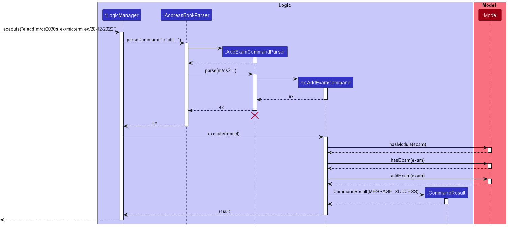

* Table of Contents
  {:toc}

--------------------------------------------------------------------------------------------------------------------

## **Acknowledgements**

* {list here sources of all reused/adapted ideas, code, documentation, and third-party libraries -- include links to the original source as well}

--------------------------------------------------------------------------------------------------------------------

## **Setting up, getting started**

Refer to the guide [_Setting up and getting started_](SettingUp.md).

--------------------------------------------------------------------------------------------------------------------

## **Design**

:bulb: **Tip:** The `.puml` files used to create diagrams in this document can be found in the [diagrams](https://github.com/se-edu/addressbook-level3/tree/master/docs/diagrams/) folder. Refer to the [_PlantUML Tutorial_ at se-edu/guides](https://se-education.org/guides/tutorials/plantUml.html) to learn how to create and edit diagrams.

### Architecture

The ***Architecture Diagram*** given above explains the high-level design of the App.

Given below is a quick overview of main components and how they interact with each other.

**Main components of the architecture**

**`Main`** has two classes called [`Main`](https://github.com/se-edu/addressbook-level3/tree/master/src/main/java/seedu/address/Main.java) and [`MainApp`](https://github.com/se-edu/addressbook-level3/tree/master/src/main/java/seedu/address/MainApp.java). It is responsible for,
* At app launch: Initializes the components in the correct sequence, and connects them up with each other.
* At shut down: Shuts down the components and invokes cleanup methods where necessary.

[**`Commons`**](#common-classes) represents a collection of classes used by multiple other components.

The rest of the App consists of four components.

* [**`UI`**](#ui-component): The UI of the App.
* [**`Logic`**](#logic-component): The command executor.
* [**`Model`**](#model-component): Holds the data of the App in memory.
* [**`Storage`**](#storage-component): Reads data from, and writes data to, the hard disk.

**How the architecture components interact with each other**

The *Sequence Diagram* below shows how the components interact with each other for the scenario where the user issues the command `delete 1`.

Each of the four main components (also shown in the diagram above),

* defines its *API* in an `interface` with the same name as the Component.
* implements its functionality using a concrete `{Component Name}Manager` class (which follows the corresponding API `interface` mentioned in the previous point.

For example, the `Logic` component defines its API in the `Logic.java` interface and implements its functionality using the `LogicManager.java` class which follows the `Logic` interface. Other components interact with a given component through its interface rather than the concrete class (reason: to prevent outside component's being coupled to the implementation of a component), as illustrated in the (partial) class diagram below.

The sections below give more details of each component.

### UI component

The **API** of this component is specified in [`Ui.java`](https://github.com/se-edu/addressbook-level3/tree/master/src/main/java/seedu/address/ui/Ui.java)

The UI consists of a `MainWindow` that is made up of parts e.g.`CommandBox`, `ResultDisplay`, `PersonListPanel`, `StatusBarFooter` etc. All these, including the `MainWindow`, inherit from the abstract `UiPart` class which captures the commonalities between classes that represent parts of the visible GUI.

The `UI` component uses the JavaFx UI framework. The layout of these UI parts are defined in matching `.fxml` files that are in the `src/main/resources/view` folder. For example, the layout of the [`MainWindow`](https://github.com/se-edu/addressbook-level3/tree/master/src/main/java/seedu/address/ui/MainWindow.java) is specified in [`MainWindow.fxml`](https://github.com/se-edu/addressbook-level3/tree/master/src/main/resources/view/MainWindow.fxml)

The `UI` component,

* executes user commands using the `Logic` component.
* listens for changes to `Model` data so that the UI can be updated with the modified data.
* keeps a reference to the `Logic` component, because the `UI` relies on the `Logic` to execute commands.
* depends on some classes in the `Model` component, as it displays `Person` object residing in the `Model`.

### Logic component

**API** : [`Logic.java`](https://github.com/se-edu/addressbook-level3/tree/master/src/main/java/seedu/address/logic/Logic.java)

Here's a (partial) class diagram of the `Logic` component:

How the `Logic` component works:
1. When `Logic` is called upon to execute a command, it uses the `AddressBookParser` class to parse the user command.
1. This results in a `Command` object (more precisely, an object of one of its subclasses e.g., `AddCommand`) which is executed by the `LogicManager`.
1. The command can communicate with the `Model` when it is executed (e.g. to add a person).
1. The result of the command execution is encapsulated as a `CommandResult` object which is returned back from `Logic`.

The Sequence Diagram below illustrates the interactions within the `Logic` component for the `execute("delete 1")` API call.

:information_source: **Note:** The lifeline for `DeleteCommandParser` should end at the destroy marker (X) but due to a limitation of PlantUML, the lifeline reaches the end of diagram.

Here are the other classes in `Logic` (omitted from the class diagram above) that are used for parsing a user command:

How the parsing works:
* When called upon to parse a user command, the `AddressBookParser` class creates an `XYZCommandParser` (`XYZ` is a placeholder for the specific command name e.g., `AddCommandParser`) which uses the other classes shown above to parse the user command and create a `XYZCommand` object (e.g., `AddCommand`) which the `AddressBookParser` returns back as a `Command` object.
* All `XYZCommandParser` classes (e.g., `AddCommandParser`, `DeleteCommandParser`, ...) inherit from the `Parser` interface so that they can be treated similarly where possible e.g, during testing.

### Model component
**API** : [`Model.java`](https://github.com/se-edu/addressbook-level3/tree/master/src/main/java/seedu/address/model/Model.java)

The `Model` component,

* stores the address book data i.e., all `Person` objects (which are contained in a `UniquePersonList` object).
* stores the currently 'selected' `Person` objects (e.g., results of a search query) as a separate _filtered_ list which is exposed to outsiders as an unmodifiable `ObservableList<Person>` that can be 'observed' e.g. the UI can be bound to this list so that the UI automatically updates when the data in the list change.
* stores a `UserPref` object that represents the user’s preferences. This is exposed to the outside as a `ReadOnlyUserPref` objects.
* does not depend on any of the other three components (as the `Model` represents data entities of the domain, they should make sense on their own without depending on other components)

:information_source: **Note:** An alternative (arguably, a more OOP) model is given below. It has a `Tag` list in the `AddressBook`, which `Person` references. This allows `AddressBook` to only require one `Tag` object per unique tag, instead of each `Person` needing their own `Tag` objects. 

### Storage component

**API** : [`Storage.java`](https://github.com/se-edu/addressbook-level3/tree/master/src/main/java/seedu/address/storage/Storage.java)

The `Storage` component,
* can save both address book data and user preference data in json format, and read them back into corresponding objects.
* inherits from both `AddressBookStorage` and `UserPrefStorage`, which means it can be treated as either one (if only the functionality of only one is needed).
* depends on some classes in the `Model` component (because the `Storage` component's job is to save/retrieve objects that belong to the `Model`)

### Common classes

Classes used by multiple components are in the `seedu.addressbook.commons` package.

--------------------------------------------------------------------------------------------------------------------

## **Implementation**

This section describes some noteworthy details on how certain features are implemented.

### Sort Task Command

#### How the feature works

The `sort` command allows users to sort the task list by priority status,
deadline, module code and task description with ease. The sort command operates
directly on the `ObservableList` stored under `DistinctTaskList` in `AddressBook` so the
`ObservableList` in `DistinctTaskList` will be permanently sorted to the criteria.
* When sorting by priority, all tasks with `HIGH` priority status will be positioned at the top of the 
displayed task list, followed by `MEDIUM`, `LOW` and 
lastly all tasks with no priority tags.
* When sorting by deadline, all tasks with deadline tags will be displayed 
at the top of the displayed task list with the task with the earliest deadline
being displayed at the top. All the remaining tasks with no deadline tags will
be displayed below all tasks with deadline tags.

`sort` command adheres to the following format: `sort c/CRITERIA`

`CRITERIA` can be one of the following criteria:
* `priority`
* `deadline`
* `module`
* `description`

#### Sequence of the SortTaskCommand

Shown below is a sequence diagram of what occurs when the `excute` method of
`LogicManager` is invoked.

**Sequence of actions made when `execute` method of `LogicManager` is invoked**
1. `LogicManager` object takes in `"sort c/priority"` which the user keys into the command line. 
2. `LogicManager` object calls the `parseCommand` of the `AddressBookParser` object created during the initialisation 
of `LogicManager` object and passes the `"sort c/priority"` as the arguments of `parseCommand`
3. `SortTaskCommandParser` object is created during execution of `parseCommand` of `AddressBookParser`
4. `SortTaskCommandParser` object calls its `parse` method with `"c/priority"` being passed in as argument.
5. `SortTaskCommand` object called st is created from `SortTaskCommandParser`
6. `excute` method of `SortTaskCommand` object st is invoked and model is passed in as
an argument.
7. `sortTaskList` method of `Model` is called with `"priority"` being passed as an
argument of the method
8. `execute` method of `SortTaskCommand` object returns a `CommandResult` object with
the sorted successfully message as argument to the `LogicManager` object. 

### Filter feature

#### Implementation

The proposed filter mechanism is facilitated by `FilterPredicate`. It implements `Predicate` with module, completion status and link status conditions, stored as `module`, `isCompleted` and `isLinked`. Additionally, it implements the following operations:

* `FilterPredicate#test(Task)` — Checks if a task fulfils the given module and/or completion status and/or link status requirements.
* `FilterPredicate#toString()` — Returns a string representing all the conditions used during the filter operation.

These operations are exposed in the `Model` interface as `Model#updateFilteredTaskList`.

Given below is an example usage scenario and how the filter mechanism behaves at each step.

Step 1. The user launches the application. The `AddressBook` will be initialized with the initial address book state.

Step 2. The user executes `filter m/CS2103T c/y l/n` command to filter the task list to show all CS2103T tasks that have been marked complete and are not linked to any exam. The `filter` command calls `Model#UpdateFilteredTaskList`, causing the task list to be filtered with the given conditions for `module`, `isCompleted` and `isLinked`.

:information_source: **Note:** If the `module`, `isCompleted` and `isLinked` input is invalid, there will be an error message shown and the address book will continue to show the current `taskFilteredList`.

Step 3. The user executes `filter m/CS2103T c/n` command to filter the task list to show all CS2103T tasks that have been marked incomplete. The updated `taskFilterdList` will be filtered based on all the tasks, not only the ones which have been filtered out in the previous filter command from step 2.

Step 4. The user executes `mark 1`. The first task is no longer in `taskFilteredList` since its `isCompleted` is now false and no longer fulfils the conditions.

The following sequence diagram shows how the filter operation works:

:information_source: **Note:** The lifeline for `FilterCommand` should end at the destroy marker (X) but due to a limitation of PlantUML, the lifeline reaches the end of diagram.

The following activity diagram summarizes what happens when a user executes the filter command:

#### Design considerations:

**Aspect: User command input format:**

* **Alternative 1 (current choice):** Optional condition fields.
    * Pros: Easier to extend and add more conditions.
    * Cons: Harder to implement.

* **Alternative 2:** Compulsory condition fields.
    * Pros: Easier to implement.
    * Cons: Users have to type unnecessary details in command.

### Mark Task feature

#### Implementation

The proposed mark/unmark mechanism is facilitated by `MarkCommand`. It extends `Command` with a target index, stored internally as an `Index`. Additionally, it implements the following operations:

* `MarkCommand#execute()` — Executes the mark command 

This operation is exposed in the `Command` abstract class as `Command#execute()`.

Given below is an example of how the mark mechanism works.

1. The user executes the `mark 1` command. 
2. The `MarkCommand` calls `Model#getFilteredTaskList()` which returns the filtered list of the tasks.
3. The `MarkCommand` command calls `List<Task>#get()` which returns the task at index 1 in the filtered list. 
4. Then, `MarkCommand` command calls `Task#mark()` to create a marked copy of the task.
5. This marked task has all fields similar to the original task, except its `TaskStatus` is `COMPLETE`. 
6. Then, `MarkCommand` command calls `Model#replaceTask()` which sets the first task in `Model#tasks` to the marked task.
 
The following sequence diagram shows how the mark operation works:

:information_source: **Note:** The lifeline for `MarkCommandParser` should end at the destroy marker (X) but due to a limitation of PlantUML, the lifeline reaches the end of diagram.
  

:information_source: **Note:** If the command has an invalid format or the index is greater than the number of tasks shown, `Model#replaceTask()` will not be called, so the task list will not change. If so, `MarkCommand` will return an error to the user rather than attempting to perform the command.
  
The `UnmarkCommand` works the same — the only difference is that it calls `Task#unmark()`, which returns a copy of the task with `TaskStatus` set to `INCOMPLETE`.
  
The following activity diagram summarizes what happens when a user executes a new mark command:
  

### \[Proposed\] Undo/redo feature

#### Proposed Implementation

The proposed undo/redo mechanism is facilitated by `VersionedAddressBook`. It extends `AddressBook` with an undo/redo history, stored internally as an `addressBookStateList` and `currentStatePointer`. Additionally, it implements the following operations:

* `VersionedAddressBook#commit()` — Saves the current address book state in its history.
* `VersionedAddressBook#undo()` — Restores the previous address book state from its history.
* `VersionedAddressBook#redo()` — Restores a previously undone address book state from its history.

These operations are exposed in the `Model` interface as `Model#commitAddressBook()`, `Model#undoAddressBook()` and `Model#redoAddressBook()` respectively.

Given below is an example usage scenario and how the undo/redo mechanism behaves at each step.

Step 1. The user launches the application for the first time. The `VersionedAddressBook` will be initialized with the initial address book state, and the `currentStatePointer` pointing to that single address book state.

Step 2. The user executes `delete 5` command to delete the 5th person in the address book. The `delete` command calls `Model#commitAddressBook()`, causing the modified state of the address book after the `delete 5` command executes to be saved in the `addressBookStateList`, and the `currentStatePointer` is shifted to the newly inserted address book state.

Step 3. The user executes `add n/David …​` to add a new person. The `add` command also calls `Model#commitAddressBook()`, causing another modified address book state to be saved into the `addressBookStateList`.

:information_source: **Note:** If a command fails its execution, it will not call `Model#commitAddressBook()`, so the address book state will not be saved into the `addressBookStateList`.

Step 4. The user now decides that adding the person was a mistake, and decides to undo that action by executing the `undo` command. The `undo` command will call `Model#undoAddressBook()`, which will shift the `currentStatePointer` once to the left, pointing it to the previous address book state, and restores the address book to that state.

:information_source: **Note:** If the `currentStatePointer` is at index 0, pointing to the initial AddressBook state, then there are no previous AddressBook states to restore. The `undo` command uses `Model#canUndoAddressBook()` to check if this is the case. If so, it will return an error to the user rather
than attempting to perform the undo.

The following sequence diagram shows how the undo operation works:

:information_source: **Note:** The lifeline for `UndoCommand` should end at the destroy marker (X) but due to a limitation of PlantUML, the lifeline reaches the end of diagram.

The `redo` command does the opposite — it calls `Model#redoAddressBook()`, which shifts the `currentStatePointer` once to the right, pointing to the previously undone state, and restores the address book to that state.

:information_source: **Note:** If the `currentStatePointer` is at index `addressBookStateList.size() - 1`, pointing to the latest address book state, then there are no undone AddressBook states to restore. The `redo` command uses `Model#canRedoAddressBook()` to check if this is the case. If so, it will return an error to the user rather than attempting to perform the redo.

Step 5. The user then decides to execute the command `list`. Commands that do not modify the address book, such as `list`, will usually not call `Model#commitAddressBook()`, `Model#undoAddressBook()` or `Model#redoAddressBook()`. Thus, the `addressBookStateList` remains unchanged.

Step 6. The user executes `clear`, which calls `Model#commitAddressBook()`. Since the `currentStatePointer` is not pointing at the end of the `addressBookStateList`, all address book states after the `currentStatePointer` will be purged. Reason: It no longer makes sense to redo the `add n/David …​` command. This is the behavior that most modern desktop applications follow.

The following activity diagram summarizes what happens when a user executes a new command:

#### Design considerations:

**Aspect: How undo & redo executes:**

* **Alternative 1 (current choice):** Saves the entire address book.
    * Pros: Easy to implement.
    * Cons: May have performance issues in terms of memory usage.

* **Alternative 2:** Individual command knows how to undo/redo by
  itself.
    * Pros: Will use less memory (e.g. for `delete`, just save the person being deleted).
    * Cons: We must ensure that the implementation of each individual command are correct.

_{more aspects and alternatives to be added}_

### \[Proposed\] Data archiving

_{Explain here how the data archiving feature will be implemented}_

### \[Proposed\] Add Exam Command

### Add Exam Command

#### How the feature works
The `addExam` command allows users to add an exam to the `DistinctExamList` 
in `AddressBook`, with the following fields of exam module, exam description, 
and exam date.

#### Sequence of the AddExamCommand
**Sequence of actions made when `execute` method of `LogicManager` is invoked**

Step 1. The user launches the application. 

Step 2. The user types an `addExam` command. 

Step 3. The command calls `LogicManager#execute()` with 
the command input as the argument, which then calls `AddressBookParser#parseCommand() ` 
with command input as the argument. 

Step 4. `AddressBookParser#parseCommand()` matches the command to be 
a `addExam` command through the command word, which then calls `AddExamCommandParser#parse()`.

Step 5. `AddExamCommandParser#parse()` then parses the command to get `Module`, `ExamDescription` 
and the `ExamDate` objects of the exam by calling their respective `ParserUtil` parse methods. These 
methods will check if the inputted exam description, exam date and module are valid. If it is valid,
the object will be created. Otherwise, exception will be thrown. Then, an `Exam` object is created 
with the three objects as arguments. 

Step 6. `AddExamCommandParser#parse()` returns a new `AddExamCommand` object created with the `Exam`
object created previously as the argument in the constructor. `LogicManager` class will call 
`AddExamCommand#execute()` with a `Model` object as the argument. 

Step 7. `AddExamCommand#execute()` will check if model already contains the module of the exam 
through `Model#hasModule()`. If it does not contain the module, an exception will be thrown to 
indicate the module is not found. It will also check if the model already contains the exam 
through `Model#hasExam()`. If it contains the exam, an exception will be thrown 
to indicate that the exam has already been added.

Otherwise, it will call `ModelManager#addExam()` with the exam as the argument, 
which calls `AddressBook#addExam()` that will add the exam to the `DistinctExamList`, 
which stores all the exams.`AddExamCommand#execute()` method returns a `CommandResult` 
object to display that the exam was successfully added.

--------------------------------------------------------------------------------------------------------------------

## **Documentation, logging, testing, configuration, dev-ops**

* [Documentation guide](Documentation.md)
* [Testing guide](Testing.md)
* [Logging guide](Logging.md)
* [Configuration guide](Configuration.md)
* [DevOps guide](DevOps.md)

--------------------------------------------------------------------------------------------------------------------

## **Appendix: Requirements**

### Product scope

**Target user profile**:

* has a need to manage a significant number of module tasks
* prefer desktop apps over other types
* can type fast
* prefers typing to mouse interactions
* is reasonably comfortable using CLI apps

**Value proposition**: manage module tasks faster than a typical mouse/GUI driven app

### User stories

Priorities: High (must have) - `* * *`, Medium (nice to have) - `* *`, Low (unlikely to have) - `*`

| Priority | As a …​     | I want to …​                                  | So that I can…​                                         |
|----------|-------------|-----------------------------------------------|---------------------------------------------------------|
| `* * *`  | NUS student | view the list of tasks I need to complete     | start implementing those tasks.                         |
| `* * *`  | NUS student | create the tasks in the tasklist              | add the list of tasks that need to be completed         |
| `* * *`  | NUS student | mark a task as complete                       | have a better idea of what I have completed.            |
| `* *`    | NUS student | tag the priority of the tasks in the tasklist | prioritise the task that I would like to complete first |
| `* * *`  | NUS student | delete the tasks in my tasklist               | remove them if added wrongly.                           |
| `* * *`  | NUS student | delete the modules in my modulelist           | remove them if added wrongly.                           |
| `* * *`  | NUS student | edit the modules in my modulelist             | remove them if added wrongly.                           |

*{More to be added}*

### Use cases

(For all use cases below, the **System** is the `MODPRO` and the **Actor** is the `NUS student`, unless specified otherwise)

**Use case: Add a task into task list**

**MSS**

1. User requests to add a task
2. MODPRO shows the task added

   Use case ends.

**Extensions**

* 1a. The given description is empty.

    * 1a1. MODPRO shows an error message.

      Use case ends.

**Use case: List tasks in task list**

**MSS**
1. User requests to view tasks in the task list
2. MODPRO displays the list of tasks

   Use case ends.

**Use case: Mark a task as complete**

**MSS**
1. User requests to mark a specific task as complete
2. MODPRO marks the task

   Use case ends.

**Extensions**

* 1a. The given index is invalid.

    * 1a1. MODPRO shows an error message..

      Use case ends.

**Use Case: Tag the priority to complete task**

**MSS**
1. NUS student requests to tag the priority of task in task list
2. MODPRO adds the tag to the task in the task list

   Use case ends.

**Extensions**
* 1a. The given priority status for the task is invalid
    * 1a1. MODPRO shows an error message  
      Use case ends.

**Use case: Delete a task from the task list**

**MSS**
1. User requests to delete a specific task in the task list
2. MODPRO deletes the task

   Use case ends.

**Extensions**
* 1a. The given index is invalid.
    * 1a1. MODPRO shows an error message.  
      Use case ends.

**Use case: Delete a module from the module list**

**MSS**
1. User requests to delete a specific module in the module list
2. MODPRO deletes the module

   Use case ends.

**Extensions**
* 1a. The given index is invalid.
    * 1a1. MODPRO shows an error message.  
      Use case ends.
* 1b. The module at the given index is tied to multiple tasks thus cannot be deleted
    * 1a1. MODPRO shows an error message.  
      Use case ends.

**Use case: Edit a module in the module list**

**MSS**
1. User requests to edit a specific module in the module list
2. MODPRO edits the module

   Use case ends.

**Extensions**
* 1a. The given index is invalid.
    * 1a1. MODPRO shows an error message.  
      Use case ends.
* 1b. The module at the given index is tied to multiple tasks thus cannot be edited
    * 1b1. MODPRO shows an error message.  
      Use case ends.
* 1c. The given module code is invalid 
    * 1c1. MODPRO shows an error message.  
      Use case ends.

*{More to be added}*

### Non-Functional Requirements

1.  Should work on any _mainstream OS_ as long as it has Java `11` or above installed.
2.  Should be able to hold up to 1000 tasks without a noticeable sluggishness in performance for typical usage.
3.  A user with above average typing speed for regular English text (i.e. not code, not system admin commands) should be able to accomplish most of the tasks faster using commands than using the mouse.

*{More to be added}*

### Glossary

* **Mainstream OS**: Windows, Linux, Unix, OS-X
--------------------------------------------------------------------------------------------------------------------

## **Appendix: Instructions for manual testing**

Given below are instructions to test the app manually.

:information_source: **Note:** These instructions only provide a starting point for testers to work on;
testers are expected to do more *exploratory* testing.

### Launch and shutdown

1. Initial launch

    1. Download the jar file and copy into an empty folder

    1. Double-click the jar file Expected: Shows the GUI with a set of sample contacts. The window size may not be optimum.

1. Saving window preferences

    1. Resize the window to an optimum size. Move the window to a different location. Close the window.

    1. Re-launch the app by double-clicking the jar file. 
       Expected: The most recent window size and location is retained.

1. _{ more test cases …​ }_

### Deleting a person

1. Deleting a person while all persons are being shown

    1. Prerequisites: List all persons using the `list` command. Multiple persons in the list.

    1. Test case: `delete 1` 
       Expected: First contact is deleted from the list. Details of the deleted contact shown in the status message. Timestamp in the status bar is updated.

    1. Test case: `delete 0` 
       Expected: No person is deleted. Error details shown in the status message. Status bar remains the same.

    1. Other incorrect delete commands to try: `delete`, `delete x`, `...` (where x is larger than the list size) 
       Expected: Similar to previous.

1. _{ more test cases …​ }_

### Saving data

1. Dealing with missing/corrupted data files

    1. _{explain how to simulate a missing/corrupted file, and the expected behavior}_

1. _{ more test cases …​ }_
