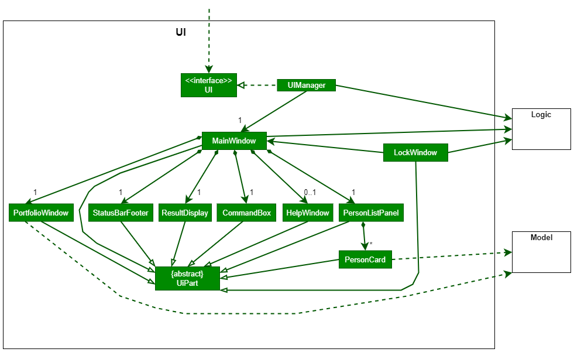
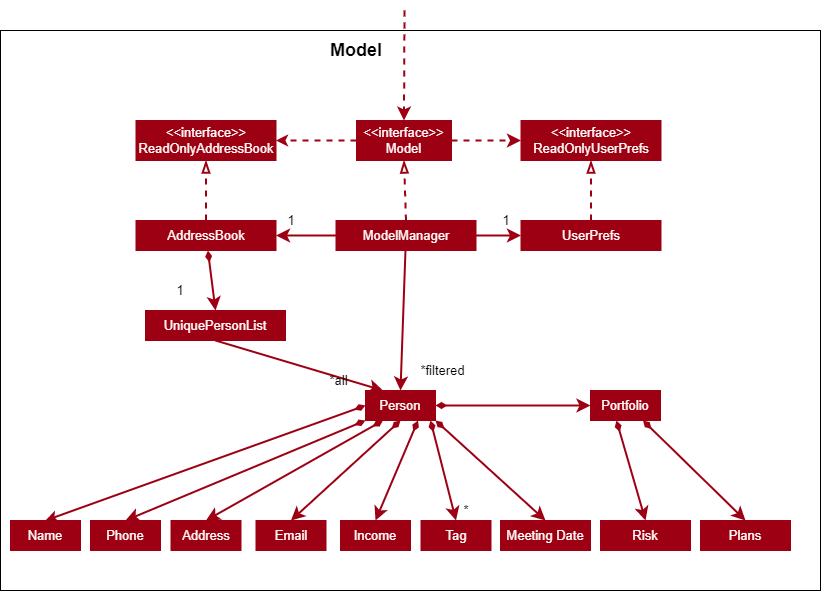
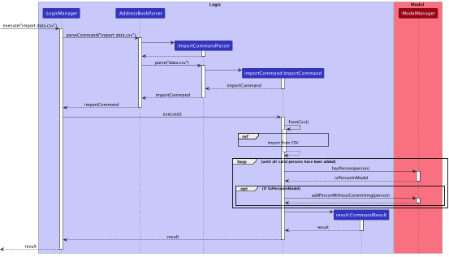

Table of Contents

1. [Acknowledgements](#1-acknowledgements)
2. [Setting up, getting started](#2-setting-up-getting-started)
3. [Design](#3-design)  
   3.1. [Architecture](#31-architecture)  
   3.2. [UI component](#32-ui-component)   
   3.3. [Logic component](#33-logic-component)  
   3.4. [Model component](#34-model-component)   
   3.5. [Storage component](#35-storage-component)   
   3.6. [Common classes](#36-common-classes)
4. [Implementation](#4-implementation)   
   4.1. [Import command](#41-import-command)
5. [Documentation, logging, testing, configuration, dev-ops](#5-documentation-logging-testing-configuration-dev-ops)
6. [Appendix: Requirements](#6-appendix-requirements)   
   6.1. [Product scope](#61-product-scope)  
   6.2. [User stories](#62-user-stories)   
   6.3. [Use cases](#63-use-cases)   
   6.4. [Non-Functional Requirements](#64-non-functional-requirements)   
   6.5. [Glossary](#65-glossary)
7. [Appendix: Instructions for manual testing](#7-appendix-instructions-for-manual-testing)   
   7.1. [Launch and shutdown](#71-launch-and-shutdown)   
   7.2. [Deleting a client](#72-deleting-a-client)  
   7.3. [Saving data](#73-saving-data)

--------------------------------------------------------------------------------------------------------------------

## **1. Acknowledgements**

This project is based on the [AddressBook Level-3](https://github.com/nus-cs2103-AY2223S1/tp) project created by the [SE-EDU initiative](https://se-education.org).

Libraries used:

* [JavaFX](https://openjfx.io/)
* [Jackson](https://github.com/FasterXML/jackson)
* [JUnit5](https://github.com/junit-team/junit5)
* [OpenCSV](https://opencsv.sourceforge.net/)
* [Password4j](https://password4j.com/)
* [zxcvbn4j](https://github.com/nulab/zxcvbn4j)

--------------------------------------------------------------------------------------------------------------------

## **2. Setting up, getting started**

Refer to the guide [_Setting up and getting started_](SettingUp.md).

--------------------------------------------------------------------------------------------------------------------

## **3. Design**

:bulb: **Tip:** The `.puml` and `.drawio` files used to create diagrams in this document can be found in
the [diagrams](https://github.com/AY2223S1-CS2103T-F11-3/tp/tree/master/docs/diagrams) folder. Refer to the [_PlantUML
Tutorial_ at se-edu/guides](https://se-education.org/guides/tutorials/plantUml.html) to learn how to create and edit
diagrams.

### 3.1. Architecture

The ***Architecture Diagram*** given above explains the high-level design of the App.

Given below is a quick overview of main components and how they interact with each other.

**Main components of the architecture**

**`Main`** has two classes
called [`Main`](https://github.com/AY2223S1-CS2103T-F11-3/tp/blob/master/src/main/java/seedu/address/Main.java)
and [`MainApp`](https://github.com/AY2223S1-CS2103T-F11-3/tp/blob/master/src/main/java/seedu/address/MainApp.java). It
is responsible for,

* At app launch: Initializes the components in the correct sequence, and connects them up with each other.
* At shut down: Shuts down the components and invokes cleanup methods where necessary.

[**`Commons`**](#36-common-classes) represents a collection of classes used by multiple other components.

The rest of the App consists of four components.

* [**`UI`**](#32-ui-component): The UI of the App.
* [**`Logic`**](#33-logic-component): The command executor.
* [**`Model`**](#34-model-component): Holds the data of the App in memory.
* [**`Storage`**](#35-storage-component): Reads data from, and writes data to, the hard disk.

**How the architecture components interact with each other**

The *Sequence Diagram* below shows how the components interact with each other for the scenario where the user issues
the command `delete 1`.

Each of the four main components (also shown in the diagram above),

* defines its *API* in an `interface` with the same name as the Component.
* implements its functionality using a concrete `{Component Name}Manager` class (which follows the corresponding
  API `interface` mentioned in the previous point.

For example, the `Logic` component defines its API in the `Logic.java` interface and implements its functionality using
the `LogicManager.java` class which follows the `Logic` interface. Other components interact with a given component
through its interface rather than the concrete class (reason: to prevent outside component's being coupled to the
implementation of a component), as illustrated in the (partial) class diagram below.

The sections below give more details of each component.

### 3.2. UI component

The **API** of this component is specified
in [`Ui.java`](https://github.com/AY2223S1-CS2103T-F11-3/tp/blob/master/src/main/java/seedu/address/ui/Ui.java)

The UI consists of a `MainWindow` that is made up of parts e.g.`CommandBox`, `ResultDisplay`, `PersonListPanel`
, `StatusBarFooter` etc. All these, including the `MainWindow`, inherit from the abstract `UiPart` class which captures
the commonalities between classes that represent parts of the visible GUI.

The `UI` component uses the JavaFx UI framework. The layout of these UI parts are defined in matching `.fxml` files that
are in the `src/main/resources/view` folder. For example, the layout of
the [`MainWindow`](https://github.com/AY2223S1-CS2103T-F11-3/tp/blob/master/src/main/java/seedu/address/ui/MainWindow.java)
is specified
in [`MainWindow.fxml`](https://github.com/AY2223S1-CS2103T-F11-3/tp/blob/master/src/main/resources/view/MainWindow.fxml)

The `UI` component,

* executes user commands using the `Logic` component.
* listens for changes to `Model` data so that the UI can be updated with the modified data.
* keeps a reference to the `Logic` component, because the `UI` relies on the `Logic` to execute commands.
* depends on some classes in the `Model` component, as it displays `Person` object residing in the `Model`.

### 3.3. Logic component

**API** : [`Logic.java`](https://github.com/AY2223S1-CS2103T-F11-3/tp/blob/master/src/main/java/seedu/address/logic/Logic.java)

Here's a (partial) class diagram of the `Logic` component:

How the `Logic` component works:

1. When `Logic` is called upon to execute a command, it uses the `AddressBookParser` class to parse the user command.
2. This results in a `Command` object (more precisely, an object of one of its subclasses e.g., `AddCommand`) which is
   executed by the `LogicManager`.
3. The command can communicate with the `Model` when it is executed (e.g. to add a person).
4. The result of the command execution is encapsulated as a `CommandResult` object which is returned back from `Logic`.

The Sequence Diagram below illustrates the interactions within the `Logic` component for the `execute("delete 1")` API
call.

:information_source: **Note:** The lifeline for `DeleteCommandParser` should end at the destroy marker (X) but due to a limitation of PlantUML, the lifeline reaches the end of diagram.

Here are the other classes in `Logic` (omitted from the class diagram above) that are used for parsing a user command:

How the parsing works:

* When called upon to parse a user command, the `AddressBookParser` class creates an `XYZCommandParser` (`XYZ` is a
  placeholder for the specific command name e.g., `AddCommandParser`) which uses the other classes shown above to parse
  the user command and create a `XYZCommand` object (e.g., `AddCommand`) which the `AddressBookParser` returns back as
  a `Command` object.
* All `XYZCommandParser` classes (e.g., `AddCommandParser`, `DeleteCommandParser`, ...) inherit from the `Parser`
  interface so that they can be treated similarly where possible e.g, during testing.

### 3.4. Model component

**API** : [`Model.java`](https://github.com/AY2223S1-CS2103T-F11-3/tp/blob/master/src/main/java/seedu/address/model/Model.java)

The `Model` component,

* stores the address book data i.e., all `Person` objects (which are contained in a `UniquePersonList` object).
* stores the currently 'selected' `Person` objects (e.g., results of a search query) as a separate _filtered_ list which
  is exposed to outsiders as an unmodifiable `ObservableList<Person>` that can be 'observed' e.g. the UI can be bound to
  this list so that the UI automatically updates when the data in the list change.
* stores a `UserPref` object that represents the user’s preferences. This is exposed to the outside as
  a `ReadOnlyUserPref` objects.
* does not depend on any of the other three components (as the `Model` represents data entities of the domain, they
  should make sense on their own without depending on other components)

:information_source: **Note:** An alternative (arguably, a more OOP) model is given below. It has a `Tag` list in the `AddressBook`, which `Person` references. This allows `AddressBook` to only require one `Tag` object per unique tag, instead of each `Person` needing their own `Tag` objects. 

### 3.5. Storage component

**API** : [`Storage.java`](https://github.com/AY2223S1-CS2103T-F11-3/tp/blob/master/src/main/java/seedu/address/storage/Storage.java)

The `Storage` component,

* can save both address book data and user preference data in `JSON` format, and read them back into corresponding
  objects.
* has a `Storage` interface which inherits from both `AddressBookStorage` and `UserPrefStorage`, which means it can be treated as either one (if only
  the functionality of only one is needed).
* depends on some classes in the `Model` component (because the `Storage` component's job is to save/retrieve objects
  that belong to the `Model`)
* has `CsvAdaptedPerson` which is used to save `Person`s in the address book in `CSV` format, and read them back into corresponding
  `Person`s.

### 3.6. Common classes

Classes used by multiple components are in the `seedu.addressbook.commons` package.

--------------------------------------------------------------------------------------------------------------------

## **4. Implementation**

This section describes some noteworthy details on how certain features are implemented.

### 4.1. Import command

#### Current Implementation

The import command mainly relies on the following classes:

* `ImportCommand`
* `AddressBookParser`
* `ImportCommandParser`
* `ParserUtil`
* `CsvAdaptedPerson`
* `StringToTag`

`CsvToBeanBuilder` is provided by the OpenCSV library.

1. The user executes the `import` command while providing a path as an argument.
2. `AddressBookParser#parseCommand()` is called, which creates and returns a new `ImportCommandParser` that parses the
   provided path.
3. `ImportCommandParser#parse()` is called, which calls `ParserUtil#parseImportPath()` to parse the provided path.
4. `ParserUtil` checks if the path is to a `JSON` or `CSV` file, and if the file is readable. If the path is valid, it
   returns the path.
5. `ImportCommandParser` creates and returns a new `ImportCommand` using the returned path.
6. `ImportCommand#execute()` is called.
    * If the path is to a `JSON` file, `ImportCommand` creates a new `JsonAddressBookStorage` using the path, then uses
      it to read and add `Person`s to the `Model`.
    * If the path is to a `CSV` file, `ImportCommand` creates a new `CsvToBeanBuilder` using the path, then uses it to
      obtain a list of `CsvAdaptedPerson`s. `StringToTag#convertToRead()` is called by `CsvToBeanBuilder` to convert
      strings from the `CSV` file to `Tag`s. `CsvAdaptedPerson#toModelType()` is called to convert
      each `CsvAdaptedPerson` to a `Person` before adding them to the `Model`.

The following sequence diagram shows how the import command works:

#### Design considerations:

Chose to use OpenCSV to read `CSV` files to avoid reinventing the wheel.

*{More to be added}*

--------------------------------------------------------------------------------------------------------------------

## **5. Documentation, logging, testing, configuration, dev-ops**

* [Documentation guide](Documentation.md)
* [Testing guide](Testing.md)
* [Logging guide](Logging.md)
* [Configuration guide](Configuration.md)
* [DevOps guide](DevOps.md)

--------------------------------------------------------------------------------------------------------------------

## **6. Appendix: Requirements**

### 6.1. Product scope

**Target user profile**:

* private financial advisors
* require strong privacy
* has a need to store contact information of customers or associates
* prefer desktop apps over other types
* can type fast
* prefers typing to mouse interactions
* is reasonably comfortable using CLI apps

**Value proposition**:

* make client data privacy more accessible to private Financial Advisors (FAs)
* FAs can assure their clients that their private information is being stored securely
* should only be used to access and store sensitive information
* targeted at FAs and does not include features that involve communication with their clients
* manage contacts faster than a typical mouse/GUI driven app
* FA's can shorten their time spent on doing administrative duties such as finding a client by showing all clients'
  details as well as portfolio in one glance

### 6.2. User stories

Priorities: High (must have) - `* * *`, Medium (nice to have) - `* *`, Low (unlikely to have) - `*`

| Priority | As a …                                     | I can …                                                                          | So that …                                                                           |
|----------|--------------------------------------------|----------------------------------------------------------------------------------|-------------------------------------------------------------------------------------|
| `* * *`  | relatively new user                        | add a new client                                                                 | I wont forget my new client's details                                               |
| `* * *`  | relatively new user                        | delete meeting dates for a client                                                | I can maintain an updated list of my clients’ details                               |
| `* * *`  | relatively new user                        | click a button                                                                   | I can exit the program easily                                                       |
| `* * *`  | relatively new user                        | save my clients' data                                                            | the data will not be lost after I close the application                             |
| `* * *`  | relatively new user                        | update meeting dates for a client                                                | I can maintain an updated list of my clients’ details                               |
| `* * *`  | relatively new user                        | read updated meeting dates for a client                                          | I can always know an updated list of my clients’ details                            |
| `* * *`  | relatively new user                        | list all clients                                                                 | I will be able to find and view all my clients easily                               |
| `* * *`  | relatively new user                        | view email addresses as part of client information                               | it would be easier for me to contact the respective client                          |
| `* * *`  | relatively new user                        | add a portfolio to my clients                                                    | I can store financial information about my client.                                  |
| `* * *`  | user ready to start using the app          | set up a password                                                                | I can lock the application                                                          |
| `* * *`  | new user                                   | lock the application                                                             | unauthorised parties cannot access my data                                          |
| `* *`    | new user                                   | receive feedback on my chosen password                                           | I can avoid using an insecure password                                              |
| `* *`    | user ready to start using the app          | import a set of data from another source                                         | I do not have to insert each client’s data one by one                               |
| `* *`    | user ready to start using the app          | purge all current data                                                           | I can get rid of sample/experimental data I used for exploring the app              |
| `* *`    | user who is a little familiar with the app | search for clients                                                               | I do not have to scroll through all of my clients’ details to find a certain client |
| `* *`    | user who is a little familiar with the app | sort meetings                                                                    | I can plan for the upcoming days                                                    |
| `* *`    | user who is a little familiar with the app | add additional notes that I have discussed with the client                       | I don't have to use another platform to store my notes regarding my client.         |
| `* *`    | user who is familiar with the app          | copy data to the clipboard with the click of a button or the use of a shortcut   | it is more convenient for me                                                        |
| `* *`    | returning user                             | import data from an existing save                                                | I can move between devices                                                          |
| `* *`    | returning user                             | export data to a `CSV` file                                                      | I can edit the data in other applications                                           |
| `*`      | user ready to start using the app          | view a list of instructions or commands built in by the app for easier reference | it would be easier for me to adapt to these commands                                |
| `*`      | user who is familiar with the app          | sort my clients into groups                                                      | I can keep them organised                                                           |
| `*`      | long-time user                             | view the dashboard as an overview for all clients                                | I can view the overall details of all my clients                                    |
| `*`      | long-time user                             | archive/hide unused data                                                         | I am not distracted by irrelevant data                                              |
| `*`      | long-time user                             | delete multiple “old” clients                                                    | I can easily identify clients I am still working with                               |
| `*`      | expert user                                | change settings within the application                                           | I can tweak it to exactly how I like it                                             |
| `*`      | returning user                             | delete all data quickly and securely when facing an emergency situation          | my data is not leaked                                                               |
| `*`      | potential user exploring the app           | see a brief overview of the privacy features available                           | I am aware of them                                                                  |

### 6.3. Use cases

(For all use cases below, the **System** is `FinBook` and the **Actor** is the `FA`, unless specified otherwise)

---

**Use case: UC 1 - Add a client**

**Precondition:** System is unlocked by actor

**MSS:**

1. User requests to add a client
2. System adds the client
3. Use case ends

---

**Use case: UC 2 - Modify client details**

**Precondition:** The list of clients is not empty

**MSS**

1. Actor requests to list clients
2. System shows a list of clients
3. Actor requests to modify a specific client in the list
4. System modifies the client’s details

**Extensions**

* 3a. The given index is invalid
    * 3a1. System shows an error message

  Use case resumes at step 2

---

**Use case: UC 3 - Search for client**

**Precondition:** There is/are client(s) saved

**MSS:**

1. Actor enters search keyword(s)
2. System shows a list of client(s)
3. Use case ends

**Extensions:**

* 2a. There is no client name that matches keyword(s)
    * 2a1. System shows empty list of clients

  Use case ends

---

**Use case:  UC 4 - Delete a client**

**Precondition:** There is/are client(s) saved

**MSS:**

1. Actor searches for client (**UC 3 - Search for client**)
2. System shows a list of client(s)
3. Actor requests to delete a specific client in the list
4. System deletes client’s details
5. Use case ends

**Extensions:**

* 2a. The list is empty.

Use case ends.

* 3a. The given index is invalid.

    * 3a1. System shows an error message.

  Use case resumes at step 2.
* 3b. The system asks for confirmation from actor
    * If actor gives confirmation, use case resumes at step 4
    * If actor does not confirm, use case resumes at step 5

---

**Use case: UC 5 - View private client details**

**Precondition:** System is unlocked by actor

**MSS:**

1. System shows a list of clients
2. Actor requests to view private client details of a client
3. System shows private client details of the client
4. Use case ends

**Extensions:**

* 2a. The system asks for confirmation from actor
    * If actor gives confirmation, use case resumes at step 3
    * If actor does not confirm, use case resumes at step 4

---

**Use case: UC 6 - Exit the application**

**MSS:**

1. Actor requests to exit the application
2. System saves the latest client details and terminates the program
3. Use case ends

**Extensions:**

* 1a. The system asks for confirmation from actor
    * If actor gives confirmation, use case resumes at step 2
    * If actor does not confirm, use case resumes at step 3

---

**Use case: UC 7 - Import external data**

**Precondition:** Actor has a valid file

**MSS:**

1. Actor requests to import data from file
2. System imports client data from file
3. Use case ends

**Extensions:**

* 1a. The given file is invalid
    * 1a.1 System shows an error message

  Use case resumes at step 1

---

**Use case : UC 8 - View a client**

**Precondition:** There is/are client(s) saved

**MSS:**

1. Actor finds the client they wish to view (**UC3: Search for Client**)
2. System shows a list of client(s)
3. Actor selects the client entry they wish to view
4. Actor is shown a page of details about the client
5. Use case ends

**Extensions:**

* 2a. The list is empty.

  Use case ends.
* 3b. The system asks for confirmation from actor
    * If actor gives confirmation, use case resumes at step 4
    * If actor does not confirm, use case resumes at step 5

---

**Use case: UC 9 - Import existing save file**

**Precondition:** Actor has used system previously and has a save file

**MSS:**

1. Actor requests to import data from save file
2. System imports client data from save file
3. Use case ends

**Extensions:**

* 1a. The given save file is invalid
    * 1a1. System shows an error message

  Use case resumes at step 1

---

*{More to be added}*

### 6.4. Non-Functional Requirements

* Should work on any _mainstream OS_ as long as it has Java `11` or above installed.
* Should be able to hold up to 1000 clients without a noticeable sluggishness (delay of < 0.3 seconds) in performance
  for typical usage.
* A user with above average typing speed for regular English text (i.e. not code, not system admin commands) should be
  able to accomplish most of the tasks faster using commands than using the mouse.
* Capacity / scalability: Able to store 1000 clients in 100 milliseconds.

*{More to be added}*

Notes about project scope:
FinBook is not required to handle interaction between client and FA.

### 6.5. Glossary

| Term                         | Meaning                                                                                                                                                                                                                                       |
|------------------------------|-----------------------------------------------------------------------------------------------------------------------------------------------------------------------------------------------------------------------------------------------|
| Mainstream OS                | Windows, Linux, Unix, OS-X                                                                                                                                                                                                                    |
| FA                           | Financial advisor                                                                                                                                                                                                                             |
| Client                       | A client is a person whose financial data and details are managed by an FA                                                                                                                                                                    |
| Private client detail        | A client detail that is sensitive and not meant to be shared with others                                                                                                                                                                      |
| System                       | FinBook                                                                                                                                                                                                                                       |
| CLI (Command-line Interface) | A application that users interact with by typing text.                                                                                                                                                                                        |
| Command                      | A sequence specified text typed by the user to perform an action.                                                                                                                                                                             |
| JSON                         | JSON (JavaScript Object Notation) is an open standard file format and data interchange format that uses human-readable text to store and transmit data objects consisting of attribute–value pairs and arrays (or other serializable values). |
| CSV                          | A comma-separated values (CSV) file is a delimited text file that uses a comma to separate values.                                                                                                                                            |
| Path                         | A path is a string of characters used to uniquely identify a location in a directory structure.                                                                                                                                               |

--------------------------------------------------------------------------------------------------------------------

## **7. Appendix: Instructions for manual testing**

Given below are instructions to test the app manually.

:information_source: **Note:** These instructions only provide a starting point for testers to work on;
testers are expected to do more *exploratory* testing.

### 7.1. Launch and shutdown

1. Initial launch

    1. Download the jar file and copy into an empty folder

    2. Double-click the jar file 
       Expected: Shows the GUI with a set of sample contacts. The window size may not be optimum.

2. Saving window preferences

    1. Resize the window to an optimum size. Move the window to a different location. Close the window.

    2. Re-launch the app by double-clicking the jar file. 
       Expected: The most recent window size and location is retained.

3. _{ more test cases …​ }_

### 7.2. Deleting a client

1. Deleting a client while all client are being shown

    1. Prerequisites: List all client using the `list` command. Multiple client in the list.

    2. Test case: `delete 1` 
       Expected: First client is deleted from the list. Details of the deleted client shown in the status message.
       Timestamp in the status bar is updated.

    3. Test case: `delete 1,2,5` 
       Expected: Client at index 1,2 and 5 is deleted form the list. Details of the deleted client shown
       in the status message.

    4. Test case: `delete 1-3` 
       Expected: Client at index 1,2 and 3 is deleted form the list. Details of the deleted client shown
       in the status message.

    5. Test case: `delete 0` 
       Expected: No person is deleted. Error details shown in the status message. Status bar remains the same.

    6. Other incorrect delete commands to try: `delete`, `delete x`, `delete 2-1`, `...` (where x is larger
       than the list size) 
       Expected: Similar to previous.

2. _{ more test cases …​ }_

### 7.3. Saving data

1. Dealing with missing/corrupted data files

    1. Test case: Importing an invalid JSON file    
       Expected: list of clients will be empty and nothing is shown

    2. Test case: Importing an invalid CSV file    
       Expected: list of clients will be empty and nothing is shown

    3. Test case: Editing the JSON file when the application is not launched with invalid datas    
       Expected: list of clients will be empty and nothing is shown

    4. Test case: Missing JSON file 
       Expected: Creates a new addressbook.json file when there is a new command entered

    5. _{explain how to simulate a missing/corrupted file, and the expected behavior}_

2. _{ more test cases …​ }_
