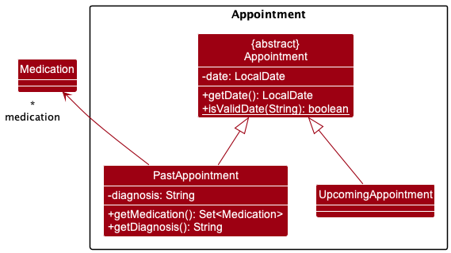
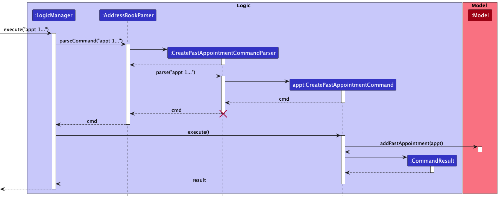
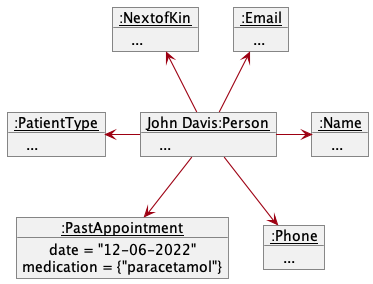
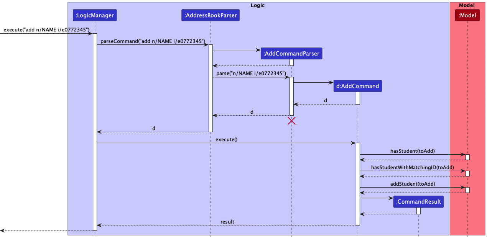

* Table of Contents
{:toc}

--------------------------------------------------------------------------------------------------------------------

## **Acknowledgements**

This project is based on the AddressBook-Level3 project created by the [SE-EDU initiative](https://se-education.org).

Third-party software used in this project:
* [JavaFx](https://openjfx.io/)
* [JUnit](https://junit.org/)
* [Gradle](https://gradle.org/)
* [CheckStyle](https://checkstyle.sourceforge.io/)
* [Codecov](https://codecov.io/)

--------------------------------------------------------------------------------------------------------------------

## **Introduction**

checkUp is a desktop application for medical practitioners to manage their patients' medical records. In this developer
guide, we will describe the architecture and design of the application. This guide is mainly for developers who wish to
enhance or create their own version of checkUp. You may refer to the [User Guide](UserGuide.md) for instructions on how
to use the application. 

### **Technologies**

checkUp is written in Java 11 and uses JavaFX to create the GUI. Gradle is used for building and managing the project.
Testing is done using JUnit.

### **Functions**

checkUp's features include creating, viewing and managing patients' medical records by storing data such as their:
* personal information;
* next-of-kin information;
* past appointment and visit history;
* upcoming appointments and visits;
* long-term medication prescriptions; and
* location in the hospital (for inpatients).

checkUp also allows users to:
* search for patients by:
  * name;
  * NRIC;
  * phone number;
  * email address; and
  * medical condition.
* view the total number of patients in the system; and
* view the total number of patients under specific long-term medication prescriptions.

--------------------------------------------------------------------------------------------------------------------

## **Setting up, getting started**

Refer to the guide [_Setting up and getting started_](SettingUp.md).

--------------------------------------------------------------------------------------------------------------------

## **Design**

:bulb: **Tip:** The `.puml` files used to create diagrams in this document can be found in the 
[diagrams](https://github.com/AY2223S1-CS2103T-W16-3/tp/blob/master/docs/diagrams/) folder. Refer to the 
[_PlantUML Tutorial_ at se-edu/guides](https://se-education.org/guides/tutorials/plantUml.html) to learn how to create 
and edit diagrams.

### Architecture

The ***Architecture Diagram*** given above explains the high-level design of the App.

Given below is a quick overview of main components and how they interact with each other.

**Main components of the architecture**

**`Main`** has two classes called [`Main`](https://github.com/AY2223S1-CS2103T-W16-3/tp/blob/master/src/main/java/seedu/address/Main.java) 
and [`MainApp`](https://github.com/AY2223S1-CS2103T-W16-3/tp/blob/master/src/main/java/seedu/address/MainApp.java). 
It is responsible for,
* At app launch: Initializes the components in the correct sequence, and connects them up with each other.
* At shut down: Shuts down the components and invokes cleanup methods where necessary.

[**`Commons`**](#common-classes) represents a collection of classes used by multiple other components.

The rest of the App consists of four components.

* [**`UI`**](#ui-component): The UI of the App.
* [**`Logic`**](#logic-component): The command executor.
* [**`Model`**](#model-component): Holds the data of the App in memory.
* [**`Storage`**](#storage-component): Reads data from, and writes data to, the hard disk.

**How the architecture components interact with each other**

The *Sequence Diagram* below shows how the components interact with each other for the scenario where the user issues  
the command `delete 1`.

Each of the four main components (also shown in the diagram above),

* defines its *API* in an `interface` with the same name as the Component.
* implements its functionality using a concrete `{Component Name}Manager` class (which follows the corresponding API 
  `interface` mentioned in the previous point.

For example, the `Logic` component defines its API in the `Logic.java` interface and implements its functionality using 
the `LogicManager.java` class which follows the `Logic` interface. Other components interact with a given component 
through its interface rather than the concrete class (reason: to prevent outside component's being coupled to the 
implementation of a component), as illustrated in the (partial) class diagram below.

The sections below give more details of each component.

### UI component

The **API** of this component is specified in [`Ui.java`](https://github.com/AY2223S1-CS2103T-W16-3/tp/blob/master/src/main/java/seedu/address/ui/Ui.java)

The UI consists of a `MainWindow` that is made up of parts e.g.`CommandBox`, `ResultDisplay`, `PersonListPanel`, 
`StatusBarFooter` etc. All these, including the `MainWindow`, inherit from the abstract `UiPart` class which captures 
the commonalities between classes that represent parts of the visible GUI.

The `UI` component uses the JavaFx UI framework. The layout of these UI parts are defined in matching `.fxml` files that
are in the `src/main/resources/view` folder. For example, the layout of the 
[`MainWindow`](https://github.com/AY2223S1-CS2103T-W16-3/tp/blob/master/src/main/java/seedu/address/ui/MainWindow.java) 
is specified in [`MainWindow.fxml`](https://github.com/AY2223S1-CS2103T-W16-3/tp/blob/master/src/main/resources/view/MainWindow.fxml)

The `UI` component,

* executes user commands using the `Logic` component.
* listens for changes to `Model` data so that the UI can be updated with the modified data.
* keeps a reference to the `Logic` component, because the `UI` relies on the `Logic` to execute commands.
* depends on some classes in the `Model` component, as it displays `Person` object residing in the `Model`.

### Logic component

**API** : [`Logic.java`](https://github.com/AY2223S1-CS2103T-W16-3/tp/blob/master/src/main/java/seedu/address/logic/Logic.java)

Here's a (partial) class diagram of the `Logic` component:

How the `Logic` component works:
1. When `Logic` is called upon to execute a command, it uses the `AddressBookParser` class to parse the user command.
2. This results in a `Command` object (more precisely, an object of one of its subclasses e.g., `AddCommand`) which is 
   executed by the `LogicManager`.
3. The command can communicate with the `Model` when it is executed (e.g. to add a person).
4. The result of the command execution is encapsulated as a `CommandResult` object which is returned back from `Logic`.

The Sequence Diagram below illustrates the interactions within the `Logic` component for the `execute("delete 1")` API call.

:information_source: **Note:** The lifeline for `DeleteCommandParser` 
should end at the destroy marker (X) but due to a limitation of PlantUML, the lifeline reaches the end of diagram.

Here are the other classes in `Logic` (omitted from the class diagram above) that are used for parsing a user command:

How the parsing works:
* When called upon to parse a user command, the `AddressBookParser` class creates an `XYZCommandParser` (`XYZ` is a 
  placeholder for the specific command name e.g., `AddCommandParser`) which uses the other classes shown above to parse 
  the user command and create a `XYZCommand` object (e.g., `AddCommand`) which the `AddressBookParser` returns back as 
  a `Command` object.
* All `XYZCommandParser` classes (e.g., `AddCommandParser`, `DeleteCommandParser`, ...) inherit from the `Parser` 
  interface so that they can be treated similarly where possible e.g, during testing.

### Model component
**API** : [`Model.java`](https://github.com/AY2223S1-CS2103T-W16-3/tp/blob/master/src/main/java/seedu/address/model/Model.java)

The `Model` component,

* stores all registered patient data i.e., all `Person` objects (which are contained in a `UniquePersonList` object).
* stores the currently 'selected' `Person` objects (e.g., results of a search query) as a separate _filtered_ list which
  is exposed to outsiders as an unmodifiable `ObservableList<Person>` that can be 'observed' e.g. the UI can be bound to
  this list so that the UI automatically updates when the data in the list change.
* stores a `UserPref` object that represents the user’s preferences. This is exposed to the outside as a 
  `ReadOnlyUserPref` objects.
* does not depend on any of the other three components (as the `Model` represents data entities of the domain, they 
  should make sense on their own without depending on other components)

:information_source: **Note:** An alternative (arguably, a more OOP) model is given below. It has a `Tag` list in the `AddressBook`, which `Person` references. This allows `AddressBook` to only require one `Tag` object per unique tag, instead of each `Person` needing their own `Tag` objects. 

### Storage component

**API** : [`Storage.java`](https://github.com/AY2223S1-CS2103T-W16-3/tp/blob/master/src/main/java/seedu/address/storage/Storage.java)

The `Storage` component,
* can save both patient data and user preference data in json format, and read them back into corresponding objects.
* inherits from both `AddressBookStorage` and `UserPrefStorage`, which means it can be treated as either one (if only 
  the functionality of only one is needed).
* depends on some classes in the `Model` component (because the `Storage` component's job is to save/retrieve objects 
  that belong to the `Model`)

### Common classes

Classes used by multiple components are in the `seedu.addressbook.commons` package.

--------------------------------------------------------------------------------------------------------------------

## **Implementation**

This section describes some noteworthy details on how certain features are implemented.

### Appointments feature

The class diagram above visualises the `Appointment` package. The members of the `Medication` class have been hidden.

**Implementation**

The appointment creation mechanism is facilitated by its own `Appointment` component under the `Model` component. There
are 2 types of appointments, namely, `PastAppointment` and `UpcomingAppointment`.

- Both of these extend the abstract `Appointment` class, which implements the `Appointment#getDate()` operation.
- The static method `Appointment#isValidDate()` helps check against invalid date inputs for appointment creation.

#### `PastAppointment`

`PastAppointment`s represent a completed appointment for a patient. They are guaranteed to be immutable as they
constitute of sensitive patient data. Apart from `date`, `PastAppointment`s also require the following:

* `diagnosis`
  * Stored as a string, and is compulsory for the creation of a `PastAppointment`. Represents the doctor's analysis of
    the patient's state in the appointment, and is input using the `diag/` prefix.
  * Exposed using the `PastAppointment#getDiagnosis()` method for use in `JsonAdaptedPastAppointment`.
* `medication`
  * Stored as a set of medication tags, a `PastAppointment` may contain 0 or more medicine tags. Each medicine tag is
    input separately with a `m/` prefix.
  * Exposed using the `PastApointment#getMedication()` method for use in `JsonAdaptedPastAppointment`.

The following sequence diagram represents the creation of a `PastAppointment` using a `PastAppointmentCommand`:

#### `UpcomingAppointment`

`UpcomingAppointment`s represent an upcoming appointment for a patient. They only contain the `date` of the upcoming
appointment. A patient can only have a **maximum of 1** `UpcomingAppointment` at any given time.

Given below is an example usage scenario and how the appointment mechanism behaves at each step.

Context: Patient `John Davis` had a past appointment on `12-06-2022` where they were diagnosed with a `headache` and
prescribed `paracetamol` medication as a painkiller. They are scheduled for a follow-up appointment on `16-06-2022`.

Step 1. The medical assistant opens the application and executes `get /n John Davis` to find the target patient. The
assistant notices John is at index 2. John Davis currently has 0 `PastAppointment`s and no `UpcomingAppointment`.

The values of John's default details have been hidden in the above diagram.

Step 2. The medical assistant creates a `PastAppointment` for John by executing `appt 2 on/12-06-2022 diag/headache
m/paracetamol`. The `PastAppointment` count is now at `1`.

Step 3. The medical assistant creates an `UpcomingAppointment` for John by executing `edit upcoming/16-06-2022`. John
now has an `UpcomingAppointment` associated with him.

### Get Features (By prefixes)

The get feature contains a series of sub-features that allows the user to get
a list of persons based on the prefixes inputted. It is implemented the same way as the `AddressBookParser` class,
but it matches the following prefix of the user input instead of the first command word.
By having a parent `GetCommand` class, we can have a series of sub-commands that inherits from it.
This way, new implementations of other items to be filtered when using the get command can be easily
added in the future.

This Sequence Diagram below illustrates the implementation of the `GetCommand` component using `GetWardNumberCommand`
as an example of the sequence of events of a typical get command call.  

All get commands are implemented in the following steps:
1. User input prefix is matched in `GetCommandParser` class
2. Parser for the get command corresponding to the prefix is called and parses the user input
3. Specific child classes of `GetCommand` is instantiated and executed
4. The model is then updated such that the *filtered* list only displays patients whose details match the query
arguments of that prefix

#### Floor Number (/fn)

Getting the list of patients in the query floor number involves the following steps:
1. prefix "/fn" is matched in `GetCommandParser` class
2. a new `GetFloorNumberCommandParser` instance is created and parses the user input
3. a `GetFloorNumberCommand` instance is returned
4. the model is updated such that the *filtered* list only displays patients who are on the query floor number

Strict restrictions are placed to prevent querying and parsing of invalid floor numbers. Invalid floor numbers include
floor numbers less than 1, negative numbers and characters or strings. 

#### Hospital Wing (/hw)

Getting the list of patients in the query hospital wing involves the following steps:
1. prefix "/hw" is matched in `GetCommandParser` class
2. a new `GetHospitalWingCommandParser` instance is created and parses the user input
3. a `GetHospitalWingCommand` instance is returned
4. the model is updated such that the *filtered* list only displays patients who are in the query hospital wing

#### Next of Kin (/nok)

Getting the information of the next of kin of the list of query patient names involves the following steps:
1. prefix "/nok" is matched in `GetCommandParser` class
2. a new `GetNextOfKinCommandParser` instance is created and parses the user input
3. a `GetNextOfKinCommand` instance is returned
4. the model is updated such that the *filtered* list only displays queried patients' next of kin details

Details of the next of kin include the name, relationship to patient and phone number.

#### Ward Number (/wn)

Getting the list of patients in the query ward number involves the following steps:
1. prefix "/wn" is matched in `GetCommandParser` class
2. a new `GetWardNumberCommandParser` instance is created and parses the user input
3. a `GetWardNumberCommand` instance is returned
4. the model is updated such that the *filtered* list only displays patients who are in the query ward number

Strict restrictions are placed to prevent too many varieties of ward number inputs. This way the regex for searching
for ward numbers is simplified. Due to differing places having different ways of numbering their ward numbers, we
have standardised it to be in the format of `Uppercase Alphabet` + `3 Numbers`. For example, `A123`, `B241`, `C005`, etc.

#### Patient type (`/inp` & `/outp`)

Getting the list of inpatients and outpatients involves the following steps:
1. prefix `/inp` or `/outp` is matched using an instance of `GetCommandParser`
2. the respective `GetInpatientCommand` or `GetOutpatientCommand` instance is created and returned
3. the model is updated such that the *filtered* list only displays inpatients or outpatients

If additional parameters are inputted (e.g. `get /inp hello world`), the extra parameters will be ignored, similar to 
how `help`, `list`, `exit` and `clear` are executed.

The Sequence Diagram below illustrates the interactions within the `Logic` component for the `execute("get /inp")` API call.

#### Getting the past appointments of a patient (`/appt`)

Getting the past appointments of a patient involves the following steps:
1. prefix `/appt` is matched using an instance of `GetCommandParser`
2. a new `GetPastAppointmentCommandParser` instance is created and parses the user input (specificallly the index inputted)
3. a `GetPastAppointmentCommand` instance containing the index of the patient to be updated is created and returned
4. the `GetPastAppointmentCommand` command is executed, accessing the list of `PastAppointment` of the specified patient
   to be returned in a `CommandResult`
5. The list of `PastAppointment` will then be displayed in the `ResultDisplay`

### New Add Command
The new `Add` Command incorporates support for the necessary fields for a patient, namely they are the: `NextOfKin`,
`PatientType`,`HospitalWing`, `FloorNumber`, `WardNumber` and `Medications` fields. The new command still follows the
flow of the old command, as illustrated in the Activity Diagram below.

As the Add Command now includes more fields for the patients, the Person class has also been updated to store these
fields, as shown in the class diagram below.

The usage of the Add Command remains the same as before.

### Get hospital wing feature (`get /hw`)
When `get /hw` is inputted, the `AddressBookParser` object creates a `GetCommandParser` that parses the
prefix of the `get` command inputted. If additional parameters are inputted (e.g. `get /hw south`), the extra
parameters will be ignored, similar to how `help`, `list`, `exit` and `clear` are executed.

The `GetCommandParser` object will then create the corresponding `GetHospitalWingCommand`  to be
returned. When executing the `Command`, the model is updated such that the *filtered* list only displays 
patients within the inputted hospital wing.

### Get next-of-kin data feature (`get /nok`)

When `get /nok` is inputted, the `AddressBookParser` object creates a `GetCommandParser` that parses the
prefix of the `get` command inputted. If additional parameters are inputted (e.g. `get /nok John`), the extra
parameters will be ignored, similar to how `help`, `list`, `exit` and `clear` are executed.

The `GetCommandParser` object will then create the corresponding `GetNextOfKinCommand`  to be
returned. When executing the `Command`, the model is updated such that the *filtered* list only displays
the next-of-kin details of the inputted patient.

### Get appointment by date feature (`get /appton`)

When `get /appton` is inputted, the `AddressBookParser` object creates a `GetAppointmentByDateParser` that parses the
prefix of the `get` command inputted. If additional parameters are inputted (e.g. `get /appton 12-12-1212`), the extra
parameters will be ignored, similar to how `help`, `list`, `exit` and `clear` are executed.

The `GetCommandParser` object will then create the corresponding `GetAppointmentByDateCommand`  to be
returned. When executing the `Command`, the model is updated such that the *filtered* list only displays
all the patients' appointment given a specific date.

--------------------------------------------------------------------------------------------------------------------

## **Documentation, logging, testing, configuration, dev-ops**

* [Documentation guide](Documentation.md)
* [Testing guide](Testing.md)
* [Logging guide](Logging.md)
* [Configuration guide](Configuration.md)
* [DevOps guide](DevOps.md)

--------------------------------------------------------------------------------------------------------------------

## **Appendix: Requirements**

### Product scope

**Target user profile**:

* for hospital staff
* prefer CLI over GUI
* can type fast
* prefers typing to mouse interactions
* is reasonably comfortable using CLI apps

**Value proposition**: The product aims to enhance and increase the productivity and efficiency of hospital staff in terms of patients management, within a single hospital/clinic only.

### User stories

Priorities: High (must have) - `* * *`, Medium (nice to have) - `* *`, Low (unlikely to have) - `*`

| Priority | As a …                 | I want to …                                        | So that I can …                                                                             |
|----------|------------------------|----------------------------------------------------|---------------------------------------------------------------------------------------------|
| `* * *`  | doctor                 | search for patients by name                        | view medication patient is currently taking and prescribe new medication based on that info |
| `* * *`  | doctor                 | retrieve patient contact info and next-of-kin data | quickly and efficiently contact the patient or someone near them                            |
| `* * *`  | hospital administrator | check the total number of patients in my hospital  | know when my hospital is oversubscribed                                                     |
| `* * *`  | hospital staff         | retrieve patients by ward number                   | attend to them quickly                                                                      |
| `* * *`  | hospital staff         | retrieve patients by floor number                  | attend to them quickly                                                                      |
| `* * *`  | hospital staff         | retrieve patients by hospital wings                | attend to them quickly                                                                      |
| `* * *`  | hospital staff         | have a list of inpatients and outpatients          | easily see which patients are staying in the hospital                                       |
| `* * *`  | hospital staff         | check if patient is inpatient or for daily checkup | knows where to direct them                                                                  |
| `* * *`  | hospital staff         | create patient profiles                            | store new patients into the system                                                          |
| `* * *`  | nurse                  | retrieve patients by medication                    | find out a list of patients under each medication                                           |
| `* * *`  | hospital staff         | remove patients from the database                  | remove redundant entries that are no longer necessary                                       |

*{More to be added}*

### Use cases

(For all use cases below, the **System** is the `AddressBook` and the **Actor** is the `user`, unless specified otherwise)

**Use case: Delete a patient**

**MSS**

1.  User requests to list persons
2.  AddressBook shows a list of persons
3.  User requests to delete a specific person in the list
4.  AddressBook deletes the person

    Use case ends.

**Extensions**

* 2a. The list is empty.

  Use case ends.

* 3a. The given index is invalid.

    * 3a1. AddressBook shows an error message.

      Use case resumes at step 2.

*{More to be added}*

### Non-Functional Requirements

1.  Should work on any _mainstream OS_ as long as it has Java `11` or above installed.
2.  Should be able to hold up to 1000 patients without a noticeable sluggishness in performance for typical usage.
3.  A user with above average typing speed for regular English text (i.e. not code, not system admin commands) should be able to accomplish most of the tasks faster using commands than using the mouse.

*{More to be added}*

### Glossary

* **Mainstream OS**: Windows, Linux, Unix, OS-X
* **Private contact detail**: A contact detail that is not meant to be shared with others
* **Hospital Administrator/Staff**: Member of hospital management, able to view and edit ALL patient contact details (including private contact details).

--------------------------------------------------------------------------------------------------------------------

## **Appendix: Instructions for manual testing**

Given below are instructions to test the app manually.

:information_source: **Note:** These instructions only provide a starting point for testers to work on;
testers are expected to do more *exploratory* testing.

### Launch and shutdown

1. Initial launch

   1. Download the jar file and copy into an empty folder

   1. Double-click the jar file Expected: Shows the GUI with a set of sample contacts. The window size may not be optimum.

1. Saving window preferences

   1. Resize the window to an optimum size. Move the window to a different location. Close the window.

   1. Re-launch the app by double-clicking the jar file. 
       Expected: The most recent window size and location is retained.

1. _{ more test cases …​ }_

### Deleting a person

1. Deleting a person while all persons are being shown

   1. Prerequisites: List all persons using the `list` command. Multiple persons in the list.

   1. Test case: `delete 1` 
      Expected: First contact is deleted from the list. Details of the deleted contact shown in the status message. Timestamp in the status bar is updated.

   1. Test case: `delete 0` 
      Expected: No person is deleted. Error details shown in the status message. Status bar remains the same.

   1. Other incorrect delete commands to try: `delete`, `delete x`, `...` (where x is larger than the list size) 
      Expected: Similar to previous.

1. _{ more test cases …​ }_

### Saving data

1. Dealing with missing/corrupted data files

   1. _{explain how to simulate a missing/corrupted file, and the expected behavior}_

1. _{ more test cases …​ }_
