Are you a CS student struggling to keep track of your internship applications?
Do you feel tired of using spreadsheets? We have just the right tool.

Introducing PleaseHireUs (PHU), the internship tracking application made just for you! 

{:style="display:block; margin-left:auto; margin-right:auto"}

Now you will never miss any application deadlines or internship interviews again.
PleaseHireUs has been optimized for use via a Command Line Interface (CLI) while still having the benefits of a Graphical User Interface (GUI). If you can type fast, PleaseHireUs can get your internship management tasks done faster than traditional GUI apps.
We hope you find PleaseHireUs to be very useful in your internship hunt.

## Table of Contents
* Table of Contents
{:toc}

## About this User Guide

This guides aims to:  

1. Teach first-time users how to start using PleaseHireUs
2. Show and explain to users how to use the features available
3. Provide users with a summary of the features available
4. Provide advanced users with tips to improve their experience

## Navigating the User Guide 
**Information Box**

**:information_source: Info:** Provides information that is useful

**Tip Box**

**:bulb: Tip:** Provides advanced users with pointers to enhance their experience

**Warning Box**

**:exclamation: Warning: Important messages**

**Highlights**  
[`commands`](#glossary) or [`PARAMETERS`](#glossary) are inputs by users

**Keyboard Inputs** 

<button>enter</button>   <button>&uarr;</button>   <button>&darr;</button>

## Quick start

1. Ensure you have Java `11` or above installed in your Computer. You can refer to [this](#appendix-installing-java-11)

2. Download the latest `PleaseHireUs.jar` [here](https://github.com/AY2223S1-CS2103T-W17-4/tp/releases).

3. Copy the file to the folder you want to use as the _home folder_ for your application.

4. Double-click the file to start the app. A [GUI](#glossary) similar to the one below should appear in a few seconds. Note how the app contains some sample data. 
   

5. Type a [command](#glossary) in the [command box](#navigating-the-gui) and press <button>enter</button> to execute it. e.g. typing **`help`** and pressing <button>enter</button> will open the help window. 

6. Some example commands you can try. You may refer to [this](#features) for more commands.

* **`list`** : Lists all internships.

* **`add n/Grab p/software engineer pr/ASSESSMENT web/https://www.grab.com/sg/about`** : Adds a new internship to the internship tracker.

* **`delete 3`** : Deletes the 3rd internship shown in the current list.

* **`clear`** : Deletes all internships.

* **`exit`** : Exits the app.

## Navigating the GUI
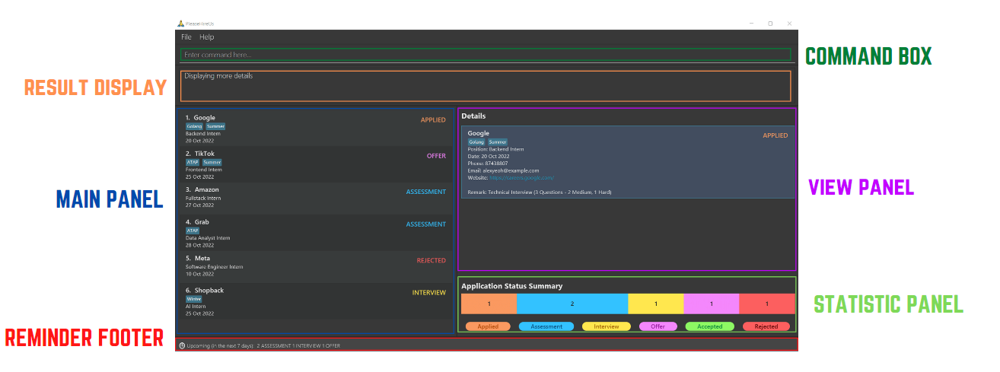

<h3 style="color:#008037;"> COMMAND BOX </h3>

Enter your command here.

**:bulb: Tip:**  
You can use <button>&uarr;</button> or <button>&darr;</button> to navigate through your command history

<h3 style="color:#FF914D;"> RESULT DISPLAY </h3>

Returns a feedback message after a command is executed.

<h3 style="color:#004AAD;"> MAIN PANEL </h3>

Displays the list of internships.

<h3 style="color:#C400FF;"> VIEW PANEL </h3>

The panel displays the internship being viewed in greater detail.

<h3 style="color:#7ED957;"> STATISTIC PANEL </h3>

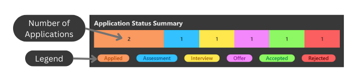

The Bar Chart (located in the bottom right corner of the application) displays the number of
applications on every stage of the possible application process **which are currently listed by
the application**.

For example, If you do `find c/n Shopee` the bar chart will reflect
the data for all internships whose company name contains the word `Shopee`.

**:bulb: Tip:**  
- Use tags to help you differentiate your internships eg. `Winter` and `Summer`  
- Do `find c/t Summer` for an overview of your summer internship application

<h3 style="color:#FF1616;"> REMINDER FOOTER </h3>

The reminder footer displays the number of interviews, assessments or pending offers due in the next 7 days.

## Command Format

**:information_source: Notes about the command format:** 

* Words in `UPPER_CASE` are the [parameters](#glossary) to be supplied by the user. 
  e.g. in `add n/COMPANY_NAME`, `COMPANY_NAME` is a parameter which can be used as `add n/Grab`.

* Items in square brackets are optional. 
  e.g `n/COMPANY_NAME [t/TAG]` can be used as `n/Jane Street t/highSalary` or as `n/Jane Street`.

* Items with `…`​ after them can be used multiple times including zero times. 
  e.g. `[t/TAG]…​` can be used as ` ` (i.e. 0 times), `t/highSalary`, `t/freeLunch t/transport` etc.

* Parameters can be in any order. 
  e.g. if the command specifies `n/COMPANY_NAME pr/APPLICATION_PROCESS`, `pr/APPLICATION_PROCESS n/COMPANY_NAME` is also acceptable.

* If a parameter is expected only once in the command but you specified it multiple times, only the last occurrence of the parameter will be taken. 
  e.g. if you specify `n/Bytedance n/Tiktok`, only `n/Tiktok` will be taken.

* Extraneous parameters for commands that do not take in parameters (such as `help`, `exit` and `clear`) will be ignored. 
  e.g. if the command specifies `help 123`, it will be interpreted as `help`.

## Parameters Requirement
Here are the [parameter](#glossary) requirements of commonly used parameters by [commands](#glossary) in the [**Features**](#features) section below.

| Parameter                 | Description                                                                            | Requirement / Remarks                                                                                                                                                                                                                             |
|---------------------------|----------------------------------------------------------------------------------------|---------------------------------------------------------------------------------------------------------------------------------------------------------------------------------------------------------------------------------------------------|
| **`COMPANY_NAME`**        | Name of company you are applying to                                                    | [Alphanumeric](#glossary) and may contain spaces                                                                                                                                                                                                  |
| **`POSITION`**            | Position of the internship you are applying for                                        | [Alphanumeric](#glossary) and may contain spaces                                                                                                                                                                                                  |
| **`APPLICATION_PROCESS`** | Current process of the internship you are applying for                                 | Can only be: `APPLIED`, `ASSESSMENT`, `INTERVIEW`, `OFFER`, `ACCEPTED`, `REJECTED`                                                                                                                                                                |
| **`DATE`**                | Date of upcoming application task                                                      | In **dd-mm-yyyy** format                                                                                                                                                                                                                          |
| **`PHONE`**               | Contact number of HR                                                                   | In **[+COUNTRY_CODE] PHONE_NUMBER** format    - COUNTRY_CODE is optional   - COUNTRY_CODE must be 1 to 3 digits long   - PHONE_NUMBER must be 3 to 15 digits long   - Space in between COUNTRY_CODE and PHONE_NUMBER if applicable |
| **`EMAIL`**               | Email address of HR                                                                    | Contains a `@` symbol   Example: `example@example.com`                                                                                                                                                                                         |
| **`WEBSITE`**             | Website of company                                                                     | Start with `http://` or `https://`                                                                                                                                                                                                                |
| **`REMARK`**              | Additional remarks to take note of                                                     |                                                                                                                                                                                                                                                   |
| **`TAG`**                 | Additional tags to identify applications                                               | Must be [alphanumeric](#glossary) and may **not** contain spaces   Maximum length of 20 characters                                                                                                                                             |
| **`CATEGORY`**            | Refers to the parameters above                                                         | Used in [`list`](#listing-all-internships--list) [`find`](#locating-internships-by-find) command.  Refer to respective commands for individual requirements.                                                                                   |
| **`INDEX`**               | The index number of internship shown in displayed internship list under the Main Panel | Must be a **positive integer** eg.(1,2,3,...)  Used in [`delete`](#deleting-internships--delete) [`edit`](#listing-all-internships--list) [`view`](#view-details-of-an-internship-view) [`copy`](#copy-details-of-internship--copy)            |

## Features
This section shows all features and commands which are supported by PleaseHireUs. 

**:information_source: Info**  
Internships are uniquely identified by `COMPANY_NAME` and `POSITION`. You cannot have two entries with the same `COMPANY_NAME` and `POSITION`.

### Adding an internship: `add`

Applied for an internship role at your dream company? Add your internship application into the list.

Format: `add n/COMPANY_NAME p/POSITION [pr/APPLICATION_PROCESS] [d/DATE] [ph/PHONE] [e/EMAIL] [web/WEBSITE] [r/REMARK]  [t/TAG]…​`

* Case-insensitive: `Applied`, `APPLIED`, and `applied` are all acceptable inputs.
* `APPLICATION_PROCESS` will be set to `APPLIED` by default.
* `DATE` will be set to today’s date by default.
* `PHONE` will be set to "NA" by default.
* `EMAIL` will be set to "NA" by default.
* `WEBSITE` will be set to “NA” by default.
* `REMARK` will be empty by default.
* `TAG` will be empty by default.

**:bulb: Tip:** A person can have any number of tags (including 0)

Examples:
* `add n/Google ph/98765432 e/johnd@example.com r/Y2 summer break p/Backend Intern pr/APPLIED d/11-12-2022 web/https://careers.google.com/jobs t/high t/java`
* `add n/Grab p/software engineer pr/ASSESSMENT web/https://www.grab.com/sg/about`
* `add n/Gojek p/Mobile Intern`

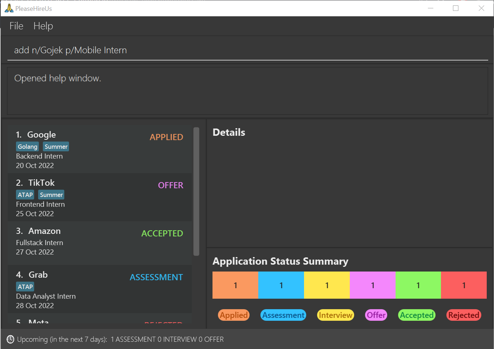
_Before executing command:  `add n/Gojek p/Mobile Intern`_

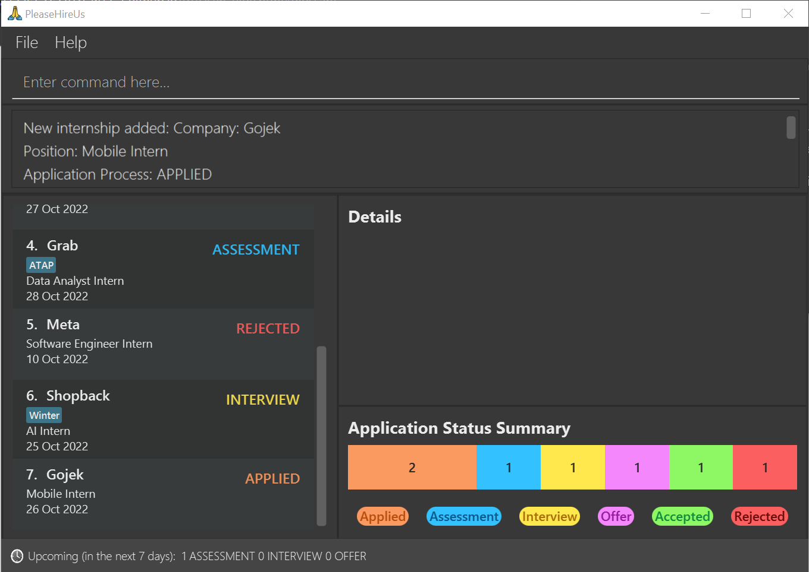
_After executing command: `add n/Gojek p/Mobile Intern`_

### Listing all internships : `list`

Want to see all the internships you have applied to? List of all internship applications.  
You may view your list of internships sorted by category in ascending or descending order.

Format: `list [c/CATEGORY [DESCENDING]]`

* List the internships 
* Internships can be sorted by category and in ascending or descending order
* The `CATEGORY` is optional. By default, without stating the category, `list` will display all internships in no particular order
  * Possible options for `CATEGORY` : `company_name`, `position`, `application_process`, `date` (case-insensitive)
  * Case-insensitive: `company_name`, `Company_Name` are all acceptable inputs.
* The `DESCENDING` parameter is optional. It can take on the value `true` or `false` (case-insensitive).
  * The `DESCENDING` parameter can only be declared if the `CATEGORY` is stated
  * If `DESCENDING` is set to `true`. List of internships will be displayed in descending order

Examples:
* `list c/date true`
* `list c/position`

**:information_source: Info:** If the `DESCENDING` parameter is empty or is spelt incorrectly, it will be set to `false`

**:bulb: Tip:**

| Category                  | Short-form |
|---------------------------|------------|
| **`company_name`**        | `n`        |
| **`position`**            | `p`        |
| **`application_process`** | `pr`       |
| **`date`**                | `d`        |

`list c/company_name` is equivalent to `list c/n`

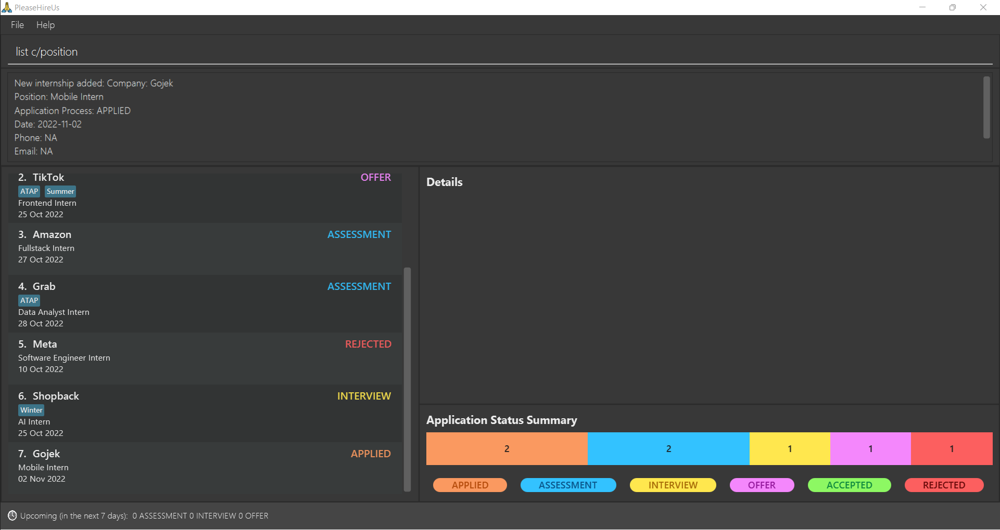
_Before executing command:  `list c/position`_

_After executing command: `list c/position`_

### Locating internships by: `find`

Looking for some internship applications? Find internships whose data in the target category matches the given keyword/s.

Format: `find [c/CATEGORY] KEYWORDS…`

* The search is case-insensitive. e.g. `hans` will match `Hans`
* The order of the keywords does not matter. e.g. `Hans Bo` will match `Bo Hans`
* Possible options for `CATEGORY` : `company_name`, `position`, `application_process`, `date`, `tag` (case-insensitive)
* If not specified, the `CATEGORY` parameter will be set to `company_name` as the default category.
* Only the target category is searched.
* A `KEYWORD` will match any word if the `KEYWORD` is contained in that word e.g. `Han` will match both `Reyhan` and `Handy`
* Internships whose target category matches at least one keyword will be returned (i.e. OR search). e.g. `c/company_name Hans Bo` can return internships with company name of `Hans Gruber` or `Bo Yang`
* To find an internship using the date category, all `KEYWORD` must be a valid date in `dd-mm-yyyy` format
* To find an internship using the application process category, all `KEYWORD` must be a valid application process
  (i.e. Can only be: `APPLIED`, `ASSESSMENT`, `INTERVIEW`, `OFFER`, `ACCEPTED`, `REJECTED`)

Examples:
* `find c/position engineer` returns a list of internships with a position of Algorithm Engineer and Software Engineer
* `find sea shop` returns a list of internships with company name of Sea Labs, Shopee, and Shopback

**:bulb: Tip:** 

| Category                  | Short-form |
|---------------------------|------------|
| **`company_name`**        | `n`        |
| **`position`**            | `p`        |
| **`application_process`** | `pr`       |
| **`date`**                | `d`        |
| **`tag`**                 | `t`        |

`find c/position engineer` is equivalent to `find c/p engineer`

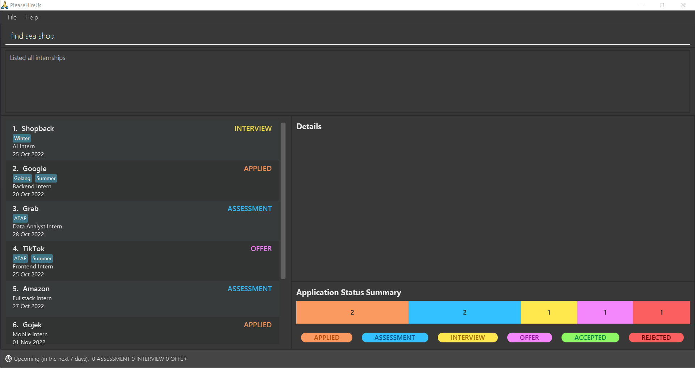
_Before executing command:  `find sea shop`_

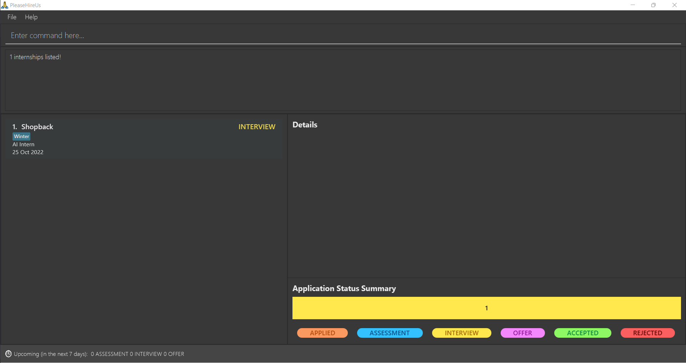
_After executing command: `find sea shop`_

### View details of an internship: `view`

Need to contact HR? View more details of internship application.

Format: `view INDEX`

* Only the index is searched.
* More details about the company at the index will be displayed.

Examples:
* `find sea shop` followed by `view 1` displays more details of the 1st internship in list.

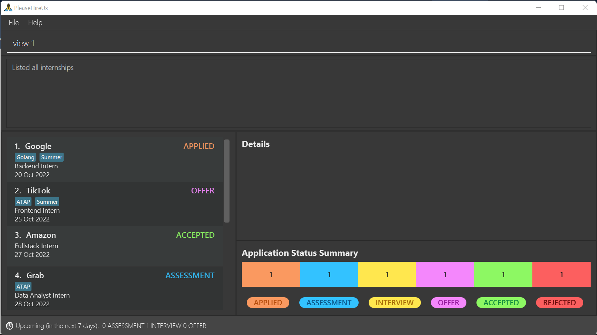
_Before executing command:  `view 1`_

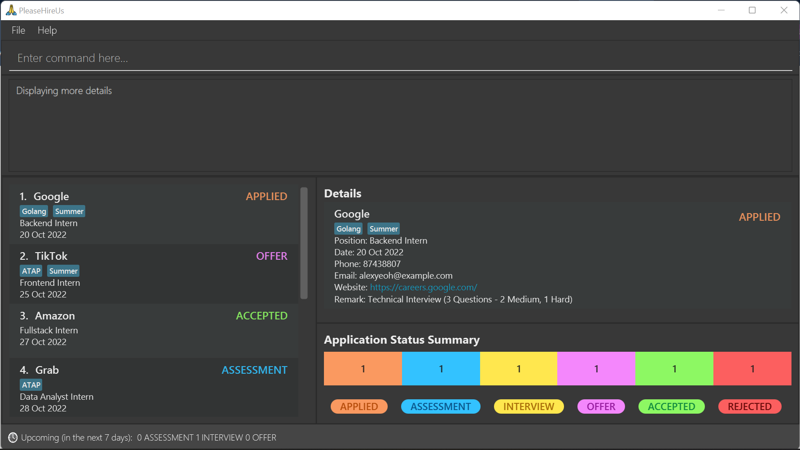
_After executing command: `view 1`_

### Editing internship : `edit`

Need to update your application status or change your assessment date? Edit the details of your internship application.

Format: `edit INDEX [n/COMPANY_NAME] [p/POSITION] [pr/APPLICATION_PROCESS] [d/DATE] [ph/PHONE] [e/EMAIL] [web/WEBSITE] [r/REMARK] [t/TAG]…​`

* Edit the details of internship at the specified `INDEX`.

Examples:
* `list` followed by `edit 2 p/quant researcher d/01-01-2023` will edit the position and assignment date of the 1st internship in the list to quant researcher and 1 January 2023 respectively.
* `find sea shop` followed by `edit 1 pr/REJECTED` will edit the application process of the 1st internship in the results of the find command to `REJECTED`.

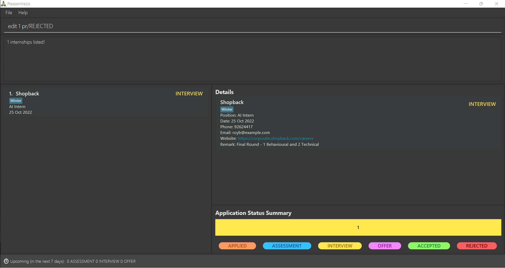
_Before executing command:  `edit 1 pr/REJECTED`_

_After executing command: `edit 1 pr/REJECTED`_

### Copy details of internship : `copy`

Quickly share your application details by copying it into your computer's [clipboard](#glossary).

Format: `copy INDEX`

* Only the internship at the specified `INDEX` is copied.
* Full details of the internship will be copied into system clipboard.

### Deleting internship(s) : `delete`

Deletes the specified internship(s) from the list.

Format: `delete INDEX…​`

* Deletes the internship at the specified `INDEX`.
* Can add multiple `INDEX` to delete multiple internships.

Examples:
* `list` followed by `delete 1 3` deletes the 1st and 3rd internship from the list.
* `find sea shop` followed by `delete 1` deletes the 1st internship in the results of the `find` command.

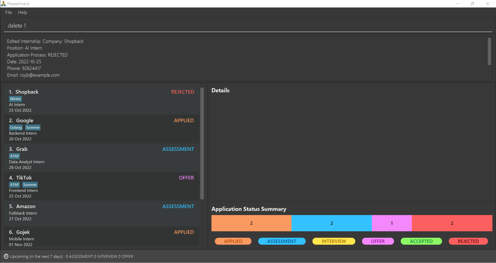
_Before executing command:  `delete 1`_

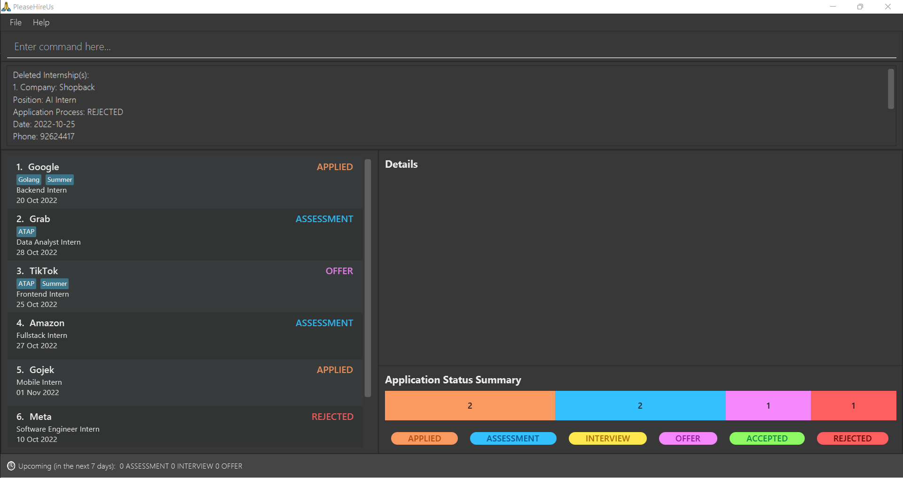
_After executing command: `delete 1`_

### Clearing all entries : `clear`

Starting a new internship season? Clear all entries from the internship tracker.

Format: `clear`

_Before executing command:  `clear`_

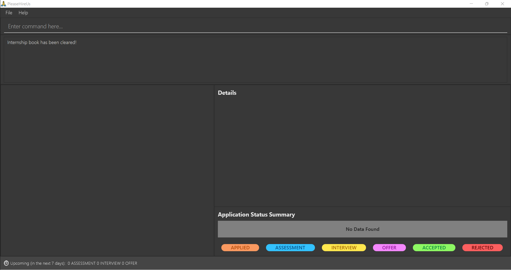
_After executing command: `clear`_

### Undo previous command : `undo`

Made a mistake? Undo the most recent command that modified the internship book.

Format: `undo`

**:information_source: Info:**  
You can only undo `add`,`clear`,`delete`,`edit`,`redo` commands

_Before executing command:  `undo`_

_After executing command: `undo`_

### Redo previous undone command : `redo`

Redo the most recent command that was undone.

Format: `redo`

### Viewing help : `help`

If you need a quick refresher on the available commands, head right to the help page. Link to the user guide is also available.

Format: `help`

**:bulb: Tip:**  
- Press <button>esc</button> to close the Help window  
- Press <button>C</button> to copy the User Guide url into the clipboard when the Help window is opened

### Exiting the program : `exit`

Exits the program.

Format: `exit`

### Saving the data

PleaseHireUs data is saved in the hard disk automatically after any command that changes the data. There is no need to save manually.

### Editing the data file

PleaseHireUs data is saved as a JSON file `[JAR file location]/data/internshipbook.json`. Advanced users are welcome to update the data directly by editing that data file.

:exclamation: **Caution:**
If your changes to the data file makes its format invalid, PleaseHireUs will discard all data and start with an empty data file at the next run.

### Archiving data files `[coming in v2.0]`

_Details coming soon …​_

## Command summary

| Action                                          | Undo               | Format, Examples                                                                                                                                                                                             |
|-------------------------------------------------|--------------------|--------------------------------------------------------------------------------------------------------------------------------------------------------------------------------------------------------------|
| [**Add**](#adding-an-internship-add)            | :heavy_check_mark: | `add n/COMPANY_NAME p/POSITION [pr/APPLICATION_PROCESS] [d/DATE] [ph/PHONE] [e/EMAIL] [web/WEBSITE] [r/REMARK]  [t/TAG]…​`   e.g., `add n/Tiktok p/backend engineer`                                      |
| [**List**](#listing-all-internships--list)      | :x:                | `list [c/CATEGORY [DESCENDING]]`   e.g,  `list c/d true`, `list c/date`                                                                                                                                   |
| [**Find**](#locating-internships-by-find)       | :x:                | `find [c/CATEGORY] KEYWORDS…​`  e.g., `find c/p engineer`                                                                                                                                                 |
| [**View**](#view-details-of-an-internship-view) | :x:                | `view INDEX`  e.g., `view 1`                                                                                                                                                                              |
| [**Edit**](#editing-internship--edit)           | :heavy_check_mark: | `edit INDEX [n/COMPANY_NAME] [p/POSITION] [pr/APPLICATION_PROCESS] [d/ASSESSMENT_DATE] [ph/PHONE] [e/EMAIL] [r/REMARK] [web/WEBSITE] [t/TAG]…​`  e.g.,`edit 2 p/Backend Intern pr/INTERVIEW d/01-11-2022` |
| [**Copy**](#copy-details-of-internship--copy)   | :x:                | `copy INDEX`   e.g., `copy 1`                                                                                                                                                                             |
| [**Delete**](#deleting-internships--delete)     | :heavy_check_mark: | `delete INDEX…​`  e.g., `delete 1 3`                                                                                                                                                                      |
| [**Clear**](#clearing-all-entries--clear)       | :heavy_check_mark: | `clear`                                                                                                                                                                                                      |
| [**Undo**](#undo-previous-command--undo)        | :x:                | `undo`                                                                                                                                                                                                       |
| [**Redo**](#redo-previous-undone-command--redo) | :heavy_check_mark: | `redo`                                                                                                                                                                                                       |
| [**Help**](#viewing-help--help)                 | :x:                | `help`                                                                                                                                                                                                       |
| [**Exit**](#exiting-the-program--exit)          | :x:                | `exit`                                                                                                                                                                                                       |

**:information_source: Info:** Valid inputs for `CATEGORY` parameter in `list` and `find`  

| Command      | Valid Categories (case-insensitive)                          |
|--------------|--------------------------------------------------------------|
| **`list`**   | `COMPANY_NAME` `POSITION` `APPLICATION_PROCESS` `DATE`       |
| **`find`**   | `COMPANY_NAME` `POSITION` `APPLICATION_PROCESS` `DATE` `TAG` |

## Prefix Summary

| Prefix   | Symbolize           |
|----------|---------------------|
| **n/**   | Company Name        |
| **p/**   | Position            |
| **pr/**  | Application Process |
| **d/**   | Date                |
| **web/** | Website             |
| **ph/**  | Phone Number        |
| **e/**   | Email               |
| **r/**   | Remark              |
| **t/**   | Tag                 |
| **c/**   | Category            |

## FAQ
**Q**: How do I transfer my data to another Computer? 
**A**: Install the app in the other computer and overwrite the empty data file it creates with the file that contains the data of your previous PleaseHireUs home folder.

## Glossary

| Term                           | Description                                                                                                                                        |
|--------------------------------|----------------------------------------------------------------------------------------------------------------------------------------------------|
| Alphanumeric                   | Characters that are either a number or a letter.                                                                                                   |
| Clipboard                      | A clipboard is a temporary storage area in the computer for data that the user wants to copy from one place to another.                            |
| Command                        | Instruction typed by the user for PHU to execute.                                                                                                  |
| Command Line Interface (CLI)   | CLI allows user to use text as commands to be executed by an application.                                                                          |
| Graphical User Interface (GUI) | GUI allows user to interact with an application through graphics such as icons, menu, etc.                                                         |
| PHU                            | PleaseHireUs                                                                                                                                       |
| Parameter                      | A component of a command for the user to input information. For PHU context, this refers to the internship application details.                    |
| Prefix                         | An abbreviation for the name of the parameter. Prefix should be entered before the actual parameter in a command and always ends with a slash (/). |
  
## Acknowledgements
* This project is adapted from **[AddressBook 3(AB3)](https://github.com/se-edu/addressbook-level3)**
* Undo and Redo commands are adapted and modified from  **[AddressBook 4(AB4)](https://github.com/se-edu/addressbook-level4)**
* Libraries used: [JavaFX](https://openjfx.io/), [Jackson](https://github.com/FasterXML/jackson), [JUnit5](https://github.com/junit-team/junit5), [TestFx](https://github.com/TestFX/TestFX)
* The PleaseHireUs icon is obtained from [flaticon](https://www.flaticon.com/free-icon/please_599536)

## Appendix: Installing Java 11
1. Check if you have installed the correct version of java by running `java -version` in your terminal.
2. If Java is not installed in your computer or the Java version is different,
   1. For Windows users, you may download Java 11 from [here](https://www.oracle.com/java/technologies/downloads/#java11-windows)
   2. For Mac users, you may download Java 11 from [here](https://www.oracle.com/java/technologies/downloads/#java11-mac)
3. After installing, you may verify that the correct version of Java is installed by repeating step 1.
