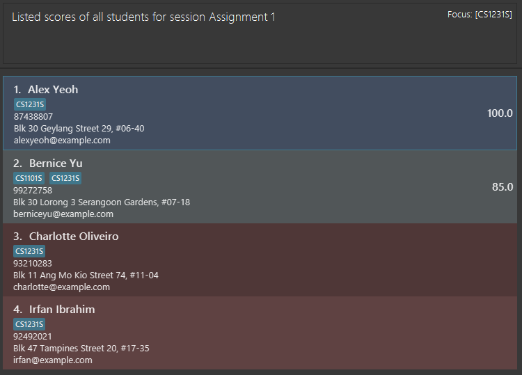

**TA-Assist** is a desktop app for Teaching Assistants (TA) to keep track of students’ particulars and allocate marks 
for attendance and assignments. It is optimized for use via a Command Line Interface (CLI) while having the benefits of 
a Graphical User Interface (GUI).

This user guide provides a brief documentation on how you can install the application and describes how each feature 
should be used. Start by looking at the quick start guide to get you started.

* Table of Contents
{:toc}

## Quick Start
1. Ensure you have **Java `11`** or above installed in your Computer.
1. Download the latest `taassist.jar` from [here](https://github.com/AY2223S1-CS2103T-T12-1/tp/releases/tag/v1.3).
1. **Copy** the file to the folder you want to use as the _home folder_ for your TA-Assist.
1. **Double-click** the file to start the app.

--------------------------------------------------------------------------------------------------------------------

## Features

:information_source: Before diving into the features, the examples in this guide are formatted with the following conventions:
* Words in `UPPER_CASE` are the parameters to be supplied by the user.
  * e.g. in `add n/NAME`, `NAME` is a parameter which can be used as `add n/John Doe`.
* Items in square brackets are optional.
  * e.g `n/NAME [c/CLASS_NAME]` can be used as `n/John Doe c/CS1231S` or as `n/John Doe`.
* Items with `...` after them can be used multiple times.
  * e.g. `[c/CLASS_NAME...]` can be used as ` ` (i.e. 0 times since it is also optional), `c/CS1101S`, `c/CS2030 c/ST2334` etc.
* Parameters can be in any order.
  * e.g. if the command specifies `n/NAME p/PHONE_NUMBER`, `p/PHONE_NUMBER n/NAME` is also acceptable.
* If a parameter is expected only once in the command but you specified it multiple times, only the last occurrence of the parameter will be taken.
  * e.g. if you specify `p/12341234 p/56785678`, only `p/56785678` will be taken.
* Extraneous parameters for commands that do not take in parameters (such as `help`, `list`, `exit` and `clear`) will be ignored.
  * e.g. if the command specifies `help 123`, it will be interpreted as `help`.

In TA-Assist, you can switch into a mode called the **focus** mode, which lets you run tasks that are specific to (module) class. Therefore,
[some commands](#features-available-in-focus-mode) can only be executed when you are in focus mode. Commands that you can run in the default (unfocused) mode can also
be run in focus mode. On the other hand, commands that are available only in focus mode cannot be executed in the default (unfocused) mode.

Let's first begin with the commands available in the default mode.

| Command    | Format                                                             |
| ---------- |--------------------------------------------------------------------|
| `help`     | `help`                                                             |
| `add`      | `add n/NAME [p/PHONE_NUMBER][e/EMAIL][a/ADDRESS][c/CLASS_NAME...]` |
| `edit`     | `edit INDEX [n/NAME][p/PHONE_NUMBER][e/EMAIL][a/ADDRESS]`          |
| `delete`   | `delete INDEX`                                                     |
| `find`     | `find KEYWORD...`                                                  |
| `list`     | `list`                                                             |
| `addc`     | `addc c/CLASS_NAME...`                                             |
| `deletec`  | `deletec c/CLASS_NAME...`                                          |
| `assign`   | `assign INDEX... c/CLASS_NAME`                                     |
| `unassign` | `unassign INDEX... c/CLASS_NAME`                                   |
| `listc`    | `listc`                                                            |
| `exit`     | `exit`                                                             |
| `focus`    | `focus c/CLASS_NAME`                                               |
| `clear`    | `clear`                                                            |

### Viewing help : `help`



Format: `help`

### Adding a student: `add`



Format: `add n/NAME [p/PHONE_NUMBER] [e/EMAIL] [a/ADDRESS] [c/CLASS_NAME...]`

* Adds a student named `NAME` into TA Assist.

Examples:

* `add n/John Doe p/98765432 e/johnd@example.com a/John street, block 123, #01-01 c/CS2103T`
* `add n/Betsy Crowe a/Betsy street p/62353535 c/CS1231S c/CS1101S`

### Edit a student: `edit`



Format: `edit INDEX [n/NAME] [p/PHONE_NUMBER] [e/EMAIL] [a/ADDRESS]`

* Edits student data at the specified `INDEX`. The index refers to the index number shown in the displayed student list. The index **must be a positive integer** 1, 2, 3,…
* Only fields that are specified will be modified.
* At least 1 field needs to be modified.

Examples:

* `edit 2 n/John Doe` will change the 2nd student’s name to **John Doe.**
* `edit 4 e/john.doe@example.com a/38 College Avenue East, 138601` will change the 4th student’s:
  * E-mail to **john.doe@example.com**
  * Address to **38 College Avenue East, 138601**

### Delete a student: `delete`



Format: `delete INDEX`

* Deletes the student at the specified `INDEX`
* The index refers to the index number shown in the displayed student list.
* The index **must be a positive integer** 1, 2, 3, …

Examples:

* `list` followed by `delete 2` deletes the 2nd student in TA Assist.
* `find Betsy` followed by `delete 1` deletes the 1st student in the results of the `find` command.
* `class c/CS2103T` followed by `delete 3` deletes the 3rd student in the CS2103T class.

### Locate student by name: `find`



Format: `find KEYWORD...`

* The search is case-insensitive, i.e. `Joh` will match with `john` and `JOHN`.
* The search is performed on the current displayed list of students. 
* To clear the current search, use the `list` command.

Examples:

* `find John` will find people with a **John** in their name (case-insensitive), i.e. **John Doe**, **John Brown**, **harry jOHn**, etc.
* `find ben chris` will find people with either a **ben** or a **chris** in their name, i.e. **chris ben**, **ChRIs wonders**, **bEn ten**, etc.
* `find alex david` returns `Alex Yeoh`, `David Li`
  

### List all students: `list`



Format: `list`

* Note that `list` has different behavior in focus mode and outside focus mode.
* In the focus mode, only students within the class will be listed.

### Add classes: `addc`



Format: `addc c/CLASS_NAME...`

*  Add classes with the specified names.

Examples:

* `addc c/CS2103T c/CS2100` adds the classes named **CS2103T** and **CS2100**.

### Delete classes: `deletec`



Format: `deletec c/CLASS_NAME...`

* Delete classes with the specified names.

Examples:

* `deletec c/CS2103T c/CS2100` deletes the classes named **CS2103T** and **CS2100**.

### Assign students to class: `assign`



Format: `assign INDEX... c/CLASS_NAME`

* Assigns students at the given indices to an existing `CLASS_NAME` class.

Example:

* `list` followed by `assign 1 3 5 6 c/CS1231S` assigns **1st**, **3rd**, **5th** and **6th** student in TA Assist to the **CS1231S** class.

### Unassign students from class: `unassign`



Format: `unassign INDEX... c/CLASS_NAME`

* Unassigns students at the given indices from an existing `CLASS_NAME` class.

Example:

* `list` followed by `unassign 1 3 5 6 c/CS1231S` unassigns **1st**, **3rd**, **5th** and **6th** student in TA Assist from the **CS1231S** class.

### List classes: `listc`



Format: `listc`

* List the classes that have been created.

### Exit the program: `exit`



Format: `exit`

### Enter focus mode: `focus`



Format: `focus c/CLASS_NAME`

* Enters focus mode for the class named `CLASS_NAME`

Example:

* `class CS1231S` will enter focus mode to the **CS1231S** class, allowing you to manage data relating to **CS1231S**.

### Clear all existing data: `clear`



Format: `clear`

* Clears all existing data in TA Assist.

## Features Available in Focus Mode

The following commands are only available in **focus mode.**

| Command   | Format                                        |
| --------- |-----------------------------------------------|
| `list`    | `list`                                        |
| `session` | `session s/SESSION_NAME... [d/DATE]`          |
| `deletes` | `deletes s/SESSION_NAME...`                   |
| `grade`   | `grade INDEX... s/SESSION_NAME g/GRADE_VALUE` |
| `scores`  | `scores s/SESSION_NAME`                       |
| `view`    | `view INDEX`                                  |
| `lists`   | `lists`                                       |
| `export`  | `export`                                      |
| `unfocus` | `unfocus`                                     |

### List all students in the class: `list`



Format: `list`

* Note that `list` has different behavior in focus mode and outside focus mode.
* In the focus mode, only students within the class will be listed.

### Create session: `session`



Format: `session s/SESSION_NAME... [d/DATE]`

- Creates sessions with the specified names sharing the same `DATE`. If the `DATE` field is empty, the current date will be used.
- `DATE` field should follow the format `yyyy-MM-dd`

Example:

- `session s/Lab1 s/Tutorial1 d/2022-08-11` will create sessions `Lab1` and `Tutorial1` on 11  August 2022.

### Delete sessions: `deletes`



Format: `deletes s/SESSION_NAME...`

* Delete sessions with specified names from the class.

Examples:

* `deletes s/Lab1 s/Assignment3` deletes the session named **Lab1** and **Assignment3**.

### Grade session: `grade`



Format: `grade INDEX... s/SESSION_NAME g/GRADE_VALUE`

* Grades the students in `INDEX...` on the session `SESSION_NAME` with a grade of `GRADE_VALUE`.
* `GRADE_VALUE` must be a number (decimal points are allowed).

Example:

* `session s/Lab1 d/06-10-2022` followed by `grade 1 2 s/Lab1 g/93` will give the students at index 1 and 2 a grade of 93 for the session `Lab1`.

### Show students' grades for a session: `scores`



Format: `scores s/SESSION_NAME`

* Shows the grades of all students in the class for the session `SESSION_NAME`.

Example:

* `scores s/Assignment 1` will show the grades of all students in the class for the session `Assignment 1`, as shown below.
     
  

  In the above example,     
  * Alex Yeoh and Bernice Yu have been graded with the scores `100.0` and `85.0` respectively.
  * Charlotte Oliveiro and Irfan Ibrahim have not been graded, hence their cells have been marked red.

### View session grades of student: `view`



Format: `view INDEX`

* View all session grades of the student at index `INDEX` in the class.

Example:

* `grade 2 s/Lab1 g/93` then `view 2` will return `1. Lab1: 93`, which is the grade of the student at index 2 for the session `Lab1`.

### List all sessions: `lists`



Format: `lists`

* List the sessions that have been created for the class.

### Export class data: `export`



Format: `export`

### Exit focus mode: `unfocus`



Format: `unfocus`

## FAQ

**Q**: How do I transfer my data to another Computer?
**A**: Install the app in the other computer and overwrite the empty data file it creates with the file that contains the data of your previous TA Assist home folder.

