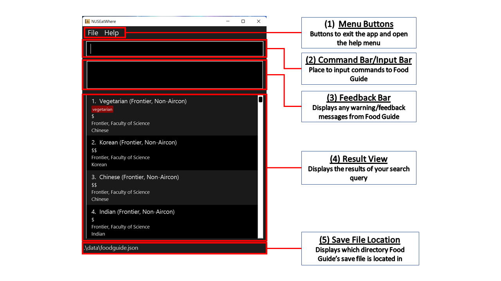

## Introduction
_Are you a new NUS student that's not sure what food options there are in NUS?  
Or perhaps, are you stuck on what to eat for lunch?_  

Presenting to you, NUSEatWhere's Food Guide! `NUSEatWhere` is a desktop application that stores
information on NUS canteens and eateries in the form of a `Food Guide`.
It also supports a variety of search functions and the ability to randomly generate
eateries to eat at! 

`NUSEatWhere` is designed for all NUS Students who have a hard time remembering 
all the food options in NUS and/or cannot decide on a place to eat. 
Additionally, `NUSEatWhere`'s **Command-line Interface (CLI)** is optimized for fast-typists to 
quickly execute complicated commands in a simple manner, and is simple to pick up for all users!

With `NUSEatWhere`, you can search for the available food options in NUS and make an informed decision on where to eat 
faster than ever before!

## Table of Contents
* [Introduction](#introduction)
* [Table of Contents](#table-of-contents)
* [Using the User Guide](#using-the-user-guide)
* [Quick Start](#quick-start)
* [First Glance](#first-glance)
* [Features](#features)
  * [Introduction to Our Features](#introduction-to-our-features)
  * [Utility commands](#utility-commands): 
    * [Help](#help-command--help) / [List](#listing-all-eateries--list) / [Exit](#exit-command--exit)
  * [Find-style commands](#commands-for-finding-eateries): 
    * [Find](#find-eateries-by-name--find) / [FindLocation](#find-eateries-by-location--findlocation) /
      [FindCuisine](#find-eateries-by-cuisine--findcuisine) / [FindPrice](#find-eateries-by-price--findprice) /
      [FindTag](#find-eateries-by-tag--findtag)
  * [Modification commands](#commands-for-modifying-eateries): 
    * [Tag](#add-tag-to-eatery--tag) / [Untag](#remove-tag-from-eatery--untag)
    * [Fav](#favourite-eatery--fav) / [Unfav](#unfavourite-eatery--unfav)
    * [Add](#add-eatery--add) / [Delete](#delete-eatery--delete) / [Edit](#edit-eatery--edit)
    * [Clear](#clear-nuseatwheres-eatery-list--clear)
* [FAQ](#faq)
* [Command Summary](#command-summary)

 

---

## Using the User Guide
This user guide aims to orientate users (such as _you!_) on how to install, use, and troubleshoot `NUSEatWhere`.

For all new users, we highly recommend you check out the [Quick Start](#quick-start) section, which covers the
installation instructions and the basic features of our application.

After getting acquainted with `NUSEatWhere`, you should take a look at our [Features](#features) section, which
lists down all of our features in detail and how they work!

Are you an experienced user that just needs a summary on how to use our application?  
You might want to head on over to the [Command Summary](#command-summary) section
instead for a quick overview of all our supported commands.

Got any other burning questions? Try looking in our [FAQ](#faq) section!  
If your queries cannot be answered, you can try contacting the development team
by referring to our [About Us](https://ay2223s1-cs2103t-w11-1.github.io/tp/AboutUs.html) page or
raising an issue on our [GitHub](https://github.com/AY2223S1-CS2103T-W11-1/tp)!

--------------------------------------------------------------------------------------------------------------------

## Quick Start

### System Requirements

For the ideal experience, we recommend using NUSEatWhere on either Windows, macOS or Linux operating systems.

In addition, you will require 'Java' version 11 or higher to run NUSEatWhere. 'Java' version 11 can be downloaded from 
the Oracle website [here](https://www.oracle.com/sg/java/technologies/javase/jdk11-archive-downloads.html).
Alternatively, you can install 'Java' directly on your computer through package managers using the following commands:

* On Windows, using [Chocolatey](https://chocolatey.org/), `choco install jdk11`
* On macOS, `brew install openjdk@11`
* On Linux, `sudo apt-get install openjdk-11-jdk`

### Installing NUSEatWhere

1. If you haven't done so already, install `Java` version 11 or higher by following the instructions in 
   [System Requirements](#system-requirements).

2. Next, download the latest version of `foodguide.jar` from 
   [here](https://github.com/AY2223S1-CS2103T-W11-1/tp/releases).

3. Make sure to move the file to your intended **home folder** for the NUSEatWhere application.

4. Double-click the file to start `NUSEatWhere`.  
   You should be greeted with an interface similar to the picture below in the [First Glance](#first-glance) section.

5. You're done setting up the `NUSEatWhere`!  
   Go ahead and type some commands into the command box and press Enter to execute it.  
   e.g. typing `help` and pressing Enter will open the help window.  

   Here are some example commands you can try:
  * `help`: Opens a help window
  * `list`: Lists all eateries
  * `find mala`: List all eateries with 'mala' in its name
  * `exit`: Closes the application

6. You can refer to [Features](#features) below for the details of each command.

 

## First Glance
The following image describes how `NUSEatWhere` looks like upon opening the application.

To interact with NUSEatWhere, you type commands into the Command Bar and press the 'Enter' key.

If the command is successfully executed, a response message will appear in the Feedback Bar.
However, if there is an error in your command, a red error message
will pop up instead, telling you what went wrong and how to correct it.

--------------------------------------------------------------------------------------------------------------------

## Features

### Introduction to Our Features

This section summarizes all the commands supported in `NUSEatWhere`. 
We highly recommend you read this section before jumping into all the features below!

1. When in doubt, you can always fall back on the `help` command.
For most commands, you can also add `-h` to the back to get `NUSEatWhere` to generate 
a help message on how to use the command (e.g. `find -h`)!

2. To show all eateries, or reset the eateries in the list to its default state, use `list`.

3. Make use of the various search commands (`find`, `findTag`, `findLocation`, `findCuisine`, `findPrice`) 
to search for a specific eatery!

4. Make use of our random generator by adding `-r NUMBER` after any `find` command. For example, run
`find -r 1` to generate 1 random eatery to eat at.

5. Customize `NUSEatWhere` to suit your needs by adding tags to your eateries.
You can use the `tag` and `untag` commands to change the tags attached to each eatery.

6. Additionally, you can use the `fav` and `unfav` commands to mark some eateries as favourites!

7. Lastly, we empower you to `add`, `edit` and `delete` eateries to and from `NUSEatWhere`. 
This may be useful to include eateries near NUS (such as Supper Stretch!).

:information_source:

### Important! A Note on Command Format

| Command Expression     | Meaning                                                      | Example                                                                                                                   |
|------------------------|--------------------------------------------------------------|---------------------------------------------------------------------------------------------------------------------------|
| `UPPER_CASE`           | Upper case inputs are **needed** for the command to work     | In `add -n NAME`, `NAME` is an input which can be used as `add -n Pasta Express`                                          |
| `[]`                   | Inputs in square brackets are **optional**                   | `-n NAME [-p PRICE]` can be used as `-n Pasta Shop -p $` or as `-n Pasta Shop`                                            |                                                                                  |
| `…​`                   | Items with `…​` after them can be used **one or more times** | `find NAME…​` can be used as `find Frontier`, `find Frontier Deck` etc.                                                   |
| `-n`, `-t`, `-p`, etc. | Prefixed inputs can be in **any order**                      | if the command specifies `-n NAME -t TAGNAME`, you can also use `-t TAGNAME -n NAME`. Both will produce the same outcome. |

  Note: For `-t TAGNAME1 [-t TAGNAME2]…​`, the correct input format is `-t mala -t vegetarian`. (Multiple `-t`s are required)

* If a certain input is expected only once in the command, but you specified it multiple times,
  only the last occurrence will be taken.  
  e.g. if you specify `-n nameA -n nameB`, only `-n nameB` will be taken.   

* Extra inputs for commands that do not take inputs (such as `help`) will be ignored.  
  e.g. `help 123` will be interpreted as `help`.  

* The special `-h` parameter will provide a useful help message for how to use the command. 
  To avoid any unforeseen behaviour, remove your other inputs when using `-h`.
  e.g. `find -h` or `add -h`. 

 

---

### Utility Commands
These commands deal with the general function of the `NUSEatWhere` application.
As such, we recommend memorizing these commands so that your experience with our 
application will be as smooth as possible!

 

#### Help command : `help`

_Displays a pop-out window listing out all the available commands & their functions.  
The window also contains a link to this User Guide._

 :bulb:  **Tip:**
When in doubt, use the help feature to see the list of commands within NUSEatWhere!

**Format**: `help`

 

#### Listing all eateries : `list`

_Lists out all the eateries in `NUSEatWhere`.  
If a command (e.g. `find`) has hidden some eateries from you, 
you can simply type `list` to view all your eateries again._

**Format:** `list [-h]`

**Inputs:**  
`-h`: displays help message (specific to list)

 

#### Exit command : `exit`

_Closes `NUSEatWhere`. All information is saved beforehand._

**Format:** `exit`

 

---

### Commands for Finding Eateries
These commands search the list of eateries for ones that match your criteria. All find commands support
a randomizer functionality to pick out a number of eateries at random.

If there are fewer eateries matching the criteria than the number specified to the randomizer,
they will all be displayed.

Please note that for all find commands:
* The searches are case-insensitive. e.g `koi` will match `KOI`
* Eateries matching at least one keyword will be returned.  
(e.g. if `findCuisine chinese thai` is used to search within the eateries' cuisine types, 
eateries that have a cuisine type of either `chinese` and/or `thai` will be listed.)
* You may give a shorter version of the name as long as the spelling is correct  
  (e.g. `find veg` will return eateries
  with `vegetarian` in their name.)

 

#### Find eateries by name : `find`

_Search for eateries with names matching your input.  
You can also quickly narrow down your choices with the randomizer feature._

**Format:** `find KEYWORD…​ [-r NUMBER] [-h]`

 :bulb:  **Tip:**
You can leave KEYWORD empty if you are using the randomizer (-r) feature!

**Inputs:**  
`KEYWORD` : the keyword(s) that must be included in the eatery name  
`NUMBER`: how many randomly selected eateries to show (more than 0)  
`-h`: displays help message (specific to find)
 

Example:
* `find veg -r 2`

Below is an example of what the list would look like when using the randomizer `-r` command.
The command used is shown on the command line.  
Note how only 2 random eateries with "veg" in their names are shown.

 

#### Find eateries by location : `findLocation`

_Search for eateries that match the specified location(s).  
You can also quickly narrow down your choices with the randomizer feature._

**Format:** `findLocation LOCATIONNAME…​ [-r NUMBER] [-h]`

**Inputs:**  
`LOCATIONNAME`: the location(s) the eatery must have  
`NUMBER`: how many randomly selected eateries to show (more than 0)  
`-h`: displays help message (specific to findLocation)  

Example:
* `findLocation University Town -r 2`
* `findLocation University Town`

 

#### Find eateries by cuisine : `findCuisine`

_Search for eateries that match the specified cuisine(s).  
You can also quickly narrow down your choices with the randomizer feature._

**Format:** `findCuisine CUISINENAME…​ [-r NUMBER] [-h]`

**Inputs:**  
`CUISINENAME`: the cuisine(s) the eatery must have  
`NUMBER`: how many randomly selected eateries to show (more than 0)  
`-h`: displays help message (specific to findCuisine)
 

Example:
* `findCuisine Chinese -r 2`
* `findCuisine Chinese`

 

#### Find eateries by price : `findPrice`

_Search for eateries that match the specified price(s).
You can also quickly narrow down your choices with the randomizer feature._  

Prices can only take the values `$`, `$$`, or `$$$`, in increasing order of price.

**Format:** `findPrice PRICE…​ [-r NUMBER] [-h]`

**Inputs:**  
`PRICE`: the price(s) the eatery must have  
`NUMBER`: how many randomly selected eateries to show (more than 0)  
`-h`: displays help message (specific to findCuisine)
 

Example:
* `findPrice $ -r 2`
* `findPrice $`

 

#### Find eateries by tag : `findTag`

_Search for eateries labelled with the specified tag(s). 
You can also quickly narrow down your choices with the randomizer feature._

**Format:** `findTag TAGNAME…​ [-r NUMBER] [-h]`

 :bulb: **Tip:**
You can search for any number of tags by typing them all after the findTag command!

**Inputs:**  
`TAGNAME`: the tag(s) the eatery must have  
`NUMBER`: how many randomly selected eateries to show (more than 0)  
`-h`: displays help message (specific to findTag)
 

Note:
* The search is case-insensitive. e.g `foodcourt` will match `Foodcourt`
* Eateries matching at least one tag will be returned (i.e. `OR` search).
  e.g. `findTag foodcourt cafe` will return eateries with either tag.

Example:
* `findTag restaurant`

 

---

### Commands for Modifying Eateries
These commands are used to modify and customise the list of eateries in `NUSEatWhere`.
If you would like to add/remove/edit any sort of information within the application, these are the commands for you.
Feel free to personalise `NUSEatWhere` eatery list to your liking!

 

#### Add tag to eatery : `tag`

_Labels an eatery with custom tag(s) to facilitate searching._

**Format:** `tag INDEX -t TAGNAME…​ [-h]`

**Inputs:**  
`INDEX`: index of eatery to place tag on (must be found in the current list)  
`TAGNAME`: name of tag to assign to eatery  
`-h`: displays help message (specific to tag)  

Example:
* `tag 1 -t coffee -t tea`

 

#### Remove tag from eatery : `untag`

_Remove tag(s) from an eatery._

**Format:** `untag INDEX -t TAGNAME…​ [-h]`

**Inputs:**  
`INDEX`: index of eatery to remove tag from (must be found in the current list)  
`TAGNAME`: name of tag to remove from eatery  
`-h`: displays help message (specific to untag)  

Example: 
* `untag 44 -t cafe`

Below is a comparison between when the store at index 44 is tagged with `cafe` _(left)_ then untagged _(right)_.
The commands used are shown on the command line.  
Note how the red "cafe" tag on store 44 disappears after the untag command.

  

#### Favourite Eatery : `fav`

_Favourites an eatery in `NUSEatWhere`.  
The favourite tag is standardized to be "<3" when using this command._

**Format:** `fav INDEX [-h]`

**Inputs:**  

`INDEX`: index of the eatery to favourite  
`-h`: displays help message (specific to fav)  

Example:
* `fav 3`

 

#### Unfavourite Eatery : `unfav`

_Unfavourites an eatery in `NUSEatWhere`.  
The tag to be removed is standardized to be "<3" when using this command._

**Format:** `unfav INDEX [-h]`

**Inputs:**  

`INDEX`: index of the eatery to unfavourite  
`-h`: displays help message (specific to unfav)  

Example:
* `unfav 3`

 

#### Add eatery : `add`

_Adds a new eatery to `NUSEatWhere`. The eatery will be added to the end of the
current list  
(i.e. if the current list pre-addition has 5 eateries, the newly added eatery will be of index 6)._

**Format:** `add -n NAME -l LOCATION -c CUISINE -p PRICE [-t TAG]…​ [-h]`

**Inputs:**  
`NAME`: name of the eatery to be added  
`LOCATION`: location of the eatery  
`CUISINE`: cuisine type of the eatery  
`PRICE`: price of the eatery  
`TAGNAME`: extra tags to add to the eatery  
`-h`: displays help message (specific to add)  

Example:
* `add -n KOI -l Central Square -c Drinks`
* `add -n KOI -l Central Square -c Drinks -p $$`

 

#### Delete eatery : `delete`

_Deletes an eatery from `NUSEatWhere`._

**Format:** `delete INDEX [-h]`

**Inputs:**  
`INDEX`: index of eatery to remove from NUSEatWhere (must be found in the current list)  
`-h`: displays help message (specific to delete)  

Example:
* `delete 68`

Below is a comparison between when the store at index 68 was added  _(left)_ then deleted _(right)_.
The commands used are shown on the command line.  
Note how the eatery at index 68 disappears after the delete command.

  

#### Edit Eatery : `edit`

_Edits the details of an eatery in `NUSEatWhere`._

**Format:** `edit INDEX [-n NAME] [-l LOCATION] [-c CUISINE] [-p PRICE] [-t TAG]…​ [-h]`

**Inputs:**  
`INDEX`: index of the eatery to edit  
`NAME`: new name of the eatery  
`LOCATION`: new location of the eatery  
`CUISINE`: new cuisine type of the eatery  
`PRICE`: new price of the eatery  
`TAGNAME`: new tags of the eatery  
`-h`: displays help message (specific to edit)  

Example:
* `edit 1 -n KOI -l Central Square -c Drinks`
* `edit 3 -n KOI -l Central Square -c Drinks -p $$`

:information_source:
When editing the tags of an eatery, all existing tags will be overwritten.

 

#### Clear NUSEatWhere's Eatery List : `clear`

_Clears all eateries from `NUSEatWhere`._

**Format:** `clear`

:exclamation:
This command removes ALL eateries.
This action is irreversible.

--------------------------------------------------------------------------------------------------------------------

## FAQ

**Where is my data saved?**  
NUSEatWhere's `Food Guide` data (including your tags and any new eateries) is automatically saved into the file named
`foodguide.json` in the `data` folder.

**How do I transfer data to friends or other devices?**  
Make a copy of the data file (`foodguide.json` in the `data` folder) and transfer it to your friend or the other device
by any means of file sharing (thumbdrive, email, Google Drive, etc.). In the other installation of
`Food Guide`, replace the default data file with your data.

**How can I manually edit `Food Guide` data?**  
If you are familiar with the `json` file format, you may edit the data file `foodguide.json` directly 
using a text editor. Do make a backup as an invalid data file will cause `NUSEatWhere` to override 
it with an empty file.

**I would like to modify/build on NUSEatWhere, how do I go about this?**  
Feel free to refer to the source code on our [GitHub](https://github.com/AY2223S1-CS2103T-W11-1/tp)!
If you would like to know the specifics of how we implemented the application, 
do visit our [Developer Guide](https://ay2223s1-cs2103t-w11-1.github.io/tp/DeveloperGuide.html)!

--------------------------------------------------------------------------------------------------------------------

## Command Summary

| Command Word    | Action                                  | Format                                                                                |
|:----------------|:----------------------------------------|:--------------------------------------------------------------------------------------|
| **help**        | View help window                        | `help`                                                                                |
| **list**        | List all eateries                       | `list [-h]`                                                                           |
| **exit**        | Exits the application                   | `exit`                                                                                |
| **find**        | Search for eateries by name             | `find NAME…​ [-r NUMBER] [-h]`                                                     |
| **findLocation**| Search for eateries by location         | `findLocation LOCATIONNAME…​ [-r NUMBER] [-h]`                                     |
| **findCuisine** | Search for eateries by cuisine          | `findCuisine CUISINENAME…​ [-r NUMBER] [-h]`                                       |
| **findPrice**   | Search for eateries by price            | `findPrice PRICE…​ [-r NUMBER] [-h]`						                        |
| **findTag**     | Search for eateries by tag              | `findTag TAGNAME…​ [-r NUMBER] [-h]`                                               |
| **tag**         | Adds tag(s) to an eatery                | `tag INDEX -t TAGNAME1 [-t TAGNAME2]…​ [-h]`                                       |
| **untag**       | Remove tag(s) from an eatery            | `untag INDEX -t TAGNAME1 [-t TAGNAME2]…​ [-h]`                                     |
| **add**         | Adds an eatery to the `Food Guide`      | `add -n NAME -l LOCATION -c CUISINE [-p PRICE] [-t TAGNAME]…​ [-h]`                |
| **delete**      | Removes an eatery from the `Food Guide` | `delete INDEX [-h]`                                                                   |
| **fav**         | Adds an eatery to your favourites       | `fav INDEX [-h]`                                                                      |
| **unfav**       | Removes and eatery from your favourites | `unfav INDEX [-h]`                                                                    |
| **edit**        | Edits an eatery in the `Food Guide`     | `edit INDEX [-n NAME] [-l LOCATION] [-c CUISINE] [-p PRICE] [-t TAGNAME]…​ [-h]`   |
| **clear**       | Clears the `Food Guide`                 | `clear`                                                                               |
