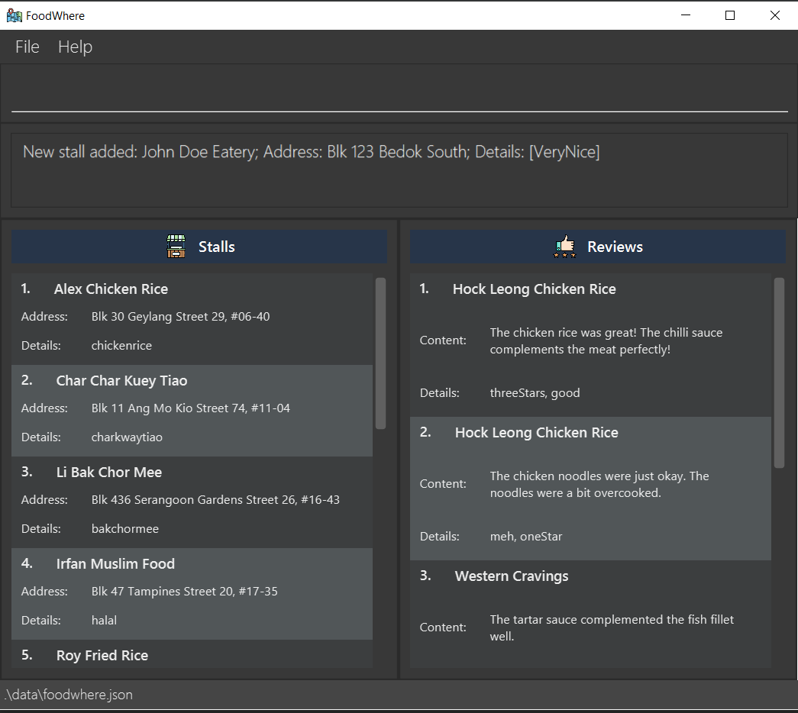

FoodWhere (FW) is a **desktop app for managing food reviews, optimized for use via a Command Line Interface** (CLI) while still having the benefits of a Graphical User Interface (GUI). FW can get your tasks done faster than traditional GUI apps if you can type fast.

* Table of Contents
{:toc}

--------------------------------------------------------------------------------------------------------------------

## Quick start

1. Ensure you have Java `11` or above installed in your Computer.

1. Download the latest `FoodWhere.jar` from [here](https://github.com/AY2223S1-CS2103-W14-2/tp/releases).

1. Copy the file to the folder you want to use as the _home folder_ for your application.

1. On Windows and Mac, double-click the file to start the app. The GUI similar to the below should appear in a few seconds. Note how the app contains some sample data. 
   

1. Type the command in the command box and press Enter to execute it. e.g. typing **`help`** and pressing Enter will open the help window. 
   Some example commands you can try:

   * **`slist`** : Lists all food stalls.

   * **`sadd`**`n/John Doe Eatery a/Blk 123 Bedok South t/halal`: Adds a food stall named John Doe Eatery to
     the list of food stalls.

   * **`sdel`**`3` : Deletes the 3rd food stall shown in the current list.
   
   * **`exit`** : Exits the app.

1. Refer to the [Features](#features) below for details of each command.

--------------------------------------------------------------------------------------------------------------------

## Features

**:information_source: Notes about the command format:** 

* Words in `UPPER_CASE` are the parameters to be supplied by the user. 
  e.g. in `sadd n/NAME a/ADDRESS`, `NAME` and `ADDRESS` are parameters which can be used as `sadd n/John Doe a/ABC Ave`.

* Items in square brackets are optional. 
  e.g `n/NAME [t/TAGS]` can be used as `n/John Doe t/opensDaily` or as `n/John Doe`.

* Items with `…`​ after them can be used multiple times including zero times. 
  e.g. `[t/TAGS]…​` can be used as ` ` (i.e. 0 times), `t/opendaily`, `t/petfriendly` etc.

* Parameters can be in any order. 
  e.g. if the command specifies `n/NAME t/TAGS`, `t/TAGS n/NAME` is also acceptable.

* If a parameter is expected only once in the command but you specified it multiple times, only the last occurrence of the parameter will be taken. 
  e.g. if you specify `n/John Doe Eatery n/Jane Doe Eatery`, only `n/Jane Doe Eatery` will be taken.

* Extraneous parameters for commands that do not take in parameters (such as `help`, `list`, `exit` and `clear`) will be ignored. 
  e.g. if the command specifies `help 123`, it will be interpreted as `help`.

### Viewing help : `help`

Shows a message explaining how to access the help page.

Format: `help`

### Adding a stall: `sadd`

Adds a stall.

Format: `sadd n/NAME a/ADDRESS [t/TAGS]...`

Examples:
* `sadd n/John Doe Eatery a/Blk 123 Bedok South t/VeryNice`

### Adding a review: `radd`

Adds a review.

Format: `radd s/STALL_INDEX d/DATE c/CONTENT [t/TAGS]...`
Examples:
* `radd s/3 d/2022-09-20 c/The food was good, the chicken rice was fresh.`

### Listing all stalls: `slist`
Shows a list of all stalls in the application.

Format: `slist`

### Listing all reviews: `rlist`

Shows a list of all reviews in the application.

Format: `rlist`

### Deleting a stall: `sdel`

Deletes the specified stall from the application at the specified `INDEX`.

Format: `sdel INDEX`

* The index refers to the index number shown in the displayed stalls list.
* The index must be a positive integer 1, 2, 3, …​

Example:
* `sdel 2` deletes the 2nd stall in the application.

### Deleting a review: `rdel`

Deletes a review at the specified `INDEX`.

Format: `rdel INDEX`

* The index refers to the index number shown in the displayed reviews list.
* The index must be a positive integer 1, 2, 3, …​

Example:
* `rdel 2` deletes the 2nd review in the application.

### Clearing all entries : `clear`

Deletes all entries from the stall list and review list.

Format: `clear`

### Exiting the program : `exit`

Exits the program.

Format: `exit`

### Saving the data

FoodWhere data is saved in the hard disk automatically after any command that changes the data. There is no need to save manually.

### Editing the data file

FoodWhere data are saved as a JSON file `[JAR file location]/data/foodwhere.json`. Advanced users are welcome to update data directly by editing that data file.

:exclamation: **Caution:**
If your changes to the data file make its format invalid, FoodWhere will discard all data and start with an empty data file at the next run.

--------------------------------------------------------------------------------------------------------------------

## FAQ

**Q**: How do I transfer my data to another Computer? 
**A**: Install the app on the other computer and overwrite the empty data file it creates with the file that contains the data of your previous FoodWhere application.

--------------------------------------------------------------------------------------------------------------------

## Command summary

| Action    | Format, Examples                                                                                        |
|-----------|---------------------------------------------------------------------------------------------------------|
| **Exit**  | `exit`                                                                                                  |
| **Help**  | `help`                                                                                                  |
| **Clear** | `clear`                                                                                                 |
| **rAdd**  | `radd s/STALL_INDEX d/DATE c/CONTENT [t/TAGS]`  e.g., `radd s/3 d/2022-09-20 c/Great food!`          |
| **rDel**  | `rdel INDEX`                                                                                            |
| **rList** | `rlist`                                                                                                 |
| **sAdd**  | `sadd n/NAME a/ADDRESS [t/TAGS]…`  e.g., `sadd n/John Chicken Rice a/Blk 123 Bedok South t/veryNice` |
| **sDel**  | `sdel INDEX`                                                                                            |
| **sList** | `slist`                                                                                                 |
