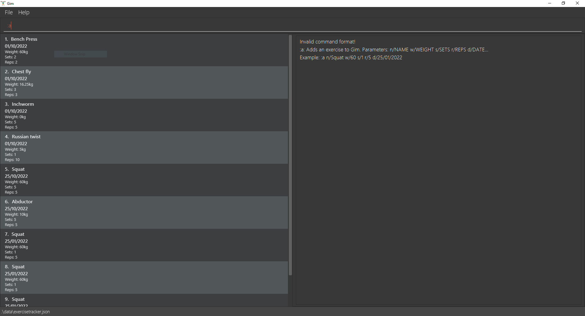

Condonery is a desktop app made for property agents primarily used for managing client contacts and condo listings.
It is optimized for use via a Command Line Interface (CLI) while still having the benefits of a Graphical User Interface (GUI).
If you can type fast, Condonery can get your contact management tasks done faster than traditional GUI apps.

* Table of Contents
  {:toc}

--------------------------------------------------------------------------------------------------------------------

## Quick start

1. Ensure you have Java `11` or above installed in your Computer.

1. Download the latest `condonery.jar` from [here](https://github.com/se-edu/addressbook-level3/releases).

1. Copy the file to the folder you want to use as the _home folder_ for your Condonery.

1. Double-click the file to start the app. The interface will look like this.
   

1. Type the command in the command box and press Enter to execute it. e.g. typing **`help`** and pressing Enter will open the help window. 
   Some example commands you can try:

    * **`list -p`** : Lists all properties.

    * **`add`**`n/Pinnacle@Duxton a/Cantonment Rd, #1G, 085301 t/luxury` : Adds a listing named `Pinnacle@Duxton` to the property directory.

    * **`list -p delete`**`3` : Deletes the 3rd property shown in the current list.

    * **`exit`** : Exits the app.

1. Refer to the [Features](#features) below for details of each command.

--------------------------------------------------------------------------------------------------------------------

## Features syntax

**:information_source: Notes about the command format:** 

* Words in `UPPER_CASE` are the parameters to be supplied by the user. 
  e.g. in `add n/NAME`, `NAME` is a parameter which can be used as `add n/John Doe`.

* Items in square brackets are optional. 
  e.g `n/NAME [t/TAG]` can be used as `n/John Doe t/friend` or as `n/John Doe`.

* Items with `…`​ after them can be used multiple times including zero times. 
  e.g. `[t/TAG]…​` can be used as ` ` (i.e. 0 times), `t/friend`, `t/friend t/family` etc.

* Parameters can be in any order. 
  e.g. if the command specifies `n/NAME p/PHONE_NUMBER`, `p/PHONE_NUMBER n/NAME` is also acceptable.

* If a parameter is expected only once in the command but you specified it multiple times, only the last occurrence of the parameter will be taken. 
  e.g. if you specify `p/12341234 p/56785678`, only `p/56785678` will be taken.

* Extraneous parameters for commands that do not take in parameters (such as `help`, `list`, `exit` and `clear`) will be ignored. 
  e.g. if the command specifies `help 123`, it will be interpreted as `help`.

--------------------------------------------------------------------------------------------------------------------

## Features in Property Directory

### Viewing help : `help`

Shows a message explaning how to access the help page.

Format: `help`

### Adding a property: `add -p`

Adds a property to the property directory.

Format: `add -p n/NAME a/ADDRESS p/PRICE [t/TAG]…​`

:bulb: **Tip:**
A property can have any number of tags (including 0)

Examples:
* `add n/PINNACLE@DUXTON a/John street, block 123, #01-01 p/1,000,000`
* `add n/SESAME STREET a/John street, block 123, #01-01 p/1,000,000 t/high-end`

### Listing all properties : `list -p`

Shows a list of all properties in the address book.

Format: `list -p`

### Editing a property : `edit -p`

Edits an existing person in the address book.

Format: `edit INDEX [n/NAME] [a/ADDRESS] [p/PRICE] [t/TAG]…​`

* Edits the property at the specified `INDEX`. The index refers to the index number shown in the displayed property list. The index **must be a positive integer** 1, 2, 3, …​
* At least one of the optional fields must be provided.
* Existing values will be updated to the input values.
* When editing tags, the existing tags of the person will be removed i.e adding of tags is not cumulative.
* You can remove all the property’s tags by typing `t/` without
  specifying any tags after it.

Examples:
*  `edit 1 p/1,000,000 a/11 Pulau Tekong Besar, Pulau, Tekong Camp, 508450` Edits the price and address of the 1st person to be `1,000,000` and `11 Pulau Tekong Besar, Pulau, Tekong Camp, 508450` respectively.
*  `edit 2 n/Cinammon College t/` Edits the name of the 2nd property to be `Cinammon College` and clears all existing tags.

### Locating properties by name: `find -p`

Finds properties whose names contain any of the given keywords.

Format: `find KEYWORD [MORE_KEYWORDS]`

* The search is case-insensitive. e.g `hans` will match `Hans`
* The order of the keywords does not matter. e.g. `Hans Bo` will match `Bo Hans`
* Only the name is searched.
* Only full words will be matched e.g. `Han` will not match `Hans`
* Persons matching at least one keyword will be returned (i.e. `OR` search).
  e.g. `Hans Bo` will return `Hans Gruber`, `Bo Yang`

Examples:
* `find -p Wall Street` returns `Wall Street` and `Wall Street Prime`
* `find -p Pinnacle@Duxton Sesame Street` returns `Pinnacle@Duxton`, `Sesame Street` 

[//]: # (Image to be added later)
[//]: # (  ![result for 'find alex david']&#40;images/findAlexDavidResult.png&#41;)

### Deleting a property : `delete -p`

Deletes the specified property from the address book.

Format: `delete -p INDEX`

* Deletes the property at the specified `INDEX`.
* The index refers to the index number shown in the displayed person list.
* The index **must be a positive integer** 1, 2, 3, …​

Examples:
* `list -p` followed by `delete -p 2` deletes the 2nd person in the address book.
* `find -p Wall Street` followed by `delete -p 1` deletes the 1st person in the results of the `find -p` command.

### Filtering profiles: `filter -p`

Returns a filtered list of properties that fulfil the filter conditions for tags only.
Format: `filter -p TAG...`
Examples:
* `filter -p high-end` returns all properties with the `high-end` tag.
* `filter -p available` returns all properties with the `available` tag.

### Filtering properties within price range: `range -p`

Returns a filtered list of clients that fulfil the filter conditions.
Format: `range -p l/100,000 u/1,000,000`
Examples:
* `range -p l/100,000 u/1,000,000` returns all properties within the price range of 100,000 and 1,000,000 inclusive.

### Clearing all entries : `clear`

Clears all properties from the property directory.

Format: `clear`

### Exiting the program : `exit`

Exits the program.

Format: `exit`

### Saving the data

AddressBook data are saved in the hard disk automatically after any command that changes the data. There is no need to save manually.

### Editing the data file

AddressBook data are saved as a JSON file `[JAR file location]/data/addressbook.json`. Advanced users are welcome to update data directly by editing that data file.

:exclamation: **Caution:**
If your changes to the data file makes its format invalid, AddressBook will discard all data and start with an empty data file at the next run.

### Archiving data files `[coming in v2.0]`

_Details coming soon ..._

## Client Directory Features

### Adding a client profile: `add`

Adds a client profile to the client directory.
Format: `add -c [n/NAME] [p/PHONE_NUMBER] [e/EMAIL] [t/TAG]...`
Tips:
* At least one of the optional fields must be provided.
  Examples:
* `add -c n/Bob p/91234567 e/bobthebuilder@gmail.com`

### Editing a client profile: `edit`

Edits a client profile already existing in the client directory.
Format: `edit -c INDEX [n/NAME] [p/PHONE_NUMBER] [e/EMAIL] [t/TAG]...`
Tips:
* Edits the client profile at the specified INDEX. The index refers to the index numebr shown
  in the displayed person list. The index must be a positive integer 1, 2, 3, ...
* At least one of the optional fields must be provided.
* Existing values will be updated to the input values.
* When editing tags, the existing tags of the listing will be removed i.e. adding of tags is not cumulative.
* You can remove all the listing's tags b
  Examples:
* `edit -c 5 n/Bob p/91234567 e/bobthebuilder@gmail.com`

### Listing all client profiles: `list`

Lists all client profiles currently stored in the client directory.
Format: `list -c`

### Labeling a client: `label`

Gives a label for a client at the specified INDEX.
Format: `label INDEX l/LABEL`
Examples:
* `list -c` followed by `label 3 l/urgent-buyer` labels the third client in the address book
  as an `urgent-buyer`

### Filtering client profiles: `filter`

Returns a filtered list of clients that fulfil the filter conditions.
Format: `filter -c TAG...`
Examples:
* `filter -c high-end`
* `filter -c squatter`

### Deleting a client profile: `delete`

Deletes the unique client profile at the specified INDEX.
Format: `delete INDEX`
Tips:
* The INDEX must be a positive integer 1, 2, 3...
  Examples:
* `list -c` followed by `delete 2` deletes the second client in the address book
* `filter -c Lee` followed by `delete 1` deletes the first client in the results of the
  `filter` command

--------------------------------------------------------------------------------------------------------------------

## FAQ

**Q**: How do I transfer my data to another Computer? 
**A**: Install the app in the other computer and overwrite the empty data file it creates with the file that contains the data of your previous AddressBook home folder.

--------------------------------------------------------------------------------------------------------------------

## Command summary

Action | Format, Examples
--------|------------------
**Add** | `add n/NAME p/PHONE_NUMBER e/EMAIL a/ADDRESS [t/TAG]…​`   e.g., `add n/James Ho p/22224444 e/jamesho@example.com a/123, Clementi Rd, 1234665 t/friend t/colleague`
**Clear** | `clear`
**Delete** | `delete INDEX`  e.g., `delete 3`
**Edit** | `edit INDEX [n/NAME] [p/PHONE_NUMBER] [e/EMAIL] [a/ADDRESS] [t/TAG]…​`  e.g.,`edit 2 n/James Lee e/jameslee@example.com`
**Find** | `find KEYWORD [MORE_KEYWORDS]`  e.g., `find James Jake`
**List** | `list`
**Help** | `help`
