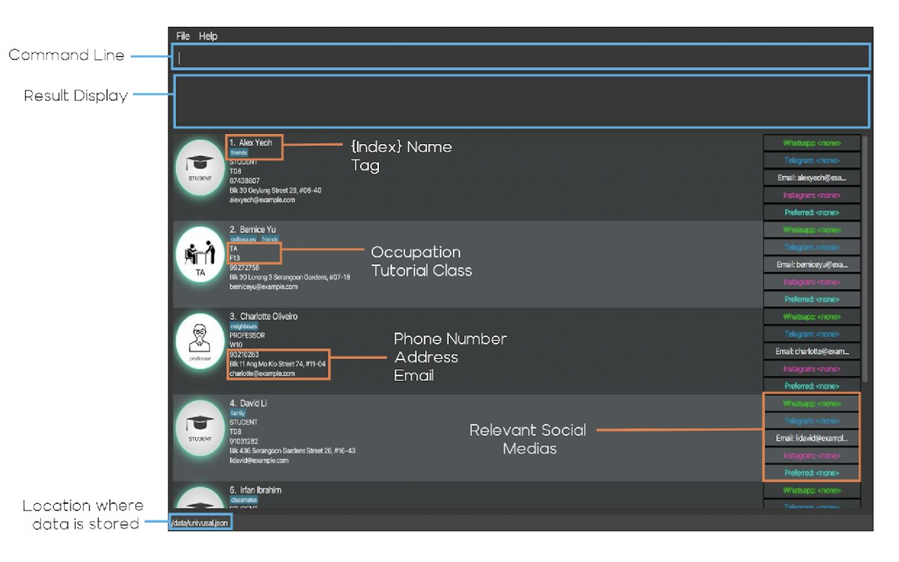
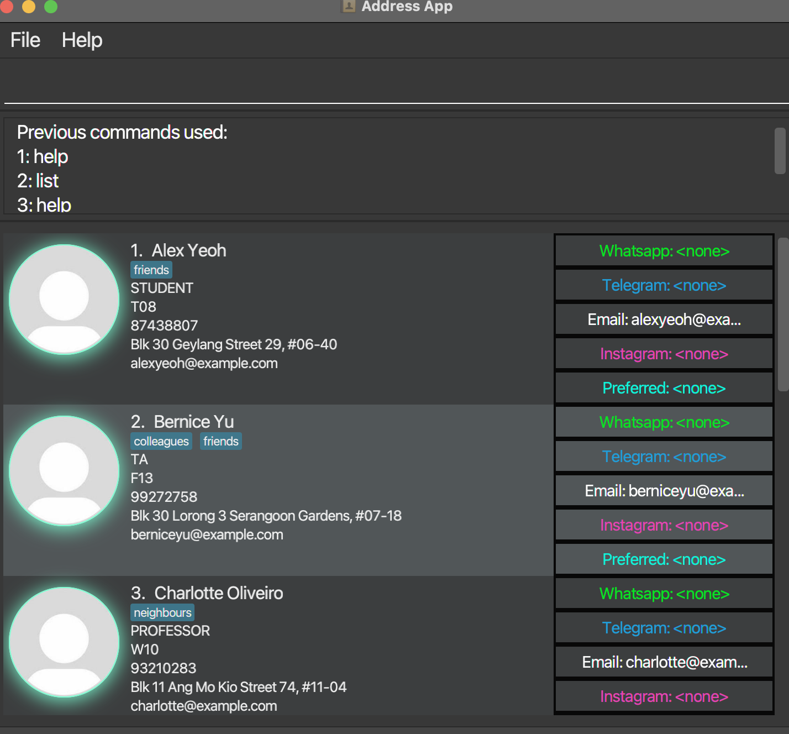

# uNivUSal

uNivUSal is a **desktop app for managing contacts catered to CS2103T students, TAs, and professors**, optimized for use
via a Command Line Interface (CLI) while still having the benefits of a Graphical User Interface (GUI).

* [Quick start](#quick-start)
* [Features](#features)
  * [Person Fields](#person-fields):
    1. [occupation](#a-occupation--o) : `o/`
    2. [name](#b-name--n) : `n/`
    3. [phone](#c-phone--pphone) : `p/`
    4. [tutorial](#d-tutorial--tuttutorial) : `tut/`
    5. [tags](#e-tags--ttags) : `t/`
  * [Basic Features](#basic-features):
    1. [Adding a person](#a-adding-a-person-add) : `add`
    2. [Editing a person](#b-editing-a-person--edit) : `edit`
    3. [Deleting a person](#c-deleting-a-person--delete) : `delete`
    4. [Listing all persons](#d-listing-all-persons--list) : `list`
    5. [Clearing all entries](#e-clearing-all-entries--clear) : `clear`
    6. [Find a person](#f-find-entries-by-keywords-of-fields--find-keyword-eg-find-john) : `find`
    7. [Sorting entries by field](#g-sort-entries-by-field--sort-field_prefix-eg-sort-n) : `sort`
  * [Enhanced Features](#enhanced-features):
    1. [Quickly edit a person](#a-quickly-edit-a-persons-features)
    2. [Add a person to favorite](#b-add-a-person-to-favorite--fav) : `fav`
    3. [Add a person to a group](#c-adding-a-person-to-a-group--addtogroup): `addtogroup`
    4. [Remove a person from a group](#d-removing-a-person-from-a-group--ungroup) : `ungroup`
    5. [Open a group window](#e-opening-a-group-window--group) : `group`
    6. [Email all persons in a group](#f-email-all-persons-in-a-group--emailall) : `emailall`
    7. [Add a person's social](#g-add-a-persons-socials--include) : `include`
    8. [Delete a person's social](#h-delete-a-persons-socials--exclude) : `exclude`
    9. [Set a person's preferred social media](#i-set-a-persons-preferred-social-media--prefer)
    10. [Open a person's social media](#j-open-a-persons-social-media--open) : `open`
    11. [Find persons with a preferred social media](#k-find-persons-with-a-preferred-social-media--social) : `social`
  * [General App Features](#general-app-features):
    1. [Viewing help](#a-viewing-help--help) : `help`
    2. [Viewing history](#b-viewing-history--history) : `history`
    3. [Undoing last command](#c-undo-last-modification--undo) : `undo`
    4. [Exiting the app](#d-exiting-the-program--exit) : `exit`
* [Command summary](#command-summary)

--------------------------------------------------------------------------------------------------------------------

## Quick start

1. Ensure you have Java `11` or above installed in your Computer.

2. Download the latest `univusal.jar` (in progress).

3. Copy the file to the folder you want to use as the _home folder_ for your uNivUSal.

4. Double-click the file to start the app. The GUI similar to the below should appear in a few seconds.
Note how the app contains some sample data. 
   

5. Type the command in the command box and press Enter to execute it. e.g. typing **`help`** and pressing Enter will
open the help window.

6. Refer to the [Features](#features) below for details of each command.

--------------------------------------------------------------------------------------------------------------------

## Features

**:information_source: Notes about the command format:** 

* Words in `UPPER_CASE` are the parameters to be supplied by the user. 
  e.g. in `add n/NAME`, `NAME` is a parameter which can be used as `add n/John Doe`.

* Items in square brackets are optional. 
  e.g `n/NAME [t/TAG]` can be used as `n/John Doe t/friend` or as `n/John Doe`.

* Items with `…`​ after them can be used multiple times including zero times. 
  e.g. `[t/TAG]…​` can be used as ` ` (i.e. 0 times), `t/friend`, `t/friend t/family` etc.

* Parameters can be in any order. 
  e.g. if the command specifies `n/NAME p/PHONE_NUMBER`, `p/PHONE_NUMBER n/NAME` is also acceptable.

* If a parameter is expected only once in the command but you specified it multiple times, only the last occurrence of the parameter will be taken. 
  e.g. if you specify `p/12341234 p/56785678`, only `p/56785678` will be taken.

* Extraneous parameters for commands that do not take in parameters (such as `help`, `list`, `exit` and `clear`) will be ignored. 
  e.g. if the command specifies `help 123`, it will be interpreted as `help`.

## Person Fields

### a. occupation : `o/`

Sets the occupation of a person in uNivUSal.

Format: `o/OCCUPATION`
* `OCCUPATION` includes `STUDENT`, `TA`, `PROFESSOR`

### b. name : `n/`

Sets the name of a person in uNivUSal.

Format: `n/NAME`
* `NAME` can be more than one word long but cannot be empty.

### c. phone : `p/PHONE`

Sets the phone number of a person in uNivUSal.

Format : `p/PHONE`
* `PHONE` must only contain digits and not alphabets.

Example : `p/97865486`

### d. tutorial : `tut/TUTORIAL`

Sets the tutorial group of a person in uNivUSal.

Format : `tut/TUTORIAL`
* `TUTORIAL` must contain a letter from `[W/T/F]` followed by two digits.

Example : `tut/T08`

### e. tags : `t/TAGS`

Sets tag(s) of a person in uNivUSal.

Format : `t/TAG`

Example : `t/ classmate`

## Basic Features

### a. Adding a person: `add`

Adds a person to uNivUSal.

Format: `add o/OCCUPATION n/NAME [p/PHONE_NUMBER] [e/EMAIL] [tut/TUTORIAL] [a/ADDRESS] [t/TAG]…​`

:bulb: **Tip:**
A person can have any number of tags (including 0)

:bulb: **Tip:**
It is fine to add a person missing many details as long as the occupation and name are present.

Examples:
* `add o/STUDENT n/John Doe p/98765432 e/johnd@example.com tut/T08 a/John street, block 123, #01-01`
* `add o/TA n/Betsy Crowe e/betsycrowe@u.nus.edu`

### b. Editing a person : `edit`

Edits an existing person in uNivUSal.

Format: `edit INDEX [o/OCCUPATION] [n/NAME] [p/PHONE] [e/EMAIL] [tut/TUTORIAL] [t/TAG]…​`

* Edits the person at the specified `INDEX`. The index refers to the index number shown in the displayed person list. The index **must be a positive integer** 1, 2, 3, …​
* At least one of the optional fields must be provided.
* Existing values will be updated to the input values.
* When editing tags, the existing tags of the person will be removed i.e adding of tags is not cumulative.
* You can remove all the person’s tags by typing `t/` without
  specifying any tags after it.

Examples:
* `edit 1 p/91234567 e/janedoe@example.com` Edits the phone number and email address of the 1st person to be `91234567`
and `janedoe@example.com` respectively.
* `edit 2 n/Betsy Crower t/` Edits the name of the 2nd person to be `Betsy Crower` and **clears** all existing tags.

### c. Deleting a person : `delete`

Deletes the specified person from uNivUSal.

Format: `delete INDEX {OPTIONAL PREFIX/}`

* Deletes the person at the specified `INDEX`.
* The index refers to the index number shown in the displayed person list.
* The index **must be a positive integer** 1, 2, 3, …​
* If `PREFIX/` is provided, deletes the specified field of the person at the specified `INDEX`

Examples:
* `list` followed by `delete 2` deletes the 2nd person in uNivUSal.
* `find Betsy` followed by `delete 1` deletes the 1st person in the results of the `find` command.
* `list` followed by `delete 2 p/` deletes the 2nd person's phone number in uNivUSal.

### d. Listing all persons : `list`

Shows a list of all persons in uNivUSal.

Format: `list`

### e. Clearing all entries : `clear`

Clears all entries from uNivUSal.

Format: `clear`
* Deletes every person in uNivUSal.
* Only a blank uNivUSal will remain.

### f. Find entries by keywords of fields : `find KEYWORD` e.g. `find John`

Finds entries in uNivUSal that match or contain case-insensitive keyword. Current fields searchable are:
1. Name
2. Phone Number

Format: `find KEYWORD`
* Filters the entries by the specified `KEYWORD`.
* Displays filtered list.

Examples:
* `find John` displays the entries filtered by names that contain the case-insensitive KEYWORD `John`.
* `find J` displays the entries filtered by names that contain the case-insensitive KEYWORD `J`.
* `find 123456` displays the entries filtered by phone numbers that contain the case-insensitive KEYWORD `123456`.

### g. Sort entries by field : `sort FIELD_PREFIX/` e.g. `sort n/`

Sorts entries in uNivUSal by specific field prefix in an ascending manner. Current fields implemented are:
1. Name `n/`
2. Email address `e/`
3. Phone `p/`

Format: `sort FIELD_PREFIX/`
* Sorts the entries by the specified `FIELD_PREFIX/`.
* Displays sorted list.

Examples:
* `sort n/` displays the entries sorted by name alphabetically.
* `sort e/` displays the entries sorted by email address alphabetically.
* `sort p/` displays the entries sorted by phone number in an ascending manner.

## Enhanced Features

### a. Quickly edit a person's features

Quickly make small changes to a person by clicking on a person card while the command box is empty.
This creates an edit command with all the features that person currently has.
You may then modify this command to your needs.

### b. Add a person to favorite : `fav`

Adds the specified person to `favorite` group.

Format: `fav INDEX`
* The index refers to the index number shown in the displayed person list.
* The index **must be a positive integer** 1, 2, 3, …​

Examples:
* `fav 1` will add 1st person in the current list to `favorite`.

### c. Adding a person to a group : `addtogroup`

Adds the specified person to the specified group.

Format: `addtogroup INDEX GROUP`

* Adds the person at the specified `INDEX` to the specified `GROUP`.
* The index refers to the index number shown in the displayed person list.
* The index **must be a positive integer** 1, 2, 3, …​

Examples:
* `addtogroup 1 friends` adds the 1st person in the current list to the group `friends`.

### d. Removing a person from a group : `ungroup`

Removes the specified person from the specified group.

Format: `ungroup INDEX GROUP`

* Removes the person at the specified `INDEX` from the specified `GROUP`.
* The index refers to the index number shown in the displayed person list.
* The index **must be a positive integer** 1, 2, 3, …​

Examples:
* `ungroup 1 friends` ungroups the 1st person in the current list from the group `friends`.

### e. Opening a group window : `group`

Open a new window containing the persons in the group.

Format: `group GROUPNAME`

* Opens a new window containing persons from the specified `GROUPNAME`.
* `GROUPNAME` should not contain spaces.

Examples:
* `group friends` opens a group window containing persons in the group `friends`.

### f. Email all persons in a group : `emailall`

Open an email link to all persons in the specified group.

Format: `emailall GROUPNAME`

* Opens the email client to all persons in `GROUPNAME`.
* `GROUPNAME` should not contain spaces.

Examples:
* `emailall friends` opens the email client to all persons in the group `friends`.

### g. Add a person's socials : `include`

Adds a valid SOCIAL to an existing person in uNivUSal.

General format: `include INDEX s/SOCIAL #/SOCIAL_INFO`

* `SOCIAL` currently includes:
  * Whatsapp
  * Telegram
  * Email
  * Instagram
* `SOCIAL_INFO` currently includes:
  * Whatsapp phone number
  * Telegram username
  * Email
  * Instagram username
* `SOCIAL` is case-insensitive

Format(WHATSAPP): `include INDEX s/WHATSAPP #/WHATSAPP_PHONE_NUMBER`

Format(Telegram): `include INDEX s/TELEGRAM #/TELEGRAM_USERNAME`

Format(Email): `include INDEX s/EMAIL #/EMAIL

Format(Instagram): `include INDEX s/INSTAGRAM #/INSTAGRAM_USERNAME`

Examples:
* `include 1 s/WHATSAPP #/87654321`
* `include 1 s/TELEGRAM #/JohnDoe321`
* `include 1 s/EMAIL #/johnd@example.com`
* `include 1 s/INSTAGRAM #/johndoe`

### h. Delete a person's socials : `exclude`

Deletes the specified person's socials from uNivUSal.

Format: `exclude INDEX s/SOCIAL`

* `SOCIAL` currently includes:
  * Whatsapp
  * Telegram
  * Email
  * Instagram
* `SOCIAL` is case-insensitive

Examples:
* `exclude 1 s/TELEGRAM`
* `exclude 1 s/INSTAGRAM`

### i. Set a person's preferred social media : `prefer`

Set the specified person's preferred social media in uNivUSal.

Format: `prefer INDEX s/SOCIAL`

* `SOCIAL` currently includes:
  * Whatsapp
  * Telegram
  * Email
  * Instagram
* `SOCIAL` is case-insensitive

Examples:
* `prefer 1 s/TELEGRAM`
* `prefer 1 s/INSTAGRAM`

### j. Open a person's social media : `open`

Open the specified person's social media in uNivUSal.

Format: `open INDEX s/SOCIAL`

* `SOCIAL` currently includes:
  * Whatsapp
  * Telegram
  * Email
  * Instagram
  * Preferred (the person's currently preferred social media that has been set)
* `SOCIAL` is case-insensitive

Examples:
* `open 1 s/TELEGRAM`
* `open 1 s/INSTAGRAM`
* `open 1 s/PREFERRED`

### k. Find persons with a preferred social media : `social`

Filters the current list to people who set their preferred social media to the input.

Format: `social SOCIAL`
* `SOCIAL` currently includes:
  * Whatsapp
  * Telegram
  * Email
  * Instagram
* `SOCIAL` is case-insensitive

Examples:
* `social telegram` will display a filtered list of persons with `telegram` as their preferred social media.

## General App Features

### a. Viewing help : `help`

Shows a message explaining the basic features of the app and also provides a link to the website.

Format: `help`

### b. Viewing history : `history`

Shows up to the previous five commands typed by the user.

Format: `history`

### c. Undo last modification : `undo`

Undoes the last command that modifies the address book.

Format: `undo`
* Undoes the last modifying command.
* Ignores modifying commands if they don't modify the address book.
* Will cancel out when trying to undo an undo command.

### d. Exiting the program : `exit`

Exits the program.

Format: `exit`

### Saving the data

uNivUSal data are saved in the hard disk automatically after any command that changes the data. There is no need to save manually.

### Editing the data file

uNivUSal data are saved as a JSON file `[JAR file location]/data/univusal.json`. Advanced users are welcome to update data directly by editing that data file.

:exclamation: **Caution:**
If your changes to the data file makes its format invalid, uNivUSal will discard all data and start with an empty data file at the next run.

### Archiving data files `[coming in v2.0]`

_Details coming soon ..._

--------------------------------------------------------------------------------------------------------------------

## FAQ

**Q**: How do I transfer my data to another Computer? 
**A**: Install the app in the other computer and overwrite the empty data file it creates with the file that contains the data of your previous uNivUSal home folder.

_Details coming soon ..._

--------------------------------------------------------------------------------------------------------------------

## Command summary

| Action                | Format, Examples                                                                                                                                                                                             |
|-----------------------|--------------------------------------------------------------------------------------------------------------------------------------------------------------------------------------------------------------|
| **Help**              | `help`                                                                                                                                                                                                       |
| **History**           | `history`                                                                                                                                                                                                    |
| **Add**               | `add o/OCCUPATION n/NAME [p/PHONE_NUMBER] [e/EMAIL] [tut/TUTORIAL] [t/TAG]…​`  e.g., `add o/STUDENT n/James Ho p/22224444 e/jamesho@example.com tut/T08 a/123, Clementi Rd, 1234665 t/friend t/colleague` |
| **List**              | `list`                                                                                                                                                                                                       |
| **Edit**              | `edit INDEX [o/OCCUPATION] [n/NAME] [p/PHONE_NUMBER] [e/EMAIL] [tut/TUTORIAL] [t/TAG]…​`  e.g.,`edit 2 n/James Lee e/jameslee@example.com`                                                                |
| **Delete**            | `delete INDEX [OPTIONAL PREFIX/]`  e.g., `delete 3`,`delete 3 p/`                                                                                                                                         |
| **Clear**             | `clear`                                                                                                                                                                                                      |                                                                             |                                                                                                          |
| **Undo**              | `undo`                                                                                                                                                                                                       |
| **Sort**              | `sort FIELD_PREFIX/`   e.g., `sort n/`                                                                                                                                                                    |
| **Find**              | `find KEYWORD`   e.g., `find John / find J`                                                                                                                                                               |
| **Add To Group**      | `addtogroup INDEX GROUP`                                                                                                                                                                                     |
| **Ungroup**           | `ungroup INDEX GROUP`                                                                                                                                                                                        |
| **Open Group Window** | `group GROUPNAME`                                                                                                                                                                                            |
| **Favorite**          | `fav INDEX`                                                                                                                                                                                                  |
| **Include**           | `include INDEX s/SOCIAL #/SOCIAL_INFO` |
| **Exclude**           | `exclude INDEX s/SOCIAL`               |
|  **Prefer**           | `open INDEX s/SOCIAL`                 |
| **Open**              | `open INDEX s/SOCIAL`                 |
| **Social**            | `social SOCIAL`                        |                                                                                                                                                                      |
| **Email All**         | `emailall GROUPNAME`                                                                                                                                                                                         |
| **Exit**              | `exit`                                                                                                                                                                                                       |
