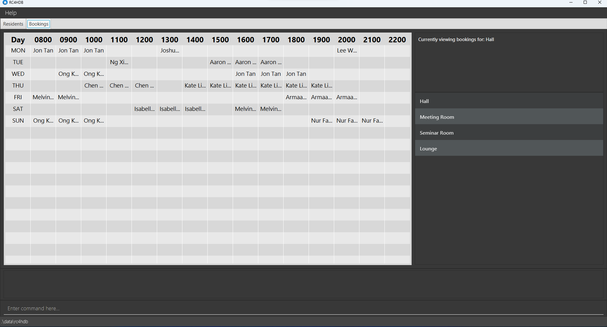

# **Welcome to RC4HDB User Guide!**

If you are a **Residential College 4 (RC4)** Housing Management staff, or someone who wants to find out more
about what **Residential College 4 Housing Database (RC4HDB)** can do for you, you are at the right place!

In this user guide, you will find step-by-step instructions on how you can install **RC4HDB**, as well as how you
can use **RC4HDB** to its fullest potential.

If you are looking to expand on our project, check out our [Developer Guide](DeveloperGuide.md) too!

---

## **Table of Contents**

* [**Introduction to RC4HDB**](#introduction-to-rc4hdb)
* [**Using this guide**](#using-this-guide)
* [**Quick start**](#quick-start)
* [**Command guide**](#command-guide)
  * [**Getting help**](#getting-help)
  * [**Modifying resident data**](#modifying-resident-data)
    * [Adding a resident `add`](#adding-a-resident--add)
    * [Editing an existing resident `edit`](#editing-an-existing-resident--edit)
    * [Deleting an existing resident `delete`](#deleting-a-resident--delete)
    * [Clearing all residents `clear`](#clearing-all-entries--clear)
    * [Resident field format](#format-for-resident-fields)
  * [**Viewing residents**](#viewing-residents)
    * [Listing all residents `list`](#listing-all-residents--list)
    * [Showing resident fields `showonly`](#showing-only-some-columns--showonly)
    * [Hiding resident fields `hideonly`](#hiding-only-some-columns--hideonly)
    * [Resetting hidden resident fields `reset`](u#resetting-hidden-columns--reset)
    * [Finding residents `find`](#locating-residents-by-name--find)
    * [Filtering residents `filter`](#filtering-residents-by-field--filter)
  * [**File management**](#file-management)
    * [Finding your data](#finding-your-data)
    * [Editing your data file](#editing-your-data-file)
    * [Saving your data](#saving-your-data)
    * [Creating a new data folder `file create`](#creating-a-new-data-folder--file-create)
    * [Deleting an existing data folder `file delete`](#deleting-an-existing-data-folder--file-delete)
    * [Switching to a different data folder `file switch`](#switching-to-a-different-data-folder--file-switch)
    * [Importing resident data from CSV file `file import`](#importing-resident-data-from-csv-file--file-import)
    * [CSV file format](#csv-file-format)
  * [**Venue management**](#venue-management)
    * [Viewing the bookings](#viewing-the-bookings)
    * [Adding a venue `venue add`](#adding-a-venue--venue-add)
    * [Deleting a venue `venue delete`](#deleting-a-venue--venue-delete)
    * [Viewing a venue `venue view`](#viewing-a-venue--venue-view)
    * [Adding a booking `venue book`](#adding-a-booking-venue-book)
    * [Deleting a booking `venue unbook`](#deleting-a-booking-venue-unbook)
    * [Format for venue fields](#format-for-venue-fields)
  * [**Quality-of-life**](#quality-of-life)
    * [Keyboard shortcuts](#keyboard-shortcuts)
    * [Accessing command history](#accessing-command-history)
  * [**Exiting RC4HDB `exit`**](#exiting-the-program--exit)
  * [**Upcoming features**](#upcoming-features)
* [**FAQ**](#faq)
* [**Glossary**](#glossary-of-terms)
* [**Authors**](#authors)
* [**Command Summary**](#command-summary)

---

## **Introduction to RC4HDB**

**RC4HDB** is a desktop application which streamlines the daily workflow of **RC4 housing management staff**, by providing specialised features which solve their resident and venue management needs.

Broadly, **RC4HDB** provides users with the ability to:
* View and manage resident data
* View and manage venues and any bookings
* Keep and manage multiple data files
* Easily switch over to RC4HDB by importing old data from CSV files

If you can type fast, RC4HDB can be a convenient and intuitive way to facilitate your day-to-day
workflow as a RC4 housing management staff member.

[↑ Back to Top](#welcome-to-rc4hdb-user-guide)

---

## **Using this guide**

This user guide contains all the information that you will need to know as a user of **RC4HDB**. We hope that it
will serve you well in mastering RC4HDB!

If you are a **new user**, the necessary knowledge for you to get started can be found [here](#quick-start).
As you read on, you will find plenty of examples to help you familiarise with the features.

If you are an **experienced user**, a [Command Summary](#command-summary) is also provided, so you don't have to memorise our commands.

Before exploring the user guide, you should familiarise yourself with the following symbols.

:information_source: **Note:** Used to highlight information you should
pay attention to. 

:bulb: **Tip:** used to highlight tips. 

:exclamation: **Caution:** used to highlight dangers. 

[↑ Back to Top](#welcome-to-rc4hdb-user-guide)

---

## **Quick start**

Here is a quick guide on how to get a working copy of RC4HDB on your computer.

### 1. Setup

Ensure you have [*Java 11*](https://www.oracle.com/sg/java/technologies/javase/jdk11-archive-downloads.html) or
above installed on your Computer.

### 2. Install

Visit this [link](https://github.com/AY2223S1-CS2103T-W12-3/tp/releases/). Click on the underlined `rc4hdb.jar` button to download the latest `rc4hdb.jar`. Move the `rc4hdb.jar` file to the folder you want to use as the _home folder_ for RC4HDB. The home folder is the folder from which the application will run, save data to, and retrieve data from.

### 3. Running RC4HDB

Double-click the file to start the app. The **Graphical User Interface (GUI)** similar to the one shown
below should appear in a few seconds.

:exclamation: **Caution:**
You may have noticed that upon double-clicking `rc4hdb.jar` for the first time, several files were created. **Do not
delete the folder called `data` as this would cause all your data to be deleted!**

 

### 4. Try it out!

Try typing `help` into the command box where it says "Enter Command here..." and pressing the Enter/Return key on your keyboard to execute it! This command will open a help window which shows you a quick summary of our available commands.

For more details on commands, refer to our [Command Guide](#command-guide) below.

[↑ Back to Top](#welcome-to-rc4hdb-user-guide)

---

## **Command Guide**

Below shows a breakdown of how the commands in **RC4HDB** are structured. Don't be afraid that you
may have typed a command incorrectly as **RC4HDB** will warn you in the event that this happens!

* Words in `UPPER_CASE` are compulsory parameters and must be entered by you. 
  Parameters are texts you enter to tell **RC4HDB** the information necessary for the command to work.

  e.g. when using the `add` command, `NAME` is a parameter which you must enter. Thus, the command format is as such:`add n/NAME`. To add a resident named "John Doe", you can then enter `add n/John Doe`.

* Items in square brackets are optional. 
  e.g. `n/NAME [t/TAG]` can be used as `n/John Doe t/friend` or as `n/John Doe`.

* Items with `…`​ after them can be used multiple times. This also includes 0 times. 
  e.g. `[t/TAG]…​` can be used as ` ` (i.e. 0 times), `t/friend`, `t/friend t/family` etc.

* Parameters can be in any order. 
  e.g. if the command specifies `n/NAME p/PHONE_NUMBER`, `p/PHONE_NUMBER n/NAME` is also acceptable.

* If a parameter is expected only once in the command but you specified it multiple times, only the last occurrence of the parameter will be taken,
  unless otherwise specified. 
  e.g. if you specify `p/12341234 p/56785678`, only `p/56785678` will be taken.

* Irrelevant parameters for commands that do not take in parameters (such as `help`, `list`, `exit` and `clear`) will be ignored. 
  e.g. if the command specifies `help 123`, it will be interpreted as `help`.

[↑ Back to Top](#welcome-to-rc4hdb-user-guide)

---

## **Getting Help**

Viewing the command summary from the user guide can be a hassle to some. As an alternative, we have incorporated it
directly into **RC4HDB**.

### Viewing help : `help`

Opens a window with a summary table of all commands, and examples of its usage.
A link to this user guide is also included for your convenience.

<!---

--->

Format: `help`

:bulb: **Tip:** You can press the `F1` key on your keyboard to
open the Help Window immediately! You can also press the `Esc` key on your keyboard to close the Help Window
if it is open. 

[↑ Back to Top](#welcome-to-rc4hdb-user-guide)

---

### **Modifying Resident Data**

In order to maintain the database, we have provided several basic commands such as `add`, `edit`, `delete` and `clear`
to help you manipulate residents within **RC4HDB**.

---

:information_source: **Note:**
Before proceeding to learn more about resident commands it would be good to have a quick read about the **resident fields**, which will
be used in the commands.

The resident fields can be found [here](#format-for-resident-fields).

[↑ Back to Top](#welcome-to-rc4hdb-user-guide)

---

### Adding a resident : `add`

Adds a resident into **RC4HDB**.

Format: `add n/NAME p/PHONE_NUMBER e/EMAIL r/FLOOR-UNIT g/GENDER h/HOUSE m/MATRIC_NUMBER [t/TAG]…​`

:bulb: **Tip:**
A resident can have any number of tags (including 0).

Examples:
* `add n/John Doe p/98765432 e/johnDoe@gmail.com r/5-1 g/M h/D m/A9876543B` adds a resident named John Doe, with
  relevant personal and student information.

* `add n/Betsy Crowe t/friend e/betsycrowe@example.com r/2-3 p/1234567 m/A3456789B g/F h/A` adds a resident named
  Betsy Crowe, with relevant personal and student information.

[↑ Back to Top](#welcome-to-rc4hdb-user-guide)

---

### Editing an existing resident : `edit`

Edits the data of an existing resident in **RC4HDB**.

Format: `edit INDEX [n/NAME] [p/PHONE_NUMBER] [e/EMAIL] [r/FLOOR-UNIT] [g/GENDER] [h/HOUSE] [m/MATRIC_NUMBER] [t/TAG]…​`

* Edits the resident at the specified `INDEX`.
* The index refers to the index number shown in the displayed residents list.
* The index **must be a positive integer:** 1, 2, 3, …​
* At least one of the optional parameters must be provided.
* Existing values will be updated to the input values.
* When editing tags, the existing tags of the resident will be removed i.e adding of tags is not cumulative.
* You can remove all the resident’s tags by typing `t/` without specifying any tags after it.

Examples:
*  `edit 1 p/91234567 r/5-8` Edits the phone number, room number of the 1st resident to be `91234567`, and `5-8`
   respectively.
*  `edit 2 n/Betsy Crower t/` Edits the name of the 2nd resident to be `Betsy Crower` and clears all existing tags.

[↑ Back to Top](#welcome-to-rc4hdb-user-guide)

---

### Deleting a resident : `delete`

Deletes the specified resident from **RC4HDB**.

Format: `delete INDEX`

* Deletes the resident at the specified `INDEX`.
* The index refers to the index number shown in the displayed resident list.
* The index **must be a positive integer:** 1, 2, 3, …​

:bulb: **Tip:**
The delete command can be used in conjunction with other commands such as list and find, to delete residents in different types of filtered lists.

Examples:
* `list` followed by `delete 2` deletes the 2nd resident in the database.

* `find Betsy` followed by `delete 1` deletes the 1st resident in the results of the `find` command.

[↑ Back to Top](#welcome-to-rc4hdb-user-guide)

---

### Deleting multiple residents : `remove`

Deletes the specified resident from the RC4HDB database.

Format: `remove [/SPECIFIER] KEY/VALUE [ADDITIONAL_KEYS/ADDITIONAL_VALUES]`

* A specifier is required in order for the command to work. If not it is an invalid command format
* Currently, only two specifiers are supported:
  * `/all` returns a resident if it fulfills **all** of the specified keywords.
  * `/any` returns a resident if it fulfills **any** of the specified keywords.
* Repeated keys are not permitted for both specifiers, e.g. `remove /all h/D h/A` will not work.
* However, tags can be repeated in the command e.g. `remove /all t/exchange t/fresher`
* Valid keys are those included [here](#format-for-resident-fields), and any additional tags.

Examples:
* `remove /all h/D g/M` deletes residents who are in Draco house, **and** are Male.
* `remove /any h/D h/A` deletes residents belonging to either `Draco` **or** `Aquila` house.
* `remove g/M` deletes residents who are male.

[↑ Back to Top](#welcome-to-rc4hdb-user-guide)

### Clearing all entries : `clear`

---

Clears all entries from **RC4HDB**.

Format: `clear`

:exclamation: **Caution:**
Deleted data can not be retrieved. Do use this command cautiously!

[↑ Back to Top](#welcome-to-rc4hdb-user-guide)

---

### Format for resident fields

`n/NAME`
* Whitespaces are allowed *i.e. `n/Michael B. Jordan` is allowed*

`p/PHONE_NUMBER`
* Must be an **8**-digit non-negative integer

`e/EMAIL`
* Must follow the formatting for all standard emails *i.e. `e/Example@email.com` is accepted*
* Can be both valid or invalid emails

`r/FLOOR-UNIT`
* The floor number and unit number must be separated by a hyphen
* Both floor and unit number must be a non-negative integer *i.e. `5-8` is valid and `-3-8` is invalid*

`g/GENDER`
* `M` or `F`

`h/HOUSE`
* Represents the RC4 house that the resident is allocated to
* Must be either `D`, `U`, `L`, `A`, `N`
* `D` stands for **Draco**, `U` for **Ursa**, `L` for **Leo**, `A` for **Aquila**, `N` for **Noctua**

`m/MATRIC_NUMBER`
* Must be an uppercase `A`, followed by a **7**-digit non-negative integer and an uppercase alphabet. *i.e. `A0123456A`*

`t/TAG`
* Represents any other key that could be used to identify a resident
* Must be a string. No restrictions on formatting
* Optional. A resident can have any number of tags, including 0
* When editing tags, the existing tags of the resident will be removed i.e adding of tags is not cumulative.
* You can remove all the resident’s tags by typing `t/` without specifying any tags after it.

[↑ Back to Top](#welcome-to-rc4hdb-user-guide)

---

## **Viewing Residents**

You might find yourself overloaded with information. These commands can help to include, and exclude
fields from being seen, find specific residents, and search residents whose fields match a specific keyword.

### Listing all residents : `list`

Lists *all* the residents in the **RC4HDB** database. If the table view is showing a filtered portion of the residents,
calling `list` will restore and display the full list of residents.

[comment]: <> (Additionally, you can specify fields &#40;represented as columns&#41; to be **included** or **excluded** as well!)

[comment]: <> (This can be done using `list /i` or `list /e`.)

Format:

- `list` to display *all* residents from the database with *all* columns included in the table.

  Calling `list` on our sample data will produce the following result:
  

[comment]: <> (- `list /i LETTER [MORE_LETTERS]` to display *all* residents in **RC4HDB** while **including** only the fields)

[comment]: <> (   corresponding to the specified letters)

[comment]: <> (- `list /e LETTER [MORE_LETTERS]` to display *all* residents in **RC4HDB** while **excluding** only the fields)

[comment]: <> (   corresponding to the specified letters)

[comment]: <> (  Calling `list /i n p e` or `list /e i r g h m t` would both produce the following result:)

[comment]: <> (![list command]&#40;../images/ug-photos/list_i_list_e_command.png&#41;)

Examples:

- `list` returns a table of *all* residents from the database with *all* fields included in the view

[comment]: <> (- `list /i n p e` returns a table with only the *name*, *phone* and *email* fields included in the view)

[comment]: <> (- `list /e r g h` returns a table with all fields except *room*, *gender* and *house* included in the view)

Note:

- Any input entered after the `list` command will be ignored.

[comment]: <> (- Each field to be included or excluded from the table should be entered as a *single letter*, that is, )

[comment]: <> (  the first letter of the corresponding field name.)

[comment]: <> (- The relative order of each letter *does not matter*, and the letters can be in either upper or lower case. )

[comment]: <> (  Duplicate letters are ignored.)

[comment]: <> (- Only letters corresponding to the first letter of a valid field in the table can be specified, )

[comment]: <> (  *any other letter will be considered invalid*.)

[comment]: <> (- Letters *must* be separated by a single whitespace. )

[comment]: <> (- There needs to be at least one field &#40;and hence column&#41; included in the table view at all times.)

[comment]: <> (
:bulb: **Tip:**)

[comment]: <> (*&#40;For advanced users!&#41;* The `list` command, as well as the `list /i` and `list /e` extensions, are )

[comment]: <> ([*idempotent*]&#40;glossary.md#idempotent&#41; and [*state-independent*]&#40;glossary.md#state-independent&#41;. This means that)

[comment]: <> (using the `list` command with a set of *&#40;optional&#41;* letters will return the same result regardless of what the current )

[comment]: <> (table looks like. Calling the same command again will not change the table view any further.)

[comment]: <> (
)

[↑ Back to Top](#welcome-to-rc4hdb-user-guide)

 

---

### Showing only some columns : `showonly`

Shows only the specified columns in the **current** table view.

If your screen is too cluttered, you may use `showonly` to show only the columns you need!
Take note that:

1. You can only use `showonly` on existing columns in the current table view, and
2. The `showonly` command does not modify the list of residents being displayed. Filtered residents stay filtered!

Format: `showonly LETTER [MORE_LETTERS]`

Calling `filter g/M` (click [here](#filtering-residents-by-field--filter) to learn about `filter`) followed by `showonly n g h` will produce the following result:

As you can see,`showonly` works with a list of residents that have passed the filter! This is one way you can use our commands in conjunction with one another.

Examples **(sequential)**:

- `showonly n p e` on a full table returns a table with only the *name*, *phone* and *email* columns shown.
- Calling `showonly r g h` on the table from the previous point is **invalid** as the *room*, *gender* and
  *house* columns are not shown in the present table.
- However, calling `showonly n e` on said table is **valid**, and will return a table with only the *name* and
  *email* columns shown.

 
Note:

- Each column to be shown should be entered as a single letter, e.g. `n p e` that corresponds to the first
  letter of the field in the column. This is in contrast to the prefixes, e.g. `n/`, `p/`, used in `add` or `filter`.
- The relative order of each letter does not matter, and the letters can be in either upper or lower case.
  Duplicate letters are ignored.
- Similarly, letters *must* be separated by a single whitespace.
- Only valid letters can be specified, and there needs to be at least one column shown in the table at all times.
- You can always `reset` the table to the full, default view at any time!

[comment]: <> (
:bulb: **Tip:**)

[comment]: <> (*&#40;For advanced users!&#41;* Notice that `showonly`, unlike `list /i`, is dependent on the state of the current table.)

[comment]: <> (Hence, some calls to `showonly` may be invalid if the specified columns are not present in the current table view.)

[comment]: <> (
)

[↑ Back to Top](#welcome-to-rc4hdb-user-guide)

 

---

### Hiding only some columns : `hideonly`

Hides only the specified columns in the **current** table view.

Use `hideonly` if there are more columns to show than hide.
As with `showonly`, take note that:

1. You can only use `hideonly` on existing columns in the current table view, and
2. The `hideonly` command does not modify the list of residents being displayed. Residents found using `find` stay
   displayed in the table!

Format: `hideonly LETTER [MORE_LETTERS]`

Examples **(sequential)**:

- `hideonly n p e m t` on a full table returns a table with only the *name*, *phone*, *email*, *matric* and *tags*
  columns hidden. In other words, we get a table showing only the *index*, *room*, *gender* and *house* columns.
- Calling `hideonly n e` on the table from the previous point is **invalid** as the *name* and *email* columns are not
  currently shown in the present table.
- However, calling `hideonly i h` on said table is **valid**, and will return a table with only the *room* and *gender*
  columns shown, as the *index* and *house* columns have been hidden.

Note:

- Each column to be hidden should be entered as a single letter, e.g. `r m g h` that corresponds to the first
  letter of the field in the column. This is in contrast to the prefixes, e.g. `r/`, `h/`, used in `edit` or `filter`.
- The relative order of each letter does not matter, and the letters can be in either upper or lower case.
  Duplicate letters are ignored.
- Similarly, letters *must* be separated by a single whitespace.
- Only valid letters can be specified, and there needs to be at least one column shown in the table at all times.
- You can always `reset` the table to the full, default view at any time!

[comment]: <> (
:bulb: **Tip:**)

[comment]: <> (*&#40;For advanced users!&#41;* Notice that `hideonly`, unlike `list /i`, is dependent on the state of the current table. )

[comment]: <> (Hence, some calls to `hideonly` may be invalid if the specified columns are not present in the current table view.)

[comment]: <> (
)

[↑ Back to Top](#welcome-to-rc4hdb-user-guide)

 

---

### Resetting hidden columns : `reset`

Resets the columns in the table to the default view with *all* columns visible.

Use this when you have called `showonly` or `hideonly` multiple times!

Format: `reset`

Note:
- Any input entered after the `reset` command will be ignored.
- This command is different from the `list` command in that it does not affect the list of residents being displayed.
  However, both commands cause the full set of resident fields to be displayed in the table.

[↑ Back to Top](#welcome-to-rc4hdb-user-guide)

 

---

### Locating residents by name : `find`

Finds residents whose names contain any of the given keywords.

Format: `find NAME [ADDITIONAL_NAMES]`

* The search is case-insensitive. e.g `hans` will match `Hans`
* The order of the keywords does not matter. e.g. `Hans Bo` will match `Bo Hans`
* Only the name is searched.
* Full and partial words will be matched e.g. `Han` will match `Hans`
* Residents matching at least one keyword will be returned (i.e. `OR` search).
  e.g. `Hans Bo` will return `Hans Gruber`, `Bo Yang`

Calling `find mel` on our sample data will produce the following result:

As you can see, the resident with the name "Melvin" contains the string "mel", and thus would appear as one a result of the `find` command.

Examples:
* `find John` returns `john` and `John Doe`
* `find alex david` returns `Alex Yeoh`, `David Li`
* `find char li` returns `Charlotte Oliveiro`, `David Li` 
  <!---  --->

[↑ Back to Top](#welcome-to-rc4hdb-user-guide)

 

---

### Filtering residents by field : `filter`
Shows a list of residents whose fields match the input keywords.

Format: `filter [/SPECIFIER] KEY/VALUE [ADDITIONAL_KEYS/ADDITIONAL_VALUES]`

* The default specifier, if not specified by the user is `/all`.
* A specifier is required in order for the command to work. If not it is an invalid command format
* Currently, only two specifiers are supported:
  * `/all` returns a resident if it fulfills **all** of the specified keywords.
  * `/any` returns a resident if it fulfills **any** of the specified keywords.
* Repeated keys are not permitted for `/all` specifier, e.g. `filter /all h/D h/A` will not work.
* Repeated keys are not permitted for both specifiers, e.g. `filter /all h/D h/A` will not work.
* However, tags can be repeated in the command e.g. `filter /all t/exhange t/fresher`
* Valid keys are those included [here](#format-for-resident-fields), and any additional tags.

Examples:
* `filter /all h/D g/M` returns residents who are in Draco house, **and** are Male.
* `filter /any h/D h/A` returns residents belonging to either `Draco` **or** `Aquila` house.
* `filter g/M` returns residents who are male.

[↑ Back to Top](#welcome-to-rc4hdb-user-guide)

---

## **File Management**

To provide a streamlined way of managing **RC4** related data, **RC4HDB** provides users with the ability to organise their files using our file management commands.

**RC4HDB** currently supports the following file management functionalities:
* [**Creation**](#creating-a-new-data-folder--file-create) of new data folders
* [**Deletion**](#deleting-an-existing-data-folder--file-delete) of old data folders
* [**Switching**](#switching-to-a-different-data-folder--file-switch) between different data folders
* [**Importing**](#importing-resident-data-from-csv-file--file-import) of resident data from a [CSV](#glossary-of-terms) file.

:information source: All file commands operate in the [data directory]().

---

### Finding your data

**RC4HDB** stores your data in a **main** data folder named `data`, which can be found in the same folder where you placed the `rc4hdb.jar` file. Within the **main** data folder, resident and venue data is stored in **sub** data folder(s). The default data folder that all copies of **RC4HDB** start out with is the `rc4hdb` folder.

Inside your data folder, there should be two [JSON](#g) files, `resident_data.json` and `venue_data.json`, which store your **resident** and **venue** data respectively.

To find out which **sub** data folder is currently open, look at the **footer**, that can be found at the bottom of the application interface as shown in the image below, where the current **sub** data folder that is open is `rc4hdb`.

[Back to Top](#welcome-to-rc4hdb-user-guide)

---

### Editing your data file

After familiarising yourself with **RC4HDB**, you are welcome to update data directly by editing the `resident_data.json` and `venue_data.json` found in your [**sub**](#finding-your-data) data folder. However, do take note that this is not the recommended method to edit data.

:exclamation: **Caution:**
If your changes to the data file makes its format invalid, RC4HDB will discard all data and start with an empty data 
file at the next run.

[Back to Top](#welcome-to-rc4hdb-user-guide)

---

### Saving your data

RC4HDB saves your data after every command. There is no need to save manually.

[Back to Top](#welcome-to-rc4hdb-user-guide)

---

### File Command Format:
* All file commands have a `FOLDER_NAME` field, which signifies the name of the **sub** data folder or the [CSV](#glossary-of-terms) file to be targeted depending on the command that is being used.
* Do not include any file types in the `FOLDER_NAME`.
* The following symbols are not to be used in `FOLDER_NAME`.
  * Empty spaces
  * `.` dots
  * `/` forward slashes
  * `\ ` backslashes

### Examples:
* `rc4_data_2022` is a valid `FOLDER_NAME`.
* `rc4_data_2022.json` is an invalid `FOLDER_NAME` due to the inclusion of the file type, `.json`.
* The following are invalid `FOLDER_NAME` due to the inclusion of restricted symbols.
  * `rc4 data 2022` has empty spaces.
  * `rc4.data.2022` has dots.
  * `rc4/data/2022` has forward slashes.
  * `rc4\data\2022` has backslashes.

[↑ Back to Top](#welcome-to-rc4hdb-user-guide)

---

### Creating a new data folder : `file create`

Creates a new [**sub**](#finding-your-data) folder with the specified `FOLDER_NAME`, if such a folder does not exist. After creating a new folder, RC4HDB will then create **fresh** data file to store **venue** and **resident** data.

Format: `file create FOLDER_NAME`
* Does not create a new folder if the folder already exists.

:information_source: `FOLDER_NAME` must follow this [format](#file-command-format).

Examples:
* `file create rc4_data_2022` will create a new folder named `rc4_data_2022` with fresh data **resident** and **venue** data files.

[↑ Back to Top](#welcome-to-rc4hdb-user-guide)

---

### Deleting an existing data folder : `file delete`

RC4HDB provides users with the ability to delete their [**sub**](#finding-your-data) data folders when they no longer require them.

Format: `file delete FOLDER_NAME`
* Does not delete the folder if it is currently open. You may switch to a different folder before deleting the previously open folder.

:information_source: `FOLDER_NAME` must follow this [format](#file-command-format).

Examples:
* `file delete rc4_data_2022` will delete the `rc4_data_2022` folder, along with the **resident** and **venue** data files inside the folder.

[↑ Back to Top](#welcome-to-rc4hdb-user-guide)

---

### Switching to a different data folder : `file switch`

**RC4HDB** provides users with the ability to switch between different [**sub**](#finding-your-data) data folders.

Format: `file switch FOLDER_NAME`
* Does not create a new folder if the specified folder does not exist.

:information_source: `FOLDER_NAME` must follow this [format](#file-command-format).

Examples:
* `file switch rc4_data_2022` will switch the currently used folder to `rc4_data_2022`.

[↑ Back to Top](#welcome-to-rc4hdb-user-guide)

---

### Importing resident data from CSV file : `file import`

**RC4HDB** provides users with the ability to import data from [CSV](#glossary-of-terms) files. In order for RC4HDB to find your files, place them in the [**main**](#finding-your-data) data folder.

Format: `file import FOLDER_NAME`

:information_source: The csv file that you want to have imported must follow this [format](#csv-file-format). 

Examples:
* `file import residents` will import the data from `residents.csv` into a new **resident** data file which can be found in the `residents` folder in the **main** data folder.

[↑ Back to Top](#welcome-to-rc4hdb-user-guide)

---

### CSV file format

:information_source: All fields must adhere to this [format](#format-for-resident-fields). 

Format:
* For clarity, the table column headers have been included. **DO NOT** include them in your **CSV** file.
* All fields are mandatory, apart from `TAGS`, where users to input a `NIL`, which is **not** case-sensitive.

| NAME         | PHONE_NUMBER | EMAIL                   | FLOOR-UNIT | GENDER | HOUSE  | MATRIC_NUMBER | TAGS                |
|--------------|--------------|-------------------------|------------|--------|--------|---------------|---------------------|
| John Doe     | 91234567     | johnDoe@example.com     |    5-8     | M      | D      | A9876543B     | NIL                 |
| Maggie Smith | 98765432     | maggieSmith@example.com |    4-1     | F      | A      | A3456789B     | WelfareHead Captain |

[↑ Back to Top](#welcome-to-rc4hdb-user-guide)

---

## **Venue Management**

Along with the ability to manage residents, we have also provided you with the ability to manage
the venues in **RC4HDB** through a booking system. This will allow you to add, remove available venues, as well as
add, remove bookings for those venues.

---

### Viewing the bookings

To view the bookings, you will have to click on the tab labelled as bookings.

As you perform the booking commands, the table will automatically update to reflect the changes you have made.

:bulb: **Tip:**
If you are currently viewing a certain venue, and you have added a booking to another venue, or removed a booking
from another venue, the table will automatically switch to that venue's booking.
Alternatively, you can use the `venue view VENUE_NAME` command to switch manually.

---

:information_source: **Note:**
Before proceeding to learn more about venue commands, it would be good to have a quick read about the **venue fields**, which will
be used in the commands.

The venue fields can be found [here](#format-for-venue-fields).

[↑ Back to Top](#welcome-to-rc4hdb-user-guide)

---

### Adding a venue : `venue add`

Adds a venue to the database.

Format: `venue add VENUE_NAME`

Examples:
* `venue add Meeting Room 3`
* `venue add Multi-purpose Hall `

[↑ Back to Top](#welcome-to-rc4hdb-user-guide)

---

### Deleting a venue : `venue delete`

Deletes a venue from the database.

Format: `venue delete VENUE_NAME`

Examples:
* `venue delete Meeting Room`
* `venue delete Hall`

[↑ Back to Top](#welcome-to-rc4hdb-user-guide)

---

### Viewing a venue : `venue view`

Displays all bookings for the specified venue.

Format: `venue view VENUE_NAME`

Examples:
* `venue view Meeting Room`
* `venue view Hall`

[↑ Back to Top](#welcome-to-rc4hdb-user-guide)

---

### Adding a booking: `venue book`

Adds a booking to the specified venue, time period and day.

Format: `venue book INDEX v/VENUE_NAME tp/TIME_PERIOD d/DAY`

* Adds a booking under the resident specified at `INDEX`, at the specified `VENUE_NAME`, `TIME_PERIOD` and `DAY`.
* The index refers to the index number shown in the displayed residents list.
* The index **must be a positive integer** 1, 2, 3, …​

Examples:
* `venue book 2 v/Meeting Room tp/8-9 d/TUE`
* `venue book 1 v/Hall tp/13-14 d/WED`

[↑ Back to Top](#welcome-to-rc4hdb-user-guide)

---

### Deleting a booking: `venue unbook`

Deletes a booking from the specified venue, time period and day.

Format: `venue unbook v/VENUE_NAME tp/TIME_PERIOD d/DAY`

Examples:
* `venue unbook v/Meeting Room tp/8-9 d/TUE`
* `venue unbook v/Hall tp/13-18 d/WED`

[↑ Back to Top](#welcome-to-rc4hdb-user-guide)

---

### Format for Venue fields

`v/VENUE_NAME`
* The name displayed for the venue will be the exactly identical to the one specified in `VENUE_NAME`
* Can contain alphanumeric characters and whitespaces i.e. `m 3 3 t i n g r o o m` is valid
* Case-insensitive i.e. venues `Meeting Room` and `meeting room` are identical

`tp/TIME_PERIOD`
* The start time and end time must be separated by a hyphen *i.e. 8 to 9 must be indicated as `8-9`*
* Must begin and end on the hour *i.e. `1230-13` will not be accepted*
* Operates on a 24-hour format *i.e. `4p.m.` must be indicated as `16`*
* Valid booking hours are from `8` to `22`
* Blocks of time are allowed *i.e. `18-21` is accepted*
* The start time must be earlier than end time

`d/DAY`
* Must be the first three characters of a day *i.e. Monday must be indicated as mon*
* Case-insensitive *i.e. tUe, TUE, tue are all valid*

[↑ Back to Top](#welcome-to-rc4hdb-user-guide)

---

## **Quality-Of-Life**

As an application optimized for keyboard usage, **RC4HDB** may not be the most intuitive for someone that is used to using the mouse. As
such, we have provided several simple *Quality-of-life* features that we hope can improve your experience of using
**RC4HDB**.

## Keyboard shortcuts

To encourage keyboard usage, here are several keyboard shortcuts that you may find useful for your use:

| Key        | Functionality                                  |
|------------|------------------------------------------------|
| `Esc`      | Closes the Help Window if it's open            |
| `F1`       | Opens the Help Window if it's not open         |
| `F2`       | Highlights the first row of the displayed list |
| `F3`       | Quick-access to the command input box          |
| `Ctrl+Tab` | Switch between Resident and Booking tabs       |

This feature is especially useful if you want to refer to our Help Window which contains a summary of our most basic
commands. If you want a full summary of all our commands, refer to [here](#command-summary).

[↑ Back to Top](#welcome-to-rc4hdb-user-guide)

---

### Accessing command history

Use the `↑ Up` and `↓ Down` arrow keys to navigate through the command history. This
is useful if your next command is similar to a previous command, or if you wish to revisit
your previous commands.

:information_source: **Note:**
Only valid commands will be saved in the history!

:information_source: **Note:** Any valid command typed but not entered
will not be saved!. 

[↑ Back to Top](#welcome-to-rc4hdb-user-guide)

---

## **Exiting the Program**

You do not have to worry about exiting
**RC4HDB** without saving as any changes you've made is automatically saved after every command. For more information,
the [file management section](#saving-the-data).

### Exiting the program : `exit`

Exits the program.

Format: `exit`

[↑ Back to Top](#welcome-to-rc4hdb-user-guide)

---

## **Upcoming Features**

This section lists some of our upcoming features that we are excited to bring to you!

### Exporting to CSV file : `file export`

As important as it is to be able to import files, we also understand that you might have the need to export them.
**RC4HDB** will soon provide users with the ability to export data to `.csv` files.
The file will be safe to remove from the `[JAR file location]/data` folder.

Format: `file export FILE_NAME`

:information_source: The csv file will be exported in this [format](#csv-file-format). 

Examples:
* `file export residents` will export the data from `residents.json` file into a `.csv` file named `residents.csv`.

### *More coming soon!*

[↑ Back to Top](#welcome-to-rc4hdb-user-guide)

---

## **FAQ**

**Q: Can I search using fields other than the name?**

**A**: You can use the `filter` command to search for people using the other fields.

**Q: Why are the inputs for `showonly` and `hideonly` single letters, but slash-separated prefixes and values for `add`, `edit`, `filter`?**

**A**: This is because in `add`, `edit` and `filter`, we need to make sure the values entered by the user are attached
to the correct fields. For example, in `edit 2 n/Tan Yong Xun e/tyx@email.com`, the prefixes are used to tell us that
the new value for `name` is `Tan Yong Xun` and the new value for `email` is `tyx@email.com`.
For `showonly` and `hideonly`, however, there is no such value tied to each column name. All we need is to know the
unique first letters of each field name to determine which columns to show or hide. We ***could have*** used
standalone prefixes for the command format, but we found single letters to be more intuitive (and easier to type)!

[comment]: <> (**Q: What is the difference between `list /i n p e` and `showonly n p e`?**)

[comment]: <> (**A**: There are two differences. Firstly, calling `list` will result in *all* residents being listed. This means that )

[comment]: <> (any effects of `find` or `filter` will be erased, and the full resident list will be displayed in the table. Secondly, )

[comment]: <> (`list /i` &#40;and any other version of `list`&#41; will produce the same result *regardless* of the current state of the table. )

[comment]: <> (This is unlike `showonly`, which can only restrict the table view based on columns that are already present.  )

[↑ Back to Top](#welcome-to-rc4hdb-user-guide)

---

## **Glossary of terms**

### Idempotent

This term describes an operation which can be applied multiple times without changing the result beyond the initial
application.

For example:

- multiplying a number by 0 is *idempotent* as the first application sets the number to 0, and repeated applications
  do not change this value
- activating a crosswalk button is also *idempotent* as the initial activation causes the system to move into a
  requesting state, until the request is satisfied. Subsequent activations of the button have no further effect.
  (adapted from [Wikipedia](https://en.wikipedia.org/wiki/Idempotence#Applied_examples))

### State-independent

This term describes an operation whose result is not affected by current conditions.

For example:

- disconnecting a power plug from the wall can be considered *state-independent*, as it will force the appliance to be
  inactive regardless of whether it was active in the first place
- filling a (hole-free) bucket with a hose over a long period of time can also be considered *state-independent*,
  as the bucket will be ultimately filled regardless of the initial water level in the bucket

### CSV

This term is short for Comma-separated values. It is a common file type that can be identified through the `.csv` after a file's name.

### JSON

This term is short for JavaScript Object Notation. It is a common file type that can be identified through the `.json` after a file's name.

[↑ Back to Top](#welcome-to-rc4hdb-user-guide)

# Authors

This User Guide was co-written by Alvin, Jordan, Neale, Nicholas, and Naren, the developers behind RC4HDB.
For more information, please refer to our [about us](AboutUs.md) page.

<!-- Perhaps we can add the features implemented by each author here? Please see the proposed template below. -->

[comment]: <> (## Alvin )

[comment]: <> (**Features implemented**:)

[comment]: <> (1. Feature 1)

[comment]: <> (2. Feature 2)

[comment]: <> (3. Feature 3)

[comment]: <> (  )

[comment]: <> (## Jordan)

[comment]: <> (**Features implemented**:)

[comment]: <> (1. Feature 1)

[comment]: <> (2. Feature 2)

[comment]: <> (3. Feature 3)

[comment]: <> (  )

[comment]: <> (## Neale)

[comment]: <> (**Features implemented**:)

[comment]: <> (1. Feature 1)

[comment]: <> (2. Feature 2)

[comment]: <> (3. Feature 3)

[comment]: <> (  )

[comment]: <> (## Nicholas)

[comment]: <> (**Features implemented**:)

[comment]: <> (1. Allow `list` command to include and exclude table columns when listing )

[comment]: <> (2. `showonly` and `hideonly` commands for persistent hiding of table columns )

[comment]: <> (3. `reset` command for restoring full table view )

[comment]: <> ( )

[comment]: <> (## Naren)

[comment]: <> (**Features implemented**:)

[comment]: <> (1. Feature 1 )

[comment]: <> (2. Feature 2 )

[comment]: <> (3. Feature 3 )

[comment]: <> (  )

---

## Command summary

We understand that you might be overwhelmed by the number of commands available to you. Though we have provided a
summary table of contents in the Help Window in **RC4HDB**, that table contains only our most basic and commonly used
commands. The tables below contain the full summary of our commands and how they can be used.

### General Commands

| Action   | Format, Examples |
|----------|------------------|
| **Help** | `help`           |
| **Exit** | `exit`           |

[↑ Back to Top](#welcome-to-rc4hdb-user-guide)

---

### Modifying Resident Commands

| Action     | Format, Examples                                                                                                                                                                  |
|------------|-----------------------------------------------------------------------------------------------------------------------------------------------------------------------------------|
| **Add**    | `add n/NAME p/PHONE_NUMBER e/EMAIL r/FLOOR-UNIT g/GENDER h/HOUSE m/MATRIC_NUMBER [t/TAG]…​`   e.g. `add n/James Ho p/22224444 e/jamesho@example.com r/2-1 g/M h/D m/A9876543B` |
| **Edit**   | `edit INDEX [n/NAME] [p/PHONE_NUMBER] [e/EMAIL] [r/FLOOR-UNIT] [g/GENDER] [h/HOUSE] [m/MATRIC_NUMBER] [t/TAG]…​`  e.g.`edit 2 n/James Lee e/jameslee@example.com`              |
| **Delete** | `delete INDEX`  e.g. `delete 3`                                                                                                                                                |
| **Clear**  | `clear`                                                                                                                                                                           |

[↑ Back to Top](#welcome-to-rc4hdb-user-guide)

---

### Viewing Resident Commands

| Action     | Format, Examples                                                                                           |
|------------|------------------------------------------------------------------------------------------------------------|
| **List**   | `list`, `list /i LETTER [MORE_LETTERS]...`, or `list /e LETTER [MORE_LETTERS]...` e.g. `list /i n p e` |
| **Show**   | `showonly LETTER [MORE_LETTERS]` e.g. `showonly n p e t`                                               |
| **Hide**   | `hideonly LETTER [MORE_LETTERS]` e.g. `hideonly i r g h m`                                             |
| **Reset**  | `reset`                                                                                                    |
| **Find**   | `find KEYWORD [MORE_KEYWORDS]`  e.g. `find James Jake`                                                  |
| **Filter** | `filter [/specifier] KEY:VALUE [ADDITIONAL_KEYS:ADDITIONAL_VALUES]`   e.g. `filter /all h/D g/M`        |

[↑ Back to Top](#welcome-to-rc4hdb-user-guide)

---

### File Management Commands

| Action          | Format, Examples                                                |
|-----------------|-----------------------------------------------------------------|
| **Create File** | `file create FOLDER_NAME`   e.g. `file create rc4_data_2022` |
| **Delete File** | `file delete FOLDER_NAME`   e.g. `file delete rc4_data_2022` |
| **Switch File** | `file switch FOLDER_NAME`   e.g. `file switch rc4_data_2022` |
| **Import File** | `import FOLDER_NAME`   e.g. `import students`                |

[↑ Back to Top](#welcome-to-rc4hdb-user-guide)

---

### Venue Booking Commands

| Action           | Format, Examples                                                                                          |
|------------------|-----------------------------------------------------------------------------------------------------------|
| **Add Venue**    | `venue add VENUE_NAME`   e.g. `venue add Meeting Room 3`                                               |
| **Delete Venue** | `venue delete VENUE_NAME`   e.g. `venue delete Hall`                                                   |
| **View Venue**   | `venue view VENUE_NAME`   e.g. `venue view Hall`                                                       |
| **Book Venue**   | `venue book INDEX v/VENUE_NAME tp/TIME_PERIOD d/DAY`   e.g. `venue book 2 v/Meeting Room tp/8-9 d/TUE` |
| **Unbook Venue** | `venue unbook v/VENUE_NAME tp/TIME_PERIOD d/DAY`   e.g. `venue unbook v/Meeting Room tp/8-9 d/TUE`     |

[↑ Back to Top](#welcome-to-rc4hdb-user-guide)

---

