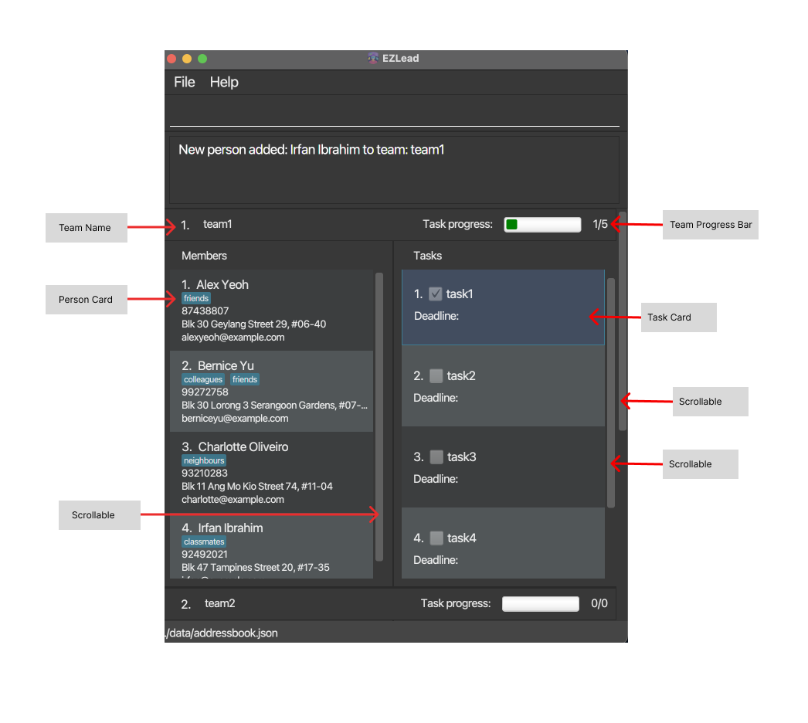
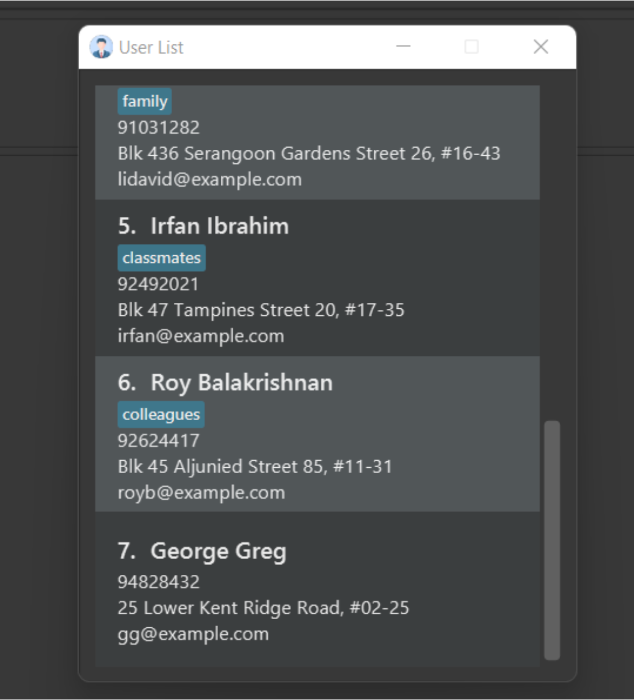
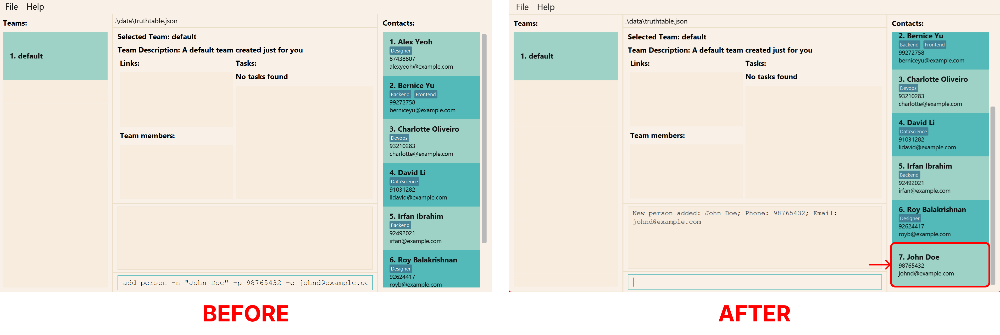
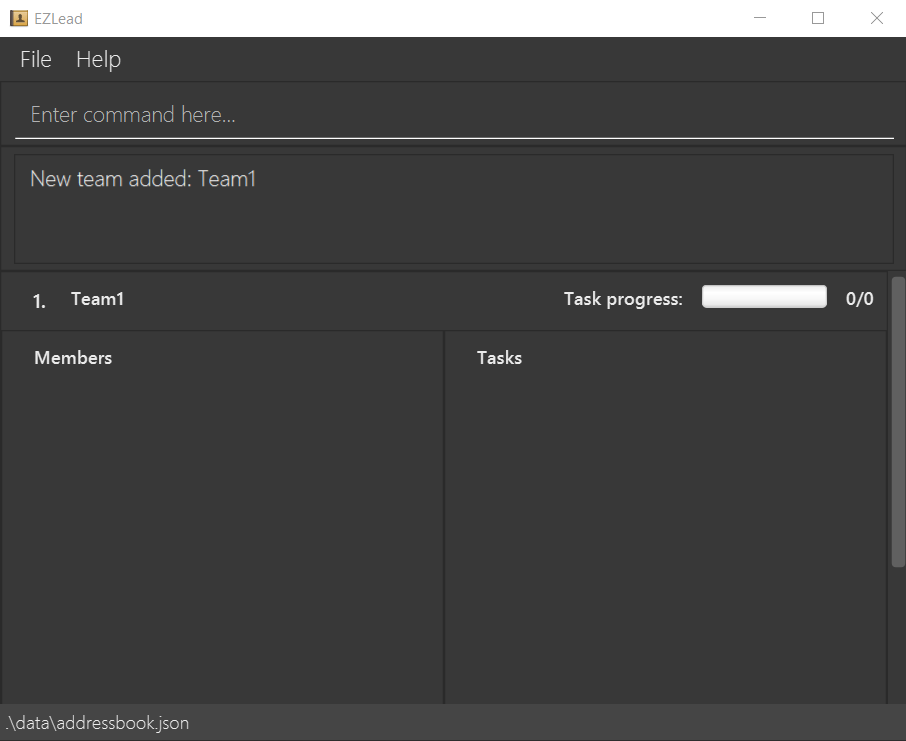
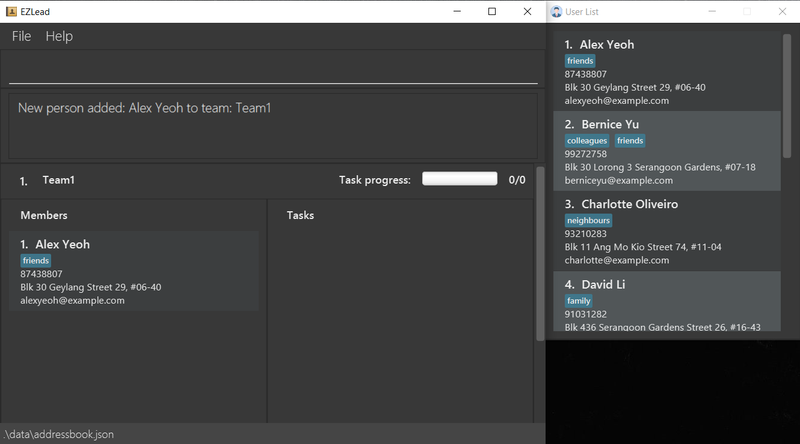
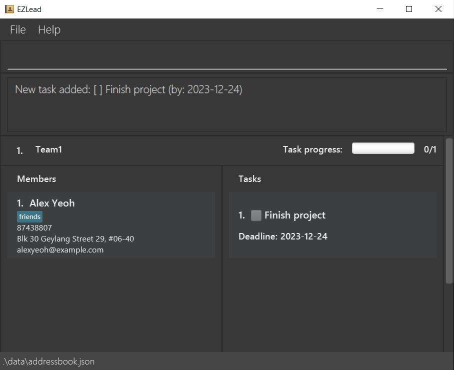
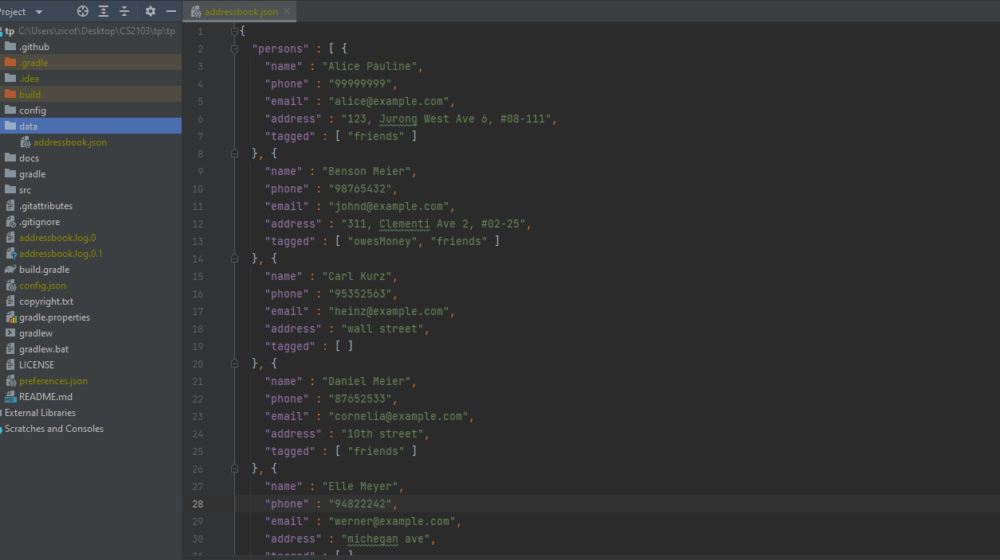

EZLead is a **desktop app for tech leads to manage teams optimized for use via a Command Line Interface (CLI)**.
As a tech lead, you will be able to easily keep track of all the teams under you as well as each team's current and
future tasks. With our app, teams management would be easier than ever.

--------------------------------------------------------------------------------------------------------------------

## Index

- [GUI](#gui)
- [Quick Start](#quick-start)
- [Features](#features)
- [Command Summary](#command-summary)

--------------------------------------------------------------------------------------------------------------------

## GUI

### userlist

--------------------------------------------------------------------------------------------------------------------

## Quick Start

1. Ensure that you have Java `11` installed in your computer.
2. Download the latest EZLead.jar from [here](https://github.com/AY2223S1-CS2103T-W09-3/tp/releases/download/v1.3.2/EzLead.jar).
3. Copy the file to the folder you want to use as the home folder for your EZLead app.
4. Double-click the file to start the app.
5. Type the command in the command box and press Enter to execute it. Some example commands you can try:
  * `userlist`: Shows the global list of all members and their details.
  * `add n/John Doe p/99853657 e/john@gmail.com a/414, North Bridge Ave 5, #09-86 t/friends t/owesMoney`: Adds a member named `John Doe` to the app.
  * `delete p/2`: Deletes the 2nd member shown in the global member list.
  * `clear`: Deletes all teams, members and tasks.
  * `exit`: Exits the app.
6. Refer to the [Features](#features) section in this user guide for more details on commands

--------------------------------------------------------------------------------------------------------------------

## Features

**:information_source: Notes about the commands:** 

* Words in `UPPER_CASE` are the parameters to be supplied by the user. 
  e.g. in `create t/TEAM-NAME`, `TEAM-NAME` is a parameter which can be used as `create t/UIDevelopers`.

* Items in square brackets are optional.
  e.g `n/NAME [t/TAG]` can be used as `n/John Doe t/friend` or as `n/John Doe`.

* Items with `…`​ after them can be used multiple times including zero times. 
  e.g. `[t/TAG]…​` can be used as ` ` (i.e. 0 times), `m/John`, `m/John m/Jane` etc.

* If a parameter is expected only once in the command but you specified it multiple times, only the last occurence of the parameter will be taken.
  e.g. if the command specifies `task/1 task/2`, only `task/2` will be taken.

* Commands are case-sensitive.
  e.g. You cannot enter HeLp instead of help

### Viewing help: `help`

Shows a message explaining how to access the help page.

Format: `help`

### Adding a member: `add`

Adds a new person to EZLead.

Format: `add n/NAME p/PHONE-NUMBER e/EMAIL a/ADDRESS [t/TAG]…`

Examples:
* `add n/John Doe p/99853657 e/john@gmail.com a/414, North Bridge Ave 5, #09-86 t/friends t/owesMoney` Adds a new 
person with the following details to the global member list.

### Editing a member's details: `edit`

Edits a member's details. Require at least one optional parameters.

Format: `edit INDEX [n/NAME] [p/PHONE-NUMBER] [e/EMAIL] [a/ADDRESS] [t/TAG]…`

Examples:
* `edit 1 n/Johny p/91234567 e/johndoe@example.com` Edits the first member's name in the global member list to Johny, email to 
johndoe1@example.com and contact number to 91234567.

### Deleting a member: `delete`

Deletes a member.

Format: `delete p/GLOBAL-PERSON-INDEX`

Examples:
* `delete p/1` Deletes the first member.

### Viewing all members: `userlist`

Shows a list of all members and their details.

Format: `userlist`

### Adding a team: `create`

Adds a team with the given name to EZLead.

Format: `create n/TEAM-NAME`

Examples:
* `create n/Team1` Adds a team with the name Team1.

Note that names should only contain alphanumerical characters and spaces, and it should not be blank.

### Deleting a team: `delteam`

Deletes the given team from EZLead.

Format: `delteam TEAM-INDEX`

Examples:
* `delteam 1` Deletes the first team.

### Changing a team's name: `editteam`

Changes a team's name (specified by index) to the given name.

Format: `editteam t/TEAM-INDEX n/NEW-TEAM-NAME`

Examples:
* `editteam t/1 n/TEAMNEW` Changes the first team's name to 'TEAMNEW'.

### Assigning a member to a team: `assign`

assigns a member to a team. 

Format: `assign m/MEMBER-INDEX t/TEAM-INDEX`

**:information_source: Note:** 

MEMBER-INDEX is the index from the userlist (refer to `Viewing all members` section below).

Examples:
* `assign m/1 t/1` Assigns the first member in the global member list to the first team.

### UnAssigning a member to a team: `unassign`

removes a member from a team.

Format: `unassign m/MEMBER-INDEX t/TEAM-INDEX`

**:information_source: Note:** 

MEMBER-INDEX is the index from the userlist (refer to `Viewing all members` section below).

Examples:
* `unassign m/1 t/1` removes the first member in the global member list from the first team.

### Adding a task: `taskadd`

Adds a new task to a team. Additionally, you may opt to set a deadline for the task (optional).

Format: `taskadd t/TEAM-INDEX n/TASK-NAME [d/DD-MM-YYYY]`

Examples:
* `taskadd t/1 n/Finish project d/24-12-2023` Adds a new task to team with index 1 with the description 
"Finish project". The deadline set here is 24 December 2023.

### Deleting a task `taskdelete`

Deletes a task in a specific team.

Format: `taskdelete t/TEAM-INDEX task/TASK-INDEX`

Examples:
* `taskdelete t/1 task/1` Deletes the first task in the first team.

### Marking a task as completed `taskmark`

Marks a task as completed.

Format: `taskmark t/TEAM-INDEX task/TASK-INDEX`

Examples:
* `taskmark t/1 task/1` Marks the first task in the first team as completed.

### UnMarking a task `taskunmark`

Marks a task as pending.

Format: `taskunmark t/TEAM-INDEX task/TASK-INDEX`

Examples:
* `taskunmark t/1 task/1` Marks the first task in the first team as pending.

### Updating a task description: `taskedit`

Updates a task's description. Require at least one optional parameters.

Format: `taskedit t/TEAM-INDEX task/TASK-INDEX [n/NEW-TASK-NAME] [d/NEW DD-MM-YYYY]`

Examples:
* `taskedit t/1 task/1 n/Finish assignment d/12-12-2022` Updates the first task in the first team with new description 
'Finish assignment'. Adding a deadline to the task is optional.

**:information_source: TIP:** 

* To add deadline to an already existing task, use the command `taskedit t/TEAM-INDEX task/TASK-INDEX d/NEW DD-MM-YYYY`

### Manually editing save file:

For advanced users, the data and state of EZLEAD is stored in `data/addressbook.json`.
You can manually modify the data directly by accessing this JSON file.

However, EZLEAD cannot verify validity of the data if it was manually modified. Any invalid data will cause EZLEAD
to load in an EMPTY state.

--------------------------------------------------------------------------------------------------------------------

## FAQ

**Q**: What should be the index of the member to be specified to assign and unassign members from a team?

**A**: You can use the index of the member provided in the user list. You can access user list by using the command `userlist`.

--------------------------------------------------------------------------------------------------------------------

## Command Summary

| Action              | Format, Examples                                                                                                                                               |
|---------------------|----------------------------------------------------------------------------------------------------------------------------------------------------------------|
| **Help**            | `help`                                                                                                                                                         |
| **Member Add**      | `add n/NAME p/PHONE e/EMAIL a/ADDRESS [t/TAG]…`   e.g. `add n/John Doe p/99853657 e/john@gmail.com a/414, North Bridge Ave 5, #09-86 t/friends t/owesMoney` |
| **Member Delete**   | `delete p/GLOBAL-PERSON-INDEX`   e.g. `delete p/1`                                                                                                          |
| **Member Edit**     | `edit INDEX [n/NAME] [p/PHONE] [e/EMAIL] [a/ADDRESS] [t/TAG]…`   e.g.`edit 1 n/Johny p/91234567 e/johndoe@example.com`                                      |
| **Member List**     | `userlist`                                                                                                                                                     |
| **Team Add**        | `create n/TEAM-NAME`   e.g. `create n/TEAM1`                                                                                                                |
| **Team Delete**     | `delteam TEAM-INDEX`   e.g. `delteam 1`                                                                                                                     |
| **Team Edit**       | `editteam t/TEAM-INDEX n/NEW-TEAM-NAME`   e.g. `editteam t/1 n/TEAMNEW`                                                                                     |
| **Member assign**   | `assign m/MEMBER-INDEX t/TEAM-INDEX`   e.g.`assign m/1 t/1`                                                                                                 |
| **Member unAssign** | `unassign m/MEMBER-INDEX t/TEAM-INDEX`   e.g.`unassign m/1 t/1`                                                                                             |
| **Task Add**        | `taskadd t/TEAM-INDEX n/TASK-NAME [d/DD-MM-YYYY]`   e.g. `taskadd t/1 n/Finish project d/24-12-2023`                                                        |
| **Task Delete**     | `taskdelete t/TEAM-INDEX task/TASK-INDEX`   e.g. `taskdelete t/1 task/1`                                                                                    |
| **Task Mark**       | `taskmark t/TEAM-INDEX task/TASK-INDEX`   e.g. `taskmark t/1 task/1`                                                                                        |
| **Task unMark**     | `taskunmark t/TEAM-INDEX task/TASK-INDEX`   e.g. `taskunmark t/1 task/1`                                                                                    |
| **Task Edit**       | `taskedit t/TEAM-INDEX task/TASK-INDEX [n/NEW-TASK-NAME] [d/NEW DD-MM-YYYY]`   e.g. `taskedit t/1 task/1 n/Finish assignment d/12-12-2022`                  |
