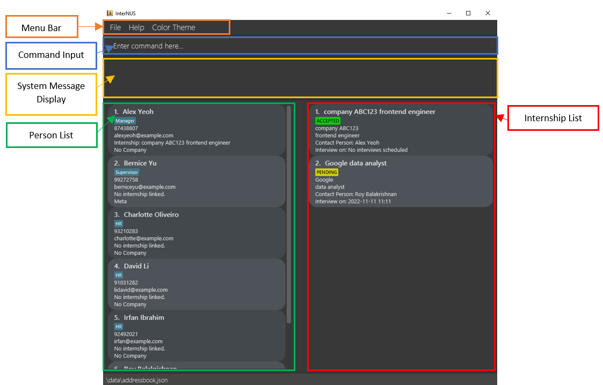
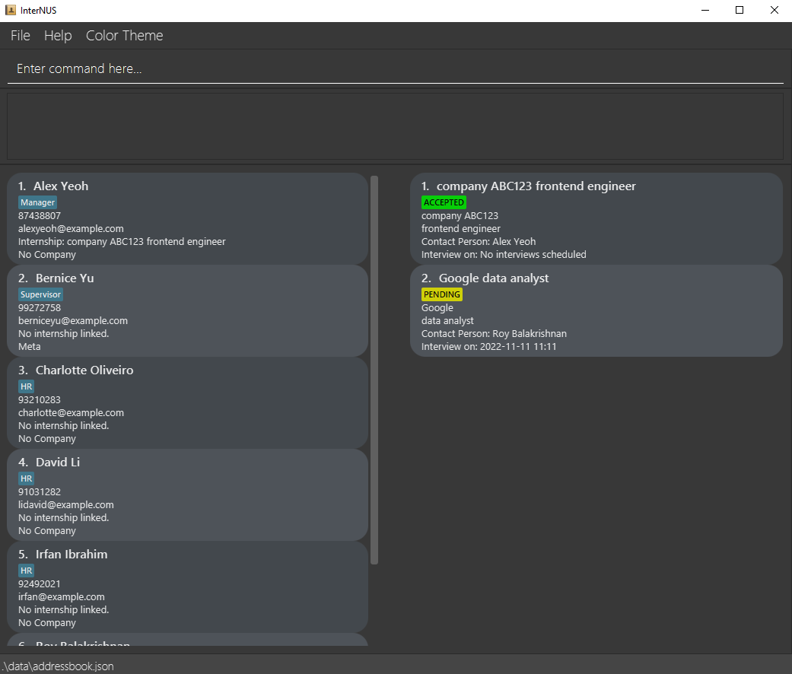
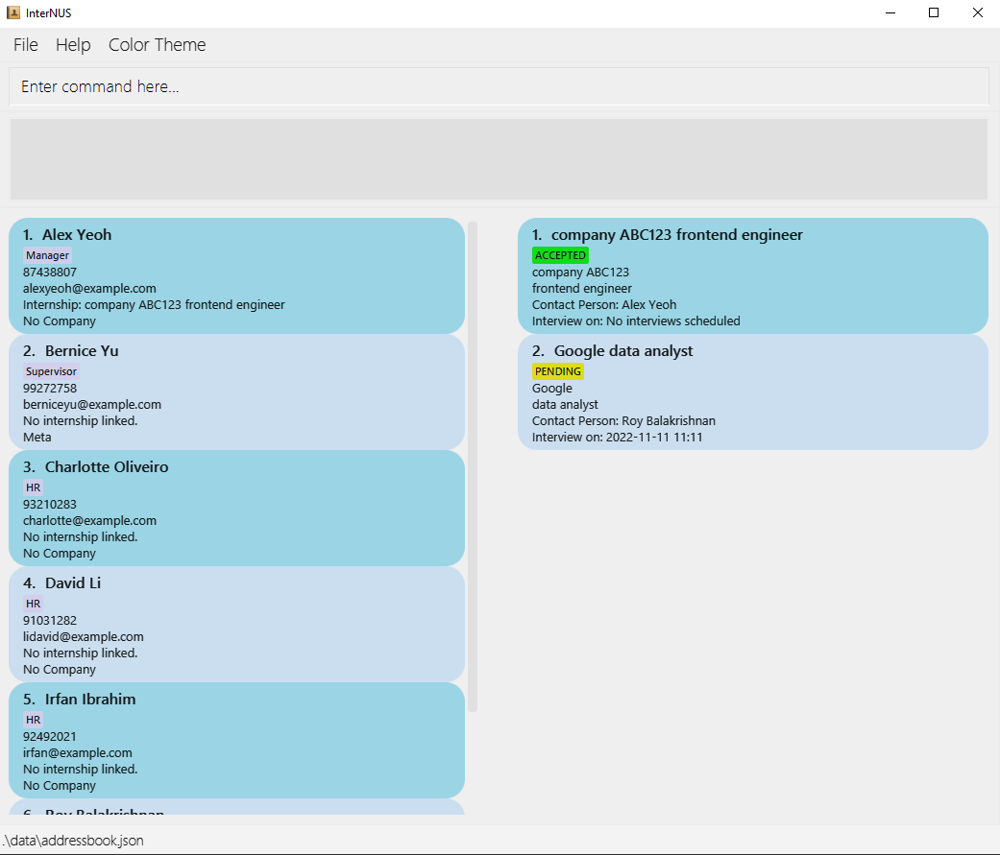

* Table of Contents
{:toc}

--------------------------------------------------------------------------------------------------------------------
# 1 Introduction

## 1.1 What is InterNUS?

Welcome to the InterNUS user guide!

InterNUS is a convenient and powerful desktop app for **managing internship applications, optimized for use via a Command Line Interface** (CLI) while still having the benefits of a Graphical User Interface (GUI). It has a sleek design to track your internship status at one glance. 

Having troubles finding who to contact for your various internship applications? Don’t worry! InterNUS also allows you to manage contact person during your applications. After your internship, InterNUS can still be used to manage your work contact list!

## 1.2 Person List

Store the information of key contacts in InterNUS. During the internship-hunting period, add the contacts of hiring managers and link them to your bookmarked internship positions. What about the multiple colleagues you'll meet during your internship stints? InterNUS makes it easy to manage these contacts and lets you see at a glance where you worked at together.

**:information_source: Note:** Each person can be linked to a maximum of one internship, and vice  versa.

## 1.3 Internship List

Track the internships you're interested in and all the relevant information -- the company, role, contact person and interview date. Awaiting a reply, or have you been accepted? With InterNUS, you can monitor and update the statuses of your internship applications effortlessly.

--------------------------------------------------------------------------------------------------------------------
# 2 How to use this User Guide?

1. For new users, proceed to our [Quick start](#3-quick-start). 

1. For returning users, skip to our [Command summary](#6-command-summary) for a summary of our feature.

## 2.1 Icons and symbols
| Symbol               | Meaning                                                                                      |
|----------------------|----------------------------------------------------------------------------------------------|
| :information_source: | Additional information that may be useful to know when using InterNUS                        |
| :exclamation:        | Important information or warnings that you should take note of when using InterNUS           |

## 2.2 Graphical User Interface (GUI) of InterNUS

The UI component description:

| Components             | Purpose                                |
|------------------------|----------------------------------------|
| Menu Bar               | Consists of File, Help and Color Theme |
| Color Theme Button     | To switch between Light/Dark mode      | 
| Command Input          | To enter commands to be executed       |
| System Message Display | Displays results of executed command   |
| Person List            | Displays contact information of person |
| Internship List        | Displays information of internship     |

## 2.3 Command format

**:information_source: Notes about the command format:** 

* Words in `UPPER_CASE` are the parameters to be supplied by the user. 
  e.g. in `add n/NAME`, `NAME` is a parameter which can be used as `add n/John Doe`.

* Items in square brackets are optional. 
  e.g `n/NAME [t/TAG]` can be used as `n/John Doe t/friend` or as `n/John Doe`.

* Items with `…`​ after them can be used multiple times including zero times. 
  e.g. `[t/TAG]…​` can be used as ` ` (i.e. 0 times), `t/friend`, `t/friend t/family` etc.

* Parameters can be in any order. 
  e.g. if the command specifies `n/NAME p/PHONE_NUMBER`, `p/PHONE_NUMBER n/NAME` is also acceptable.

* If a parameter is expected only once in the command but you specified it multiple times, only the last occurrence of the parameter will be taken. 
  e.g. if you specify `p/12341234 p/56785678`, only `p/56785678` will be taken.

* Extraneous parameters for commands that do not take in parameters (such as `help`, `listp`, `exit` and `clear`) will be ignored. 
  e.g. if the command specifies `help 123`, it will be interpreted as `help`.

--------------------------------------------------------------------------------------------------------------------
# 3 Quick start

1. Ensure you have Java `11` or above installed in your Computer.

1. Download the latest `InterNUS.jar` from [here](https://github.com/AY2223S1-CS2103T-F11-1/tp/releases).

1. Copy the file to the folder you want to use as the _home folder_ for your app.

1. Double-click the file to start the app. The GUI similar to the below should appear in a few seconds. Note how the app contains some sample data. 
   

1. Type the command in the command box and press Enter to execute it. e.g. typing **`help`** and pressing Enter will open the help window. 

1. Refer to the [Features](#features) below for details of each command.

--------------------------------------------------------------------------------------------------------------------

# 4 Features

## 4.1 Add Command

### 4.1.1 Adding a person: `add -p`

Adds a person to InterNUS. This person refers to the contact person you want to save. 
During internship application this person could be the hiring manager. 
After the application, this person could be the senior engineer who you want to keep contact at work.

Format: `add -p n/NAME [e/EMAIL] [p/PHONE_NUMBER] [t/TAG]…​ [l/LINK_INDEX] c/[COMPANY]`
* The link index (in add -p) refers to the index number shown in the internship list.
* The company refers to the company the contact person is working at.

:bulb: **Tip:**
A person can have any number of tags (including 0). 
New added person will be added in current sorted order.
Only one contact person can be in-charge of one internship position.
Phone number allows more than 2 digits without the need of any specific pattern.
A person is only considered duplicated if the name is exactly the same including casing. 

Examples:
* `add -p n/John Doe e/johnd@example.com p/98765432 l/1 c/Meta`
* `add -p n/Betsy Crowe t/friend e/betsycrowe@example.com`

### 4.1.2 Adding an internship: `add -i`

Adds an Internship to InterNUS.

Format: `add -i c/COMPANY_NAME r/ROLE s/STATUS [d/DATE_OF_INTERVIEW] [l/LINK_INDEX]`

* The link index (in add -i) refers to the index number shown in the person list.
* Valid statuses are `BOOKMARKED`, `PENDING`, `ACCEPTED`, `COMPLETED` or `REJECTED` (case insensitive).
* Date of interview is optional as interviews might not be scheduled yet.
* `LINK_INDEX` refers to the index number shown in the person list and is optional. Specifying this parameter will define the current person at the specified index in the person list as the contact person of the newly added internship. 

:bulb: **Tip:** Instead of typing the full status name, just enter the first letter of the intended status (e.g. `s/b` is a shortcut for `s/BOOKMARKED`)**

Examples:
* `add -i c/TikTok r/Data Engineer s/rejected l/1`
* `add -i c/Grab r/Full Stack Developer s/PENDING d/2020-12-20 12:00`

## 4.2 List Command

### 4.2.1 Listing all persons : `list -p`

Removes all filters on the person list and lists all persons in InterNUS in the current sorted order.

Format: `list -p`

### 4.2.2 Listing all internships : `list -i`

Removes all filters on the internship list and lists all internships in InterNUS in the current sorted order.

Format: `list -i`

## 4.3 Edit Command

### 4.3.1 Editing a person : `edit -p`

Edits an existing person in InterNUS.

Format: `edit -p INDEX [n/NAME] [p/PHONE] [e/EMAIL] [c/COMPANY] [t/TAG]…​`
- Edits the person at the specified `INDEX`. The index refers to the index number shown in the displayed person list. The index must be a positive integer 1, 2, 3, …​
- At least one of the optional fields must be provided.
- Existing values will be updated to the input values.
- When editing tags, the existing tags of the person will be removed i.e adding of tags is not cumulative.
- You can remove all the person’s tags by typing `t/` without specifying any tags after it.
- Does not allow duplicate name when editing name of person

Examples:
- `list -p` followed by `edit -p 1 p/91234567 e/johndoe@example.com` Edits the phone number and email address of the 1st person to be `91234567` and `johndoe@example.com` respectively.
- `list -p` followed by `edit -p 2 n/Betsy Crower t/` Edits the name of the 2nd person to be `Betsy Crower` and clears all existing tags.

### 4.3.2 Editing an internship : `edit -i`

Edits an existing internship in InterNUS.

Format: `edit -i INDEX [c/COMPANY] [r/ROLE] [s/STATUS] [d/INTERVIEW_DATE]`
- Edits the internship at the specified `INDEX`. The index refers to the index number shown in the displayed internship list. The index must be a positive integer 1, 2, 3, …
- At least one of the optional fields must be provided.
- Existing values will be updated to the input values.
- Valid statuses are `BOOKMARKED`, `PENDING`, `ACCEPTED`, `COMPLETED` or `REJECTED` (case insensitive). Similar to the `add  -i` command, the shortcuts can be used here.

Examples:
- `list -i` followed by `edit -i 1 s/ACCEPTED` Edits the status of the 1st internship to be `ACCEPTED`.
- `list -i` followed by `edit -i 2 s/REJECTED` Edits the status of the 2nd internship to `REJECTED`.

## 4.4 Link and Unlink Command

### 4.4.1 Linking a person and an internship : `link`

Links an existing person and internship together in InterNUS.

Format: `link p/PERSON_INDEX i/INTERNSHIP_INDEX`
- Person at specified `PERSON_INDEX` and internship at specified `INTERNSHIP_INDEX` must be initially not linked to any person/internship.
- Specified person will be displayed as contact person of specified internship and specified internship will be displayed as internship of specified person.
- `PERSON_INDEX` and `INTERNSHIP_INDEX` **must be a positive integer** 1, 2, 3, …

Examples:
- `link p/1 i/1` will link the person at index **1** to the internship at index **1**

### 4.4.2 Unlinking a person and an internship : `unlink`

Unlinks an existing person and internship together in InterNUS.

Format: `unlink [p/PERSON_INDEX] [i/INTERNSHIP_INDEX]`
- At least 1 of the optional fields must be provided
- Person and/or internship at the specified `PERSON_INDEX` and/or `INTERNSHIP_INDEX` will be unlinked.
- If both `PERSON_INDEX` and `INTERNSHIP_INDEX` are provided, the person at `PERSON_INDEX` and the internship at `INTERNSHIP_INDEX` must be linked to each other.
- `PERSON_INDEX` and `INTERNSHIP_INDEX` **must be a positive integer** 1, 2, 3, …

Examples:
- `unlink p/1 i/1` will unlink person at index **1** and internship at index **1**
- `unlink p/1` will unlink person at index **1** and its linked internship
- `unlink i/1` will unlink internship at index **1** and its linked person

## 4.5 Find Command

### 4.5.1 Locating persons by name : `find -p`

Finds persons whose fields contain any of the given keywords.

Format: `find -p [n/ NAME_KEYWORD [MORE_KEYWORDS]...] [p/ PHONE_KEYWORD [MORE_KEYWORDS]...] [e/ EMAIL_KEYWORD [MORE_KEYWORDS]...] [t/ TAG_KEYWORD [MORE_KEYWORDS]...] [c/ COMPANY_KEYWORD [MORE_KEYWORDS]...]`
- The search is case-insensitive. e.g **hans** will match **Hans**
- The order of the keywords does not matter. e.g. **Hans Bo** will match **Bo Hans**
- Only the fields corresponding to the specified prefixes will be searched,
  and all the specified fields must contain at least one of the specified keywords to be considered in the search result.
- Partial words will be matched. e.g. **Han** will match **Hans**

Examples:
- `find -p n/John` returns **john**, **John Doe** and **Johnny**

### 4.5.2 Locating internships by name : `find -i`

Finds internships whose fields contain any of the given keywords.

Format: `find -i [c/ COMPANY_NAME_KEYWORD [MORE_KEYWORDS]...] [r/ INTERNSHIP_ROLE_KEYWORD [MORE_KEYWORDS]...] [s/ INTERNSHIP_STATUS_KEYWORD [MORE_KEYWORDS]...] [d/ INTERVIEW_DATE_KEYWORD [MORE_KEYWORDS]...]`
- The search is case-insensitive. e.g **abc pte ltd** will match **ABC Pte Ltd**.
- The order of the keywords does not matter. e.g. **Ltd ABC Pte Constructions** will match **ABC Constructions Pte Ltd**.
- Only the fields corresponding to the specified prefixes will be searched,
  and all the specified fields must contain at least one of the specified keywords to be considered in the search result.
- Partial words will be matched e.g. **app** will match **Apple** and **applications**.

Example of usage:
The app contains the following company names in the internship list.
- Apple Inc
- Alphabet Inc
- Shopee Pte Ltd
- Sea Ltd
- Google Inc
- Garena

Then,
- `find -i c/ltd` returns **Shopee Pte Ltd** and **Sea Ltd**
- `find -i c/inc ltd` returns **Apple Inc**, **Alphabet Inc**, **Google Inc**, **Shopee Pte Ltd** and **Sea Ltd**
- `find -i c/g` returns **Google Inc** and **Garena**

**:information_source: Note:** The shortcuts for internship statuses don't work here.

## 4.6 Delete Command

### 4.6.1 Deleting a person by index : `delete -p`

Deletes the specified person from InterNUS.

Format: `delete -p INDEX`

* Deletes the person with the specific `INDEX` in the person list.
* The index refers to the index number shown in the currently displayed person list.
* The index **must be a positive integer** 1, 2, 3, …

Examples:
* `list -p` followed by `delete -p 2` deletes the 2nd person in InterNUS.
* `find -p Betsy` followed by `delete -p 1` deletes the 1st person in the results of the `find` command.

### 4.6.2 Deleting an internship by index : `delete -i`

Deletes the specified internship from InterNUS.

Format: `delete -i INDEX`

* Deletes the internship with the specific `INDEX` in the internship list.
* The index refers to the index number shown in the currently displayed internship list.
* The index **must be a positive integer** 1, 2, 3, …

Examples:
* `list -i` followed by `delete -i 2` deletes the 2nd internship in InterNUS.
* `find -i Meta` followed by `delete -i 1` deletes the 1st internship in the results of the `find` command.

## 4.7 Sort Command

### 4.7.1 Sorting persons in the list: `sort -p`

Sorts the persons list given a sorting criterion.

Format: `sort -p [n/] [c/]`
- Exactly one of the optional fields must be provided.
- `n/` sorts persons by their names in alphabetical order, ignoring upper and lower cases.
- `c/` sorts persons by the attached company name (not the company tied to the internship linked) in alphabetical order, ignoring upper and lower cases.
- When sorted by the attached company name, persons without an attached company name are listed at the bottom of the list, and they will be sorted in alphabetical order of their own names, ignoring upper and lower cases.
- The list will remain sorted the same way until InterNUS is closed or until the sort condition for the persons list is changed.

Example:
- `sort -p n/` would sort the persons list by their names in alphabetical order, ignoring upper and lower cases.
- `sort -p c/` would sort the persons list by their attached company names in alphabetical order, ignoring upper and lower cases. Persons without an attached company name would be listed at the bottom of the list, and they will be sorted in alphabetical order of their own names, ignoring upper and lower cases.

### 4.7.2 Sorting internships in the list: `sort -i`

Sorts the internship list given a sorting criterion.

Format: `sort -i [c/] [d/] [s/]`
- Exactly one of the optional fields must be provided.
- `c/` sorts internships by company name (in alphabetical order).
- `d/` sorts internships by interview date.
- `s/` sorts internships by status in the given order: `BOOKMARKED`, `PENDING`, `ACCEPTED`, `COMPLETED`, `REJECTED`.
- When sorted by interview date, internships with no interview dates are listed at the bottom of the list.

**:information_source: Note: **  
Both the person list and internship list will remain sorted by the last given criterion until InterNUS is closed. The sorted order persists during additions, deletions and editing of persons and internships.

## 4.8 General

### 4.8.1 Viewing help : `help`

Displays a list of commands and a link to the user guide.

Format: `help`

### 4.8.2 Clearing all entries : `clear`

Clears all person and internship entries from InterNUS.

Format: `clear`

### 4.8.3 Exiting the program : `exit`

Exits the program.

Format: `exit`

## 4.9 User Interface

### 4.9.1 Light and Dark Mode

Clicking on the Color Theme button in the Menu Bar displays a dropdown list to select between Light/Dark mode.

- Dark Mode GUI

- Light Mode GUI

## 4.10 Data files

### 4.10.1 Saving the data

InterNUS data is saved in the hard disk automatically after any command that changes the data. There is no need to save manually.

### 4.10.2 Editing the data file

InterNUS data is saved as a JSON file. `[JAR file location]`/data/addressbook.json.
Advanced users are welcome to update data directly by editing that data file.

:exclamation: **Caution:**
If your changes to the data file makes its format invalid, InterNUS will discard all data and start with an empty data file at the next run.

--------------------------------------------------------------------------------------------------------------------

## 5 FAQ

**Q**: How do I transfer my data to another Computer? 
**A**: Install the app in the other computer and overwrite the empty data file it creates with the file that contains the data of your previous InterNUS home folder.

--------------------------------------------------------------------------------------------------------------------

## 6 Command summary

| Action                | Format, Examples                                                                                                                                                                                                                       |
|-----------------------|----------------------------------------------------------------------------------------------------------------------------------------------------------------------------------------------------------------------------------------|
| **Add person**        | `add -p n/NAME [e/EMAIL] [p/PHONE] [l/LINK_INDEX] [c/COMPANY] [t/TAG]… `   e.g., `add -p n/James Ho e/jamesho@example.com p/22224444 l/3 c/Meta`                                                                                    |
| **Add internship**    | `add -i c/COMPANY_NAME r/ROLE s/STATUS [d/DATE_OF_INTERVIEW] [l/LINK_INDEX]`   e.g., `add -i n/TikTok r/Data Engineer s/rejected l/1`                                                                                               |
| **Clear**             | `clear`                                                                                                                                                                                                                                |
| **Delete person**     | `delete -p INDEX`  e.g., `delete -p 3`                                                                                                                                                                                              |
| **Delete internship** | `delete -i INDEX`  e.g., `delete -i 1`                                                                                                                                                                                              |
| **Edit person**       | `edit -p INDEX [n/NAME] [p/PHONE_NUMBER] [e/EMAIL] [c/COMPANY] [t/TAG]…`  e.g.,`edit -p 2 n/James Lee e/jameslee@example.com`                                                                                                       |
| **Edit internship**   | `edit -i INDEX [c/COMPANY] [r/ROLE] [s/STATUS] [d/INTERVIEW_DATE]`  e.g.,`edit -i 2 s/REJECTED`, `edit -i 3 d/2023-01-01 13:30`                                                                                                     |
| **Find person**       | `find -p [n/ NAME_KEYWORD [MORE_KEYWORDS]...] [p/ PHONE_KEYWORD [MORE_KEYWORDS]...] [e/ EMAIL_KEYWORD [MORE_KEYWORDS]...] [t/ TAG_KEYWORD [MORE_KEYWORDS]...] [c/ COMPANY_KEYWORD [MORE_KEYWORDS]...]`   e.g., `find -p n/John`     |
| **Find internship**   | `find -i [c/ COMPANY_NAME_KEYWORD [MORE_KEYWORDS]...] [r/ INTERNSHIP_ROLE_KEYWORD [MORE_KEYWORDS]...] [s/ INTERNSHIP_STATUS_KEYWORD [MORE_KEYWORDS]...] [d/ INTERVIEW_DATE_KEYWORD [MORE_KEYWORDS]...]`   e.g., `find -i c/inc ltd` |
| **List persons**      | `list -p`                                                                                                                                                                                                                              |
| **List internships**  | `list -i`                                                                                                                                                                                                                              |
| **Link**              | `link p/PERSON_INDEX i/INTERNSHIP_INDEX`  e.g., `link p/1 i/1`                                                                                                                                                                      |
| **Unlink**            | `unlink [p/PERSON_INDEX] [i/INTERNSHIP_INDEX]`  e.g., `unlink p/1`                                                                                                                                                                  |
| **Sort persons**      | `sort -p [n/] [c/]`   e.g., `sort -p c/`                                                                                                                                                                                            |
| **Sort internships**  | `sort -i [c/] [d/] [s/]`   e.g., `sort -i d/`                                                                                                                                                                                       |
| **Help**              | `help`                                                                                                                                                                                                                                 |
