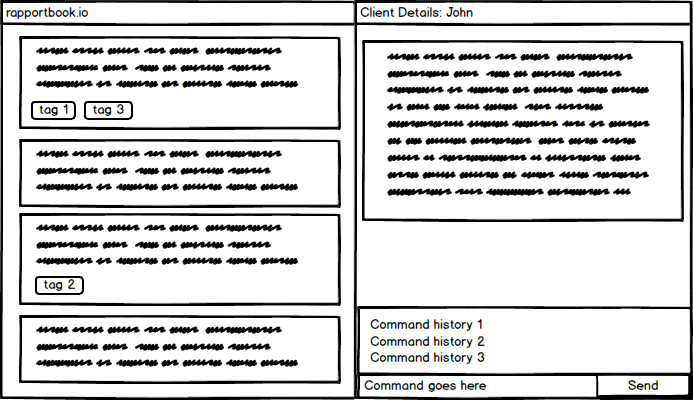

<h1>Rapportbook User Guide</h1>

Welcome to the Rapportbook user guide! (Mockup done in Balsamiq mockups.)

{:refdef: style="text-align: center;"}

{: refdef}

Rapportbook is a **desktop app for managing client information for your financial advising needs, optimized for use via a Command Line Interface** (CLI) while still having the benefits of a Graphical User Interface (GUI).

* Table of Contents
{:toc}

--------------------------------------------------------------------------------------------------------------------

## Quick start

1. Ensure you have Java `11` or above installed in your Computer.
  - If you are unable to launch the application because you do not have Java `11` or above installed, install it from [this page.](https://www.oracle.com/java/technologies/downloads/#java11)

1. Download the latest `rapportbook.jar` from [here](https://github.com/AY2223S1-CS2103T-T13-2/tp/releases).

1. Copy the file to the folder you want to use as the _home folder_ for your copy of Rapportbook.

1. Double-click the file to start the app. The GUI similar to the below should appear in a few seconds. Note how the app contains some sample data. 
   

1. Refer to the [Features](#features) below for details of each command.

--------------------------------------------------------------------------------------------------------------------

## Features

**:information_source: Notes about the command format:** 

* Words in `UPPER_CASE` are the parameters to be supplied by the user. 
  e.g. in `add n=NAME`, `NAME` is a parameter which can be used as `add n=Homer`.

* Items in square brackets are optional. 
  e.g `tag create TAG1 [TAG2]` can be used as `tag create potential` or as `tag create potential high-priority`.

* Parameters can be in any order. 
  e.g. if the command specifies `n=NAME p=PHONE_NUMBER`, `p=PHONE_NUMBER n=NAME` is also acceptable.

* If a parameter is expected only once in the command but you specified it multiple times, only the last occurrence of the parameter will be taken. 
  e.g. if you specify `p=12341234 p=56785678`, only `p=56785678` will be taken.

* Extraneous parameters for commands that do not take in parameters (such as `help`, `list`, `exit` and `clear`) will be ignored. 
  e.g. if the command specifies `help 123`, it will be interpreted as `help`.

### Viewing help : `help`

Shows a message explaning how to access the help page.

Format: `help`

### Adding a client: `add`

Adds the information of a client to Rapportbook.

Format: `add n=NAME p=PHONE_NUMBER e=EMAIL a=ADDRESS po=POSTAL_CODE dob=DATE_OF_BIRTH [r=REMARKS]​`

:bulb: **Recap:**
Fields in square brackets `[]` (i.e. `[r=REMARKS]`) is an optional field.

Examples:
* `add n=Bob p=95788172 e=bob@gmail.com a=Jurong East Jejantas po=123123 dob=1/1/2000 r=Janitor`
* `add n=Laufey p=98980184 e=laufey@u.nus.edu a=123,Clementi po=928572 dob=2/10/2001`

### Deleting of a client: `delete`

Deletes a client from Rapportbook.

* Deletes the person at the specified `INDEX`.
* The index refers to the index number shown in the displayed person list.
* The index **must be a positive integer** 1, 2, 3, …​

Format: `delete INDEX`

Examples:
* `delete 1`

### Viewing the information of a client : `show`

Displays a client's information stored in Rapportbook by index.

Format: `show INDEX​`

Examples:
* `show 1`

### Editing of client information : `edit`

Edits the information of a client within Rapportbook.

Format: `edit INDEX [n=NAME] [p=PHONE] [e=EMAIL] [a=ADDRESS] [po=POSTAL_CODE] [dob=DATE_OF_BIRTH] [r=REMARKS]`

* Edits the person at the specified `INDEX`. The index refers to the index number shown in the displayed person list. The index **must be a positive integer** (i.e. 1, 2, 3, …​)
* At least one of the optional fields must be provided.
* Existing values will be updated to the input values.

Examples:
*  `edit 1 n=Laufey p=0162626003 r=Bluebirds in the spring` Edits the first client entry to have the name `Laufey`, have the phone number `0162626003` and have the remarks `Bluebirds in the spring`.
*  `edit 2 n=Homer e=homer@simp.com a=742 Evergreen Terrace` Edits the second client entry to have the name `Homer`, have the email address `homer@simp.com` and sets the address to `742 Evergreen Terrace`.

### Creating a tag : `tag create`

Creates a tag to categorise client entries. Creation of a tag must happen first before the usage of tags.

Format: `tag create TAG [TAG2] [TAG3] … [TAGN]`

:bulb: **Tip:**
You can create multiple tags at once by just separating the different tag names with spaces.

Examples:
* `tag create potential` Creates a tag called `potential`
* `tag create potential high-priority low-priority` Creates 3 tags called `potential`, `high-priority` and `low-priority`.

### Tagging clients : `tag`

Tags a client entry for categorising purposes. The index of hte contact and the tag name must be specified.

Format: `tag INDEX TAG [TAG2] [TAG3] … [TAGN]`

:bulb: **Tip:**
You can assign multiple tags to a client at once by separating the different tag names with spaces after the client index.

Example:
* `tag 5 potential` Assigns the `potential` tag to the client entry at index 5.
* `tag 5 potential high-prority` Assigns the `potential` and `high-priority` tags to the client entry at index 5.

### Removing tags from clients : `tag remove`

Removes a tag from a client entry if required.

Format: `tag remove INDEX TAG [TAG2] [TAG3] … [TAGN]

:bulb: **Tip:**
Like assignment of tags, you can also remove multiple tags from a client at once by separating the different tag names with spaces after the client index.

Example:
* `tag remove 5 potential` Removes the `potential` tag from the client entry at index 5.
* `tag remove 5 potential high-priority` Removes the `potential` and `high-priority` tags from the client entry at index 5.

### Filtering client entries: `find`

Filter clients by their name or the tags assigned to client entries.

Format: `filter [n=NAME] [t=TAG]`

* The search is case-insensitive. e.g `laufey` will match `Laufey`
* Multiple names or tags can be searched by separating the different names/tags with commas (i.e. `n=homer,laufey` to search for both `homer` and `laufey`)
* Search results will fulfil **at least one** of the search parameters (e.g. searching `n=homer t=potential` will bring up client entries with names including `homer`, even if they do not have the `potential` tag.)

Examples:
* `filter n=Laufey` Shows clients with `Laufey` as name.
* `filter n=Homer,Laufey` Shows all clients with `Homer` **or** `Laufey` as name.
* `filter t=high-priority` Shows clients with high-priority names.
* `filter t=high-priority,potential` Shows all clients with `high-priority` tag **or** `potential` tag.
* `filter n=Homer t=potential` Shows all clients with `Homer` name **or** `potential` tag.

### Clearing filters

Clear filters that are currently in effect.

Format: `filter clear [n=NAME] [t=TAG]`

Example:
* `filter clear` Clear ALL filters.
* `filter clear t=potential` Remove the `potential` tag filter.
* `filter clcear t` Remove all tag filters

### Return home

Resets the view back to the homepage.

Format: `home`

### Exiting the program : `exit`

Exits the program.

Format: `exit`

### Saving the data

Rapportbook data is saved in the hard disk automatically after any command that changes the data. There is no need to save manually.

### Editing the data file

Rapportbook data is saved as a JSON file `[JAR file location]/data/rapportbook.json`. Advanced users are welcome to update data directly by editing that data file.

:exclamation: **Caution:**
If your changes to the data file makes its format invalid, Rapportbook will discard all data and start with an empty data file at the next run.

<!-- ### Archiving data files `[coming in v2.0]`

_Details coming soon ..._ -->

--------------------------------------------------------------------------------------------------------------------

## FAQ

**Q**: How do I transfer my data to another Computer? 
**A**: Install the app in the other computer and overwrite the empty data file it creates with the file that contains the data of your previous Rapportbook home folder.

--------------------------------------------------------------------------------------------------------------------

## Command summary

Action | Format, Examples
--------|------------------
**Show** | `show INDEX`
**Add** | `add n=NAME p=PHONE_NUMBER e=EMAIL a=ADDRESS po=POSTAL_CODE dob=DATE_OF_BIRTH [r=REMARKS]​`
**Delete** | `delete INDEX`
**Edit** | `edit INDEX [n=NAME] [p=PHONE] [e=EMAIL] [a=ADDRESS] [po=POSTAL_CODE] [dob=DATE_OF_BIRTH] [r=REMARKS]`
**Tag creation** | `tag create TAG [TAG2] [TAG3] … [TAGN]`
**Tag** | `tag INDEX TAG`
**Untag** | `tag remove INDEX TAG [TAG2] [TAG3] … [TAGN]`
**Filter** | `filter [t=TAG] [n=NAME]` `filter clear [t=TAG] [n=NAME]`
**Home** | `home`
**Help** | `help`
**Exit** | `exit`
