DevEnable is a **desktop app for developers to manager their projects, optimized for use via a Command Line Interface** (CLI) while still having the benefits of a Graphical User Interface (GUI). If you can type fast, DevEnable can get your project management tasks done faster than traditional GUI apps.

* Table of Contents
{:toc}

--------------------------------------------------------------------------------------------------------------------

## Quick start

1. Ensure you have Java `11` or above installed in your Computer.

2. Download the latest `devenable.jar`.

3. Copy the file to the folder you want to use as the _home folder_ for DevEnable.

4. Double-click the file to start the app.

5. Type the command in the command box and press Enter to execute it. e.g. typing **`help`** and pressing Enter will open the help window. 
   Some example commands you can try:

   * **`project -l`** : Lists all projects.

   * **`project -a`**`n/Orbital` : Adds a project named `Orbital` to the project list.

   * **`project -d`**`3` : Deletes the project with project id `3`.

   * **`clear`** : Deletes all data from all lists.

6. Refer to the [Features](#features) below for details of each command.

--------------------------------------------------------------------------------------------------------------------

## Features

**:information_source: Notes about the command format:** 

* Words in `UPPER_CASE` are the parameters to be supplied by the user. 
  e.g. in `project -a n/PROJECT_NAME`, `PROJECT_NAME` is a parameter which can be used as `project -a n/PROJECT_NAME`.

* Items in square brackets are optional. 
  e.g. `n/PROJECT_NAME [r/REPOSITORY]` can be used as `project -a n/ProjectY r/AgentX/ProjectY` or
  `project -a n/ProjectY`.

* Commands are in the following format: `COMMAND FLAG [ID/ARGUMENTS]`. Every command starts with a command keyword,
  followed by the command flag, then the arguments for said command. Typically, flags start with a dash `-`, and
  arguments start with an identifier `ID/ARGUMENT`.

* Parameters can be in any order. 
  e.g. if the command specifies `client -a p/PROJECT_ID n/CLIENT_NAME [m/CLIENT_MOBILE] [e/CLIENT_EMAIL]`, 
  `client -a p/PROJECT_ID n/CLIENT_NAME [e/CLIENT_EMAIL] [m/CLIENT_MOBILE]` are both acceptable.

* If a parameter is expected only once in the command, but you specified it multiple times, only the last occurrence
  of the parameter will be taken. (Does not apply for Find and Sort Commands)  
  e.g. if you specify `m/12341234 m/56785678`, only `m/56785678` will be taken.

* Extraneous parameters for commands that do not take in parameters (such as `help`, `exit` and `clear`) will be ignored. 
  e.g. if the command specifies `help 123`, it will be interpreted as `help`.

* Trailing extraneous input for commands that take in parameters will be considered a part of the last valid 
  argument identifier unless the argument identifier takes in an index parameter .
  e.g. if the command specifies `project -e n/New Project x/this is extra`, `New Project x/this is extra` will be 
  taken as the argument for `n/` but if the command specifies `project -e n/New Project p/2 x/this is extra`, then 
  only `2` will be taken as the argument for `p/`.

### Viewing help : `help`

Displays a list of commands and functionalities.

Format: `help`

### Clearing all entries : `clear`

Clears all entries from the list. 

Format: `clear`

### Exiting the project book: `exit`

Exits the project book.

Format: `exit`

### Field Details

| PREFIX/ARGUMENT                           | Note                                                                                                                                                       |
|-------------------------------------------|------------------------------------------------------------------------------------------------------------------------------------------------------------|
| n/PROJECT_NAME or n/CLIENT_NAME           | must only contain alphanumeric chatracters (cannot be empty or start with a space                                                                          |
| i/PROJECT_ID or i/CLIENT_ID or i/ISSUE_ID | must exist and be a positive integer (1, 2, 3 ...​)                                                                                                        |
| t/TITLE                                   | cannot be empty or start with a space                                                                                                                      |
| d/DEADLINE                                | must be in the format yyyy-mm-dd                                                                                                                           |
| r/REPOSITORY                              | must be in the form USERNAME/REPO_NAME  NOTE: Clicking the Repository Link of a project will copy it to the clipboard                                  |
| m/CLIENT_MOBILE                           | must only contain numbers and must be more than 3 digits long such that any number with a countrycode can be added without any prefix or connecting symbol |
| e/CLIENT_EMAIL                            | must be in the format LOCAL_NAME@DOMAIN_NAME.com (local name must be longer than 3 characters)                                                             |
| u/URGENCY                                 | must be an integer from 0 to 3, 0 for NONE, 1 for LOW, 2 for MEDIUM and 3 for HIGH                                                                         |
| s/STATUS                                  | must be either `Incomplete` or `Completed`                                                                                                                     |

> NOTE: Multiple issues can have the exact same fields (other than the issue id), as it is possible for a project to
> have multiple of the same issues.

### Add Command: `-a`

Adds a project, client, or issue to the project book. A unique ID will be automatically generated.

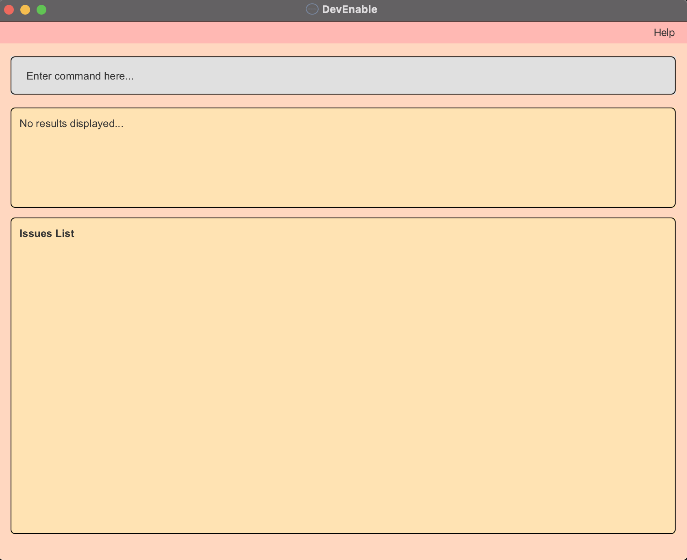
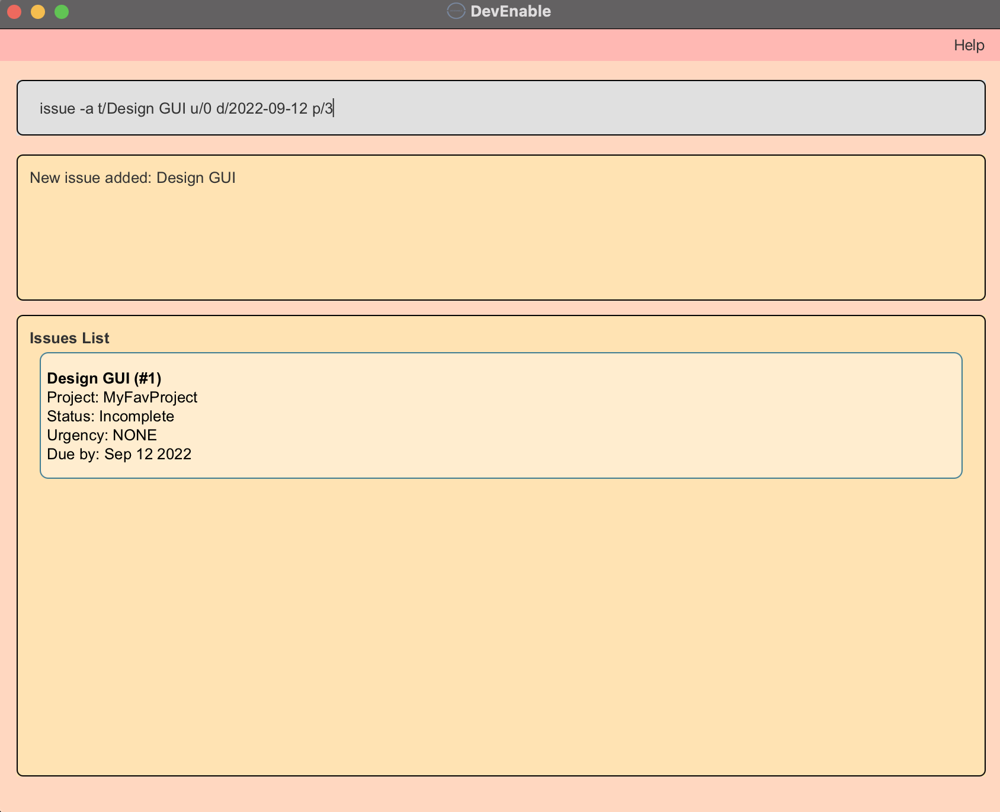

Format: 
* Project: `project -a n/PROJECT_NAME [r/REPOSITORY] [c/CLIENT_ID] [d/DEADLINE]`
  * Adds the project to the list of projects.
* Client: `client -a n/CLIENT_NAME p/PROJECT_ID [m/CLIENT_MOBILE] [e/CLIENT_EMAIL]`
  * Adds the client to the list of clients and to the project with the specified `PROJECT_ID`.
* Issue: `issue -a p/PROJECT_ID t/TITLE [d/DEADLINE] [u/URGENCY]`
  * Adds the issue to the overall list of issues and to the list of issues of the project with the specified `PROJECT_ID`.
  
Examples:
* `project -a n/Coding101` Adds a project with `PROJECT_NAME` Coding101 to the list of projects.
* `client -a n/Bob p/2 m/12345678` Adds a client with `CLIENT_NAME` Bob and `CLIENT_MOBILE` 12345678 to the
  list of clients and to the project with `PROJECT_ID` 2.
* `issue -a t/Design GUI u/0 d/2022-09-12 p/3` Adds an issue with `TITLE` Design GUI, `URGENCY` NONE(0) and `DEADLINE`
  2022-09-12 to the overall list of issues and to the list of issues of the project with `PROJECT_ID` 3.

### Edit Command: `-e`

Edits the specified existing project, client or issue.

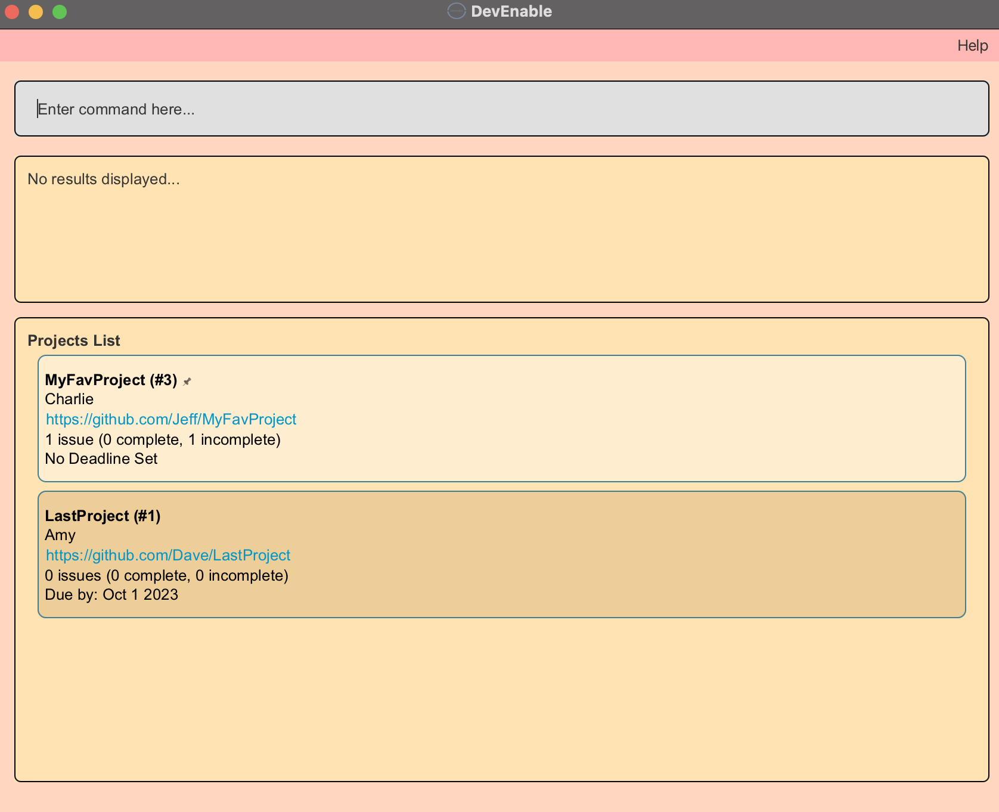
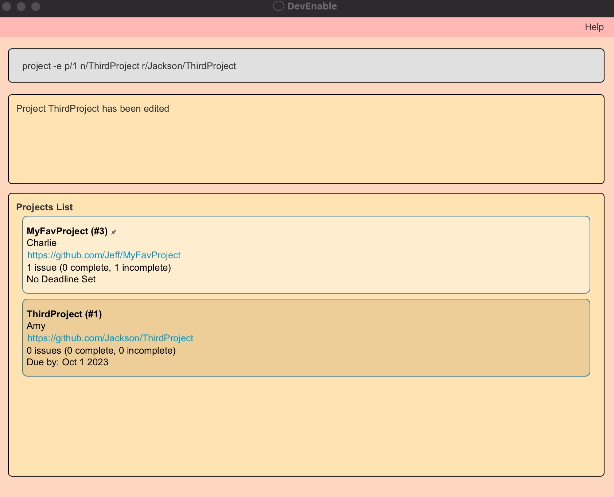

Format: 
* Project: `project -e p/PROJECT_ID [n/PROJECT_NAME] [r/REPOSITORY] [c/CLIENT_ID] [d/DEADLINE]`
  * Edits the project with the specified `PROJECT_ID`. The ID refers to the unique ID generated upon adding a project.
* Client: `client -e c/CLIENT_ID [n/CLIENT_NAME] [m/CLIENT_MOBILE] [e/CLIENT_EMAIL]`
  * Edits the client with the specified `CLIENT_ID`. The ID refers to the unique ID generated upon adding a client.
* Issue: `issue -e i/ISSUE_ID [t/TITLE] [d/DEADLINE] [u/URGENCY]`
  * Edits the issue with the specified `ISSUE_ID` The ID refers to the unique ID generated upon adding an issue.

Note:
* At least one of the optional fields must be provided.

Examples:
* `client -e c/1 n/Amy` Edits the client with `CLIENT_ID` 1 to have the new `CLIENT_NAME` Amy.
* `issue -e i/2 d/2021-12-20 u/1` Edits the issue with `ISSUE_ID` 2 to have the new `DEADLINE` 2021-12-20 and `URGENCY`
    LOW(1).
* `project -e p/4 n/ThirdProject d/2022-02-02 r/Jackson/ThirdProject c/2` Edits the project with `PROJECT_ID` 4 to
  have the new `PROJECT_NAME` ThirdProject, new `DEADLINE` 2022-02-02, new `REPOSITORY` Jackson/ThirdProject and new
  client with `CLIENT_ID` 2.

### Delete Command: `-d`

Removes the specified existing project, client or issue.

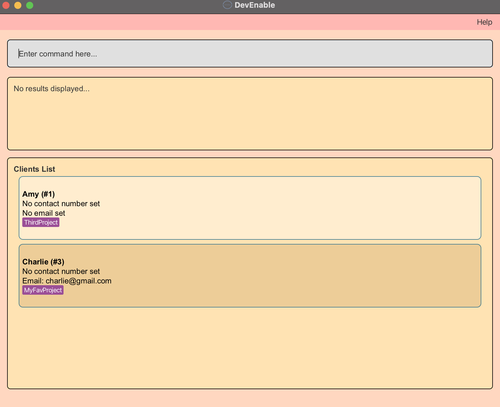
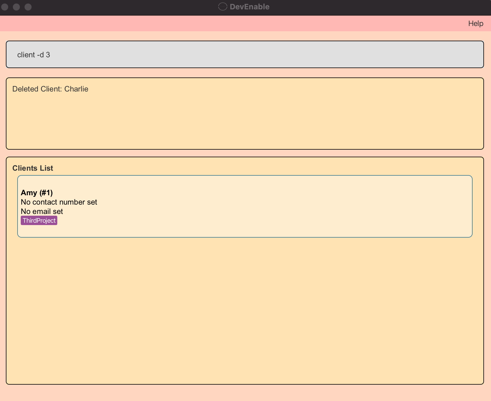

Format: 
* Project: `project -d PROJECT_ID`
  * Deletes the project with the specified `PROJECT_ID`
* Client: `client -d CLIENT_ID`
  * Deletes the client with the specified `CLIENT_ID`
* Issue: `issue -d ISSUE_ID`
  * Deletes the issue with the specified `ISSUE_ID

Note:
* The ID **must exist and be a positive integer** 1, 2, 3, …​

Examples:
* `project -d 1` Deletes project with `PROJECT_ID` 1.
* `client -d 6` Deletes client with `CLIENT_ID` 6.
* `issue -d 3` Deletes issue with `ISSUE_ID` 3.

### List Command: `-l`

Shows a list of all projects, clients or issues.

Format: 
* Project: `project -l`
* Client: `client -l`
* Issue: `issue -l`

### Find Command: `-f`

Finds and lists all the projects, clients or issues matching the search criteria.

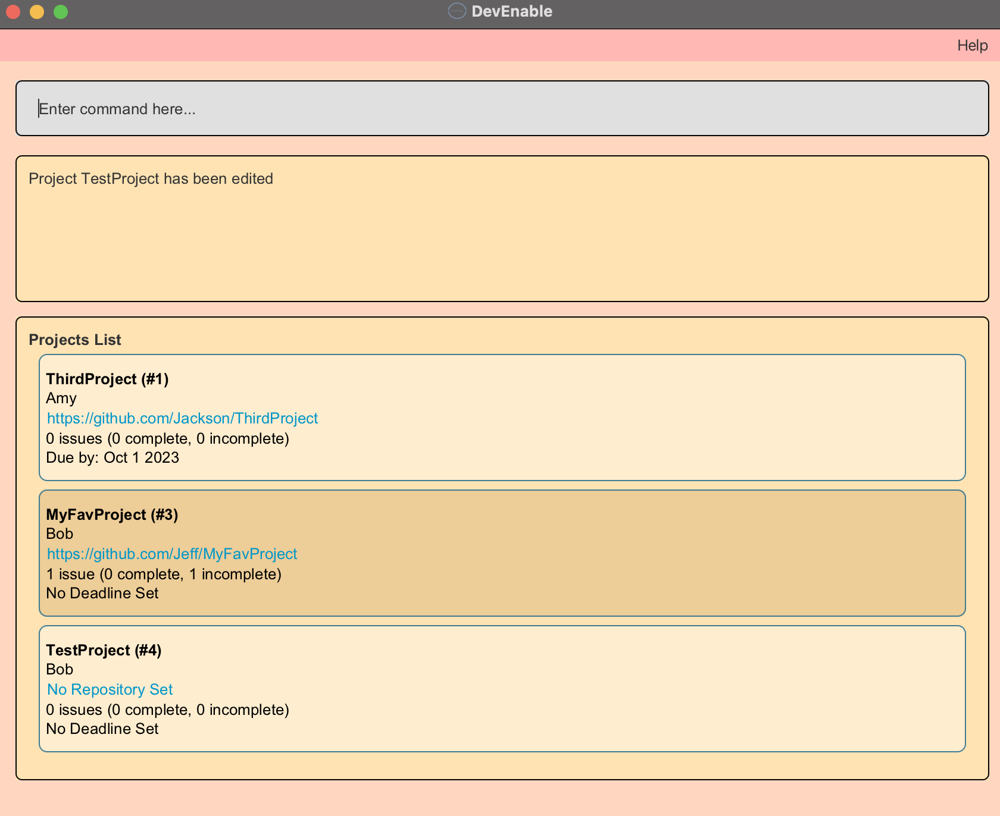
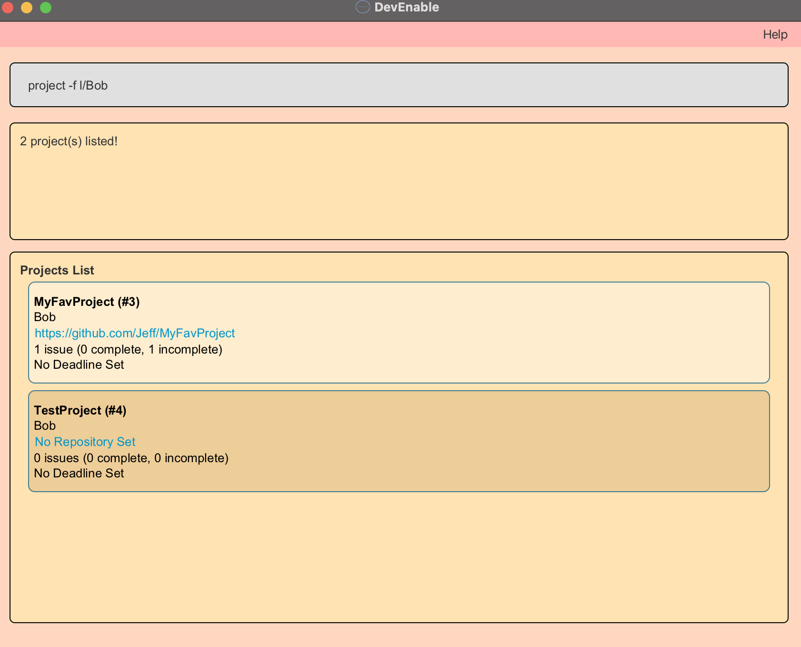

Format: 
* Project: `project -f [n/PROJECT_NAME] [p/PROJECT_ID] [r/REPOSITORY] [l/CLIENT_LABEL] [c/CLIENT_ID]`
  * Finds all the projects with the specified `PROJECT_NAME`, `PROJECT_ID`, `REPOSITORY`, `CLIENT_LABEL` and
    `CLIENT_ID`. The `CLIENT_LABEL` is the name of the project's client, appearing as a label on the project card.
  * Finds all the projects such that the fields under the project contain at least one word from the keywords provided
    after each search criteria if the search criteria is project or client name.
* Client: `client -f [n/CLIENT_NAME] [c/CLIENT_ID] [e/CLIENT_EMAIL] [m/CLIENT_MOBILE]`
  * Finds all the clients with the specified `CLIENT_NAME`, `CLIENT_ID`, `CLIENT_EMAIL`, and `CLIENT_MOBILE`
  * Finds all the clients such that the fields under the client contain at least one word from the keywords provided
    after each search criteria if the search criteria is client name.
* Issue: `issue -f [t/TITLE] [s/STATUS] [u/URGENCY] [n/PROJECT_NAME] [p/PROJECT_ID] [i/ISSUE_ID]`
  * Finds all the issues with the specified `TITLE`, `STATUS`, `URGENCY`, `PROJECT_NAME`, `PROJECT_ID` and `ISSUE_ID`.
  * Finds all the issues such that the fields under the issue contain at least one word from the keywords provided
    after each search criteria if the search criteria is title or project name.

Note:
* At least one of the optional fields must be provided.
* The keywords provided must be valid arguments for their respective search criteria.
* Repeated prefixes (e.g. t/Do t/Find) in a command will return results containing either of the two arguments

Examples:
* `project -f n/DevEnable` Finds and lists all the projects whose `PROJECT_NAME` contains the word DevEnable.
* `client -f n/Amy Bob` Finds and lists all the clients with the `CLIENT_NAME` contains the word Amy or Bob.
* `issue -f p/3 p/5` Finds and lists the issue tied to project with `PROJECT_ID` 3 or 5.
* `client -f n/Amy e/amy@gmail.com m/12345678` Finds and lists all the clients whose `CLIENT_NAME` contains the word
    Amy and with `CLIENT_EMAIL` amy@gmail.com and with `CLIENT_MOBILE` 12345678.
* `project -f n/AB4 AB3 r/tp/F13` Finds and lists all the projects whose `PROJECT_NAME` contains the word AB4 or AB3 
  and with the `REPOSITORY` tp/F13.
* `issue -f t/enhancement p/DevEnable AB3 u/HIGH u/LOW` Finds and lists all the issues with `TITLE` enhancement and
  `URGENCY` HIGH or LOW and tied to project with `PROJECT_NAME` containing DevEnable or AB3.
* `issue -f s/Incomplete` Finds and lists all the issues with the `STATUS` Incomplete.

### Pin Command: `-p`

Pins a project, client, or issue to the top of the project list, client list or issue list.

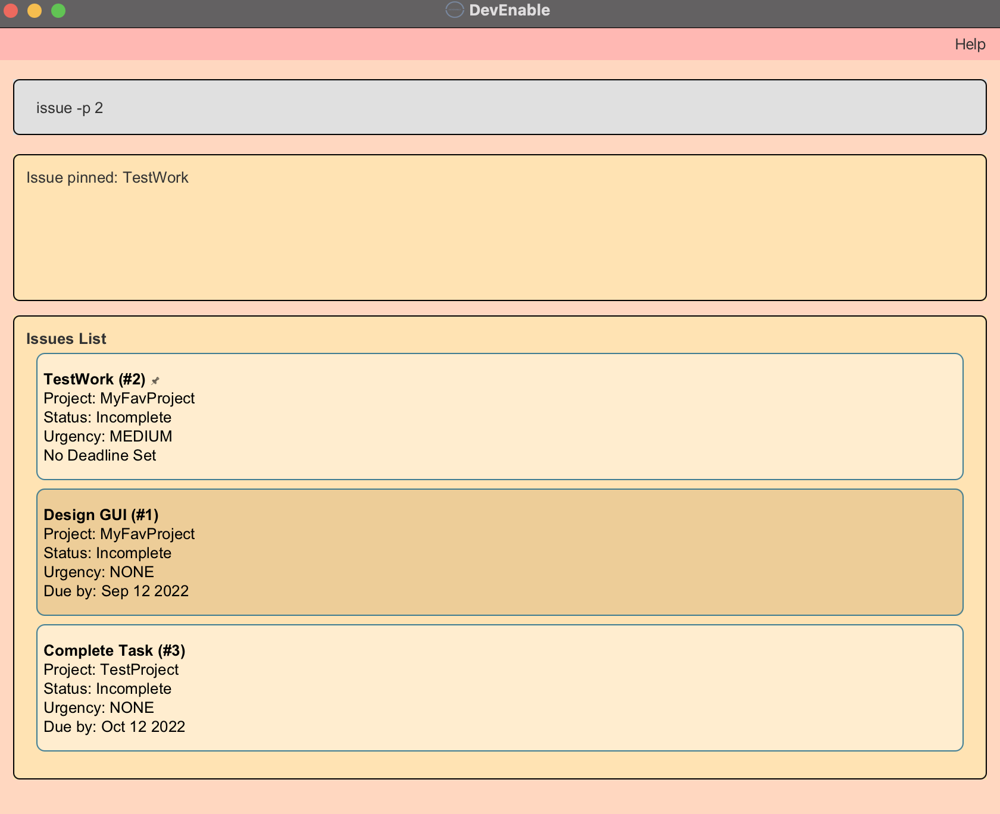

Format: 
* Project: `project -p PROJECT_ID`
  * Pins the project with the specified `PROJECT_ID`
* Client: `client -p CLIENT_ID`
  * Pins the client with the specified `CLIENT_ID`
* Issue: `issue -p ISSUE_ID`
  * Pins the issue with the specified `ISSUE_ID`

Note:
* Executing the command on an already pinned project will unpin the project.
* The ID **must be a positive integer** 1, 2, 3, …​

Examples:
* `project -p 1` Pins the project with `PROJECT_ID` 1.
* `client -p 4` Pins the client with `CLIENT_ID` 4.
* `issue -p 2` Pins the issue with `ISSUE_ID` 2.

### Sort Command: `-s`

Sorts all projects, clients or issues based on a specified key.

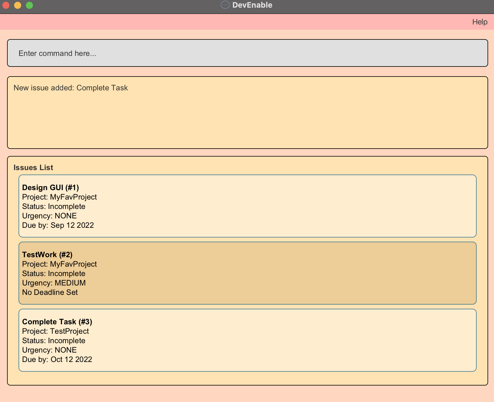
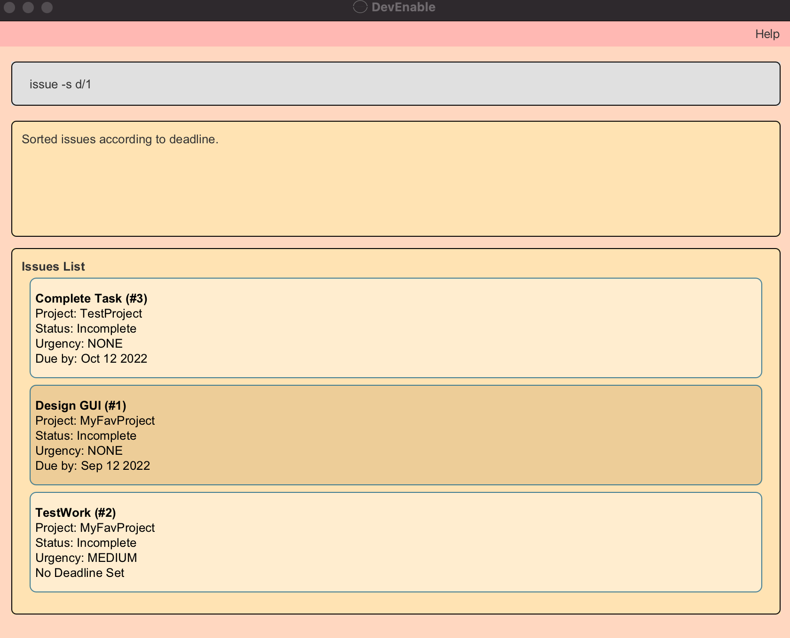

> IMPORTANT: Unlike other commands, input 0/1 as the argument for each prefix (e.g.p/0)

Format: 
* Project: `project -s [p/PROJECT_ID] [d/DEADLINE] [i/ISSUE_COUNT] [n/PROJECT_NAME]`
  * For `PROJECT_ID`, 0 for ascending and 1 for descending.
  * For `DEADLINE`, 0 for chronological and 1 for reverse chronological.
  * For `ISSUE_COUNT`, 0 for incomplete issues and 1 for completed issues.
  * For `PROJECT_NAME`, 0 for alphabetical and 1 for reverse alphabetical.
* Client: `client -s [c/CLIENT_ID] [n/CLIENT_NAME]`
  * For `CLIENT_ID`, 0 for ascending and 1 for descending.
  * For `CLIENT_NAME`, 0 for alphabetical and 1 for reverse alphabetical
* Issue: `issue -s [i/ISSUE_ID] [d/DEADLINE] [u/URGENCY]`
* For `ISSUE_ID`, 0 for ascending and 1 for descending.
    * For `DEADLINE`, 0 for chronological and 1 for reverse chronological.
    * For `URGENCY`, 0 for ascending and 1 for descending.

Note:
* Exactly one optional value (the prefix/the sorting key) is to be provided
(Command will not accept multiple optional values or repeated prefixes).

Examples:
* `project -s p/1` Sorts list of projects based on `PROJECT_ID` from highest to lowest.
* `issue -s d/0` Sorts list of issues based on `DEADLINE` from earliest to latest.
* `client -s n/1` Sort list of clients based on `CLIENT_NAME` in reverse alphabetical order.
* `project -s i/0` Sorts list of projects based on `ISSUE_COUNT` from the highest incomplete issue count to the lowest.
* `issue -s u/1` Sorts list of issues based on `URGENCY` from highest to lowest.

### Default View Command `-v`

Sets list of projects, clients or issues to be the default view when application is re-opened.

Format: 
* Project: `project -v`
  * Sets list of projects as default view
* Client: `client -v`
  * Sets list of clients as default view
* Issue: `issue -v`
  * Sets list of issues as default view

### Mark/Unmark Issue Command: `-m`

Marks specified existing issue as completed or incomplete

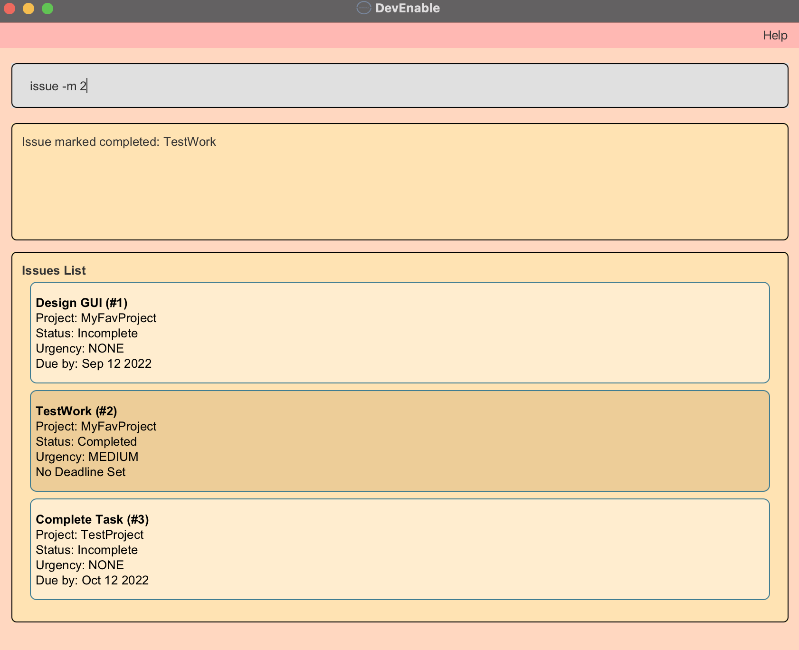

Format: 
* Mark: `issue -m ISSUE_ID`
  * Marks the issue with the specified `ISSUE_ID`, changing its `STATUS` to completed.
* Unmark:`issue -u ISSUE_ID`
  * Unmarks the issue with the specified `ISSUE_ID`, changing its `STATUS` to incomplete.

Note: 
* If issue is already completed, it remains completed when marked (the same goes for incomplete issue that is unmarked).
* The ID **must exist and be a positive integer** 1, 2, 3, …​

Examples:
* `issue -m 1` Changes the `STATUS` of the issue with `ISSUE_ID` 1 to completed.
* `issue -m 4` Changes the `STATUS` of the issue with `ISSUE_ID` 4 to incomplete.

### Saving the data

DevEnable data is saved in the hard disk automatically after any command that changes the data. There is no need to save manually.

### Editing the data file

DevEnable data is saved as a JSON file `[JAR file location]/data/addressbook.json`. Advanced users are welcome to update data directly by editing that data file.

:exclamation: **Caution:**
If your changes to the data file makes its format invalid, DevEnable will discard all data and start with an empty data file at the next run.

--------------------------------------------------------------------------------------------------------------------

## FAQ

**Q**: How do I transfer my data to another Computer? 
**A**: Install the app in the other computer and overwrite the data file it creates with the file that contains the data of your previous DevEnable home folder.

--------------------------------------------------------------------------------------------------------------------

## Command summary

| Action                         | Format                                                                          |
|--------------------------------|:-------------------------------------------------------------------------------------------|
| **Add Project**                | `project -a n/PROJECT_NAME [r/REPOSITORY] [c/CLIENT_ID] [d/DEADLINE] `                     |
| **Edit Project**               | `project -e p/PROJECT_ID [n/PROJECT_NAME] [r/REPOSITORY] [c/CLIENT_ID] [d/DEADLINE]`       |
| **Delete Project**             | `project -d PROJECT_ID`                                                                    |
| **List Projects**              | `project -l`                                                                               |
| **Find Projects**              | `project -f [n/PROJECT_NAME] [r/REPOSITORY] [p/PROJECT_ID] [c/CLIENT_ID] [l/CLIENT_LABEL]` |
| **Pin Projects**               | `project -p PROJECT_ID`                                                                    |
| **Sort Projects**              | `project -s [p/PROJECT_ID] [d/DEADLINE] [i/ISSUE_COUNT] [n/PROJECT_NAME]`                  |
| **Set Default View (Project)** | `project -v`                                                                               |
| **Add Client**                 | `client -a n/CLIENT_NAME p/PROJECT_ID [m/CLIENT_MOBILE] [e/CLIENT_EMAIL]`                  |
| **Edit Client**                | `client -e c/CLIENT_ID [n/CLIENT_NAME] [m/CLIENT_MOBILE] [e/CLIENT_EMAIL]`                 |
| **Delete Client**              | `client -d CLIENT_ID`                                                                      |
| **List Clients**               | `client -l`                                                                                |
| **Find Clients**               | `client -f [n/CLIENT_NAME] [m/CLIENT_MOBILE] [e/CLIENT_EMAIL] [c/CLIENT_ID]`               |
| **Pin Clients**                | `client -p CLIENT_ID`                                                                      |
| **Sort Clients**               | `client -s [c/CLIENT_ID] [n/CLIENT_NAME]`                                                  |
| **Set Default View (Client)**  | `client -v`                                                                                |
| **Add Issue**                  | `issue -a p/PROJECT_ID t/TITLE [d/DEADLINE] [u/URGENCY]`                                   |
| **Edit Issue**                 | `issue -e i/ISSUE_ID [t/TITLE] [d/DEADLINE] [u/URGENCY]`                                   |
| **Delete Issue**               | `issue -d ISSUE_ID`                                                                        |
| **List Issues**                | `issue -l`                                                                                 |
| **Find Issues**                | `issue -f [t/TITLE] [n/PROJECT_NAME] [p/PROJECT_ID] [u/URGENCY] [s/STATUS] [i/ISSUE_ID]`   |
| **Pin Issues**                 | `issue -p ISSUE_ID`                                                                        |
| **Sort Issues**                | `issue -s [i/ISSUE_ID] [d/DEADLINE] [u/URGENCY]`                                           |
| **Mark Issue**                 | `issue -m ISSUE_ID`                                                                        |
| **Unmark Issue**               | `issue -u ISSUE_ID`                                                                        |
| **Set Default View (Issue)**   | `issue -v`                                                                                 |
| **Clear**                      | `clear`                                                                                    |
| **Help**                       | `help`                                                                                     |
| **Exit**                       | `exit`                                                                                     |
