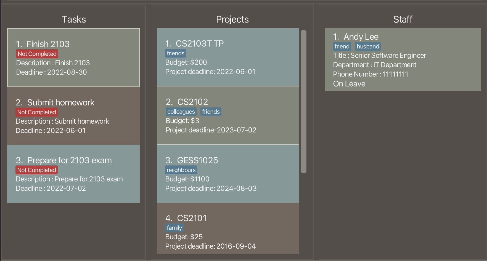

# **Introduction**
HR Pro Max++ is a **desktop app for team leads in SMEs to manage projects and staff members under them. It is optimized for use via a Command Line Interface** (CLI) while still having the benefits of a Graphical User Interface (GUI).
If you can type fast, HR Pro Max++ can get your project management tasks done faster than traditional GUI apps.

--------------------------------------------------------------------------------------------------------------------
## **Table of Contents**
To quickly return to the Table of Contents, you can click on any of the section headers you navigate to.

* Table of Contents 
{:toc}

--------------------------------------------------------------------------------------------------------------------
## [**Quick start**](#table-of-contents)

1. Ensure you have Java `11` or above installed in your Computer.

1. Download the latest `HR_Pro_Max++.jar` from [here](https://github.com/AY2223S1-CS2103T-T09-3/tp/releases).

1. Copy the file to the folder you want to use as the _home folder_ for your project management application.

1. Double-click the file to start the app. The GUI similar to the below should appear in a few seconds. Note how the app contains some sample data.<br>
   

1. Type the command in the command box and press Enter to execute it. e.g. typing **`help`** and pressing Enter will open the help window.<br>
   Some example commands you can try:

   * **`list`** : Lists all projects.

   * **`addproj pn/Duke pb/ 20 pd/ 2022-09-27`** : Adds a project named Duke to HR Pro Max++.

   * **`delproj 3`** : Deletes the 3rd project shown in the current list.

   * **`clear`** : Deletes all data currently saved on HR Pro Max++.

   * **`exit`** : Exits the app.

1. Refer to the [Features](#features) below for details of each command.

--------------------------------------------------------------------------------------------------------------------
## [**User interface**](#table-of-contents)
The user interface is divided into 3 main parts: the command box, the result display and the List panel.
### [**Command Box**](#table-of-contents)
The command box is where you can type in your commands. You can press the `Enter` key to execute the command.


### [**Result Display**](#table-of-contents)
The result display is where the output of your commands will be shown.
For example, entering an incorrect `addproj` command like shown below will cause an error message to be displayed in the result display.


### [**List Panel**](#table-of-contents)
By default, the `Task`, `Project`, or `Staff` card will alternate between blue and grey.
Clicking on a `Task`, `Project`, or `Staff` card will cause the respective box to be highlighted in green.
All `Task` and `Project` cards will be displayed in the `List Panel`.
By default, the `Staff` list is empty when first starting the program.
To see how to view the `Staff` list of other projects, you can check [this](#view-the-staff-list-within-a-project--view) segment of the user guide.

<div markdown="span" class="alert alert-primary">:bulb: **Tip:**
We refer to the Tasks shown as task list, Projects shown as project list and Staff shown as staff list.
</div>



--------------------------------------------------------------------------------------------------------------------
## [**Features**](#table-of-contents)

<div markdown="block" class="alert alert-info">

**:information_source: Notes about the command format:**<br>

* Words in `UPPER_CASE` are the parameters to be supplied by the user.<br>
  e.g. in `addproj pn/PROJECT_NAME`, `PROJECT_NAME` is a parameter which can be used as `addProj pn/CS2103T`.

* Items in square brackets are optional.<br>
  e.g `pn/PROJECT_NAME [t/TAG]` can be used as `pn/2101 t/fun` or as `pn/2101`.

* Items with `…`​ after them can be used multiple times including zero times.<br>
  e.g. `[t/TAG]…​` can be used as ` ` (i.e. 0 times), `t/fun`, `t/fun t/expensive` etc.

* Parameters can be in any order.<br>
  e.g. if the command specifies `pn/PROJECT_NAME pb/PROJECT_BUDGET`, `pb/PROJECT_BUDGET pn/PROJECT_NAME` is also acceptable.

* If a command requires both index and parameters, the index has to come before the parameters. The parameters behind the index can be arranged in any order.
  e.g. For the `delstaff` command, its format is `editstaff INDEX pn/PROJECT_NAME` and this must be strictly adhered to. Putting the index at the back will give an error.

* If a parameter is expected only once in the command but you specified it multiple times, only the last occurrence of the parameter will be taken.<br>
  e.g. if you specify `sp/12341234 sp/56785678`, only `sp/56785678` will be taken.

* Extraneous parameters for commands that do not take in parameters (such as `help`, `list`, `exit` and `clear`) will be ignored.<br>
  e.g. if the command specifies `help 123`, it will be interpreted as `help`.

* Commands word for using a command is case-insensitive.
  e.g. For the `addproj` command, it can be used with these command words: `Addproj`, `addProj`, `ADDPROJ`

</div>

--------------------------------------------------------------------------------------------------------------------
### [**Help :** `help`](#table-of-contents)

Shows a message explaining how to access the help page.


Format: `help`

--------------------------------------------------------------------------------------------------------------------
## [**Project Commands**](#table-of-contents)
### [**Adding a Project :** `addproj`](#table-of-contents)

Adds a project to Project list.

Format: `addproj pn/PROJECT_NAME pb/PROJECT_BUDGET pd/PROJECT_DEADLINE [t/TAG]…​`

* PROJECT_BUDGET should be a whole number and entered as Singapore dollars. Do not need $S.
* PROJECT_DEADLINE should follow the YYYY-MM-DD format.

<div markdown="span" class="alert alert-primary">:bulb: **Tip:**
A project can have any number of tags (including 0)
</div>

Examples:
* `addproj pn/2103T TP pb/100000 pd/2022-01-01`
* `addproj pn/CS2100 t/Tiring pb/1000 pd/2022-01-01 t/Funtime`

--------------------------------------------------------------------------------------------------------------------
### [**Deleting a Project :** `delproj`](#table-of-contents)

Deletes the specified Project from Project list.

Format: `delproj INDEX`

* Deletes the project at the specified `INDEX`.
* The index refers to the index number shown in the displayed Project list.

```yaml
Note: 
* The index must be a positive integer 1, 2, 3, …​
* Staff list will not display any staffs. You will have to view a project to see the staff of that project
```

Examples:
* `list` followed by `delproj 2` deletes the 2nd project in Project list.
* `findproj 2103T TP` followed by `delproj 1` deletes the 1st project in the results of the `find` command.

--------------------------------------------------------------------------------------------------------------------
### [**Listing all Projects and tasks :** `list`](#table-of-contents)

Show all the Projects and tasks in the project and task list respectively.
:bulb: **Tip:** After using a find command, you can use `list` to return the display to its original state.

Format: `list`

--------------------------------------------------------------------------------------------------------------------
### [**Finding Projects :** `findproj`](#table-of-contents)

Finds all projects whose names contain any of the specified keywords (case-insensitive) and displays them as a list with index numbers.

Format: `findproj KEYWORD [MORE_KEYWORDS]`

```yaml
Note: 
* The search is case-insensitive. e.g `hans` will match `Hans`
* Only full words will be matched e.g. `Han` will not match `Hans`
```

Examples:
* `findproj CS2103` returns `CS2103` and `CS2103 TP`

--------------------------------------------------------------------------------------------------------------------
### [**Sorting the Project list :** `sortproj`](#table-of-contents)

Sorts the Project list according to deadline.

```yaml
Note: 
* This command is irreversible, you will not be able to get back the original ordering after this command.
```

Format: `sortproj`

--------------------------------------------------------------------------------------------------------------------
### [**Editing a Project :** `editproj`](#table-of-contents)

Edits an existing Project in the Project list.

Format: `editproj INDEX [pn/PROJECT_NAME] [pb/PROJECT_BUDGET] [pd/PROJECT_DEADLINES] [t/TAG]…​`

* Edits the Project at the specified `INDEX` in the currently displayed Project list. 

```yaml
Note:
* The index **must be a positive integer** 1, 2, 3, …​
* At least one of the optional fields must be provided.
* Existing values will be updated to the input values.
* When editing tags, the existing tags of the person will be removed i.e adding of tags is not cumulative.
* You can remove all the person’s tags by typing `t/` without
  specifying any tags after it.
```

Examples:
* `editproj 1 pb/5000` Edits the project budget of the 1st project to be `5000`.
* `editproj 2 pn/CS2103 t/` Edits the name of the 2nd person to be `CS2103` and clears all existing tags.

--------------------------------------------------------------------------------------------------------------------
## [**Staff Commands**](#table-of-contents)

Since each project contains a list of staff, for the use of all staff commands, we recommend that before using the staff commands on a project, you should use the `view` command on the project.

Staff list will refer to the staff list within a project and the displayed staff list refers to what is shown on the GUI.

### [**Adding a Staff member to Project :** `addstaff`](#table-of-contents)

Adds a staff member info to Project specified by the index in project list.

Format: `addstaff INDEX sn/STAFF_NAME sl/LEAVE_STATUS sd/STAFF_DEPARTMENT st/STAFF_TITLE sc/CONTACT_NUMBER [t/TAGS]`

```yaml
Note:
* All fields for staff member are required, except `TAGS`
* Index refers to project in displayed project list. It will add the staff to this project.
* If no project is shown on the project list, addstaff will give an error. Use list to display all 
  projects but if there is no projects, add a project using addproj command.
* If staff is added successfully, it will update the displayed staff list to show the staff list 
  of the project where the staff is added to.
```

Examples:
* `addstaff 1 sn/John Doe sp/98765432 sl/true sd/Accounting st/Accountant` Adds staff member named `John Doe` to the first project in the project list.
* `addstaff 3 sn/Betsy Crowe sp/1234567 st/Admin Staff sd/Admin sl/false` Adds staff member named `Betsy Crown` to the third project in the project list.

--------------------------------------------------------------------------------------------------------------------
### [**Deleting a Staff member from Project :** `delstaff`](#table-of-contents)

Deletes a staff member and all its info inside a project in the currently displayed project list.

Format: `delstaff INDEX pn/PROJECT_NAME`

```yaml
Note:
* INDEX refers to staff in displayed staff list. It is the staff to be deleted.
* PROJECT_NAME refers to the project in displayed project list where the staff is deleted from.
* Recommended to use the view command on a project before deleting a staff from it.
* A possible interaction is if you view the staff list of project A then try 
  to delete staff at index 1 (call this staff Tom) from project B, it will delete 
  staff Tom from project B if staff Tom is also part of project B.
* If staff is deleted successfully, it will update the displayed staff list to show the staff list 
  of the project where the staff was deleted from.
* The index must be a positive integer 1, 2, 3, …​
```

Examples:

* `delstaff 1 pn/2103` Delete the 1st staff within the displayed staff list from project `2103`.
* `delstaff 7 pn/Duke` Delete 7th staff with displayed staff list from project `Duke`.

--------------------------------------------------------------------------------------------------------------------
### [**View the Staff list within a project :** `view`](#table-of-contents)

Views the staff list of a specified project in Project list.

Format: `view INDEX`

* View the staff list of the project at the specified `INDEX`.

```yaml
Note:
* The index refers to the index number shown in the displayed Project list.
* The index must be a positive integer 1, 2, 3, …​
```
Examples:
* `list` followed by `view 2` displays the staff list of the 2nd project in Project list on the bottom right.
* `find 2103T TP` followed by `view 1` display the staff list of the 1st project from the result of the `find` command.

--------------------------------------------------------------------------------------------------------------------
### [**Editing a Staff member within a Project :** `editstaff`](#table-of-contents)

Edits the staff details of a staff of a specified project in the currently displayed Project list.

Format: `editstaff INDEX pn/PROJECT_NAME [sn/STAFF_NAME sl/LEAVE_STATUS sd/STAFF_DEPARTMENT st/STAFF_TITLE sc/CONTACT_NUMBER
t\TAGS]`

```yaml
Note:
* INDEX refers to staff in displayed staff list. It is the staff to be edited.
* PROJECT_NAME refers to the project in displayed project list where the staff is to be edited.
* Recommended to use the view command on a project before editing a staff in its staff list.
* A possible interaction is if you view the staff list of project A then try
  to edit staff at index 1 (call this staff Tom) from project B, it will try to edit
  staff Tom from project B if staff Tom is also part of project B.
* If staff is edited successfully, it will update the displayed staff list to show the staff list
  of the project where the staff was deleted from.
* All fields in the `[]` are optional. 
* Index must be a positive integer 1, 2, 3, ...
```

Examples:
* `editstaff 1 pn/CS2103T sn/John Doe` edits the staff name of the first staff of the displayed staff list of `CS2103T` to `John Doe`

--------------------------------------------------------------------------------------------------------------------
### [**Finding a Staff member within a Project :** `findstaff`](#table-of-contents)

Finds the displayed staff list for staff with names that matches the keyword.

Format: `findstaff KEYWORDS`

```yaml
Note:
* `KEYWORDS` must not be an empty string. 
* For `findstaff` to work as expected, the current active staff list must be non-empty.
* The findstaff command is case-insensitive such that 'hans' will match 'HANS'
* The findstaff command will match staff name if there is a partial match, 'ha' or 'hA' will both match 'HANS'
```

Examples:
* `findstaff Jon` returns a filtered view of the staff list such that all staffs with name `Jon` are listed.
* `findstaff Adrian Lam` returns a filtered view of the staff list such that all staffs with name `Adrian Lam` are listed. 
Staffs whose name contains `Adrian` or `Lam` only aren't listed. 
* You can always use `view INDEX` to list all the staff in the staff list after you are done with finding a particular staff.

--------------------------------------------------------------------------------------------------------------------
## [**Task Commands**](#table-of-contents)
### [**Adding a Task :** `addtask`](#table-of-contents)

Adds a Task to the Task list. 

Format: `addtask tdesc/TASK_DESCRIPTION td/TASK_DEADLINE`

```yaml
Note:
* Both task fields `TASK_DESCRIPTION` and `TASK_DEADLINE` must be present.
* `TASK_DEADLINE` follows the YYYY-MM-DD format. 
```

Examples:
* `addtask tdesc/Finish Homework td/2022-10-27` creates a Task with the description `Finish Homework` and deadline set to
`2022-10-27`

--------------------------------------------------------------------------------------------------------------------
### [**Deleting a Task :** `deltask`](#table-of-contents)

Deletes a Task at the specified index from the Task list. 

Format: `deltask INDEX`

```yaml
Note:
* `INDEX` must be a positive integer from 1, 2, 3, ... 
```

Examples:
* `deltask 1` deletes the Task at index 1 of the Task list.
* If the Task list has only 4 elements, `deltask 5` would return an error message of
`The task index provided is invalid`.

--------------------------------------------------------------------------------------------------------------------
### [**Finding a Task :** `findtask`](#table-of-contents)

Finds tasks whose description matches any of the KEYWORDS.

Format: `findtask KEYWORDS`

```yaml
Note:
* The search is case-insensitive. e.g `hans` will match `Hans`
* Only full words will be matched e.g. `Han` will not match `Hans`
* The search returns the task if word in task description matches search term e.g. `CS2103T` matches `CS2103T Project`
```

Examples:
* `findtask CS2103` returns `CS2103` and `Todo CS2103`

--------------------------------------------------------------------------------------------------------------------
### [**Sorting the Task list :** `sorttask`](#table-of-contents)

Sort tasks in task list by deadline. Earlier deadlines will be placed first.

```yaml
Note: 
* This command is irreversible, you will not be able to get back the original ordering after this command.
```

Format: `sorttask`

--------------------------------------------------------------------------------------------------------------------
### [**Filtering the Task list :** `filtertask`](#table-of-contents)

Show Tasks in Task List that are not done at the top of the task list and the rest at bottom.

Format: `filtertask`

--------------------------------------------------------------------------------------------------------------------
### [**Marking a Task as done :** `marktask`](#table-of-contents)

Marks a Task in Task list as done.

Format: `marktask INDEX`

* Marks the task at the specified `INDEX` in the displayed Task list as done.

```yaml
Note:
* The index must be a positive integer 1, 2, 3, …
```

Examples:
* `marktask 1` Marks the first task as done.

--------------------------------------------------------------------------------------------------------------------
### [**Marking a Task as Undone :** `unmarktask`](#table-of-contents)

Marks a Task in Task list as not done.

Format: `unmarktask INDEX`

* Marks the task at the specified `INDEX` in the displayed Task list as not done.

```yaml
Note:
* The index **must be a positive integer** 1, 2, 3, …
```
Examples:
* `unmarktask 2` Marks the second task as not done.

--------------------------------------------------------------------------------------------------------------------
### [**Exiting the program :** `exit`](#table-of-contents)

Exits the program.

Format: `exit`

--------------------------------------------------------------------------------------------------------------------
### [**Clearing all Data :** `clear`](#table-of-contents)

Clears **all data** from HR Pro Max++.

Format: `clear`

--------------------------------------------------------------------------------------------------------------------
### [**Saving the data**](#table-of-contents)
Project data is saved in the hard disk automatically after any command that changes the data. 
There is no need to save manually.

--------------------------------------------------------------------------------------------------------------------
## [**FAQ**](#table-of-contents)

**Q**: How do I transfer my data to another Computer?<br>
**A**: Install the app in the other computer and overwrite the empty data file it creates with the file that contains the data of your previous AddressBook home folder.

--------------------------------------------------------------------------------------------------------------------
## [**Command Summary**](#table-of-contents)

### [**Project Commands Summary**](#table-of-contents)

| Action                    | Format, Examples                                                                                      |
|---------------------------|-------------------------------------------------------------------------------------------------------|
| **Add project**           | `addproj pn/PROJECT_NAME  [t/TAG]…​` <br> e.g., `addproj pn/Duke pd/2022-10-25 pb/10000 t/funz`       |
| **Delete project**        | `delproj INDEX`<br> e.g., `delproj 3`                                                                 |
| **Edit project**          | `editproj INDEX [pn/PROJECT_NAME] [pd/PROJECT_DEADLINE]…​`<br> e.g.,`editproj 2 pn/Roofus pb/1350000` |
| **Find projects**         | `findproj KEYWORD`<br> e.g., `findproj Duke`                                                          |
| **Sort projects**         | `sortproj`                                                                                            |
| **List project and task** | `list`                                                                                                |

### [**Staff Commands Summary**](#table-of-contents)

| Action              | Format, Examples                                                                                              |
|---------------------|---------------------------------------------------------------------------------------------------------------|
| **Add staff**       | `addstaff INDEX sn/STAFF_NAME…​` <br> e.g., `addstaff 1 sn/DEXTER sl/true sd/HR st/HR manager sp/98019345`    |
| **Delete staff**    | `delstaff INDEX pn/PROJECT_NAME` <br> e.g., `delstaff 1 pn/Duke`                                              |
| **Edit staff**      | `editstaff INDEX pn/PROJECT_NAME [sn/STAFF_NAME]…​`<br> e.g.,`editstaff 1 pn/CS2103T TP sp/98765432 sl/false` |
| **Find staff**      | `findstaff KEYWORD`<br> e.g., `findstaff Duke`                                                                |
| **View staff list** | `view INDEX` <br> e.g., `view 1`                                                                              |


### [**Tasks Commands Summary**](#table-of-contents)

| Action           | Format, Examples                                                                                                              |
|------------------|-------------------------------------------------------------------------------------------------------------------------------|
| **Add task**     | `addtask tdesc/TASK_DESCRIPTION td/TASK_DEADLINE` <br> e.g., `addtask tdesc/Edit user guide td/2022-10-28`                    |
| **Delete task**  | `deltask INDEX` <br> e.g., `deltask 1`                                                                                        |
| **Edit task**    | `edittask INDEX [tdesc/TASK_DESCRIPTION] [td/TASK_DEADLINE]` <br> e.g., `edittask 1 tdesc/Edit Developer guide td/2022-10-25` |
| **Find tasks**   | `findtask KEYWORDS`<br> e.g., `findtask GAME Try`                                                                             |
| **Sort tasks**   | `sorttask`                                                                                                                    |
| **Filter tasks** | `filtertask`                                                                                                                  |
| **Mark tasks**   | `marktask INDEX` <br> e.g., `marktask 1`                                                                                      |
| **Unmark tasks** | `unmarktask INDEX`<br> e.g., `unmarktask 1`                                                                                   |


### [**Misccellaneous Commands Summary**](#table-of-contents)


| Action                    | Format, Examples |
|---------------------------|------------------|
| **Clear save data**       | `clear`          |
| **Help**                  | `help`           |
| **Exit application**      | `exit`           |


## [**Prefix Summary**](#table-of-contents)
Prefixes that start with `p` are for project details.

Prefixes that start with `s` are for project staff member details.

Prefixes that start with `t` and are 2 letters long are for task details.

The prefix `t/` is for tags that are used for projects and staff only.


| Prefix     | Meaning            | Format/ Examples       |
|------------|--------------------|------------------------|
| **pb/**    | Project budget     | pb/PROJECT_BUDGET      |
| **pd/**    | Project deadline   | pd/PROJECT_DEADLINE    |
| **pn/**    | Project name       | pn/PROJECT_NAME        |
| **sc/**    | Staff Contact      | sc/STAFF_CONTACT       |
| **sd/**    | Staff department   | sd/STAFF_DEPARTMENT    |
| **sl/**    | Staff leave status | si/LEAVE_STATUS        |
| **sn/**    | Staff name         | sn/STAFF_NAME          |
| **st/**    | Staff title        | st/STAFF_TITLE         |
| **td/**    | Task deadline      | td/TASK_DEADLINE       |
| **tdesc/** | Task description   | tdesc/TASK_DESCRIPTION |
| **tm/**    | Task mark          | tm/TASK_MARK           |
| **t/**     | Tag                | t/TAG                  |

