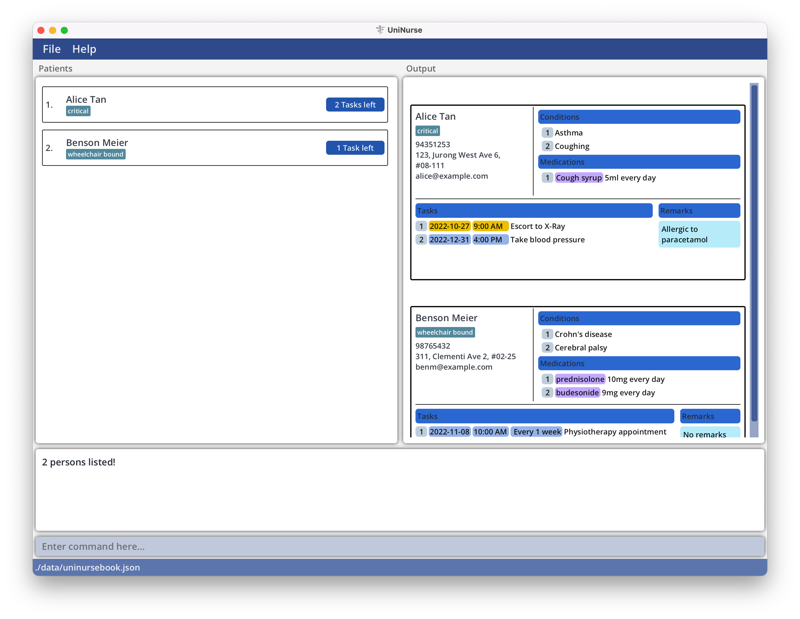

**UniNurse** is a desktop app tailored for you, a **private duty nurse**, to:
- Manage your patients' contact details.
- Organize your patient-related tasks.
- Keep track of your patients' medical conditions.

<div markdown="block" class="alert alert-info">

**Fastest fingers first!**

If your fingers are as quick as your wit, UniNurse helps you to get your patient management tasks done in no time!
It leverages on a no-frills _Command Line Interface (CLI)_ to give fast typists such as yourself a painless user
experience.

</div>

UniNurse offers the following features:
- Add and edit patient details such as name, contact number, medical conditions, etc.
- Find and filter patients by their details.
- Add tasks to a patient.
- Show the tasks to be done on a specific day.
- Categorize patients using tags.

--------------------------------------------------------------------------------------------------------------------

### Using this guide

This guide walks you through all the features of UniNurse, as well as tips, so you can reap all the benefits of
UniNurse!

If you are a **new user**, this guide equips you with the necessary know-how to [get started](#quick-start)
with UniNurse.

If you are an **experienced user**, you can refer to the [Command Summary](#command-summary) at the end of this guide.

Here are some symbols used throughout this user guide:

| Symbol               | Meaning                                  |
|----------------------|------------------------------------------|
| :information_source: | Important things you should take note of |
| :bulb:               | Useful information                       |
| :exclamation:        | Warning                                  |
| :wrench:             | Help with common issues                  |

--------------------------------------------------------------------------------------------------------------------

### Table of Contents

1. [Quick start](#quick-start)
2. [Glossary](#glossary)
3. [Command format](#command-format)
4. [Parameter constraints](#parameter-constraints)
5. [Features](#features)
   1. [Viewing help: `help`](#viewing-help-help)
   2. [Modifying patient contact details](#adding-a-patient-add)
      1. [Adding a patient: `add`](#adding-a-patient-add)
      2. [Editing a patient's contact details: `edit` `-p`](#editing-a-patients-contact-details-edit--p)
      3. [Deleting a patient: `delete` `-p`](#deleting-a-patient-delete--p)
   3. [Modifying tags](#adding-a-tag-add--p)
      1. [Adding a tag: `add` `-p`](#adding-a-tag-add--p)
      2. [Editing a tag: `edit` `-p` `-t`](#editing-a-tag-edit--p--t)
      3. [Deleting a tag: `delete` `-p` `-t`](#deleting-a-tag-delete--p--t)
   4. [Modifying tasks](#adding-a-task-add--p)
      1. [Adding a task: `add` `-p`](#adding-a-task-add--p)
      2. [Editing a task: `edit` `-p` `-d`](#editing-a-task-edit--p--d)
      3. [Deleting a task: `delete` `-p` `-d`](#deleting-a-task-delete--p--d)
   5. [Modifying medical conditions](#adding-a-medical-condition-add--p)
      1. [Adding a medical condition: `add` `-p`](#adding-a-medical-condition-add--p)
      2. [Editing a medical condition: `edit` `-p` `-c`](#editing-a-medical-condition-edit--p--c)
      3. [Deleting a medical condition: `delete` `-p` `-c`](#deleting-a-medical-condition-delete--p--c)
   6. [Modifying medications](#adding-a-medication-add--p)
      1. [Adding a medication: `add` `-p`](#adding-a-medication-add--p)
      2. [Editing a medication: `edit` `-p` `-m`](#editing-a-medication-edit--p--m)
      3. [Deleting a medication: `delete` `-p` `-m`](#deleting-a-medication-delete--p--m)
   7. [Modifying remarks](#adding-a-remark-add--p)
      1. [Adding a remark: `add` `-p`](#adding-a-remark-add--p)
      2. [Editing a remark: `edit` `-p` `-r`](#editing-a-remark-edit--p--r)
      3. [Deleting a remark: `delete` `-p` `-r`](#deleting-a-remark-delete--p--r)
   8. [Viewing patients](#listing-all-patients-list)
      1. [Listing all patients: `list`](#listing-all-patients-list)
      2. [Finding patients: `find`](#finding-patients-find)
      3. [Viewing all details of a patient: `focus` `-p`](#viewing-all-details-of-a-patient-focus--p)
      4. [Listing all patients for today: `view` `--today`](#listing-all-patients-for-today-view---today)
   9. [Viewing tasks](#listing-all-tasks-view--p---all)
      1. [Listing all tasks: `view` `-p` `-all`](#listing-all-tasks-view--p---all)
      2. [Viewing all tasks of a patient: `view` `-p`](#viewing-all-tasks-of-a-patient-view--p)
      3. [Listing all tasks for a particular day: `view`](#listing-all-tasks-for-a-particular-day-view)
   10. [Undoing last command: `undo`](#undo-last-command-undo)
   11. [Reversing undo command: `redo`](#reverse-undo-command-redo)
   12. [Clearing all entries: `clear`](#clearing-all-entries-clear)
   13. [Exiting UniNurse](#exiting-uninurse-exit)
   14. [Saving patients](#saving-the-data)
   15. [Editing the data file](#editing-the-data-file)
6. [FAQ](#faq)
7. [Command summary](#command-summary)

--------------------------------------------------------------------------------------------------------------------

## Quick start

1. Ensure you have [Java 11](https://www.oracle.com/sg/java/technologies/javase/jdk11-archive-downloads.html) or above
   installed on your computer. To check your Java version, open a Command Prompt or Terminal window and type:

```
java -version
```

2. Download the latest `uninurse.jar` [here](https://github.com/AY2223S1-CS2103T-T12-4/tp/releases).
3. Move `uninurse.jar` to the folder you want to use as the home folder for UniNurse.
4. Double-click the file to start UniNurse. A user interface similar to the one below should appear in a few seconds.

<div markdown="block" class="alert alert-success">

:bulb: **Tip:** The app comes with some sample patients by default. Type `clear` in the command box to remove them.

</div>


5. Type your command in the command box and hit `Enter` to execute the command. Here are some example commands
   you can try:
    * **`help`**: Opens the help window.
    * **`add`**`n/Jane Doe p/91234567 e/janed@example.com a/20 Anderson Road, block 123, #01-01`: Adds a
      patient named `Jane Doe` to your patient list.
    * **`delete`**`-p 3`: Deletes the 3rd patient shown in the current list.
    * **`list`**: Lists all patients.
    * **`clear`**: Deletes all patients shown in the current list.
    * **`exit`**: Exits from UniNurse.
6. Refer to the [Features](#features) below for details of each command. Alternatively, you may refer to the
   [Command Summary](#command-summary) at the end of this guide.

--------------------------------------------------------------------------------------------------------------------

## Glossary

**Here are some of the technical terminologies used:**

| Word         | Meaning                                                                                                                                                                                                    |
|--------------|------------------------------------------------------------------------------------------------------------------------------------------------------------------------------------------------------------|
| Command      | A sentence which the user inputs to.                                                                                                                                                                       |
| Command word | The first word of every command.                                                                                                                                                                           |
| Option       | Part of the user input specifying the options for a command, which is preceded by a flag.                                                                                                                  |
| Flag         | Part of the user input that allows the user to specify the specific options for a command, consisting of a letter preceded by a hyphen. <br> Type of flags: `-p`, `-t`, `-d`, `-m`, `-c`, `-r`.            |
| Parameter    | Part of the user input consisting of information supplied by the user to UniNurse, which is preceded by a prefix.                                                                                          |
| Prefix       | Part of the user input that allows the user to specify information for a patient, consisting of a letter preceded by a hyphen. <br> Type of prefixes: `n/`, `p/`, `e/`, `a/`, `t/`, `d/`, `m/`, `c/`, `r/` |

--------------------------------------------------------------------------------------------------------------------

## Command format

_To be cleaned up_

<div markdown="block" class="alert alert-info">

**:information_source: Notes about the command format:**<br>

* Words in `UPPER_CASE` are the parameters to be supplied by the user.<br>
  e.g. in `add n/NAME`, `NAME` is a parameter which can be used as `add n/John Doe`.

* All flags and options must be specified before any prefix or parameter.

* Flags can be in any order.<br>
  e.g. if the command specifies `-p PATIENT_INDEX -t TASK_INDEX`, `-t TASK_INDEX -p PATIENT_INDEX` is also acceptable.

* There must be a space separating a flag and an option.

* All indices ***must be a positive integer*** 1, 2, 3, …

* `PATIENT_INDEX` refers to the index number shown in the displayed patient list.

* Indices for patient attributes (e.g. `TASK_INDEX`, `CONDITION_INDEX`, `TAG_INDEX`, etc.) refers to the index number shown in the attribute list of a patient.<br>
  e.g. `TASK_INDEX` refers to the index number show in the task list of a patient.

* Parameters in square brackets and angle brackets are optional.<br>
  e.g `n/NAME [t/TAG]` can be used as `n/John Doe t/friend` or as `n/John Doe`.
  e.g. `d/TASK_DESCRIPTION | <DATE TIME> | <INTERVAL TIME_PERIOD>` can be used as `d/task 1` or `d/task 1 | 22-3-22 1800`.

* Parameters with `…` after them can be used multiple times, including zero times.<br>
  e.g. `[t/TAG]…` can be used as ` ` (i.e. 0 times), `t/friend`, `t/friend t/family` etc.

* Parameters can be in any order.<br>
  e.g. if the command specifies `n/NAME p/PHONE_NUMBER`, `p/PHONE_NUMBER n/NAME` is also acceptable.

* If a parameter is expected only once in the command but you specified it multiple times, only the last occurrence of the parameter will be taken.<br>
  e.g. if you specify `p/12341234 p/56785678`, only `p/56785678` will be taken.

* Extraneous parameters for commands that do not take in parameters (such as `help`, `list`, `exit` and `clear`) will be ignored.<br>
  e.g. if the command specifies `help 123`, it will be interpreted as `help`.

</div>

Things to add:
- explain pipe characters

--------------------------------------------------------------------------------------------------------------------

## Parameter constraints

_To be cleaned up_

### `n/NAME`

`NAME` should only contain alphanumeric characters and spaces.

Example: `n/John Doe`

### `p/PHONE`

`PHONE` should only contain numbers, and it should be at least 3 digits long.

Example: `p/91234567`

### `e/EMAIL`

_Use the one from MESSAGE_CONSTRAINTS_

### `a/ADDRESS`

`ADDRESS` accepts any values.

Example:`a/John street, block 123, #01-01`

### `t/TAG`

`TAG` accepts any values.

Example:`t/12-A nursing home`

### `d/TASK_DESCRIPTION | DATE TIME | INTERVAL TIME_PERIOD`

_To be added_

### `c/CONDITION`

`CONDITION` accepts any values.

Example:`c/Parkinson's disease`

### `m/MEDICATION | DOSAGE`

_To be added_

### `r/REMARK`

_To be added_


_Clean up Task parameters, some should be put in the feature, while things like date format maybe be put in this section_
### Task parameters
* A task is specified using two pieces of information: `TASK_DESCRIPTION` and `DATE TIME`.
* `TASK_DESCRIPTION` can be any non-empty string made of alphanumeric characters.
* `DATE TIME` must be of the form d-M-yy HHmm, but the time is optional. <br>
  e.g. `2-7-22 1345`, `28-10-22` are valid dates.
* Although time can be omitted, this will result in the task being created with a default time of `0000` hours.
* `DATE TIME` itself can be omitted as well, this will result in the task being created with a task date and time of 24 hours from the moment of creation.
* A task can be recurring, i.e if the Task date passes, it will automatically generate the next Task based on the recurrence.
* A recurring task can be specified using parameters `INTERVAL TIME_PERIOD`, in addition to the `TASK_DESCRIPTION` and `DATE TIME`.
* `TIME_PERIOD` can be: `day`/`days`, `week`/`weeks`, `month`/`months` or `year`/`years`
* `INTERVAL` specifies the amount of such time periods between recurring tasks, and must be a **positive integer**.
* Examples of valid `INTERVAL TIME_PERIOD` are: `3 days`, `7 weeks`, `2 months`.
* Note that while a task can be created without `DATE TIME`, a recurring task must have a `DATE TIME`.

--------------------------------------------------------------------------------------------------------------------

## Features

<div markdown="block" class="alert alert-success">

:bulb: **Tip:** You can navigate through your command history by using the `↑` and `↓` arrow keys.

:information_source: **Notes:**
* _Only successful commands are saved in the command history._
* _Two or more consecutive identical commands are saved once._

</div>

<br>

### Getting help: `help`

You can access the help page with the `help` command.

Format: **`help`**

<br>
_Help window displayed after running the `help` command_

<br>

### Adding a patient: `add`

You can add a patient to the patient list with the `add` command.

Format: **`add`**`n/NAME p/PHONE e/EMAIL a/ADDRESS [t/TAG]… [d/TASK_DESCRIPTION | <DATE TIME> | <INTERVAL TIME_PERIOD>]… [c/CONDITION]… [m/MEDICATION | DOSAGE]… [r/REMARK]…`

<div markdown="block" class="alert alert-success">

:bulb: **Tip:** You can view the constraints for each parameter in the [Parameter constraints](#parameter-constraints) section.

</div>

<div markdown="block" class="alert alert-info">

:information_source: **Notes:**
* You cannot add duplicate patients.
* A patient with the exact same details (e.g. phone number, tags, medications, etc.) are considered duplicates.
* Patients with the same name but different details are considered to be distinct.

</div>

<div markdown="block" class="alert alert-success">

:bulb: **Tip:** You can add any number of tags, tasks, medical conditions, medications and remarks to a patient.

</div>

Examples:
* `add n/John Doe p/98765432 e/johnd@example.com a/John street, block 123, #01-01 d/Administer 3ml of example medicine | 16-10-22 t/severe t/elderly` adds a patient with the following details:
  * Name: `John Doe`
  * Phone number: `98765432`
  * Email: `johnd@example.com`
  * Address: `John street, block 123, #01-01`
  * Tasks: `Administer 3ml of example medicine | 16-10-22`
  * Tags: `elderly`, `severe`
* `add n/Betsy Crowe c/Dementia c/High blood pressure e/betsy@example.com a/Jane street blk 420 #01-69 p/87901234` adds a patient with the following details:
  * Name: `Betsy Crowe`
  * Phone number: `87901234`
  * Email: `betsy@example.com`
  * Address: `Jane street blk 420 #01-69`
  * Medical conditions: `Dementia`, `High blood pressure`

<br>

### Editing a patient’s contact details: `edit` `-p`

You can edit the contact details of an existing patient in the patient list with the `edit` command.

Format: `edit -p PATIENT_INDEX [n/NAME] [p/PHONE] [e/EMAIL] [a/ADDRESS]`

<div markdown="block" class="alert alert-success">

:bulb: **Tip:** You can view the constraints for each parameter in the [Parameter constraints](#parameter-constraints) section.

</div>

<div markdown="block" class="alert alert-info">

:information_source: **Notes:**
* You cannot edit tags, tasks, medical conditions, medications and remarks with this command.
* If there are duplicate patients after editing a patient, it will not be edited.

</div>

<div markdown="block" class="alert alert-success">

:bulb: **Tip:** You can refer to the [Table of contents](#table-of-contents) to find the section with the parameter you want to edit.

</div>

Example:

* `edit -p 1 p/91234567 e/johndoe@example.com` edits the phone number and email address of the 1st patient to be `91234567` and `johndoe@example.com` respectively.

<br>

### Deleting a patient: `delete` `-p`

You can delete a patient from the patient list with the `delete` command.

Format: `delete -p PATIENT_INDEX`

Examples:
* `list` followed by `delete -p 2` deletes the 2nd patient in the patient list.
* `find Betsy` followed by `delete -p 1` deletes the 1st patient in the results of the `find` command.

<div markdown="block" class="alert alert-success">

:bulb: **Tip:** You can use the `undo` command to undo an accidental `delete` command.

</div>

<br>

### Adding a tag: `add` `-p`

You can add a tag to a patient with the `add` command.

Format: **`add`**`-p PATIENT_INDEX t/TAG`

<div markdown="block" class="alert alert-info">

:information_source: **Notes:**
* You can only add one tag at a time.
* You cannot add duplicate tags.
* Tags are case-sensitive e.g. `high-risk` is distinct from `High-risk`.
* Tags are always sorted in lexicographical order.

</div>

Examples:
* `list` followed by `add -p 1 t/high-risk` adds the `high-risk` tag to the 1st patient in the patient list.
* `find Betsy` followed by `add -p 2 t/high-risk` adds the `high-risk` tag to the 2nd patient in the results of the `find Betsy` command.

<div markdown="block" class="alert alert-success">

:bulb: **Tip:** You can add multiple tags at once when you first [add a patient](#adding-a-patient-add).

</div>

<br>

### Editing a tag: `edit` `-p` `-t`

You can edit a tag of a patient with the `edit` command.

Format: **`edit`**`-p PATIENT_INDEX -t TAG_INDEX t/TAG`

<div markdown="block" class="alert alert-info">

:information_source: **Notes:**
* You can only edit one tag at a time.
* If there are duplicate tags after editing a tag, it will not be edited.

</div>

Examples:
* `list` followed by `edit -p 2 -t 3 t/high-risk` edits the 3rd tag of the 2nd patient in the patient list to `high-risk`.
* `find Betsy` followed by `edit -p 1 -t 2 t/high-risk` edits the 2nd tag of the 1st patient in the results of the `find Betsy` command to `high-risk`.

<br>

### Deleting a tag: `delete` `-p` `-t`

You can delete a tag of a patient with the `delete` command.

Format: **`delete`** `-p PATIENT_INDEX -t TAG_INDEX`

Examples:
* `list` followed by `delete -p 2 -t 3` deletes the 3rd tag of the 2nd patient in the patient list.
* `find Betsy` followed by `delete -p 1 -t 2` deletes the 2nd tag of the 1st patient in the results of the `find Betsy` command.

<br>

### Adding a task: `add` `-p`

Adds a task or recurring task to a patient.

Format: `add -p PATIENT_INDEX d/TASK_DESCRIPTION | <DATE TIME> | <INTERVAL TIME_PERIOD>`

* Adds a task to a patient at the specified `PATIENT_INDEX`.
* `DATE TIME` and `INTERVAL TIME_PERIOD` must follow the criteria defined in [Task parameters](#task-parameters).

Examples:
* `list` followed by `add -p 1 d/Administer 3ml of example medicine` adds a task to the 1st patient in the patient list.
* `find Betsy` followed by `add -p 2 d/Change dressing on left arm | 12-7-22` adds a task to the 2nd patient in results of the `find` command, on 12th July 2022 0000 hours.
* `add -p 3 d/Take X-rays | 23-4-22 1345 | 3 weeks` adds a recurring task to the 3rd patient for every 3 weeks starting from 23rd April 2022 1345 hours.

<div markdown="block" class="alert alert-success">

:bulb: **Tip:** You can add multiple medical conditions at once when you first [add a patient](#adding-a-patient-add).

</div>

<br>

### Editing a task: `edit` `-p` `-d`

Edits the specified task or recurring task associated with a patient.

Format: `edit -p PATIENT_INDEX -d TASK_INDEX d/<TASK_DESCRIPTION> | <DATE TIME> | <INTERVAL TIME_PERIOD>`

* Edits the task at the specified `TASK_INDEX` of the patient at the specified `PATIENT_INDEX`.
* The task index refers to the index number shown in the task list of a patient.
* `DATE TIME` and `INTERVAL TIME_PERIOD` must follow the criteria defined in notes under command format.
* If no new `DATE TIME` or `INTERVAL TIME_PERIOD` are provided, then original values will be used.
* If a `INTERVAL TIME_PERIOD` is provided for what was originally a non-recurring task, the edit will transform it into a recurring one based on the given frequency

Examples:
* `list` followed by `edit -p 1 -d 1 d/Administer 3ml of example medicine` edits the description of the 1st task of the 1st patient in the patient list to `Administer 3ml of example medicine`, while retaining the original date and time for the task.
* `find Betsy` followed by `edit -p 2 -d 3 d/| 23-10-22 0800` edits the date and time of the 3rd task of the 2nd patient in results of the `find` command to 23rd October 2022 0800 hours.

<br>

### Deleting a task: `delete` `-p` `-d`

Deletes the specified task or recurring task associated with a patient.

Format: `delete -p PATIENT_INDEX -d TASK_INDEX`

* Deletes the task at the specified `TASK_INDEX` of the patient at the specified `PATIENT_INDEX`.
* The task index refers to the index number shown in the task list of a patient.

Examples:
* `list` followed by `delete -p 2 -d 3` deletes the 3rd task of the 2nd patient in the patient list.
* `find Betsy` followed by `delete -p 1 -d 2` deletes the 2nd task of the 1st patient in results of the `find` command.

<br>

### Adding a medical condition: `add` `-p`

You can add a medical condition to a patient with the `add` command.

Format: **`add`** `-p PATIENT_INDEX c/CONDITION`

<div markdown="block" class="alert alert-info">

:information_source: **Notes:**
* You can only add one medical condition at a time.
* You cannot add duplicate medical conditions.
* Medical conditions are case-sensitive e.g. `diabetes` is distinct from `Diabetes`.

</div>

Examples:
* `list` followed by `add -p 1 c/Diabetes` adds the `Diabetes` condition to the 1st patient in the patient list.
* `find Betsy` followed by `add -p 2 c/Alzheimer's disease` adds the `Diabetes` condition to the 2nd patient in the results of the `find Betsy` command.

<br>

### Editing a medical condition: `edit` `-p` `-c`

You can edit a medical condition of a patient with the `edit` command.

Format: **`edit`**`-p PATIENT_INDEX -c CONDITION_INDEX c/CONDITION`

<div markdown="block" class="alert alert-info">

:information_source: **Notes:**
* You can only edit one medical condition at a time.
* If there are duplicate medical conditions after editing a medical condition, it will not be edited.

</div>

Examples:
* `list` followed by `edit -p 2 -c 3 c/Diabetes` edits the 3rd condition of the 2nd patient in the patient list to `Diabetes`.
* `find Betsy` followed by `edit -p 1 -c 2 c/Diabetes` edits the 2nd condition of the 1st patient in the results of the `find Betsy` command to `Diabetes`.

<br>

### Deleting a medical condition: `delete` `-p` `-c`

You can delete a medical condition of a patient with the `delete` command.

Format: **`delete`**`-p PATIENT_INDEX -c CONDITION_INDEX`

Examples:
* `list` followed by `delete -p 2 -c 3` deletes the 3rd condition of the 2nd patient in the patient list.
* `find Betsy` followed by `delete -p 1 -c 2` deletes the 2nd condition of the 1st patient in the results of the `find Betsy` command.

<br>

### Adding a medication: `add` `-p`

Format: `add -p PATIENT_INDEX m/MEDICATION_TYPE | DOSAGE`
* Adds a medication to a patient at the specified `PATIENT_INDEX`.

Examples:

_To be added_

<br>

### Editing a medication: `edit` `-p` `-m`

Format: `edit -p PATIENT_INDEX -m MEDICATION_INDEX m/MEDICATION_TYPE | DOSAGE`
* Edits the medication at the specified `MEDICATION_INDEX` of the patient at the specified `PATIENT_INDEX`.

Examples:

_To be added_

<br>

### Deleting a medication: `delete` `-p` `-m`

Format: `delete -p PATIENT_INDEX -m MEDICATION_INDEX`
* Deletes the medication at the specified `MEDICATION_INDEX` of the patient at the specified `PATIENT_INDEX`.

Examples:

_To be added_

<br>

### Adding a remark: `add` `-p`

Format: `add -p PATIENT_INDEX r/REMARK`
* Adds a remark to a patient at the specified `PATIENT_INDEX`.

Examples:

_To be added_

<br>

### Editing a remark: `edit` `-p` `-r`

Format: `edit -p PATIENT_INDEX -r REMARK_INDEX r/REMARK`
* Edits the remark at the specified `REMARK_INDEX` of the patient at the specified `PATIENT_INDEX`.

Examples:

_To be added_

<br>

### Deleting a remark: `delete` `-p` `-r`

Format: `delete -p PATIENT_INDEX -r REMARK_INDEX`
* Deletes the remark at the specified `REMARK_INDEX` of the patient at the specified `PATIENT_INDEX`.

Examples:

_To be added_

<br>

### Listing all patients: `list`

Shows a list of all patients.

Format: `list`

<br>

### Finding patients: `find`

You can find specific patients using the `find` command.

Format: `find [KEYWORD]… [xyz/XYZ_KEYWORD]…`
* `xyz/XYZ_KEYWORD` refers to a keyword for a specific parameter.
* There should be at least one parameter for the command.
* The search is case-insensitive. e.g `hans` will match `Hans`.
* The order of the keywords does not matter. e.g. `Hans Bo` will match `Bo Hans`.
* Partial words can be matched e.g. `Han` will match `Hans`.
* Patients matching at least one keyword in every parameter will be returned (i.e. AND search for different parameters, OR search for same parameter). In more details,
    * At least one of the patient's details (name, phone, email, address, tag, condition, task description, or medication) must match with at least one `KEYWORD`.
    * For every different parameter `xyz`, it must match at least one `XYZ_KEYWORD`.

Examples:
* `find key n/John n/Betsy n/Charlie e/@example.com e/@u.nus.edu` returns patients who fulfill all conditions below:
    * The patient's name contains either `John` or `Betsy` or `Charlie`.
    * The patient's email address must contains either `@example.com` or `@u.nus.edu`.
    * At least one of the patient's details must contain `key` (e.g., one of their tags contains `key`).
* `find jo` returns patients with names `Joe` and `John`, patients with emails `jo@example.com`, and patients with tag `joints`.
* `find alice meier` returns `Alice Tan` & `Benson Meier`.
  
  _Patient list displayed after running the `find alice meier` command_

<br>

### Viewing all details of a patient: `focus` `-p`

Shows all details of a specified patient.

Format: `focus -p PATIENT_INDEX`

Examples:
* `list` followed by `focus -p 2` shows all details of the 2nd patient in the patient book. 
* `find Betsy` followed by `focus -p 1` shows all details of the 1st patient in the results of the `find` command.

_Add screenshot here_

<br>

### Listing all patients for today: `view` `--today`

Shows a list of all patients with tasks due today.

Format: `view --today`

<br>

### Listing all tasks: `view` `-p` `--all`

Shows a list of all tasks to be completed.

Format: `view -p --all`

Examples:

Suppose the following patients were added.

`add n/John Doe d/Administer 3ml of example medicine`

`add n/Betsy Crowe d/Change dressing on left arm`
* `view -p --all` will display:
    * `Administer 3ml of example medicine FOR John Doe`
    * `Change dressing on left arm FOR Betsy Crowe`

_Add screenshot here_

<br>

### Viewing all tasks of a patient: `view` `-p`

Shows all the tasks that are associated with the specified patient.

Format: `view -p PATIENT_INDEX`

Examples:

Suppose the following patients were added.

`add n/John Doe d/Administer 3ml of example medicine`

`add n/Betsy Crowe d/Change dressing on left arm`
* `view -p 1` will display:
    * `Administer 3ml of example medicine`
* `view -p 2` will display:
    * `Change dressing on left arm`

_Add screenshot here_

<br>

### Listing all tasks for a particular day: `view`

Shows a list of all tasks on a particular day.

Format: `view DATE`

* The DATE **must be of the specified format** dd-MM-yy

Examples:
* `view 25-12-22` lists the tasks on 25th December 2022

_Add screenshot here_

<br>

### Undo last command: `undo`

Undoes the last command which modifies the patient or task list, which includes `add`, `edit`, `delete`, and `clear` commands.

Format: `undo`

Examples:
* `delete -p 2` followed by `undo` has the same effect as not doing the `delete` command.
* `delete -p 2` followed by `list`, then followed by `undo` will undo the `delete` command.

<br>

### Reverse undo command: `redo`

Undoes the last `undo` command.

Format: `redo`

Example:
* `undo` followed by `redo` has the same effect as not doing the `undo` command.

<br>

### Clearing all entries: `clear`

You can clear all patient entries in the displayed patient list with the `clear` command.

Format: **`clear`**

Examples:
* `list` followed by `clear` will delete all patients.
* `find Betsy` followed by `clear` deletes all patients in the results of the `find Betsy` command.

<div markdown="block" class="alert alert-success">

:bulb: **Tip:** You can use the `undo` command to undo an accidental `clear` command.

</div>

<br>

### Exiting UniNurse: `exit`

You can exit UniNurse with the `exit` command.

Format: **`exit`**

<br>

### Saving the data

UniNurse data are saved in the hard disk automatically after any command that changes the data.
You do not need to save manually.

<br>

### Editing the data file

UniNurse data are saved as a JSON file `[JAR file location]/data/uninurse.json`.
If you are an advanced user, feel free to update data directly by editing that data file.

<div markdown="span" class="alert alert-warning">
:exclamation: **Caution:**
If your changes to the data file makes its format invalid, UniNurse will discard all data and start with an empty
data file at the next run.
</div>


--------------------------------------------------------------------------------------------------------------------

## FAQ

**Q**: How do I transfer my data to another Computer?<br>
**A**: Install the app in the other computer and overwrite the empty data file it creates with the file that contains
the data of your previous UniNurse home folder.

--------------------------------------------------------------------------------------------------------------------

## Command summary

| Action                                     | Format                                                                                                                                   |
|--------------------------------------------|------------------------------------------------------------------------------------------------------------------------------------------|
| **Help**                                   | `help`                                                                                                                                   |
| **Add patient**                            | `add n/NAME p/PHONE_NUMBER e/EMAIL a/ADDRESS [d/TASK]… [c/CONDITION]… [t/TAG]… [m/MEDICATION]… [r/REMARK]…`                              |
| **Edit patient**                           | `edit -p PATIENT_INDEX [n/NAME] [p/PHONE_NUMBER] [e/EMAIL] [a/ADDRESS]`                                                                  |
| **Delete patient**                         | `delete -p PATIENT_INDEX`                                                                                                                |
| **Add tag**                                | `add -p PATIENT_INDEX t/TAG`                                                                                                             |
| **Edit tag**                               | `edit -p PATIENT_INDEX -t TAG_INDEX t/TAG`                                                                                               |
| **Delete tag**                             | `delete -p PATIENT_INDEX -t TAG_INDEX`                                                                                                   |
| **Add task**                               | `add -p PATIENT_INDEX d/TASK`                                                                                                            |
| **Edit task**                              | `edit -p PATIENT_INDEX -d TASK_INDEX d/TASK`                                                                                             |
| **Delete task**                            | `delete -p PATIENT_INDEX -d TASK_INDEX`                                                                                                  |
| **Add condition**                          | `add -p PATIENT_INDEX c/CONDITION`                                                                                                       |
| **Edit condition**                         | `edit -p PATIENT_INDEX -c CONDITION_INDEX c/CONDITION`                                                                                   |
| **Delete condition**                       | `delete -p PATIENT_INDEX -c CONDITION_INDEX`                                                                                             |
| **Add medication**                         | `add -p PATIENT_INDEX m/MEDICATION`                                                                                                      |
| **Edit medication**                        | `edit -p PATIENT_INDEX -m MEDICATION_INDEX m/MEDICATION`                                                                                 |
| **Delete medication**                      | `delete -p PATIENT_INDEX -m MEDICATION_INDEX`                                                                                            |
| **Add remark**                             | `add -p PATIENT_INDEX r/REMARK`                                                                                                          |
| **Edit remark**                            | `edit -p PATIENT_INDEX -r REMARK_INDEX r/REMARK`                                                                                         |
| **Delete remark**                          | `delete -p PATIENT_INDEX -r REMARK_INDEX`                                                                                                |
| **List all patients**                      | `list`                                                                                                                                   |
| **Find patient**                           | `find [KEYWORD]… [n/NAME]… [p/PHONE]… [e/EMAIL]… [a/ADDRESS]… [t/TAG]… [c/CONDITION]… [d/TASK_DESCRIPTION]… [m/MEDICATION]… [r/REMARK]…` |
| **List all details of a patient**          | `focus -p PATIENT_INDEX`                                                                                                                 |
| **List all patients today**                | `view --today`                                                                                                                           |
| **List all tasks**                         | `view -p --all`                                                                                                                          |
| **View all tasks of a patient**            | `view -p PATIENT_INDEX`                                                                                                                  |
| **Listing all tasks for a particular day** | `view DATE`                                                                                                                              |
| **Undo last command**                      | `undo`                                                                                                                                   |
| **Reverse undo command**                   | `redo`                                                                                                                                   |
| **Clear all patients**                     | `clear`                                                                                                                                  |
| **Exit**                                   | `exit`                                                                                                                                   |

