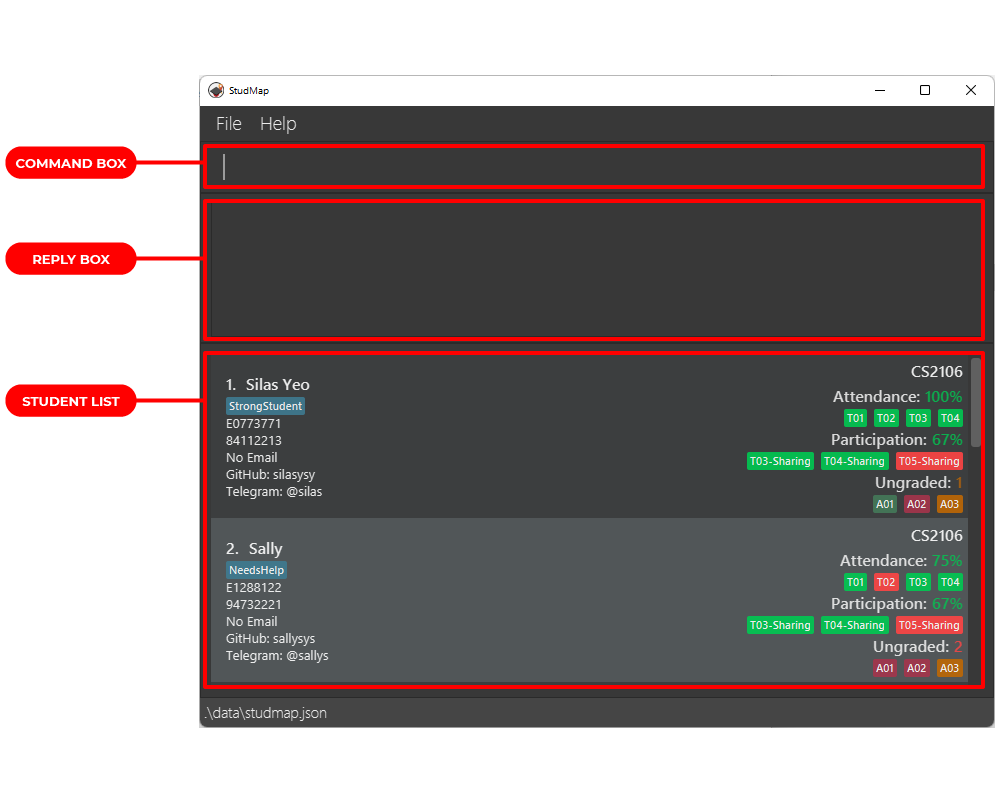
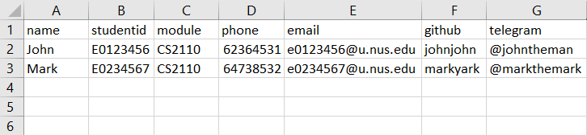

# Overview

StudMap is a lightweight desktop app for managing your students and organizing your teaching assistant (TA)
responsibilities. It’s optimized for use via a Command Line Interface (CLI), meaning that you give instructions to
StudMap through a text box, and StudMap just does it for you — it’s like magic. Yet, it has all the benefits of a
traditional application with a graphical interface: you can still see, at a glance, a neat overview of what you need to
see. If you type fast, StudMap can get your student management tasks done faster than anything else.

---

# Why StudMap?

Let’s face it — nobody loves keeping track of administrative details. It’s not the most interesting part of any job. If
you are a TA for a computing [module](#module), you probably didn’t sign up out of your love for admin work. Sadly,
administrative work is a necessary evil for TAs, so the best you can do is to make conquering it more efficient.

## What do TAs do?

As a TA, you will find yourself juggling various tasks:

1. Grading of assignments, and managing this grading process
2. Tracking attendance of students for various classes
3. Managing your students’ progress

Managing these may be initially easy, but they can quickly pile up and become more tedious if not handled properly,
especially with the tools available.

## What tools do TA currently use?

### Spreadsheets

One of the tools you may commonly encounter is spreadsheets, such
as [Microsoft Excel](https://www.microsoft.com/en-us/microsoft-365/excel)
or [Google Sheets](https://www.google.com/sheets/about/), often provided by
the head teaching assistant. However, when using these tools, you may notice that there are a lot of redundant features
which you don’t use, but clutter up your screen. Some tools you actually want to use are instead hidden in the
stash of icons and menus that you need to painstakingly sieve through.

That’s not even the worst part! The module you’re teaching might demand separate Excel sheets to keep track of different
items such as assignments and attendance which can be a huge hassle. Indeed, during our research, this is a point
brought up by multiple TAs.

### Note-Taking Applications

After being annoyed by all the Excel sheets, some TAs fall back to personal note-taking applications, such as Apple
Notes, Microsoft OneNote, or Notepad. If you use these, however, you realize that formatting is often difficult to do.
Useful functionalities like sorting and filtering are also difficult to access, if not non-existent.

## The Lament of TAs

After trying all of these tools, you may start wondering: why am I wasting time on admin work when it can be better
spent doing more productive tasks for myself or my students? You’re tired, and you just want to catch up on your sleep
schedule!

Be assured that you are not alone in this endeavor. According to an analysis done by University College London on the
Teaching and Learning International Survey, a significant portion of teachers consider too much admin work as a source
of their workload stress, which can in turn affect their mental well-being. You wouldn’t want this to happen to you!

## Our Solution

StudMap is our solution for you. It is a lightweight desktop app that addresses your needs as a TA. With a set of
essential yet easy-to-use features, we aim to fill the void between Excel spreadsheets and traditional note-taking apps,
to provide you the necessary tool to perform record keeping effectively. This user guide is a reference for you, so that
you know how to make the most out of StudMap.

---

# How to use this User Guide

Thank you for choosing StudMap! This user guide will help you navigate our beloved software.

1. You can head off to the [Quick Start](#quick-start) section for a quick tutorial.
2. If you’re already using StudMap, check out the [Features](#features) section to get in-depth information about each
   command
   you can give StudMap.
3. For advanced users, check out the [Command Summary](#command-summary) for an easy all-in-one record for all the
   commands.
4. If you see any unfamiliar terms, check out the [Glossary](#glossary) for more information.

# Table of Contents

* Table of Contents
{:toc}

---

# Quick Start

If you’re new to StudMap, this is the tutorial for you! Here are the steps for you to get started:

1. Ensure you have Java 11 or above installed in your computer. Download
   Java [here](https://www.oracle.com/sg/java/technologies/downloads/).

2. Download the latest `studmap.jar` [here](https://github.com/AY2223S1-CS2103T-W13-1/tp/releases).

3. Create a folder where you want to use StudMap, and copy `StudMap.jar` into it. This will be the home folder
   for StudMap.

4. Double click StudMap.jar to start the app. You should see a new window similar to the figure below appear in a few
   seconds. Notice that StudMap contains some sample data.

   

   Take note of the following elements in the interface:

    * The **Command Box** is where you give instructions to StudMap. These instructions are called [Commands](#commands)
      .
    * The **Reply Box** is where StudMap responds to your instructions.
    * The **Student List** is a list of your students. StudMap updates this list as you give it commands to do so.

5. Let’s try out some commands! Type or copy a command into the Command Box and press Enter to execute it.

    * `list`
        * This updates the Student List with all the students you have.
    * `n/John Doe m/CS2103T id/E1234567`
        * This adds a student named John Doe with student ID `E1234567` into StudMap, who is taking the module `CS2103T`
          .
          This is one of the ways you can add a new student into StudMap.
    * `delete 3`
        * This deletes the 3rd student currently shown in the Student List.
    * `clear`
        * This deletes all the students, so you can start with a clean slate!

6. You may be concerned: you’re probably already using some Excel sheet of sorts for keeping track of student data – and
   you certainly don’t want to transfer all this data manually to StudMap! We’ve got you covered.

   Download this [Student Information Template](files/import_template.csv). If you want a sample of how to use it, check
   out this [Example Template](files/example_template.csv), or check out
   [Import Command](#import-students-from-csv-file-import) for more details.

7. That’s all for the tutorial! Check out the [Features](#features) section for more detailed information about each
   command.
   We hope you enjoy using StudMap!

---

# Features

## Introduction

Welcome to the Features section of StudMap. We have three categories of
features: [Student List Management](#student-list-management), and
[Student Updating](#student-updating), and [Miscellaneous](#miscellaneous). They have been color-coded for your
convenience and viewing pleasure.

Read on to learn in detail about the plethora of features that StudMap has in store for you! Worried about the learning
curve? StudMap is designed to be extremely intuitive, with in-built help messages guiding you every step of the way!

Follow the guide below, and you would be on track to mastering all the necessary commands in no time.

## How to use this section

Before we start looking at each feature in detail, let’s take note of some conventions that we will use in this guide.
This will help you understand the guide better!

**:information_source: Understanding the command format:** 

* Words in `UPPER_CASE` are the parameters to be supplied by the user. 
  e.g. in `add n/NAME`, `NAME` is a parameter which can be used as `add n/John Doe`.

* Items in square brackets are optional. 
  e.g. `n/NAME [t/TAG]` can be used as `n/John Doe t/friend` or as `n/John Doe`.

* Items with `…`​ after them can be used multiple times including zero times. 
  e.g. `[t/TAG]…​` can be used as ` ` (i.e. 0 times), `t/friend`, `t/friend t/family` etc.

* Parameters can be in any order. 
  e.g. if the command specifies `n/NAME p/PHONE`, `p/PHONE n/NAME` is also acceptable.

* If a parameter is expected only once in the command, but you specified it multiple times, only the last occurrence of
  the parameter will be taken. 
  e.g. if you specify `p/12341234 p/56785678`, only `p/56785678` will be taken.

* Extraneous parameters for commands that do not take in parameters (such as `help`, `list`, `exit` and `clear`) will be
  ignored. 
  e.g. if the command specifies `help 123`, it will be interpreted as `help`.

## Student List Management

### Adding a student: `add`

Adds a student to the StudMap.

New student attending your class? Add them into StudMap to start managing their records!

Format: `add n/NAME m/MODULE id/ID [p/PHONE] [e/EMAIL] [g/GITNAME] [h/HANDLE] [t/TAG]…​`

:bulb: <b>Tip:</b>
A student can have any number of tags (including 0)

Examples:

* `add n/John Doe m/CS2103T id/E1234567` adds student named `John Doe` taking `CS2103T` with student id `E1234567`.
* `add n/Betsy Crowe t/PotentialTA e/betsycrowe@example.com id/E3141592 m/CS2101 p/1234567` adds student
  named `Betsy Crowe` taking `CS2101` with student id `E3141592`, email `betsycrowe@example.com`, phone number `1234567`
  and tagged as `PotentialTA`.
* `add n/Silos Yao t/StrongStudent g/silosyao id/E1234567 m/MA5203` adds student named `Silos Yao` taking `MA5203` with
  student id `E1234567` and tagged as `StrongStudent`.

### Deleting a student : `delete`

Deletes the specified student from the StudMap.

Did your student withdraw from the module midway through the semester? You can remove him from so that your StudMap
remains clutter-free!

:bulb: <b>Tip:</b>
* You can use [Find](#locating-students-by-name-find) to help locate the student you wish to delete first.  

Format: `delete INDEX`

* Deletes the student at the specified `INDEX`.
* The index refers to the index number shown in the displayed student list.
* The index **must be a positive integer** 1, 2, 3, …​

Examples:

* `list` followed by `delete 2` deletes the 2nd student in the StudMap.
* `find Betsy` followed by `delete 1` deletes the 1st student in the results of the `find` command.

### Clearing all entries : `clear`

Clears all entries from the StudMap.

Format: `clear`

### Import students from CSV file: `import`

Imports student data from a CSV file stored on your computer.

Format: `import`

* Importing student data will add students to the existing student list, and will not clear any existing students
* Running the command will open a file browser for you to select the CSV file to import
* The CSV format accepted by StudMap is strict! Please use the template provided in the link below

:exclamation: <b>Caution:</b>
StudMap currently does not support any commas in any data field (cell) when importing a CSV file. Please avoid inputting any data
that has commas in the CSV.

For your convenience, please download the import template here: [template csv](files/import_template.csv)

Example Usage: Importing a fresh batch of students as a new StudMap user

1. Remove the default list of students by typing `clear`
2. Modify the import template using the CSV editor of your choice (e.g. Excel, Notepad)
   
   *Example of a properly edited import template*
3. Type the `import` command and select the CSV file you have modified
4. If done correctly, StudMap will create the new students using the data from the CSV file uploaded

### Listing all students : `list`

Shows a list of all students in the StudMap.

Format: `list`

### Locating students by name: `find`

Finds students whose names contain any of the given keywords.

Format: `find KEYWORD [MORE_KEYWORDS]`

* The search is case-insensitive. e.g. `hans` will match `Hans`
* The order of the keywords does not matter. e.g. `Hans Bo` will match `Bo Hans`
* Only the name is searched.
* Only full words will be matched e.g. `Han` will not match `Hans`
* Students with name matching at least one keyword will be returned (i.e. `OR` search). e.g. `Hans Bo` will
  return `Hans Gruber`
  , `Bo Yang`

Examples:

* `find John` returns `john` and `John Doe`
* `find alex david` returns `Alex Yeoh`, `David Li` 
  <!-- TODO:  -->
  [Sample UI To be added]

### Sorting the students: `sort`

Sorts the list by the specified attribute in the specified order.

When managing your students, you might want to focus on a certain aspect of the module to track. For instance, you may
wish to clamp down on absenteeism and identify students who are constantly missing from class. To achieve this, we can
sort the StudMap by `ATTENDANCE`.

Format: `sort ORDER a/ATTRIBUTE`

- `ORDER`: You can specify the order you wish to sort your StudMap.
    - `asc`: Sort in ascending order.
    - `dsc`: Sort in descending order.
- `ATTRIBUTE`: You can specify the attribute which you want to sort the StudMap by. Currently, the following attributes
  are supported:
    - `NAME`
    - `MODULE`
    - `PHONE`
    - `ID`
    - `GIT`
    - `HANDLE`
    - `EMAIL`
    - `ATTENDANCE`
    - `ASSIGNMENT`
    - `PARTICIPATION`

**:information_source: Note 1:** If student has no records for the specified sorting attribute, they will be sorted to
the end of the StudMap.  

**:information_source: Note 2:** When sorting by `ASSIGNMENT`, we are actually sorting by number of marked assignments.

**:information_source: Note 3:** When sorting by `ATTENDANCE` and `PARTICIPATION`, we are sorting
by `% of classes attended` and `% of components participated` correspondingly.  

Examples:

* `sort asc a/attendance` sorts list by `ATTENDANCE` in **ascending** order
* `sort asc a/name` sorts list by `NAME` in **ascending** order
* `sort dsc a/phone` sorts list by `PHONE` in **descending** order

### Filtering the students: `filter`

Filters students from the StudMap based on different
categories.

You might want to check on the progress of weaker students you tagged as `NeedsMoreHelp`, filter by tag to focus on
these students. You may be teaching multiple modules at the same time, filter by module so that your students from
another module do not clutter your screen. You might want to keep track of the number of assignment submissions you have
yet to grade, filter by assignment to achieve this.

Formats:

- `filter t/Keyword [MORE_KEYWORDS]`
    * Filters students specific to the category "tag" represented with the prefix `t/`
- `filter m/Keyword [MORE_KEYWORDS]`
    * Filters students specific to the category "module" represented with the prefix `m/`
- `filter a/Keyword [MORE_KEYWORDS]`
    * Filters students specific to the category "assignment" represented with the prefix `a/`

Example:

* `filter t/ friends` will return a filtered list of students
  that are tagged as friends
* `filter m/ cs2103t` will return a filtered list of students
  that are enrolled in the module cs2103t.
* `filter a/ a01` will return a filtered list of students
  that are working on assignment A01.
* `filter t/friends family` will return a filtered list of
  students that are tagged as friends family or both.

## Student Updating

### Editing a student : `edit`

Edits an existing student in the StudMap.

Need to update outdated student details? You can easily edit that field without deleting and re-adding the student.

:bulb: <b>Tip:</b>
* You can use [Find](#locating-students-by-name-find) to help locate the student you wish to edit first.  

Format: `edit INDEX [n/NAME] [p/PHONE] [e/EMAIL] [m/MODULE] [id/ID] [g/GITNAME] [h/TELEHANDLE] [t/TAG]…​`

* Edits the student at the specified `INDEX`. The index refers to the index number shown in the displayed student list.
  The index **must be a positive integer** 1, 2, 3, …​ or use `all` to edit all students currently displayed.
* **At least one of the optional fields** must be provided.
* Existing values will be updated to the input values.
* When editing tags, the existing tags of the student will be removed i.e. adding of tags is not cumulative.
* You can remove all the student's tags by typing `t/` without specifying any tags after it.
* You can remove the student's phone, email, GitName, TeleHandle by typing `p/`, `e/`, `g/`, `h/` respectively.

Examples:

* `edit 1 p/91234567 e/johndoe@example.com` Edits the phone number and email address of the 1st student to be `91234567`
  and `johndoe@example.com` respectively.
* `edit 2 n/Betsy Crower t/` Edits the name of the 2nd student to be `Betsy Crower` and clears all existing tags.

### Mark attendance of student: `mark`

Mark students as present or absent for a specified class.

Format: `mark INDEX/ALL ATTENDANCE c/CLASS`

*`INDEX`: You can specify the index of the student you want to mark attendance for. The index refers to the index number
shown in the displayed student list.
The index **must be a positive integer** 1, 2, 3, …​
*`ALL`: You can mark attendance for all students currently displayed.

* Attendance accepts two values only: `present` and `absent`
* :warning: Class names should only consist of alphanumerics, spaces, dashes and underscores! Using any other
  character will lead to your class name being **rejected**
* Marking an **existing class** as either `present` or `absent` will **overwrite** the existing record

Examples:

* `mark 1 present c/T01` marks the first student as present for class `T01`
* `mark all absent c/T04` marks all students in the list as absent for class `T04`

### Unmark attendance of a student: `unmark`

Removes the attendance record of a specific class from students.

Format: `unmark INDEX/ALL c/CLASS`

*`INDEX`: You can specify the index of the student you want to remove attendance record for. The index refers to the
index number shown in the displayed student list.
The index **must be a positive integer** 1, 2, 3, …​
*`ALL`: You can remove attendance record for all students currently displayed.

* StudMap allows for attendances to be removed even if the student never had any record for that class
  (i.e. no error will be thrown)

Examples:

* `unmark 1 c/T01` removes the attendance record for class `T01` from the first student
* `unmark all c/T04` removes the attendance record for class `T04` from all students in the list

### Grade assignment for student: `grade`

You can change the grading status for the assignments using this command. If the record of the assignment does not yet
exist for the specified student, a new entry for the assignment will be automatically created for the student. This can
help you to better keep track of assignments that you have graded or received.

**:information_source: Note 1:** The name of assignments should contain only numbers and letters (all upper case). If
you include any lower case in the assignment name, it will be automatically converted to upper case.

Format: `grade INDEX/ALL STATUS a/ASSIGNMENT`

- `INDEX`: You can specify the index of the student you want to change the assignment grading status for. The index **
  must be a positive integer** 1, 2, 3, …​
- `ALL`: You can modify the assignment grading status for every student in the currently displayed list.
- `STATUS`: You can specify the grading status for the assignment. Currently, following three statuses are supported:
    - `new`: The assignment has just been assigned to the student and hence it has not been submitted nor marked yet.
    - `received`: You have received the assignment submission from the student, but you have not graded it yet.
    - `marked`: You have received and graded the assignment.
- `ASSIGNEMNT`: You can specify the assignment which you want to change the grading status for.

Examples:

* `grade 1 new a/A01` changes the assignment grading status for assignment `A01` of the first student in the list
  to `new`. Add an entry of `A01` into the first student's record if it does not exist yet.
* `grade all marked a/A02` changes the assignment grading status for assignment `A02` of every student in the list
  to `marked`.

### Remove assignment from student: `ungrade`

You can remove the specified assignment from the student's record.

Format: `ungrade INDEX/ALL a/ASSIGNMENT`

- `INDEX`: You can specify index of the student remove the assignment from. The index **must be a positive integer** 1,
  2, 3, …​
- `ALL`: You can remove the assignment for all students in the currently displayed list.
- `ASSIGNMENT`: You can specify the record of the assignment to be removed.

Examples:

* `ungrade 1 a/A01` removes assignment `A01` from the first student.
* `ungrade all a/A01` removes assignment `A01` from all students in the currently displayed list

### Recording participation of a student: `participate`

You can record participation of student(s)

Format: `participate INDEX/ALL STATUS p/COMPONENT`

- `INDEX` could be specified or use `ALL` to record the participation component for all students in the list. The
  index **must be a positive integer** 1, 2, 3, …​
- `ALL`: You can record the participation component for all students in the currently displayed list.
- `STATUS` is either `yes` for participated or `no` for not participated
- `COMPONENT` is the participation component

Examples:

* `participate 1 yes p/P01` records first student as having **participated** for participation component `P01`.
* `participate 1 no p/P02` records first student as having **not participated** for participation component `P01`.
* `participate all yes p/P03` records all student as having **participated** for participation component `P03`.

### Removing participation of a student: `unparticipate`

You can remove participation of student(s)

Format: `unparticipate INDEX/ALL p/COMPONENT`

- `INDEX` could be specified or use `ALL` to remove specified participation component for all students in the list. The
  index **must be a positive integer** 1, 2, 3, …​
- `ALL`: You can remove the participation component for all students in the currently displayed list.
- `COMPONENT` is the participation component

Examples:

* `unparticipate 1 p/P01` removes participation component `P01` from first student in currently displayed list.
* `unparticipate all p/P03 ` removes participation component `P03` from all students in currently displayed list.

### Add tag to student: `tag`

You can tag the student(s) with one or more text labels. This can help you to better identify and keep track of them.

**:information_source: Note 1:** The tag should be short and limited to only letters and/or numbers (i.e. no spaces)
.  

**:information_source: Note 2:** The tags are case-sensitive. For example, `goodStudent` and `goodstudent` will
be recognised as different labels.

**:information_source: Note 3:** The tagging command is cumulative, that is, new tags are simply added to the student(s)
and
do not replace their previous tags. To remove tags from the student(s), see [untag](#remove-tag-from-student-untag)
below.  

Format: `tag INDEX/ALL t/TAG [t/OTHER]`

- `INDEX`: You can specify the index of the student you want to add the tag to. The index refers to the index number
  shown in the displayed student list.
  The index **must be a positive integer** 1, 2, 3, …​
- `ALL`: You can add tag(s) to all students currently displayed.
- `TAG`: You can specify the label to be added to the student. At least one label should be specified when you use this
  command
- `OTHER`: You can also specify other tags that you might also want to add to your student(s).

Examples:

* `tag 1 t/goodStudent` adds the tag of "goodStudent" to the first student in the current list.
* `tag all t/goodstudent t/potentialTA` add both `goodStudent` and `potentialTA` tag to the all student in the current
  list.

### Remove tag from student: `untag`

Remove the specified tag(s) from the student(s).

Format: `untag INDEX/ALL t/TAG [t/OTHER]`

- `INDEX`: You can specify index of the student to remove the tag from. The index refers to the index number shown in
  the displayed student list.
  The index **must be a positive integer** 1, 2, 3, …​
- `ALL`: You can remove the tag for all students in the currently displayed list.
- `TAG`: You can specify the `TAG` to remove.There should be at least one label to be removed when you use this command.
  For the restrictions on the format of a `TAG`, see Note 1 for [Add tag to student](#add-tag-to-student-tag).
- `OTHER`: You can also include multiple tags to be removed from your student(s).

Examples:

* `untag 1 t/needMoreTime` removes the tag of `needMoreTime `from the first student in the current list.
* `untag all t/needMoreTime t/late` removes the tag of `needMoreTime` and `late` from all students in the current list.

## Miscellaneous

### Exiting the program : `exit`

Exits the program.

Format: `exit`

### Saving the data

StudMap data are saved in the hard disk automatically after any command that changes the data. There is no need to save
manually.

### Editing the data file

StudMap data are saved as a JSON file `[JAR file location]/data/studmap.json`. Advanced users are welcome to update data
directly by editing that data file.

:exclamation: <b>Caution:</b>
If your changes to the data file makes its format invalid, StudMap will discard all data and start with an empty data file at the next run.

### Viewing help : `help`

Confused about the usage of a certain feature? Don't worry, self-help is available on the comprehensive online User
Guide.

Shows a message linking to the online User Guide.

Format: `help`

---

# FAQ

**Q**: How do I transfer my data to another Computer? 
**A**: Install the app in the other computer and overwrite the empty data file it creates with the file that contains
the data of your previous StudMap home folder.

---

# Command Summary

| Action                                                                         | Format, Examples                                                                                                                                                                                         |
|--------------------------------------------------------------------------------|----------------------------------------------------------------------------------------------------------------------------------------------------------------------------------------------------------|
| **[Add](#adding-a-student-add)**                                               | `add n/NAME m/MODULE id/ID [p/PHONE] [e/EMAIL] [g/GITNAME] [h/HANDLE] [t/TAG]…​`   e.g., `add n/John Doe p/98765432 e/johnd@example.com m/CS2103T id/E1234567 g/user1 h/@user1 t/friends t/owesMoney` |
| **[Clear](#clearing-all-entries--clear)**                                      | `clear`                                                                                                                                                                                                  |
| **[Delete](#deleting-a-student--delete)**                                      | `delete INDEX`  e.g., `delete 3`                                                                                                                                                                      |
| **[Edit](#editing-a-student--edit)**                                           | `edit INDEX [n/NAME] [p/PHONE] [e/EMAIL] [m/MODULE] [id/ID] [g/GITNAME] [h/TELEHANDLE] [t/TAG]…​`   e.g.,`edit 1 p/91234567 e/johndoe@example.com`                                                    |
| **[Find](#locating-students-by-name-find)**                                    | `find KEYWORD [MORE_KEYWORDS]`  e.g., `find James Jake`                                                                                                                                               |
| **[List](#listing-all-students--list)**                                        | `list`                                                                                                                                                                                                   |
| **[Help](#viewing-help--help)**                                                | `help`                                                                                                                                                                                                   |
| **[Sort](#sorting-the-students-sort)**                                         | `sort ORDER a/ATTRIBUTE`   e.g., `sort asc a/name`                                                                                                                                                    |
| **[Filter](#filtering-the-students-filter)**                                   | `filter`                                                                                                                                                                                                 |
| **[Mark](#mark-attendance-of-student-mark)**                                   | `mark INDEX/ALL ATTENDANCE c/CLASS`   e.g., `mark 1 present c/T01`                                                                                                                                    |
| **[Unmark](#unmark-attendance-of-a-student-unmark)**                           | `unmark INDEX/ALL c/CLASS`   e.g., `mark 1 c/T01`                                                                                                                                                     |
| **[Add tag](#tag-student-with-label-tag)**                                     | `tag INDEX/ALL t/TAG [t/OTHER]`   e.g., `tag 2 t/goodStudent`                                                                                                                                         |
| **[Remove tag](#remove-tag-from-student-untag)**                               | `untag INDEX/ALL t/TAG [t/OTHER]`   e.g., `untag 2 t/goodStudent`                                                                                                                                     |
| **[Grade assignment](#grade-assignment-for-student-grade)**                    | `grade INDEX/ALL STATUS a/ASSIGNMENT`   e.g., `grade 1 new a/A01`                                                                                                                                     |
| **[Remove assignment](#remove-assignment-from-student-ungrade)**               | `ungrade INDEX/ALL a/ASSIGNMENT`   e.g., `ungrade 1 a/A01`                                                                                                                                            |
| **[Record participation](#recording-participation-of-a-student-participate)**  | `participate INDEX/ALL STATUS p/COMPONENT`   e.g., `participate 2 yes p/C01`                                                                                                                          |
| **[Remove participation](#removing-participation-of-a-student-unparticipate)** | `unparticipate INDEX/ALL p/COMPONENT`   e.g., `unparticipate 2 p/C01`                                                                                                                                 |
| **[Import CSV](#import-students-from-csv-file-import)**                        | `import`                                                                                                                                                                                                 |

---

# Glossary

### Commands

Commands are instructions for StudMap, and the main way to interact with it! Check out the [Features](#features) section
to see what commands are available.

### Module

Each module of study has a unique module code consisting of a two- or three-letter prefix that generally denotes the
discipline, and four digits, and sometimes a suffix. e.g. `CS2101`, `CS2103T`.